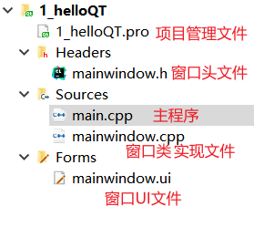
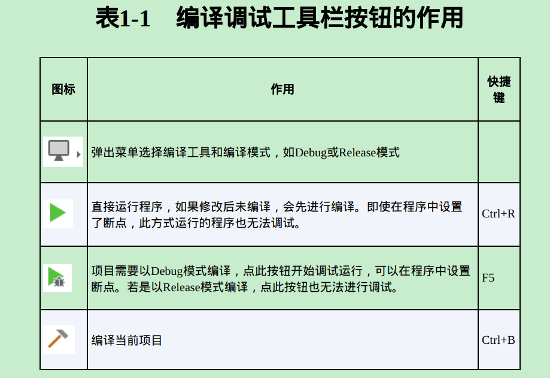
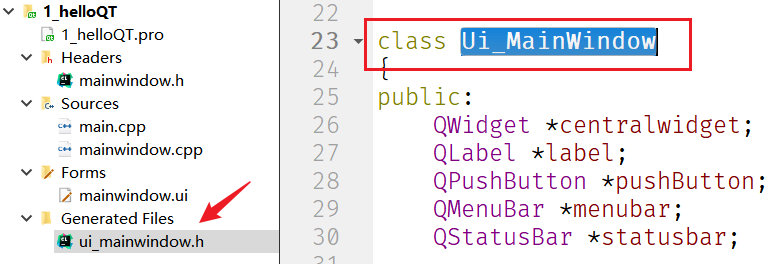
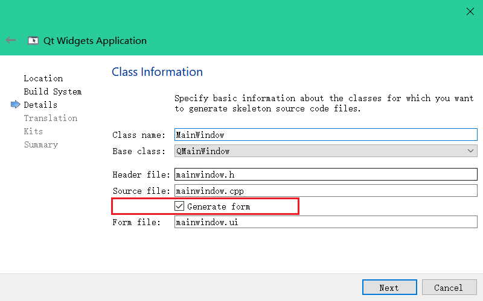
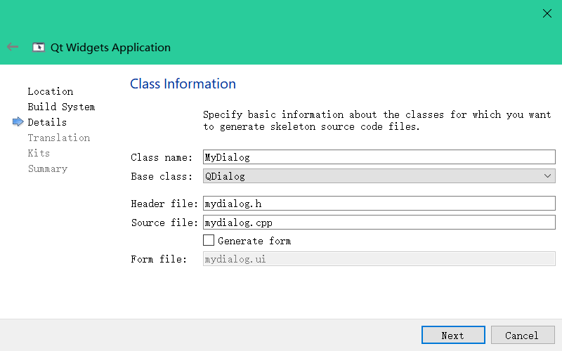

# QT开发环境

安装最后一个开源离线版：[Index of /archive/qt/5.14/5.14.2](https://download.qt.io/archive/qt/5.14/5.14.2/)，里面自带QTCreator。（编译器选择，按需选择）

QT Creator设置：

- 设置QT Creator启动时打开上次会话：File → Sessions → Manage... → √上 `Restore last session on startup`（启动时恢复上一个会话）。
- 设置字体大小。
- 设置主题。

# Qt Widgets Application

Qt Widgets Application，支持桌面平台的有图形用户界面（Graphic User Interface，GUI）界面的应用程序。  

创建Qt Widgets Application项目：**1.**New File or Project → **2.**Qt Widgets Application → choose... → 3.Location，项目命名与项目目录选择 → **4.**Build System选择，qmake → **5.**Details，要创建的窗体类和头文件，（选上Generate form，勾了就会创建.ui文件而且生成的代码里会自动添加ui成员变量，如果你要用designer来设置ui就勾上，如果没有界面或者要自己在cpp里添加界面代码就不要勾） → **6.**Translation，默认，界面语言翻译配置 → **7.**Kits，32和64位都选上吧 → **8.**Summary，项目目录确认与更改 → **9.**Finished。

Details配置中Base Class说明——QDialog、QWidget、QMainWindow的区别：

- QWidget是所有用户界面对象的基类。QDialog和QMainWindow都继承自QWidget，也就是说QDialog和QMainWindow在QWidget的基础上拓展了一些东西。
  dialog —— 对话框；mainwindow —— 主窗口；widget —— 小部件。

> 官方文档：
> QMainWindow类：https://doc.qt.io/qt-5/qmainwindow.html 
> QWidget类：https://doc.qt.io/qt-5/qwidget.html
> QDialog类：https://doc.qt.io/qt-5/qdialog.html

Qt Widgets Application项目目录说明：



编译与调试：



[《Qt5：Widget、Dialog和MainWindow之间的关系》_Snow__Sunny的博客-CSDN博客](https://blog.csdn.net/Snow__Sunny/article/details/108831463#:~:text=Widget翻译,立创建用户界面。)：

>### Widget（小部件）
>
>小部件是用户界面的原子：它从窗口系统接收鼠标，键盘和其他事件，并在屏幕上绘制自己（继承了绘制类）。每个小部件都是矩形的，它们按Z顺序排序。
>
>小部件包括窗口小部件和非窗口小部件。
>
>1、窗口小部件（可以称为独立窗口或者顶级窗口小部件）就是我们创建Qt桌面应用程序时，自动生成的窗口界面，包含标题栏，可以设置标题和图标，还有什么最大最小化以及退出按钮，它本身就是父窗口（未嵌入其它窗口）。MainWindow和Dialog以及Dialog的子类都是典型的窗口小部件。
>
>```cobol
>QWidget *parent = 0
>```
>
>2、非窗口小部件是子小部件，它是嵌入在父窗口中的，不能独立显示，只能显示在其父窗口小部件中。Qt  Designer中的所有小部件都属于非窗口小部件，都需要嵌入到父窗口小部件中，用于显示数据和状态信息，接收用户输入。
>
>### MainWindow（主窗口）
>
>主窗口提供了构建应用程序用户界面的框架。主窗口拥有自己的布局，包括中央区域、菜单栏、工具栏、状态栏以及Dock小部件，具体分布如下图所示。布局的中心区域可以被任何类型的小部件占用，也就是我们常用来拖拉控件的区域，其它区域可以没有，但是不能没有中央区域。最常见的主窗口就是WPS。稍微大一点的项目就使用QMainWindow来创建，嵌入到主窗口使用QWidget，辅助窗口使用QDialog，如果是内容比较单一的项目，使用QDialog基本上也可以搞定了。
>
>### Dialog（对话框）
>
>Dialog（对话框）一般用作辅助窗口，为用户提供选项并主窗口进行交互，弹出一个对话框，然后选择“OK”或者“cannel”。此外，Qt也提供了许多现成的标准对话框，可用于标准任务，如文件对话框、字体对话框、颜色对话框、消息对话框等。 对话框又分为模态对话框和非模态对话框。

# GUI应用设计基础

## UI文件设计与运行机制

### 文件组成

Qt Widgets Application项目的基本组成：


目录：

1. Headers：用于存放所有的头文件。
2. Sources：用于存放项目所有C++源代码文件。
3. Forms：用于存放所有窗口的界面文件。

文件：

1. .pro文件：项目管理文件，用于存储项目设置的文件。
2. main.cpp：程序入口。
3. mainwindow.ui：主窗口界面文件，是一个用XML格式来存储窗体上的元件及其布局信息的文件。
4. mainwindow.h：所设计的窗口类的头文件。
5. mainwindow.cpp：是mainwindow.h里定义的类的实现文件；（在C++里，任何窗体或界面组件都是用类封装的，一个类一般有一个头文件(.h文件)和一个源程序文件(.cpp文件)，一个用于类定义（类定义及类成员的声明），一个用于类行为（功能函数）具体实现）

当编译后，会根据每个窗体上的组件及其属性、信号与槽的关联等会自动生成的一个类的定义文件。上面只有一个主窗口，会生成一个类的定义文件ui_mainwindow.h，类名Ui_MainWindow。




### 运行机制

通过分析各个窗体文件的内容及功能，就可以知道它们是如何一起工作来实现界面的创建与显示的。以上面图中创建的项目为例。

**1、mainwindow.h和mainwindow.cpp：**

mainwindow.h：窗体类头文件，创建项目时选的窗体基类是哪个，该头文件就会定义一个继承该基类的类；该文件内容如下：

```c++
#ifndef MAINWINDOW_H
#define MAINWINDOW_H

#include <QMainWindow>
/*  声明了一个命名空间——Ui，里面包含一个类MainWindow，
	注意这个类是ui_mainwindow.h文件里定义的类 
*/
QT_BEGIN_NAMESPACE
namespace Ui { class MainWindow; }
QT_END_NAMESPACE
/* 窗体类定义，继承于QMainWindow的类的定义 */
class MainWindow : public QMainWindow
{
    //  Q_OBJECT，是使用Qt的信号与槽（signal和slot）机制的类都必须加入的一个宏
    Q_OBJECT         

public:
    MainWindow(QWidget *parent = nullptr);  // 构造函数
    ~MainWindow();  // 析构函数

private:
    /*
    用前面声明的namespace Ui里的Widget类定义的，
    所以指针ui是指向可视化设计的界面，
    后面会看到要访问界面上的组件，都需要通过这个指针ui
    */
    Ui::MainWindow *ui; 
};
#endif // MAINWINDOW_H
```

mainwindow.cpp：用于mainwindow.h中定义的窗体类的功能的具体实现。

```c++
#include "mainwindow.h"
#include "ui_mainwindow.h"   //  注意这里编译后自动加入了生成的与UI文件mainwindow.ui对应的类定义文件
/*
	构造函数，意为执行父类QMainWindow的构造函数，创建一个Ui::MainWindow类的对象——ui。
	这个ui就是MainWindow类的private部分定义的指针变量ui。
*/
MainWindow::MainWindow(QWidget *parent)
    : QMainWindow(parent)
    , ui(new Ui::MainWindow)
{
    // 执行Ui::MainWindow类的setupUi()函数，这个函数实现窗口的生成与各种属性的设置、信号与槽的关联
    ui->setupUi(this);  

}

MainWindow::~MainWindow()
{
    // 删除用new创建的指针ui
    delete ui;
}
```

总结：Ui::MainWindow类 是用于描述可视化设计的窗体的一个类，用于描述整个窗体；而  MainWindow类 则是对可视化设计窗体的功能延伸的描述，是功能描述的集合。（一个用于窗体描述和基本功能实现，一个用于功能拓展）

Ui::MainWindow类的行为如下。

**2、mainwindow.ui和ui_mainwindow.h：**

mainwindow.ui：

- 窗体界面定义文件，是一个XML文件，定义了窗口上的所有组件的属性设置、布局，及其信号与槽函数的关联等。
- 用UI设计器可视化设计的界面都由Qt自动解析，并以XML文件的形式保存下来。
- 在设计界面时，只需在UI设计器里进行可视化设计即可，而不用管widget.ui文件是怎么生成的  。

ui_mainwindow.h：对mainwindow.ui文件编译后生成的一个文件，通过UI设计器更改界面，编译后这个文件也会随之改变。它主要做以下工作：

1. 定义了一个Ui_MainWindow类，用于封装可视化设计的界面。
2. 自动生成了界面各个组件的类成员变量定义，在public部分为窗口界面上每个组件定义了一个指针变量，指针变量的名称就是在UI设计器里设置的objectName。
3. 定义并实现了setupUi()函数，这个函数实现分为三部分：
   - 1.根据可视化设计的界面内容，用C++代码创建界面上各个组件，并设置各个组件的位置、大小、文字内容、字体等属性。
   - 2.调用了函数retranslateUi(Widget)  ，用来设置界面各组件的文字内容属性，如标签的文字、按键的文字、窗体的标题等。将界面上的文字设置的内容独立出来作为一个函数retranslateUi()，在设计多语言界面时会用到这个函数。  
   - 3.设置信号与槽的关联。  
   - 因此在MainWindow的构造函数里调用 ui->setupUI(this)，就实现了窗体上组件的创建、属性设置、信号与槽的关联。  
4. 定义namespace Ui，并定义了一个从Ui_MainWindow继承的类MainWindow。

```c++
/* 信号与槽的关联 */
// 将pushButton按钮的clicked()信号与窗体MainWindow的槽函数close()关联起来
// 当点击按钮时，就会执行MainWindow的close()
QObject::connect(pushButton, SIGNAL(clicked()), MainWindow, SLOT(close()));
// 设置槽函数的关联方式，用于将UI设计器自动生成的组件信号的槽函数与组件信号相关联
QMetaObject::connectSlotsByName(MainWindow);
```


## 信号与槽

信号（Signal），也就是事件。槽（Slot），也就是事件的响应函数，与普通函数的区别在于槽函数可以与信号关联，当信号被触发，槽函数就会被执行。

**信号与槽的关联通过`QObject::connect()`函数实现：**（关联操作由UI Designer自动生成）

```c++
/** 
	QObject::connect()基本格式：QObject::connect(发送信号的对象，SIGNAL(信号)，接收信号的对象，SLOT(槽函数))
**/
QObject::connect(sender, SIGNAL(signal()),receiver, SLOT(slot()));
// 关联示例：按钮的点击事件，触发窗体的close()执行
QObject::connect(pushButton, SIGNAL(clicked()), MainWindow, SLOT(close()));
// QObject是所有类的基类，connect()是QObject的一个静态函数，因此可以省略QObject
connect(pushButton, SIGNAL(clicked()), MainWindow, SLOT(close()));
```

信号，可以看成是一个特殊的函数；槽函数：与信号关联后，当信号被触发时执行的函数。

**信号与槽的使用规则：**

1. 一个信号可以关联多个槽，当信号被触发时槽函数按建立关联的先后顺序依次执行。
2. 当信号与槽函数带参数时，在在connect()函数里，要写明参数的类型，但可以不写参数名称。  
3. 多个信号可以关联同一个槽。
4. 一个信号可以关联另外一个信号，这样当一个信号发射时另一个也会被发射。
5. 严格的情况下，信号与槽的参数个数和类型需要一致，至少信号的参数不能少于槽的参数。如果不匹配，会出现编译错误或运行错误。
6. 在使用信号与槽的类中，必须在类的定义中加入宏Q_OBJECT。  
7. 当一个信号被发射时，与其关联的槽函数通常被立即执行，就像正常调用一个函数一样。只有当信号关联的所有槽函数执行完毕后，才会执行发射信号处后面的代码。  

## 可视化UI设计

可视化设计：利用QT Creator的Designer来生成槽函数原型和UI框架。

要使用可视化设计，需要在创建窗体类和头文件时需要勾选Generate form。



创建完毕，在Design里面拖拽控件到窗体即可导入相关控件，还可以配置信号与槽、更改控件属性等，当编译时会自动生成相关文件——比如上面的ui_mainwindow.h文件。

可视化UI设计的缺点：有些组件无法可视化添加到界面上。


## 代码化UI设计

**概述：**

UI的可视化设计，只是通过一定处理使得可以根据UI来生成底层的C++代码，所有的UI底层都是C++代码实现，通过QT的Designer可以快速地进行界面设计，但可视化设计毕竟有所局限，有些控件没有或者有些功能仅仅通过可视化编程实现不了，那就需要手动通过C++代码来写UI界面了。

代码化UI设计：纯写C++代码来设计UI，界面设计的底层都是C++语言实现，使用C++直接编写UI能实现的功能更加强大，并且也更加灵活。（QT自带实例基本都是纯代码方式实现用户界面）

代码化UI设计的缺点：开发效率低，过程繁琐。

纯代码化的UI设计与QT Widgets Application的开发：

1. 创建好窗体类和头文件，不勾选 Generate form。
2. 窗体头文件：添加窗体组件、声明初始化函数、声明槽函数。
3. 窗体源代码文件：对象初始化函数实现、窗体初始化函数实现、析构函数实现、槽函数实现。
4. 编译&运行。
5. 补充：需要使用到QT类库。

**示例——以QDialog基类为例：**

1、基于QDialog基类创建窗体文件：



创建后的文件：

①mydialog.h文件：

```c++
#ifndef MYDIALOG_H
#define MYDIALOG_H

#include <QDialog>

class MyDialog : public QDialog
{
    Q_OBJECT

public:
    MyDialog(QWidget *parent = nullptr);
    ~MyDialog();
};
#endif // MYDIALOG_H
```

②mydialog.cpp文件：

```c++
#include "mydialog.h"

MyDialog::MyDialog(QWidget *parent)
    : QDialog(parent)
{
}

MyDialog::~MyDialog()
{
}
```

③main.cpp文件：

```c++
#include "mydialog.h"

#include <QApplication>

int main(int argc, char *argv[])
{
    QApplication a(argc, argv);
    MyDialog w;
    w.show();
    return a.exec();
}
```

可以看出，初始窗体头文件中只有` Q_OBJECT`宏定义和公有的初始化函数、析构函数（仅用于实现删除new创建的对象）；初始窗体cpp文件只有这两个函数的定义（还没有实现内容）。

2、通过代码设计实现UI，操作上来说就是在头文件中声明好一些窗体初始化的方法、组件对象、声明好槽函数等，并在头文件对应的cpp文件中实现声明的函数。

①在mydialog.h文件中声明：

```c++
#ifndef MYDIALOG_H
#define MYDIALOG_H

#include <QDialog>
#include <QCheckBox>
#include <QRadioButton>
#include <QPlainTextEdit>
#include <QPushButton>
class MyDialog : public QDialog
{
    Q_OBJECT
private:
    // 窗体对象的成员
    QCheckBox   *chkBoxUnder;
    QCheckBox   *chkBoxItalic;
    QCheckBox   *chkBoxBold;

    QRadioButton    *rBtnBlack;
    QRadioButton    *rBtnRed;
    QRadioButton    *rBtnBlue;

    QPlainTextEdit  *txtEdit;

    QPushButton     *btnOK;
    QPushButton     *btnCancel;
    QPushButton     *btnClose;
	// UI创建、信号与槽初始化
    void initUI(); // UI创建与初始化
    void iniSignalSlots(); // 初始化信号与槽的连接
private slots:  // 声明槽函数
    void on_chkBoxUnder(bool checked);  // 用于Underline 的clicked(bool)信号的槽函数
    void on_chkBoxItalic(bool checked); // 用于Italic 的clicked(bool)信号的槽函数
    void on_chkBoxBold(bool checked);   // 用于Bold 的clicked(bool)信号的槽函数
    void setTextFontColor();            // 用于设置字体颜色
public:
    MyDialog(QWidget *parent = nullptr);
    ~MyDialog();
};
#endif // MYDIALOG_H
```

②在mydialog.cpp文件中实现：

```c++
#include "mydialog.h"
#include <QHBoxLayout>
#include <QVBoxLayout>
/* 窗体建立前执行初始化 */
MyDialog::MyDialog(QWidget *parent)
: QDialog(parent)
{
    initUI(); //界面创建与布局
    iniSignalSlots(); //信号与槽的关联
    setWindowTitle("Form created manually ME");//设置窗体标题
}

MyDialog::~MyDialog()
{

}
/* 窗体界面创建与布局 */
void MyDialog::initUI()
{
    // 创建 Underline, Italic, Bold三个CheckBox，并水平布局
    chkBoxUnder = new QCheckBox(tr("Underline"));
    chkBoxItalic = new QCheckBox(tr("Italic"));
    chkBoxBold = new QCheckBox(tr("Bold"));

    QHBoxLayout *HLay1=new QHBoxLayout;
    HLay1->addWidget(chkBoxUnder);
    HLay1->addWidget(chkBoxItalic);
    HLay1->addWidget(chkBoxBold);

    // 创建 Black, Red, Blue三个RadioButton，并水平布局
    rBtnBlack=new QRadioButton(tr("Black"));
    rBtnBlack->setChecked(true);//缺省被选中
    rBtnRed=new QRadioButton(tr("Red"));
    rBtnBlue=new QRadioButton(tr("Blue"));

    QHBoxLayout *HLay2=new QHBoxLayout;
    HLay2->addWidget(rBtnBlack);
    HLay2->addWidget(rBtnRed);
    HLay2->addWidget(rBtnBlue);

    //创建 确定, 取消, 退出 三个 QPushButton, 并水平布局
    btnOK=new QPushButton(tr("确定"));
    btnCancel=new QPushButton(tr("取消"));
    btnClose=new QPushButton(tr("退出"));

    QHBoxLayout *HLay3=new QHBoxLayout;
    HLay3->addStretch();
    HLay3->addWidget(btnOK);
    HLay3->addWidget(btnCancel);
    HLay3->addStretch();
    HLay3->addWidget(btnClose);


    //创建 文本框,并设置初始字体
    txtEdit=new QPlainTextEdit;
    txtEdit->setPlainText("Hello world\n\nIt is my demo");

    QFont   font=txtEdit->font(); //获取字体
    font.setPointSize(20);//修改字体大小为20
    txtEdit->setFont(font);//设置字体

    //创建 垂直布局，并设置为主布局
    QVBoxLayout *VLay=new QVBoxLayout;
    VLay->addLayout(HLay1); //添加字体类型组
    VLay->addLayout(HLay2);//添加字体颜色组
    VLay->addWidget(txtEdit);//添加PlainTextEdit
    VLay->addLayout(HLay3);//添加按键组

    setLayout(VLay); //设置为窗体的主布局
}
/* 信号与槽的初始化：实现信号与槽的关联 */
void MyDialog::iniSignalSlots()
{
    //三个颜色  QRadioButton的clicked()事件与setTextFontColor()槽函数关联
    connect(rBtnBlue,SIGNAL(clicked()),this,SLOT(setTextFontColor()));//
    connect(rBtnRed,SIGNAL(clicked()),this,SLOT(setTextFontColor()));//
    connect(rBtnBlack,SIGNAL(clicked()),this,SLOT(setTextFontColor()));//

    //三个字体设置的  QCheckBox 的clicked(bool)事件与 相应的槽函数关联
    connect(chkBoxUnder,SIGNAL(clicked(bool)),this,SLOT(on_chkBoxUnder(bool)));//
    connect(chkBoxItalic,SIGNAL(clicked(bool)),this,SLOT(on_chkBoxItalic(bool)));//
    connect(chkBoxBold,SIGNAL(clicked(bool)),this,SLOT(on_chkBoxBold(bool)));//

    //三个按键与窗体的槽函数关联
    connect(btnOK,SIGNAL(clicked()),this,SLOT(accept()));//
    connect(btnCancel,SIGNAL(clicked()),this,SLOT(reject()));//
    connect(btnClose,SIGNAL(clicked()),this,SLOT(close()));//
}
/* 槽函数实现：点击按钮为文字添加下划线 */
void MyDialog::on_chkBoxUnder(bool checked)
{
    QFont   font=txtEdit->font();
    font.setUnderline(checked);
    txtEdit->setFont(font);
}
/* 槽函数实现：点击按钮设置字体正斜 */
void MyDialog::on_chkBoxItalic(bool checked)
{
    QFont   font=txtEdit->font();
    font.setItalic(checked);
    txtEdit->setFont(font);
}
/* 槽函数实现：点击按钮加粗文字 */
void MyDialog::on_chkBoxBold(bool checked)
{
    QFont   font=txtEdit->font();
    font.setBold(checked);
    txtEdit->setFont(font);
}
/* 槽函数实现：点击复选按钮设置文字颜色 */
void MyDialog::setTextFontColor()
{
    QPalette   plet=txtEdit->palette();
    if (rBtnBlue->isChecked())
    plet.setColor(QPalette::Text,Qt::blue);
    else if (rBtnRed->isChecked())
    plet.setColor(QPalette::Text,Qt::red);
    else if (rBtnBlack->isChecked())
    plet.setColor(QPalette::Text,Qt::black);
    else
    plet.setColor(QPalette::Text,Qt::black);

    txtEdit->setPalette(plet);
}
```

3、编译&运行：得到图形操作界面程序。


## 混合方式设计

当然，可视化设计、代码化设计两种方式可以混用，毕竟可视化设计最终也是生成C++代码的（UI → C++代码）。

尽量使用可视化UI设计，遇到可视化无法解决的才去使用纯代码方式去解决。


