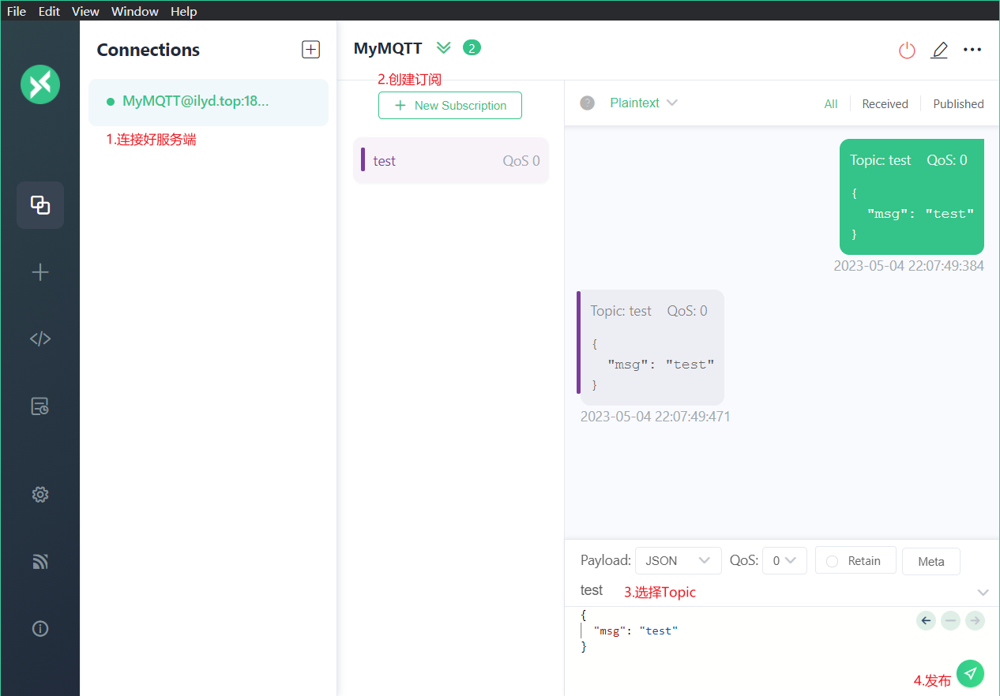
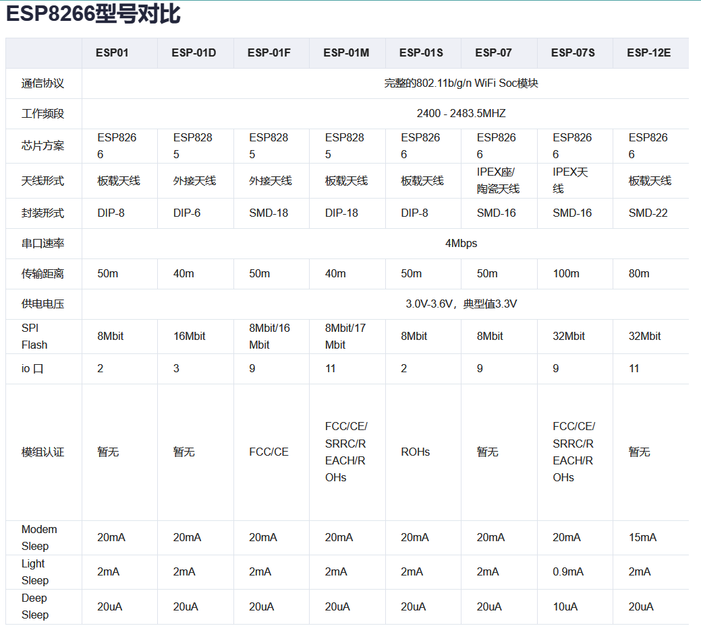
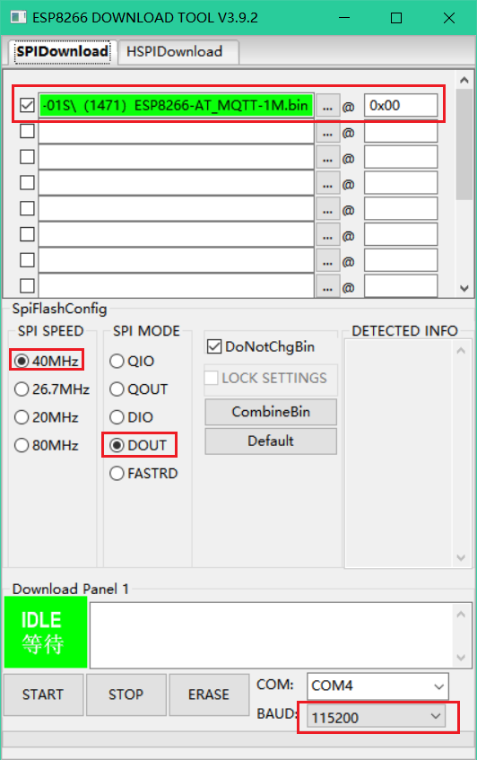
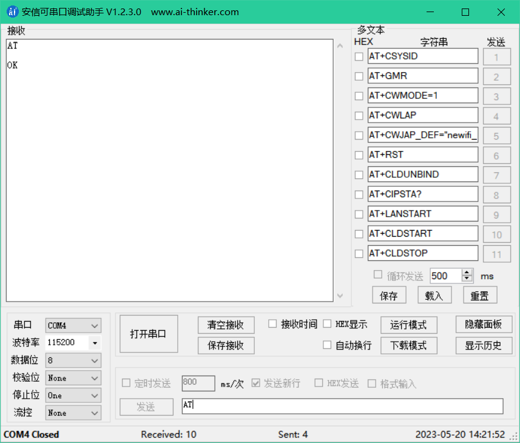
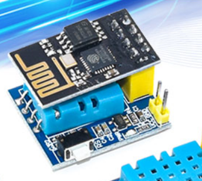

# ESP32开发方式

Arduino IDE开发方式、SDK开发方式、LUA开发方式、Micropython开发方式。

# ESP32-C3-MINI1

## C3开发文档

[ESP32-C3 快速参考手册 — MicroPython 1.18 documentation (01studio.cc)](https://docs.01studio.cc/esp32-c3/quickref.html#networking)

## 开发环境

### Arduino

1、新建一个文件夹`ArdunioProjects`用来存放ESP32支持包。

2、解压`esp32c3_支持ESP32和ESP32S2.zip`后，放到`ArdunioProjects/hardware`中。

3、打开arduino配置首选项，将项目文件夹地址改为`ArdunioProjects`目录，使用绝对路径。

4、工具  → 开发板 → 选择ESP32Arduino（in stetchbook）→ 选开发板。

### VSCode+Arduino

1、安装Arduino插件。

2、View → Command Palette →  Arduino: Board Config、Arduino: Board Manager、Arduino Examples。

3、左下角设置 →  settings →  Open settings → 添加上：

```json
"arduino.path": "D:\\EmbeddedSoftware\\Arduino", //添加这句路径，实际路径改为你安装的文件夹
```

settings.json ：

```json
{
    "workbench.iconTheme": "vscode-icons",
    "editor.linkedEditing": true,
    "files.autoSave": "afterDelay",
    "window.zoomLevel": 1.3,
    "editor.fontLigatures": true,
    "editor.fontFamily": "Fira Code Retina",
    "remote.SSH.remotePlatform": {
        "MyCentOS7": "linux"
    },
    "arduino.path": "D:\\EmbeddedSoftware\\Arduino", //添加这句路径，实际路径改为你安装的文件夹
    "C_Cpp.intelliSenseEngine": "Tag Parser",
    "editor.insertSpaces": true,
    "files.autoGuessEncoding": true,
    "arduino.logLevel": "info",
    "explorer.confirmDelete": false,
    "editor.detectIndentation": false,
}
```

### MicroPython

1、开发软件与固件下载：

下载安装Thonny：[Thonny, Python IDE for beginners](https://thonny.org/)，直接安装即可。

芯片固件下载：[MicroPython - Python for microcontrollers](https://micropython.org/download/)，往下拉找到需要的MCU的固件，ESP32、ESP32—C3、ESP32—S3等，下载最新版的.bin文件。

2、Thonny——配置解析器与固件烧录进芯片：

1. 开发板用USB线与电脑连接。
2. 打开Thonny → 工具 → 选项 → 解释器，然后选择解释器——ESP32的就选ESP32的，ESP32—C3、ESP32—S3就选ESP8266的。
3. 然后点击`安装或更新MicroPython`，选择串口通道、选择下载好的bin文件后点击安装，等待直到出现`done`。（有些板子可能在安装时需要长按板子上的BOOT键）

3、完成。

 4、开发文档：[Quick reference for the ESP8266 — MicroPython latest documentation](https://docs.micropython.org/en/latest/esp8266/quickref.html#)，C3、S3的是8266的，ESP32则是ESP32。或者[ESP32-C3 快速参考手册 — MicroPython 1.18 documentation (01studio.cc)](https://docs.01studio.cc/esp32-c3/quickref.html#networking)。


## 管脚

ESP32C3—MINI 1模组：

| 从ESP往USB接口方向，右边 | 从ESP往USB接口方向，左边 |
| ------------------------ | ------------------------ |
| TXD0                     | GND                      |
| RXD0                     | V3                       |
| IO19                     | NC1                      |
| IO18                     | IO2                      |
| IO9                      | IO3                      |
| IO8                      | NC2                      |
| IO7                      | EN                       |
| IO6                      | NC3                      |
| IO5                      | NC4                      |
| IO4                      | IO0                      |
| IO10                     | IO1                      |
| GND                      | GND                      |
| V3                       | V5                       |
|                          |                          |

## GPIO口

```python
import machine
import time
pin1 = machine.Pin(1, machine.Pin.OUT)
while 1:
    pin1.value(0)
    time.sleep(1)
    pin1.value(1)
    time.sleep(1)
```

## PWM

```python
from machine import Pin, PWM
import time
led1 = PWM(Pin(1))
led1.freq(1000)
while True:
    for i in range(0, 1024):
          led1.duty(i)
          time.sleep_ms(1)
          
    for i in range(1023, -1, -1):
          led1.duty(i)
          time.sleep_ms(1)
```


## WiFi连接

连接WiFi：（32只支持连接2.4G频段的WiFi）

```python
import network
wlan = network.WLAN(network.STA_IF) # 创建 station 接口
wlan.active(True)       # 激活接口
wlan.scan()             # 扫描允许访问的SSID
wlan.isconnected()      # 检查创建的station是否连已经接到AP
wlan.connect('quiet', '19990903') # 连接到指定ESSID网络
wlan.config('mac')      # 获取接口的MAC地址
wlan.ifconfig() 
```


通过WiFi与电脑进行通信——发送数据：

```python
from socket import *
udp_socket = socket(AF_INET,SOCK_DGRAM)
dest_addr = ('192.168.68.73', 8080)
send_data = "hello world"
udp_socket.sendto(send_data.encode('utf-8'), dest_addr)
```

网络调试助手：[NetAssist(网络调试助手)官方下载_NetAssist(网络调试助手)最新版v4.3.25免费下载_3DM软件 (3dmgame.com)](https://soft.3dmgame.com/down/213757.html)

通过WiFi与电脑进行通信——接收数据：

Windows：ipconfig，查看无线局域网 IPv4 地址。

# MQTT

## MQTT服务器的搭建

1、安装好docker。

2、使用docker安装MQTT服务器——emqx：

- 下载：`docker pull emqx`。
- 启动：`docker run  --name=mqtt  --net=host --restart=always -d emqx`。

3、登录mqtt后台管理页面：http://{ip}:18083，确认部署成功；默认账号：`admin`，默认密码：`public`；第一次登录会要你修改密码。

- 1883：MQTT 协议端口
- 8084：MQTT/SSL 端口
- 8083：MQTT/WebSocket 端口
- 8080：HTTP API 端口
- 18083：Dashboard 管理控制台端口

4、测试——：

- Windows下的MQTT客户端：[MQTTX: Cross-platform MQTT 5.0 Desktop Client](https://mqttx.app/)。
- Windows下的MQTT服务端：https://github.com/emqx/emqx/releases/。（或者在云服务器安装了服务端）




# ESP8266 01S

## 文档

[ESP8266文档中心 | 安信可科技 (ai-thinker.com)](https://docs.ai-thinker.com/esp8266/docs)

- ESP-01S模块的IO0、RST、EN管脚上增加了上拉电阻。
- 指示灯的管脚，由ESP-01的TXD0变成了ESP-01S的GPIO2。

- 开发模式：AT指令控制和源代码API函数开发。
- 工作模式：STA+AP 、STA、AP模式。
- 模块分类：AT类（这种模块精简实用，只引出UART口）和IO类（除了引出UART还引出可用IO口）。




## 烧录MQTT

MQTT固件烧录，硬件连接：

- RXD、TXD：USB to TTL工具的TXD、RXD分别接上ESP8266 01S的RXD、TXD。
- 3.3V：ESP8266 01S的3.3V单独供电（因为USB to TTL的3.3驱动能力不够）。
- GND：USB to TTL、ESP8266 01S要共地。
- IO0：ESP8266 01S的GPIO0也要接地。

烧录工具：[烧录WiFi固件工具：ESP_DOWNLOAD_TOOL](https://docs.ai-thinker.com/开发工具2)

AT固件下载：使用MQTT透传AT固件（固件号：1471），[AT固件汇总 | 安信可科技 (ai-thinker.com)](https://docs.ai-thinker.com/固件汇总)。

连接好，打开flash_download_tool，选择esp8266：



1. 选择好下载的固件文件，烧录位置设置为0x00。
2. 速度设置为40MHz，模式设置为DOUT。
3. 波特率设置为115200。
4. 选择好串口。
5. 点击ERASE，然后拔出esp8266的电源线再接上。
6. 点击START，开始烧录，烧录完成在绿色区域会显示FINISH。

测试：

1. 接线和上面一样，只不过IO0不需要接地，悬空即可。
2. 下载安信可串口调试助手，[开发工具清单 | 安信可科技 (ai-thinker.com)](https://docs.ai-thinker.com/开发工具2)，打开助手。
3. 发送AT，如下即表示已经烧录成功并正常执行：




## DHT11+01S

DHT11的DATA连接01S的GPIO2。




