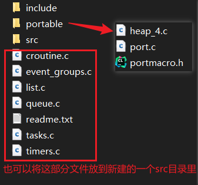
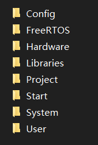
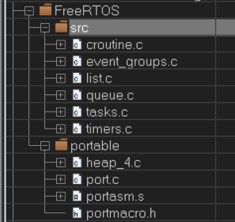

# FreeRTOS

FreeRTOS相关网站：

- 官方：[FreeRTOS - Market leading RTOS (Real Time Operating System) for embedded systems with Internet of Things extensions](https://www.freertos.org/zh-cn-cmn-s/)
- 源代码托管：[FreeRTOS Real Time Kernel (RTOS) - Browse /FreeRTOS at SourceForge.net](https://sourceforge.net/projects/freertos/files/FreeRTOS/)
- 野火教程：[RTOS-实时操作系统 — 野火产品资料下载中心 文档 (embedfire.com)](https://doc.embedfire.com/products/link/zh/latest/tutorial/index-rtos.html?highlight=rtos)

FreeRTOS：面向微控制器和小型微处理器的实时操作系统。

> 历史：由美国的Richard Barry于2003年发布，后于2018年被亚马逊收购，改名为AWS FreeRTOS，版本号升级为V10，且开源协议也由原来的GPLv2+ 修改为 MIT，与 GPLv2+ 相比，MIT更加开放。V9以前的版本还是维持原样，V10版本相 比于V9就是加入了一些物联网相关的组件，内核基本不变。

实时操作系统：[什么是实时操作系统（RTOS） - 知乎 (zhihu.com)](https://zhuanlan.zhihu.com/p/86861756)

为何发展处实时操作系统，相对于轮询来说，有什么优缺点呢？

# 下载

FreeRTOS的源代码托管网址：[FreeRTOS Real Time Kernel (RTOS) - Browse /FreeRTOS at SourceForge.net](https://sourceforge.net/projects/freertos/files/FreeRTOS/)

**1、下载：**

进入到源代码托管网站，找到需要的版本进行下载 —— 下载V9.0.0版本，下载`FreeRTOSv9.0.0.zip`文件。

**2、目录说明：**

解压文件，找到FreeRTOS目录，里面的Demo和Source目录：（FreeRTOS-Plus目录可不了解，一般不用）

- Demo目录：FreeRTOS 官方为各个单片机移植好的工程代码，一些评估板的完整的工程文件，里面包含了不同开发平台、不同芯片的工程文件，可以参考这些文件来进行开发。
- Source目录：内核源代码。

关于Source目录：

- include目录下的文件和Source目录下的直接子文件：FreeRTOS 的通用的头文件和 C 文件，适用于各种编译器和处理器。
- portable目录：里面是需要情况进行移植的文件，需要移植的头文件和 C文件都在该目录下。

关于portable目录：对于不同编译器的支持文件

- Keil目录和RVDS目录：两个目录内的文件是一样的，都是Keil下用的，因此官方只将文件放在了RVDS目录里。RVDS 目录里包含了各种处理器相关的文件目录，根据目录名称可以指定是哪个内核（STM32的M0、M3、M4等内核）的支持文件，里面提供了 cortex-m0、m3、m4 和 m7 等内核的单片机的接口文件。**RVDS目录里的文件就是用来将FreeRTOS和MCU联系起来的接口文件。**
- IAR目录，IAR下的cortex-m0、m3、m4 和 m7 等内核的单片机的接口文件。
- MemMang目录： 存放的是跟内存管理相关的，总共有五个 heap 文件以及一个 readme 说明文件，这五个 heap 文件在移植的时候必须使用一个，因为 **FreeRTOS 在创建内核对象的时候使用的是动态分配内存**，而这些动态内存分配的函数则在这几个文件里面实现，不同的分配算法会导致不同的效率与结果。（初学，选用heap_4.c即可）

> FreeRTOS 是一个软件，单片机是一个硬件，FreeRTOS 要想运行在一个单片机上面，它们就必须关联在一起，如何关联？还是得通过写代码来关联，这部分关联的文件叫接口文件，通常由汇编和 C 联合编写。这些接口文件都是跟硬件密切相关的，不同的硬件接口文件是不一样的，但都大同小异。**编写这些接口文件的过程我们就叫移植**，移植的过程通常由 FreeRTOS 和 mcu 原厂 的人来负责，移植好的这些接口文件就放在 RVDS 这个文件夹的目录下。FreeRTOS 为我们提供了 cortex-m0、m3、m4 和 m7 等内核的单片机的接口文件，只要 是使用了这些内核的 mcu 都可以使用里面的接口文件。
>
> 这里使用FreeRTOS，准确来说是使用官方的移植，而不是移植FreeRTOS到xxxMCU。

关于RVDS目录里只有“port.c”与“portmacro.h”两个文件，以里面的ARM_CM3目录为例：

- port.c：里面的内容是由 FreeRTOS 官方的技术人员为 Cortex-M3 内核的处理器写的接口文件，里面核心的上下文切换代码是由汇编语言编写而成。
- portmacro.h： 则是 port.c 文件对应的头文件，主要是一些数据类型和宏定义

此外还需要一个FreeRTOS的配置头文件，该文件见Demo目录里的STM32相关的demo目录中文件名为`FreeRTOSConfig.h`的文件。

**3、总结：**

使用官方的FreeRTOS的移植时，涉及的文件如下：

1. FreeRTOS源代码文件：include目录下的头文件和Source目录下的子文件。
2. 软件、硬件之间的接口文件：如果是STM32并在Keil下进行开发，那就是portable目录中RVDS目录下的文件；如果是在IAR下进行开发，那就是在portable目录中的IAR目录下的文件。
3. 内存管理文件：MemMang目录下的文件，一般使用heap_4.c即可。
4. 配置文件：`FreeRTOSConfig.h`。

移植时只将这些文件分离出来即可，目录结构也可以按照官方的FreeRTOS目录结构来设置，即分离出来的文件放到另一个FreeRTOS目录里，然后源代码文件和目录照搬，portable目录里只留需要的内存管理文件、软硬件接口文件即可。以Keil下开发为例，目录结构和文件示例如下：



protable内的文件，对于不同平台是不同的，对于Keil来则是RVDS目录里的，对于IAR则是IAR目录里的。`FreeRTOSConfig.h`，也是如此，IAR下则找到IAR后缀的demo目录里的，Keil下则找到Keil后缀的demo目录里的。

# 移植FreeRTOS

将FreeRTOS添加进STM32F103C8的工程里，总的来说可以分为两步：

1. 创建好STM32F103C8的工程：创建项目，创建好组并加载好相关文件，再搞好工程配置（Debug中选用ST-Link Debug并设置其Flash Download为Reset and Run；配好C/C++的include path、宏定义）。
2. 移植FreeRTOS：将涉及的文件加入到项目组里，修改好一些文件，再搞好项目的工程配置。

## Keil下

使用Keil开发工具来进行开发。

1、创建好工程项目：STM32F103C8的工程创建过程说明见`STM32.md`。

2、移植FreeRTOS：

- 工程中创建好FreeRTOS/src、FreeRTOS/portable组，将相关文件添加进去。（组命名，看你）

  FreeRTOS/src：将源码中Source目录下的**直接子文件**都放进去。
  FreeRTOS/portable：heap_4.c、port.c、portmacro.h。
- 将`FreeRTOSConfig.h`文件添加到User组里，需要修改该文件。

  该配置文件一般放在User里。
- 编译的时候需要为FreeRTOS源文件指定头文件的路径，不然编译会报错，因此需要在C/C++的 include path 添加FreeRTOS目录下的include、portable目录。
- 修改`stm32f10x_it.c`文件。

> FreeRTOSConfig.h 是直接从 demo 文件夹中某些demo目录下面拷贝过来的，该头文件对裁剪整个 FreeRTOS 所需的功能的宏均做了定义，有些宏定义被使能，有些宏定义被失能，一开始我们只需要配置最简单的功能即可。要想随心所欲的配置 FreeRTOS 的功能，我们必须对这些宏定义的功能有所掌握。野火修改过的`FreeRTOSConfig.h`文件，里面添加了一些中文注释，并且把相关的头文件进行分类，方便查找宏定义和阅读，见《FreeRTOS 内核实现与应用开发实战指南》。

修改`FreeRTOSConfig.h`，在末尾的`#endif`前添加以下内容：

```c
#define xPortPendSVHandler 	PendSV_Handler
#define vPortSVCHandler 	SVC_Handler
#define xPortSysTickHandler	SysTick_Handler
```

修改`stm32f10x_it.c`文件：（上面添加的内容会导致重复定义的错误，因此需要修改该文件，把重复的给注释掉）

```c
// 在stm32f10x_it.c文件中找到以下三个函数并注释掉
void SVC_Handler(void)
{
}
void PendSV_Handler(void)
{
}
void SysTick_Handler(void)
{
}
```

3、修改`main.c`，测试：（通过FreeRTOS实现流水灯）

```c
#include "stm32f10x.h"                  // Device header
#include "OLED.h"
#include "FreeRTOS.h"
#include "task.h"
#include "portmacro.h"

static TaskHandle_t led_task_handle0 = NULL;
static TaskHandle_t led_task_handle1 = NULL;
static TaskHandle_t led_task_handle2 = NULL;

void led_init(void)
{
	RCC_APB2PeriphClockCmd(RCC_APB2Periph_GPIOA, ENABLE);
	
	GPIO_InitTypeDef GPIO_InitStructure;
	GPIO_InitStructure.GPIO_Mode = GPIO_Mode_Out_PP;
	GPIO_InitStructure.GPIO_Pin = GPIO_Pin_0 | GPIO_Pin_2 | GPIO_Pin_4;
	GPIO_InitStructure.GPIO_Speed =  GPIO_Speed_50MHz;
	GPIO_Init(GPIOA, &GPIO_InitStructure);
}
void led_task0(void *arg)
{
	while(1)                            
	{
		GPIO_SetBits(GPIOA, GPIO_Pin_0);
		vTaskDelay(500/portTICK_PERIOD_MS);
		GPIO_ResetBits(GPIOA, GPIO_Pin_0);
		vTaskDelay(500/portTICK_PERIOD_MS);
	}
}
void led_task1(void *arg)
{
	while(1)                            
	{
		GPIO_SetBits(GPIOA, GPIO_Pin_2);
		vTaskDelay(1000/portTICK_PERIOD_MS);
		GPIO_ResetBits(GPIOA, GPIO_Pin_2);
		vTaskDelay(1000/portTICK_PERIOD_MS);
	}
}
void led_task2(void *arg)
{
	while(1)                            
	{
		GPIO_SetBits(GPIOA, GPIO_Pin_4);
		vTaskDelay(2000/portTICK_PERIOD_MS);
		GPIO_ResetBits(GPIOA, GPIO_Pin_4);
		vTaskDelay(2000/portTICK_PERIOD_MS);
	}
}
int main(void) 
{
	led_init();
	OLED_Init();
	OLED_ShowString(1,1,"FreeRTOSv9.0.0");
	xTaskCreate(led_task0, "led_task0", 1024, NULL, 20, &led_task_handle0);
	xTaskCreate(led_task1, "led_task1", 1024, NULL, 20, &led_task_handle1);
	xTaskCreate(led_task2, "led_task2", 1024, NULL, 20, &led_task_handle2);
	vTaskStartScheduler();
	while(1);
}
```

## IAR下

使用IAR开发工具来进行开发。同理：

1. 创建STM32F103C8的工程项目。
2. 移植FreeRTOS。

### 创建STM32工程

**0、新建工作空间，并创建项目。**

先创建一个目录——`IARworkspaces`，用于当作工作空间，在该目录下创建`FreeRTOSDemo`目录，`FreeRTOSDemo`目录里创建好以下文件夹：



将需要的FreeRTOS支持文件、STM32103C8固件库文件放进这些目录里。

> FreeRTOS目录里放FreeRTOS支持文件；
> Hardware用于放一些驱动代码和头文件；
> Libraries用于放STM32的外设库文件；
> Start放启动文件和内核文件；
> User放`main.c`、`FreeRTOSConfig.h`、`stm32f10x_conf.h`、`stm32f10x_it.c`、`stm32f10x_it.h`；
> Project目录用于存放一会创建的IAR工程文件；
> Config，存放固件库STM32F10x_StdPeriph_Lib_V3.5.0\Project\STM32F10x_StdPeriph_Template\EWARM 文件夹里的所有.icf文件。

做好上面这些后，就打开IAR，选择 File → New Workspace 建立好工作空间，然后通过 File → Save Workspase As...  保存到Project目录下，名字就设为项目名称吧——FreeRTOSDemo；接着Project → Create New Project，选择Empty project，再点OK，选择保存路径仍然是刚才新建的FreeRTOSDemo目录下的Project文件夹里，保存名字也是FreeRTOSDemo。

**1、移植固件库：添加组，然后再添加源文件。**

添加组：（FreeRTOS、Hardware、Libraries、Start、System、User，六个组，由你自己决定，知道组里有啥就行）


添加源文件：操作和上图类似，只不过是在组上面右键，然后选择添加文件。

修改启动文件：（可以先不操作这一步，看看最后编译会不会出现那些警告）

官方固件库的启动文件，在IAR编译器编译时会出现一些警告，解决办法就是，修改startup_stm32f10x_xd.s文件，通过编辑软件编辑该文件然后另存为另一个同名文件，然后使用这个文件替代掉原来的。修改内容如下：

```c
// 找到Reset_Handler这里，最后的SECTION修改 SECTION .text:CODE:REORDER:NOROOT(1)
// SECTION .text:CODE:REORDER(1)  改为 SECTION .text:CODE:REORDER:NOROOT(1)
// 这样也行 SECTION .text:CODE:REORDER(1)  改为 SECTION .text:CODE:NOROOT:REORDER(1)
Reset_Handler
        LDR     R0, =SystemInit
        BLX     R0
        LDR     R0, =__iar_program_start
        BX      R0

        PUBWEAK NMI_Handler
        SECTION .text:CODE:REORDER:NOROOT(1)
```

NOROOT表示如果符号没有被关联的时候是被优专化掉的， 如果想不被优化则使用ROOT。

**2、工程配置。**

先选中`FreeRTOSDemo-Debug`，点击右键选择Options（从Project → Options打开也可）的打开配置面板：

①在General Options → Target → Device 选好使用的芯片型号（STM32F103C8），然后 General Options → Library Configuration 里勾上Use CMSIS5.7。

> 注意，勾选了`Use CMSIS5.7`，Start文件夹中的`core_cm3.h`、`core_cm3.c`就得去掉，表示不使用STM32F10x固件库的core；如果不勾选，使用下载的固件库的`core_cm3.c`和`core_cm3.h`，直接编译将会出现一个Core_cm3版本的问题，错误的原因是因为新版本CMSIS的intrinsics.h等文件与之前的版本不兼容，而解决方法就是注释掉`core_cm3.h`里的93行的`#include <intrinsics.h>`，源文件只有只读权限，要修改可以通过编辑软件编辑后另存为一个新的文件，然后替代掉原来的即可。

②然后，C/C++Compiler → Preprocessor里，配置头文件目录（为了在include时不用加上路径）和定义全局宏，配置分别如下：

```
$PROJ_DIR$\..\
$PROJ_DIR$\..\Libraries
$PROJ_DIR$\..\Start
$PROJ_DIR$\..\Hardware
$PROJ_DIR$\..\System
$PROJ_DIR$\..\User
$PROJ_DIR$\..\FreeRTOS\include
$PROJ_DIR$\..\FreeRTOS\portable
```

```
USE_STDPERIPH_DRIVER
STM32F10X_MD
```

③接着，Linker里勾上`Override default`，并且设置为`$PROJ_DIR$\..\Config\stm32f10x_flash.icf`，选择到stm32f10x_flash.icf文件。

④最后，配置Debugger：Debugger → Setup 里的Driver选择使用的调试器（我是ST-LINK），再在Download里将`Verify download`勾上。

⑤修改startup_stm32f10x_xd.s文件：通过编辑软件编辑后另存为另一个文件，然后使用这个文件替代掉原来的。修改内容如下：

```c
// 找到Reset_Handler这里，最后的SECTION修改 SECTION .text:CODE:REORDER:NOROOT(1)
Reset_Handler
        LDR     R0, =SystemInit
        BLX     R0
        LDR     R0, =__iar_program_start
        BX      R0

        PUBWEAK NMI_Handler
        SECTION .text:CODE:REORDER:NOROOT(1)
```

⑥点击OK，然后点击make进行编译，无错误无警告即可。

官方固件库的启动文件，在IAR编译器编译时会出现一些警告，解决办法就是，修改startup_stm32f10x_xd.s文件，通过编辑软件编辑该文件然后另存为另一个同名文件，然后使用这个文件替代掉原来的。修改内容如下：

```c
// 找到Reset_Handler这里，最后的SECTION修改 SECTION .text:CODE:REORDER:NOROOT(1)
// SECTION .text:CODE:REORDER(1)  改为 SECTION .text:CODE:REORDER:NOROOT(1)
Reset_Handler
        LDR     R0, =SystemInit
        BLX     R0
        LDR     R0, =__iar_program_start
        BX      R0

        PUBWEAK NMI_Handler
        SECTION .text:CODE:REORDER:NOROOT(1)
```

NOROOT表示如果符号没有被关联的时候是被优专化掉的， 如果想不被优化则使属用ROOT。


### 移植FreeRTOS

①为FreeRTOS添加src组、protable组，添加好文件：



②User组里添加好`FreeRTOSConfig.h`文件，并在末尾的`#endif`前添加以下内容：

```c
#define xPortPendSVHandler 	PendSV_Handler
#define vPortSVCHandler 	SVC_Handler
#define xPortSysTickHandler	SysTick_Handler
```

③在stm32f10x_it.c文件中找到以下三个函数并注释掉：

```c
void SVC_Handler(void)
{
}
void PendSV_Handler(void)
{
}
void SysTick_Handler(void)
{
}
```

④错误解决：

```
Error[2]: Failed to open #include file 'FreeRTOSConfig.h' xxx\portasm.s
```

解决办法：工程名右键 → Options... → Assembler → Preprocesser，在`Additional include directories`添加`FreeRTOSConfig.h`所在目录 —— `$PROJ_DIR$\..\User`。

⑤编译，无错误，无警告。

⑥测试，main.c，和Keil下测试代码的一致：

```c
#include "stm32f10x.h"                  // Device header
#include "OLED.h"
#include "FreeRTOS.h"
#include "task.h"
#include "portmacro.h"

static TaskHandle_t led_task_handle0 = NULL;
static TaskHandle_t led_task_handle1 = NULL;
static TaskHandle_t led_task_handle2 = NULL;

void led_init(void)
{
	RCC_APB2PeriphClockCmd(RCC_APB2Periph_GPIOA, ENABLE);
	
	GPIO_InitTypeDef GPIO_InitStructure;
	GPIO_InitStructure.GPIO_Mode = GPIO_Mode_Out_PP;
	GPIO_InitStructure.GPIO_Pin = GPIO_Pin_0 | GPIO_Pin_2 | GPIO_Pin_4;
	GPIO_InitStructure.GPIO_Speed =  GPIO_Speed_50MHz;
	GPIO_Init(GPIOA, &GPIO_InitStructure);
}
void led_task0(void *arg)
{
	while(1)                            
	{
		GPIO_SetBits(GPIOA, GPIO_Pin_0);
		vTaskDelay(500/portTICK_PERIOD_MS);
		GPIO_ResetBits(GPIOA, GPIO_Pin_0);
		vTaskDelay(500/portTICK_PERIOD_MS);
	}
}
void led_task1(void *arg)
{
	while(1)                            
	{
		GPIO_SetBits(GPIOA, GPIO_Pin_2);
		vTaskDelay(1000/portTICK_PERIOD_MS);
		GPIO_ResetBits(GPIOA, GPIO_Pin_2);
		vTaskDelay(1000/portTICK_PERIOD_MS);
	}
}
void led_task2(void *arg)
{
	while(1)                            
	{
		GPIO_SetBits(GPIOA, GPIO_Pin_4);
		vTaskDelay(2000/portTICK_PERIOD_MS);
		GPIO_ResetBits(GPIOA, GPIO_Pin_4);
		vTaskDelay(2000/portTICK_PERIOD_MS);
	}
}
int main(void) 
{
	led_init();
	OLED_Init();
	OLED_ShowString(1,1,"FreeRTOSv9.0.0");
	xTaskCreate(led_task0, "led_task0", 1024, NULL, 20, &led_task_handle0);
	xTaskCreate(led_task1, "led_task1", 1024, NULL, 20, &led_task_handle1);
	xTaskCreate(led_task2, "led_task2", 1024, NULL, 20, &led_task_handle2);
	vTaskStartScheduler();
	while(1);
}
```

# 配置文件

V9.0.0版本的FreeRTOS的默认配置文件`FreeRTOSConfig.h`的内容如下：

```c
#ifndef FREERTOS_CONFIG_H
#define FREERTOS_CONFIG_H
// 置1：RTOS使用抢占式调度器；置0：RTOS使用协作式调度器（时间片）
#define configUSE_PREEMPTION		1
// 置1：使用空闲钩子（Idle Hook类似于回调函数）；置0：忽略空闲钩子
#define configUSE_IDLE_HOOK			0
// 置1：使用时间片钩子（Tick Hook）；置0：忽略时间片钩子
#define configUSE_TICK_HOOK			0
// CPU内核时钟频率，也就是CPU指令执行频率，通常称为Fclk
#define configCPU_CLOCK_HZ			( ( unsigned long ) 72000000 )	
// RTOS系统节拍中断的频率。即一秒中断的次数，每次中断RTOS都会进行任务调度
#define configTICK_RATE_HZ			( ( TickType_t ) 1000 )
// 可使用的最大优先级
#define configMAX_PRIORITIES		( 5 )
// 空闲任务使用的堆栈大小
#define configMINIMAL_STACK_SIZE	( ( unsigned short ) 128 )
// 系统所有总的堆大小
#define configTOTAL_HEAP_SIZE		( ( size_t ) ( 17 * 1024 ) )
// 任务名字字符串长度
#define configMAX_TASK_NAME_LEN		( 16 )
// 启用可视化跟踪调试
#define configUSE_TRACE_FACILITY	0
// 系统节拍计数器变量数据类型，1表示为16位无符号整形，0表示为32位无符号整形
#define configUSE_16_BIT_TICKS		0
//空闲任务放弃CPU使用权给其他同优先级的用户任务
#define configIDLE_SHOULD_YIELD		1

/* Co-routine definitions. */
// 启用协程，启用协程以后必须添加文件croutine.c
#define configUSE_CO_ROUTINES 		0
// 协程的有效优先级数目
#define configMAX_CO_ROUTINE_PRIORITIES ( 2 )

/* FreeRTOS可选函数配置选项 */
#define INCLUDE_vTaskPrioritySet		1
#define INCLUDE_uxTaskPriorityGet		1
#define INCLUDE_vTaskDelete				1
#define INCLUDE_vTaskCleanUpResources	0
#define INCLUDE_vTaskSuspend			1
#define INCLUDE_vTaskDelayUntil			1
#define INCLUDE_vTaskDelay				1

/* 系统可管理的最高中断优先级 */
#define configKERNEL_INTERRUPT_PRIORITY 		255
#define configMAX_SYSCALL_INTERRUPT_PRIORITY 	191 /* equivalent to 0xb0, or priority 11. */

/* 中断最低优先级 */
#define configLIBRARY_KERNEL_INTERRUPT_PRIORITY	15

#endif /* FREERTOS_CONFIG_H */
```

全部配置可分为以下几部分：

- 基础配置。
- 内存申请有关的配置。
- 与钩子函数有关的配置。
- 与运行时间和任务状态收集有关的配置。
- 与协程有关的配置。
- 与软件定时器有关的配置。
- 可选函数配置选项。
- 与中断有关的配置选项。
- 与中断服务函数有关的配置选项。
- 使用Percepio Tracealyzer需要的配置。      


# 关于多任务

任务：在FreeRTOS中，线程（Thread）和任务（Task）的概念是相同的。每个任务就是一个线程，有着自己的一个程序执行路径。

单任务系统：

- 51、32位等单片机裸机中，如果未使用系统，那都是在main函数中通过`while(1)`死循环来不断依次执行各个处理程序的，对于一些突发处理事件有时会通过中断来完成。这种宏观上串行执行任务中程序的系统，称之为单任务系统，也称为前后台系统（死循环内的程序作为后台程序，而中断服务函数则作为前台程序）。

- 缺点：前后台系统各个任务（应用程序）都是得排队来轮流执行的，因此系统的实时性差，不适合于大一点的嵌入式应用。

  > 实时性：如果有一个任务需要执行，CPU就能马上（在较短时间内）执行该任务，不会有较长的延时，这就是实时性。
  > 实时性可以保证各个任务的及时执行。

- 优点：简单，资源消耗少。

多任务系统：宏观上，可以看成是并行地“同时”执行多个任务的系统。（调度器会不断的启动、停止每一个任务，宏观看上去所有的任务都同时在执行）

FreeRTOS任务的创建，有两种方式：

- 静态创建：任务控制块和任务堆栈都事先定义好，即定义好全局变量（静态全局变量存在于SRAM中），任务删除时所占内存不会被释放，实际中使用较少。

  > （线程占用内存不可释放）

- 动态创建：动态创建任务控制块和任务堆栈，任务删除时占用的内存可释放，实际应用中使用最多。

  > （线程占用内存可释放）

# 点亮LED

## 静态单任务方式

1、开启静态创建支持，在`FreeRTOSConfig.h`配置文件添加以下：

```c
// 开启静态支持，使用heap.c中的动态内存管理函数来自动的申请RAM
#define configSUPPORT_STATIC_ALLOCATION 1
// 设置定时器服务任务的任务堆栈大小
#define configTIMER_TASK_STACK_DEPTH	      (configMINIMAL_STACK_SIZE*2)
```

2、main.c，创建静态单任务，具体步骤：

1. 定义任务函数。
2. 空闲任务与定时器任务堆栈函数的实现。（先定义好任务栈和任务控制块，再实现函数）
3. 定义任务控制块和任务栈。
4. 静态创建任务与启动。

```c
#include "stm32f10x.h"                  // Device header
#include "OLED.h"
#include "FreeRTOS.h"
#include "task.h"

// 静态内存中的初始化函数,初始化GPIO口
static void LED_Init(void)
{
    RCC_APB2PeriphClockCmd(RCC_APB2Periph_GPIOC, ENABLE);
	
	GPIO_InitTypeDef GPIO_InitStructure;
	GPIO_InitStructure.GPIO_Mode = GPIO_Mode_Out_PP;
	GPIO_InitStructure.GPIO_Pin = GPIO_Pin_13;
	GPIO_InitStructure.GPIO_Speed =  GPIO_Speed_50MHz;
	GPIO_Init(GPIOC, &GPIO_InitStructure);
}

static TaskHandle_t AppTaskCreate_Handle;
static TaskHandle_t LED_Task_Handle;

/* 空闲任务任务堆栈 */  
static StackType_t Idle_Task_Stack[configMINIMAL_STACK_SIZE];
/* 定时器任务堆栈 */ 
static StackType_t Timer_Task_Stack[configTIMER_TASK_STACK_DEPTH];
/* 空闲任务控制块 */
static StaticTask_t Idle_Task_TCB;
/* 定时器任务控制块 */
static StaticTask_t Timer_Task_TCB; 

/* AppTaskCreate 任务任务堆栈 */
static StackType_t AppTaskCreate_Stack[128];
/* LED 任务堆栈 */
static StackType_t LED_Task_Stack[128];
/* AppTaskCreate 任务控制块 */
static StaticTask_t AppTaskCreate_TCB;
/* LED 任务控制块 */
static StaticTask_t LED_Task_TCB;

static void LED_Task(void* parameter);
static void AppTaskCreate(void);
void vApplicationGetIdleTaskMemory(StaticTask_t **ppxIdleTaskTCBBuffer, 
StackType_t **ppxIdleTaskStackBuffer, uint32_t *pulIdleTaskStackSize);
void vApplicationGetTimerTaskMemory(StaticTask_t **ppxTimerTaskTCBBuffer, 
StackType_t **ppxTimerTaskStackBuffer, uint32_t *pulTimerTaskStackSize) ;

int main(void) 
{
	NVIC_PriorityGroupConfig(NVIC_PriorityGroup_4);//设置系统中断优先级分组4	
	OLED_Init();
    LED_Init();
	OLED_ShowString(1,1,"FreeRTOSv9.0.0");
	/* 静态创建任务 start */
    AppTaskCreate_Handle= xTaskCreateStatic((TaskFunction_t)AppTaskCreate,
    (const char*)"AppTaskCreate",(uint32_t)128,(void*)NULL,(UBaseType_t)3,
    (StackType_t*)AppTaskCreate_Stack,
    (StaticTask_t*)&AppTaskCreate_TCB);
    if (NULL != AppTaskCreate_Handle)
    vTaskStartScheduler();
    /* 静态创建任务 end */
	while(1);
}
// 定义任务函数
static void LED_Task(void* parameter)
{
    while(1)
    {
        GPIO_SetBits(GPIOC, GPIO_Pin_13);
        vTaskDelay(500);
        GPIO_ResetBits(GPIOC, GPIO_Pin_13);
		vTaskDelay(500);
    }
}
/* 用于创建任务 */
static void AppTaskCreate(void)
{
    taskENTER_CRITICAL(); //进入临界区
    /* 创建 LED_Task 任务 */
    LED_Task_Handle = xTaskCreateStatic((TaskFunction_t)LED_Task, //任务函数
    (const char*)"LED_Task",//任务名称
    (uint32_t)128, //任务堆栈大小
    (void* )NULL, //传递给任务函数的参数
    (UBaseType_t)4, //任务优先级
    (StackType_t*)LED_Task_Stack,//任务堆栈
    (StaticTask_t*)&LED_Task_TCB);//任务控制块
    if (NULL != LED_Task_Handle) /* 创建成功 */
        OLED_ShowString(2,1,"success");
    else
        OLED_ShowString(2,1,"fail");
    
    vTaskDelete(AppTaskCreate_Handle); //删除 AppTaskCreate 任务
    
    taskEXIT_CRITICAL(); //退出临界区
}
/* 空闲任务堆栈函数实现 */
void vApplicationGetIdleTaskMemory(StaticTask_t **ppxIdleTaskTCBBuffer, 
StackType_t **ppxIdleTaskStackBuffer, uint32_t *pulIdleTaskStackSize) 
{ 
    *ppxIdleTaskTCBBuffer = &Idle_Task_TCB;           /* 任务控制块内存 */ 
    *ppxIdleTaskStackBuffer = Idle_Task_Stack;        /* 任务堆栈内存 */ 
    *pulIdleTaskStackSize = configMINIMAL_STACK_SIZE; /* 任务堆栈大小 */ 
}
// 定时器任务堆栈函数实现
void vApplicationGetTimerTaskMemory(StaticTask_t **ppxTimerTaskTCBBuffer, 
StackType_t **ppxTimerTaskStackBuffer, uint32_t *pulTimerTaskStackSize) 
{ 
    *ppxTimerTaskTCBBuffer=&Timer_Task_TCB;             /* 任务控制块内存 */ 
    *ppxTimerTaskStackBuffer=Timer_Task_Stack;          /* 任务堆栈内存 */ 
    *pulTimerTaskStackSize=configTIMER_TASK_STACK_DEPTH;/* 任务堆栈大小 */ 
}
```


## 动态单任务方式


# 启动流程

