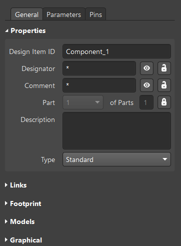
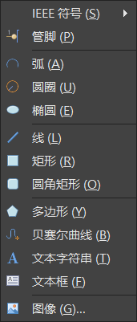
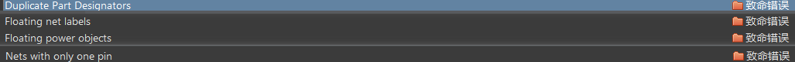

# Altium Designer

原理图/PCB设计 —— AD使用：熟练使用软件，不过更重要的是如何去设计一个电路，目标是成为PCB设计者，工程设计者。

AD软件学习目标：会画原理图、会画原理图元件；画PCB封装；PCB布线。

学AD做什么：做电子设计，一方面是学习使用AD，另一方面是做电子设计——包括原理图和PCB设计。

怎么用AD做电子设计 —— 怎么学：

- 软件：基本操作熟练，会用快捷键进行快速设计。（设置好对应操作的快捷键，然后不断使用快捷键来练习，练习50遍以上）
- 设计：

# 0.工程创建

1、PCB工程创建：文件 → 新的 → 项目 → PCB工程。

2、为新建的工程添加：

- Schematic —— 原理图。
- Schematic Library —— 原理图库。
- PCB。
- PCB Library —— PCB元件库。

原理图：原理图只注重原理上的一个解释，注重各元件的连接。

原理图库：原理图库的元件不需要和实物尺寸有什么关系，引脚什么的标好就行。

PCB元件库：需要关注元件实际的尺寸和引脚位置。

# 1.原理图

## 原理图库

**1、关于元件符号：**

画元件模型，用于原理图绘制，原理图库的元件模型不需要和实物尺寸有什么关系（但对于管脚序号和名称则要一一对应），仅仅是充当元件的一个符号，这些元件符号是元件在原理图上的表现方式。

元件符号组成，一般由以下四部分组成：

1. 元件边框。（即元件形状，芯片、排针类元件一般是矩形、圆角矩形等来充当，电容、电阻类的就是使用线条、弧线画出图像符号）
2. 管脚（包括管脚序号和名称）。（可用空格进行管脚旋转，管脚上有四个白色小矩形那侧是用于导线与导线之间的连接的，另一侧则是连接到元件边框）
3. Design Item ID（元件名称）。
4. Description（元件说明）。

元件直接通过放置的管脚来建立电气连接关系。**对于管脚序号和名称，要严格按照元件规格书中的说明一一对应好。**

**2、AD操作——绘制元件符号：**

1.点击进入Schematic Library后，按add...（添加）来添加元件，双击元件可以对其属性进行设置。

- design item ID：元器件名称。
- designator：元件位号，必须需要的，可以方便元件查找和设计，在PCB上一般都要求丝印出来。（xxx的文字符号加上一个问号）
- comment：填写注释，比如电容，可以在这里注释220uF（不过通常使用Value属性来设置这些信息）。
- description：器件描述，什么器件、器件作用、或者该器件是什么封装等等。

 

放置 —— 绘制元件符号，通过放置以下一些东西来达成目标，工具栏中的放置选项或者原理图中鼠标右键 → 放置，可放置的选项如下：

属性更改 —— 在放置选项中选择好要放置的东西后，按Tab键可以对其进行属性的修改，比如颜色、长度、宽度、名称等等。

设置捕捉栅格：可通过工具栏上视图 → 栅格 → 设置捕捉栅格来设置捕捉栅格，这样在原理图上画线时就会按照设置好的栅格长度进行捕捉，画出想要的线条长度（默认是一个栅格长度，也就是以栅格长度为最小值来进行线条的绘制）。

对于**电阻电容**模型的创建：放置管脚、放置线、放置圆弧。

对于**IC类**元件模型的创建：放置矩形外框、放置管脚，管脚位号一般`U?`。

对于一些管脚名称有上划线的，在字母后面加上反斜线即可，例如：`E\N\` → $\overline{EN}$。

对齐功能：将要对齐的一些东西选中后，按`A`键就可以出现对齐选项面板，然后再按`ctrl`键选中某一项即可设置这一项的快捷键。

对于**排针类**元件模型的创建：画框、放管脚、设置参数。（管脚放置可以使用特殊功能粘贴命令）

特殊功能粘贴命令：

1. 选中管脚并复制。
2. 然后，编辑 → 阵列式粘贴，设置好参数，点击确认 → 在元件编辑界面上点击一下左键即可。

对于**二极管**元件模型的创建：管脚、使用多边形画三角形、使用多边形画长方形。 

关于现有元件模型库的调用：

- 有原理图的情况下：可以通过AD的功能菜单栏上的设计 → 生成原理图库 → 按默认情况分组并确认，然后就可以生成一个原理图库，可以复制其中的元件符号到我们的项目中。

## 画原理图

图纸设置：双击图纸的外边框即可弹出设置窗口。

画原理图，一个一个模块去画：

1. 放置元器件并设置好序号。
2. 摆放元器件，尽量美观，以对齐为原则。
3. 连线，适当微调保持美观。
4. 检查连线、检查元器件，最后再放大再仔细检测一遍。
5. finish。

错误：

总结：原理图库、原理图、封装管理器、错误处理。

# 2.PCB

## PCB封装库

画封装元件。完整的PCB封装包含：PCB焊盘、管脚序号、丝印、阻焊、标识。

快捷键的使用：

- `M`：精确移动或翻转界面的调出。
- `Ctrl + M `：测量距离。
- `Shift + C `：清除测量线。

封装方式：普通封装、使用IPC封装向导封装。画封装、画3D元件体。

封装库的调用。

## PCB设计

布局与布线。

### PCB布局

### PCB布线

集成库：使用集成库的元件画原理图时，元器件的PCB和原理图已经绑定好了。

画PCB：

1. 原理图已经画好后，为工程添加一个PCB（也可以添加多个）。
2. 回到原理图，选择`工具 → 封装管理器`，可以看到元件PCB封装列表。选择`设计 → update xxx`，在出现的目标依次点击`验证变更`、`执行变更`就可以将PCB元器件以及元器件之间的连线导入到PCB中，就可以排线了。

