# 计算机组成原理

# 计算机组成结构

机器字长：计算机一次整数运算所能处理的二进制数。（8位平台、32位平台、64位平台等）

## 冯·诺依曼结构

计算机的运算程序过程最先是通过工作人员手动接线来控制计算机计算过程的（编程——编辑运算过程）；针对手动操作的弊端，冯·诺依曼后来提出“存储程序”的概念。

**“存储程序”：**将指令以二进制代码的形式事先输入到计算机主存储器中，然后按其在存储器中的首地址执行程序的第一条指令，以后就按照该程序的规定顺序执行其他指令， 直至程序执行结束。

第一台采用冯·诺依曼结构的计算机——EDVAC（electronic discrete variable automatic computer，离散变量自动电子计算机），其结构如下：

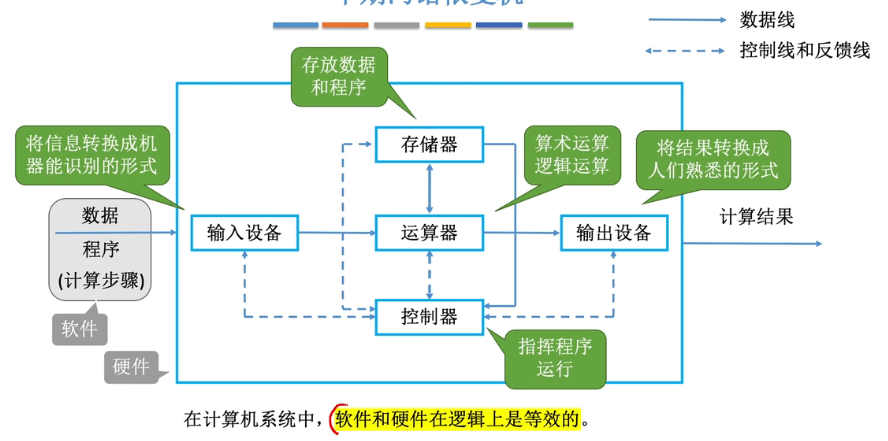

1. 输入设备：其作用是将数据输入到计算机中，数据包含数学运算的数据和程序（指令集合）；输入设备另一个作用是将输入的数据转换为计算机能识别的形式——**机器码**（机器码 machine code，学名`机器语言指令`，有时也被称为`原生码（Native Code）`，是电脑的CPU可直接解读的数据(计算机只认识0和1)，**用机器语言编写程序，编程人员要首先熟记所用计算机的全部指令代码和代码的含义**）。
2. 运算器：运算器既用来运算也用来中转，其接收输入设备转换后的数据并将数据转运待存储器里存储，其也可以读取存储器里的数据并执行运算。
3. 输出设备：将运算器运算后的结果输出，将结果转为人所熟悉的。
4. 控制器：通过电信号来控制协调其它部件间的相互配合，也负责解析存储器里存储的程序指令，根据程序指令来指挥运算器进行运算。
5. 为什么说计算机系统中软件和硬件在逻辑上等效？对于同一功能，既可以通过软件来实现也可以通过硬件来实现，通过软件实现其实还是操作硬件的相关功能来实现。

**冯·诺依曼计算机的特点：**

1. **计算机硬件系统组成：由运算器、存储器、控制器、输入设备和输出设备5大部件组成。**
2. 指令和数据以同等地位存于存储器内，并可按地址寻访。
3.  指令和数据均用二进制代码表示。 
4.  指令由操作码和地址码组成，操作码用来表示操作的性质，地址码用来表示操作数 在存储器中的位置。
5.  指令在存储器内按顺序存放。通常，指令是顺序执行的，在特定条件下，可根据运算结果或根据设定的条件改变执行顺序。 
6. **早期的冯·诺依曼机以运算器为中心**，输入/输出设备通过运算器与存储器传送数据。

## 现代计算机结构

现代计算机结构——以存储器为中心，使运算器只专注于运算。

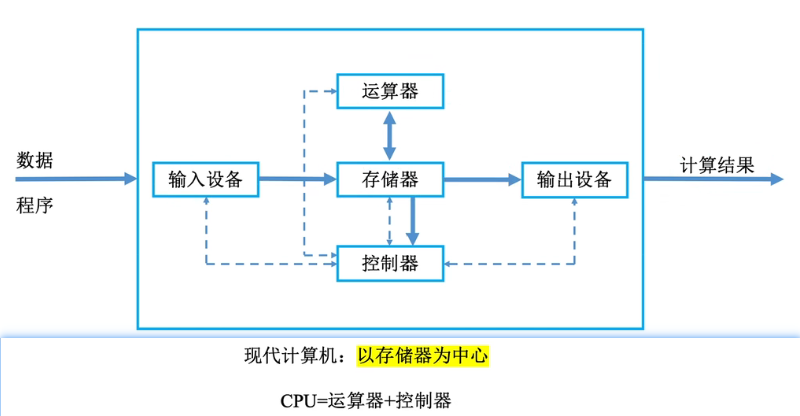

以上结构的简化：

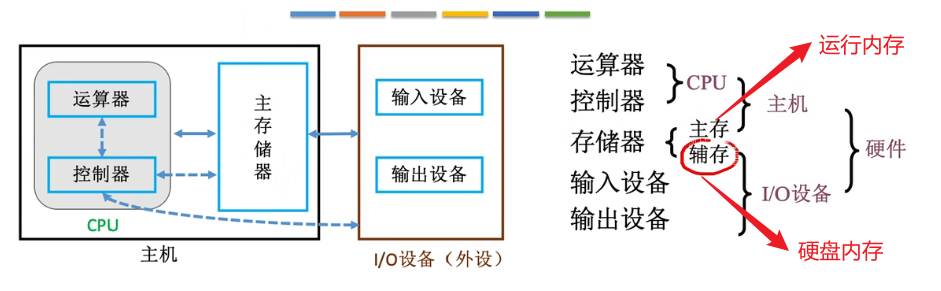

## 硬件工作原理

**1、主存储器：**

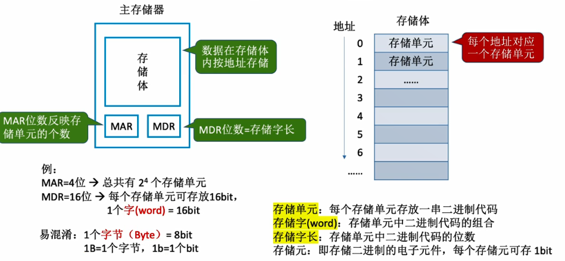

主存储器由存储体、MAR、MDR组成：

1. Memory Adress Register 存储地址寄存器：**地址的临时存储器**，CPU读取/写入数据时需要先将地址写入MAR。
2. Memory Data Register 存储数据寄存器：**数据的临时存储器**。CPU读取数据时主存储器会根据MAR的地址取出CPU请求访问的数据并写入到MDR中，然后CPU即可从MDR中读取到请求访问的数据；CPU写入数据时会将数据写入到MDR、数据存储地址写入到MAR并通过控制总线发出写指令，然后主存储器就会将数据存储到存储体中的指定位置。
3. 存储体：数据在存储体内按地址存储。

存储单元：

- 存储体内分为一个个的存储单元，用于存放一串二进制代码，存储的这一串二进制代码被称为存储字。
- 存储单元内存储的二进制代码的位数则称之为存储字长（存储字节的长度，1byte=8bit，字长的单位为bit）。
- 存储单元都有一个与之对应的地址信息，地址从0开始。
- 存储单元内分为一个个存储元——即存储二进制的电子元件（一般为电容），每个存储元为1bit；存储元加上线路就构成了存储单元。

（注：现在的MAR、MDR通常都集成在CPU中）

**2、运算器：**核心是ALU（Arithmetic and Logic Unit）—— 算术逻辑单元

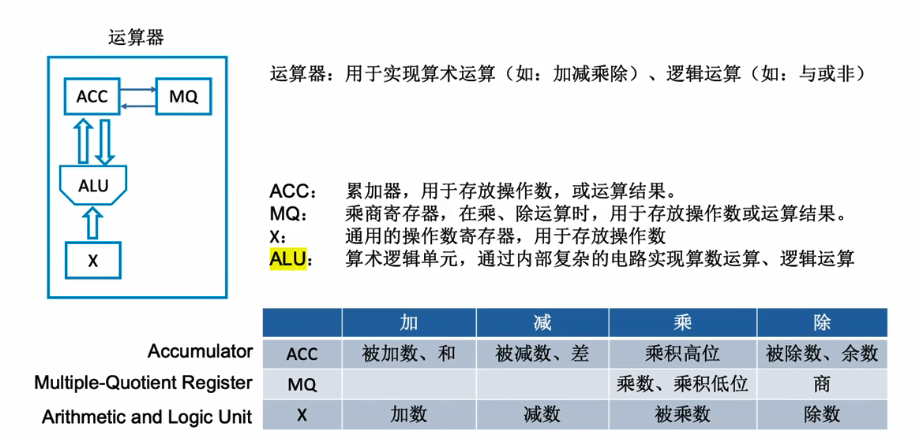

**3、控制器：**

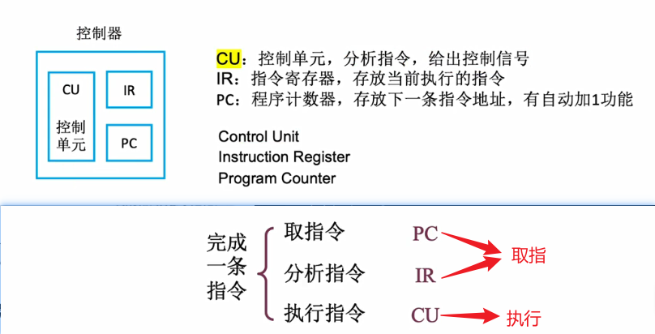

## 程序执行过程

程序执行过程示例：

- 编译器将程序编译为机器码，编译后装入主存中。（CPU会根据操作码和地址码对数据进行操作）
- 程序执行：（取数指令的执行过程，2-4是取指令，5是分析指令，6-8是执行取数指令）
  1. 初：(PC)= 0，将0地址的指令取出。
  2. (PC) → MAR，PC通过地址总线将地址传到MAR中，MAR=0，控制器会通过控制总线告诉主存储器进行读操作。
  3. (MAR) → MDR，主存储器根据MAR内地址从存储体里找到相应位置的指令并放到MDR，(MDR) = 000001 0000000101。
  4. (MDR) → IR，主存储器通过数据总线将MDR的指令传到指令寄存器IR中，(IR) =  000001 0000000101。
  5. OP(IR) → CU，IR中指令的操作码将会被送到逻辑控制单元CU中，CU将对操作码进行分析，然后知道是“取数”指令。
  6. Ad(IR) → MAR，指令的地址码传到MAR，导致(MAR)=5。
  7. M(MAR) → MDR，主存储器根据MAR中地址取出数据放到MDR中，(MDR)=0000000000000010=2。
  8. M(MDR) → ACC，CU控制下将MDR数据传送到累加寄存器中，(ACC)=0000000000000010=2。

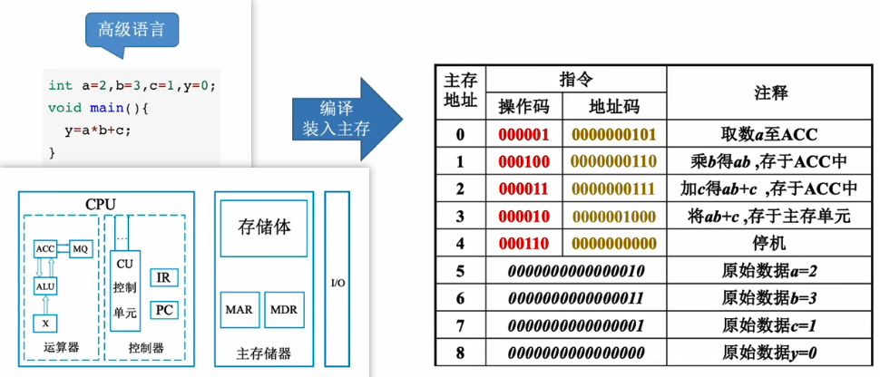

操作码对应的操作已经定义好的。取指令完成后，PC就会自动加1，指向下一条需要执行的指令，然后执行过程和上面的取数指令过程类似，(PC)=1，(ACC)=2：（乘法指令的执行过程，2-3是取指令，4是分析指令，5-9是执行乘法指令，分析指令前基本都差不多的）

1. (PC)=1。
2. (PC) → MAR，(MAR)=1。
3. (MDR) → IR，(IR) =  000100 0000000110。
4. OP(IR) → CU，IR中指令的操作码将会被送到逻辑控制单元CU中，CU将对操作码进行分析，然后知道是“乘法”指令。
5. Ad(IR) → MAR，指令的地址码传到MAR，导致(MAR)=6。
6. M(MAR) → MDR，主存储器根据MAR中地址取出数据放到MDR中，(MDR)=0000000000000011=3。
7. (MDR) → MQ，(MQ)=3。
8. (ACC) → X，导致(X)=0000000000000010=2。
9. (MQ) * (X) → ACC，由ALU实现乘法运算，导致(ACC)=6，如果乘积太大则需要MQ辅助存储。

取指令完成后，PC就会自动加1，(PC)=2，(ACC)=6：（加法指令的执行过程，2-3是取指令，4是分析指令，5-8是执行加法指令）

1. (PC)=2。
2. (PC) → MAR，(MAR)=2。
3. (MDR) → IR，(IR) =  000011 0000000111。
4. OP(IR) → CU，IR中指令的操作码将会被送到逻辑控制单元CU中，CU将对操作码进行分析，然后知道是“加法”指令。
5. Ad(IR) → MAR，指令的地址码传到MAR，导致(MAR)=7。
6. M(MAR) → MDR，主存储器根据MAR中地址取出数据放到MDR中，(MDR)=0000000000000001=1。
7. (MDR) → X，导致(X)=0000000000000001=1。
8. (ACC) + (X) ，由ALU实现加法运算，导致(ACC)=7。

取指令完成后，PC就会自动加1，(PC)=3，(ACC)=7：

1. (PC)=3。
2. (PC) → MAR，(MAR)=3。
3. M(MAR) → MDR，(MDR)=000010 0000001000。
4. (MDR) → IR，(IR) =  000010 0000001000。
5. OP(IR) → CU，IR中指令的操作码将会被送到逻辑控制单元CU中，CU将对操作码进行分析，然后知道是“存数”指令。
6. Ad(IR) → MAR，指令的地址码传到MAR，导致(MAR)=8。
7. (ACC) → MDR，(MDR)=7。
8. CU通过控制总线告诉主存储器进行写操作，(MDR) → 地址为8的存储单元，最终得到y=7。

取指令完成后，PC就会自动加1，(PC)=4：

1. (PC)=4。
2. (PC) → MAR，(MAR)=4。
3. M(MAR) → MDR，(MDR)=000110 0000001000。
4. (MDR) → IR，(IR) =  000110 0000001000。
5. OP(IR) → CU，IR中指令的操作码将会被送到逻辑控制单元CU中，CU将对操作码进行分析，然后知道是“停机”指令。
6. （利用中断机制通知操作系统终止该进程）

总结：无论执行什么指令，前面的取指令和分析指令过程是固定的，分析指令执行后的后续操作由CU控制单元来控制。

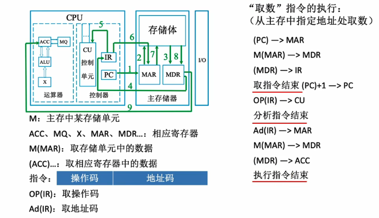

CPU区分指令和数据的依据：指令周期的不同阶段。（现在的MAR、MDR通常都集成在CPU中）

## 计算机系统的层次结构

计算机的五层结构：

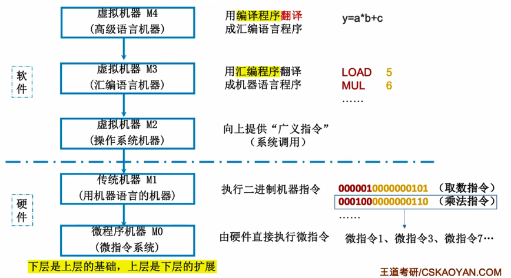

三个级别的语言：

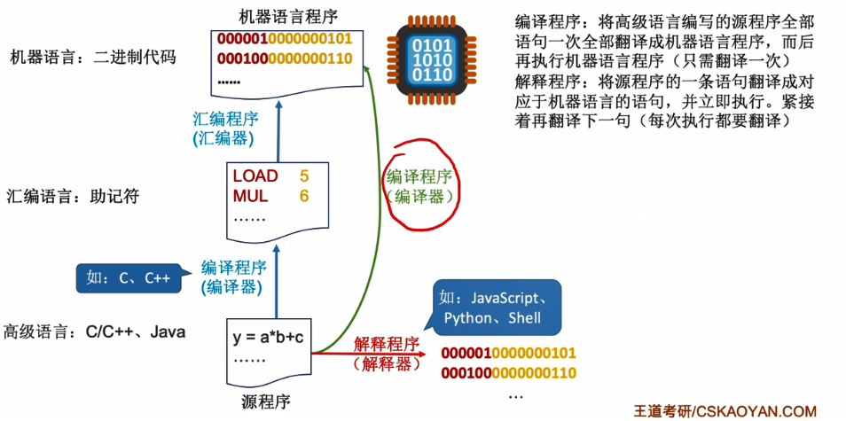

注：编译、汇编、解释程序，可以统称为“翻译程序”。

《计算机体系结构》：机器语言程序员所见到的计算机系统的属性概念性的结构与功能特性。（探讨指令系统、数据类型、寻址技术、I/O机理）

《计算机组成原理》：实现计算机体系结构所体现的属性，对程序员“透明”。（探讨具体指令的实现）

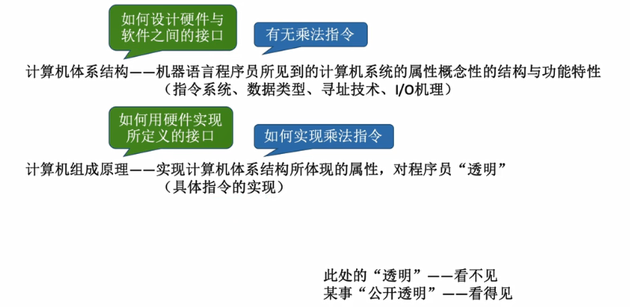

## 计算机性能指标

**1、度量存储器的指标：**存储器容量

MAR位数反应存储单元个数。MDR位数=存储字长=每个存储单元的大小。

存储器总容量 = 存储单元个数 $*$ 存储字长 bit= 存储单元个数 $ * $ 存储字长/8 byte  。

例如：MAR为32位，MDR为8位，那么总容量 = $2^{32}*8 $  bit= 4 GB。

**2、CPU性能指标：**

CPU主频（时钟频率）：CPU内数字脉冲信号震荡的频率（每一个脉冲信号周期则称为CPU时钟周期，单位微秒、纳秒）。（可以理解为CPU指挥计算机内所有固件一步一步工作的节奏）

CPI（Clock cycle Per Instruction）：执行一条指令所需要的时钟周期数。

$执行一条指令所需时间 = CPI * CPU时钟周期$。

$CPU执行时间(整个程序执行耗时)=CPU时钟周期数/主频=(指令条数*CPI)/主频$

IPS（Instructions Per Second）：每秒执行多少条指令。（$IPS=\frac{主频}{平均CPI}$）

FLOPS（Floating-point Operations Per Second）：每秒执行多少次浮动运算。

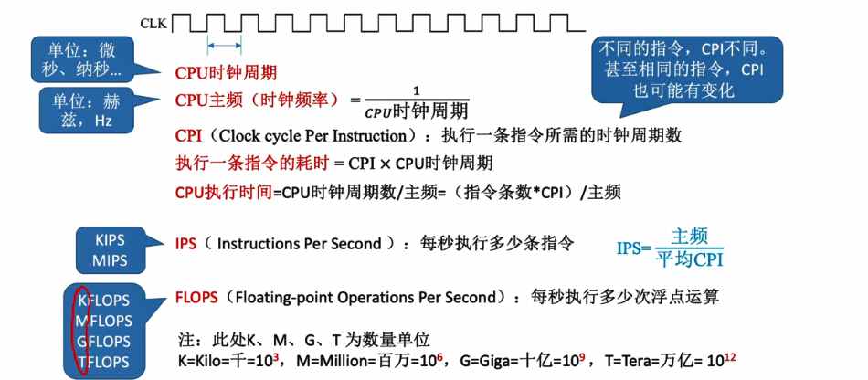

**3、系统整体性能的指标：**

数据通路带宽：数据总线一次所能并行传送信息的位数。（各硬件部件都是通过数据总线来传输数据的）

吞吐量：指系统在单位时间内处理请求的数量。 它取决于信息能多快地输入内存，CPU能多快地取指令，数据能多快地从内存取出或存入，以及所得结果能多快地从内存送给一台外部设备。这些步骤中的每一步都关系到主存，因此系统吞吐量主要取决于主存的存取周期。

 响应时间：指从用户向计算机发送一个请求，到系统对该请求做出响应并获得它所需 要的结果的等待时间。 通常包括CPU时间（运行一个程序所花费的时间）与等待时间（用于磁盘访问、存储 器访问、I/O操作、操作系统开销等时间）。

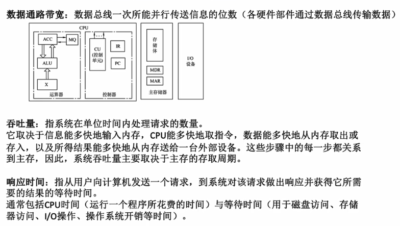

# 数据的表示和运算

计算机内数与字符的表示

计算机内数的运算

计算机内数的运算的具体实现原理

# 存储系统

# 指令系统

# 中央处理器

# 总线

# 输入\输出系统

