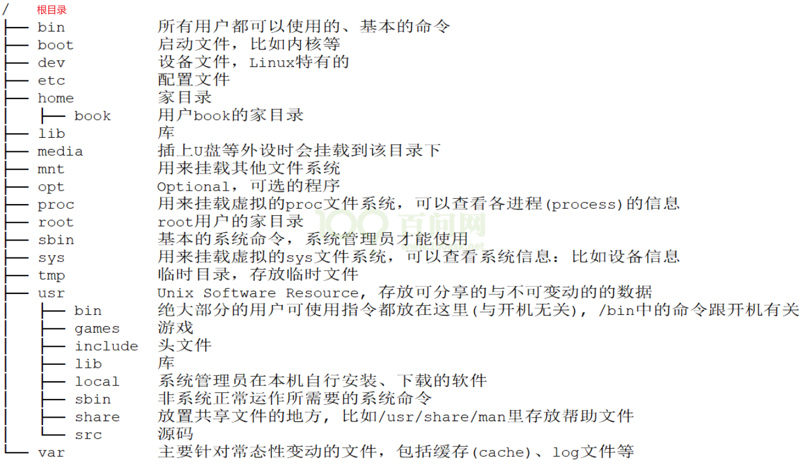
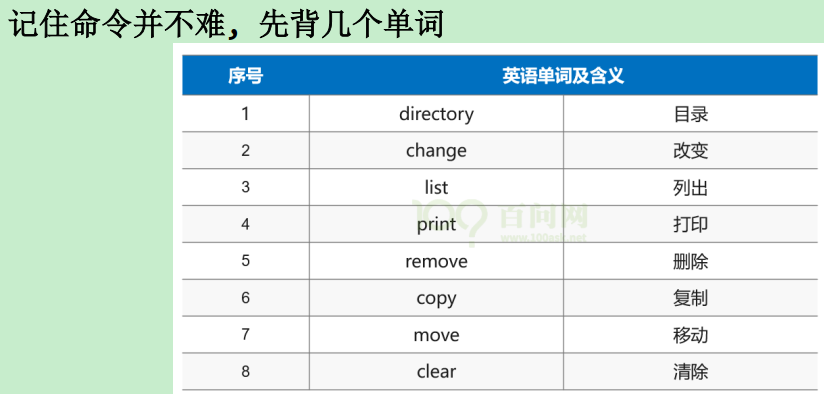
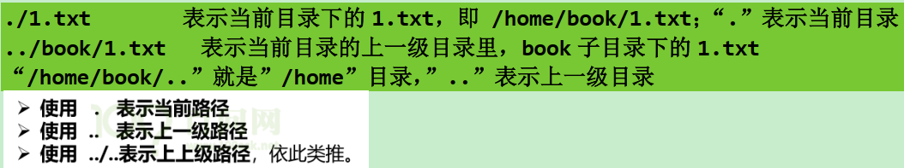
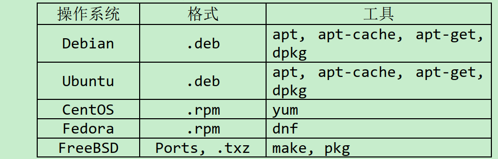
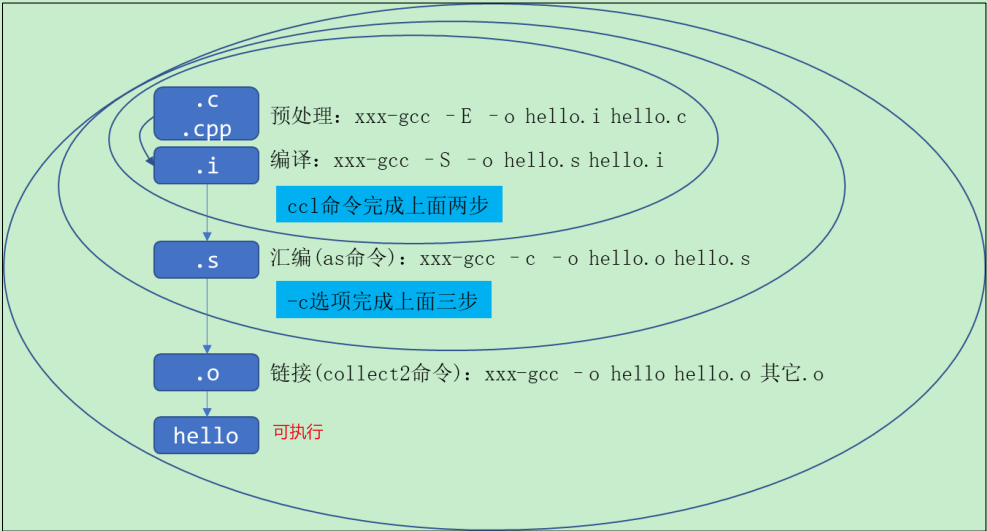

# Linux方向

Linux底层开发：内核、驱动。

Linux应用层开发：应用程序。

# Linux基础总结

韦东山的教程需要有基础的人去看不会懵逼，他写的那种面向对象写裸机和驱动框架，需要多看几遍才能在脑海中印象，关键需要跟着写代码。或者可以看正点原子的嵌入式Linux教程，非常适合0基础的人去学习。

下面我总结下学习嵌入式Linux需要这几方面的基础：

## Linux基础命令

基本命令掌握如目录操作，文件操作，文件查找搜索，磁盘管理等，最关键要会gcc命令使用

## 掌握C语言

这部分学到指针那里，因为C语言的精髓是指针，不会指针等于不会C语言

## shell

重点掌握语法：

\- sed, tr, awk三剑客的用法

\- if,for,switch,while条件判断循环使用用法

\- 正则表达式

\- 特殊符号的用法

## Makefile

重点掌握

1、看[韦东山](https://www.zhihu.com/search?q=韦东山&search_source=Entity&hybrid_search_source=Entity&hybrid_search_extra={"sourceType"%3A"answer"%2C"sourceId"%3A2721048089})第三期的[数码相框](https://www.zhihu.com/search?q=数码相框&search_source=Entity&hybrid_search_source=Entity&hybrid_search_extra={"sourceType"%3A"answer"%2C"sourceId"%3A2721048089})中通用Makefile文件，看懂就好。不要求会写

2、自动生产[makefile](https://www.zhihu.com/search?q=makefile&search_source=Entity&hybrid_search_source=Entity&hybrid_search_extra={"sourceType"%3A"answer"%2C"sourceId"%3A2973858783})的工具autotools


## 数据结构

这里的知识比较难啃，不经常很容易忘记。这里建议学会链表和队列，源码可以看看Linux内核里的list,c，queue.c和list.h，[queue.h](https://www.zhihu.com/search?q=queue.h&search_source=Entity&hybrid_search_source=Entity&hybrid_search_extra={"sourceType"%3A"answer"%2C"sourceId"%3A2703411489})

## 文件IO

需要掌握的知识点

1、掌握Linux文件IO的一套系统调用API：open、read、write、[lseek](https://www.zhihu.com/search?q=lseek&search_source=Entity&hybrid_search_source=Entity&hybrid_search_extra={"sourceType"%3A"answer"%2C"sourceId"%3A2973858783})，close等。

2、熟练写出文件拷贝等功能模块。

3、理解I/O、缓冲的概念。

在Linux下，一切皆文件，我们操作操作许许多多的外设（字符设备、套接字、文件等等）就像操作文件一样。要想知道如何操作文件和外设，我们就必须熟练掌握文件IO，这是我们学习Linux下面编程最基本的知识点。

## 系统编程

1、[进程与线程](https://www.zhihu.com/search?q=进程与线程&search_source=Entity&hybrid_search_source=Entity&hybrid_search_extra={"sourceType"%3A"answer"%2C"sourceId"%3A2703411489})的概念

2、掌握常用的函数[fork函数](https://www.zhihu.com/search?q=fork函数&search_source=Entity&hybrid_search_source=Entity&hybrid_search_extra={"sourceType"%3A"answer"%2C"sourceId"%3A2703411489})等api；

3、进程创建、回收；

4、常用的进程相关命令：ps、top，vmstat；

5、[进程间通信](https://www.zhihu.com/search?q=进程间通信&search_source=Entity&hybrid_search_source=Entity&hybrid_search_extra={"sourceType"%3A"answer"%2C"sourceId"%3A2973858783})：信号量、消息队列、共享内存、管道、信号；

6、[守护进程](https://www.zhihu.com/search?q=守护进程&search_source=Entity&hybrid_search_source=Entity&hybrid_search_extra={"sourceType"%3A"answer"%2C"sourceId"%3A2703411489})；

7、线程创建、同步互斥，互斥锁；

8、库的概念，什么是[动态库](https://www.zhihu.com/search?q=动态库&search_source=Entity&hybrid_search_source=Entity&hybrid_search_extra={"sourceType"%3A"answer"%2C"sourceId"%3A2703411489})和静态库，如何自己制作动态库和静态库。

## [网络编程](https://www.zhihu.com/search?q=网络编程&search_source=Entity&hybrid_search_source=Entity&hybrid_search_extra={"sourceType"%3A"answer"%2C"sourceId"%3A2703411489})

1、TCP/IP协议分层以及每一层的功能；不要看OSI，只要知道即可；

2、socket api的使用，

3、tcp、udp；C/S架构如何创建；

4、[tcpdump](https://www.zhihu.com/search?q=tcpdump&search_source=Entity&hybrid_search_source=Entity&hybrid_search_extra={"sourceType"%3A"answer"%2C"sourceId"%3A2703411489})进行抓包，wireshark去看包

## 安全密钥学

1、信息安全技术：[加解密算法](https://www.zhihu.com/search?q=加解密算法&search_source=Entity&hybrid_search_source=Entity&hybrid_search_extra={"sourceType"%3A"answer"%2C"sourceId"%3A2973858783})，信息炸药算法，数字签名，数字证书、

2、网络安全技术：TLS SSL,HTTPS

## UBOOT

掌握知识点

\- uboot的env设置

\- uboot启动流程

## 构建最小Linux系统

熟悉Linux启动流程，了解如何用Busybox，Buildroot构建最小的文件系统。就知道如何在如何在ARM板子跑应用程序。

## 内核裁剪

make menuconfig去配置裁剪内核驱动

## 字符驱动

\- 字符设备驱动概念inode、cdev、file_operations、file之间关系，理解里面的字符框架的OOP思想

\- platform总线和设备树的关系；

\- 同步互斥机制，[自旋锁](https://www.zhihu.com/search?q=自旋锁&search_source=Entity&hybrid_search_source=Entity&hybrid_search_extra={"sourceType"%3A"answer"%2C"sourceId"%3A2973858783})、信号量、原子操作；

\- 按键的中断，等待队列，[poll](https://www.zhihu.com/search?q=poll&search_source=Entity&hybrid_search_source=Entity&hybrid_search_extra={"sourceType"%3A"answer"%2C"sourceId"%3A2973858783})的实现；

其他的用到了再去深刻学习

---

评论：突然发现不是很难？我对大部分都有印象？再补充点。看懂硬件原理图，各种通信协议，iic,spi,qspi,uart,iis,can。最好再看懂verlog代码，学习下dsp平台。最最重要的，是要学信号处理的算法。

# Linux目录




# Linux基础命令



绝对路径：从根目录开始表示目录或文件的方法称为“绝对路径”  。

相对路径：



**常用命令：**显示当前所在路径（pwd）、查看目录下目录和文件（ls）、进入目录（cd）、目录创建与删除（mkdir、rmdir）、文件创建（touch）、拷贝（cp）、删除（rm）、打印（cat）、文件权限和属性管理（chgrp—改变组、chown—改变所有者、chmod—改变权限）、查找搜索（find、grep）、压缩与解压（gzip、bzip2、tar）、网络命令、vi编辑器命令。

其它命令：查看文件类型（`file 文件名`）、查找指令和应用程序所在位置（`which 指令或应用程序名`、`whereis 命令名或应用程序名`）。

**包管理命令：**Linux的软件包管理系统的命令，用于下载安装软件包、更新已安装软件包等。软件包的打包格式和工具会因平台（不同的 Linux 发行版）而异  ：



Ubuntu  是 Debian 系，apt的基本使用：`sudo apt install xxx` —— 下载软件包并安装。

更改软件包的下载源——通过修改配置文件来更改，步骤如下：

1. 备份源列表：`sudo cp /etc/apt/sources.list /etc/apt/sources.list_backup  `。
2. 添加源：`sudo vim /etc/apt/sources.list  `。

编辑 /etc/apt/sources.list 文件, 在文件最前面添加阿里云镜像源：  

```ssh
# 阿里源
deb http://mirrors.aliyun.com/Ubuntu/ bionic main restricted universe multiverse
deb http://mirrors.aliyun.com/Ubuntu/ bionic-security main restricted universe multiverse
deb http://mirrors.aliyun.com/Ubuntu/ bionic-updates main restricted universe multiverse
deb http://mirrors.aliyun.com/Ubuntu/ bionic-proposed main restricted universe multiverse
deb http://mirrors.aliyun.com/Ubuntu/ bionic-backports main restricted universe multiverse
deb-src http://mirrors.aliyun.com/Ubuntu/ bionic main restricted universe multiverse
deb-src http://mirrors.aliyun.com/Ubuntu/ bionic-security main restricted universe multiverse
deb-src http://mirrors.aliyun.com/Ubuntu/ bionic-updates main restricted universe multiverse
deb-src http://mirrors.aliyun.com/Ubuntu/ bionic-proposed main restricted universe multiverse
deb-src http://mirrors.aliyun.com/Ubuntu/ bionic-backports main restricted universe multiverse
```

在我们使用 APT 工具下载安装或者更新软件的时候，首先会在下载列表中与本机软件进行对比，看一下需要下载哪些软件，或者升级哪些软件，默认情况下 APT 会下载并安装最新的软件包，被安装的软件包所依赖的其它软件也会被下载安装或者更新，非常智能省心。  

# Linux开发环境

嵌入式开发没有好用的IDE，都是使用各种工具来完成开发。整个Linux开发环境包括：

1. Linux发行版系统：用于编译源码，将编译好的代码下载到嵌入式硬件中。（虚拟机安装Linux系统与交叉编译环境）
2. 远程登录软件：将源码上传到Linux里。（VSCode、MobaXterm等）

BSP即Board Support Package，板级支持包，介于硬件和操作系统之间的一层，是属于操作系统的一部分，主要目的是为了支持操作系统，使之能够更好地在硬件主板上运行。BSP针对特定单板而设计。BSP中通常包含Linux内核、BootLoader、交叉编译工具链等。

## BSP介绍

摘自：[(linux)BSP(板上支持包)概述 - 跑马灯的忧伤 - 博客园 (cnblogs.com)](https://www.cnblogs.com/yanghong-hnu/p/5747769.html)

### 1. BSP概述

BSP即Board Support Package，板级支持包。
它来源于嵌入式操作系统与硬件无关的设计思想，操作系统被设计为运行在虚拟的硬件平台上。
对于具体的硬件平台，与硬件相关的代码都被封装在BSP中，由BSP向上提供虚拟的硬件平台，BSP与操作系统通过定义好的接口进行交互。
BSP是所有与硬件相关的代码体的集合。

一个成熟的商用操作系统，其被广泛应用的必要条件之一就是能够支持众多的硬件平台，并实现应用程序的硬件无关性。

一般来说，这种无关性都是由操作系统实现的。
但是对于嵌入式系统来说，它没有像PC机那样具有广泛使用的各种工业标准、统一的硬件结构。
各种嵌入式系统各不同的应用需求就决定了它一般都选用各自定制的硬件环境，每种嵌入式系统从核心的处理器到外部芯片在硬件结构上都有很大的不同。
这种诸多变化的硬件环境就决定了无法完全由操作系统来实现上层软件与底层硬件之间的无关性。

因此各种商用实时操作系统，都采用了分层设计的方法，它将系统中与硬件直接相关的一层软件独立出来，称之为Board Support Package，简称为BSP。
顾名思义，BSP是针对某个特定的单板而设计的。如果没有单板支持软件包，则操作系统就不能在单板上运行。
并且它对于用户（指开发者）也是开放的，用户可以根据不同的硬件需求对其作改动或二次开发。
**BSP在嵌入式系统中的角色，很相似于在PC系统中的BIOS和驱动程序的地位**。

BSP的具体结构和组成根据不同的嵌入式操作系统而不同。BSP的开发要求设计人员具备软硬件方面的综合知识。

BSP软件与其他软件的最大区别在于BSP软件有一整套模板和格式，开发人员必须严格遵守，不允许任意发挥。
在BSP软件中，绝大部分文件的文件名和所要完成的功能都是固定的。
所以，BSP软件的开发一般来说都是在一个基本成型的BSP软件上进行修改，以适应不同单板的需求.
针对某类CPU的硬件单板，嵌入式操作系统(如vxWorks)通常提供有其DEMO板的BSP, 这些程序位于指定的目录之下。也就是我们所说的最小系统BSP。
一般来说，我们在硬件系统设计好之后，都会先找到一个与自己系统相近 的DEMO板BSP（最起码是使用相同的CPU）。并以此为基础,开发自己单板的BSP。

### 2. BSP定义

为软件操作系统正常运行提供最基本、最原始的硬件操作的软件模块，它和操作系统息息相关，但又不属于操作系统的一部分。BSP可以分为三大部分：

```undefined
1：系统上电时的硬件初始化。
2：为操作系统访问硬件驱动程序提供支持。
3：集成硬件相关和硬件无关的操作系统所需的软件模块。
```


BSP向上层提供的接口有：

```css
与操作系统内核的接口（如报告DRAM大小、修改中断屏蔽级别等）
与操作系统的I/O系统的接口
与应用程序的接口
```

广义上讲，单板中所有需要CPU控制的硬件的程序，都属于单板BSP，但是，为了调试方便和软件的模块化，我们通常就将与此单板最小系统相关的程序简称为BSP，而将其他程序称为驱动程序。
对于嵌入式系统来说，所谓最小系统就是一个包含：CPU, Bootrom, RAM,系统时钟，网口，串口的计算机运行环境。
这样，最小系统BSP就包含了CPU系统的初始化程序以及网口，串口，系统时钟等设备的驱动程序。

### 4. BSP的主要功能

BSP的主要功能在于配置系统硬件使其工作于正常的状态，完成硬件与软件之间的数据交互，为OS及上层应用程序提供一个与硬件无关的软件平台。因此从执行角度来说，其可以分为两大部分：

1. 目标板启动时的硬件初始化及多任务环境的初始化
2. 目标板上控制各个硬件设备正常运行的设备驱动程序，由它来完成硬件与软件之间的信息交互

通常我们认为BSP是为OS服务的， 但实际上， BSP软件包中的部分程序对OS也并不是必须的，从这个角度，又可以将BSP划分为两部分：

```markdown
1. 最小系统BSP，即我们通常所称的BSP
2. 设备驱动程序
```

### 5. BSP实际开发的主要过程

1. 掌握开发中使用的操作系统，和在这种操作系统下开发BSP的要求。
2. 研读所选CPU的资料。
3. 研读硬件设计文挡。
4. 研读电路板中器件的资料。
5. 找一个BSP模板，熟悉它并在此基础上开发自己的BSP(从头研制BSP工作量极大，也没有必要)
6. 利用仿真器进行调试，开发最小BSP系统。
7. 在最小BSP的基础上，利用Tornado集成开发环境，进一步调试外围设备，配置、完善系统。
8. 调试单板上的设备驱动程序。

### 6. BSP的调试方法（最小系统的调试和设备驱动程序的调试）

#### 6.1 仿真器调试方式

#### 6.2 “黑”调

#### 6.3 使用集成开发环境

#### 6.4 中断处理

特点： 保证处理的实时性、减少CPU的消耗
中断的处理流程： 中断处理程序首先切换到中断堆栈，保存程序计数器和寄存器等中断现场状态，然后对中断进行处理，中断处理过程中必须要及时清除中断源，最后要恢复中断前的程序计数器和寄存器等现场状态，由中断处理程序返回。

中断的限制

1. ISR要尽量的短，能在任务中完成的工作就不要放在ISR中。
2. ISR不能调用将会导致阻塞的子程序。
3. ISR不能take 信号量，但是ISR可以give信号量。
4. 由于子程序malloc（）、free（）使用了信号量，ISR不能调用它们。
5. ISR不能通过VxWorks的驱动执行I/O。
6. ISR不能调用使用了浮点协处理器的子程序。

### 7. 单板的硬件组成

BSP与单板密切相关，要开发BSP就要了解单板的硬件组成，单板一般由CPU最小系统和一些外围硬件设备构成.

CPU最小系统：
CPU、内存、内存控制器、调试串口、调试网口、系统时钟、桥片、外围芯片（包括）、实时时钟、定时器、FPGA、部分嵌入式系统也包括软硬盘控制器、显卡、键盘。

不同单板使用不同的专用设备芯片：
DMA控制器、E1传输芯片、光接口芯片、时隙交换、FLASH、host/pci桥片 pci/pci桥片、以太网口芯片（如intel的82559、realtek的8139）、以太网口交换芯片（BCM5616）、CSM5000、CSM5500、看门狗、专用FPGA逻辑等等。

## 构建适合目标平台的嵌入式Linux系统

Linux 平台上有许多开源的嵌入式 Linux 系统构建框架(框架的意思就是工具)，这些框架极大的方便了开发者进行嵌入式系统的定制化构建，目前比较常见的有 OpenWrt、Buildroot、Yocto,等等。其中 Buildroot 功能强大，使用简单，而且采用了类似于 linux kernel 的配置和编译框架，所以受到广大嵌入式开发人员的欢迎。  

构建bootloader、内核、文件系统。通过Buildroot_2019.02LTS 版构建 文件系统 和 u-boot（Universal Boot Loader）、kernel 镜像。


## 烧写整个系统或更新部分系统

构建好适合目标平台的嵌入式系统后就需要通过工具将系统烧录进目标硬件中。


# GCC使用

GCC 是 Linux 下的编译工具集，是 GNU Compiler Collection 的缩写，包含 gcc、g++ 等编译器。这个工具集不仅包含编译器，还包含其他工具集，例如 ar、nm 等。

GCC 工具集不仅能编译 C/C++ 语言，其他例如 Objective-C、Pascal、Fortran、Java、Ada 等语言均能进行编译。GCC 在可以根据不同的硬件平台进行编译，即能进行交叉编译，在 A 平台上编译 B 平台的程序，支持常见的 X86、ARM、PowerPC、mips 等，以及 Linux、Windows 等软件平台。

一个 C/C++文件要经过预处理(preprocessing)、编译(compilation)、汇编(assembly)和链接(linking)等 4 步才能变成可执行文件：（在日常交流中通常使用“编译”统称这 4 个步骤）

  

## 安装GCC

```ssh
// ubuntu下
sudo apt install gcc g++
// centos下
sudo yum install gcc g++
```


# Makefile


# Linux—IO


# Linux—系统编程


# Linux—网络编程


# Shell编程


# UBOOT


# 安全密钥学


