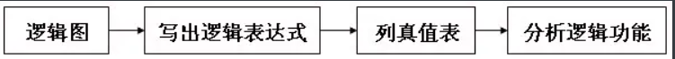
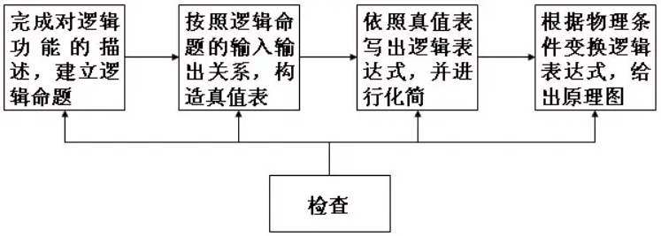
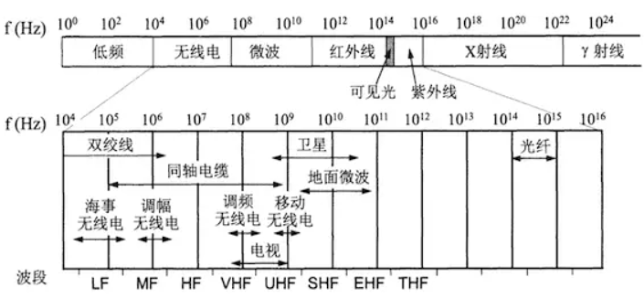

- # 电子器件

  - 电子管(真空管、充气管)
  - 固态电子器件(晶体管的分类及与真空管的对比)

- # 电子技术

  - 集成电路技术
    - 集成电路(IC、微电路、微芯片、芯片)
    - 微处理器
    - 裸晶(Die)的概念
  - 模拟电子技术(略)
  - 数字电子技术

- # 电子电路

  - 集成电路(物理量的分类)
    - 模拟电路
    - 数字电路(分类)
      - 概述、研究、分析方法、数字电路的优点和数字化
      - 组合逻辑电路和时序逻辑电路
      - ASIC和PLD
  - 逻辑门(数字电路的基本单元)


# 一、电子器件、电子技术和电子电路概念简介

##  电子器件

------

> 电子器件是指在真空、气体或固体中，利用和控制 `电子运动`规律而制成的器件。分为电子管(真空管、充气管)器件和固态电子器件。
>  在模拟电路中作整流、放大、调制、振荡、变频、锁相、控制、相关等作用；
>  在数字电路中作采样、限幅、逻辑、存储、计数、延迟等用。
>  充气管器件主要作整流、稳压和显示之用。
>  固态电子器件如集成电路

### 电子管

电子管（英文名称electron tube）在港台地区通称“胆”，是一种在密闭的玻璃管或金属管内产生电流传导，并通过电场对处于真空或特殊稀薄气体中的电子流进行有效控制，以完成整流、检波、信号放大或振荡等任务的电子器件。因电子管的密闭管壳内除了被抽成真空外，还有一些管壳内被充入了少量的惰性气体或汞蒸气，所以电子管有真空管( vacuumtube)和充气管（gas filled tube）之分。常用电子管绝大多数为真空管。
 在二十世纪中期前，因半导体尚未普及，基本上当时所有的电子器材都使用真空管，形成了当时对真空管的需求。但在半导体技术的发展普及和平民化下，真空管因成本高、不耐用、体积大、效能低等原因，最后被半导体取代了。

### 固态电子器件

固态电子器件（英语：Solid-state electronics）是指那些完全使用固体电子材料、并利用束缚于其内电子或者其他载流子导电的电路器件。这一概念经常用来与早期的技术如 真空管等作比较。

| 分类标准                                                 | 内容                                       |
| -------------------------------------------------------- | ------------------------------------------ |
| 根据原子、分子或离子的排列方式是否有特定周期性的规则划分 | 晶体（单晶体和多晶体）、无定形体（非晶体） |
| 根据导电性能划分                                         | 绝缘体、半导体和导体                       |

固态电子器件材料主要以 `结晶半导体`为主，其中`晶体管`更是广泛应用（基于晶体管的`固态硬盘`有取代传统机械旋转式硬盘的趋势）

**晶体管**

晶体管（transistor）是一种固体半导体器件（包括二极管、三极管、场效应管、晶闸管等，有时特指双极型器件），具有检波、整流、放大、开关、稳压、信号调制等多种功能。 晶体管作为一种可变电流开关，能够基于输入电压控制输出电流。

**晶体管应用及分类**

晶体管主要分为两大类：

- 双极性晶体管（BJT）：全称双极性结型晶体管（bipolar junction transistor, BJT），俗称三极管，是一种具有三个终端的电子器件。双极性晶体管是电子学历史上具有革命意义的一项发明。
- 场效应晶体管（FET）：是一种通过电场效应控制电流的电子元件，有时被称为“单极性晶体管”，以它的单载流子型作用对比双极性晶体管。

晶体管一般都有三个极，其中一极兼任输入及输出端子，(B)基极不能做输出，(C)集电极不能做输入之外，其余两个极组成输入及输出对。 晶体管之所以如此多用途在于其信号放大能力，当微细信号加于其中的一对极时便能控制在另一对极较大的信号，这特性叫增益。

- 当晶体管于线性工作时，输出的信号与输入的讯息成比例，这时晶体管就成了一放大器。这是在 `模拟电路`中的常用方式，例如电子放大器、音频放大器、射频放大器、稳压电路；
- 当晶体管的输出不是完全关闭就是完全导通时，这时晶体管便是被用作开关使用。这种方式主要用于 `数字电路`，例如数字电路包括逻辑门、随机存取内存（RAM）和微处理器。另外在开关电源中，晶体管也是以这种方式工作。

**晶体管和真空管的比较**

在晶体管发展之前，真空管是电子设备中主要的功率元件。

晶体管因为有以下的优点，因此可以在大多数应用中代替真空管：

- 没有因加热阴极而产生的能量耗损，应用真空管时产生的橙光是因为加热造成，有点类似传统的灯泡。
- 体积小，重量低，因此有助于电子设备的小型化。
- 工作电压低，只要用电池就可以供应。
- 在供电后即可使用，不需加热阴极需要的预热期。
- 可透过半导体技术大量的生产。
- 放大倍数大[6]。

相较于真空管，晶体管也有以下的限制：

- 硅晶体管会老化及失效
- 高功率，高频的应用中（例如电视广播），因真空管中的真空有助提升电子迁移率，效果会比晶体管要好。
- 固体电子元件在应用时比较容易出现静电放电现象。

## 电子技术

------

> 电子技术是一门研究电子器件及其应用的学科，广泛的应用于电视、雷达、通信、电子计算机、自动控制、航天等科学技术领域。

### 集成电路技术

随着1958年微电子学的深入研究，特别是新的光刻技术和设备的成熟，为计算机的发展又开辟了一个崭新的时代——集成电路时代。

**集成电路(integrated circuit，缩写 IC)，又称微电路(microcircuit)、微芯片(microchip)、芯片(chip)**

集成电路是一种微型电子器件或部件，是采用经过氧化、光刻、扩散、外延、蒸铝等半导体制造工艺，把一个电路中所需的晶体管、电阻、电容和电感等元件及相互间的布线互连一起，制作在一小块或几小块半导体晶片或介质基片上，然后焊接封装(有圆壳式、扁平式或双列直插式等多种形式)在一个管壳内，成为具有所需电路功能的微型结构。

- 其中所有元件在结构上已组成一个整体，使电子元件向着微小型化、低功耗、智能化和高可靠性方面迈进了一大步。
- 集成电路技术包括芯片制造技术与设计技术，主要体现在加工设备，加工工艺，封装测试，批量生产及设计创新的能力上。

> 从20世纪初期的`真空电子管(简称真空管) ——→ 晶体管(半导体三极管) ——→ 集成电路`

今天，我们可以将上亿个晶体管集成在一片邮票大小的半导体硅片上，组成十分复杂的电子电路。应用：

- 把过去的一台计算机制作在一片半导体硅片上，制成单片机，实现计算机的微型化。
- 把一个复杂的电子系统集成在一个半导体硅片上，作成“片上系统”(System on Chip，简称SoC)，然后植入到各行各业的各种设备中，使这些设备的性能得到质的飞跃。
- `微处理器`。

**微处理器（Microprocessor，缩写µP或uP)**

> 微处理器是可编程特殊集成电路。从物理角度来说，它就是一块集成了数量庞大的微型晶体管与其他电子组件的半导体集成电路芯片

- 是一种处理器，其所有组件小型化至一块或数块集成电路内。组件常安装在一个单片上或在同一组件内，但有时分布在一些不同芯片上。
- 是一种集成电路，可在其一端或多端接受编码指令，执行此指令并输出描述其状态的信号。这些指令能在内部输入、集中或存放起来。

微处理器的组件常安装在一个单片上或在同一组件内，但有时分布在一些不同芯片上。

- 在具有固定指令集的微型计算机中，`微处理器由算逻运算单元和控制单元组成(此外，还有一些寄存器、CPU中还会有中断系统)`。
- 在具有微程序控制的指令集的微型计算机中，它包含另外的控制存储单元

使用场景：

- 用作处理通用资料时，叫作`中央处理器(Central Processing Unit，CPU)`，这也是最为人所知的应用。
- 专用于图像资料处理的，叫作`图形处理器(Graphics Processing Unit，GPU)`。
- 用于音讯资料处理的，叫作`音讯处理单元(Audio Processing Unit，APU)`等等。

微处理器是微型计算机的一个主要部件(是微型计算机的运算、控制部分，它可与存储器和外围电路芯片组成微型计算机)。

之所以会被称为`微处理器`，不仅是因为它比迷你计算机所用的处理器还要小而已。最主要的区别，是因为当初各大芯片厂之制程，已经进入了`1微米尺度`的阶段。在微米尺度下所产制出来的处理器芯片，厂商就会在产品名称上用“微”字，以彰显自身的技术。与现在的许多商业广告中，“纳米”字眼时常出现一样

**发展**

从1970年代早期开始，微处理器性能的提升就基本上遵循着IT界著名的 `摩尔定律`，如今，大到巨型机，小到笔记型计算机，持续高速发展的微处理器取代了诸多其他计算形式而成为各个类别各个领域所有计算机系统的计算动力之源。

**裸晶(Die)**

> 裸晶(die，复数形可以是dice、dies或die)，也称裸芯片、裸芯片或裸片，是以半导体材料制作而成未经封装的一小块集成电路本体，该集成电路的既定功能就是在这一小片半导体上实现。

通常情况下，集成电路是以大批方式，经光刻等多项步骤，制作在大片的半导体晶圆(*指制作硅半导体集成电路所用的硅晶片，由于其形状为圆形，故称为晶圆。晶圆是生产集成电路所用的载体，一般晶圆产量多为单晶硅圆片*)上，然后再分割成若干 `方形`小片(消费者看到的CPU芯片一般都是方形的)，这一小片就称为 `芯片，每个芯片就是一个集成电路的复制品`。晶圆所用的半导体材料通常是电子级的硅（EGS）或其他半导体如砷化镓的单晶。独立的晶体管等半导体器件内的芯片其实也是使用同样的制法。

一般集成电路会 `封装`在陶瓷或塑胶等包装内，并引出接脚。由于电路的小型化需求，有时某些集成电路芯片会不作封装，直接交给下游用户使用，此时会称该裸片是裸晶

### 模拟电子技术


### 数字电子技术

近几年来，可编程逻辑器件PLD特别是现场可编程门阵列FPGA的飞速进步，使数字电子技术开创了新局面，不仅规模大，而且将硬件与软件相结合，使器件的功能更加完善，使用更灵活。

**数字电路和模拟电路在基本概念、基本原理以及分析方法和设计方法上都有明显的不同，所以很多大学分开讲述《数字电子技术基础》、《模拟电子技术基础》。电气专业的同学会完整的学习数字电子技术(包括数字逻辑电路、脉冲电路)，而计算机专业的同学只学习数字逻辑技术相关的知识**

## 电子电路

------

> 电路：是由电气设备和元器件，按一定方式连接起来，为电荷流通提供了路径的总体，也叫电子线路或称电气回路，简称网络或回路

> 电子电路（Electronic circuit）：将各式各样的`电子元件`，形成一回路电路，进行电信号的运算，电子元件形成电路为电子电路。
>  电子电路主要是研究电子器件(电子级别)，主要是考虑弱电环境

### 集成电路(IC)

> `集成电路，或称微电路、微芯片、晶片/芯片`在电子学中是一种把电路小型化的方式，并时常制造在半导体晶圆表面上。(对半导体元件产品的统称)
>  晶体管发明并大量生产之后，各式固态半导体组件如二极管、晶体管等大量使用，取代了真空管在电路中的功能与角色。到了20世纪中后期半导体制造技术进步，使得集成电路成为可能
>  当今半导体工业大多数应用的是基于 `硅`的集成电路。

**集成度**

集成电路的集成度是指单块芯片上所容纳的元件数目，集成度越高，所容纳的元件数目越多，为此对传统的光刻方法进行了很多改进以满足分辨率的要求，增加集成电路的集成度

**`集成`电路对比`离散`晶体管**

相对于手工组装电路使用个别的分立电子组件，集成电路可以把很大数量的微晶体管集成到一个小芯片，是一个巨大的进步。集成电路的规模生产能力，可靠性，电路设计的模块化方法确保了快速采用标准化集成电路代替了设计使用离散晶体管。**相比于离散晶体管有两个主要优势：成本低和性能高**

| 分类标椎                              | 类别                                                         |
| ------------------------------------- | ------------------------------------------------------------ |
| 按集成电路的集成度来分                | (与集成电路相对的是分立元件)、小规模集成数字电路(SSI)、中规模集成数字电路(MSI)、大规模集成数字电路(LSI)、超大规模集成数字电路(VLSI)、极大规模集成电路(ULSI)、GLSI |
| 按处理信号的不同来分                  | 模拟集成电路、数字集成电路、混合信号集成电路 (模拟和数字在一个芯片上) |
| 按构成电路的半导体器件/晶体管类型来分 | 双极型集成电路(由NPN或PNP型晶体管组成，典型的有TTL)、单极型集成电路(由MOS场效应晶体管组成的，MOS电路：P沟MOSIC、N沟MOSIC以及P沟、N沟结合的互补MOSIC，分别称为PMOS 、NMOS和CMOS IC) |

```
随着工艺技术的发展，CMOS集成电路已成为集成电路的主流
```

最先进的集成电路是微处理器或多核处理器的核心，可以控制计算机到手机到数字微波炉的一切。存储器和特定应用集成电路是其他集成电路家族的例子，对于现代信息社会非常重要。

#### 模拟电路

> 是指用来对模拟信号进行传输、变换、处理、放大、测量和显示等工作的电路。
>  模拟信号是指连续变化的电信号。

模拟电路是电子电路的基础，它主要包括放大电路、信号运算和处理电路、振荡电路、调制和解调电路及`电源`等

#### 数字电路(又称数字系统)

> 用数字信号完成对数字量进行算术运算和逻辑运算的电路称为数字电路，或数字系统。

1. `数字集成电路有各种门电路、触发器以及由它们构成的各种组合逻辑电路和时序逻辑电路`。一个数字系统一般由控制部件和运算部件组成，`在时脉的驱动下`，控制部件控制运算部件完成所要执行的动作。通过模拟数字转换器、数字模拟转换器，数字电路可以和模拟电路互相连接。
2. 现代的数字电路由半导体工艺制成的若干数字集成器件构造而成。`存储器`是用来存储二进制数据的数字电路。

| 分类标准             | 内容                                                         |
| -------------------- | ------------------------------------------------------------ |
| 按逻辑功能的特点来分 | 组合逻辑电路、时序逻辑电路(`时序电路 = 组合电路 + 存储信息的有记忆能力的电路`) |
| 按逻辑功能的特点来分 | 专用型、通用型(在讲PLD时详细描述)                            |
| 按功能来分           | `脉冲电路和数字逻辑电路`。前者研究电脉冲的产生、放大、变换、整形和测量；后者对数字信号进行算术运算和逻辑运算。 |

(`有些地方直接把数字电路称为数字逻辑电路`，脉冲电路也是由数字逻辑电路组成的？《数字电子技术》中有一章 —— 脉冲波形的产生和整形)

**研究**

数字电路中研究的主要问题是输出信号的状态（“0”或“1”）和输入信号（“0”或“1”）之间的逻辑关系，即电路的逻辑功能。
 数字电路的研究方法是逻辑分析和逻辑设计，所需要的工具是逻辑代数。 （在正逻辑下，“0”是低电平，“1”是高电平，高低电平没有明确的界限）

**分析方法**

**数字电路主要研究对象是电路的输出与输入之间的逻辑关系**，因而在数字电路中不能采用模拟电路的分析方法，例如，小信号模型分析法。由于数字电路中的器件主要工作在开关状态，因而采用的分析工具主要是逻辑代数，用功能表、真值表、逻辑表达式、波形图等来表达电路的主要功能。
 随着计算技术的发展，为了分析、仿真与设计数字电路或数字系统，还可以采用硬件描述语言，使用如ABEL语言等软件，借助计算机来分析、仿真与设计数字系统。

**数字电路的优点和"数字化"**

由于在数字电路中普遍采用的是二进制信号，每一位数字仅有0和1两个取值，所以只要电路能正确区分出两个不同状态就可以了，`允许有一定的偏差`。大大降低了对电路制造精度、工作条件以及运行环境的要求(相对而言，模拟电路要严格很多)。为了提高信号的精度，可以通过增加二进制数的位数来解决。

因此，首先制成的集成电路是数字集成电路。迄今为止，大多数的大规模和超大规模集成电路都属于数字集成电路。数字电路的应用得到了迅速的发展。

尤其在实现了计算机微型化以后，为了充分发挥数字电路在 `信号处理方面的强大优势`，可以先将模拟信号按比例的转换成数字信号，然后送到数字电路(包括计算机)进行处理，最后再将处理结果根据需要转换成模拟信号输出。自20世纪70年代以来，这种用数字电路处理模拟信号的所谓 `"数字化"`浪潮已经席卷了几乎所有的电子技术应用领域。

电子设备从以模拟方式处理信息，转到以数字方式处理信息的原因，主要在以下几个方面：

- 稳定性好。数字电路不像模拟电路那样易受噪声的干扰。
- 可靠性高。数字电路中只需分辨出信号的有与无，故电路的组件参数，可以允许有较大的变化（漂移）范围。
- 能长期存储。数字信息可以利用某种介质，如磁带、磁盘、光盘等进行长时期的存储。
- 便于计算机处理。数字信号的输出除了具有直观、准确的优点外，最主要的还是便于利用电子计算机来进行信息的处理。
- 便于高度集成化。由于数字电路中基本单元电路的结构比较简单，而且又允许组件有较大的分散性，这就使我们不仅可把众多的基本单元做在同一块硅片上，同时又能达到大批量生产所需要的良率。

##### 组合逻辑电路与时序逻辑电路

**组合逻辑电路**

> 特点：任一时刻的稳态输出，仅仅与该时刻的输入变量的取值有关，是无记忆电路——输入信号消失，则输出信号也会立即消失。 类似于电阻性电路

> 结构：由最基本的逻辑门电路组合而成

**时序逻辑电路**

> 特点：任一时刻的稳态输出，不仅取决于当前的输入，还与前一时刻输入形成的状态有关。类似于含储能元件的电感或电容的电路

> 结构：由最基本的逻辑门电路加上反馈逻辑回路（输出到输入）或器件组合而成的电路，与组合电路最本质的区别在于时序电路具有记忆功能。即时序电路 = 组合电路 + 存储信息的有记忆能力的电路：触发器、寄存器、计数器等。

##### 专用集成电路与PLD

**专用集成电路**

专用集成电路（英语缩写：ASIC），是指依产品需求不同而客制化的特殊规格集成电路，是由特定使用者要求和特定电子系统的需要而设计、制造。

专用集成电路的特点是面向特定用户的需求，品种多、批量少，要求设计和生产周期短，它作为集成电路技术与特定用户的整机或系统技术紧密结合的产物，与通用集成电路相比具有体积更小、重量更轻、功耗更低、可靠性提高、性能提高、保密性增强、成本降低等优点。

**PLD(可编程逻辑器件)**

**诞生背景**
 由于单个专用集成电路芯片的生产成本很高，如果出货量较小，则采用专用集成电路在经济上不太实惠。此时就可以使用可编程逻辑器件（如现场可编程逻辑门阵列）来作为目标硬件实现集成电路设计。

**结构与特点**

> PLD 是一种电子零件、电子组件，简而言之也是一种集成电路、芯片。PLD芯片属于数字类型的电路芯片，而非模拟或混合信号（同时具有数字电路与模拟电路）芯片。

```
PLD的结构原理
```

- 任何组合逻辑函数均可化为“与或”表达式，用“与门-或门”二级电路实现。
- 任何时序电路都是由组合电路加上存储元件(触发器)构成的。
- 从原理上说，与或阵列加上寄存器的结构可以实现任何数字逻辑电路。
- PLD:采用“与或阵列 + 寄存器 + 可灵活配置的互连线的结构” ，即可实现任意的逻辑功能。

1. 基本结构：1). 由或阵列直接输出，构成组合逻辑  2). 通过寄存器输出，构成时序逻辑
2. PLD是做为一种通用集成电路产生的，但它的逻辑功能是由用户通过对器件编程来设定的。一般的PLD的集成度很高，足以满足设计一般的数字系统的需要。`PLD不仅能构成组合逻辑电路，也能构成时序逻辑电路`

**特点**

1. PLD与一般数字芯片不同的是：PLD内部的数字电路可以在出厂后才规划决定，有些类型的PLD也允许在规划决定后再次进行变更、改变，而一般数字芯片在出厂前就已经决定其内部电路，无法在出厂后再次改变，事实上与一般的模拟芯片、混合信号芯片一样，在出厂后就无法再对其内部电路进行调修。
2. 可编程逻辑器件具有用户可编程特性，因此适合于大规模芯片量产之前的原型机，来进行调试等工作。但是可编程逻辑器件在面积、速度方面的优化程度不如全定制的集成电路。

**分类及发展：**


​																								图-分类及发展

PROM(可编程只读存储器)、EPROM(可擦除的)实际上也是一种可编程逻辑器件，只是由于绝大多数情况下是将其当成存储器使用，所以很多时候是跟存储器件一起介绍的。

### 逻辑门

> **逻辑门是数字电路的基本单元**。简单的逻辑门可由晶体管组成。这些晶体管的组合可以使代表两种信号的高低电平在通过它们之后产生高电平或者低电平的信号。高、低电平可以分别代表逻辑上的“真”与“假”或二进制当中的1和0，从而实现逻辑运算。常见的逻辑门包括“与”闸，“或”闸，“非”闸，“异或”闸（也称：异或）等等

TTL(晶体管-晶体管逻辑)逻辑门电路问世较早，其工艺经过不断改进，至今仍为主要的基本逻辑器件之一。随着CMOS(互补式金属氧化物半导体)工艺的发展，TTL的主导地位受到了动摇，有被CMOS器件所取代的趋势.

```
前者具有高速的特点；后者具有高集成度的特点，并且制造简单，成本低廉，功耗小，故MOS单极型集成电路被广泛应用
```

**分立元件门、集成逻辑门**

逻辑门可以用电阻、电容、二极管、三极管等分立原件构成，成为**分立元件门**。
 也可以将门电路的所有器件及连接导线制作在同一块半导体基片上，构成**集成逻辑门电路**。
 所以对应数字电路可以分为：分立元件数字电路、集成数字电路


作者：Tenloy
链接：https://www.jianshu.com/p/06d84c968f9e
来源：简书
著作权归作者所有。商业转载请联系作者获得授权，非商业转载请注明出处。

# 二、常见的数字逻辑电路器件及属性

## 组合逻辑电路

### 概述

> 特点：任一时刻的稳态输出，仅仅与该时刻的输入变量的取值有关，是无记忆电路——输入信号消失，则输出信号也会立即消失。

> 结构：由最基本的逻辑门电路组合而成

### 组合逻辑电路的分析

由已知的逻辑电路图，找出输入变量和输出函数之间的逻辑关系，达到分析电路功能，评价设计好坏，维护系统硬件，改善电路设计的目的，这个过程称为数字电路的逻辑分析。
 组合电路分析的步骤：




### 组合电路的设计

逻辑设计又称为逻辑综合，根据给定的逻辑条件或者提出的逻辑功能，整理出满足该逻辑的电路，这个过程称为数字电路的逻辑设计。
 组合电路设计的步骤：




### 应用

被用来做输入的信号跟储存的资料作逻辑代数运算之用：

- 编码器
- 译码器
- 数据选择器(多路开关、多路复用器)
- 加法器
- 数值比较器

#### 编码器

功能：将输入的每一个高、低电平信号编成一个对应的二进制代码

|           分类           | 特点                                                         |
| :----------------------: | ------------------------------------------------------------ |
| 普通编码器(二进制编码器) | 任何时刻只允许输入一个编码信号，否则输出将产生混乱           |
|        优先编码器        | 允许同时输入两个以上的有效编码输入信号，优先编码器能按照预先设定的优先级级别，只对其中优先级权最高的输入进行编码。 |

#### 译码器

功能：将每个输入的二进制编码译成对应的输出高、低电平信号或另外一个代码。译码是编码的反操作

|      分类       | 特点                                                         |
| :-------------: | ------------------------------------------------------------ |
|  二进制译码器   | 输入是一组二进制代码，输出是一组与输入代码一一对应的高、低电平信号 |
| 二—十进制译码器 | 将输入BCD码的10个代码译成10个高、低电平输出信号              |
|   显示译码器    | 见下面(由于markdown格式兼容)                                 |

显示译码器：

- **七段字符显示器**：为了能以十进制数码直观地显示数字系统的运行数据，目前广泛的使用七段字符显示器或成为七段数码管，这种字符显示器由七段可发光的线段拼合而成，常见的有半导体数码管和液晶显示器。
- **BCD-七段显示译码器**：半导体数码管和液晶显示器都可以用TTL或CMOS集成电路直接驱动。为此就需要显示译码器将BCD代码译成数码管所需要的驱动信号，以便使数码管用十进制数字显示出BCD代码所表示的数值

#### 数据选择器(多路开关、多路复用器)

> 是一种可以从多个模拟或数字输入信号中选择一个信号进行输出的器件。

**特点：**
 一个有 2^n 输入端的数据选择器有 n 个可选择的输入－输出线路，可以通过控制端来选择其中一个信号被选择作为输出。

**作用：**

- 数据选择器主要用于增加一定量的时间和带宽内的可以通过网络发送的数据量。
- 数据选择器使多个信号共享一个设备或资源，例如一个模拟数字转换器或一个传输线，而不必给每一个输入信号配备一个设备

**构造：**

数据选择器是一种常用模块，最小的是二选一数据选择器。
大型的数据选择器可以由较小的数据选择器级联(级联又称链联，是将二端口网络输出端口的2个端子分别连接到下一个二端口网络输入端口的2个端子的联接方式)来实现。

#### **多路复用**

> 多路复用（Multiplexing，又称“多工”）是一个通信和计算机网络领域的专业术语，在没有歧义的情况下，“多路复用”也可被称为“复用”。多路复用通常表示在一个信道上传输 `多路信号或数据流`的过程和技术。因为多路复用能够将多个低速信道整合到一个高速信道进行传输，从而有效地利用了高速信道。通过使用多路复用，通信运营商可以避免维护多条线路，从而有效地节约运营成本。

**工作过程**
 首先，各个低速信道的信号通过`多路复用器（MUX，多工器）`组合成一路可以在高速信道传输的信号。在这个信号通过高速信道到达接收端之后，再由`分路器（DEMUX，解多工器）`将高速信道传输的信号转换成多个低速信道的信号，并且转发给对应的低速信道。

在实际的通信工程应用里，多路复用器和分路器通常作为一个设备被一起生产和安装。作为发送数据的时候，这个设备就作为多路复用器，在接收数据的时候，这个设备就作为分路器

**种类**
 多路复用根据使用的技术可以分为时分复用（TDM）、频分复用（FDM）、空分复用（SDM）和码分复用（CDM）。

- 时分复用的特点是：高速信道根据时间划分成多个 `时隙`供多个低速信道轮流使用，在一个时隙内，只能有一个低速信道占有高速信道的资源。
- 频分复用的特点是：多路复用器将各个低速信道的信号通过 `调制`分布到高速信道的各个 `频段`，然后进行叠加，形成高速信道上传输的信号，在接收端，分路器一般通过 `带通滤波器`分离各个频段，然后转发给对应的低速信道。在光通信领域，根据光波波长的不同进行多路复用的技术被称为 `波分复用（WDM）`。
- 空分复用的特点是：使用多天线技术，通过 `波束成形`技术将信号对准特定的发射源或接收站进行接收或发送。通过空分复用，多个发射源或者接受站可以同时使用同一个频率。在实际的通信工程里，空分复用通常和其它复用技术结合使用。
- 码分复用的特点是：采用 `扩频通信技术`（传输信息所用信号的带宽远大于信息本身的带宽），各个低速信道可以在同一个地方同时使用相同的频率进行通信，不同的低速信道通过采用不同的地址码复用整个频段。

#### 加法器

两个二进制数之间的算术运算无论是加、减、乘、除，目前在数字计算机中都是化做若干步加法运算进行的，因此，加法器是构成算术运算器的基本单元

| 分类       | 特点                                                         |
| ---------- | ------------------------------------------------------------ |
| 1位加法器  | 又可分为半加器、全加器。实现半加运算的电路称为半加器，实现的全加运算的电路称为全加器 |
| 多位加法器 | 串行进位加法器、超前进位加法器                               |

**补充**

半加运算：如果不考虑有来自低位的进位将两个1位二进制数相加，称为半加
全加运算：在将两个多位二进制数相加时，除了最低位以外，每一位都应该考虑来自低位的进位，即将两个对应位的加数和来自低位的进位3个数相加，这种运算称为全加

#### 数值比较器

在一些数字电路（数字系统，例如数字计算机）当中，经常要求比较两个数值的大小，完成这一功能的各种逻辑电路统称为数值比较器。分为1位数值比较器、多位数值比较器

## 半导体存储电路

### 概述

在复杂的数字电路中，不仅需要对各种数字信号进行算术运算和逻辑运算，而且还需要在运算过程中不断地将运算数据和运算结果保存起来。因此，存储电路就成为计算机以及所有复杂数字系统不可缺少的组成部分。
 **存储单元**：通常将只能存储一位数据的电路叫做存储单元。
 **寄存器**：将用于存储一组数据的存储电路叫做寄存器。
 **存储器**：将用于存储大量数据的存储电路叫做存储器。
 后两者中包含了许多存储单元。

##### 静态存储单元和动态存储单元

半导体存储电路中使用的存储单元可以分为静态存储单元和动态存储单元两大类。

**静态存储单元**
 由门电路连接而成，其中包括各种电路结构形式的`锁存器和触发器`。只要不切断供电电源，静态存储单元的状态会一直保持下去。

**动态存储单元**
 是利用`电容的电荷存储效应`来存储数据的，由于电容的充放电需要一定的时间，所以它的工作速度低于静态存储单元，而且电容上存储的电荷会随着时间的推移而逐渐泄露，必须定期进行"刷新"(即将原来的数据重新写入)，才能保证数据不会丢失。虽然如此，`由于动态存储单元的电路结构十分简单，便于大规模集成，所以仍然被广泛用于大容量的存储期当中`

在动态存储器中，目前几乎都采用只包含一个MOS电容和一只MOS管的单管存储单元。

### 应用

- 锁存器
- 触发器
- 寄存器
- 存储器
  - 随机存储器（静态SRAM、动态DRAM 是时序逻辑电路）
  - 只读存储器（ROM是组合逻辑电路）

#### 锁存器

锁存器（英语：latch），或称闩锁，是数字电路中`异步时序逻辑电路系统中用来储存资讯的一种电子电路`。一个锁存器可以储存一比特的资讯，通常会有多个一起出现，有些会有特别的名称，像是 “4位锁存器”（可以储存四个比特）或“8位锁存器”（可以储存八个比特）等等

**SR锁存器**

SR锁存器(又有称为“RS锁存器”)是静态存储单元当中最基本、也是电路结构最简单的一种。其中“S”表示“设定”（Set），“R”表示“重设”（Reset）。这种锁存器是由一对相互交错的NAND逻辑门组成。储存的比特是在输出的地方用Q表示

**门控D锁存器**

门控D锁存器由SR锁存器扩展而成，增加了两个与门，一个非门和两个输入：数据(D)及门控(G，或写为时钟脉冲CP，Clock Pulse等)。S输入端被设置为D AND G，同时R输入端被设置为D AND G，当G为低电平（0）时，输出保持不变（换言之，Qnext等于Q）。当G为高电平（1）时，输出（Q）与D相同

#### 触发器

功能：

触发器与锁存器的不同在于，它除了置1、置0输入端以外，又增加了一个触发信号输入端。只有当触发信号到来时，触发器才能按照输入的置1、置0信号置成相应的状态，并保持下去。我们将这个触发信号成为时钟信号(CLOCK)，记作CLK。当系统中有多个触发器需要同时动作时，就可以用同一个时钟信号作为`同步控制信号`。

特点：

触发器（英语：Flip-flop, FF），中国大陆译作“触发器”、台湾及香港译作“正反器”，是一种具有两种稳态的用于储存的组件，可记录二进制数字信号“1”和“0”。
 触发器是一种双稳态多谐振荡器。该电路可以通过一个或多个施加在控制输入端的信号来改变自身的状态，并会有1个或2个输出。`触发器的线路图由逻辑门组合而成，其结构均由SR锁存器派生而来（广义的触发器包括锁存器）`。触发器可以处理输入、输出信号和时脉之间的相互影响。这里的触发器特指flip-flop，flip-flop一词主要是指具有两个状态相互翻转，例如编程语言中使用flip-flop buffer（翻译作双缓冲）。

```
触发器是构成时序逻辑电路以及各种复杂数字系统的基本逻辑单元。触发器和锁存器是在计算机、通讯和许多其他类型的系统中使用的数字电子系统的基本组成部分。
```

目前，触发器的电路结构形式已经有很多种。由于电路结构不同，各种触发器在逻辑功能(指稳态下触发器的次态和触发器的现态与输入之间的逻辑关系)和触发方式(指触发器在动态翻转过程中的动作特点)上也不一样。

- 触发信号的工作方式可以分为：电平触发、边沿触发、脉冲触发
- 按照逻辑功能的不同特点，通常将时钟控制的触发器分为SR触发器、JK触发器、T触发器和D触发器等几种类型

#### 触发器与锁存器的比较

锁存器和触发器的对比：

1. 功能上：锁存器和触发器的根本区别在于，锁存器的置1和置0操作通过直接输入置1和置0信号即可完成，而触发器的置1和置0操作除了需要输入置1和置0信号以外，还必须有时钟信号到达时才能完成。因此锁存器的电路比较简单，功能也比较单一。
2. 应用上：由于锁存器不仅电路结构简单，而且所具备的功能可以满足存储器对存储单元的要求，所以在大容量的静态存储器中，都采用锁存器作为存储单元，而不采用电路结构相对复杂的触发器。然而，在寄存器当中，因为需要用时钟信号控制其中所有的存储单元同时动作，所以必须使用触发器。另外：在设计时序逻辑电路中的存储电路中，锁存器的逻辑功能已无法满足要求，所以也必须使用触发器

#### 寄存器

寄存器通常是由一组触发器组成(也有锁存器组成的)，每个触发器的输入和输出都有引出端，可以直接和周围电路连接，快速地进行数据交换。由n个触发器组成的寄存器可以存储一组n位的二值数据。对寄存器中的触发器只要求它们具有置1、置0的功能即可，因而电平、脉冲、边沿触发的触发器，都可以组成寄存器。

用来存放数据的一些小型存储区域，用来暂时存放参与运算的数据和运算结果，它被广泛的用于各类数字系统和计算机中。其实`寄存器就是一种常用的时序逻辑电路`，但这种时序逻辑电路只包含存储电路。寄存器的存储电路是由锁存器或触发器构成的，因为一个锁存器或触发器能存储1位二进制数，所以由N个锁存器或触发器可以构成N位寄存器。 工程中的寄存器一般按计算机中字节的位数设计，所以一般有8位寄存器、16位寄存器等。

是 `中央处理器内的其中组成部分`。寄存器是有限存贮容量的高速存贮部件，它们可用来暂存指令、数据和地址。在中央处理器的控制部件中，包含的寄存器有指令寄存器（IR）和程序计数器。在中央处理器的算术及逻辑部件中，包含的寄存器有累加器
 `寄存器是存储器层次结构中的最顶端，也是系统操作数据的最快速途径`

寄存器种类：

- 数据寄存器
   用来存储整数数字。在某些简单（或旧）的CPU，特别的数据寄存器是`累加器`，作为数学计算之用。

- 地址寄存器
   持有存储器地址，以及用来访问`存储器`。在某些简单/旧的CPU里，特别的地址寄存器是`索引寄存器`（可能出现一个或多个）。

- 通用目的寄存器
   （GPRs）- 可以保存数据或地址两者，也就是说他们是结合 数据/地址 寄存器的功用。

- 浮点寄存器
   （FPRs）- 用来存储浮点数字。

- 常量寄存器
   用来持有只读的数值（例如0、1、圆周率等等）。由于“其中的值不可更改”这一特殊性质，这些寄存器未必会有实体的硬件电路相对应，例如将从零常数寄存器读的操作实现为接通目标寄存器的下拉电阻。

- 向量寄存器
   用来存储由向量处理器运行SIMD指令所得到的数据。

- 特殊目的寄存器

  存储CPU内部的数据，像是程序计数器（或称为指令指针），堆栈寄存器，以及状态寄存器（或称微处理器状态字组）。

  - **指令寄存器** - 存储现在正在被运行的指令
  - **变址寄存器** - 是在程序运行时用来更改操作数地址之用。
  - 在某些架构下，**模式指示寄存器**（也称为“机器指示寄存器”）存储和设置跟处理器自己有关的数据。由于他们的意图目的是附加到特定处理器的设计，因此他们并不被预期会成微处理器世代之间保留的标准。
  - 有关从随机存取存储器提取信息的寄存器与CPU（位于不同芯片的存储寄存器集合）
    - 存储器缓冲寄存器
    - 存储器数据寄存器
    - 存储器地址寄存器
    - 存储器类型范围寄存器

#### 半导体存储器

存储器是一种能够存储大量二值信息(或称为数据)的器件。由于计算机以及其他一些数字系统的工作过程中，都需要对大量的数据进行存储，所以存储器也就成了计算机和这些数字系统不可缺少的组成部分。这里只介绍半导体集成电路制成的各种半导体存储器。
 `存储容量和存取速度是衡量存储器性能的两个最重要的指标。`

因为半导体存储器的存储单元数目极其庞大而器件的引脚(电子元件的末端露出部分)数目有限，所以在电路结构上就不可能像寄存器那样把每个存储单元的输入和输出直接引出。为了解决这个矛盾，在存储器中给每个存储单元编了一个地址，只有被输入地址代码指定的那些存储单元才能与公共的输入/输出引脚接通，进行数据的读出或写入

`存储器的种类虽然很多，但它们的基本结构形式都是由存储矩阵和读/写控制电路两部分组成的。`首先，根据工作方式的不同，可以将存储器分为随机存储器(RAM)和只读存储器(ROM)两大类。

- RAM的工作特点是可以随时从其中快速地读出或写入数据。`断电之后，数据随之消失`。根据采用的存储单元不同又分为
  - 静态随机存储器(SRAM)，采用的静态存储单元
  - 动态随机存储器(DRAM)，采用的动态存储单元
- ROM的工作方式与随机存储器不同，在正常的读/写工作状态下，只能从其中读出所存储的数据。因此，只读存储器一般都用来存储一些 `固定、预先写好`的数据。`电路结构简单，断电之后数据不会丢失` 又分为
  - 掩模ROM
     掩模ROM中的数据在制作芯片是已经确定，无法更改
  - 可编程ROM(PROM)
     PROM中的数据可以由用户根据自己的需要写入，但已经写入以后就不能再修改了
  - 可擦除的可编程ROM(EPROM)
     EPROM中的数据则不但可以由用户自己写入，而且还能擦除重写，具有更大的使用灵活性。初期是紫外线照射的方法擦除，后来被电信号擦除的方法替代，后者又被称为(E2PROM)，目前在U盘和各种便携式移动设备中广泛使用的“闪存”就是一种E2PROM。虽然EPROM中的数据可以擦除改写，但由于擦除改写的速度相对读出的数度慢得多，所以通常仍然将它用作只读存储器
- 根据使用的半导体器件类型，又可分为双极性和MOS型。鉴于MOS电路(尤其是CMOS电路)具有功耗低、集成度高的优点，所以目前大容量的存储器都是采用MOS制作的

1. **`ROM是组合逻辑电路，RAM是时序逻辑电路`**。组合逻辑是这一刻的输出仅决定于这一刻的输入，与以前的状态无关。ROM虽然是记忆原件，但从它控制原理来讲，在输入一组控制信号时，仅仅是把存储的内容取出来，与这组控制信号以前的输入状态没有关系，每输入一组控制信号，就对应一组输出信号。所以ROM是组合逻辑电路
2. 在只读存储器中，由于每个存储单元所存储的数据都是固定的1或0，所以每个存储单元被选中时，只需给出固定的高电平(要求存入1时)或低电平(要求存入0时)就行了。为此，只要根据要求存储的数据，决定在相应存储单元的位置上是否接入一个二极管或三极管，就可以得到想要存储的数据了。这就使得存储矩阵的电路大为简化，从而更有利于大规模集成。
3. 由于只读存储器不仅可以用于存储数据，而且还可以通过写入相应的数据产生所需要的逻辑函数，所以有些地方也把只读存储器视为一种可编程逻辑器件，在PLD的相关内容中讲解

#### 存储器与寄存器的比较

寄存器的电路结构比较简单，它实际上就是一组具有公共时钟信号输入端的触发器。由于每个触发器的输入端和输出端都被直接引出，所以便于和其他电路直接相连，快速进行数据交换。因此，在计算机和其他一些高速的数据处理系统中，经常会用到寄存器。
 存储器的电路结构形式不同于寄存器。由于存储器中存储单元的数量非常大，而集成电路引出端的数目是很有限的，不可能将每个存储单元的输入端和输出端都引出，所以采用了寻址读/写的工作方式：只有被选中地址中的一个(或一组)存储单元才能与输入、输出电路接通，进行读/写操作，而输入、输出电路是公用的。

## 时序逻辑电路

### 概述

> 特点：任一时刻的稳态输出，不仅取决于当前的输入，还与前一时刻输入形成的状态有关。因此，任何时刻下时序电路的状态和输出均可以表示为输入变量和电路原来状态(亦称状态变量)的逻辑函数。由于时序电路工作时始终是在有限个状态间按一定规律转换的，所以也将时序电路称为状态机(SM)或算法状态机(ASM).

> 结构：由最基本的逻辑门电路加上反馈逻辑回路（输出到输入）或器件组合而成的电路，与组合电路最本质的区别在于时序电路具有记忆功能。即时序电路 = 组合电路 + 存储电路：触发器、寄存器、计数器等。

从时序逻辑电路中，可以建出两种形式的有限状态机：

- 摩尔型有限状态机：输出只跟内部的状态有关。（因为内部的状态只会在时脉触发边缘的时候改变，输出的值只会在时脉边缘有改变）
- 米利型有限状态机：输出不只跟目前内部状态有关，也跟现在的输入有关系。

### 分析和设计

描述时序电路功能的方法有返程组(由状态方程、驱动方程和输出方程组成)、逻辑图、状态转换真值表、状态转换图和时序图。
 时序逻辑电路分析的关键是求出状态方程和状态转换真值表，由状态转换真值表可分析出时序逻辑电路的功能，同时可画出状态转换图和时序图。
 同步时序逻辑电路的设计首先应根据设计要求列出最简状态表，用卡诺图求出状态方程和驱动方程，并由此画出电路的逻辑图

### 应用

- 按功能/用途分为

  被用来建构某些形式的电脑的内存，延迟跟储存单元，以及有限状态自动机。由于具体的时序电路千变万化，所以它们的种类不胜枚举。下面只是介绍几种

  - 寄存器(以移位寄存器为例)
  - 计数器
  - 顺序脉冲发生器(节拍发生器)
  - 顺序脉冲检测器
  - 序列信号发生器
  - 码组变换器

- 按各触发器的动作特性分为：

  - 同步时序电路：电路中所有触发器的状态变化同步进行，即：所有CP端联在一起，由CP信号同一有效沿触发。
  - 异步时序电路：
    - 电路中根本没有CP同步信号。
    - 各触发器不是用同一CP脉冲的同一有效沿触发的。

#### 移位寄存器

寄存器就是一种常用的时序逻辑电路，但这种时序逻辑电路只包含存储电路
 移位寄存器：具有移位功能的寄存器称为移位寄存器。所谓移位功能是指寄存器里存储的代码能在移位脉冲的作用下一次左移或右移。因此，移位寄存器不但可以用来寄存代码，还可以用来实现数据的串行-并行转换、数值的运算以及数据处理

#### 计数器

在数字系统中使用的最多的时序电路要算是计数器了。计数器不仅能用于对时钟脉冲计数，还可以用于分频、定时、产生节拍脉冲和脉冲序列以及进行数字运算等。
 计数器的种类非常繁多，常见分类：

| 分类标准                           | 内容                                                         |
| ---------------------------------- | ------------------------------------------------------------ |
| 按计数器中的触发器是否同时翻转分类 | 同步式(同时)、异步式(有先有后)等                             |
| 按技术过程中计数器中的数字增减分类 | 加法计数器、减法计数器和可逆计数器(或称为加/减计数器，可加可减)等 |
| 按计数器中数字的编码方式分类       | 二进制计数器、二-十进制计数器、格雷码计数器等                |
| 按计数器的计数容量分类             | 十进制计数器、六十进制计数器等                               |

#### 顺序脉冲发生器(节拍发生器)

在一些数字系统中，有时需要系统按照事先规定的顺序进行一些列的操作。这就要求系统的控制部分能给出一组在时间上有一定先后顺序的脉冲信号，再用这组脉冲形成所需要的各种控制信号。顺序脉冲发生器就是用来产生这样一组顺序脉冲的电路。采用触发器、移位寄存器、计数器与译码器、脉冲分配器、接口电路与译码器等均能实现时序脉冲发生器，并且具有广泛的实用性及通用性。

#### 序列信号发生器

在数字信号的传输和数字系统的测试中，有时需要用到一组特定的串行数字信号。通常将这种串行数字信号称为序列信号。产生序列信号的电路称为序列信号发生器。
 序列信号发生器的构成方法有多种。一种比较简单、直观是用计数器和数据选择器组成。另一种常见方法是采用带反馈逻辑电路的移位寄存器。

#### 同步时序逻辑电路

同步时序电路中所有存储元件都在时钟脉冲CP的统一控制下，用触发器作为存储元件。`几乎现在所有的时序逻辑都是“同步逻辑”`：有一个“时钟”信号，所有的内部内存（'内部状态'）只会在时钟的边沿时候改变。在时序逻辑中`最基本的储存元件是触发器`。

同步逻辑最主要的优点是它很简单。每一个电路里的运算必须要在时钟的两个脉冲之间固定的间隔内完成，称为一个 '时钟周期'。只有在这个条件满足下（不考虑其他的某些细节），电路才能保证是可靠的。

同步逻辑也有两个主要的缺点：

- 时钟信号必须要分布到电路上的每一个触发器。而时钟通常都是高频率的信号，这会导致功率的消耗，也就是产生热量。即使每个触发器没有做任何的事情，也会消耗少量的能量，因此会导致废热产生。
- 最大的可能时钟频率是由电路中最慢的逻辑路径决定，也就是`关键路径`。意思就是说每个逻辑的运算，从最简单的到最复杂的，都要在每一个时脉的周期中完成。一种用来消除这种限制的方法，是将复杂的运算分开成为数个简单的运算，这种技术称为“流水线”。这种技术在微处理器中非常的显著，用来帮处提升现今处理器的时钟频率。

#### 异步时序逻辑电路

异步时序逻辑是循序逻辑的普遍本质，但是由于它的弹性关系，他也是设计上困难度最高的。`最基本的储存元件是锁存器。`锁存器可以在任何时间改变它的状态，依照其他的锁存器信号的变动，他们新的状态就会被产生出来。
 异步电路的复杂度随着逻辑门的增加，而复杂性也快速的增加，因此他们大部分仅仅使用在小的应用。然而，电脑辅助设计工具渐渐的可以简化这些工作，允许更复杂的设计.


作者：Tenloy
链接：https://www.jianshu.com/p/a32751c690a8
来源：简书
著作权归作者所有。商业转载请联系作者获得授权，非商业转载请注明出处。

# 三、常见信号分类

## 电磁波回顾

> 电磁波，又称电磁辐射，是指同相振荡，且互相垂直的电场与磁场，在空间中以波的形式传递能量和动量。其是横波，传播方向垂直于电场与磁场的振荡方向。
>  电磁辐射的量子形式是光子。电磁波 `不需要依靠介质进行传播`，在真空中其传播速度为光速。

**产生**

一个振荡中的电场会产生振荡的磁场，而一个振荡中的磁场又会产生振荡的电场，这样子，这些连续不断同相振荡的电场和磁场共同地形成了电磁波

**参数**

波是由很多前后相继的波峰和波谷所组成，两个相邻的波峰或波谷之间的距离称为波长，每秒钟振荡的次数是频率

**电磁波的频谱和应用**



从上图可以看出，人们现在已经能使用好几个波段进行通信，紫外线以及更高的波段目前还不能用于通信。

## 信号

> 在通讯系统、信号处理或者电子工程等技术领域中，信号是“传递有关一些现象的行为或属性的信息的函数。” —— 维基百科
>  信号是信息的载体，通常是以某种物理量表现出来的。通信技术不同，采用的传输信号形式就不同。信号的特性：信号必须是可变化、可观测和可实现的某种物理量

对信号的分类方法很多，下表只是一部分：

| 分类标准                 | 内容                           | 附加说明                                                     |
| ------------------------ | ------------------------------ | ------------------------------------------------------------ |
| 按照幅值是否连续         | `模拟信号和数字信号`           | 模拟信号和数字信号都是基带信号                               |
| 按信号载体分类           | 电信号、机械波信号和电磁波信号 | **电信号**是指以电压、电流、电磁波(无线电)等为载体的信号。**光信号**是指利用光线的强弱变化和有光无光作为载体的信号 |
| 按传输介质分类           | `有线信号和无线信号`           | 是在有线信道还是无线信道上传输，通常由于采用的传输信道不同，对信号的处理和转换方法也就不同。 |
| 按是否调制分类           | `基带信号和频带信号`           | 基带信号：信号频谱未经搬移的基本频带信号，即直接携带信息、能够直接传输的信号。频带信号：信号频谱经过搬移的信号，即经过调制的信号。也就是说，将有用信号调制到另一载波上的信号。基带信号由于信号未经调制，可以直接发送和接收；而频带信号在发送端将基带信号调制到载波上，使得载波的某一参量随传输信号的变化而变化，接收端则要对其接收的信号进行解调，以便从载波信号中恢复出原始信号。 |
| 按信号是否有周期性分类   | 周期信号和非周期信号           | 周期信号：按照一定周期重复出现的信号。可用f(t)=f(t+nT)表示周期为了的信号，如正弦信号。非周期信号：不满足周期信号特征的所有信号称为非周期信号 |
| 按信号变化是否有规律分类 | 确定信号和随机信号             | 确定信号：信号某些参量具有一定规律性，按照其规律可以预测信号的变化，如正弦信号。随机信号：信号变化是随机的，没有任何规律，如语音信号。 |

### 模拟信号和数字信号

**模拟量和数字量**

当我们观察自然界中各种物理量时不难发现，就其变化规律的特点而言，不外乎有两大类。
 一类是物理量的变化在时间上或数量上是连续的，把这一类物理量称为**模拟量**。模拟信号在连续变化过程中的任何一个取值都有具体的物理意义，表示一个瞬时值。
 一类是物理量的变化在时间上和数量上都是离散的，即它们的变化在时间上是不连续的，总是发生在一系列离散的瞬间。而且它们的数值的大小和每次的增减变化都是某一个最小数量单位的整数倍，我们把这一类物理量称为**数字量**。

**模拟信号和数字信号**

当我们把模拟量和数字量转换成电压(或电流)信号时，得到的电压(或电流)信号也分为模拟信号和数字信号两大类。工作在模拟信号下的电子电路称为**模拟电子电路(简称模拟电路)**，而工作在数字信号下的电子电路称为**数学电子电路(简称数字电路)**，数字信号在电路中常表现为突变的电压或电流.

**数-模和模-数转换**

由于数字电子技术的迅速发展，尤其是计算机在自动控制、自动检测以及许多其他领域中的广泛应用，用数字电路处理模拟信号的情况更加普遍了。
 为了能够使用数字电路处理模拟信号，必须把模拟信号转换成相应的数字信号，方能 `送入数字系统`(例如微型计算机)进行处理。同时，往往还要求把处理后得到的数字信号再转换成相应的模拟信号，作为最后的`输出`。

- 把前一种从模拟信号到数字信号的转换称为模/数转换，或简称为A/D(Analog to Digital)转换
- 把实现A/D转换的电路称为A/D转换器，简写为ADC
- 把后一种从数字信号到模拟信号的转换称为数/模转换，或简称为D/A(Digital to Analog)转换
- 把实现D/A转换的电路称为D/A转换器，简写为DAC

**技术指标**

为了保证数据处理结果的准确性，A/D转换器和D/A转换器必须有足够的转换精度。同时，为了适应快速过程的控制和检测的需要，A/D转换器和D/A转换器还必须有足够快的转换速度。因此，`转换精度和转换速度`是衡量A/D转换器和D/A转换器性能优劣的主要标志。

**转换器分类:**
 D/A转换器电路结构形式有多种，从基本原理上可以归为两类:电流求和型、分压器型。
 A/D转换器的类型也有多种，可以分为直接A/D转换器和间接A/D转换器两大类。

- 在直接A/D转换器中，输入的模拟电压信号直接被转换成相应的数字信号;
- 在间接A/D转换器中，输入的模拟信号首先被转换成某种中间变量(例如时间、频率等)，然后再将这个中 间变量转换为输出的数字信号。

在D/A转换器数字量的输入方式上有并行输入和串行输入两种，而A/D转换器数字量的输出方式也有并行输出和 串行 输出两种

### 电信号、机械波信号和电磁波信号

- 电信号：

  电是静止或移动的电荷所产生的物理现象。

  电信号

  是指随着时间而变化的电压或电流，通常以电压、电流、电磁波(无线电)等为载体

  - 电压信号
  - 电流信号(电流信号传输比电压信号传输的抗干扰能力强很多，而且线路压降的影响也小很多)
    - 直流电：大小和方向都不随时间变化的电流
    - 交流电：大小和方向随时间作周期性变化(可以产生电磁波)
    - 脉冲电：波形是脉冲的电压或电流(会产生电磁波)
  - 电磁波无线电信号

- 波信号：

  根据波的产生机理，可以分为两种：机械波、电磁波

  - 机械波是机械振动引起的振动在介质中的传播，电磁波是电磁振荡产生的变化电磁场向空间的传播。
  - 机械波需要介质传播，而电磁波不需要介质传播(前者不能在真空中传播，后者可以)
  - 机械波的波速由介质决定，电磁波的波速在真空中等于光速，在空气中近似真空中。
  - 机械波比如水波、声波、地震波等，电磁波就包括很多了，频谱中很多现在都已经可以用来通信了，目前广泛使用的是光信号：利用光线的强弱变化和有光无光作为载体的信号

电信号与波信号是有交集的，比如无线电信号。

#### 电信号

电信号是指随着时间而变化的电压或电流，根据生成方式可以分为两种：

- 经由感应器将自然参数转换而成的电信号。比如：麦克风、温度计、压力计等
- 使用各式元件设计而成的各种电信号。比如：基本元件、离散式电子电路、集成电路产生的电信号等
   一般经由自然参数转换产生的电信号为类比信号，经由元件设计产生的电信号可为类比信号亦可为数位信号

#### 电磁波信号

从上图可以看出，人们现在已经能使用好几个波段进行通信，紫外线以及更高的波段目前还不能用于通信。常用的是：无线电信号(无线电通信)、微波信号(微波通信)、光信号(光纤通信)

##### 光信号(光纤通信)

光纤通信就是利用光导纤维（以下简称为光纤）传递光脉波来进行通信。有光脉波相当于1，而没有光脉波相当于0。由于可见光的频率非常高，约为10^14HZ的量级，因此一个光纤通信系统的传输带宽远远大于目前其他各种传输媒体的带宽。
 光纤是光纤通信的传输媒体。在发送端有光源，可以采用发光二极管或半导体激光器，他们在电脉波的作用下能产生光脉波。在接收端利用光电二极管做成光检测器，在检测到光脉波时可还原出电脉波。

当通讯系统的设备中不使用接收器时，也可以是借由人眼观察来解释讯号，简单的讯号如烽火、复杂的讯号则如光编译的色码或闪光摩斯密码等。

##### 微波信号(无线通信)

微波通讯是指一种综合技术，将信号以频率在0.3 GHz 至300 GHz的微波作为载体传输。 部分被称作毫米波的微波辐射非常容易被大气层（特别是潮湿的天气）衰减。
 可用于作为与通讯卫星通信的方式、用作电视信号，携带电话等无线通信设备的通讯等

##### 无线电信号(无线电技术)

无线电技术是通过无线电波传播信号的技术，其原理在于，导体中电流强弱的改变会产生无线电波。利用这一现象，通过调制可将信息加载于无线电波之上。当电波通过空间传播到达收信端，电波引起的电磁场变化又会在导体中产生电流。通过解调将讯息从电流变化中提取出来，就达到了资讯传递的目的。

无线电的最早应用于航海中，使用摩尔斯电报在船与陆地间传递信息。现在，无线电有着多种应用形式，包括无线数据网，各种移动通信以及无线电广播等。具体比如：

- 通信（无线电报、调幅广播、调频广播、一些军用电台、蜂窝电话和移动电话、电视、数据传输如蓝牙）
- 导航(卫星)
- 雷达
- 遥控
- 等等

### 有线信号和无线信号

**传输介质**

传输介质也称传输介质或传输媒介，它就是数据传输系统中在发送器和接收器之间的物理通路。可分为两大类，即导引型传输媒体(导向传输媒体)和非导引型传输媒体。在导引型传输媒体中，电磁波被导引沿着固体媒体（铜线或光纤）传播，而非导引型传输媒体就是指自由空间，在非导引型传输媒体中电磁波的传输常称为无线传播。

- 光缆(以石英为介质，传输的是光信号)
- 电缆(一般以金属作为介质，比如电话线、同轴电缆、双绞线，传输的是电信号)
  - 双绞线过去主要是用来传输模拟信号的，但现在同样适用于数字信号的传输
  - 在局域网发展初期广泛使用同轴电缆，后来被双绞线替代。目前主要用于有线电视网的居民小区中
- 自由空间(不需要介质的(或者说人类现在还无法认识的介质))
  - 传输的是电磁波信号(无线电、微波、红外线等)(其实光也是电磁波)

### 基带信号和频带信号

**基带传输**

传输信息有两种方式：基带传输和调制传输。由信源直接生成的信号，无论是模拟信号还是数字信号，都是**基带信号**，其频率比较低。所谓**基带传输**就是把信源生成的数字信号直接送入线路进行传输，如音频市话、计算机间的数据传输等。**载波传输**则是用原信号去改变载波的某一参数实现频谱的搬移，如果载波是正弦波，则称为正弦波或连续波调制。把二进制信号调制在正弦波上进行传输，其目的除了进行**频率匹配**外，也可以通过**频分、时分、波分复用**的方法使信源和信道的**容量**进行**匹配**。

**为什么要进行调制**

首先，由于频率资源的有限性，限制了我们无法用开路信道传输信息。再者，通信的最终目的是远距离传递信息。由于传输失真、传输损耗以及保证带内特性的原因，基带信号是无法在无线信道或光纤信道上进行长距离传输的。
 为了进行长途传输，必须对数字信号进行调制。最后，较小的倍频程也保证了良好的带内特性。
 所以调制就是将基带信号搬移到信道损耗较小的指定的高频处进行传输（即载波传输）。数字信号的载波传输与基带传输的主要区别就是增加了调制与解调的环节，是在复接器后增加了一个调制器，在分接器前增加一个解调器而已。

**基带**

频率范围非常窄的信号，也就是说幅度谱仅在原点附近（f=0）才是非零的，其他频率几乎可以忽略。

**载波**

是指被进行频率、幅度、相位间隔调制以携带信息/信号的波形，一般为正弦波。一般要求正弦载波的频率远远高于调制信号的带宽，否则会发生混叠，使传输信号有损。 有电力载波、光载波技术

**基带信号**

信源（信息源，也称发终端）发出的没有经过调制（进行频谱搬移和变换）的原始电信号，其特点是频率较低，信号频谱从零频附近开始，具有低通形式。根据原始电信号的特征，`基带信号可分为数字基带信号和模拟基带信号`（相应地，信源也分为数字信源和模拟信源。）其由信源决定。说的通俗一点，`基带信号就是发出的直接表达了要传输的信息的信号`.
 　由于在近距离范围内基带信号的衰减不大，从而信号内容不会发生变化。因此在传输距离较近时，计算机网络都采用基带传输方式。如从计算机到监视器、打印机等外设的信号就是基带传输的。大多数的局域网使用基带传输，如以太网、令牌环网。常见的网络设计标准10BaseT使用的就是基带信号。`计算机内部并行总线上的信号全部都是基带信号`，由于基带信号中交流分量极其丰富，所以不适合长距离传输。

**频带信号**

频带信号(即是带通信号)：在通信中，由于基带信号具有频率很低的频谱分量,出于抗干扰和提高传输率考虑一般不宜直接传输，我们可以使用载波传输，将数据的信号加载到载波的信号上，把基带信号变换成其频带适合在信道中传输的信号，变换后的信号就是频带信号

接收方按照载波的频率来接收数据信号，有意义的信号波的波幅与无意义的信号的波幅是不同的，将这些信号提取出来就是我们需要的数据信号

不管是光信号、电信号还是电磁波信号，都可以选择性的用来承载模拟或数字信号。

- 比如电磁波，现在用手机通信的时候，电磁波承载的是数字信号；以前用大哥大通信的时候，电磁波承载的是模拟信号。
- 比如双绞线，把它接到普通电话上使用，那它就传输模拟信号；把它接到电脑网卡上使用，那它传输的就是数字信号了。


作者：Tenloy
链接：https://www.jianshu.com/p/f4ef6b03ba79
来源：简书
著作权归作者所有。商业转载请联系作者获得授权，非商业转载请注明出处。

# 四、脉冲信号和时钟信号

### 相关概念

#### 脉冲/脉冲波形(一种波形)

> 在信号处理中，脉冲（pulse）有以下两种意义：
>  \1. 信号幅度的快速暂态变化，由基准值变为较高或较低的值，之后又快速的回到基准值。
>  \2. 信号特性（如相位、频率）的快速暂态变化，由基准值变为较高或较低的值，之后又快速的回到基准值
>  还有个说法：脉冲就是电压或电流的波形 像心电图上的脉搏跳动(短暂起伏)的波形 或者：如果用水流形容，直流就是把龙头一直开着淌水，脉冲就是不停的开关龙头形成水脉冲

#### 脉冲电

波形是脉冲的电压或电流，通常就把一切既非直流又非正弦交流的电压或电流统称为脉冲电。

电脉冲：脉冲电流其中的一个周期过程就可以看成一个电脉冲，可以当成信号的一次发出。

#### 脉冲信号

相对于连续信号在整个信号周期内短时间发生的信号，大部分信号周期内没有信号。就象人的脉搏一样。现在一般指数字信号，它已经是一个周期内有一半时间（甚至更长时间）有信号。计算机内的信号就是脉冲信号，又叫数字信号

- 同步脉冲信号
   为确保接收和发送扫描能同步的一种制约信号
- 复合同步脉冲信号
   为了使收、发两端扫描完全同步，发送端要给接收端提供同步脉冲信号。它由行同步脉冲和场同步脉冲组合而成的。

#### 脉冲电路

脉冲电路是专门用来产生电脉冲和对电脉冲进行放大、变换和整形的电路

### 脉冲形状

利用脉冲整形的程序可以产生不同的脉冲形状，根据应用的不同，最佳的脉冲形状也随之不同。

- 方波
   方波脉冲包括方波、Boxcar函数及矩形函数等。在数字信号中，由低准位变到高准位的转态称为上升缘，而由高准位变到低准位的转态称为下降缘。若数字系统中会侦测上升缘或下降缘，或在此情形下才动作，称为 `边缘触发`。数字时序图就是由许多方波组成的例子。
- Nyquist脉冲
   Nyquist脉冲是符合Nyquist码间干扰标准的脉冲，在资料传输有其重要性
- 高斯脉冲
   高斯脉冲是成形为高斯函数的脉冲，是由高斯滤波器产生，它是在没有过冲及最小群延时条件下，暂态最快的脉冲

### 应用——时钟信号

> 又称时间脉冲信号(简称时脉?)，计算机科学及相关领域用语，此信号在 `同步电路`当中，扮演 `计时器`的角色，并组成电路的电子组件。只有当同步信号到达时，相关的触发器才按输入信号改变输出状态，因此使得相关的电子组件得以同步运作。

在数字电路(计算机)中分别以高电平和低电平表示1状态和0状态。此时电信号的波形是非正弦波，为`脉冲信号，又叫数字信号`

说法1：在时序逻辑电路中，为了控制各触发器同步协调一致的工作，通常需要一个稳定精确的时钟脉冲信号
 说法2：在同步时序电路中，`作为时钟信号的矩形脉冲`控制和协调着整个系统的工作

#### 要解决的问题？

`在内部循环周期小于最坏情况下的内部传播延迟时，大多数足够复杂集成电路使用时钟信号同步电路的不同部分`。

 **引用知乎上的一个解释：**

-  CPU里可以粗略的认为是很多很多很多小电容（充满电了算1，没充电算0），每次计算就是这些小电容翻来覆去的充电放电。
   很多小电容组成一个个基本的模块，比如输入到输出。输入到输出是有延迟的，因为前面说了，电容要充电放电，这个需要时间。
   基本小模块各种连接，组成复杂的功能，也就是前面小模块的输出会被后面模块当成输入。
- 模块连接行成功能，那么后面的模块要如何知道前面的模块到底是已经完成充电/放电了呢，还是正在充电放电呢？另一方面，路径越长从最开始输入到最终的输出的时间就越长，也就是路径长度不同延迟就不同，所以你很难保证每个针脚上的数据严格的同时到达。
- 所以就引入了时钟机制：用一个统一的时钟脉冲来同步各个小模块。脉冲没来，小模块抓紧时间充电放电，脉冲来了，模块一起动。可以简单的认为时钟脉冲来一下，CPU就动一下。下个时钟脉冲一直不来，CPU就一直不动
  (保证运算时，数据的读-写-计算必须要严格的按照顺序依次进行)

#### 时钟边沿触发

时钟边沿触发信号意味着所有的状态变化都发生在时钟边沿到来时刻。只有当同步信号到达时，相关的触发器才会按输入信号改变输出状态，使得相关的电子组件得以同步运作。控制逻辑单元状态量变化的是时钟信号的上升沿还是下降沿，取决于具体的逻辑设计
 **时钟不是作用在ALU（逻辑控制单元）上而是寄存器上**，这种特殊的寄存器叫：时钟寄存器。只有在时钟信号的上升沿（比如说5V高位）才能往里写入。其他时候，输入只能在外面等着

#### 时钟频率

时钟频率（又译：**时脉速度**，英语：**clock rate**），是指同步电路中时钟的基础频率，它以“若干次周期每秒”来度量，量度单位采用SI单位-赫兹（Hz）。它是评定CPU性能的重要指标。
 例如，来自晶振的基准频率通常等于一个固定的正弦波形，则时钟频率就是这个基准频率，电子电路会为数字电子设备将它转化成对应的脉冲方波。

#### 时钟信号的产生

时钟信号是矩形脉冲，获取矩形脉冲的途径不外乎两种：

- 一种是利用各种形式的多些振荡电路直接产生所需要的矩形脉波
- 另一种则是通过各种整形电路将已有的周期性变化波形变换为符合要求的矩形脉冲。

当然，在采用整形的方法获取矩形脉冲时，是以能够找到频率和幅度都符合要求的一种已有电压信号为前提的。

- 自行产生矩形脉冲波形的多谐振荡电路有很多，比如
  - 对称式多谐振荡电路
  - 非对称式多谐振荡电路
  - 环形振荡电路
  - 用施密特触发电路够成功的多谐振荡电路
- 整形电路
  - 施密特触发电路
  - 单稳态电路


作者：Tenloy
链接：https://www.jianshu.com/p/f44e658a7acf
来源：简书
著作权归作者所有。商业转载请联系作者获得授权，非商业转载请注明出处。


# 五、计算机中的频率、速率

## # 频率

### CPU主频，倍频，外频

#### 主频(CPU频率、CPU内部的频率)

CPU频率，就是CPU的时钟频率，简单说是CPU运算时的工作的频率（1秒内发生的同步脉冲数）的简称。单位是Hz。它决定计算机的运行速度，随着计算机的发展，主频由过去MHZ发展到了当前的GHZ。
 一般来说CPU主频数字值越大越好。主频=外频×倍频

#### 外频(CPU外频、CPU外部的频率、系统总线频率)

是CPU外部的工作频率，是由主板提供的基准时钟频率。（或者：是CPU与主板之间同步运行的速度，是指数字脉冲信号在每秒钟震荡的次数）

#### 倍频(CPU倍频)

早期的CPU并没有“倍频”这个概念，那时主频和系统总线的速度是一样的。随着技术的发展，CPU速度越来越快，内存(由于电气结构关系)、硬盘等配件逐渐跟不上CPU的速度了，而倍频的出现解决了这个问题，它可使内存等部件仍然工作在相对较低的系统总线频率下，而CPU的主频可以通过倍频来无限提升（理论上）。
 我们可以把外频看作是机器内的一条生产线，而倍频则是生产线的条数，一台机器生产速度的快慢（主频）自然就是生产线的速度（外频）乘以生产线的条数（倍频）了。厂商基本上都已经把倍频锁死，要超频只有从外频下手，通过倍频与外频的搭配来对主板的跳线或在BIOS中设置软超频，从而达到计算机总体性能的部分提升。

对于同一个CPU来说自然是频率越高速度越快（动的次数越多）。但动一下不见得能执行一条指令。实际上需要动很多下才能执行一条指令。具体次数取决于CPU的架构和设计。所以，不同架构的CPU很难直接通过频率比较性能。（但不是说不同架构的CPU不能比，大家做同一个宏观任务，比如渲染网页，看谁快呗？）

#### 超频—技术

超频这种技术，说白了就是加快时钟脉冲频率。但超频会带来许多问题，单位时间更多次数的充电放电会导致电流增大也就是CPU整体发热大大增加。另外充电放电有个速度问题，频率太快会导致有些小电容没有及时完成充电放电，进而发生不稳定的情况。适当加电压可以加速充电放电的过程，可以增加超频后的稳定性。但副作用是CPU更热了，而且小电容实在太小了，电压稍微高一点可能就击穿了

### 内存频率(DRAM频率)

内存主频和CPU主频一样，用来表示内存的速度，它代表着该内存所能达到的最高工作频率。内存主频是以MHz（兆赫）为单位来计量的。内存主频越高在一定程度上代表着内存所能达到的速度越快，内存主频决定着该内存最高能在什么样的频率正常工作。

### FSB频率(前端总线频率)

前端总线（Front Side Bus）上的数据传输频率。前端总线是处理器与主板北桥芯片或内存控制集线器之间的数据通道，其频率高低直接影响CPU访问内存的速度
 FSB传输量 = FSB频率 * 64bit;

### 发展关系

以Intel生产的奔腾系列处理器为例：
转折点：2000年11月发布了奔腾4（简称P4）
之前：CPU是通过前端总线来与内存发生联系，CPU频率、前端总线频率、内存频率是一回事.
P4：采用了Quad Pumped（4倍并发）技术，使用了能达到时钟频率的四倍数据速率的前端总线，即前端总线FSB有效频率=外频×4
然后，内存也发展到了DDR（双倍数据率同步动态随机存取存储器DDR为具有双倍数据传输率的SDRAM，其数据传输速度为系统时脉的两倍，由于速度增加，其传输性能优于传统的SDRAM）

此时：内存比CPU的前端总线慢了一半，理论上CPU有一半时间要等内存传数据过来才能处理数据，等于内存拖了CPU的后腿。于是提出一个双通道内存的概念，两条内存使用两条通道一起工作，一起提供数据，等于速度又增加一倍，两条DDR266就有266X2=533的速度，刚好是P4 CPU的前端总线速度

**异步内存调整技术**
 现在的主板都支持内存异步技术，在标准外频下(如66MHz或100MHz等)，可以将内存运行的频率比外频低33MHz或高33MHz。这项技术极大地方便了一些老用户，这样就可以使用将比较新的内存和比较老的CPU(或比较老的内存和比较新的CPU)进行合理搭配，充分发挥其功能。

## 速率

### 带宽

带宽的两种语境意义：

1. 信号的带宽(又称`频带`)：信号具有的频带宽度，是指该信号所包含的各种不同频率成分所占据的频率范围，也就是信号的最高频率分量与最低频率分量之差，单位：HZ
2. 通讯线路的带宽(又称`频宽`)：用来表示网络的通信线路所能传送数据的能力，因此网络带宽表示在单位时间内从网络中的某一点到另一点所能通过的“最高数据率”.单位同样是HZ

不同语境，语义不同，大多都是指速率

### 速率

在网络中有两种不同的速率：

1. 信号（即电磁波）在传输媒体上的传播速率（米/秒，或公里/秒）
2. 计算机总线、内存中发送比特的速率（比特/秒）

这两种速率的意义和单位完全不同，在理解带宽这个概念之前，我们首先来看一个公式：带宽=时钟频率x总线位数/8，从公式中我们可以看到，带宽和时钟频率、总线位数是有着非常密切的关系的。其实在一个计算机系统中，不仅`显示器、内存有带宽`的概念，在一块`板卡上，带宽`的概念就更多了，完全可以说是`带宽无处不在`。

简单的说，`带宽就是传输速率`，是指每秒钟传输的最大字节数（MB/S），即每秒处理多少兆字节，高带宽则意味着系统的高处理能力。为了更形象地理解带宽、位宽、时钟频率的关系，我们举个比较形象的例子，工人加工零件，如果一个人干，在大家单个加工速度相同的情况下，肯定不如两个人干的多，带宽就象是加工零件的总数量，位宽仿佛工人数量，时钟工作频率相当于加工单个零件的速度，位宽越宽，时钟频率越高则总线带宽越大,其好处也是显而易见的。

### 位宽

位宽：位宽就是内存或显存一次能传输的数据量(内存控制器中使用双通道技术，就是让两组内存并行运作，内存的总位宽提高一倍)


作者：Tenloy
链接：https://www.jianshu.com/p/c8fc9e3d899a
来源：简书
著作权归作者所有。商业转载请联系作者获得授权，非商业转载请注明出处。

