# 概述

电子器件发展为脉络......

模拟电子技术，从发展上来说是数电的一个基础。是一门很令人兴奋的技术；模电，即处理模拟信号的电子电路（模拟信号得先转为电信号）。

1、熟悉一些电子元器件（二极管、三极管、场效应管）的基本特性、基本使用方式、工作方式。

2、电子元器件的应用：放大作用、开关作用的应用等，利用半导体器件的特性去搭建电路。

3、基于一个个半导体元器件构建的分立元件放大电路。

4、集成运放放大器。

我的学习方式：将各个元器件看作是封装好的函数一样，只需要知道如何用、用在那即可，忽略掉其内部实现。

学习目标：熟悉各个电路的搭建与应用。

# ~~半导体元器件~~

## 半导体基础

半导体：常温下导电能力基于导体与绝缘体之间的材料。

本征半导体：纯净的半导体，具有晶体结构的半导体。

**本征激发：**使得本征半导体里受共价键束缚的电子发生逃逸变为自由电子的过程。电子逃逸后留下的空位称为空穴（带正电）。

**载流子：**承载电流的粒子。本征半导体的载流子有自由电子和空穴两种。

如果给本征半导体施加电场，那么在电场力的作用下，价电子会移动去填补空穴，也就是产生了电子的相对移动。因此如果本征激发越多，那么空穴、自由电子数就越多，导电能力就越好。

**复合：**本征激发的自由电子进入空穴重新组成共价键的过程，复合后自由电子湮灭，剩下共价键。（本征激发的逆过程）

温度和本征激发、复合的速度，决定了载流子的浓度。

怎么提高半导体的导电性？提高温度来提高导电性有点不现实，那就只剩下半导体材料这一方向了，可以利用半导体材料的可掺杂性来提高导电性。

**杂质半导体：**掺入少量（这样不会改变半导体晶格结构）的杂质元素的半导体。杂质半导体又分为N型、P型。N型半导体，掺入磷元素，

；P型半导体，掺入硼元素。（多子——多数载流子；少子——少数载流子。）

N（negative ）型，磷原子最外层有5个电子，与Si结合成共价键形成晶格结构后还剩余一个自由电子。N型中多子为自由电子，少子为空穴，多子是少子的好多倍，可以将少子对多子的影响忽略，也就是温度对N型半导体导电能力的影响几乎可以忽略（温度影响本征激发，但由于自由电子数量太多了，本征激发后产生的空穴则相对自由电子来说就太少了，即对导电能力的影响不大，使得不同温度下N型半导体导电能力仍然稳定）。

P（positive）型（也叫空穴型半导体），硼原子最外层有3个电子，与Si结合成共价键形成晶格结构后就会剩下一个空穴。这样的话多子就为空穴，少子就为自由电子。

**PN结形成：**

当把P型半导体、N型半导体放在一起时，由于粒子的扩散运动（浓度高的一边的粒子会向浓度低的一边运动），就会产生一个空间电荷区（空穴消耗形成负端，自由电子消耗形成正端）——即PN结（也称为耗尽层、阻挡层），阻挡空穴、自由电子的相对移动。

PN结相当于一个势垒，阻挡空穴、自由电子的移动，不过对于两边的少子，这个势垒反而是助推手，会导致一个漂移运动——N区的空穴将会飘到P区，P区的自由电子将会飘到N区，当N、P两区产生浓度差时又会产生扩散运动。

所以，一定条件下多子的扩散运动与少子的漂移运动将会达到一个动态平衡。

P型、N型的掺杂浓度一样，那么形成的空间电荷区，N、P形成的电荷区域一样，因此这样的PN结也称为对称结。当掺杂浓度不一样时，空间电荷区的宽窄将不一样，浓度高的一边就会窄，浓度低的一边就会宽一些，这种结也叫做不对称结。

PN结形成，从导电又到不导电了。

**PN结的单向导电性：**

加上一个正向电压（PN结，从P到N），这个外部电场的方向与内部电场方向相反，当外部电压达到一定值时，耗尽层的电场将会被抵消，N区电子就可以冲过耗尽层了。（外电场削弱了内电场，使得扩散运动得以恢复，然后电流迅速增大，因此加上一个限流电阻R限制电路中最大电流，防止PN结烧坏）

加上一个反向电压时 ，外部电场与内部电场一致，使得PN结更厚，阻挡作用更加强，几乎不导电，从N到P的电流截止。

$I_S$是反向饱和电流；$U_T$是一个温度当量，室温下等于26mv；U是PN结所加电压——导通电压，Ge管时则是0.2~0.3V，Si管时则是0.2~0.7。

**反向电压击穿：**

- 雪崩击穿（掺杂浓度低的时候）：当反向电压到达一定量时，PN结将被反向击穿而导通（此时内部外部电场方向一致，电子在叠加电场中被加速，从而导致共价键被击溃而出现更多的自由电子，雪崩击穿需要PN结有一定的厚度，不然不能将电子加速到可以击穿的那个程度）。（温度越高，雪崩击穿所需电压越高）
- 齐纳击穿（掺杂浓度高的时候）：掺杂浓度高 → PN结薄，加反向电压时PN结电场场强将很大，从而导致价电子挣脱共价键束缚。（温度越高，齐纳击穿所需电压越低）

反向击穿会引起PN结温度升高从而导致PN结烧毁。只要控制好温度，不使PN结热击穿，就还是能正常工作的。利用反应击穿特性可以制作稳压二极管。

通过不同的掺杂工艺，**利用掺杂浓度来控制反向击穿电压**，得到不同规格的稳压二极管。

**PN结的电容效应：**

- 势垒电容：耗尽层的电荷量随外加电压而增多或减少，这种现象与电容器的充、放电过程相同；耗尽层宽窄变化所等效的电容称为势垒电容。利用电容效应可做出可变电容。

- 扩散电容：非平衡少子和电压之间的关系造成的。（在正向偏置时，P区中的少子(电子)，N区中的少子(空穴)，会伴着远离势垒区，数量逐渐减少。即，离结越近少子数量越多，离结越远少子的数量越少，呈现一定的浓度梯度。

  当正向电压增加时，N区将有更多的电子扩散到P区，也就是P区中的少子----电子浓度、浓度梯度增加。同理正向电压增加时，N区中的少子---空穴的浓度、浓度梯度也要增加。相反，正向电压降低时，少子浓度就要减少。

  PN结少子由于扩散引起的浓度/浓度梯度变化也就相当于电容充放电过程，也就是PN结的扩散电容效应。）

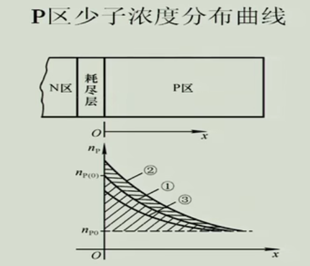

## 半导体二极管

### 二极管特性

将PN结包装起来并引出两个极，即二极管。

二极管伏安特性：

与PN结相比：

- 由于体电阻存在，使得相同电压下，二极管电流比PN结小。
- 二极管反向电流大一些。

温度的影响：

- 温度上升，正向导通电压降低，反向电流变大。
- 室温每上升1℃，正向压降2~2.5mv；每升高10℃，反向电流增大一倍。

二极管的单向导通性，限定电流流向，可以将交流电变为直流电 ——整流。

二极管反向电压的伏安特性，每升高10℃，反向电流增大一倍，可以利用这个制作温度传感器。

正向特性、反向特性，都可以利用来制作稳压二极管，不过一般利用反向特性，因为可以通过掺杂浓度来将反向击穿电压做成不同规格，而正向就不行了。

### 二极管参数与等效电路

二极管主要参数：

- $I_F$：最大整流电流，二极管长期工作时所能通过的正向平均电流的最大值。
- $U_R$：最高反向工作电压。（超过这个的电压将会导致反向击穿，标定时标的要比$U_{BR}$低）
- $I_R$：未击穿时的反向电流。
- $f_M$：最高工作频率。（高频电路下，频率过高可能会导致PN结容抗过低而导通，破坏二极管的单向导电性；频率低的电路下可不用考虑，例如整流电路等。）

为什么要等效电路？

二极管当电阻来使用的时候，是一种非线性的电阻，其电阻阻值是变化的。当我们对含非线性的电阻的电路进行分析时，最常用的方法是图解法，根据特性曲线和外电路的负载线算出交点——就是这个二极管的工作点。实际中这样计算太过麻烦，因此我们往往把非线性元件用其它的线性元件来表诉出来，这样的电路即等效电路，一定条件下，根据等效电路估算出来的值和通过图解法精确计算出来的值是近似相等的。

等效的两种档次：

- 一定条件下它们的外特性等效（输出的电流和电压的关系近似等效）。（外特性等效模型）
- 根据二极管的物理原理用其它的线性元件替代。（物理等效模型）

二极管的等效电路：

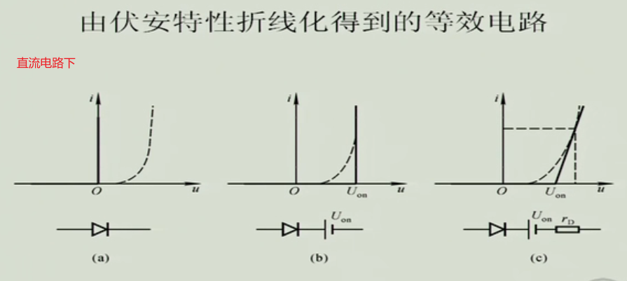

限幅、整流、小交流分析：

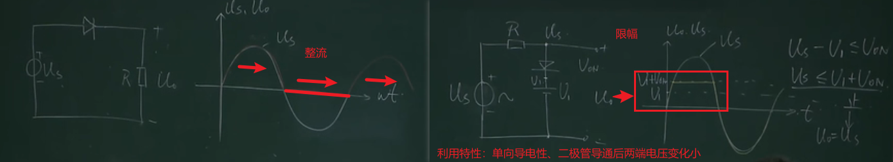

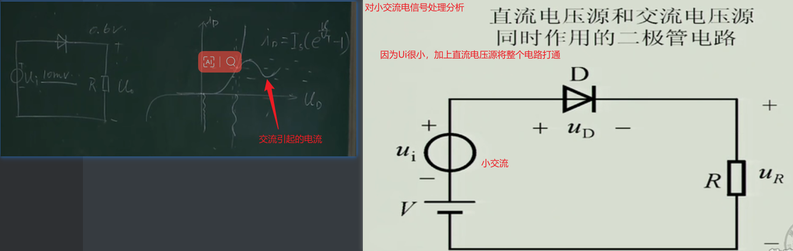

二极管的微变等效：对较小的交流电来说，二极管等效为一个电阻。

### 稳压二极管

在很大的电流变化范围内，工作在反向击穿电压下的二极管的输出电压变化非常小，近似于不变。

伏安特性：

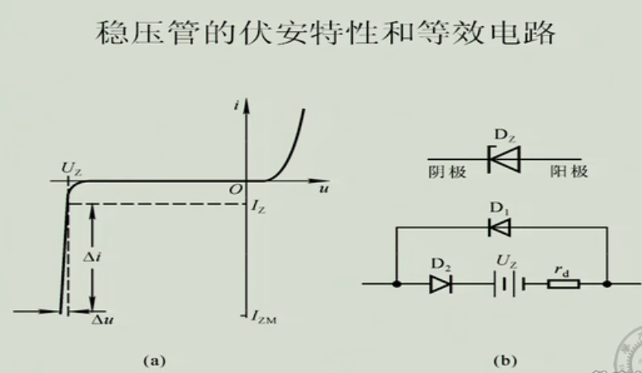

主要参数：温度吸收系数α、......。

使用：

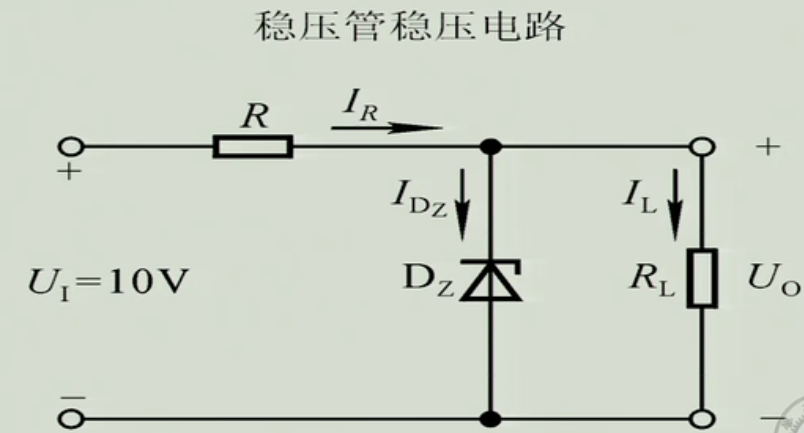

①先假定稳压二极管不工作，计算出$U_0$，那么就可以知道接上稳压管后稳压管是否是正常工作的。

②假设稳压管的反向击穿电压为6V，如果直接在稳压管$D_z$接上电压源，那么稳压管将工作在10V，此时大于反向击穿电压，由稳压管的伏安特性可知，此时的电流将很大，将会导致稳压管或者电压源烧坏。因此不论是稳压二极管还是二极管，都要接上限流电阻R。接上限流电阻后，电压稳定过程为：当电压源的电压上升的时候，必然会引起稳压管两端电压有上升的趋势，根据稳压管的伏安特性曲线，此时只要稳压管两端电压上升一点点，电流就会大大上升，电流上升后必然导致过限流电阻的电流上升，那就使得限流电阻R两端的电压上升，R上升的电压将会抵消掉电源电压的上升，这就使得使用一点点电压上升的代价使得电压稳定。（总结：稳压管工作在反向击穿状态下，只要其两端电压有一点点改变就会导致电流增大而其两端电压却不会变化太大，增加的电流导致限流电阻R负担起更多的电压，实现稳压输出）

### 发光二极管

## 晶体管

晶体管泛指一切以半导体材料为基础的单一元件，包括各种半导体材料制成的二极管、三极管、场效应管、晶闸管（后三者均为三端子）等。

晶体管具有检波、整流、放大、开关、稳压、信号调制等多种功能，晶体管可用于各种各样的数字和模拟功能。

### 三极管

BJT（bipolar junction transistor）—— 双极晶体管，因为这种晶体管的导电离子有两种极性（空穴和自由电子都参与导电），所以称为双极；又称为三极管，因为有三个电极。

三极管构成 —— 三个区、三个极、两个结，如下：

三极管的电流放大作用：利用电源的能量对信号进行放大（放大的基本要求是不能失真）。在一定的工作条件下，$I_c / I_b$近似为一个常数，$I_c = βI_b$，β——电流放大倍数。（放大的基本条件是什么？）（放大的能量来源于$V_{cc}$。）

发射极导通——正向偏置，也叫正偏；发射极截止——反向偏置，也叫反偏。（正向、反向偏置的条件是什么？）

**共射极放大电路：**

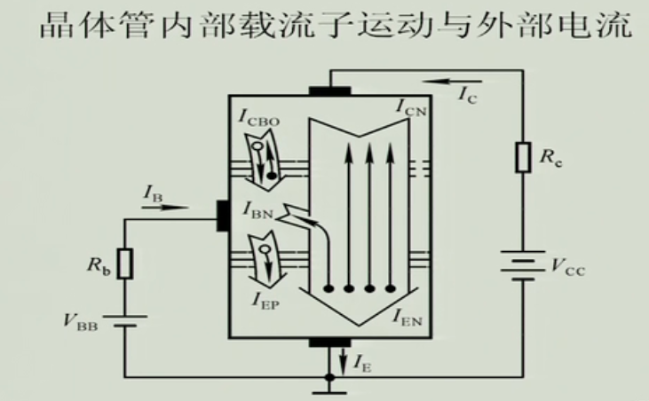

1. 发射结正偏：发射区的自由电子向基区扩散，此时形成电流$I_{EN}$；基区的多子（空穴）向发射区扩散，形成$I_{EP}$。发射区掺杂浓度很高，集电区掺杂浓度很低，相对于$I_{EN}$，$I_{EP}$可以忽略不计。此时大量自由电子将到达基区。
2. 基区：发射区大量自由电子扩散到基区导致基区自由电子浓度上升，这些电子一部分将继续向集电区扩散；有一部分与多子（空穴）复合；基极那会抽走电子——也就是会产生空穴；当扩散速度、基区条件不变时，复合的比例近似固定。（如果基区足够宽、掺杂浓度足够高，那么发射区过来的自由电子将会大部分在基区消耗掉，只留下少部分到达集电区，因此基区做得薄且掺杂浓度低）
3. 集电结：集电结反偏，将会把电子收集起来。

$I_{CN}$和$I_{BN}$成比例，$I_{CBO}$和$I_{EP}$相当于小干扰源。对闭合回路进行KVL分析，得到共射极放大系数：（发射极为公共接地端，所以称之为共射）

$I_{CEO}$：当$I_{B}$=0（基极开路），集电极到发射极会有一个很小的电流，称之为穿透电流。（O指open，C是collection，E是emission）

$I_{CBO}$：发射极开路，反向电流。

**共基极放大电路：**

共基放大电路的基极通过电容接地，因此不会发生密勒效应，频率特性非常好。

共基放大系数：$\overline{α} = I_{C} / I_{E} = \overline{β} / (1+\overline{β})$

### 三极管特性曲线

**输入特性：**

在三极管共发射极连接的情况下，当集电极与发射极之间的电压$U_{CE}$维持不同的定值时，$u_{BE}$和$i_{B}$之间的关系曲线，称为共射极输入特性曲线。一般情况下，当  $U_{CE} ≥ 1V$ 时，集电结就处于反向偏置，此时再增大 $U_{CE}$ 对 $i_{B}$ 的影响很小，也即 $U_{CE}$ ＞1V 以后的输入特性与 $U_{CE} = 1V$ 的一条特性曲线重合，所以，半导体器件手册中通常只给出一条 $U_{CE} ≥ 1V$ 时的输入特性曲线，如图所示：

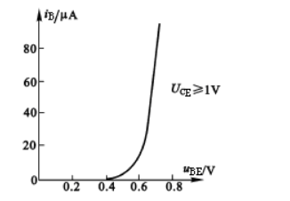

输入特性曲线的数学表达式为：$i_B＝f(u_{BE})|U_{CE} = 常数$。（$U_{CE}$取值为0到1V，$U_{CE}$取值越大，$U_{BE}$和$i_B$的关系曲线往右平移得越多，直到大于1V后，则几乎不会再影响）（为什么呢？$U_{CE}$的0V和1V对其有什么区别？）

三极管的输入特性曲线与二极管的伏安特性曲线很相似，也存在一段死区，硅管的死区电压约为0.5V，锗管的死区电压约为0.2V。导通后，硅管的$U_{BE}$约为0.7V，锗管的$U_{BE}$约为0.3V。

**输出特性：**

输出特性是指以基极电流$I_B$为常数，输出电压$u_{CE}$和输出电流$i_C$之间的关系，即：$i_C＝f(u_{CE})|I_B =常数$。对于不同的$I_B$，所得到的输出特性曲线也不同，所以，三极管的输出特性曲线是一簇曲线。根据三极管的工作状态不同，可以将输出特性分为三个区域，如图所示：

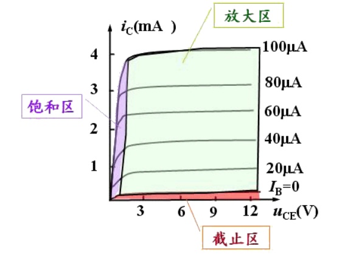

（1）截止区：指$I_B=0$ 的那条特性曲线以下的区域。在此区域里，三极管的发射结和集电结都处于反向偏置状态，三极管失去了放大作用，集电极只有微小的穿透电流$I_{CEO}$。

（2）饱和区：指紫色区域。在此区域内，对应不同$I_B$值的输出特性曲线族几乎重合在一起。也就是说，$U_{CE}$较小时，$I_C$虽然增加，但$I_C$增加不大，即$I_B$失去了对$I_C$的控制能力。这种情况，称为三极管的饱和。饱和时，三极管的发射结和集电结都处于正向偏置状态。三极管集电极与发射极间的电压称为集—射饱和压降，用$U_{CES}$表示。$U_{CES}$很小，通常中小功率硅管$U_{CES} ＜0.5V$。

紫色区域右边缘线称为临界饱和线，在此曲线上的每一点应有$|U_{CE}| = |U_{BE}|$。它是各特性曲线急剧拐弯点的连线。在临界饱和状态下的三极管，其集电极电流称为临界集电极电流，用$I_{cs}$表示；其基极电流称为临界基极电流，用$I_{BS}$表示。这时$I_{CS}＝βI_{BS}$ 的关系仍然成立。

（3）放大区：在截止区以上，介于饱和区与击穿区之间的区域为放大区。在此区域内，特性曲线近似于一簇平行等距的水平线，$i_C$的变化量与$i_B$的变量基本保持线性关系，即$Δi_C=βΔi_B$，且$Δi_C>>Δi_B$ ，就是说在此区域内，三极管具有电流放大作用。此外集电极电压对集电极电流的控制作用也很弱，当$u_{CE}＞1 V$后，即使再增加$u_{CE}$，$i_C$几乎不再增加，此时，若$I_B$不变，则三极管可以看成是一个恒流源。在放大区，三极管的发射结处于正向偏置，集电结处于反向偏置状态。 

[三极管的特性曲线型图解 (ejiguan.cn)](http://www.ejiguan.cn/2021/changjianwtjd_0222/2997.html)

## MOS管

场效应管，field-effect transistor，FET。

### 绝缘栅型场效应管

MOSFET —— 金属氧化物半导体场效应晶体管，简称摩斯管。在MOS管基础上又造出了CMOS。

**绝缘栅型场效应管结构：**

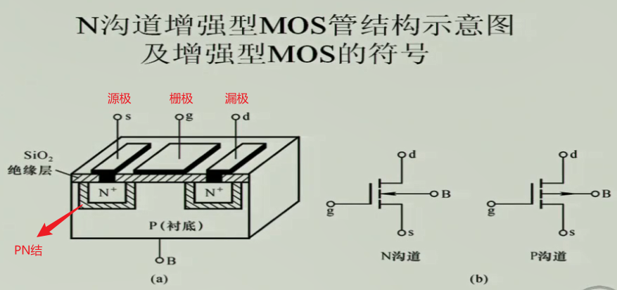

栅极趴在$SiO_2$绝缘层上，绝缘栅。

**工作原理：**

（1）沟道的形成

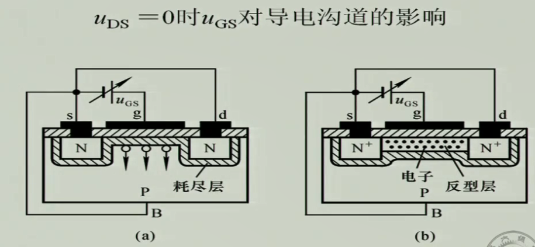

$U_{DS}=0,U_{GS}>0$。往栅极g加上电压，电场方向 g→P，空穴将在电场的作用下被抽走，自由电子则往g极下面聚集，这样就在两个N之间形成了一个沟道，即将s极和d极连通了。 （$U_{GS(th)}$，开启电压，sh是threshold——阈值；当$U_{GS} > U_{GS(th)}$时，沟道形成）

沟道的宽度和$U_{GS}$的大小相关，$U_{GS}$越大，沟道越宽。沟道的宽窄可以说是代表了s极和d极之间的电阻大小，沟道越宽，它们之间电阻越小，反之越大。也就是说$U_{GS}$决定了$R_{ds}$。

电阻有了，那如何使得d极和s极之间产生电流？加上电压即可。

（2）电流产生

研究方法：使$U_{GS} > U_{GS(th)}$，并且$U_{DS}$不等于0，一步步使$U_{DS}$增大，从而得出电流的变化规律。

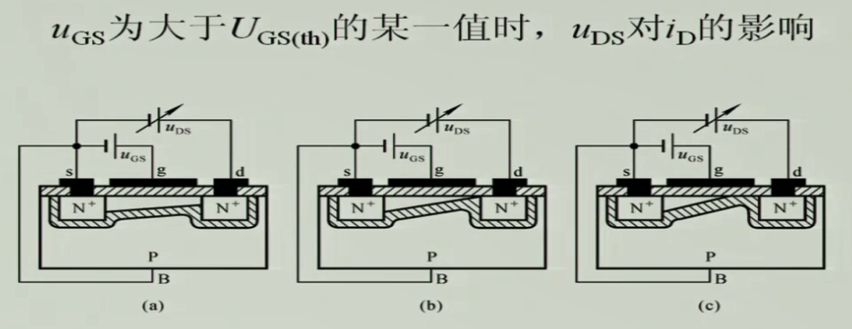

①往s和d极加上电压$U_{DS1}$，s极、d极的电位将不再相等。此时，s极沟道上方端点到下方端点的电压差仍然为$U_{GS}$，d极沟道上端点到下端点的电压差则为 $U_{GS}-U_{DS}$，随着$U_{DS}$的不断加大，沟道逐渐倾斜，此时电流$i_D$也逐渐增大；直到d极沟道上端点到下端点的电压差$U_{GS}-U_{DS}=U_{GS(th)}$，出现图b的情况——d极被PN结闭合（没完全闭合，还有一点缝隙），这样的情况我们称之为预夹断，预夹断之后继续加大$U_{DS}$，会发现$i_{D}$几乎不会再发生变化，此时近似于恒流。（预夹断之后自由电子在缝隙里高速通过，所以电阻阻值会增大，这个电阻的增大和电压的增大正好抵消，也就出现了近似恒流的情况）

②不同的$U_{GS}$，通过添加不同的$U_{DS}$电压来研究，最后得到不同情况下的的近似恒流$i_D$。如下（$U_{GS2}>U_{GS1}>U_{GS3}$）

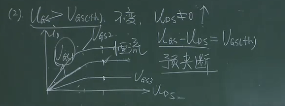

得出结论：栅极和源极之间的电压$U_{GS}$，能够控制电流$i_D$，或者说$i_D$电流和$U_{GS}$成比例，前提是进入了预夹断之后的恒流区。（预夹断之前的区域称之为可变电阻区；预夹断之后称之为恒流区）

**关于N沟道耗尽型MOS管：**

耗尽型原理：使栅极处那$SiO_2$带正电，使得不用外加电场就可以形成沟道。

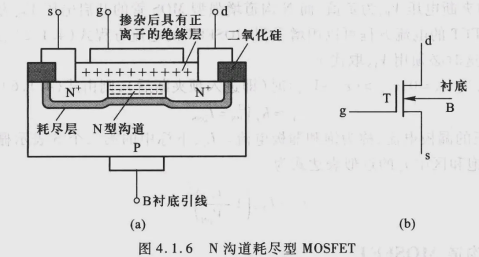

### 结型场效应管

JFET

**结型场效应管结构：**

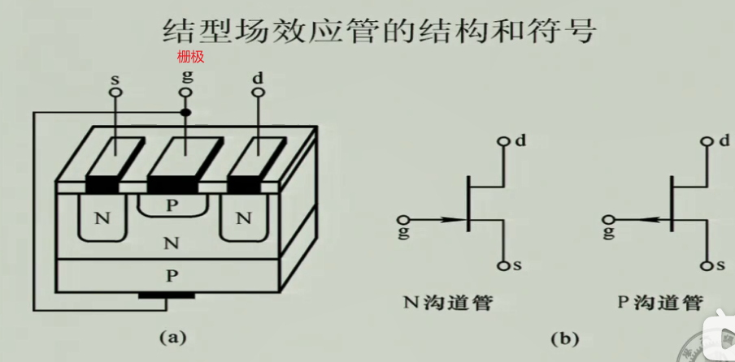

**工作原理：**

（1）对沟道的控制（结型不需要外加电场便存在沟道，d极、s极之间一开始便能导通）

$U_{DS}=0$，往PN结加反向偏置电压，耗尽层变大，使得d、s间的沟道变窄，待加的反向偏置电压到达一定程度，d、s极之间夹断——真正的夹断。

通过PN结的反向偏置电压控制了沟道的宽窄。$U_{GS}$不能大于0，大于0，即正向导通，PN结就导通了，就不存在什么沟道了。（P沟道则不能小于0）

（2）电流的产生

$U_{GS}$控制d、s极之间的沟道，即它们之间的电阻。$U_{GS}$不变，d、s间电阻不变。

$U_{DS}$控制了d、s间的电流的大小，在$U_{GS}$不变的情况下，$i_D$和$U_{DS}$成正比，直到出现预夹断后，$i_D$近似为恒流源。

预夹断后，$i_D$大小只和$U_{GS}$有关。

相对于绝缘栅型，结型不容易坏，绝缘栅型的绝缘层容易坏——那个绝缘层很薄，相对于一个小电容在那，容易被击穿了。

### 场效应管特性曲线

转移特性曲线：恒流区条件下，$U_{GS}$和$i_{d}$之间的关系

绝缘栅型——N沟道增强型MOS管：

$i_{D}=I_{DO}(U_{GS}/U_{GS(th)}-1)^2$

绝缘栅型——N沟道耗尽型MOS管：

$i_{D}=I_{DSS}(U_{GS}/U_{GS(th)}-1)^2$

结型——N沟道：

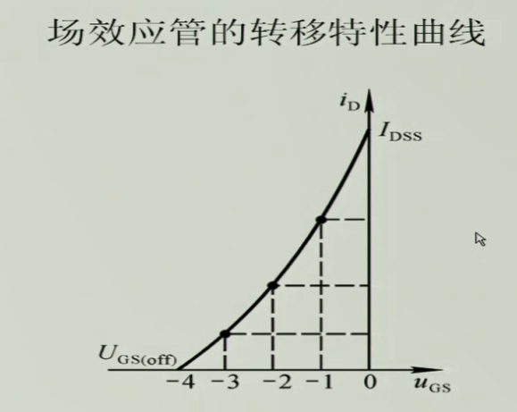

绝缘栅型与结型场效应管的符号及特性曲线：

### 参数

直流参数：$U_{GS(th)}$、$U_{GS(off)}$、$I_{DSS}$、$R_{GS}$。

交流参数：

（1）跨导（低频）：$g_{m}=△i_{D}/△U_{GS}$，$U_{DS}$为常数。（$g_{m}={\frac{△i_{D}}{△U_{GS}}}\mid U_{DS}=常数$）

（2）极间电容

自行查阅：

- 晶体管的主要参数
- 温度对晶体管特性和参数的一些
- 光电三极管

