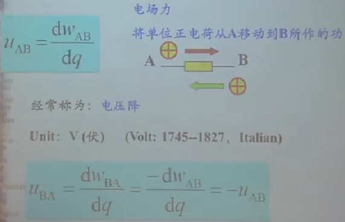
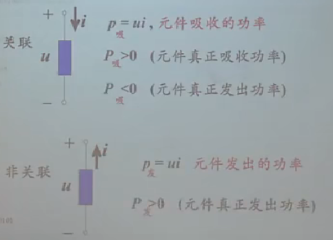

# 概述

电路：电气元件相互连接构成的电流的通路。

电路的目的：处理能量（电能的产生、传输、分配）、处理信号（电信号的获得、变换、放大）、同时处理信号和能量（天线、CPU、供电系统、智能电网等）。

电路分类——根据负荷性质分：

- 电阻电路（线性、非线性）。
- 动态电路（线性动态电路的时域分析、非线性动态电路的稳态分析（正弦激励、周期性非正弦激励））。

电路分类——根据电源性质分：

- 直流电路。
- 交流电路（正弦激励电路、周期性非正弦激励电路）。

电流：电荷的时间变化量。（单位：安——A）


电压：电场力移动单位电荷的功。电压的方向为正电位指向负电位的，即电位降的方向。



电位：某点到某参考节点的电压。（参考点的电压为0）。两点的电压等于两点间的电位差—— $U_{ab}=\varphi_a-\varphi_b$ 。（因此电压经常被称为电压降）（电位 电势）

电动势：是电源的本质参数。电路分析中不需要这个概念。

电路功率：单位时间内做的功。电压、电流有关联、非关联两种，因此功率也有两种计算方法。


电压与电流的关联、非关联：电压参考方向与电流参考方向一致即关联，不一致即非关联。（电路分析的参考方向都为假定的方向，即复杂电路分析中不知道实际的电压、电流的方向，于是假定电压、电流方向是这样的——即定义参考方向。关联、非关联要根据给出的参考方向来分析，或者你自己假定的参考方向去分析。）

吸收功率，发出功率：功率计算的两种方式

假定元器件两端的电压和电流的参考方向为关联的（即方向一致），那么元器件的功率就得假定是吸收功率，最后算出结果是正的那就是真实的吸收功率，即说明假定的方向和实际的是一样的；如果假定元器件两端的电压和电流方式相反，那电压和电流就是非关联，那么元器件的功率就得假定是发出功率，最后计算得出结果是负的就说明是真实的发出功率。（元器件——电路中的器件，包括电流源、电压源）。



总结：“关吸非发”，假定的电压、电流方向是关联的，那就得假定计算的功率就是吸收功率，反之就是发出功率。电路分析就是这样，对于复杂的电路不知道方向就假定方向再结合一些定律去计算。

例子：根据电流参考方向、电阻的电压参考方向——关联的，那么就得假定电阻功率为吸收功率，再由提供的信息算出电流I，可计算到假定的电阻的功率就是吸收功率。


# 电阻电路分析方法

## 器件

### 电阻器


电阻器（resistor），表示一个器件，电阻则是指其性质。使用电阻器时要注意的两个参数：一是电阻值，电阻值不可能完全精确，电阻制作工艺的不同决定了其误差范围；而是电阻的额定功率，超过额定功率会烧坏电阻器。

电导：


短路：R=0，视为短路。开路：R=∞，视为开路。

```
R = 电阻率*L/S    
```

电阻器：贴片电阻（体积小、重量轻、可靠性高）、碳膜电阻（阻值范围宽，便宜）、金属膜电阻（稳定性高、精度高）、线绕电阻（功率大）。

电阻器的尺寸由散热决定。

### 独立电源

独立电源——independent source。

理想独立电压源——ideal independent voltage source。其电路符号和特性如下：


理想独立电流源——independent current source。


### 受控元件

力控电阻、压控电阻。

受控电源：

- 受控电压源：电压源的电压由电路中某电压或电流控制。
- 受控电流源：电流源的电流由电路中某电压或电流控制。


受控源不是二端元件。


## 基尔霍夫定律

术语：


基尔霍夫定律——电流定律（KCL）：**电路中任一个节点上，在任一时刻，流入节点的电流之和等于流出节点的电流之和**。


基尔霍夫定律——电压定律（KVL）：**回路中所有电压的代数和为零。**


## 2B法

以支路电压和支路电流作为[变量](https://baike.baidu.com/item/变量/5271?fromModule=lemma_inlink)，对节点列写电流（KCL）方程，对回路列写电压（KVL）方程，再对各个支路写出其电压电流关系（VCR voltage current relation）方程，简称支路方程。从而得到含2b个变量的2b个独立方程。又称为“2B法”，“2B分析”。

方程结构为b个支路方程与n个节点，n-1个独立电流（KCL）方程，b-(n-1)个独立电压（KVL）方程，b个元件约束方程(VCR)共2b个方程。

# 等效变换

## 电阻的等效变换

### 串并联

二端网络：与外部只有两个接线端相连。

无独立源二端网络：内部无独立源的二端网络。


串联电阻特性：分压。

并联电阻特性：分流。（并联电阻的等效电阻为各电阻的倒数和的倒数）


### 平衡电桥


I3——R3，I4——R4，I6——R6，I7——R7，如果`R3 * R7 = R4 * R6`，那就符合“平衡电桥”，而此时I5所在支路电压为0。

利用平衡电桥可以测量电阻值。

### Y-△变换


列式子：


求等效条件：


总结：如果Y、△等效，那么存在的关系为△或Y的三个电阻值相同，并且△每一个都为Y的3倍。


变形：


例子：


### 含受控源的二端网络的入端电阻


## 电源的等效变换

### 理想独立源的等效变换

理想独立电压源串联，相当于一个理想独立电压源（和）。

理想独立电压源与理想独立电流源串联，相当于一个理想独立电流源（电流仍为电流源的大小）。

理想独立电流源并联，相当于一个理想独立电流源（其电流为两个并联的和）。


### 实际独立源的等效变换


