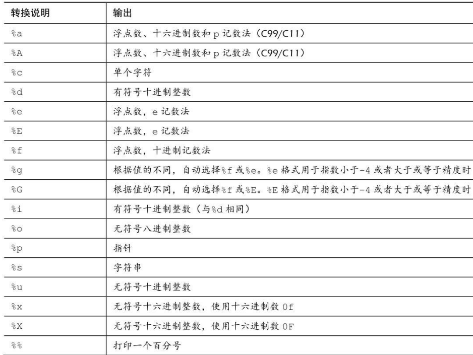
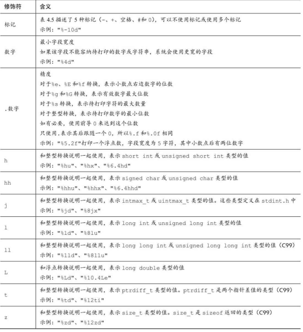

# printf()

用于打印字符到控制台。
使用格式：`printf("要打印的字符、变量值、表达式结果等",变量或表达式列表);`
如果要打印变量、表达式结果，需要使用转换说明修饰符：

C99新增的：

size_t类型：定义成系统使用sizeof返回值的类型。

在K&R C中， 表达式或参数中的float类型值会被自动  转换成double类型。 一般而言， ANSI C不会把float自动转换成double。 然 而， 为保护大量假设float类型的参数被自动转换成double的现有程序，  printf()函数中所有float类型的参数（对未使用显式原型的所有C函数都有效）仍自动转换成double类型。

P202，关于printf()的转换说明修饰符的更详细的说明。


# scanf()

用于读取输入。读取基本数据类型数据需要使用&，读取字符串则不需要。
```c
#include <stdio.h>
int main(){
    int age; // 变量
    float assets; // 变量
    char pet[30]; // 字符数组， 用于储存字符串
    printf("Enter your age, assets, and favorite pet.\n");
    scanf("%d %f", &age, &assets); // 这里要使用&，读取
    scanf("%s", pet); // 字符数组不使用&
    printf("%d $%.2f %s\n", age, assets, pet);
    return 0;
}
```
转换说明修饰符：P220