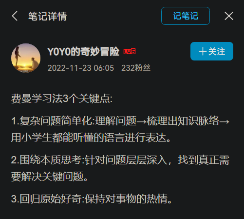

Opening&Sharing    imaging&creating     freedom    meet top

# 自控力

你说的是凯利·麦格尼格尔的《自控力》吧。个人认为是一本教会你管理自己的好书，虽然它也不是万能的，但对于年轻人管理自己的工作、学习和压力还是很有用的！

喜欢它的原因如下：

1. **有大量实验例证，读起来更有启发，而且不会枯燥。**
2. **用比较浅显的语言帮助我了解自己的情绪和大脑，纠正了很多我以前不知道的观念。**
3. **最重要的一点，有实际操作战略，日常生活中很实用！**

缺点嘛，作者有点啰嗦，实际上有用的信息不多。

**所以我总结出了读书笔记，时不时的拿出来翻翻就可以了！分享一下吧，不谢！**

**有用的话记得回来点个赞~**

**前言**

自知之明是自控的基础。认识到自己的意志力存在问题，则是自控的关键。

**第一章：我要做，我不要，我想要：什么是意志力？为什么意志力至关重要？**

理论：

1. 如果没有自我意识，大脑总会默认选择最简单的。
2. 注意力分散的人更容易向诱惑屈服。

战略：

1. 当你面对诱惑和拖延症时，你得想清楚，你真正想要的，其实是XXX。只有想到这些，才能遏制你的一时冲动。这就是“我想要”的力量。
2. 你可以给冲动的自我起个名字，比如把及时行乐的人叫做“饼干怪兽”，把总是 不想开工的人叫做“ 拖延者”。在它们占上风的时候，你就能意识到他们的存在，帮你唤醒那个明智的自己，唤醒意志力。
3. 花时间观察自己是怎样屈服于冲动的，什么样的想法、感受和情况最容易让你有冲动，想些什么或者暗示能让你放弃冲动？
4. 冥想可以提升自控力，提升你集中注意力、管理压力、克服冲动和认识自我的能力。一段时间后，你的前额皮质和影响自我意识的区域里，大脑灰质都会增多。
   - 原地不动，安静坐好，背挺直，双手放在膝盖上。
   - 注意你的呼吸。闭上眼睛，吸气的时候在脑中默念“吸”，呼气时再脑中默念“呼”。走神的时候，重新将注意力集中到呼吸上。
   - 感受呼吸，弄清自己是怎么走神的。你会注意到空气从鼻子和嘴巴进入和呼出的感觉，感觉的吸气时胸腹部的扩张和呼气时胸腹部的收缩。
   - 每天做比较短的训练，也比把较长的训练拖到明天好。
   - 冥想时感觉越糟糕，它在现实生活中的作用就越明显。

**第二章：意志力的本能：人生来就能抵制奶酪蛋糕的诱惑**

理论：

1. 应激反应：当人们感到压力时，交感神经系统会控制身体，心率升高，心率变异度会降低，这种生理现象让你能够战斗或者逃跑。
2. 三思而后行：当人们成功自控的时候，副交感神经系统会发挥主要作用，心率降低、心率变异度会升高，帮助缓解压力，控制冲动行为。
3. 压力是意志力的死敌。任何给身心带来压力的东西都会影响自控力的生理基础，摧毁意志力。如焦虑、愤怒、抑郁、孤独、慢性疼痛和疾病。
4. 睡眠不足会影响身体和大脑吸收葡萄糖，当细胞没能获得足够的能量，你就会感到疲惫，想吃甜食，想摄入咖啡因，身体一直处于应激状态，释放大量压力荷尔蒙，使心率变异度大大降低，从而压力越来越大，自控力越来越差。好消息是，这些反应都是可逆的。只要补上一个好觉，前额皮质就会恢复如初。

战略：

1. 减压方法（这个是答主个人的解压方法，仅供参考）：
   - 不要把最难和最不想做的东西留到最后，会越拖压力越大！早点开始动手！
   - 做家务。
   - 精油+关灯+泡脚+大提琴音乐 = relax。
   - 冥想。
   - 健身。
   - 保证良好睡眠。
   - 购物。
   - 散步。
2. 快速提高意志力的方法：将呼吸频率降低到每分钟4-6次，也就是每次呼吸用10-15秒的时间，这样训练几分钟后，你会感到平静，有控制感。放慢呼吸可以激活前额皮质，提高心率变异度。

**第三章：累到无力抵抗：为什么自控力和肌肉一样有极限？**

理论：

1. 低血糖能解释很多意志力时效的情况，因为自控是大脑活动中耗能最高的一项，为了保存能量，大脑不愿意给你充足的能量去抵抗诱惑、集中注意力、控制情绪。大脑的首要任务是获得更多能量，而不是保证你做出明智的决定，实现你长远的目标。
2. 现代社会中出现的失控实际上是大脑战略性冒险本能的延续。
3. 从长远来说，过度依赖糖分并不是自控的好方法，就像美国数百万2型糖尿病患者一样。
4. 意志力就像肌肉一样，要么使用，要么消失。

战略：

1. 如果你觉得自己没有时间和精力去处理“我想要”做的事，那就把它安排在你意志力最强的时候做。

2. 保证你的身体有足够的食物供应，这样能给你更持久的能量。

   - 少吃多餐。

   - 低GI食物。

3. 不要用代糖。因为甜味剂会刺激身体从血液中吸收葡萄糖，当你缺少能量没有自控力的时候，你的身体和大脑会想“血糖补充在哪呢？”，从而导致饥饿，暴饮暴食，和体重增加。

4. 训练“意志力肌肉”。

   - 增强“我不要”的力量：不驼背（这是da主从小养成的坏习惯）。
   - 增强“我想要”的力量：每天冥想5分钟。
   - 目的：养成习惯，关注自己正在做的事情、选择更难的事情，通过练习，大脑开始习惯三思而后行。

5. 觉得自己“疲惫”的没办法自控的时候，试着挑战一下自己，挺过第一波疲惫感。

6. 挖掘“我想要”的力量，让自己恢复能量。

   - 如果挑战成功，你会有什么回报？
   - 如果挑战成功，还有谁会获益？我身边的人会如何被影响？
   - 如果现在愿意做困难的事，那么一段时间后，这个挑战将会变得容易。如果取得进步，你的生活会是什么样子？现在的不适是不是值得？

**第四章：容忍罪恶：为何善行之后会有恶行？**

理论：

1. “道德许可效应”：好的行为总是允许我们做一点坏事：
   - 如果锻炼了就说自己很“好”，没去锻炼就说自己很“坏”，那么你很可能因为今天去锻炼了，那么你可能因为今天去锻炼了，明天就不去了。
   - 如果处理了一个重要项目就说自己很“好”，拖延着不去处理就说自己很“坏”，那么你可能因为早上取得了进步，下午就变得懒散了。
2. 我们容易人为，纵容自己就是对美德最好的奖励，我们忘记了自己真正的目标，向诱惑屈服了。
3. “目标释放”：当你取得进步的时候，大脑就停止了思维进程，而这个进程正是推动你追求长远目标的关键。然后，那个放纵自我的声音就会想起来，你就会转而关注那些还没有得到满足的目标。你曾努力克制的目标会变得更强大，诱惑也更难以抵挡。
4. 列出 to do list 真的让人如释重负。我们把需要做的事当成了自己已经付出的努力，这会给我们错误的满足感。这很好的解释了，我们想到未来的选择时，就会很容易犯下大错。
5. 道德许可就是一种身份危机。我们之所以会奖励自己的良好行为，是因为我们内心深处人为，真正的自己想做坏事。于是，每次自控都是一种惩罚，只有放纵自我才是奖励。

战略：

1. 不应该想着“我做到了，好了，现在我可以做点我真正想做的事了！”。应该想着“我做这件事是因为我想要……”。
2. 记住我们为什么会拒绝诱惑。
3. 把今天做的每个决定都看成是对今后每天的承诺。
   - “我想不想在一年里每天下午都吃一块糖？”
   - “我是不是想承担永远拖延下去的恶果？”
4. 走出“道德许可”的陷阱，那个想要变好的自己才是真正的自己，想按核心价值观生活的自己。

**第五章：大脑的弥天大谎：为什么我们误把渴望当幸福？**

理论：

1. 奖励系统：当大脑发现获得奖励的机会时，它就释放出叫做多巴胺的神经递质，多巴胺会告诉大脑的其他部分要注意什么，怎么才能让贪婪的我们得手。当大量分泌的多巴胺劫持了你的注意力时，大脑只会想如何获得或者重复那个触发它的东西，这时我们就展现了自己最敢于冒险、最冲动、最失控的一面。
2. 多巴胺控制的是行动，而不是快乐。
3. 我们感受到的是期待，而不是快乐。
4. 进化根本不关心你快乐与否，但它会利用对快乐的承诺，让我们不停地为生计奔忙。
5. 微博微信、电子邮件、短信、电子游戏：都是自我刺激的现代版。

战略：

1. 找一些常常让你放纵自己的诱惑因素
2. 关注你放纵的过程，注意奖励承诺给你什么感觉？
3. 而真正接受了诱惑之后是什么感觉？
4. 和期望比起来，体验如何？
5. 奖励的承诺有没有消失？
6. 什么时候你会感到满足？
7. 如果有什么事让你觉得不愉快，所以总是拖延着不去做，你能不能把它和能让多巴胺神经元燃烧的事联系在一起，从而促使自己去做呢？
8. 如果我们想拥有自控力，就需要区分让我们生活有意义的真实奖励，和让我们分散精力、上瘾的虚假奖励。

**第六章：“那又如何”：情绪低落为何会使人屈服于诱惑？**

理论：

1. 压力（愤怒、悲伤、自我怀疑、焦虑）➡️ 情绪低落 ➡️ 大脑想维持人的心情 ➡️ 大脑选择奖励的承诺（上一章）➡️ 向诱惑屈服 ➡️ 我们缓解压力的方法反而会让我们更有压力。

2. “那又如何”效应：破罐子破摔。

   - 拖延：

     拖到了deadline前几天感觉自己已经没办法完美达成目标了，罪恶。

     越拖越久，压力越来越大。

   - 任何挫折都会引起这样的恶性循环。

3. 自我批评会降低积极性和自控力，它不仅耗尽了“我要做”的力量，还耗尽了“我想要”的力量。自我谅解和自我同情则会提升积极性和自控力，比如，在压力和挫折面前支持自己、对自己好一些。

4. 改变的承诺：发誓改变会让我们充满希望，在什么都没做之前，就感觉良好了。它只能给我们一时的快乐，但接下真正做出改变时面临的挑战却会给你当头一棒，让你感到失落。

战略：

1. 远离那些会让你产生恐惧的电视新闻、访谈节目、杂志或网页。

2. 尝试更有效的解压方法，增加大脑中改善情绪的化学物质，如血清素、gama-氨基丁酸和让人感觉良好的催产素，它们不像释放多巴胺的物质那样让人兴奋，所以我们往往低估了它们的作用。

3. 每个人都会犯错误，都会遇到挫折。用以下方法，让我们面对失败时同情自己：

   - 你感觉如何？你对自己说了什么？是不是自责？
   - 你只是个凡人，每个人都有失去自控的时候，这是人性的一部分，挫折并不意味着你本身有问题。想想其他你尊敬/关心的人也经历过同样的抗争和挫折吗？
   - 如果你的好朋友经历了同样的挫折，你会怎么安慰他？你会如何鼓励他继续追求自己的目标？

4. 做个乐观的悲观主义者：这种方法预见失败其实是一种自我同情的方式，不是自我怀疑。

   - 想一想自己的意志力挑战，扪心自问：

     我什么时候最可能受到诱惑并放弃抗争？

     什么东西最可能分散我的注意力？

     当我允许自己拖延/暴饮暴食的时候，我会怎么劝自己？

     你需要采取行动回忆自己的动力吗？

     需要远离诱惑吗？

     需要找朋友帮忙吗？

     需要用你学过的其他意志力策略吗？

**第七章：出售未来：及时享乐的经济学**

理论：

1. “延时折扣”：等待奖励的时间越长，奖励对你来说价值越低。很小的延迟就能大幅降低感知到的价值。
2. “延时折扣”解释了为什么我们宁愿放弃未来的幸福，也要选择即刻的快感。为了明天做准备，或许还有可能。但是为了十几年以后做准备，那可就太久了。
3. 抽象、不能直接看到的奖励也会让奖励系统的刺激作用减少。
4. “未来的自己”：人们会把未来的自己理想化，希望未来的自己可以做到现在的自己做不了的事，让他们承担现在的自己犯下的错误。

战略：

1. 降低折扣率：
   - 当你受到诱惑时，想象一下，这个选择就意味着你为了即时的满足放弃了更好的长期奖励。
2. 想象你已经得到了长期的奖励。想象你正在享受自控的成果。
   - 扪心自问：你愿意放弃它，来换取正在诱惑你的短暂快感吗？
3. 10分钟：在10分钟期间你一定要时刻想象着长远的奖励，以此抵制诱惑。10分钟就能在很大程度上改变大脑处理奖励的方式。
   - 『我不要』：坚持10分钟等待，然后就可以得到它。
   - 『我要做』：坚持做10分钟，然后就可以放弃。
4. 对诱惑创造一点距离，让拒绝变得更容易。
5. 想象未来的自己可以增强现在的意志力，未来的自己会对我们现在的付出感激不尽。
   - 想象希望成为的自己。
   - 想象害怕成为的自己。

**第八章：传染：为什么意志力会传染？**

理论：

1. 镜像意志力传染。
   - 第一种：无意识模仿。当镜像神经元探测到其他人的行动时，它会让你的身体也准备做同样的动作。
   - 第二种：传染情绪。自己的镜像神经元会对别人的情绪产生反应。别人的欲望会引发我们的欲望。
2. “社会认同”：当群体里其他人都在做某件事时，我们容易人为这件事是应该做的聪明事。
3. ”自豪“的力量：自豪和羞愧是属于大脑皮层的情绪区，能更迅速更直接的印象我们的选择。自豪可以引起好的情绪，让自己安然度过诱惑；而羞愧则会让人感觉糟糕，让人放弃抵抗破罐破摔，而非自我控制。

战略：

1. 防止传染坏的：少看不好的影响，远离给你不好影响的人，找到新的和你有同样渴望的『群体』并加入进去，可以是支援小组、俱乐部、网络社区、杂志……
2. 利用传染好的：当你需要多一点意志力的时候，想想你的榜样。问问自己：那个人会怎么做？
3. 利用社会认同：只要我们相信社会规范就是正确的事，社会认同就会增强我们的自制力。
4. 利用周围的人：在考虑作何选择时，可以想象自己是别人评估的对象，为自控提供强大的精神支持。
5. 利用自豪的力量：让自己感觉别人都在检视自己，让我们有机会向别人报告自己的成功。

**第九章：别读这章：“我不要”力量的局限性**

理论：

1. 『讽刺性反弹』：压抑人的本能时，越是不让我们想一件事，我们就越去想它。
2. 节食：限制卡路里减肥法不仅对减轻体重或身体健康没什么好处，而且被越来越多的证据证明有害身心。
   - 禁食某种食物会增加人对这种食物的欲望。
   - 循环反复式的节食会使血压和胆固醇含量上升，抑制人体免疫系统，增加心脏病、中锋、糖尿病等风险。

战略：

1. 对抗『讽刺性反弹』：放弃自控。
   - 承认自己脑海中的欲望，去想自己所想，追随自己的感觉（你不必相信它是真的，不要觉得必须采取行动）。
   - 类似佛教中“无念”，有感知，无反应。
   - 接受这种想法，提醒自己“白熊现象”和“反弹”理论。
   - 把注意力转移到呼吸上，有时候，这些翻新的想法会打断你对呼吸的关注，那就把这些想法想象成飘过脑海和身体的浮云，想象这些浮云不断消散或者飘过，把呼吸想象成一阵风，毫不费力地将浮云吹散，吹走。
   - 无需让这些想法离开，只需保持呼吸的感觉。这些想法总是来来去去，你无法控制会出现什么内容，但你不必接受它的内容，这就是思维运作的方式，它不一定意味着什么，但你可以选择自己相信什么，选择自己要做什么。
   - 记住你的目标，提醒自己『我想要』的承诺。
   - 无论你是否满足了冲动，它最终都会消失。
2. 把“我不要”变成“我想要”的挑战：关注自己想做什么，而不是不想做什么，避免反弹效应。
   - 比如：把“不要迟到”重新定义为“做第一个到的人”。

**结语**

理论：真正的自控力的秘诀：集中注意力。

战略：

- “自我意识”：当注意力分散的时候，或者即将向诱惑投降的时候，你需要静下心来，弄清楚自己的欲望。记住自己真正想要的是什么，什么才能让你真正的快乐。

# 去行动，去改变

摘自MADYong的评论：

**在知乎上看到一个大佬说的，我觉得很有道理。他说支撑你第二天早起的不是你的闹钟也不是你的梦想，而是早睡！学习从来不是热血的事情，你热的快，凉的也快，中高考誓师大会就是最好的例子，所以我觉得这种视频看完之后你可以有感触和想法，但是千万不要认为学习是件热血的事情，学习就是学习，要以平静的心去对待然后就是自律，我们古人说的宁静致远不是没有道理的。** 

摘自诗怡小姐的老父亲的评论       ：

**学生党最可悲的身份,是那种既不是学霸又不全是学渣的人.他们听不懂课,不努力,作业不会做,以抄作业为生,不逃课,不捣乱纪律,自作多情,为考试成绩着急而又无奈于现状.三分钟热度,然后又恨自己不争气,一点一点混着日子就这样过了一天,他们以最普通的身份埋没在人群中,却过着那个年纪最最煎熬的日子。**

摘自贪嗔痴念为情所困的评论    ：

**b站里的大多数都还上着中学、大学吧，作为一个过来人我劝君一句一定要多看书，多社交，珍惜时间，多积累知识。真的，时间过得太快了，你想毕业之后只会玩手机电脑找工作吗？成功不是一蹴而就，哪怕你偶然中了彩票得了巨款也不会长久，很简单，你没有与之匹配的内涵与深度。还有热评那个，什么二八理论，你怎么不说那20%的少数人花费了自己80%的时间在努力，所以成为了少数的精英人士。这个时代是个很浮躁的时代，智能手机功能越来越让人迷醉，买最高端的手机，天天吃鸡王者抖音，每天这样你的生活真的不空虚吗？**

Vtuber警察Official的评论：

**如果你只是因为一个视频就充满动力，那恭喜你，你也很快会因为现实而失去动力。少喝点毒鸡汤，把自己摆在正确的位置上，不要因为我想获得什么，我想成为什么而努力，而是我想现在就做点什么而去做，别做个等待别人给自己打鸡血的人。**

# 100天行动

## 九条核心规则

- 制定合适的目标坚持100天
- 一次一个目标是种独特的能力
- 记录的力量
- 没有检视的人生不值得活
- 中断、失败和痛苦是你必须面对的事情
- 成长从复盘开始
- 100天只是一个起点
- 帮你重视的人一起达成
- 每年一次新挑战突破生活舒适区

## 学习建议

作者：warfalcon
链接：https://www.zhihu.com/question/63178949/answer/212159368
来源：知乎
著作权归作者所有。商业转载请联系作者获得授权，非商业转载请注明出处。

现有答案中打鸡血的太多，真正说方法的太少，给一些可以立刻应用的学习建议吧：

### 1、不要在精疲力竭的时候学习

对于边工作边考 CPA 考试的人，刚刚经过一天的工作、下班之后回到家里已经精疲力竭，然后简单吃些东西再去学习，往往看不进书，理解能力也很差，这个时候的学习效果是最差，很难坚持下去。

当你下班感觉特别累的时候，晚餐反而要注意，不要随便点个外卖或找个小饭店，不要吃的过油，尽量少油少糖，饭菜轻淡一些，多吃些水果。

小睡一会。哪怕是10分钟也能让你的疲劳缓解不少，别睡的时候太长，会影响晚上的睡眠，最好不要超过30分钟。

补充下水分，清水就好，别喝咖啡、可乐、红牛之类的刺激性饮料，短时间能看到效果，但一段时间之后，效果就会变弱，而且会影响睡眠。

### 2、在专注模式和发散模式来回切换

大脑在学习的时候分为两种模式：专注模式（注意力高度集中）和发散模式。大脑要理解解决任何问题，都离不开这种信息之间的往来传递。

当你在学习一个概念时，理解不了的时候。试试切换其它的方式，在搜索引擎中搜索下关键字，看看不同的书籍或教程，有时候对概念稍有不同的表述阐释，就能让你换个角度看问题 

激活发散模式的一般方式：

- 各种运动：去健身房、慢跑、游泳
- 跳舞
- 散步
- 洗澡或泡澡
- 听音乐，最好是纯音乐
- 冥想、静坐
- 睡觉 

当你使用一种方法学习学不下去，可以试试换成其它方法，比如做题做下不去、试试背诵。看书或听课程做不下去，试式做思维导图方式或测试。

进入下一次专注模式之前，应该留出足够长的休息时间，让你的意识完全从手头的问题解决出来。

### 3、更换不同的学习场景

成倍的增加与记忆内容相关联的感觉提示数量最简单的方法之一，就是让自己的学习场所加倍--多换几个不同的地方去学习。有多项研究和试验表现，环境背景的变换大大提高了记忆力。

去试试换一个完全不同的房间，换一个完全不同的时间段。去公园、水边、不同的咖啡店、自习室、图书馆甚至是办公室、会议室。这些针对惯常行为的每一个改变都会你把要学、要练的东西记得更牢固一点。

### 4、不要照笔记复习

学不下去的时候，可以停下来。找张图和几个彩色，完全靠记忆，把当前你学的知识点，用思维导图的方式画出来，看看能画出来，不同分支用不同彩色的彩笔，能检测你当前记住多少的内容。

或者别看笔记，来重新整理学习材料，想出一套全新的重要概述来，这样做会强迫你把学习材料再重新过一遍，而是以不同的思路过一遍。

### 5、用费曼技巧的方式讲给别人听或自己复述一遍

- [简单三步，掌握任何一门学科](https://link.zhihu.com/?target=https%3A//mp.weixin.qq.com/s%3F__biz%3DMjM5NjA3OTM0MA%3D%3D%26mid%3D2655710226%26idx%3D1%26sn%3D05b3655b4635d1c894b77df43d11b966%26chksm%3Dbd50ff918a2776872e7376d692a44f2ce4c1e062b0221dbe64567c669a71e9d8df00e63ebd71%26scene%3D21%23wechat_redirect)

### 6、睡觉，然后明天早点起床学习

睡觉在学习过程中学习的重要，睡眠能增强你对前一天所学内容的理解力和记忆力。

最好你在睡前快速复习一下关键之处的主要细点，好好睡一觉之后大约能提升成绩的10%-30%。大脑在睡眠时，会把短期记忆转为长期记忆，从本质上来说，保持充足而规律的睡眠，就是好好学习。

不要熬夜或晚睡，尽可能多睡一会，比如7-8小时，会你的精力重新恢复。

早床起床之后，把昨天的内容再重新复习一遍，会让记忆更加牢固，而刚起床的时候学习的效果也比较好。

# KEEPCODE

作者：程墨Morgan
链接：https://www.zhihu.com/question/553442941/answer/2674134783
来源：知乎
著作权归作者所有。商业转载请联系作者获得授权，非商业转载请注明出处。

古人云『熟能生巧』，洋人云『Practice Makes Perfect』，都言简意赅地强调了练习的重要性，但是言简意赅也容易产生误解，这句话的意思扩充开，应该是这样——如果要达到巧(Perfect)，就必须练习（Practice）到熟。

简单说，练习是熟练的必要条件。

那么，可不可以理解成『练习是熟练的充分条件』呢？

还真就未必。

正确的练习方式可以提高自己的水平，或多或少都有提高，但不同人不同练习方法带来的提高速度不同，所以要达到『熟练』，那就要看能坚持多久了。

不正确的联系方式......怎么可能保证达到熟练呢？

其实，包括写代码在内的所有技艺，都要讲究练习方法，而且练习方法都是一个套路：

1. 去做！
2. 获得反馈
3. 分析，哪里做得好，保持！哪里做得不好，改正！
4. 重复到第1步

如果坚持每天写代码，要真的提高编程水平，也要遵从这个过程，如果只是每天抄别人的代码，不去思考为什么这么写代码，我不敢说你绝对没有提高，好歹你训练了打字能力（打字也是要根据反馈来提高的，只是这种反馈比编程更简单直接），但是，你的编程水平不会有什么提高。

我经常听该专业的朋友说，他们看网上的教学视频，对着视频写代码，学完感觉还是不会，就是因为这种学习方式只是当方面模仿，没有获得反馈的过程。

**所以，要提高编程水平，就应该这么做：**

1. **找一个需要变成解决的问题，开始编程；**

2. 1. **如果不会，去看看别人怎么写的代码，不要照抄，看懂然后再写；**
   2. **如果是在看不懂，回到第1步，找一个更简单的问题来解决；**

3. **写出来的程序，运行它，看能不能得到预期的结果；**

4. 1. **如果编译不通过，根据错误提示去修正错误，学习[编程语言](https://www.zhihu.com/search?q=编程语言&search_source=Entity&hybrid_search_source=Entity&hybrid_search_extra={"sourceType"%3A"answer"%2C"sourceId"%3A"2674134783"})正确语法；**
   2. **如果编译通过但是运行结果不对，开始debug，直到结果正确；**
   3. **如果实在debug不出来，招人帮忙debug；**

5. **拿自己的代码给别人看一看，这一步很重要，很多初学者止步于此**

6. 1. **如果别人表示看不懂一些[标识符](https://www.zhihu.com/search?q=标识符&search_source=Entity&hybrid_search_source=Entity&hybrid_search_extra={"sourceType"%3A"answer"%2C"sourceId"%3A"2674134783"})含义，修改标识符直到对方看得懂**
   2. **如果别人表示程序结构不清晰，修改程序结构直到对方觉得清晰**

**如此反复，你的编程能力就能得到提高。**

**至于要不要每天写代码，并不重要，重要的是你的每一次练习都要获得反馈，然后根据反馈去改进。**

# 坚持

**很想努力拼命一把，但没有动力坚持下去怎么办？**

> “只有行动能给你带来自信，持续的果断的行动。”

没那么多需要扯的高大上鸡汤，只是需要训练。

本文不讨论价值观，自律，博弈策略，只考虑怎么训练坚持下去。

按照以下的步骤，一步一步尝试看看：

1，找一个可以当天有正反馈的事情，比较常见的是，做饭，整理房间。

每天坚持做好这个事情，比如，晚餐每天要做不一样的菜，做一个就行，自己（也包括朋友家人）喜欢吃为标准。每天换着花样做，坚持三周。

2，把第一个事情改成每周一次，然后找一个需要坚持几天才有正反馈的事情，比如跑步，游泳，撸铁，最好找个同伴一起，每天固定时间段做，坚持三周。

3，把要努力的方向明确后，找相应的考试，外语有各种考试，很多职业有各种证书，从最简单的开始考，先报名，每天固定时间学习2~3小时，这个学习时间要把手机关掉，或静音后放在其他房间，如果需要看网课，单独用笔记本或者学习的ipad（不要装社交app和游戏）。

4，两次以上考试合格后，把合格的证书放到学习常见位置，找下一个每天2~3小时的时间要肝的东西。

5，阶段3以后，每天记日记，记下来今天有什么收获，可以简单一些，然后每周复盘一次。

以上坚持下来，就能养成需要肝的时候，有自制力的习惯。

一些要点：

1，要不断回顾自己坚持长期训练过程中的收获，给自己信心，自己可以坚持。

2，把事情分级，不要忙于每天的鸡毛蒜皮事情的思考，不要关心八卦和娱乐新闻。

3，目标确认后不要去想实现很难，而是把每天的学习时间（开始是2小时，可以扩展到5小时）用好，持续做好当前的目标就好。

4，每周可以有固定一天，不肝，休息。

5，三周是一个基本的习惯养成周期。

以上。

供尝试参考。

# 病治

## 发现自己什么都不懂，什么都想学，又什么都学不精，是不是一种病态？

作者：孙文亮
链接：https://www.zhihu.com/question/19778858/answer/12943046
来源：知乎
著作权归作者所有。商业转载请联系作者获得授权，非商业转载请注明出处。

这种面对无穷选择的无力感，我觉得是因为欲望，因为想学会一切的欲望。社会中学习和学校中学习是完全不一样的。没有人帮你选课程，也没有人帮你打分。同样也不要妄想拿到100分。有舍才有得！

《海上钢琴师》有一段经典台词：

”一部钢琴，从琴键开始，结束。你知道钢琴只有88个键。它们不是无限的。你才是无限的，在琴键上制作出的音乐是无限的。我喜欢这样，我活的惯。 你把我推到舷梯上然后扔给我一架有百万琴键的钢琴，百万千万的没有尽头的琴键，那是事实，max，它们没有尽头。那键盘是无限延伸的。然而如果琴键是无限的，那么在那架琴上就没有你能弹奏的音乐，你坐错了地方，那是上帝的钢琴。“

大千世界，知识无止境。面对无尽的知识不知从何学起，这种状态，与1900面对陆地生活的恐惧，是何其相似。因为生于陆地，才觉得陆地生活是何其正常又轻松；因为长于陆地，才学会如何摒弃、选择、归纳、遗忘。1900对陆地生活的恐惧感，是因为他终身生活在同一艘船上。

**当你发现什么都不懂，什么都想学的时候，最先做的应该不是迷惘，而是庆幸。因为你的目光终于不再局限于船上，因为你发现了一片新大陆。**

学校的教育，就像一艘封闭的大船。再大也是有限的，用不了多久就能看清。这种桎梏可能会深深的影响一生。大船停航，学习也就终结了。**从船到陆地，从有限到无限，选择和遗忘是很珍贵的技能。有舍才有得！**

“所罗门•舍雷舍夫斯基出生于1886年，俄国记者，记得发生过的所有事情。” 在一个实验中，研究人员给[舍雷舍夫斯基](https://www.zhihu.com/search?q=舍雷舍夫斯基&search_source=Entity&hybrid_search_source=Entity&hybrid_search_extra={"sourceType"%3A"answer"%2C"sourceId"%3A12943046})出示了一张纸，上面写着一个拥有三十个字母和数字组成的复杂公式。然后他们把纸放在盒子里，将它封存十五年。当他们取出之后，舍雷舍夫斯基能够精确地回忆起来…舍雷舍夫斯基能够记起来，但他不能提取精髓。他记住了大量随机事实，但他不能将它们组织成重复性样式。最终他不能搞清隐喻、明喻、诗歌，甚至于复杂的句子。【1】

不能遗忘，是一件可怕的事。不会选择，是一件失败的事。因为1900不会选择，所以惧怕，所以止步。他已经习惯了88个钢琴键的有限世界，可以完全的掌握，然后在任意组合。然而面对陆地生活，他仍然沿用了有限世界的学习方法：全部掌握、任意组合。结果必然是不可能。

因此面对海量的知识，首先应当意识到学是学不完的，学了也会忘的。**不知道如何选择的时候，付诸行动比选择更重要。**不能一直犹豫，一直不迈出第一步，最终困死在船上。

总结一下：

1. 有取舍之心，不能什么都学会，也就没必要什么都想学。这是一种心态，可以让你面对无穷选择的时候不会有犹豫、迷惘、恐惧这些负面情绪。
2. 有时候付诸行动比选择更重要。学习尤为如此，作为新的开端，学习的状态比学什么更重要。很多知识要学一段时间才能发现兴趣，才知道是否有用。

什么都不懂，很正常，因为这是新的开始；什么都想学，是缺少取舍的心态，先开始学一个再说；什么都不精，学过几年才见分晓，一万小时才算精通。

有人会因为无法作出决定就推迟决定，然而实际上推迟决定是最差的决定 ，在推迟决定期间，时间悄悄流逝，你却没有任何一条路上的积累，白白浪费了时间。

**如果你有一些钱不知道花在 A 还是 B 上，你先不作决定，没问题，因为钱还是你的，但如果你有一些时间，不知道花在 A 上还是 B  上，不行，因为过了这段时间，这段时间就不是你的了。**【2】

最后推荐一文《学习的艺术》【3】，不要让学习停滞，坚持下去，这些焦虑将不复存在。

【1】 摘自《中国的创造力是如何被扼杀的》：[译言网 | 中国的创造力是如何被扼杀的？](https://link.zhihu.com/?target=http%3A//article.yeeyan.org/view/190382/205086)

【2】 摘自[刘未鹏](https://www.zhihu.com/search?q=刘未鹏&search_source=Entity&hybrid_search_source=Entity&hybrid_search_extra={"sourceType"%3A"answer"%2C"sourceId"%3A12943046})的博客《不是书评 ：「我是一只IT小小鸟」》：[不是书评 ：《我是一只IT小小鸟》](https://link.zhihu.com/?target=http%3A//mindhacks.cn/2009/10/05/im-a-tiny-bird-book-review/)

【3】 《学习的艺术》:[学习的艺术 - 左岸读书_blog](https://link.zhihu.com/?target=http%3A//www.zreading.cn/archives/2397.html)

## 中国的创造力是如何被扼杀的？

Nowadays people may admire China’s economy, but not Chinese creativity. Chinese architecture art, music and movies are derivative, and many a Chinese enterprise is merely a carbon copy of an American one. China’s best schools may produce the world’s best test-takers, but the United States’ best schools produce the world’s most creative talent.

当今人们可能会赞叹中国的经济发展，但却没有人欣赏中国人的创新能力。中国的建筑、艺术、音乐和电影大多缺乏创意，很多中国企业更是直接照搬美国。中国的顶级学府能培养出全球最优秀的应试人才，而美国的顶级学府却能缔造出世上最具创新能力的天才。

David Brooks outlines the four-step learning process that teaches students to be creative: knowledge acquisition (research), internalization (familiarity with material), self-questioning and examination (review and discussion), and the ordering and mastery of this knowledge (thesis formulation and essay writing).

David Brooks总结出启发学生创造力的“四段式”学习方法：获取知识（研究）、消化（熟悉材料）、反思和检查（复习和讨论）、整理和掌握知识（论文和笔记）。

However, this isn’t a linear process, Brooks points out, which means that the learner ‘(surfs) in and out of his unconscious, getting the conscious and unconscious processes to work together – first mastering core knowledge, then letting that knowledge marinate playfully in his mind, then wilfully trying to impose order on it, then allowing the mind to consolidate and merge the data, then returning and returning until some magical insight popped into his consciousness, and then riding that insight to a finished product.’

然而，布鲁克斯指出，这并不是一个线性过程，这意味着学习者需要在他的潜意识中来回穿梭，将意识与潜意识融为一体——首先掌握其精髓，再让这些精髓一直活跃在他的大脑中，进行各种排列组合、巩固加强、合并重组，如此循环反复直到灵光乍现，然后趁势付诸实践、创造出成果。

‘The process was not easy, but each ounce of effort and each moment of frustration and struggle pushed the internal construction project another little step,’ David Brooks continues. ‘By the end, (the learner) was seeing the world around him in a new way.’

布鲁克斯继续写道：“整个过程并非一蹴而就，每一分努力、每一次挫折和拼搏，都使内在理念更趋于完善。最后，学习者会以全新的视角看待他的周遭世界。”

But what permits our brains to turn a chaotic sea of random facts and knowledge into an island of calm understanding? Believe it or not, it’s our emotions that permit us ultimately to become creative thinkers. In his book The Accidental Mind, the neuroscientist David J. Linden explains how emotions organize our memories:

但是，究竟是什么，让我们的大脑将一团充满随机事件与知识碎片的混沌意识，变成冷静而理智的认识？信不信由你，事实上正是我们的情感最终让我们变成具有创造力的思考者。神经科学家David J. Linden在*The Accidental Mind*一书中解释了情感是怎么组织我们的记忆的。

‘In our lives, we have a lot of experiences and many of these we will remember until we die. We have many mechanisms for determining which experiences are stored (where were you on 9/11?) and which are discarded (what did you have for dinner exactly 1 month ago?). Some memories will fade with time and some will be distorted by generalization (can you distinctly remember your seventeenth haircut?). We need a signal to say, “This is an important memory. Write this down and underline it.” That signal is emotion. When you have feelings of fear or joy or love or anger or sadness, these mark your experiences as being particularly meaningful…These are the memories that confer your individuality. And that function, memory indexed by emotion, more than anything else, is what a brain is good for.’

“我们一生中会经历很多事情，其中许多我们致死都将铭记在心。我们脑中有许多机制，来决定记住哪些经历（9.11事件发生时你在哪里？（注，作者是美国人）），遗忘哪些经历（一个月之前你吃的晚餐是什么？）一些记忆随时间流逝而褪色，还有一些记忆会因过于平常而被混淆（你能清楚记起你17岁时的发型么？）。我们需要有一个信号给予提示：“这是一条重要的记忆。记下来并且加上重点标记。”那个信号就是情感。当你感觉到喜怒哀乐时，这些情感会给你的经历刻上“意义非凡”的标记。这些记忆赋予你独特性。大脑唯一能提供的就是用情感索引的记忆。”

What this means is that memories are ultimately emotional experiences, and that effectively learning must involve the learner emotionally. The very best US schools are seen as such because they inspire their students to be curious, interested, and excited; China’s very best schools gain their reputation by doing the opposite.

这就意味着记忆最终都是情感经历，并且有效的学习是需要学习者全“情”投入的。美国的顶级学府都是如此，因为他们赋予学生求知欲、兴趣和激情；而中国的顶级学府恰恰相反，因压抑学生而著称。

Thinking is the conscious effort of applying our memories to understand a new external stimulus, and creativity is asserting individual control over this process to create a synthesis between memory and stimuli. In other words, thinking is really about applying previous emotional experiences to understand a new emotional experience, whilst creativity is the mixing of old and new emotional experiences to a create an entirely new and original emotional experience. 

思考是运用我们已有的记忆来理解新的外界刺激的意识活动，而创造力则控制这个过程而创造出旧记忆与新刺激的复合物。换句话说，思考就是通过往昔的情感经历来理解一个新的情感经历，而创造力则是通过混合新旧情感经历，进而去创造一种全新的独创的情感经历。

The best US education institutions endow students with creativity by providing a relaxed and secure learning environment in which students share in the refined emotional experiences of humanity by reading books and developing the logic necessary to share in collective emotional experiences through debate and essay writing. A dynamic learning environment allows students at many US schools to feel joy and despair, frustration and triumph, and it’s these ups and downs that encode the creative learning process into our neural infrastructure and make it so transformative. 

美国最棒的教育机构，给学生提供轻松自在、无忧无虑的学习环境，在这里，他们通过阅读可以分享人类思想的精华，并通过辩论、撰写论文来提供共同的情感经历，以培养他们接受分享所必需的逻辑推理能力。许多美国学校通过丰富多彩的学习环境，让学生体验到兴奋与绝望、挫败与成功，正是这些跌宕起伏将有创造力的学习方法编入我们的神经网络，而且能活学活用。

A Chinese school is both a stressful and stale place, forcing students to remember facts in order to excel in tests. Neuroscientists know that stress hampers the ability of the brain to convert experience into memory, and psychologists know that rewarding students solely for test performance leads to stress, cheating, and disinterest in learning. But ultimately, the most harmful thing that a Chinese school does, from a creativity perspective, is the way in which it separates emotion from memory by making learning *an unemotional experience*.

中国的学校则是一个压抑、没有生气的地方，为了考试成绩，强迫学生死记硬背。神经科学家都知道压力会妨碍大脑将经历转化为记忆的能力，心理学家都知道仅仅用考试成绩来考查学生会导致压力、作弊、厌学。但是最终在创新能力方面，中国的学校做出的最有害的一件事是在教育过程中分割情感与记忆，使学习变成“无情感的经历”。

Whatever individual emotions Chinese students try to bring into the classroom, they are quickly stamped out. As I have[previously written](http://the-diplomat.com/china-power/2011/06/14/resistance-futile-in-chinese-class/#respond), from the first day of school, students who ask questions are silenced and those who try to exert any individuality are punished. What they learn is irrelevant and de-personalized, abstract and distant, further removing emotion from learning. If any emotion is involved, it's pain. But the pain is so constant and monotonous (scolding teachers, demanding parents, mindless memorization, long hours of sitting in a cramped classroom) that it eventually ceases to be an emotion.

无论中国学生尝试将什么个人情感带入教室，都无一例外地会被抹杀掉。正如同我之前写到的，自从开学的第一天起，爱提问的学生发现沉默是金，尝试展现个性的学生受到处罚。进一步让情感远离学习之后，他们所学的知识的显得无关紧要、单调乏味、抽象而晦涩。如果说还有什么情感的话，那也是痛苦。但是这种痛苦却是始终如一、单调乏味的（老师的斥责、家长的苛求、机械的记忆、长时间地坐在拥挤的教室里），这唯一的情感也将失去“感情色彩”。

To understand the consequences of Chinese pedagogy, consider the example of ‘Solomon Shereshevskii, a Russian journalist born in 1886, who could remember everything,’ whom David Brooks writes about in*The Social Animal*:

为了更好地理解中国教育的后果，让我们看看Solomon Shereshevskii的例子，“他是一个生于1886年的俄罗斯记者”，David Brooks在*The Social Animal*中写道：

‘In one experiment, researchers showed Shereshevskii a complex formula of thirty letters and numbers on a piece of paper. Then they put the paper in a box and sealed it for fifteen years. When they took the paper out, Shereshevskii could remember it exactly…Shereshevskii could remember, but he couldn’t distil. He lived in a random blizzard of facts, but could not organize them into repeating patterns. Eventually he couldn’t make sense of metaphors, similes, poems, or even complex sentences.’

“在一次实验中，研究人员给Shereshevskii出示了一张纸，上面写了一个由三十个字母和数字组成的很复杂的式子，然后他们把这张纸放进盒子里封存起来。十五年后，他们取出这张纸，Shereshevskii能够一字不差地背出来……Shereshevskii能记起来，但他不能提炼加工。他的脑海里充满了各种孤立的事实，但他不能归纳出一些共同的模式，将它们组织起来。最终他不能理解隐喻、明喻、诗歌，甚至于复杂一点的句子。”

Shereshevskii had a neural defect that prohibited his brain from prioritizing, synthesizing, and controlling his memories to permit him to formulate an understanding of self and the world. Like many a Chinese student today, he could experience, but he could not *feel*.

Shereshevskiis的神经有缺陷，他的大脑不能对记忆进行排序、合成等加工，也就无法形成对自我和世界的理解。他同许多今天的中国学生一样，只能经历，不能体验。

Chinese schools are producing a nation of Shereshevskiis, students with photographic memory and instant recall, but who can never be creative.

中国的学校正在制造Shereshevskiis之国，这些学生跟Shereshevskiis一样，只有快照记忆和短时记忆，绝不可能拥有创新能力。

## 不是书评 ：《我是一只IT小小鸟》

——摘自[刘未鹏的博客](https://www.zhihu.com/search?q=刘未鹏&search_source=Entity&hybrid_search_source=Entity&hybrid_search_extra={"sourceType"%3A"answer"%2C"sourceId"%3A12943046})

**设计你自己的进度条**

进度条的设计是一个很多人都知道的故事：同样的耗时，如果不给任何进度提示，只是在完成之后才弹出一个完成消息，中间没有任何动态变化，那么整个过程就会让人等得非常焦急，导致一些人干脆把程序关了了事。如果有进度不断更新，那么对整个过程耗时的心理感受就会远低于实际值，用户也不会郁闷到把程序关了。（你有多少次在银行处理手续的时候，看着工作人员把一堆材料不停地倒腾来去，心里多希望他们可以在柜台小窗口上投影一个进度条？）

这里的原因在于，没有进度提示的话，我们无法判断这个等待什么时候才是个尽头。如果有不断增长的进度条，那么我们对于什么时候会达到100%就会有一个粗略的估计，这个估计是一剂定心丸，让我们知道这事情总会并且会在不久的将来完成。

做事情也是同样的道理，善于规划的人，会将目标分割成一个个的里程碑，再将里程碑分割成TODO列表。前阵子流行的GTD方法学，核心的理念就在于，如果你把任务分割了，你就有了进度条，你就知道，事情在不断的进展，你总会完成任务或到达你的目标，你会有一个时间估计。反之如果没有这个分割，整个的任务或目标对你来说就只有两种状态——“完成”和“未完成”，如果不幸是一个比较漫长的目标，那么你会发现你的进度条总是“未完成”，一次又一次的等待未果会耗尽你的耐心，让你下意识的产生“这事什么时候才能完呢？”的疑惑，没有分而治之，你就不知道未来还需要付出多少努力才能达到目的，这就会让你心生怯意，不敢进一步投入时间，免得血本无归。在这样的心理下，不少人就会选择保守策略——退出，以免到头来花了时间还一事无成。

而所谓的规划其实就是针对这种心理弱点的做事方法。如果你对整个目标的几个重大步骤有清晰的界定，能够对每个步骤的耗时作出靠谱的上界估计，你就不会被不确定的未来，不确定的时间投入感到恐惧，就不会被这种不确定感压迫到过早退出。

**不要过早退出循环**

我们在尝试新的事物的时候，总是会遇到各种各样的困难，不同的人会在碰壁不同的次数之后退出。用程序员喜欢的话来说就是，我们都在for循环，区别在于你是什么情况下break;的。有的人退出阈值高，这是能坚持的一类人，有的人退出阈值低，这类人很可能遇到一些障碍就退出了。

过早退出的原因往往在于对于未来的不确定性，对于投资时间最终无法收到回报的恐惧，感受到的困难越大，这种恐惧越大，因为越大的困难往往暗示着这个任务需要投资的时间越大。所以其实我们都是直觉经济学家，当我们说“畏难”的时候，其实我们畏惧的不是困难本身，而是困难所暗示的时间经济学意义。

然而，我们的情绪大脑毕竟比较原始，仅根据碰壁的次数或硬度来判断事情的难易并不一定靠谱，如果你遇到困难，不妨用一用互联网，用一用群体的智慧，看看别人当时是怎么想怎么办的，绝大多数情况下你并不孤单，你遇到的问题早就有人遇到过，你踩过的坑里面尽是前人的脚印，不要仅仅因为一时摸不着头绪，找不着出路就退出，这不是informed decision，问一问自己作出退出的决策是否基于足够的信息，我是否进行了足够的调查，至少，是否去简单用了用搜索引擎。

模仿高德纳先生的名言：**过早退出是一切失败的根源**。

**兴趣遍地都是，专注和持之以恒才是真正稀缺的。**

很多人看了书中的故事之后得出这样的结论：兴趣最重要。然而，我觉得区别他们和其他人的，并不是他们拥有超过常人的兴趣，而是他们拥有超过常人的毅力。

其实人天生就对新事物怀有好奇心，难以找出谁没有对任何事物或领域产生过兴趣，然而不同的是，有些人的兴趣只能持续几天，当遇到第一个困难，第一道坎的时候，他们就熄灭了，然而另一些人的兴趣火花会变成火苗，火苗会变成火种，一直稳定的燃烧很多年。**区别他们的并不是兴趣的有无，而是他们的性格里面有没有维持兴趣的火种一直燃烧下去的燃料**。

一个人有专注和持之以恒的性格，即便在一个没有多大兴趣的领域也能成为专家（更何况，兴趣的很大一类来源就是“我擅长做这件事情”）；反之就算有兴趣也很快会被一些冷水泼灭。

**生活中的选择远比我们想象得要多，细微的选择差异造就了不同的人生**

唐雅薇同学的故事中，有这么一个细节吸引了我的注意：当时她正在找工作阶段，对女生在IT行业的发展很迷茫，恰逢微软的郭蓓菁女士到他们学校演讲，演讲完了之后她立即就奔上讲台拦住郭女士询问女生与IT的问题。

这是一个细节，但我相信不是所有人都有勇气上去拦住名人问普通问题的，我们会给自己找很多很多的理由和接口，我想最常见的应该是两个原因：1. 如果被批评了自尊心会受到打击。2.认为问了也问不出特别的信息。然而事实却是相反：1. 自尊心受到打击算不上实质性的损失。2. 你想不出能问出什么特别的信息并不代表就真的问不到重要的信息。**别把不知道当成没有**。

一个小小的思维差异，可能导致很多人在遇到困惑的时候原地打转，冲突不出，而另一些人则取经得到宝贵的经验，站在别人的肩膀上越过了障碍。唐雅薇从郭女士那儿得到了最宝贵的信息：女生在IT行业也能有很好的发展。信心，是这样一种奇怪的东西，就算你没有确切的证明未来会更好，你也会坚持下去，你不会过早退出循环；而来源于过来人的信息则是信心最靠谱的保障。

你是不是意识到，在平常的生活中，你所作出的选择比你想象的要多得多呢？有没有想过有一些看似细小的选择可能会产生巨大的影响？

想想看，试一下，是不是真的没什么损失，还有可能得到巨大的回报呢？

**靠专业技能的成功是最具可复制性的**

它需要的只是你在一个领域坚持不懈地专注下去，只需要选择一个不算太不靠谱的方向，然后专心致志的专下去，最后必然能成为高手或者绝顶高手。世上有很多成功带有偶然因素和运气成分或出身环境，但至少这一样，被无数人复制了无数遍，否则就不会存在学校和教育了。

**反思是让人得以改进自己的最重要的思维品质**

很多人在成年之后甚至未及成年，性格就难以再发生大的变化。性格是这样一种自我实现和强化的陷阱：如果你是不容易专注的人，你会发现生活中处处都是分散你注意力的东西，你的思维难以在一个事情上停留半小时，于是你的时间变得琐碎，你很难在一个领域有长久的积累和深入的思考，这样的现实可能会让你感到沮丧，后者让你更加无法专心，这样的现实可能会让你感到焦虑，为了避开焦虑你又会去寻求其他的刺激，结果是恶性循环。

反思是改变自己的第一步，我们常常容易发现别人的问题，别人的错误，却难以发现自己思维中的问题，因为我们很少会把自己的思维当成目标去思考。

作为程序员，相信没有人不知道能修改自身的程序，而能修改自身的程序的前提就是，首先这个程序必须有法子能够指向自身。

**饿死在干草堆之间的驴子**

有很多在迷茫期的同学，迷茫都是相似的：面前有两条路，到底选哪一条？“转行还是不转行？”“学C++还是学Java。？“做管理还是做程序员？”有些问题其实不是问题：比如“学C++还是学Java。”答案是都学而且还不仅学两个。有些问题不是一个泛泛的答案能够适合的，比如转行还是不转行，需要考虑很多自身因素。

但更重要的是，有人会因为无法作出决定就推迟决定，然而实际上推迟决定是最差的决定，在推迟决定期间，时间悄悄流逝，你却没有任何一条路上的积累，白白浪费了时间。

如果你有一些钱不知道花在A还是B上，你先不作决定，没问题，因为钱还是你的，但如果你有一些时间，不知道花在A上还是B上，不行，因为过了这段时间，这段时间就不是你的了。

所以，不管有多纠结，也不要从纠结中逃离，试图推延决定，既然终究是个痛苦的决定，就痛一回，好好思考和调查之后作出一个决定并坚持下去，只要不是太不靠谱的行业（相信也没谁会在纠结了之后却选了一个不靠谱的行业的），经过你的积累总会成为高手。

**一生的知识积累，自学的起码占****90%**

你会在这本书当中看到的一个重复出现的现象就是自学，大规模的自学，逃课自学，上网找书自学，程序员行业是最适合自学的行业，网络是程序员的天堂，需要的资源、工具，比课堂上的多出何止百倍，如果说还有一个学科，并不需要传统的教育就可以成才，估计非程序员莫属了。作为程序员如果没有查过wikipedia，没有看过几本原版电子书，没有在国内外主要邮件列表里面提过问题吵过架，没有用技术博客记录学习的独特体会，没有订阅技术牛人们的博客，怎么好意思说身在这个行业呢？

最后，看完了书还是说“说起来容易做起来难”的，**怪自己，不怪书**。

## 学习的艺术

**[LiuSerina](mailto:serina11@live.cn)**分享的文章。

有看过非诚勿扰不？我有看过一期是这样的：一个男嘉宾刚从后面的背景门后走出来，一个女嘉宾就以迅雷不及掩耳盗铃响叮当之势把灯按掉。主持人问她：姑娘，你怎么这么快就把灯按了呀。姑娘：“第一，我不喜欢个子矮的。第二，我不喜欢穿西装的。第三，我不喜欢个子矮还穿西装的。”搞笑了，是不是？也太武断了，是不是？我脑中马上想出一个画面：如果这位姑娘看到敬爱的小平同志的尊荣不知是何反应。嗯，应该很有趣吧。

八卦了半天，可以扯到正题了。

当我们初见一个人、初学一门技艺、初尝试一样新的菜式、或者初到一个陌生的地方、、、、、、，我们究竟是以一种什么态度来看待这些？我们可以以一种非常武断的方式早早下了结论：这个男生太糟了， 他个子低还穿西装。（上面的那个姑娘）为什么要学英语，我是中国人，为什么学鸟语，英语有什么好的？我们国家这么富强了，我不需要走出中国，因为世界已经走进中国了。我不要学英语，还是老外学汉语吧。（或者刚学游泳的人，为什么要学游泳，游泳池里的水一点都不好喝、我又不是鱼，离开水就不能活，而且，我是“伟大”的脊椎直立行走的动物——人，为什么要像只青蛙一样在水里扑腾？）这个菜怎么这么难吃？这里的人怎么就吃这个？他们怎么活过来的？还是我们家乡（我妈妈）的菜好吃。这个地方怎么这个样子？（如果是北方人到了南方，会说：这里的人怎么这么精明小气？这里的人怎么这么势利？这里的人怎么只懂得赚钱完全不搭理国家大事？如果是南方人到了北方，会说：这地方怎么这么破，这里的人怎么这么虚伪，这里的人怎么天天谈论国家大事自己的事却不干？）......

发现上面的人都有一个共同特点了吧。

他们（她们）都在以先入为主的方式粗鲁的把自己的观点加到新看到的人、新看到的地方上。他们采用各种办法拒绝学习、 拒绝看到新的东西新的方面，他们拒绝进步。所以，他们（她们）的结果是：他们可能一辈子独身。后来终于结了婚，但是矛盾重重。（因为，你懂的，找出别人的优点不容易，找人的毛病多容易啊：除了个子矮、穿西装难看外，还可以说：肩膀不够宽、声音不动听、不会哄人开心......，我可以写三天三夜也写不完）

他们可能一辈子都没学会英语、没学会游泳、......、没学会一切新的东西。或者即使学了也是不情不愿，怨天怨地，他们是——怨妇或怨夫，他们真是般配。他们可能一辈子只吃那几道菜。他们可能一辈子只呆在一个地方，或者即使去了其他地方，回来之后的评论是：还是我的家乡好。他们处于停滞状态，他们看不到别人、别处的好，他们拒绝进步，他们生活在陈式之中，他们虽生犹死。

这种人就是马斯洛所说的这种人：他们以一种大吵大嚷、横冲直撞、目的明确的利用方式来了解、塑造事物，迫切要求分类、陈规化、分级、归档、贴标签。他们永远生活在过去。马斯洛用了一个很直接的很不客气的比喻来形容这种思维方式：屠夫割肉。

他举了一个例子非常搞笑：一位拙劣的医生哪怕已经有100年的临床经验，也只会反复验证他在治疗之初学到的那套理论。正是从这个意义上说，一个医生可以在同一个错误上重犯40年，而且还大言不惭，把这称为“丰富的临床经验”。在积累错误的经验方面，他的却很有一套。随之，马斯洛问了一个非常尖锐的问题：我们看到的究竟是真实的、具体的世界还是我们自身投射的真实世界中的陈规系统？我们看到的是世界的本来面目吗？艾默生说：如果夜晚的繁星是一万年才会出现一次的奇观，我们会惊叹不已造物者的伟大，但在现实中我们却对眼前的奇迹视而不见。我们何其幸运，我们又何其不幸？我们究竟是目明还是眼瞎？

请问：当我们初见一个人、初学一门技艺、初到一个地方、......，我们能否采用一种轻柔的方式、耐心的了解他们（她们、它们）？我们能否像水渗入石缝一样，随地而安。不会急于以明确的形状将对方定形，贴上标签？我们能否允许对方展现本来的面目并且接受？我们能否欣然接受甚至欣赏对方的样子？我们能否主动卸下心防、以一种不抵抗的姿态应对这些新的东西？就像一艘小船在大海中乘着波浪、随风而动，而不是凭着一己之力逆流而动？我们能否主动的被动？

我们的回答是：我们可以。而且，通过这种以退为进的方式，我们不仅可以得到我们想要的，我们还会得到我们没有想到却更好的东西。

通过这种以退为进的方式，我们不仅可以获得和谐的两性关系，学会更多的更好的技能，尝到更多好吃的菜式，看到更多美丽的风景。我们还会：

收获人与人之间的真诚、善良和美丽。会体验到只可意会不可言传的学习的乐趣。对大自然、对人类生出一种深深的感恩之情：他们是如此慷慨、赋予我们如此丰硕的礼物。会真切的感受到与古今、天地之精神相往来的快乐。会真切地体验到天地有大美而无言，会明了为什么相视而笑、莫逆于心，为什么会心有灵犀一点通......

多么美好，这绝对是值得我们去追求的，这绝对是需要我们去努力的。这绝对不是一朝一夕可以到达的。马斯洛说，他还没有遇到45岁之前就达到自我实现的人。这需要时间、需要努力。但是确实可以到达的。

所以，我们要学习，要永远学习，向小孩学习。永远保有一颗赤子之心。我们可不可以像小孩子那样以明净的眼睛将一切看成好像初次见到一样，能够满怀惊奇的注视着一切事物，领会一切特征，因为对于他来说，所有的特征都同样重要、同等新奇。在他们的眼里，毛毛虫和蝴蝶一样令人着迷。泥土沙石充满魅力。天空中飘起的细雨让人遐想痴迷。

同时，我们要面对的挑战是：在经历挫折、伤痛等之后，是否仍然保持纯真的热情去接纳、去学习，而不会把以防御或躲避的姿态来保护自己？

我们能不能放下再前进？有时只是需要捅破一层薄如蝉翼的借口。

# 成瘾

>作者：知乎用户Brink——[Brink](https://www.zhihu.com/people/brink-you)

首先，安利一本书：**Breaking Addiction——A 7-Step Handbook for Ending Any Addiction
**以下的讨论针对于非生理依赖的上瘾（如吸食毒品），透过上瘾的具体形式，探讨内部的心理问题。酒瘾、性瘾等其它瘾癖患者也可参考。

在介绍戒瘾方法之前，先要了解上瘾的目的。

> **上瘾是一种旨在改变那种令人无法忍受的、深深的无助感的行为。当一个人不能采取直接行动应对无法抗拒的无助状况时，他就会采取某种替代行动。这就是上瘾所呈现的样子。**

当我们遇到困难、问题或者心情沮丧的时候就会有深深的无助感。如果我们又无法找到直接的方法从正面解决这种无助感，那么就只能寻求一种替代行为来重新体验掌控自己的感觉，从而减轻其他问题造成的无助感，经过不断的重复之后，这种替代行为就成了瘾癖。因而上瘾的目的就是去**替代直接行为**来对无助进行回应。知道了上瘾的目的之后，我们就会了解到，**瘾癖是有一定的情感基础的，是在受无助感的驱动下而出现的，有瘾癖的人并不比没有瘾癖的人软弱。
**明确了以上问题之后，患有瘾癖的人就要树立起戒瘾的信心，**尝试去了解自己上瘾深层次的原因（多为心理原因），而不是只关注上瘾的具体形式**（如题主就只看到了自己玩游戏这一具体形式，而并没有关注这种行为后的深层次原因），然后开始自己的戒瘾行动。

那么我从一个完整的过程来讲讲如何戒瘾。

**step1.知道自己上瘾。**

当你关心的行为（即你想判段是否为瘾癖的行为）是由被侮辱、被利用或虐待、被忽视、不被接纳、感到绝望等无助的时候出现的，你关心的行为是由这种情绪不安造成的，你很可能是真的上瘾了。

**step2.上瘾后如何对待自己。
**这里主要强调两点。

1. 即便你有瘾癖，你与任何其他人也没有什么不同，瘾癖中起作用的[心理机制](https://www.zhihu.com/search?q=心理机制&search_source=Entity&hybrid_search_source=Entity&hybrid_search_extra={"sourceType"%3A"answer"%2C"sourceId"%3A62806139})与软弱、愚蠢或懒惰无论如何都没有任何关系。
2. 上瘾后不要只关注自己上瘾行为的本身，要多关注上瘾行为背后的深层次心理原因，那才是瘾的根源所在。

**step3.短期策略。
**前面有提到上瘾行为是为减轻无助感而采取的一种替代行为，那么我们短期策略的很重要一点就是，尝试直面自己的无助感。举一个我自己的例子，比如当我在写一些比较难的题目的时候，我会感觉到很无助，这个时候[手机瘾](https://www.zhihu.com/search?q=手机瘾&search_source=Entity&hybrid_search_source=Entity&hybrid_search_extra={"sourceType"%3A"answer"%2C"sourceId"%3A62806139})就犯了，一会儿刷刷朋友圈，一会儿看看知乎的，通过这种替代行为来减轻我自己的无助感。这样很明显只能让情况更加糟糕，正确的做法应当是直接面对不会写题目的事实，积极地采取一些方式去解决“不会写”的这个问题，如看看[参考书](https://www.zhihu.com/search?q=参考书&search_source=Entity&hybrid_search_source=Entity&hybrid_search_extra={"sourceType"%3A"answer"%2C"sourceId"%3A62806139})等等，就算最后还是没有能够写出题目来，那我也是做过正面直接的努力，我的无助感也会减轻，也就不会通过玩手机的方式来减轻无助感了。

**step4.长期策略。
**最后说一下长期的戒瘾策略。其实长期的策略也就是前面步骤的综合，长期坚持。当你在没有进行上瘾的行为的时候，你要有一个心理预期，预测自己什么时候会感到无助，然后采取上瘾行为作为替代来缓解无助，当那个时刻来临了你就要小心并提醒自己应当直面无助，采取直接的方法来解决造成你无助困境的问题。

就先写这么多，有什么补充我再更新~希望对题主有帮助~

————————————9.18补充——————————————

我记得我是第5个回答这个问题的，上了一星期课突然发现现在已经有了150+的答案，大致浏览了下大家的答案。对于其中说**“游戏瘾无害，没有必要戒”**的观点，我表示反对，此观点已经**承认游戏成瘾**，既然已经成瘾，那么必然会影响正常的生活。个人赞同 [@侯帅英](https://www.zhihu.com/people/ad73b2804ee9c0bc33eedc010a67eb4e)
“work hard, play hard"的看法。举个舍友的例子，我下铺，每天都要打一款名叫 lovelive 的游戏，但是他都会控制自己打游戏的时间，每天也就1个多小时，其他时间就认真预习功课，自学编程、日语、看[推理小说](https://www.zhihu.com/search?q=推理小说&search_source=Entity&hybrid_search_source=Entity&hybrid_search_extra={"sourceType"%3A"answer"%2C"sourceId"%3A62806139})，效率高的惊人，成绩也是年级前3。嗯，就这样。	