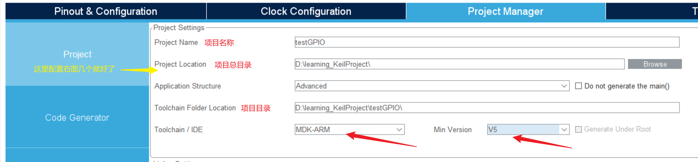
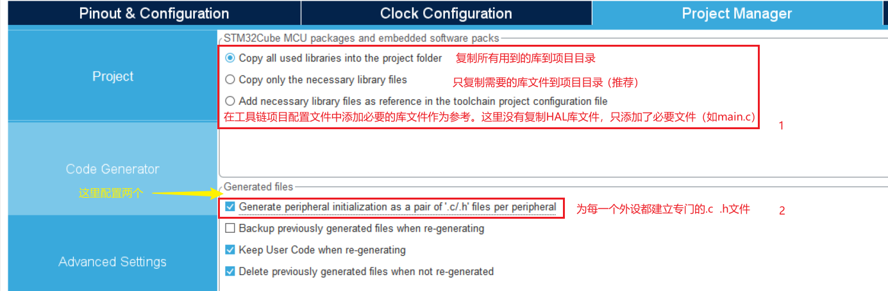
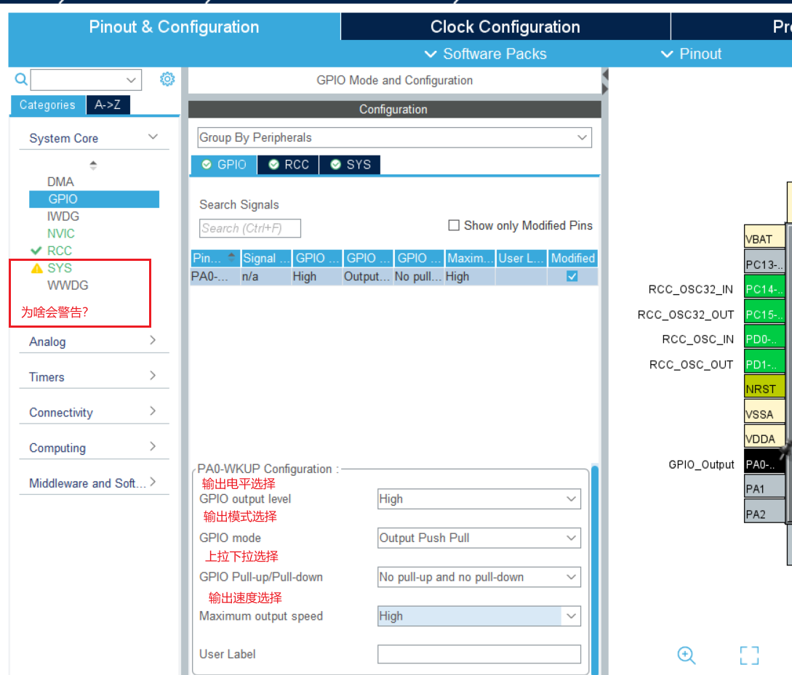

# STM32CubdMX

## 下载安装

安装包下载：[STM32CubeMX - STM32Cube initialization code generator - STMicroelectronics](https://www.st.com/en/development-tools/stm32cubemx.html)。

安装：默认安装即可。

STM32CubeMX与STM32CubeIDE的区别：

Cubemx 是个图形化配置工具，最大的好处是帮用户生成相应的初始化代码。
CubeIde 是编译器，最大的功能是帮助用户编译调试代码，包括cubemx 生成的项目代码。cubeide 也同时集成了cubemx工具。
cubeIDE = cubeMX + Keil;[如您用 keil]
cubeIDE = cubeMX + IAR;[如您用 IAR]
cubeIDE = cubeMX + STUDIO;[如您用 Studio]

打开软件，点击Help，在下拉菜单里找到 Updater Settings并点击打开，配置好Repository Folder（由你随意配置），下载固件库时将会下载到这个目录。

## 新建工程

0、Start My project from MCU 或者 File → New Project...创建工程，在弹出界面选择好对应芯片型号，然后Start Project即可创建工程，创建好后弹出工程界面如下：


1、配置下载接口，如下：


2、RCC时钟源配置，如下：


3、Clock Configuration —— 时钟配置，按功能所需配置。这里不进行配置，使用默认的配置。

4、Project Manager —— 项目管理，配置如下：





```
copy all used libraries into the projectfolder：复制所有库文件（不管工程需要用到还是没用到）到生成的工程目录中，此做法可以使在不使用Cubemx或者电脑没有安装cubemx,依然可以按照标准库的编程习惯调用HAL库函数进行程序编写。
Copy only the necessary library files： 只复制必要的库文件。这个相比上一个减少了很多文件。比如你没有使用CAN、SPI…等外设，就不会拷贝相关库文件到你工程下。
Add necessary library files as reference in the toolchain projectconfiguration file：在工具链项目配置文件中添加必要的库文件作为参考。这里没有复制HAL库文件，只添加了必要文件（如main.c）。相比上面，没有Drivers相关文件。
```

```
Generate peripheral initialization as a pair of’.c/.h’ files perperipheral：每个外设生成独立的.C .H文件，方便独立管理。不勾：所有初始化代码都生成在main.c勾选：初始化代码生成在对应的外设文件。 如UART初始化代码生成在uart.c中。
Backup previously generated files whenre-generating：在重新生成时备份以前生成的文件。重新生成代码时，会在相关目录中生成一个Backup文件夹，将之前源文件拷贝到其中。
keep user code when re-generating：重新生成代码时，保留用户代码(前提是代码写在规定的位置。也就是生成工程文件中的BEGIN和END之间。否则同样会删除。后面会根据生成的工程进行说明)
delete previously generated files when not re-generated：删除以前生成但现在没有选择生成的文件比如：之前生成了led.c，现在重新配置没有led.c，则会删除之前的led.c文件。(此功能根据自身要求进行取舍)
```

到这里基本配置已经好了，然后点一个灯——配置GPIOA的PA0输出高电平，点亮LED。

5、点灯——配置外设GPIO：




6、配置好后，执行GENERATE CODE来生成代码（如果没安装HAL固件库会提示你安装，按提示直接安装就好，固件库将放在你配置好的Repository Folder 下）。

7、然后用Keil打开项目，编译程序，再烧录进去就行了，烧录完成后按一下复位键。


