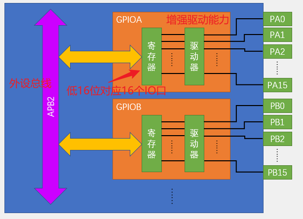

# STM32


STM32开发方式：

1. 基于寄存器。（不推荐）
2. 基于标准库。（通过STM官方封装好的函数进行开发）
3. 基于hal库。（使用图形化界面快速配置STM32）

外设：外部设备，指集成电路芯片外部的设备。

片内（片上）：指做成芯片的集成电路内部。

>早起由于IC集成工艺不发达，很多东西都是外设的，比如PWM、ADC、CAN等DSP芯片，原本都是需要芯片外接的，即使是现在，仍然有独立的ADC芯片，比如ADS8364等等。但是现在，PWM、ADC等等东西都已经集成在DSP芯片内，当然，无论如何，芯片总还是会需要外接一些设备实现某种系统，为了与那些外设相区别，就**将集成在芯片内，但是又不属于芯片本身**（比如DSP，是一种微处理器，因此芯片中不属于微处理器的部分都是外设）的称为**“片上外设”**。

# start—基本工程

## 建立工程

使用库函数新建keil工程进行STM32开发的步骤：

**1、新建keil工程，型号选择STM32F103C8。**

**2、核心开发支持文件的引入：**工程必要文件引入——在工程下创建文件夹Start，并将以下目录下的文件放进去：

将`STM32F10x_StdPeriph_Lib_V3.5.0\STM32F10x_StdPeriph_Lib_V3.5.0\Libraries\CMSIS\CM3\DeviceSupport\ST\STM32F10x\startup\arm`目录下的文件都放进去。**（STM32的启动文件，STM32程序从启动文件开始执行）**

将`STM32F10x_StdPeriph_Lib_V3.5.0\STM32F10x_StdPeriph_Lib_V3.5.0\Libraries\CMSIS\CM3\DeviceSupport\ST\STM32F10x`目录下的这三个头文件放进去：`stm32f10x.h`、`system_stm32f10x.c`、`system_stm32f10x.h`。**（第一个为外设寄存器描述文件，描述STM32有哪些寄存器和它对应的地址；后两个system文件主要来配置时钟，STM32主频72MHz就是在system文件里的函数配置的）**

将`STM32F10x_StdPeriph_Lib_V3.5.0\STM32F10x_StdPeriph_Lib_V3.5.0\Libraries\CMSIS\CM3\CoreSupport`目录下的两个文件都放进去。**（内核的寄存器描述文件、内核的配置函数）**


**3、添加启动组：**修改工程里的组，组名为Start，然后添加已存在文件：

从工程下的Start目录下添加那个后缀为`md.s`的启动文件，然后再把里面全部的.c、.h文件添加进去。


**4、添加包含路径：**

打开`Project  ===>  Options for Target ...`，选中`C/C++`后找到`Include Paths`，然后点击`Include Paths`那行末尾的`...`按钮，然后在打开的页面中点击第一个`New`按钮后再点击出现的`...`按钮并选中工程目录下的Start目录，OKOK，添加完成。


**5、新建User目录：**工程目录下新建一个User目录用来存放我们的开发代码；创建main.c文件并放到User目录下。

main.c文件如下，而且后面必须加上一行空行，否则会包警告！

```c
#include "stm32f10x.h"                  // Device header
int main(void)
{

	while(1){
	
	}

}

```

**6、工程设置：**打开`Project  ===>  Options for Target ...`，选中`Debug`后找到`Use`并找到`ST-Link Debugger`选上，然后在`Use`栏的最右边点击`Settings`按钮，在打开的面板中选中`Flash Download`，如何找到`Reset and Run`并选上，OKOK。


**7、测试：**寄存器方式点亮PC13的灯：

```c
#include "stm32f10x.h"                  // Device header
int main(void)
{
	RCC->APB2ENR = 0x00000010;
	GPIOC->CRH = 0x00300000;
	GPIOC->ODR = 0X00000000;
	while(1){
	}
}

```

如上main.c文件，编译，插入ST-Link连接上STM32，然后选择LOAD：（程序载入完成就能发现PC13的灯亮起来了）


**8、为工程添加库函数：**

首先在工程目录下创建`Library`目录，然后添加以下文件进去：

- 将`STM32F10x_StdPeriph_Lib_V3.5.0\Libraries\STM32F10x_StdPeriph_Driver\src`目录下的所有文件拷贝到`Library`目录中。（`ctrl + a`可以快速全选）
- 将`STM32F10x_StdPeriph_Lib_V3.5.0\Libraries\STM32F10x_StdPeriph_Driver\inc`目录下的所有文件拷贝到`Library`目录中。

然后在项目里添加`Library`组，再将项目下的Library目录里的文件都添加进这个组。

最后将`Library`目录添加进包含目录，步骤参考第4步的操作。

**9、添加用户开发目录-User 必须文件：**

`STM32F10x_StdPeriph_Lib_V3.5.0\Project\STM32F10x_StdPeriph_Template`目录下有这几个文件：`stm32f10x_conf.h`、`stm32f10x_it.c`、`stm32f10x_it.h`、`system_stm32f10x.c`，第一个是用来为配置库函数头文件的包含关系的，第二第三个是存放中断函数的，最后一个是关于参数检测的函数定义的，我们需要将前三个都拷贝进User目录，然后在项目里将其添加进`User`组。

User目录也要添加进包含目录，参考第四步操作。

**10、添加宏定义：**

打开`#include "stm32f10x.h"`文件文档，将宏定义`USE_STDPERIPH_DRIVER`添加进`C/C++`的定义中：


**11、测试：**使用库函数操作点亮PC13的灯：

```c
#include "stm32f10x.h"                  // Device header
int main(void)
{
	RCC_APB2PeriphClockCmd(RCC_APB2Periph_GPIOC,ENABLE);
	GPIO_InitTypeDef GPIO_InitStructuer;
	GPIO_InitStructuer.GPIO_Mode = GPIO_Mode_Out_PP;
	GPIO_InitStructuer.GPIO_Pin = GPIO_Pin_13;
	GPIO_InitStructuer.GPIO_Speed = GPIO_Speed_50MHz;
	GPIO_Init(GPIOC,&GPIO_InitStructuer);
	//GPIO_SetBits(GPIOC,GPIO_Pin_13); // 关闭P13的灯
	GPIO_ResetBits(GPIOC,GPIO_Pin_13); // 点亮P13的灯
	while(1){
	}
}

```

新建工程步骤总结：

1. 建立工程文件夹，Keil中新建工程，选择型号。
2. 工程文件夹里建立Start、Library、User等文件夹，复制固件库里面的文件到工程文件夹。
3. 工程里对应建立Start、Library、User等同名称的分组，然后将文件夹内的文件添加到工程分组里。
4. 工程选项，C/C++，Include Paths内声明所有包含头文件的文件夹。
5. 工程选项，C/C++，Define内定义USE_STDPERIPH_DRIVER（使用标准外设驱动）。
6. 工程选项，Debug，下拉列表选择对应调试器，Settings，Flash Download 里勾选 Reset and Run。

STM32F10X_MD的字符串keil5会自动帮声明。

## 关于启动文件


# GPIO

GPIO（General Purpose Input Output）通用输入输出口：

- 可配置为8种输入输出模式。
- 输出模式下可控制端口输出高低电平，用以驱动LED、控制蜂鸣器、模拟通信协议输出时序等。
- 输入模式下可读取端口的高低电平或电压，用于读取按键输入、外接模块电平信号输入、ADC电压采集、模拟通信协议接收数据等。
- STM32引脚电平：0V~3.3V，部分引脚可容忍5V。

GPIO结构：



## GPIO输入电路

根据数据手册中列出的每个I/O端口的特定硬件特征， GPIO端口的每个位可以由软件分别配置成多种模式。

1. ─ 输入浮空、输入上拉、输入下拉、模拟输入
2.  开漏输出、推挽式输出、 推挽式复用功能、开漏复用功能  

GPIO输入输出电路如下，上面是输入电路，下面是输出电路。


**1、保护二极管：**VDD接3.3V，Vss接0V，当输入电压高于3.3V，那么上方的保护二极管就会导通，输入电压产生的电流就会直接流入VDD而不会流入内部电路； 如果输入电压低于Vss（相当于Vss，会有负电压），下发的保护二极管就会导通，电流从Vss直接流出去而不会从内部电路汲取电流， 从而保护内部电路。

**2、上拉电阻、下拉电阻：**上、下拉电阻的开关可以通过程序控制；如果上面导通、下面断开——上拉输入模式；下面导通、上面断开——下拉输入模式；两个都断开——浮空输入模式。（上下拉电阻阻值一般都比较大，是弱上拉或弱下拉，目的是尽量不影响输入操作）

1. 上下拉电阻的作用：给输入提供一个默认的输入电平，为什么要提供默认的输入电平呢？因为对于一个数字的端口，输入不是高电平就是低电平，那如果输入引脚啥都不接，端口算高电平还是低电平呢？实际中，输入啥都不接，即输入处于一种浮空状态，引脚的电平就容易受到外界的干扰而改变，为了避免引脚悬空导致的输入数据不稳定，就加上上拉或下拉电阻。
2. 上拉输入模式：VDD=3.3 V，高电平，即默认输入为高电平。
3. 下拉输入模式：Vss=0V，低电平，即默认输入为低电平。	

**3、TTL肖特基触发器（实际是一种施密特触发器）：**对输入电压进行整型，如果输入电压大于某一阈值，输出就会瞬间升为高电平，低于某一阈值输出就会瞬间降为低电平。（作用：有效避免因信号波动造成的输出抖动现象）

**4、写入：**整形后波形直接写入输入数据寄存器，使用程序读取输入数据寄存器对应的某一位数据就可以知道端口的电平。

**5、模拟输入：**连接到ADC上的，因为ADC需要接收模拟量，所以接到施密特触发器前面。

**6、复用功能输入：**连接到其它需要读取端口的外设上，比如串口输入引脚，因为接收的是数字量所以接到触发器后面以便接收到整形后的。

## GPIO输出电路


数字部分由输出数据寄存器或片上外设控制，两种控制方式通过数据选择器接到输出控制部分。

**1、输出数据寄存器：**选择通过输出数据寄存器进行控制，就是普通的IO口输出，写这个数据寄存器的某一位就可以操作对应的某个端口。

**2、位设置/清除寄存器：**用来单独操作输出数据寄存器的某一位而不影响其它位。只设置某一位而不影响其它位的三种方式：

- 一是读出输出数据寄存器再通过按位与或者按位或更改某一位再写回去（麻烦，效率不高，对IO操作不合适）。
- 二是通过设置位设置寄存器，如果需要对某一位进行置1操作，就可以在这个寄存器的对应位写1即可，剩下不需要操作的位就写0，这样内部就会有电路自动将输出数据寄存器中对应位置置1，与0对应的保持不变；对某一位清0则是在位清除寄存器对应的对应位写1。
- 三是通过读写STM32中的“位带”区域，位带的作用金额51单片机的位寻址差不多，STM32中专门分配一段地址区域，这段地址区域映射了RAM和外设寄存器所有的位。

**3、MOS管（一种电子开关）：**通过信号控制开关的导通与关闭，开关负责将IO口接到VDD或VSS。

1. 推挽输出模式——P-MOS、N-MOS均有效：数据寄存器为1时，上管导通、下管断开，输出直接接到VDD，输出高电平；为0时，上断开下导通，输出接到VSS，输出低电平。这种模式下，输出高低电平都有较强的驱动能力，因此这种模式也叫做强推输出模式，而且该模式下STM32对IO口有绝对控制权，高低电平都由STM32决定。
2. 开漏输出模式——只有N-MOS有效：数据寄存器为1时，下管断开，输出相当于断开（高阻模式）；为0时，下管导通，输出低电平。这种模式下低电平有驱动能力，高电平没有，可以作为通信协议的驱动方式（比如I2C通信的引脚就使用这种模式） ，多机通信的情况下，这个模式可以避免各个设备互相干扰；还可以输出5V的电平信号，比如在IO口外接一个上拉电阻到5V电源，当N-MOS导通时时直接输出低电平，断开时就可以通过外部的上拉电阻拉高至5V，输出5V的电平信号，从而兼容一些5V电平的设备。
3. 关闭输出模式——P-MOS、N-MOS均无效：当引脚配置为输入模式的时候，这两个管无效，即关闭了输出模式，端口电平由外部信号来控制。

## GPIO模式


## GPIO输出操作

**1、外设时钟控制的函数原型：**（**STM外设正常工作的前提是使能了相应的外设**，有的外设需要使能1个、有的则需要使能2个或3个时钟才能正常工作）（注意复位是通过改变外设的复位寄存器来实现复位功能的，不会去改变外设的时钟状态）

使能（enable）与失能（disable）：enable—启用，disable—禁用；翻译为使能与失能的，也可以这么去理解，使能够——使某个功能起作用，失能——使失去能力，使某个功能不起作用。（PS：明显启用、禁用更好理解）

函数原型定义在`stm32f10x_rcc.h`。

```c
/* 第一个参数用来选择外设，第二个参数用来选择使能或失能 */
// RCC AHB   外设时钟控制
void RCC_AHBPeriphClockCmd(uint32_t RCC_AHBPeriph, FunctionalState NewState);
// RCC AHB2  外设时钟控制
void RCC_APB2PeriphClockCmd(uint32_t RCC_APB2Periph, FunctionalState NewState);
// RCC AHB1  外设时钟控制
void RCC_APB1PeriphClockCmd(uint32_t RCC_APB1Periph, FunctionalState NewState);
```

**2、GPIO初始化函数原型：**

函数原型定义：stm32f10x_gpio.h；函数具体实现：stm32f10x_gpio.c。

```c
void GPIO_DeInit(GPIO_TypeDef* GPIOx);
void GPIO_AFIODeInit(void);
void GPIO_Init(GPIO_TypeDef* GPIOx, GPIO_InitTypeDef* GPIO_InitStruct);
void GPIO_StructInit(GPIO_InitTypeDef* GPIO_InitStruct);
```

**3、GPIO读写功能的函数原型：**

函数原型定义：stm32f10x_gpio.h；函数具体实现：stm32f10x_gpio.c。

```c
// 读
uint8_t GPIO_ReadInputDataBit(GPIO_TypeDef* GPIOx, uint16_t GPIO_Pin);
uint16_t GPIO_ReadInputData(GPIO_TypeDef* GPIOx);
uint8_t GPIO_ReadOutputDataBit(GPIO_TypeDef* GPIOx, uint16_t GPIO_Pin);
uint16_t GPIO_ReadOutputData(GPIO_TypeDef* GPIOx);
// 写
void GPIO_SetBits(GPIO_TypeDef* GPIOx, uint16_t GPIO_Pin);
void GPIO_ResetBits(GPIO_TypeDef* GPIOx, uint16_t GPIO_Pin);
void GPIO_WriteBit(GPIO_TypeDef* GPIOx, uint16_t GPIO_Pin, BitAction BitVal);
void GPIO_Write(GPIO_TypeDef* GPIOx, uint16_t PortVal);
```


**实践：点亮LED灯、LED灯闪烁、LED流水灯、控制有源蜂鸣器的响应。**


