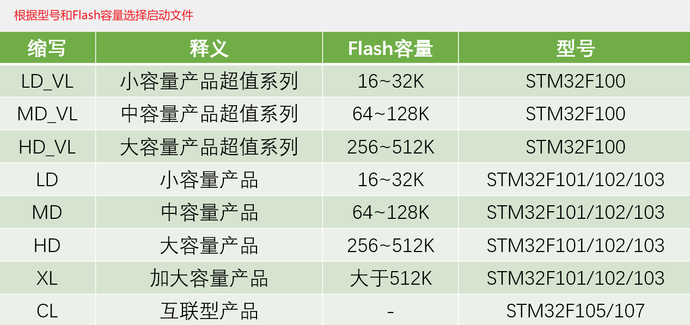
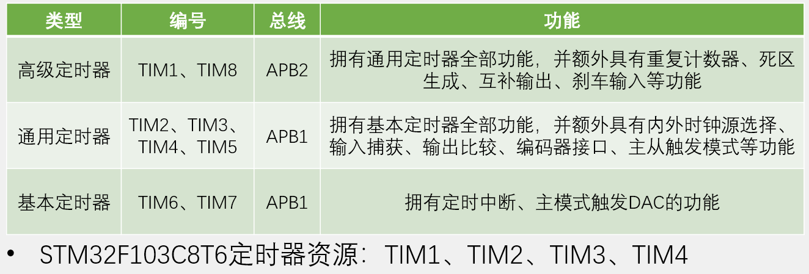
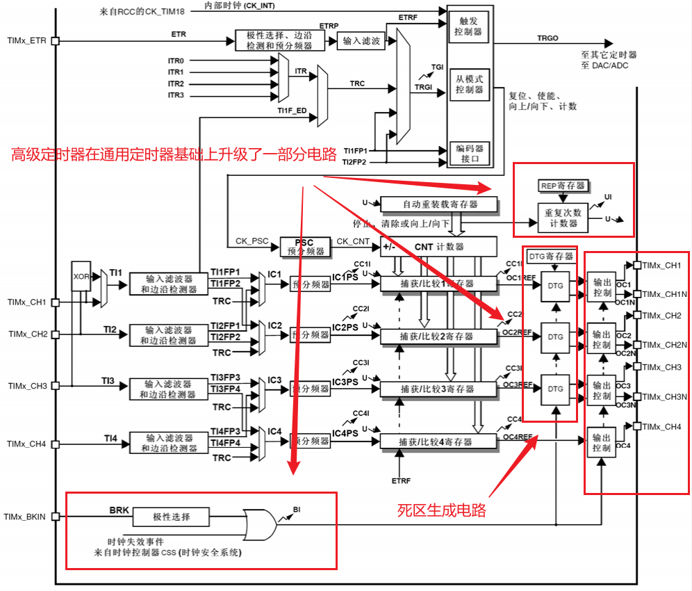
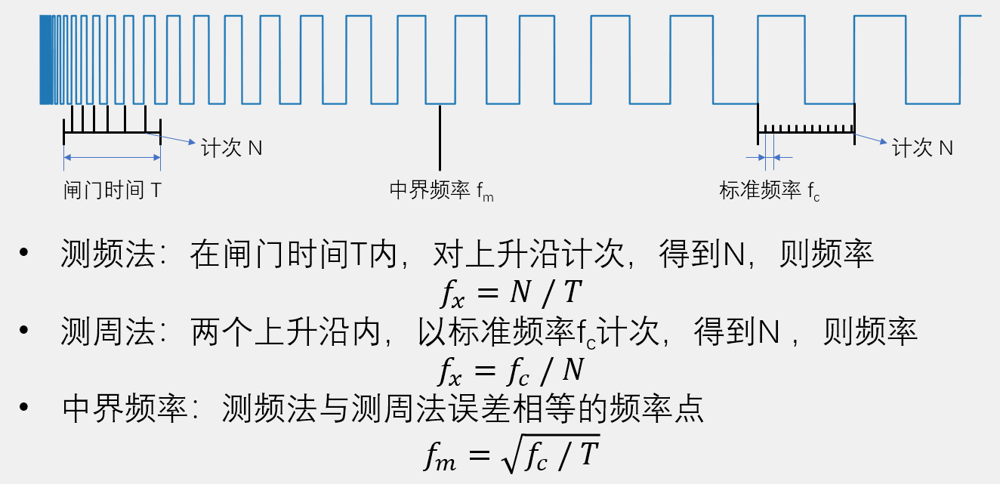
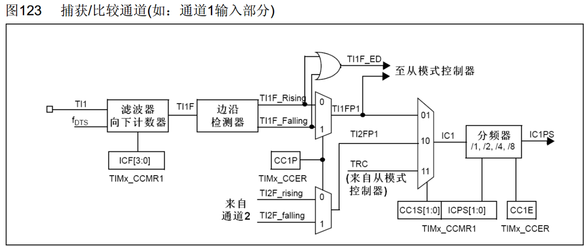
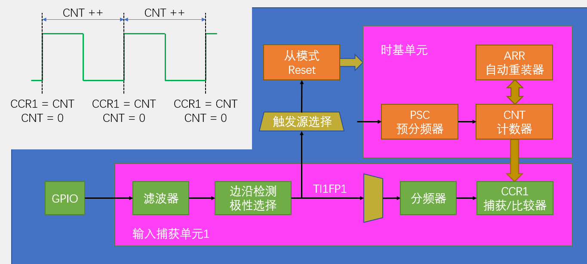
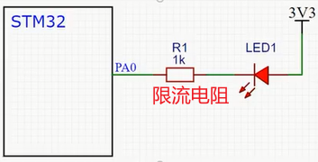
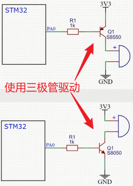
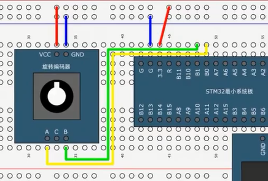

# STM32

教程：江科大自协化。

- 系列：主流系列STM32F1
- 内核：ARM Cortex-M3
- 主频：72MHz
- RAM：20K（SRAM）
- ROM：64K（Flash）
- 供电：2.0~3.6V（标准3.3V）
- 封装：LQFP48

引脚定义：


STM32开发方式：

1. 基于寄存器。（不推荐）
2. 基于标准库。（通过STM官方封装好的函数进行开发）
3. 基于hal库。（使用图形化界面快速配置STM32）

外设：外部设备，指集成电路芯片外部的设备。

片内（片上）：指做成芯片的集成电路内部。

>早起由于IC集成工艺不发达，很多东西都是外设的，比如PWM、ADC、CAN等DSP芯片，原本都是需要芯片外接的，即使是现在，仍然有独立的ADC芯片，比如ADS8364等等。但是现在，PWM、ADC等等东西都已经集成在DSP芯片内，当然，无论如何，芯片总还是会需要外接一些设备实现某种系统，为了与那些外设相区别，就**将集成在芯片内，但是又不属于芯片本身**（比如DSP，是一种微处理器，因此芯片中不属于微处理器的部分都是外设）的称为**“片上外设”**。

# start—基本工程

## 建立工程

使用库函数新建keil工程进行STM32开发的步骤：

**1、新建keil工程，型号选择STM32F103C8。**

**2、核心开发支持文件的引入：**工程必要文件引入——在工程下创建文件夹Start，并将以下目录下的文件放进去：

将`STM32F10x_StdPeriph_Lib_V3.5.0\STM32F10x_StdPeriph_Lib_V3.5.0\Libraries\CMSIS\CM3\DeviceSupport\ST\STM32F10x\startup\arm`目录下的文件都放进去。**（STM32的启动文件，STM32程序从启动文件开始执行）**

将`STM32F10x_StdPeriph_Lib_V3.5.0\STM32F10x_StdPeriph_Lib_V3.5.0\Libraries\CMSIS\CM3\DeviceSupport\ST\STM32F10x`目录下的这三个头文件放进去：`stm32f10x.h`、`system_stm32f10x.c`、`system_stm32f10x.h`。**（第一个为外设寄存器描述文件，描述STM32有哪些寄存器和它对应的地址；后两个system文件主要来配置时钟，STM32主频72MHz就是在system文件里的函数配置的）**

将`STM32F10x_StdPeriph_Lib_V3.5.0\STM32F10x_StdPeriph_Lib_V3.5.0\Libraries\CMSIS\CM3\CoreSupport`目录下的两个文件都放进去。**（内核的寄存器描述文件、内核的配置函数）**


**3、添加启动组：**修改工程里的组，组名为Start，然后添加已存在文件：

从工程下的Start目录下添加那个后缀为`md.s`的启动文件，然后再把里面全部的.c、.h文件添加进去。


**4、添加包含路径：**

打开`Project  ===>  Options for Target ...`，选中`C/C++`后找到`Include Paths`，然后点击`Include Paths`那行末尾的`...`按钮，然后在打开的页面中点击第一个`New`按钮后再点击出现的`...`按钮并选中工程目录下的Start目录，OKOK，添加完成。


**5、新建User目录：**工程目录下新建一个User目录用来存放我们的开发代码；创建main.c文件并放到User目录下。

main.c文件如下，而且后面必须加上一行空行，否则会包警告！

```c
#include "stm32f10x.h"                  // Device header
int main(void)
{

	while(1){
	
	}

}

```

**6、工程设置：**打开`Project  ===>  Options for Target ...`，选中`Debug`后找到`Use`并找到`ST-Link Debugger`选上，然后在`Use`栏的最右边点击`Settings`按钮，在打开的面板中选中`Flash Download`，如何找到`Reset and Run`并选上，OKOK。


**7、测试：**寄存器方式点亮PC13的灯：

```c
#include "stm32f10x.h"                  // Device header
int main(void)
{
	RCC->APB2ENR = 0x00000010;
	GPIOC->CRH = 0x00300000;
	GPIOC->ODR = 0X00000000;
	while(1){
	}
}

```

如上main.c文件，编译，插入ST-Link连接上STM32，然后选择LOAD：（程序载入完成就能发现PC13的灯亮起来了）


**8、为工程添加库函数：**

首先在工程目录下创建`Library`目录，然后添加以下文件进去：

- 将`STM32F10x_StdPeriph_Lib_V3.5.0\Libraries\STM32F10x_StdPeriph_Driver\src`目录下的所有文件拷贝到`Library`目录中。（`ctrl + a`可以快速全选）
- 将`STM32F10x_StdPeriph_Lib_V3.5.0\Libraries\STM32F10x_StdPeriph_Driver\inc`目录下的所有文件拷贝到`Library`目录中。

然后在项目里添加`Library`组，再将项目下的Library目录里的文件都添加进这个组。

最后将`Library`目录添加进包含目录，步骤参考第4步的操作。

**9、添加用户开发目录-User 必须文件：**

`STM32F10x_StdPeriph_Lib_V3.5.0\Project\STM32F10x_StdPeriph_Template`目录下有这几个文件：`stm32f10x_conf.h`、`stm32f10x_it.c`、`stm32f10x_it.h`、`system_stm32f10x.c`，第一个是用来为配置库函数头文件的包含关系的，第二第三个是存放中断函数的，最后一个是关于参数检测的函数定义的，我们需要将前三个都拷贝进User目录，然后在项目里将其添加进`User`组。

User目录也要添加进包含目录，参考第四步操作。

**10、添加宏定义：**

打开`#include "stm32f10x.h"`文件文档，将宏定义`USE_STDPERIPH_DRIVER`添加进`C/C++`的定义中：


**11、测试：**使用库函数操作点亮PC13的灯：

```c
#include "stm32f10x.h"                  // Device header
int main(void)
{
	RCC_APB2PeriphClockCmd(RCC_APB2Periph_GPIOC,ENABLE);
	GPIO_InitTypeDef GPIO_InitStructure;
	GPIO_InitStructure.GPIO_Mode = GPIO_Mode_Out_PP;
	GPIO_InitStructure.GPIO_Pin = GPIO_Pin_13;
	GPIO_InitStructure.GPIO_Speed = GPIO_Speed_50MHz;
	GPIO_Init(GPIOC,&GPIO_InitStructure);
	//GPIO_SetBits(GPIOC,GPIO_Pin_13); // 关闭P13的灯
	GPIO_ResetBits(GPIOC,GPIO_Pin_13); // 点亮P13的灯
	while(1){
	}
}

```

新建工程步骤总结：

1. 建立工程文件夹，Keil中新建工程，选择型号。
2. 工程文件夹里建立Start、Library、User等文件夹，复制固件库里面的文件到工程文件夹。
3. 工程里对应建立Start、Library、User等同名称的分组，然后将文件夹内的文件添加到工程分组里。
4. 工程选项，C/C++，Include Paths内声明所有包含头文件的文件夹。
5. 工程选项，C/C++，Define内定义USE_STDPERIPH_DRIVER（使用标准外设驱动）。
6. 工程选项，Debug，下拉列表选择对应调试器，Settings，Flash Download 里勾选 Reset and Run。

STM32F10X_MD的字符串keil5会自动帮声明。

## 关于启动文件



# GPIO

GPIO（General Purpose Input Output）通用输入输出口：

- 可配置为8种输入输出模式。
- 输出模式下可控制端口输出高低电平，用以驱动LED、控制蜂鸣器、模拟通信协议输出时序等。
- 输入模式下可读取端口的高低电平或电压，用于读取按键输入、外接模块电平信号输入、ADC电压采集、模拟通信协议接收数据等。
- STM32引脚电平：0V~3.3V，部分引脚可容忍5V。

GPIO结构：


## GPIO输入电路

根据数据手册中列出的每个I/O端口的特定硬件特征， GPIO端口的每个位可以由软件分别配置成多种模式。

1. 输入浮空、输入上拉、输入下拉、模拟输入
2.  开漏输出、推挽式输出、 推挽式复用功能、开漏复用功能  

GPIO输入输出电路如下，上面是输入电路，下面是输出电路。


**1、保护二极管：**VDD接3.3V，Vss接0V，当输入电压高于3.3V，那么上方的保护二极管就会导通，输入电压产生的电流就会直接流入VDD而不会流入内部电路； 如果输入电压低于Vss（相当于Vss，会有负电压），下发的保护二极管就会导通，电流从Vss直接流出去而不会从内部电路汲取电流， 从而保护内部电路。

**2、上拉电阻、下拉电阻：**上、下拉电阻的开关可以通过程序控制；如果上面导通、下面断开——上拉输入模式；下面导通、上面断开——下拉输入模式；两个都断开——浮空输入模式。（上下拉电阻阻值一般都比较大，是弱上拉或弱下拉，目的是尽量不影响输入操作）

1. 上下拉电阻的作用：给输入提供一个默认的输入电平，为什么要提供默认的输入电平呢？因为对于一个数字的端口，输入不是高电平就是低电平，那如果输入引脚啥都不接，端口算高电平还是低电平呢？实际中，输入啥都不接，即输入处于一种浮空状态，引脚的电平就容易受到外界的干扰而改变，为了避免引脚悬空导致的输入数据不稳定，就加上上拉或下拉电阻。
2. 上拉输入模式：VDD=3.3 V，高电平，即默认输入为高电平。
3. 下拉输入模式：Vss=0V，低电平，即默认输入为低电平。	

**3、TTL肖特基触发器（实际是一种施密特触发器）：**对输入电压进行整型，如果输入电压大于某一阈值，输出就会瞬间升为高电平，低于某一阈值输出就会瞬间降为低电平。（作用：有效避免因信号波动造成的输出抖动现象）

**4、写入：**整形后波形直接写入输入数据寄存器，使用程序读取输入数据寄存器对应的某一位数据就可以知道端口的电平。

**5、模拟输入：**连接到ADC上的，因为ADC需要接收模拟量，所以接到施密特触发器前面。

**6、复用功能输入：**连接到其它需要读取端口的外设上，比如串口输入引脚，因为接收的是数字量所以接到触发器后面以便接收到整形后的。

## GPIO输出电路


数字部分由输出数据寄存器或片上外设控制，两种控制方式通过数据选择器接到输出控制部分。

**1、输出数据寄存器：**选择通过输出数据寄存器进行控制，就是普通的IO口输出，写这个数据寄存器的某一位就可以操作对应的某个端口。

**2、位设置/清除寄存器：**用来单独操作输出数据寄存器的某一位而不影响其它位。只设置某一位而不影响其它位的三种方式：

- 一是读出输出数据寄存器再通过按位与或者按位或更改某一位再写回去（麻烦，效率不高，对IO操作不合适）。
- 二是通过设置位设置寄存器，如果需要对某一位进行置1操作，就可以在这个寄存器的对应位写1即可，剩下不需要操作的位就写0，这样内部就会有电路自动将输出数据寄存器中对应位置置1，与0对应的保持不变；对某一位清0则是在位清除寄存器对应的对应位写1。
- 三是通过读写STM32中的“位带”区域，位带的作用金额51单片机的位寻址差不多，STM32中专门分配一段地址区域，这段地址区域映射了RAM和外设寄存器所有的位。

**3、MOS管（一种电子开关）：**通过信号控制开关的导通与关闭，开关负责将IO口接到VDD或VSS。

1. 推挽输出模式——P-MOS、N-MOS均有效：数据寄存器为1时，上管导通、下管断开，输出直接接到VDD，输出高电平；为0时，上断开下导通，输出接到VSS，输出低电平。这种模式下，输出高低电平都有较强的驱动能力，因此这种模式也叫做强推输出模式，而且该模式下STM32对IO口有绝对控制权，高低电平都由STM32决定。
2. 开漏输出模式——只有N-MOS有效：数据寄存器为1时，下管断开，输出相当于断开（高阻模式）；为0时，下管导通，输出低电平。这种模式下低电平有驱动能力，高电平没有，可以作为通信协议的驱动方式（比如I2C通信的引脚就使用这种模式） ，多机通信的情况下，这个模式可以避免各个设备互相干扰；还可以输出5V的电平信号，比如在IO口外接一个上拉电阻到5V电源，当N-MOS导通时时直接输出低电平，断开时就可以通过外部的上拉电阻拉高至5V，输出5V的电平信号，从而兼容一些5V电平的设备。
3. 关闭输出模式——P-MOS、N-MOS均无效：当引脚配置为输入模式的时候，这两个管无效，即关闭了输出模式，端口电平由外部信号来控制。

## GPIO模式


## GPIO函数原型

**1、外设时钟控制的函数原型：** STM外设正常工作的前提是使能（启用）了相应的外设，有的外设需要使能1个、有的则需要使能2个或3个时钟才能正常工作。（注意复位是通过改变外设的复位寄存器来实现复位功能的，不会去改变外设的时钟状态）

使能（enable）与失能（disable）：enable—启用，disable—禁用；翻译为使能与失能的，也可以这么去理解，使能够——使某个功能起作用，失能——使失去能力，使某个功能不起作用。（PS：明显启用、禁用更好理解）

函数原型定义在`stm32f10x_rcc.h`，RCC的库函数最重要的是以下三个：

```c
/* 第一个参数用来选择外设，第二个参数用来选择使能或失能 */
// RCC AHB   
void RCC_AHBPeriphClockCmd(uint32_t RCC_AHBPeriph, FunctionalState NewState);
// RCC APB2 
void RCC_APB2PeriphClockCmd(uint32_t RCC_APB2Periph, FunctionalState NewState);
// RCC APB1  
void RCC_APB1PeriphClockCmd(uint32_t RCC_APB1Periph, FunctionalState NewState);
```

**2、GPIO初始化函数原型：**

函数原型定义：stm32f10x_gpio.h；函数具体实现：stm32f10x_gpio.c。

```c
void GPIO_DeInit(GPIO_TypeDef* GPIOx);  // 用来复位指定GPIO外设
void GPIO_AFIODeInit(void);  // 复位AFIO外设
// 初始化GPIO口，使用其需先定义一个结构体，给结构体赋值后再调用该函数
void GPIO_Init(GPIO_TypeDef* GPIOx, GPIO_InitTypeDef* GPIO_InitStruct); 
// 把结构体变量赋一个默认值
void GPIO_StructInit(GPIO_InitTypeDef* GPIO_InitStruct);
```

**3、GPIO读写功能的函数原型：**

函数原型定义：stm32f10x_gpio.h；函数具体实现：stm32f10x_gpio.c。

```c
/* GPIO_TypeDef* GPIOx——选择外设  uint16_t GPIO_Pin——选择io口  */
// 读，读取输入
uint8_t GPIO_ReadInputDataBit(GPIO_TypeDef* GPIOx, uint16_t GPIO_Pin); 
uint16_t GPIO_ReadInputData(GPIO_TypeDef* GPIOx); 
uint8_t GPIO_ReadOutputDataBit(GPIO_TypeDef* GPIOx, uint16_t GPIO_Pin); 
uint16_t GPIO_ReadOutputData(GPIO_TypeDef* GPIOx); 
// 写，输出
void GPIO_SetBits(GPIO_TypeDef* GPIOx, uint16_t GPIO_Pin);  // 置1
void GPIO_ResetBits(GPIO_TypeDef* GPIOx, uint16_t GPIO_Pin); // 置0
void GPIO_WriteBit(GPIO_TypeDef* GPIOx, uint16_t GPIO_Pin, BitAction BitVal); // 写某位
void GPIO_Write(GPIO_TypeDef* GPIOx, uint16_t PortVal); // 全输出
```

**4、常用参数说明：**

结构体——GPIO_InitTypeDef：

```c
typedef struct
{
  uint16_t GPIO_Pin;            // GPIO引脚的Pin值
  GPIOSpeed_TypeDef GPIO_Speed; // GPIO输出速度
  GPIOMode_TypeDef GPIO_Mode;   // GPIO工作模式 
}GPIO_InitTypeDef;
```

枚举——GPIOMode_TypeDef：GPIO的八种工作模式（对应上面结构体的GPIO_Mode）

```c
typedef enum{ 
  GPIO_Mode_AIN = 0x0,  // Analog In，模拟输入
  GPIO_Mode_IN_FLOATING = 0x04, // floating 浮空
  GPIO_Mode_IPD = 0x28,  // in pull down 下拉输入
  GPIO_Mode_IPU = 0x48,  // in pull up 上拉输入
    
  GPIO_Mode_Out_OD = 0x14, // out open drain 开漏输出
  GPIO_Mode_Out_PP = 0x10, // out push pull 推挽输出
  GPIO_Mode_AF_OD = 0x1C,  // ATL open drain 复用开漏输出
  GPIO_Mode_AF_PP = 0x18   // atl push pull 复用推挽输出
}GPIOMode_TypeDef;
```

GPIO引脚的宏定义：（对应上面结构体的GPIO_Pin）

```c
#define GPIO_Pin_0                 ((uint16_t)0x0001)  /*!< Pin 0 selected */
#define GPIO_Pin_1                 ((uint16_t)0x0002)  /*!< Pin 1 selected */
#define GPIO_Pin_2                 ((uint16_t)0x0004)  /*!< Pin 2 selected */
#define GPIO_Pin_3                 ((uint16_t)0x0008)  /*!< Pin 3 selected */
#define GPIO_Pin_4                 ((uint16_t)0x0010)  /*!< Pin 4 selected */
#define GPIO_Pin_5                 ((uint16_t)0x0020)  /*!< Pin 5 selected */
#define GPIO_Pin_6                 ((uint16_t)0x0040)  /*!< Pin 6 selected */
#define GPIO_Pin_7                 ((uint16_t)0x0080)  /*!< Pin 7 selected */
#define GPIO_Pin_8                 ((uint16_t)0x0100)  /*!< Pin 8 selected */
#define GPIO_Pin_9                 ((uint16_t)0x0200)  /*!< Pin 9 selected */
#define GPIO_Pin_10                ((uint16_t)0x0400)  /*!< Pin 10 selected */
#define GPIO_Pin_11                ((uint16_t)0x0800)  /*!< Pin 11 selected */
#define GPIO_Pin_12                ((uint16_t)0x1000)  /*!< Pin 12 selected */
#define GPIO_Pin_13                ((uint16_t)0x2000)  /*!< Pin 13 selected */
#define GPIO_Pin_14                ((uint16_t)0x4000)  /*!< Pin 14 selected */
#define GPIO_Pin_15                ((uint16_t)0x8000)  /*!< Pin 15 selected */
#define GPIO_Pin_All               ((uint16_t)0xFFFF)  /*!< All pins selected */
```

GPIO输出速度：（对应上面结构体的GPIO_Speed）

```c
typedef enum
{ 
  GPIO_Speed_10MHz = 1,
  GPIO_Speed_2MHz, 
  GPIO_Speed_50MHz    //  50MHz
}GPIOSpeed_TypeDef;
```


## GPIO输出操作

使用库函数进行GPIO输出操作的三步骤：1、启用外设时钟；2、GPIO的初始化，启用满足需要的GPIO输出模式；3、使用输出函数进行操作。

```c
int main(void){
	// 1.使用RCC开启GPIO的时钟
	RCC_APB2PeriphClockCmd(RCC_APB2Periph_GPIOC,ENABLE);
	// 2.1 结构体，选择初始化GPIO的一些参数
	GPIO_InitTypeDef GPIO_InitStructure;
	GPIO_InitStructure.GPIO_Mode = GPIO_Mode_Out_PP;
	GPIO_InitStructure.GPIO_Pin = GPIO_Pin_13;
	GPIO_InitStructure.GPIO_Speed = GPIO_Speed_50MHz;
	// 2.2 初始化
	GPIO_Init(GPIOC,&GPIO_InitStructure);
	// 3.使用输出函数控制GPIO口输出
	//GPIO_SetBits(GPIOC,GPIO_Pin_13); // 置1，高电平
	GPIO_ResetBits(GPIOC,GPIO_Pin_13); // 置0，低电平
	while(1)
	{
		
	}
}

```

标准库函数使用说明：打出函数的名称然后将鼠标光标定位到该函数名，右键转到函数定义的地方，然后看函数说明，根据需求选择形参即可。（可以`Ctrl + F`来选择某个参数的定义（宏、结构体等））


## GPIO输入操作

使用库函数读取输入的三步骤：1、启用外设时钟；2、GPIO的初始化，启用满足需要的GPIO输入模式；3、使用读取函数进行操作。

```c
/* GPIO_TypeDef* GPIOx——选择外设  uint16_t GPIO_Pin——选择io口  */
// 读取，返回代表高低电平的数
// 读取输入寄存器某一位
uint8_t GPIO_ReadInputDataBit(GPIO_TypeDef* GPIOx, uint16_t GPIO_Pin); 
// 读取整个输入寄存器
uint16_t GPIO_ReadInputData(GPIO_TypeDef* GPIOx);
// 读取输出数据寄存器某一位
uint8_t GPIO_ReadOutputDataBit(GPIO_TypeDef* GPIOx, uint16_t GPIO_Pin);
// 读取整个输出数据寄存器
uint16_t GPIO_ReadOutputData(GPIO_TypeDef* GPIOx);
```

后两个读取输出数据寄存器的，严格来说不是读取输入的函数。

```c
int main(void){
	// 1.使用RCC开启GPIO的时钟
	RCC_APB2PeriphClockCmd(RCC_APB2Periph_GPIOB,ENABLE);
	// 2.1 结构体，选择初始化GPIO的一些参数
	GPIO_InitTypeDef GPIO_InitStructure;
	GPIO_InitStructure.GPIO_Mode = GPIO_Mode_IPD;
	GPIO_InitStructure.GPIO_Pin = GPIO_Pin_13;
	GPIO_InitStructure.GPIO_Speed = GPIO_Speed_50MHz;
	// 2.2 初始化
	GPIO_Init(GPIOB,&GPIO_InitStructure);
	// 3.使用读取函数读取IO口输入的数据
	//GPIO_ReadInputDataBit(GPIOB,GPIO_Pin_13); // 读取某一位
	//GPIO_ReadInputData(GPIOB,GPIO_Pin_13);    // 读取全部
	while(1)
	{
		
	}
}

```


## C


51中int是16位存储，STM32中int是32位存储。建议使用stdint.h提供的。

# 中断

## 概述

**中断：**在主程序运行过程中，出现了特定的中断触发条件（中断源），使得CPU暂停当前正在运行的程序，转而去处理中断程序，处理完成后又返回原来被暂停的位置继续运行。（中断过程：中断触发后，CPU停止执行当前程序转而去处理事件，待处理完毕返回到原来被中断的地方继续执行。）

**中断源：**请示CPU中断的请求源。

中断服务程序：中断触发后交由CPU执行的程序。

**中断优先级：**当有多个中断源的时候，CPU根据中断的级别来决定优先响应的中断源。

中断嵌套：一个中断服务程序中有比其更高优先级的中断源，触发这个中断源请求后将去处理这个高优先级的中断服务程序再返回处理低优先级的中断服务程序。多级中断系统，单级中断系统——有无中断嵌套功能。

STM32F1的中断：

- 最多68个可屏蔽中断通道（中断源），包含EXTI、TIM、ADC、USART、SPI、I2C、RTC等多个外设。
- 中断响应优先级管理：使用**NVIC统一管理中断（分配优先级）**，每个中断通道都拥有**16个可编程的优先等级**，可对优先级进行分组，进一步设置抢占优先级和响应优先级。

中断向量表：由于硬件限制，中断跳转只能调到指定的地址来指向中断服务程序，为了能让硬件跳到一个不固定的中断函数里，就需要在内存中定义一个地址的列表，这些地址列表是固定的。当中断发生后会跳转到这些固定的位置，然后由编译器在这些固定位置加上一条跳转到中断函数的代码，这样就可以使中断跳转跳到任何位置。这些在内存中的固定的地址列表就叫中断向量表，相当于跳到中断函数的一个跳板。

## NVIC


NVIC（Nested Vectored Interrupt Controller）——  内嵌向量中断控制器。

NVIC 优先级分组：抢占优先级（可中断中断来优先执行的中断级别，用于中断嵌套）、响应优先级（优先执行的中断级别，相当于插队，不能通过中断中断来优先执行，比抢占式级别低）。

优先级控制，通过优先寄存器的4位决定。**在程序中，选择好了优先级分组方式后便可设置优先级级别**（具体操作见EXTI—使用）。通过4位来决定两种优先级，每一种的优先级分组方式不同，优先级取值范围也就不同，如下：


中断响应顺序：抢占优先级  >   响应优先级 ，抢占优先级和响应优先级均相同的按中断号（默认优先级）进行排队。

## EXTI—结构

**1、EXTI（Extern Interrupt）——  外部中断：**

**外部中断过程：**当GPIO产生电平变化时触发外部中断，外部中断先由NVIC进行裁决后中断CPU主程序，然后CPU执行相应的中断处理程序。（所有的GPIO口都可以触发，只不过相同GPIO_Pin的GPIO口不能同时触发中断，比如PA0、PB0的Pin一样不能同时触发中断，只能选择其中的一个作为中断触发引脚）

**外部中断支持的触发方式：**上升沿、下降沿、双边沿、软件触发。

外部中断占用的通道数：16个GPIO_Pin，外加PVD输出、RTC闹钟、USB唤醒、以太网唤醒，总共20个中断线路。（后四个是来“蹭网”的，蹭外部中断的一个功能——从低功耗模式的停止模式下唤醒STM32；例如对于PVD电源电压检测，当电源从电压过低恢复时就需要借助外部中断退出停止模式；对于RTC闹钟来说，有时为了省电，RTC定一个闹钟后STM32会进入停止模式，等闹钟响的时候再唤醒，这时候就需要借助外部中断，其它类似。）

**中断触发后的响应方式：**中断响应（就是请求中断再由CPU执行中断处理函数）、事件响应（STM32对外部中断增加的额外功能，可以通过选择触发一个事件来触发其它外设操作；事件响应不会去请求CPU处理中断，属于外设之间的联合工作）。

**2、外部中断的结构：**

外部中断总流程框图：


AFIO（Alternate function I/O alternate）—— 备用功能IO口：将IO口连接到EXTI的通道，主要功能是复用功能引脚和用于中断引脚选择。（相同的Pin的IO口，通过AFIO选择后，只有一个能接到外部中断的通道上，因此相同的Pin的IO口不能同时触发中断）。AFIO 内部结构框图如下：


 EXTI 内部结构框图如下：


1. 20根输入线进入边缘检测电路。（可以选择上升沿触发、下降沿触发）
2. 软件中断事件寄存器——实现软件触发中断。
3. 请求挂起寄存器，相当于一个中断标志位，通过读取这个寄存器判断是哪个通道触发的中断。
4. 中断屏蔽寄存器，用于屏蔽中断，当输出0时就屏蔽调中断信号。
5. 事件屏蔽寄存器，用于屏蔽事件响应。
6. 脉冲发生器，用于触发其它外设的动作。
7. 外设接口和APB总线，可以通过总线访问寄存器。

**3、什么情况下使用外部中断：**

1. 外部触发的突发事件，需要及时读取信号的。（比如旋转编码器、红外遥控接收头的输出信号需要及时读取）
2. 按键也是外部触发的突然事件，但不建议使用外部中断读取按键，在外部中断中不好处理按键抖动、松手检测等问题，而且按键的输出波形也不是转瞬即逝的，因此要求不高时可以主循环读取，不想用主循环读取，那么可以考虑定时器中断读取，这样可以很好地处理按键抖动和松手检测问题也不会阻塞主程序。

旋转编码器：**用来测量位置、速度或旋转方向的装置**，当其旋转轴旋转时，其输出端可以输出与旋转速度和方向对应的方波信号，读取方波信号的频率和相位信息即可得知旋转轴的速度和方向。类型有：机械触点式、霍尔传感器式、光栅式（只能测速度和位置）。

## EXTI—使用

外部中断的使用分为两步：一是配置外部中断；二是定义中断程序（中断函数）。

### 1、外部中断的配置：


外部中断整体结构图如上，简单来说使用外部中断就是配置好资源，将上面的外设GPIO到NVIC的通道打通。具体步骤：

- 第一步：配置RCC，把涉及的外设的时钟都打开。（外设的时钟打开了才能使外设工作，EXTI和NVIC的时钟默认一直开启）
- 第二步：配置GPIO，设置目标端口为输入模式。
- 第三步：配置AFIO，选择使用的GPIO端口以便连接到EXTI。
- 第四步：配置EXTI，选择触发方式——上升沿、下降沿、双边沿，选择触发响应方式——中断响应、事件响应。
- 第五步：配置NVIC，给中断选择合适的优先级。

配置示例，使用GPIOB的14端口：

```c
void GPIOB14_EXTI_Init(void){
    /* 第一步：打开使用的外设的时钟 EXTI、NVIC这两个外设的时钟默认一直开启的不需要再配置*/
    RCC_APB2PeriphClockCmd(RCC_APB2Periph_GPIOB, ENABLE);
    RCC_APB2PeriphClockCmd(RCC_APB2Periph_AFIO, ENABLE);
    /* 第二步：根据结构体里面指定的参数初始化GPIO */
    GPIO_InitTypeDef GPIO_InitStructure;
    GPIO_InitStructure.GPIO_Mode = GPIO_Mode_IPU;
    GPIO_InitStructure.GPIO_Pin = GPIO_Pin_14;
    GPIO_InitStructure.GPIO_Speed = GPIO_Speed_50MHz;
    GPIO_Init(GPIOB, &GPIO_InitStructure);
    /* 第三步：  配置AFIO*/
	GPIO_EXTILineConfig(GPIO_PortSourceGPIOB, GPIO_PinSource14);
    /* 第四步：根据结构体里面指定的参数初始化EXTI */
    EXTI_InitTypeDef EXTI_InitStruct;
    EXTI_InitStruct.EXTI_Line = EXTI_Line14;  //  14通道
    EXTI_InitStruct.EXTI_LineCmd = ENABLE;    // 开启
    EXTI_InitStruct.EXTI_Mode = EXTI_Mode_Interrupt; // 中断响应
    EXTI_InitStruct.EXTI_Trigger = EXTI_Trigger_Falling; // 下降沿触发
    EXTI_Init(&EXTI_InitStruct);
    /* 第五步：NVIC配置 */
    // 1.分组方式整个芯片只能使用一种，因此每一个项目只设置一次就行了
    // 如果将分组放到模块里，那么所有模块的分组都应保持一致；直接放在主函数里设置分组就行了
    NVIC_PriorityGroupConfig(NVIC_PriorityGroup_2);
    // 2.根据结构体里面指定的参数初始化NVIC
    NVIC_InitTypeDef NVIC_InitStruct;
    NVIC_InitStruct.NVIC_IRQChannel = EXTI15_10_IRQn;   //  选择通道
    NVIC_InitStruct.NVIC_IRQChannelCmd = ENABLE;        // 启用
    NVIC_InitStruct.NVIC_IRQChannelPreemptionPriority = 1; // 抢占优先级
    NVIC_InitStruct.NVIC_IRQChannelSubPriority = 1;        // 响应优先级
    NVIC_Init(&NVIC_InitStruct);
}
```


### 一些库函数原型说明

AFIO的库函数和GPIO的库函数在同一个文件里。AFIO的函数原型说明  stm32f10x_gpio.h ：

```c
void GPIO_AFIODeInit(void); // 复位AFIO外设
// 锁定GPIO配置，防止意外更改   （了解）
void GPIO_PinLockConfig(GPIO_TypeDef* GPIOx, uint16_t GPIO_Pin); 
// 配置AFIO的事件输出功能       （了解）
void GPIO_EventOutputConfig(uint8_t GPIO_PortSource, uint8_t GPIO_PinSource);
void GPIO_EventOutputCmd(FunctionalState NewState);
// 引脚重映射  参数为：(重映射方式，新的状态) 
void GPIO_PinRemapConfig(uint32_t GPIO_Remap, FunctionalState NewState);
// 配置AFIO的数据选择器
void GPIO_EXTILineConfig(uint8_t GPIO_PortSource, uint8_t GPIO_PinSource);
// 以太网有关的
void GPIO_ETH_MediaInterfaceConfig(uint32_t GPIO_ETH_MediaInterface);
```

EXTI的函数原型说明  stm32f10x_exti.h ：

```c
// 复位，将EXTI的配置清除，恢复到上电的状态
void EXTI_DeInit(void);
// 根据结构体里面指定的参数初始化EXTI，用法和GPIO_Init类似
void EXTI_Init(EXTI_InitTypeDef* EXTI_InitStruct);
// 结构体初始化，为传入的EXTI_InitTypeDef类型的结构体赋一个默认值
void EXTI_StructInit(EXTI_InitTypeDef* EXTI_InitStruct);
// 软件触发外部中断，调用函数，参数为一个中断线，就能软件触发一次这个外部中断
void EXTI_GenerateSWInterrupt(uint32_t EXTI_Line);


/* 操作状态寄存器的标志位的函数 */
// 程序里使用，查看指定标志位是否置1，
FlagStatus EXTI_GetFlagStatus(uint32_t EXTI_Line);
// 程序里使用，对置1的标志位清零
void EXTI_ClearFlag(uint32_t EXTI_Line);
// 中断函数里使用，查看中断标志位是否被置1
ITStatus EXTI_GetITStatus(uint32_t EXTI_Line);
// 中断函数里使用，清除中断挂起标志位
void EXTI_ClearITPendingBit(uint32_t EXTI_Line);
```

NVIC的库函数原型说明  misc.h ：

```c
// 中断分组，参数为中断分组方式
void NVIC_PriorityGroupConfig(uint32_t NVIC_PriorityGroup);
// 根据结构体里面指定的参数初始化NVIC
void NVIC_Init(NVIC_InitTypeDef* NVIC_InitStruct);
```

```c
// 设置中断向量表    （了解）
void NVIC_SetVectorTable(uint32_t NVIC_VectTab, uint32_t Offset);
// 系统低功耗配置    （了解）
void NVIC_SystemLPConfig(uint8_t LowPowerMode, FunctionalState NewState);
// 系统滴答时钟
void SysTick_CLKSourceConfig(uint32_t SysTick_CLKSource);
```

### 2、定义中断程序：

STM32中，中断函数的名字是固定的，每个中断通道都对应一个中断函数，可在 startup_stm32f10x_md.s里查看。


```c
void EXTI15_10_IRQHandler(void)
{
	// 14的中断标志位为1，表示14通道的中断进来了
	if(EXTI_GetITStatus(EXTI_Line14) == SET){
        
        
        
        
		// 只要中断标志位置1了程序就会跳转到中断函数
		// 如果不对中断标志位清0，就会导致一直申请中断
		EXTI_ClearITPendingBit(EXTI_Line14);
	}
}
```

中断函数编写建议：

1. 中断函数里，最好不要执行耗时过长的代码，中断函数要简短快速，不要刚进中断就执行一个Delay多少毫秒的代码。
2. 最好不要在中断函数和主函数调用相同的一个函数或者操作同一个硬件。

# 定时器

TIM（Timer）—— 定时器：对输入的时钟进行计数，并在计数值达到设定值时触发中断。

STM32的定时器包含16位计数器、预分频器、自动重装寄存器的时基单元，**在72MHz计数时钟下可以实现最大59.65s的定时**。（`中断频率=72M/65535/65535`（时钟频率/分频系数/计数值n=计数n次的频率，倒数即可得到计数n次的时间），中断频率的倒数即为59.65）

STM32的定时器功能：不仅具备基本的**定时中断功能**，而且还包含**内外时钟源选择、输入捕获、输出比较、编码器接口、主从触发模式（主模式、从模式、触发模式）**等多种功能。	

STM32的定时器分类：根据复杂度和应用场景分为了高级定时器、通用定时器、基本定时器三种类型。



## 定时器结构

**1、基本定时器的结构框图：**


1、来自RCC的TIMxCLK的内部时钟，频率值一般是系统的主频 72MHz，因此通向时基单元的计数基准频率为72MHz。

2、预分频器：对72MHz的计数时钟进行分频，如果预分频器写1那就是2分频，`输出频率=输入频率/实际分频系数=72MHz / 2=36MHZ`（实际分频系数=预分频器的值 + 1）。预分频器是16位，因此最大值为65535，即最大为65536分频。

3、计数器：对预分频器后的时钟进行计数，计数时钟每来一个上升沿计数器就加1；计数器也是16位，因此最大从0加到65535，当自增运行到目标值时就触发中断。

4、因为计数器的值加到最大后会从0开始继续加，不断自增运行，因此需要自动重装载寄存器，它也是16位的，用于存储我们写入计数器的计数目标，自动重装值是固定的目标，当计数值等于自动重装值时，就会触发中断并且清零计数器。（计数值等于自动重装值产生的中断，我们一般称之为更新中断）

5、更新中断通往NVIC，再配置好NVIC的定时器通道，定时器的更新中断就能得到CPU响应。

主模式触发DAC的功能（STM32的一大特色功能）：让内部硬件在不受程序的控制下实现自动运行。（掌握好这项功能的运用，在某些场景下可以极大地减轻CPU的负担）

- 使用DAC输出波形，通常思路是使用定时器中断，每隔一段时间在定时器中断程序中用代码手动触发DAC转换，然后DAC输出。缺点：主程序会频繁处于中断状态，影响主程序的运行和其它中断。
- 主模式：使用主模式，可以将定时器的更新事件映射到触发输出TRGO（Trigger Out）的位置，然后TRGO直接接到DAC的触发转换引脚上，这样只需要在定时器把更新事件通过主模式映射到TRG0，然后TRGO就可直接去触发DAC。

**2、通用定时器结构框图：**


通用定时器和高级定时器支持三种计数模式：向上计算、向下计数、中央对齐。

1、时钟源：可以选择内部的72MHz时钟，也可以选择来自TIMx_ETR引脚（复用了PA0引脚）上的外部时钟。

2、TIMx_ETR引脚（复用了PA0引脚）上接入外部时钟：输入信号经极性选择、边沿检测和预分配器后再滤波，然后接入触发控制器作为定时器的输入时钟。（这一路也叫“外部时钟模式2”）

3、TRGI（Trigger Input）也可以提供时钟：主要用作触发输入，可以触发定时器的从模式。触发输入作为外部时钟时，这一路就叫做“外部时钟1”，这时可以实现定时器的级联。外部时钟1的时钟五个来源，如下：


4、最常用的时钟还是内部时钟；如果需要使用外部时钟，首选ETR引脚外部时钟模式2的输入，简单、直接。

5、编码器接口：读取正交编码器的输出波形。

6、主模式触发DAC的功能：也是TRGO那，只需要在定时器把更新事件通过主模式映射到TRG0，然后TRGO就可直接去触发DAC。

**3、输入输出电路：**


左边是输入捕获电路，可用于测输入方波的频率；右边是输出比较电路，可用于输出PUM波形，驱动电机等；两者共用中间的寄存器。

**4、高级定时器结构框图：**



1、重复次数计数器：用于实现每隔几个计算周期才发生一次更新事件或更新中断。（就相当于对输出的更新信号再进行了一次分频，乘以65535，提升了很多定时时间）

2、DTG（Dead Time Generate）—— 死区生成电路，的输出引脚由一个变为了两个互补的输出，可以输出一对互补的PWM波，这些电路是为了驱动三相无刷电机的（三相无刷电机，常用于四轴飞行器、电动车后轮、电钻等，因为三相无刷电机的驱动电路一般需要三个桥臂，每个桥臂要用2个大功率开关管来控制，总共需要6个大功率开关管来控制，所以这里的输出PWM引脚的前三路就变为了互补的输出，而第四路没什么变化，因为三相电机只需要三路就行了；另外为了防止互补输出的PWM驱动桥臂时在开关切换的瞬间由于器件的不理想造成短暂的直通现象，所以前面加上了死区生成电路，在开关切换的瞬间产生一定时长的死区，让桥臂的上下管全部关断，防止直通现象）。

3、刹车输入功能，为了给电机驱动提供安全保障的，如果外部引脚 TIMx_BKIN（break in）产生了刹车信号或者内部时钟失效产生了故障，那么控制电路就会自动切断电机的输出，防止意外发生。


## 定时中断结构

定时中断基本结构图：


## 定时器时序

看不懂w(ﾟДﾟ)w，学习数电，自己设计一个计数器。


## 定时中断使用

### 1、外部中断配置

1. 第一步：RCC开启定时器时钟，打开后定时器的基准时钟和整个外设的工作时钟都会同时打开。
2. 第二步：选择时钟源。
3. 第三步：配置时基单元，包括预分频器、自动重装器、计数模式等。
4. 第四步：配置输出中断控制，允许更新中断输出到NVIC。
5. 第五步：在NVIC中打开定时器中断的通道，并分配一个优先级。
6. 第六步：运行。

```c
void Timer_Init(void)
{
    /* 第一步：RCC开启时钟 */
	RCC_APB1PeriphClockCmd(RCC_APB1Periph_TIM2,ENABLE);
	/* 第二步：选择时钟源 */
	TIM_InternalClockConfig(TIM2); // 定时器默认使用内部时钟，可以不写
	/* 第三步：配置时基单元 */
	TIM_TimeBaseInitTypeDef TIM_TimeBaseInitStructure;
	TIM_TimeBaseInitStructure.TIM_ClockDivision = TIM_CKD_DIV1;
	TIM_TimeBaseInitStructure.TIM_CounterMode = TIM_CounterMode_Up;
	TIM_TimeBaseInitStructure.TIM_Period = 10000 - 1;
	TIM_TimeBaseInitStructure.TIM_Prescaler = 7200 - 1;
	TIM_TimeBaseInitStructure.TIM_RepetitionCounter = 0;
	TIM_TimeBaseInit(TIM2, &TIM_TimeBaseInitStructure);
	/* 第四步：配置输出中断控制 */
	TIM_ClearFlag(TIM2,TIM_IT_Update); // 避免刚初始化就进中断
	TIM_ITConfig(TIM2,TIM_IT_Update,ENABLE);
	
	/* 第五步：NVIC配置 */
    NVIC_PriorityGroupConfig(NVIC_PriorityGroup_2);
    // 根据结构体里面指定的参数初始化NVIC
    NVIC_InitTypeDef NVIC_InitStructure;
    NVIC_InitStructure.NVIC_IRQChannel = TIM2_IRQn;   //  选择通道
    NVIC_InitStructure.NVIC_IRQChannelCmd = ENABLE;        // 启用
    NVIC_InitStructure.NVIC_IRQChannelPreemptionPriority = 2; // 抢占优先级
    NVIC_InitStructure.NVIC_IRQChannelSubPriority = 1;        // 响应优先级
    NVIC_Init(&NVIC_InitStructure);
	/* 第六步：运行 */
	TIM_Cmd(TIM2,ENABLE);  // 启动定时器
}
```


### 函数原型说明

函数说明   stm32f10x_tim.h ：

```c
// 复位
void TIM_DeInit(TIM_TypeDef* TIMx);
// 1.时基单元初始化，根据结构体里面指定的参数来初始化，参数1为某个定时器
void TIM_TimeBaseInit(TIM_TypeDef* TIMx, TIM_TimeBaseInitTypeDef* TIM_TimeBaseInitStruct);
// 为传入的结构体变量赋默认值
void TIM_TimeBaseStructInit(TIM_TimeBaseInitTypeDef* TIM_TimeBaseInitStruct);
// 2.定时器运行控制，参数1选择定时器，参数2选择启用还是禁用
void TIM_Cmd(TIM_TypeDef* TIMx, FunctionalState NewState);
// 3.中断输出控制，使能中断输出信号，参数1选择定时器，参数2选择配置哪个中断输出，参数3使能还是失能
void TIM_ITConfig(TIM_TypeDef* TIMx, uint16_t TIM_IT, FunctionalState NewState);
```

时基单元的时钟选择函数： 

```c
// 选择内部时钟
void TIM_InternalClockConfig(TIM_TypeDef* TIMx);
// 选择ITRx其它定时器的时钟，参数1-选择要配置的定时器，参数2-选择要接入哪个其它的定时器
void TIM_ITRxExternalClockConfig(TIM_TypeDef* TIMx, uint16_t TIM_InputTriggerSource);
// 选择TIx捕获通道的时钟，参数1-选择要配置的定时器，参数2-选择TIx具体的引脚，参数3-输入的极性，参数4-滤波器
void TIM_TIxExternalClockConfig(TIM_TypeDef* TIMx, uint16_t TIM_TIxExternalCLKSource,
                                uint16_t TIM_ICPolarity, uint16_t ICFilter);
// 选择ETR通过外部时钟模式1输入的时钟，参数1-外部触发预分频器，参数2-极性，参数3-滤波器
void TIM_ETRClockMode1Config(TIM_TypeDef* TIMx, uint16_t TIM_ExtTRGPrescaler, uint16_t TIM_ExtTRGPolarity,
                             uint16_t ExtTRGFilter);
// 选择ETR通过外部时钟模式2输入的时钟
void TIM_ETRClockMode2Config(TIM_TypeDef* TIMx, uint16_t TIM_ExtTRGPrescaler, 
                             uint16_t TIM_ExtTRGPolarity, uint16_t ExtTRGFilter);
// 单独用来配置ETR引脚的预分频器、极性、滤波器这些参数的
void TIM_ETRConfig(TIM_TypeDef* TIMx, uint16_t TIM_ExtTRGPrescaler, uint16_t TIM_ExtTRGPolarity,
                   uint16_t ExtTRGFilter);
```

一些单独的函数，用于更改一些参数：

```c
// 单独写预分频值的，参数1-写入的预分频值，参数2-写入模式
void TIM_PrescalerConfig(TIM_TypeDef* TIMx, uint16_t Prescaler, uint16_t TIM_PSCReloadMode);
// 改变计数器的计数模式，参数2-选择新的计数器模式，
void TIM_CounterModeConfig(TIM_TypeDef* TIMx, uint16_t TIM_CounterMode);
// 自动重装器预装功能配置，
void TIM_ARRPreloadConfig(TIM_TypeDef* TIMx, FunctionalState NewState);
// 给计数器写入一个值
void TIM_SetCounter(TIM_TypeDef* TIMx, uint16_t Counter);
// 给自动重装器写入一个值
void TIM_SetAutoreload(TIM_TypeDef* TIMx, uint16_t Autoreload);
// 获取当前计数器的值
uint16_t TIM_GetCounter(TIM_TypeDef* TIMx);
// 获取当前的预分频器的值
uint16_t TIM_GetPrescaler(TIM_TypeDef* TIMx);
```

操作标志位寄存器的函数：

```c
/* 获取和清除标志位，前两个程序中使用，后两个中断处理程序中使用 */
FlagStatus TIM_GetFlagStatus(TIM_TypeDef* TIMx, uint16_t TIM_FLAG);
void TIM_ClearFlag(TIM_TypeDef* TIMx, uint16_t TIM_FLAG);
ITStatus TIM_GetITStatus(TIM_TypeDef* TIMx, uint16_t TIM_IT);
void TIM_ClearITPendingBit(TIM_TypeDef* TIMx, uint16_t TIM_IT);
```

### 2、中断函数定义

```c
void TIM2_IRQHandler(void)
{
	if(TIM_GetITStatus(TIM2,TIM_IT_Update) == SET){

		TIM_ClearITPendingBit(TIM2,TIM_IT_Update);
	}

}
```

### 3、使用外部时钟

如果使用外部时钟——以外部时钟模式2为例：

```c
// 初始化时钟输入的IO口
GPIO_InitTypeDef GPIO_InitStructure;
GPIO_InitStructure.GPIO_Mode = GPIO_Mode_IPU;
GPIO_InitStructure.GPIO_Pin = GPIO_Pin_0;
GPIO_InitStructure.GPIO_Speed = GPIO_Speed_50MHz;
GPIO_Init(GPIOA,&GPIO_InitStructure);
// 设置外部时钟模式2
TIM_ETRClockMode2Config(TIM2,TIM_ExtTRGPSC_OFF,TIM_ExtTRGPolarity_Inverted,0x00);
```

## 输出比较功能

**OC（Output Compare）输出比较：**输出比较可以通过比较CNT与CCR寄存器值的关系，来对输出电平进行置1、置0或翻转的操作，用于输出一定频率和占空比的PWM波形。（主要用于输出PWM波形的，PWM波形是驱动电机的必要条件，智能车、机器人项目等）

- 每个高级定时器和通用定时器都拥有4个输出比较通道，高级定时器的前3个通道额外拥有死区生成和互补输出的功能。

- STM32F103C8T6只有一个高级定时器——TIM1，三个通用定时器——TIM2、TIM3、TIM4。


**PWM（Pulse Width Modulation）脉冲宽度调制：**

- PWM波形是一个数字输出信号，由高低电平组成。在具有惯性的系统中，可以通过对一系列脉冲的宽度进行调制，来等效地获得所需要的模拟参量，常应用于电机控速等领域。（实现等效模拟信号输出）
- PWM基本思想：例如让LED不断点亮、熄灭、点亮、熄灭，当这个频率足够大时LED就不会闪烁了，而是呈现一个中等亮度，当我们调控点亮、熄灭的时间比例时，就可以让LED呈现出不同的亮度级别。对于电机调速，我们以一个很快的频率给电机通电、断电、通电、断电，那么电机速度就能维持一个中等速度。（应用于惯性系统）

- **PWM参数：**高低电平变换周期 $T_s = T_{ON} + T_{OFF}$ 、频率 = $1 / T_S$   、  占空比 = $T_{ON} / T_s$   、   分辨率 = 占空比变化步距  。


### 输出比较电路

1、通用定时器的输出比较电路：


1. 计数器CNT和CCR1捕获寄存器进行比较后输出一个信号给输出模式控制器，然后这个控制器就会改变输出OC1REF的高低电平。
2. 可以将REF信号映射到主模式的TRGO输出上去。
3. 极性选择寄存器，给这个寄存器写0就是不翻转，写1就是翻转。	
4. 输出使能电路，选择要不要输出。

2、输出比较模式：


1. 冻结模式，输出维持原状态。
2. 有效电平、无效电平：可以先简单理解为高电平、低电平。
3. PWM模式，主要使用的模式。

3、PWM基本结构：


通过改变CCR的值，就可以改变周期内高低电平的占比。

4、PWM相关参数的计算：


PWM频率为`时钟周期 / (PSC+1) / (ARR+1)`。内部时钟周期为72MHz。

高级定时器的输出比较电路：（了解一下，P15——14min）


### 输出PWM波形


使用定时器输出比较功能输出PWM波形的步骤：

1. 第一步：RCC开启时钟，把要使用的TIM外设、GPIO外设的时钟打开，把输出PWM波形的GPIO口设置为复用推挽输出。
2. 第二步：时钟源选择。
3. 第三步：配置时基单元。
4. 第四步：配置输出比较单元，包括CCR的值、输出比较模式、极性选择、输出使能。
5. 第五步：启动计数器。

```c
void PWM_Init(void)
{
    // 第一步
	RCC_APB1PeriphClockCmd(RCC_APB1Periph_TIM2,ENABLE);
	RCC_APB2PeriphClockCmd(RCC_APB2Periph_GPIOA,ENABLE);
	GPIO_InitTypeDef GPIO_InitStructure;
	GPIO_InitStructure.GPIO_Mode = GPIO_Mode_AF_PP; // 复用推挽输出
	GPIO_InitStructure.GPIO_Pin = GPIO_Pin_0;
	GPIO_InitStructure.GPIO_Speed = GPIO_Speed_50MHz;
	GPIO_Init(GPIOA,&GPIO_InitStructure);
	// 第二步
	TIM_InternalClockConfig(TIM2);
	// 第三步
	TIM_TimeBaseInitTypeDef TIM_TimeBaseInitStructure;
	TIM_TimeBaseInitStructure.TIM_ClockDivision = TIM_CKD_DIV1;
	TIM_TimeBaseInitStructure.TIM_CounterMode = TIM_CounterMode_Up;
	TIM_TimeBaseInitStructure.TIM_Period = 100 - 1;   // ARR
	TIM_TimeBaseInitStructure.TIM_Prescaler = 720 - 1; // PSC
	TIM_TimeBaseInitStructure.TIM_RepetitionCounter = 0;
	TIM_TimeBaseInit(TIM2, &TIM_TimeBaseInitStructure);
	// 第四步
	TIM_OCInitTypeDef TIM_OCInitStructure;
	TIM_OCStructInit(&TIM_OCInitStructure);
	TIM_OCInitStructure.TIM_OCMode = TIM_OCMode_PWM1;
	TIM_OCInitStructure.TIM_OCPolarity = TIM_OCPolarity_High;
	TIM_OCInitStructure.TIM_OutputState = TIM_OutputState_Enable;
	TIM_OCInitStructure.TIM_Pulse = 0;  // CCR
	TIM_OC1Init(TIM2, &TIM_OCInitStructure);
	// 第五步
	TIM_Cmd(TIM2,ENABLE);	
}
```

关于引脚重映射的使用（引脚定义表——TIM2_CH1可以从PA0挪到PA15的引脚上，通过AFIO实现引脚重映射）：

```c
// 1.打开AFIO时钟
RCC_APB2PeriphClockCmd(RCC_APB2Periph_AFIO,ENABLE);
// 2.使用AFIO重映射外设复用的引脚
GPIO_PinRemapConfig(GPIO_PartialRemap1_TIM2,ENABLE);
// 3.如果重映射的引脚正好也是调试端口，解除调试端口
// 可能会关闭了调试通道，会导致ST-Link使用不来了，谨慎使用解除调试端口
GPIO_PinRemapConfig(GPIO_Remap_SWJ_JTAGDisable,ENABLE);
```


### 函数原型说明

```c
/* 配置输出比较单元，四个输出比较单元 */
void TIM_OC1Init(TIM_TypeDef* TIMx, TIM_OCInitTypeDef* TIM_OCInitStruct);
void TIM_OC2Init(TIM_TypeDef* TIMx, TIM_OCInitTypeDef* TIM_OCInitStruct);
void TIM_OC3Init(TIM_TypeDef* TIMx, TIM_OCInitTypeDef* TIM_OCInitStruct);
void TIM_OC4Init(TIM_TypeDef* TIMx, TIM_OCInitTypeDef* TIM_OCInitStruct);
```

```c
/* 给结构体设置默认值 */
void TIM_OCStructInit(TIM_OCInitTypeDef* TIM_OCInitStruct);
```

```c
/* 单独修改CCR寄存器值的函数，重要，需要掌握 */
void TIM_SetCompare1(TIM_TypeDef* TIMx, uint16_t Compare1);
void TIM_SetCompare2(TIM_TypeDef* TIMx, uint16_t Compare2);
void TIM_SetCompare3(TIM_TypeDef* TIMx, uint16_t Compare3);
void TIM_SetCompare4(TIM_TypeDef* TIMx, uint16_t Compare4);
```

了解：

```c
/* 配置强制输出模式  （了解） */
void TIM_ForcedOC1Config(TIM_TypeDef* TIMx, uint16_t TIM_ForcedAction);
void TIM_ForcedOC2Config(TIM_TypeDef* TIMx, uint16_t TIM_ForcedAction);
void TIM_ForcedOC3Config(TIM_TypeDef* TIMx, uint16_t TIM_ForcedAction);
void TIM_ForcedOC4Config(TIM_TypeDef* TIMx, uint16_t TIM_ForcedAction);
```

```c
/* 配置CCR寄存器的预装功能  （了解） */
void TIM_OC1PreloadConfig(TIM_TypeDef* TIMx, uint16_t TIM_OCPreload);
void TIM_OC2PreloadConfig(TIM_TypeDef* TIMx, uint16_t TIM_OCPreload);
void TIM_OC3PreloadConfig(TIM_TypeDef* TIMx, uint16_t TIM_OCPreload);
void TIM_OC4PreloadConfig(TIM_TypeDef* TIMx, uint16_t TIM_OCPreload);
/* 配置快速使能  （了解） */
void TIM_OC1FastConfig(TIM_TypeDef* TIMx, uint16_t TIM_OCFast);
void TIM_OC2FastConfig(TIM_TypeDef* TIMx, uint16_t TIM_OCFast);
void TIM_OC3FastConfig(TIM_TypeDef* TIMx, uint16_t TIM_OCFast);
void TIM_OC4FastConfig(TIM_TypeDef* TIMx, uint16_t TIM_OCFast);
```

```c
/* 清除REF （了解） */
void TIM_ClearOC1Ref(TIM_TypeDef* TIMx, uint16_t TIM_OCClear);
void TIM_ClearOC2Ref(TIM_TypeDef* TIMx, uint16_t TIM_OCClear);
void TIM_ClearOC3Ref(TIM_TypeDef* TIMx, uint16_t TIM_OCClear);
void TIM_ClearOC4Ref(TIM_TypeDef* TIMx, uint16_t TIM_OCClear);
```

```c
/* 输出极性设置，使用单独一个函数来进行设置   */
void TIM_OC1PolarityConfig(TIM_TypeDef* TIMx, uint16_t TIM_OCPolarity);
void TIM_OC1NPolarityConfig(TIM_TypeDef* TIMx, uint16_t TIM_OCNPolarity);
void TIM_OC2PolarityConfig(TIM_TypeDef* TIMx, uint16_t TIM_OCPolarity);
void TIM_OC2NPolarityConfig(TIM_TypeDef* TIMx, uint16_t TIM_OCNPolarity);
void TIM_OC3PolarityConfig(TIM_TypeDef* TIMx, uint16_t TIM_OCPolarity);
void TIM_OC3NPolarityConfig(TIM_TypeDef* TIMx, uint16_t TIM_OCNPolarity);
void TIM_OC4PolarityConfig(TIM_TypeDef* TIMx, uint16_t TIM_OCPolarity);
```

```c
/* 单独修改输出使能的 */
void TIM_CCxCmd(TIM_TypeDef* TIMx, uint16_t TIM_Channel, uint16_t TIM_CCx);
void TIM_CCxNCmd(TIM_TypeDef* TIMx, uint16_t TIM_Channel, uint16_t TIM_CCxN);
```

```c
/* 单独选择输出比较模式 */
void TIM_SelectOCxM(TIM_TypeDef* TIMx, uint16_t TIM_Channel, uint16_t TIM_OCMode);
```

## 输入捕获功能

输入捕获模式下，当通道输入引脚出现指定电平跳变时（上升沿或下降沿），当前CNT的值将被锁存到CCR中（把当前CNT的值读出来写入到CCR中），**可用于测量PWM波形的频率、占空比、脉冲间隔、电平持续时间等参数**。

- 每个高级定时器和通用定时器都拥有4个输入捕获通道。
- 可配置为PWMI模式，同时测量频率和占空比。
- 可配合主从触发模式，实现硬件全自动测量。

频率测量方法：



### 输入捕获电路


1、引脚进入接入三输入的异或门，只要有一个输入有电平翻转时输出引脚就产生一次电平翻转，然后输出信号通过数据选择器到达输入捕获通道1。

2、数据选择器：数据选择器如果选择上面的经异或门的，那输入捕获通道1的输入就是3个引脚的异或值，如果选用下面的一个则是使用自己引脚的。

3、异或门的设置的目的：为无刷电机服务的，无刷电机有三个霍尔传感器检测转子的位置，可以根据转子的位置进行换相，有了这个异或门就可以在前三个通道接上无刷电机的霍尔传感器，然后定时器就可以作为无刷电机的接口定时器去驱动换相电路工作。

4、输入滤波器：对信号进行滤波，避免一些高频的毛刺信号误触发。

5、边沿检测器：高电平触发或低电平触发，当出现指定的电平时边沿检测电路就会触发后续的电路执行动作。

6、两套滤波、边沿检测电路，分别输出TI2FP1、TI2FP2，经极性选择和滤波后输出的TI2FP1进入IC1那个电路，TI2FP2进入IC2那个电路，下面的TI2、TI3、TI4也是同理。为什么要进行信号的交叉连接（TI1的输出可以接到IC2，TI2的输出可以接到IC1）？可能原因：一是可以灵活切换后续捕获电路的输入（比如你一会想通过TI1输入，一会又想通过TI2输入，那么就可以通过输入选择器灵活选择）；而是把一个引脚的输入同时映射到两个捕获单元。

7、TRC信号，定时器的外部时钟信号，也是为了无刷电机的驱动设计的。

8、预分频器：预分频后的触发信号触发捕获电路进行工作，每来一个触发信号CNT的值就向CRR转运一次，转运同时发生捕获事件，这个事件会在状态寄存器置标志位，同时也可以产生中断，如果需要在捕获的时候做一些事就可以开启这个捕获中断。

假设：设置上升沿捕获，每来一个上升沿捕获，那么CNT的值转运一次，CNT计数器由内部标准时钟驱动，所以CNT的数值就可以用来记录两个上升沿之间的时间间隔，也就是一个周期，那么通过这个周期就可计算得到频率。（每次捕获都要把CNT清0，清0可以使用主从触发模式自动完成）（频率测量实现原理）



参考手册 P284-285：

主模式：将定时器内部信号映射到TRGO引脚，用于触发别的外设。

触发源选择：选择从模式的触发信号源。

从模式：接收其它外设信号或者自身外设外的一些信号，用于控制自身定时器的运行。（例如重置定时器）

三个模式对应库函数中的三个函数，配置、调用即可。


### 输入捕获基本结构



注意事项：

1. CNT有上限，最大为65535，如果信号频率太低，CNT计数值可能会溢出。
2. 从模式的触发源只有TF1FP1和TF1FP2。

### PWMI基本结构


PWMI模式（PWM输入模式），使用两个通道同时捕获一个引脚，这样就可以同时测量周期和占空比。TI1FP1通道设置上升沿触发，TI1FP2通道设置下降沿触发，这样CCR1的计数值就是一整个周期的计数值，CCR2就是高电平的计数值，那么占空比 就为`CCR2 / CCR1`。

### 输入捕获—使用

1. 第一步：把GPIO、TIM的时钟打开。
2. 第二步：GPIO初始化，上拉或浮空输入模式。
3. 第三步：配置时基单元。
4. 第四步：配置输入捕获单元。
5. 第五步：选择从模式触发源选择。
6. 第六部：选择从模式触发后执行的操作。
7. 第七步：开启定时器。

示例——使用输入捕获功能测频率：

```c
void IC_Init(void)
{	/* 第一步： */
	RCC_APB1PeriphClockCmd(RCC_APB1Periph_TIM3,ENABLE);
	RCC_APB2PeriphClockCmd(RCC_APB2Periph_GPIOA,ENABLE);
	/* 第二步： */
	GPIO_InitTypeDef GPIO_InitStructure;
	GPIO_InitStructure.GPIO_Mode = GPIO_Mode_IPU;
	GPIO_InitStructure.GPIO_Pin = GPIO_Pin_6;
	GPIO_InitStructure.GPIO_Speed = GPIO_Speed_50MHz;
	GPIO_Init(GPIOA,&GPIO_InitStructure);
	// 配置定时器TIM3的时钟
	TIM_InternalClockConfig(TIM3);
	/* 第三步： */
	TIM_TimeBaseInitTypeDef TIM_TimeBaseInitStructure;
	TIM_TimeBaseInitStructure.TIM_ClockDivision = TIM_CKD_DIV1;
	TIM_TimeBaseInitStructure.TIM_CounterMode = TIM_CounterMode_Up;
	TIM_TimeBaseInitStructure.TIM_Period = 65536 - 1;   // ARR
	TIM_TimeBaseInitStructure.TIM_Prescaler = 72 - 1; // PSC
	TIM_TimeBaseInitStructure.TIM_RepetitionCounter = 0;
	TIM_TimeBaseInit(TIM3, &TIM_TimeBaseInitStructure);
	/* 第四步： */
	TIM_ICInitTypeDef TIM_ICInitStructure;
	TIM_ICInitStructure.TIM_Channel = TIM_Channel_1;
	TIM_ICInitStructure.TIM_ICFilter = 0xF;
	TIM_ICInitStructure.TIM_ICPolarity = TIM_ICPolarity_Rising;
	TIM_ICInitStructure.TIM_ICPrescaler = TIM_ICPSC_DIV1;
	TIM_ICInitStructure.TIM_ICSelection = TIM_ICSelection_DirectTI;
	TIM_ICInit(TIM3, &TIM_ICInitStructure);
	/* 第五步： */
	TIM_SelectInputTrigger(TIM3,TIM_TS_TI1FP1);
	TIM_SelectSlaveMode(TIM3,TIM_SlaveMode_Reset);
	/* 第六步： */
	TIM_Cmd(TIM3,ENABLE);
}
```

示例——使用输入捕获功能测频率、测占空比：


### 函数原型说明

```c
// 配置捕获单元，只配置一个捕获通道
void TIM_ICInit(TIM_TypeDef* TIMx, TIM_ICInitTypeDef* TIM_ICInitStruct);
// 初始化捕获单元，可以快速配置两个捕获通道
void TIM_PWMIConfig(TIM_TypeDef* TIMx, TIM_ICInitTypeDef* TIM_ICInitStruct);
// 结构体初始化赋默认值 
void TIM_ICStructInit(TIM_ICInitTypeDef* TIM_ICInitStruct);

```

主模式、从模式、触发模式：

```c
// 选择输入触发源TRGI，从模式触发源选择 
void TIM_SelectInputTrigger(TIM_TypeDef* TIMx, uint16_t TIM_InputTriggerSource);
// 选择输出触发源TRGO，主模式输出的触发源
void TIM_SelectOutputTrigger(TIM_TypeDef* TIMx, uint16_t TIM_TRGOSource);
// 选择从模式
void TIM_SelectSlaveMode(TIM_TypeDef* TIMx, uint16_t TIM_SlaveMode);
```

单独配置通道1、2、3、4的分频器：

```c
void TIM_SetIC1Prescaler(TIM_TypeDef* TIMx, uint16_t TIM_ICPSC);
void TIM_SetIC2Prescaler(TIM_TypeDef* TIMx, uint16_t TIM_ICPSC);
void TIM_SetIC3Prescaler(TIM_TypeDef* TIMx, uint16_t TIM_ICPSC);
void TIM_SetIC4Prescaler(TIM_TypeDef* TIMx, uint16_t TIM_ICPSC);
void TIM_SetClockDivision(TIM_TypeDef* TIMx, uint16_t TIM_CKD);
```

分别读取定时器的四个通道的CCR：

```c
uint16_t TIM_GetCapture1(TIM_TypeDef* TIMx);
uint16_t TIM_GetCapture2(TIM_TypeDef* TIMx);
uint16_t TIM_GetCapture3(TIM_TypeDef* TIMx);
uint16_t TIM_GetCapture4(TIM_TypeDef* TIMx);
```


## TIM编码器接口


# ELSE

## 整理—缩写表

GPIO外设中的：

| 缩写 | 全称                                          |
| ---- | --------------------------------------------- |
| RCC  | reset and clock control，复位和时钟控制       |
| AHB  | Advanced High performance Bus，高级高性能总线 |
| APB  | Advanced  Peripheral Bus，高级外围总线        |
| GPIO | General Purpose Input Output，通用输入输出口  |
|      |                                               |

EXTI外设中的：

| 缩写 | 全称                                                     |
| ---- | -------------------------------------------------------- |
| NVIC | Nested Vectored Interrupt Controller，内嵌向量中断控制器 |
| AFIO | Alternate function I/O alternate，备用功能IO口           |
| EXTI | External Interrupt，外部中断                             |
|      |                                                          |

TIM外设中的：

| 缩写 | 全称                                                         |
| ---- | ------------------------------------------------------------ |
| TIM  | Timer，定时器                                                |
| TRGI | Trigger Input，触发输入                                      |
| TRGO | Trigger Output，触发输出                                     |
| ETR  | External  Trigger Refenrence，外部触发输入，<br>External  Timer Refenrence，外部定时器参考（不懂...） |
| OC   | Output Compare，输出比较                                     |
| PWM  | Pulse Width Modulation，脉冲宽度调制                         |
| CNT  | count，计数器                                                |
| CCR  | capture/compare register，捕获/比较寄存器                    |
| ARR  | auto reload register，自动重装载寄存器                       |
| PSC  | Prescaler，预分频器                                          |
| IC   | Input Capture，输入捕获                                      |
|      |                                                              |
|      |                                                              |


## 器件

### LED

LED（light-emitting diode）——  发光二极管。

正向导通，反向不通电。

长脚为正极；二极管内较小一边为正极。



### 有源蜂鸣器

有源蜂鸣器 —— 内部自带振荡源，将正负极接上直流电压即可持续发声，频率固定。

无源蜂鸣器 —— 内部不带振荡源，需要控制器提供振荡脉冲才可发声，调整提供振荡脉冲的频率，可发出不同频率的声音。



### 传感器

传感器元件（光敏电阻、热敏电阻、红外接收管等）的电阻会随外界模拟量的变化而变化，通过与定值电阻分压即可得到模拟电压输出，再通过电压比较器进行二值化即可得到数字电压输出。

光敏电阻模块：指示灯亮——输出高电平；指示灯灭——输出低电平。

对射式红外传感器模块：红外传感器接收到红外，输出低电平；红外被阻挡时输出高电平。

### 旋转编码器

机械触点式旋转编码器。



### 舵机

舵机是一种根据输入PWM信号占空比来控制输出角度的装置。

输入PWM信号要求：周期为20ms，高电平宽度为0.5ms~2.5ms。


实际应用：机器人、机械臂，可以使用舵机来控制关节，遥控车、遥控船可以使用舵机来控制方向。

### 直流电机

直流电机是一种将电能转换为机械能的装置，有两个电极，当电极正接时，电机正转，当电极反接时，电机反转。

直流电机属于大功率器件，GPIO口无法直接驱动，需要配合电机驱动电路来操作。

TB6612是一款双路H桥型的直流电机驱动芯片，可以驱动两个直流电机并且控制其转速和方向。


## 整理—练习

**GPIO部分：**

- 输出：1、点亮一个LED；2、LED灯闪烁；3、LED流水灯；4、控制有源蜂鸣器的响应。
- 输入：1、按钮控制LED亮灭；2、光敏传感器控制蜂鸣器响应。

OLED屏幕。

**EXTI外部中断部分：**1、对射式红外传感器计次；2、旋转编码器计次。

**TIM定时器定时中断部分：**1、定时器中断计数，使用内部时钟；2、定时器中断计次，使用外部时钟（用对射式红外传感器的信号充当）。

**TIM定时器输出比较功能部分：**1、使用PWM驱动LED，实现LED呼吸灯；2、使用PWM波形驱动舵机，按键来控制舵机的旋转角度；3、使用PWM波形来驱动直流电机，按键控制直流电机转速、转向。

**TIM输出捕获功能部分：**1、输入捕获模式测频率；2、PWMI模式测频率和占空比。

**TIM输入捕获功能部分：**1、


**TIM编码器接口部分：**


