# 理解时钟

## 脉冲信号

**脉冲信号：**相对于连续信号在整个信号周期内短时间发生的信号，大部分信号周期内没有信号。就象人的脉搏一样。现在一般指数字信号，它已经是一个周期内有一半时间（甚至更长时间）有信号。计算机内的信号就是脉冲信号，又叫数字信号。

- 同步脉冲信号：为确保接收和发送扫描能同步的一种制约信号。
- 复合同步脉冲信号：为了使收、发两端扫描完全同步，发送端要给接收端提供同步脉冲信号。它由行同步脉冲和场同步脉冲组合而成的。

**脉冲电路：**脉冲电路是专门用来产生电脉冲和对电脉冲进行放大、变换和整形的电路。

**脉冲形状：**利用脉冲整形的程序可以产生不同的脉冲形状，根据应用的不同，最佳的脉冲形状也随之不同。

- 方波
  方波脉冲包括方波、Boxcar函数及矩形函数等。在数字信号中，由低准位变到高准位的转态称为上升缘，而由高准位变到低准位的转态称为下降缘。若数字系统中会侦测上升缘或下降缘，或在此情形下才动作，称为 `边缘触发`。数字时序图就是由许多方波组成的例子。
- Nyquist脉冲
  Nyquist脉冲是符合Nyquist码间干扰标准的脉冲，在资料传输有其重要性
- 高斯脉冲
  高斯脉冲是成形为高斯函数的脉冲，是由高斯滤波器产生，它是在没有过冲及最小群延时条件下，暂态最快的脉冲

**脉冲信号的应用——时钟信号：**时钟信号是由电路产生的具有周期性的脉冲信号，产生这种信号的电路一般有RC震荡电路、晶体震荡电路、石英/陶瓷谐振电路等。（什么是时钟（时钟信号）呢？简单的来讲就是由电路产生的具有周期性的脉冲信号，它不一定就是方波，更不一定就是50%占空比的方波，**系统中时钟信号被用来为系统中多个同步执行的电路之间、为不同系统之间的数据传输提供参考基准。**[电子产品的心脏-时钟 - 时钟信号的关键指标 - 知乎 (zhihu.com)](https://zhuanlan.zhihu.com/p/95729800)）

## 时钟信号

**时钟信号：**又称时间脉冲信号(简称时脉?)，计算机科学及相关领域用语，此信号在 `同步电路`当中，扮演 `计时器`的角色，并组成电路的电子组件。**只有当同步信号到达时，相关的触发器才按输入信号改变输出状态，因此使得相关的电子组件得以同步运作。**

> 在数字电路(计算机)中分别以高电平和低电平表示1状态和0状态。此时电信号的波形是非正弦波，为`脉冲信号，又叫数字信号`
>
> 说法1：在时序逻辑电路中，为了控制各触发器同步协调一致的工作，通常需要一个稳定精确的时钟脉冲信号
> 说法2：在同步时序电路中，`作为时钟信号的矩形脉冲`控制和协调着整个系统的工作

辅助理解时钟信号于CPU的作用——引用知乎上的一个解释：

-  CPU里可以粗略的认为是很多很多很多小电容（充满电了算1，没充电算0），每次计算就是这些小电容翻来覆去的充电放电。
   很多小电容组成一个个基本的模块，比如输入到输出。输入到输出是有延迟的，因为前面说了，电容要充电放电，这个需要时间。
   基本小模块各种连接，组成复杂的功能，也就是前面小模块的输出会被后面模块当成输入。
- 模块连接行成功能，那么后面的模块要如何知道前面的模块到底是已经完成充电/放电了呢，还是正在充电放电呢？另一方面，路径越长从最开始输入到最终的输出的时间就越长，也就是路径长度不同延迟就不同，所以你很难保证每个针脚上的数据严格的同时到达。
- 所以就引入了时钟机制：用一个统一的时钟脉冲来同步各个小模块。脉冲没来，小模块抓紧时间充电放电，脉冲来了，模块一起动。可以简单的认为时钟脉冲来一下，CPU就动一下。下个时钟脉冲一直不来，CPU就一直不动。
   (**保证运算时，数据的读-写-计算必须要严格的按照顺序依次进行**)

**时钟边沿触发：**时钟边沿触发信号意味着所有的状态变化都发生在时钟边沿到来时刻。**只有当同步信号到达时，相关的触发器才会按输入信号改变输出状态，使得相关的电子组件得以同步运作。**控制逻辑单元状态量变化的是时钟信号的上升沿还是下降沿，取决于具体的逻辑设计。**时钟不是作用在ALU（逻辑控制单元）上而是寄存器上**，这种特殊的寄存器叫：时钟寄存器，只有在时钟信号的上升沿（比如说5V高位）才能往里写入，其他时候，输入只能在外面等着。

**时钟信号的产生：**

- 一种是利用各种形式的多谐振荡电路直接产生所需要的矩形脉波。
- 另一种则是通过各种整形电路将已有的周期性变化波形变换为符合要求的矩形脉冲。（在采用整形的方法获取矩形脉冲时，是以能够找到频率和幅度都符合要求的一种已有电压信号为前提的）

关于这些电路：

1. 自行产生矩形脉冲波形的多谐振荡电路有很多，比如：
   - 对称式多谐振荡电路
   - 非对称式多谐振荡电路
   - 环形振荡电路
   - 用施密特触发电路够成功的多谐振荡电路
2. 整形电路：
   - 施密特触发电路
   - 单稳态电路

## CPU与时钟


# CPU中主要寄存器

在CPU中至少要有六类寄存器：指令寄存器（IR）、程序计数器（PC）、地址寄存器（AR）、数据寄存器（DR）、累加寄存器（AC）、程序状态字寄存器（PSW）。这些寄存器用来暂存一个计算机字，其数目可以根据需要进行扩充。

1. 数据寄存器
数据寄存器（Data Register，DR）又称数据缓冲寄存器，其主要功能是作为CPU和主存、外设之间信息传输的中转站，用以弥补CPU和主存、外设之间操作速度上的差异。

数据寄存器用来暂时存放由主存储器读出的一条指令或一个数据字；反之，当向主存存入一条指令或一个数据字时，也将它们暂时存放在数据寄存器中。

数据寄存器的作用是 ：

（1）作为CPU和主存、外围设备之间信息传送的中转站；

（2）弥补CPU和主存、外围设备之间在操作速度上的差异；

（3）在单累加器结构的运算器中，数据寄存器还可兼作操作数寄存器。

2. 指令寄存器
指令寄存器（Instruction Register，IR）用来保存当前正在执行的一条指令。

当执行一条指令时，首先把该指令从主存读取到数据寄存器中，然后再传送至指令寄存器。

指令包括操作码和地址码两个字段，为了执行指令，必须对操作码进行测试，识别出所要求的操作，指令译码器（Instruction Decoder，ID）就是完成这项工作的。指令译码器对指令寄存器的操作码部分进行译码，以产生指令所要求操作的控制电位，并将其送到微操作控制线路上，在时序部件定时信号的作用下，产生具体的操作控制信号。

指令寄存器中操作码字段的输出就是指令译码器的输入。操作码一经译码，即可向操作控制器发出具体操作的特定信号。

3. 程序计数器
程序计数器（Program Counter，PC）用来指出下一条指令在主存储器中的地址。

在程序执行之前，首先必须将程序的首地址，即程序第一条指令所在主存单元的地址送入PC，因此PC的内容即是从主存提取的第一条指令的地址。

当执行指令时，CPU能自动递增PC的内容，使其始终保存将要执行的下一条指令的主存地址，为取下一条指令做好准备。若为单字长指令，则(PC)+1àPC，若为双字长指令，则(PC)+2àPC，以此类推。

但是，当遇到转移指令时，下一条指令的地址将由转移指令的地址码字段来指定，而不是像通常的那样通过顺序递增PC的内容来取得。

因此，程序计数器的结构应当是具有寄存信息和计数两种功能的结构。

4. 地址寄存器
地址寄存器（Address Register，AR）用来保存CPU当前所访问的主存单元的地址。

由于在主存和CPU之间存在操作速度上的差异，所以必须使用地址寄存器来暂时保存主存的地址信息，直到主存的存取操作完成为止。

当CPU和主存进行信息交换，即CPU向主存存入数据/指令或者从主存读出数据/指令时，都要使用地址寄存器和数据寄存器。

如果我们把外围设备与主存单元进行统一编址，那么，当CPU和外围设备交换信息时，我们同样要使用地址寄存器和数据寄存器。

5. 累加寄存器
累加寄存器通常简称累加器（Accumulator，AC），是一个通用寄存器。

累加器的功能是：当运算器的算术逻辑单元ALU执行算术或逻辑运算时，为ALU提供一个工作区，可以为ALU暂时保存一个操作数或运算结果。

显然，运算器中至少要有一个累加寄存器。

6. 程序状态字寄存器
程序状态字（Program Status Word，PSW）用来表征当前运算的状态及程序的工作方式。

程序状态字寄存器用来保存由算术/逻辑指令运行或测试的结果所建立起来的各种条件码内容，如运算结果进/借位标志（C）、运算结果溢出标志（O）、运算结果为零标志（Z）、运算结果为负标志（N）、运算结果符号标志（S）等，这些标志位通常用1位触发器来保存。

除此之外，程序状态字寄存器还用来保存中断和系统工作状态等信息，以便CPU和系统及时了解机器运行状态和程序运行状态。

**因此，程序状态字寄存器是一个保存各种状态条件标志的寄存器。**

作者：DemonHunter211 
来源：CSDN 
原文：https://blog.csdn.net/kwame211/article/details/77773621?utm_source=copy 
版权声明：本文为博主原创文章，转载请附上博文链接！
————————————————
版权声明：本文为CSDN博主「魏波.」的原创文章，遵循CC 4.0 BY-SA版权协议，转载请附上原文出处链接及本声明。
原文链接：https://blog.csdn.net/weibo1230123/article/details/83106141


# STM32

教程：江科大自协化。

- 系列：主流系列STM32F1
- 内核：ARM Cortex-M3
- 主频：72MHz
- RAM：20K（SRAM）
- ROM：64K（Flash）
- 供电：2.0~3.6V（标准3.3V）
- 封装：LQFP48

引脚定义：


STM32开发方式：

1. 基于寄存器。（不推荐）
2. 基于标准库。（通过STM官方封装好的函数进行开发）
3. 基于hal库。（使用图形化界面快速配置STM32）

外设：外部设备，指集成电路芯片外部的设备。

片内（片上）：指做成芯片的集成电路内部。

>早起由于IC集成工艺不发达，很多东西都是外设的，比如PWM、ADC、CAN等DSP芯片，原本都是需要芯片外接的，即使是现在，仍然有独立的ADC芯片，比如ADS8364等等。但是现在，PWM、ADC等等东西都已经集成在DSP芯片内，当然，无论如何，芯片总还是会需要外接一些设备实现某种系统，为了与那些外设相区别，就**将集成在芯片内，但是又不属于芯片本身**（比如DSP，是一种微处理器，因此芯片中不属于微处理器的部分都是外设）的称为**“片上外设”**。

# start—基本工程

## 建立工程

使用库函数新建keil工程进行STM32开发的步骤：

**1、新建keil工程，型号选择STM32F103C8。**

**2、核心开发支持文件的引入：**工程必要文件引入——在工程下创建文件夹Start，并将以下目录下的文件放进去：

将`STM32F10x_StdPeriph_Lib_V3.5.0\STM32F10x_StdPeriph_Lib_V3.5.0\Libraries\CMSIS\CM3\DeviceSupport\ST\STM32F10x\startup\arm`目录下的文件都放进去。**（STM32的启动文件，STM32程序从启动文件开始执行）**

将`STM32F10x_StdPeriph_Lib_V3.5.0\STM32F10x_StdPeriph_Lib_V3.5.0\Libraries\CMSIS\CM3\DeviceSupport\ST\STM32F10x`目录下的这三个头文件放进去：`stm32f10x.h`、`system_stm32f10x.c`、`system_stm32f10x.h`。**（第一个为外设寄存器描述文件，描述STM32有哪些寄存器和它对应的地址；后两个system文件主要来配置时钟，STM32主频72MHz就是在system文件里的函数配置的）**

将`STM32F10x_StdPeriph_Lib_V3.5.0\STM32F10x_StdPeriph_Lib_V3.5.0\Libraries\CMSIS\CM3\CoreSupport`目录下的两个文件都放进去。**（内核的寄存器描述文件、内核的配置函数）**

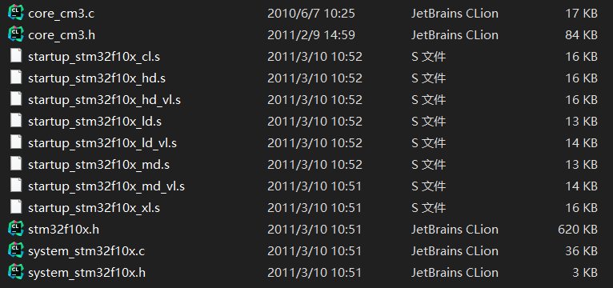

**3、添加启动组：**修改工程里的组，组名为Start，然后添加已存在文件：

从工程下的Start目录下添加那个后缀为`md.s`的启动文件，然后再把里面全部的.c、.h文件添加进去。


**4、添加包含路径：**

打开`Project  ===>  Options for Target ...`，选中`C/C++`后找到`Include Paths`，然后点击`Include Paths`那行末尾的`...`按钮，然后在打开的页面中点击第一个`New`按钮后再点击出现的`...`按钮并选中工程目录下的Start目录，OKOK，添加完成。

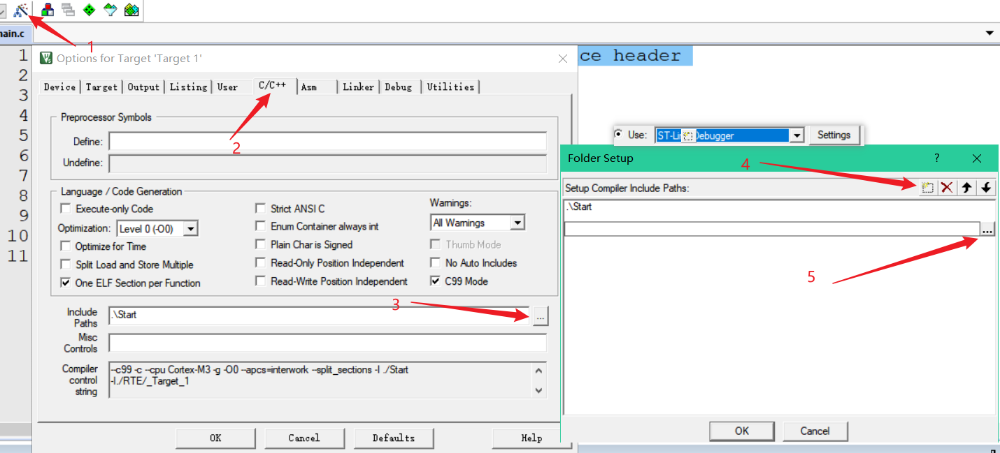

**5、新建User目录：**工程目录下新建一个User目录用来存放我们的开发代码；创建main.c文件并放到User目录下。

main.c文件如下，而且后面必须加上一行空行，否则会包警告！

```c
#include "stm32f10x.h"                  // Device header
int main(void)
{

	while(1){
	
	}

}

```

**6、工程设置：**打开`Project  ===>  Options for Target ...`，选中`Debug`后找到`Use`并找到`ST-Link Debugger`选上，然后在`Use`栏的最右边点击`Settings`按钮，在打开的面板中选中`Flash Download`，如何找到`Reset and Run`并选上，OKOK。


**7、测试：**寄存器方式点亮PC13的灯：

```c
#include "stm32f10x.h"                  // Device header
int main(void)
{
	RCC->APB2ENR = 0x00000010;
	GPIOC->CRH = 0x00300000;
	GPIOC->ODR = 0X00000000;
	while(1){
	}
}

```

如上main.c文件，编译，插入ST-Link连接上STM32，然后选择LOAD：（程序载入完成就能发现PC13的灯亮起来了）


**8、为工程添加库函数：**

首先在工程目录下创建`Library`目录，然后添加以下文件进去：

- 将`STM32F10x_StdPeriph_Lib_V3.5.0\Libraries\STM32F10x_StdPeriph_Driver\src`目录下的所有文件拷贝到`Library`目录中。（`ctrl + a`可以快速全选）
- 将`STM32F10x_StdPeriph_Lib_V3.5.0\Libraries\STM32F10x_StdPeriph_Driver\inc`目录下的所有文件拷贝到`Library`目录中。

然后在项目里添加`Library`组，再将项目下的Library目录里的文件都添加进这个组。

最后将`Library`目录添加进包含目录，步骤参考第4步的操作。

**9、添加用户开发目录-User 必须文件：**

`STM32F10x_StdPeriph_Lib_V3.5.0\Project\STM32F10x_StdPeriph_Template`目录下有这几个文件：`stm32f10x_conf.h`、`stm32f10x_it.c`、`stm32f10x_it.h`、`system_stm32f10x.c`，第一个是用来为配置库函数头文件的包含关系的，第二第三个是存放中断函数的，最后一个是关于参数检测的函数定义的，我们需要将前三个都拷贝进User目录，然后在项目里将其添加进`User`组。

User目录也要添加进包含目录，参考第四步操作。

**10、添加宏定义：**

打开`#include "stm32f10x.h"`文件文档，将宏定义`USE_STDPERIPH_DRIVER`添加进`C/C++`的定义中：

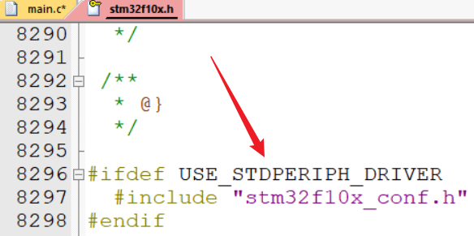


**11、测试：**使用库函数操作点亮PC13的灯：

```c
#include "stm32f10x.h"                  // Device header
int main(void)
{
	RCC_APB2PeriphClockCmd(RCC_APB2Periph_GPIOC,ENABLE);
	GPIO_InitTypeDef GPIO_InitStructure;
	GPIO_InitStructure.GPIO_Mode = GPIO_Mode_Out_PP;
	GPIO_InitStructure.GPIO_Pin = GPIO_Pin_13;
	GPIO_InitStructure.GPIO_Speed = GPIO_Speed_50MHz;
	GPIO_Init(GPIOC,&GPIO_InitStructure);
	//GPIO_SetBits(GPIOC,GPIO_Pin_13); // 关闭P13的灯
	GPIO_ResetBits(GPIOC,GPIO_Pin_13); // 点亮P13的灯
	while(1){
	}
}

```

新建工程步骤总结：

1. 建立工程文件夹，Keil中新建工程，选择型号。
2. 工程文件夹里建立Start、Library、User等文件夹，复制固件库里面的文件到工程文件夹。
3. 工程里对应建立Start、Library、User等同名称的分组，然后将文件夹内的文件添加到工程分组里。
4. 工程选项，C/C++，Include Paths内声明所有包含头文件的文件夹。
5. 工程选项，C/C++，Define内定义USE_STDPERIPH_DRIVER（使用标准外设驱动）。
6. 工程选项，Debug，下拉列表选择对应调试器，Settings，Flash Download 里勾选 Reset and Run。

STM32F10X_MD的字符串keil5会自动帮声明。

## 关于启动文件


# GPIO

GPIO（General Purpose Input Output）通用输入输出口：

- 可配置为8种输入输出模式。
- 输出模式下可控制端口输出高低电平，用以驱动LED、控制蜂鸣器、模拟通信协议输出时序等。
- 输入模式下可读取端口的高低电平或电压，用于读取按键输入、外接模块电平信号输入、ADC电压采集、模拟通信协议接收数据等。
- STM32引脚电平：0V~3.3V，部分引脚可容忍5V。

GPIO结构：


## GPIO输入电路

根据数据手册中列出的每个I/O端口的特定硬件特征， GPIO端口的每个位可以由软件分别配置成多种模式。

1. 输入浮空、输入上拉、输入下拉、模拟输入
2.  开漏输出、推挽式输出、 推挽式复用功能、开漏复用功能  

GPIO输入输出电路框图如下，上面是输入电路，下面是输出电路。


**1、保护二极管：**VDD接3.3V，Vss接0V，当输入电压高于3.3V，那么上方的保护二极管就会导通，输入电压产生的电流就会直接流入VDD而不会流入内部电路； 如果输入电压低于Vss（相当于Vss，会有负电压），下发的保护二极管就会导通，电流从Vss直接流出去而不会从内部电路汲取电流， 从而保护内部电路。

**2、上拉电阻、下拉电阻：**上、下拉电阻的开关可以通过程序控制；如果上面导通、下面断开——上拉输入模式；下面导通、上面断开——下拉输入模式；两个都断开——浮空输入模式。（上下拉电阻阻值一般都比较大，是弱上拉或弱下拉，目的是尽量不影响输入操作）

1. 上下拉电阻的作用：给输入提供一个默认的输入电平，为什么要提供默认的输入电平呢？因为对于一个数字的端口，输入不是高电平就是低电平，那如果输入引脚啥都不接，端口算高电平还是低电平呢？实际中，输入啥都不接，即输入处于一种浮空状态，引脚的电平就容易受到外界的干扰而改变，为了避免引脚悬空导致的输入数据不稳定，就加上上拉或下拉电阻。
2. 上拉输入模式：VDD=3.3 V，高电平，即默认输入为高电平。
3. 下拉输入模式：Vss=0V，低电平，即默认输入为低电平。	

**3、TTL肖特基触发器（实际是一种施密特触发器）：**对输入电压进行整型，如果输入电压大于某一阈值，输出就会瞬间升为高电平，低于某一阈值输出就会瞬间降为低电平。（作用：有效避免因信号波动造成的输出抖动现象）

**4、写入：**整形后波形直接写入输入数据寄存器，使用程序读取输入数据寄存器对应的某一位数据就可以知道端口的电平。

**5、模拟输入：**连接到ADC上的，因为ADC需要接收模拟量，所以接到施密特触发器前面。

**6、复用功能输入：**连接到其它需要读取端口的外设上，比如串口输入引脚，因为接收的是数字量所以接到触发器后面以便接收到整形后的。

## GPIO输出电路


数字部分由输出数据寄存器或片上外设控制，两种控制方式通过数据选择器接到输出控制部分。

**1、输出数据寄存器：**选择通过输出数据寄存器进行控制，就是普通的IO口输出，写这个数据寄存器的某一位就可以操作对应的某个端口。

**2、位设置/清除寄存器：**用来单独操作输出数据寄存器的某一位而不影响其它位。只设置某一位而不影响其它位的三种方式：

- 一是读出输出数据寄存器再通过按位与或者按位或更改某一位再写回去（麻烦，效率不高，对IO操作不合适）。
- 二是通过设置位设置寄存器，如果需要对某一位进行置1操作，就可以在这个寄存器的对应位写1即可，剩下不需要操作的位就写0，这样内部就会有电路自动将输出数据寄存器中对应位置置1，与0对应的保持不变；对某一位清0则是在位清除寄存器对应的对应位写1。
- 三是通过读写STM32中的“位带”区域，位带的作用金额51单片机的位寻址差不多，STM32中专门分配一段地址区域，这段地址区域映射了RAM和外设寄存器所有的位。

**3、MOS管（一种电子开关）：**通过信号控制开关的导通与关闭，开关负责将IO口接到VDD或VSS。

1. 推挽输出模式——P-MOS、N-MOS均有效：数据寄存器为1时，上管导通、下管断开，输出直接接到VDD，输出高电平；为0时，上断开下导通，输出接到VSS，输出低电平。这种模式下，输出高低电平都有较强的驱动能力，因此这种模式也叫做强推输出模式，而且该模式下STM32对IO口有绝对控制权，高低电平都由STM32决定。
2. 开漏输出模式——只有N-MOS有效：数据寄存器为1时，下管断开，输出相当于断开（高阻模式）；为0时，下管导通，输出低电平。这种模式下低电平有驱动能力，高电平没有，可以作为通信协议的驱动方式（比如I2C通信的引脚就使用这种模式） ，多机通信的情况下，这个模式可以避免各个设备互相干扰；还可以输出5V的电平信号，比如在IO口外接一个上拉电阻到5V电源，当N-MOS导通时时直接输出低电平，断开时就可以通过外部的上拉电阻拉高至5V，输出5V的电平信号，从而兼容一些5V电平的设备。
3. 关闭输出模式——P-MOS、N-MOS均无效：当引脚配置为输入模式的时候，这两个管无效，即关闭了输出模式，端口电平由外部信号来控制。

## GPIO模式


## GPIO函数原型

**1、外设时钟控制的函数原型：** STM外设正常工作的前提是使能（启用）了相应的外设，有的外设需要使能1个、有的则需要使能2个或3个时钟才能正常工作。（注意复位是通过改变外设的复位寄存器来实现复位功能的，不会去改变外设的时钟状态）

使能（enable）与失能（disable）：enable—启用，disable—禁用；翻译为使能与失能的，也可以这么去理解，使能够——使某个功能起作用，失能——使失去能力，使某个功能不起作用。（PS：明显启用、禁用更好理解）

函数原型定义在`stm32f10x_rcc.h`，RCC的库函数最重要的是以下三个：

```c
/* 第一个参数用来选择外设，第二个参数用来选择使能或失能 */
// RCC AHB   
void RCC_AHBPeriphClockCmd(uint32_t RCC_AHBPeriph, FunctionalState NewState);
// RCC APB2 
void RCC_APB2PeriphClockCmd(uint32_t RCC_APB2Periph, FunctionalState NewState);
// RCC APB1  
void RCC_APB1PeriphClockCmd(uint32_t RCC_APB1Periph, FunctionalState NewState);
```

**2、GPIO初始化函数原型：**

函数原型定义：stm32f10x_gpio.h；函数具体实现：stm32f10x_gpio.c。

```c
void GPIO_DeInit(GPIO_TypeDef* GPIOx);  // 用来复位指定GPIO外设
void GPIO_AFIODeInit(void);  // 复位AFIO外设
// 初始化GPIO口，使用其需先定义一个结构体，给结构体赋值后再调用该函数
void GPIO_Init(GPIO_TypeDef* GPIOx, GPIO_InitTypeDef* GPIO_InitStruct); 
// 把结构体变量赋一个默认值
void GPIO_StructInit(GPIO_InitTypeDef* GPIO_InitStruct);
```

**3、GPIO读写功能的函数原型：**

函数原型定义：stm32f10x_gpio.h；函数具体实现：stm32f10x_gpio.c。

```c
/* GPIO_TypeDef* GPIOx——选择外设  uint16_t GPIO_Pin——选择io口  */
// 读，读取输入
uint8_t GPIO_ReadInputDataBit(GPIO_TypeDef* GPIOx, uint16_t GPIO_Pin); 
uint16_t GPIO_ReadInputData(GPIO_TypeDef* GPIOx); 
uint8_t GPIO_ReadOutputDataBit(GPIO_TypeDef* GPIOx, uint16_t GPIO_Pin); 
uint16_t GPIO_ReadOutputData(GPIO_TypeDef* GPIOx); 
// 写，输出
void GPIO_SetBits(GPIO_TypeDef* GPIOx, uint16_t GPIO_Pin);  // 置1
void GPIO_ResetBits(GPIO_TypeDef* GPIOx, uint16_t GPIO_Pin); // 置0
void GPIO_WriteBit(GPIO_TypeDef* GPIOx, uint16_t GPIO_Pin, BitAction BitVal); // 写某位
void GPIO_Write(GPIO_TypeDef* GPIOx, uint16_t PortVal); // 全输出
```

**4、常用参数说明：**

结构体——GPIO_InitTypeDef：

```c
typedef struct
{
  uint16_t GPIO_Pin;            // GPIO引脚的Pin值
  GPIOSpeed_TypeDef GPIO_Speed; // GPIO输出速度
  GPIOMode_TypeDef GPIO_Mode;   // GPIO工作模式 
}GPIO_InitTypeDef;
```

枚举——GPIOMode_TypeDef：GPIO的八种工作模式（对应上面结构体的GPIO_Mode）

```c
typedef enum{ 
  GPIO_Mode_AIN = 0x0,  // Analog In，模拟输入
  GPIO_Mode_IN_FLOATING = 0x04, // floating 浮空
  GPIO_Mode_IPD = 0x28,  // in pull down 下拉输入
  GPIO_Mode_IPU = 0x48,  // in pull up 上拉输入
    
  GPIO_Mode_Out_OD = 0x14, // out open drain 开漏输出
  GPIO_Mode_Out_PP = 0x10, // out push pull 推挽输出
  GPIO_Mode_AF_OD = 0x1C,  // ATL open drain 复用开漏输出
  GPIO_Mode_AF_PP = 0x18   // atl push pull 复用推挽输出
}GPIOMode_TypeDef;
```

GPIO引脚的宏定义：（对应上面结构体的GPIO_Pin）

```c
#define GPIO_Pin_0                 ((uint16_t)0x0001)  /*!< Pin 0 selected */
#define GPIO_Pin_1                 ((uint16_t)0x0002)  /*!< Pin 1 selected */
#define GPIO_Pin_2                 ((uint16_t)0x0004)  /*!< Pin 2 selected */
#define GPIO_Pin_3                 ((uint16_t)0x0008)  /*!< Pin 3 selected */
#define GPIO_Pin_4                 ((uint16_t)0x0010)  /*!< Pin 4 selected */
#define GPIO_Pin_5                 ((uint16_t)0x0020)  /*!< Pin 5 selected */
#define GPIO_Pin_6                 ((uint16_t)0x0040)  /*!< Pin 6 selected */
#define GPIO_Pin_7                 ((uint16_t)0x0080)  /*!< Pin 7 selected */
#define GPIO_Pin_8                 ((uint16_t)0x0100)  /*!< Pin 8 selected */
#define GPIO_Pin_9                 ((uint16_t)0x0200)  /*!< Pin 9 selected */
#define GPIO_Pin_10                ((uint16_t)0x0400)  /*!< Pin 10 selected */
#define GPIO_Pin_11                ((uint16_t)0x0800)  /*!< Pin 11 selected */
#define GPIO_Pin_12                ((uint16_t)0x1000)  /*!< Pin 12 selected */
#define GPIO_Pin_13                ((uint16_t)0x2000)  /*!< Pin 13 selected */
#define GPIO_Pin_14                ((uint16_t)0x4000)  /*!< Pin 14 selected */
#define GPIO_Pin_15                ((uint16_t)0x8000)  /*!< Pin 15 selected */
#define GPIO_Pin_All               ((uint16_t)0xFFFF)  /*!< All pins selected */
```

GPIO输出速度：（对应上面结构体的GPIO_Speed）

```c
typedef enum
{ 
  GPIO_Speed_10MHz = 1,
  GPIO_Speed_2MHz, 
  GPIO_Speed_50MHz    //  50MHz
}GPIOSpeed_TypeDef;
```


## GPIO输出操作

使用库函数进行GPIO输出操作的三步骤：1、启用外设时钟；2、GPIO的初始化，启用满足需要的GPIO输出模式；3、使用输出函数进行操作。

```c
int main(void){
	// 1.使用RCC开启GPIO的时钟
	RCC_APB2PeriphClockCmd(RCC_APB2Periph_GPIOC,ENABLE);
	// 2.1 结构体，选择初始化GPIO的一些参数
	GPIO_InitTypeDef GPIO_InitStructure;
	GPIO_InitStructure.GPIO_Mode = GPIO_Mode_Out_PP;
	GPIO_InitStructure.GPIO_Pin = GPIO_Pin_13;
	GPIO_InitStructure.GPIO_Speed = GPIO_Speed_50MHz;
	// 2.2 初始化
	GPIO_Init(GPIOC,&GPIO_InitStructure);
	// 3.使用输出函数控制GPIO口输出
	//GPIO_SetBits(GPIOC,GPIO_Pin_13); // 置1，高电平
	GPIO_ResetBits(GPIOC,GPIO_Pin_13); // 置0，低电平
	while(1)
	{
		
	}
}

```

标准库函数使用说明：打出函数的名称然后将鼠标光标定位到该函数名，右键转到函数定义的地方，然后看函数说明，根据需求选择形参即可。（可以`Ctrl + F`来选择某个参数的定义（宏、结构体等））


## GPIO输入操作

使用库函数读取输入的三步骤：1、启用外设时钟；2、GPIO的初始化，启用满足需要的GPIO输入模式；3、使用读取函数进行操作。

```c
/* GPIO_TypeDef* GPIOx——选择外设  uint16_t GPIO_Pin——选择io口  */
// 读取，返回代表高低电平的数
// 读取输入寄存器某一位
uint8_t GPIO_ReadInputDataBit(GPIO_TypeDef* GPIOx, uint16_t GPIO_Pin); 
// 读取整个输入寄存器
uint16_t GPIO_ReadInputData(GPIO_TypeDef* GPIOx);
// 读取输出数据寄存器某一位
uint8_t GPIO_ReadOutputDataBit(GPIO_TypeDef* GPIOx, uint16_t GPIO_Pin);
// 读取整个输出数据寄存器
uint16_t GPIO_ReadOutputData(GPIO_TypeDef* GPIOx);
```

后两个读取输出数据寄存器的，严格来说不是读取输入的函数。

```c
int main(void){
	// 1.使用RCC开启GPIO的时钟
	RCC_APB2PeriphClockCmd(RCC_APB2Periph_GPIOB,ENABLE);
	// 2.1 结构体，选择初始化GPIO的一些参数
	GPIO_InitTypeDef GPIO_InitStructure;
	GPIO_InitStructure.GPIO_Mode = GPIO_Mode_IPD;
	GPIO_InitStructure.GPIO_Pin = GPIO_Pin_13;
	GPIO_InitStructure.GPIO_Speed = GPIO_Speed_50MHz;
	// 2.2 初始化
	GPIO_Init(GPIOB,&GPIO_InitStructure);
	// 3.使用读取函数读取IO口输入的数据
	//GPIO_ReadInputDataBit(GPIOB,GPIO_Pin_13); // 读取某一位
	//GPIO_ReadInputData(GPIOB,GPIO_Pin_13);    // 读取全部
	while(1)
	{
		
	}
}

```


## C


51中int是16位存储，STM32中int是32位存储。建议使用stdint.h提供的。

# 中断

## 概述

**中断：**在主程序运行过程中，出现了特定的中断触发条件（中断源），使得CPU暂停当前正在运行的程序，转而去处理中断程序，处理完成后又返回原来被暂停的位置继续运行。（中断过程：中断触发后，CPU停止执行当前程序转而去处理事件，待处理完毕返回到原来被中断的地方继续执行。）

**中断源：**请示CPU中断的请求源。

中断服务程序：中断触发后交由CPU执行的程序。

**中断优先级：**当有多个中断源的时候，CPU根据中断的级别来决定优先响应的中断源。

中断嵌套：一个中断服务程序中有比其更高优先级的中断源，触发这个中断源请求后将去处理这个高优先级的中断服务程序再返回处理低优先级的中断服务程序。多级中断系统，单级中断系统——有无中断嵌套功能。

STM32F1的中断：

- **最多68个可屏蔽中断通道（中断源），包含EXTI、TIM、ADC、USART、SPI、I2C、RTC等多个外设。**
- 中断响应优先级管理：使用**NVIC统一管理中断（分配优先级）**，每个中断通道都拥有**16个可编程的优先等级**，可对优先级进行分组，进一步设置抢占优先级和响应优先级。

中断向量表：由于硬件限制，中断跳转只能调到指定的地址来指向中断服务程序，为了能让硬件跳到一个不固定的中断函数里，就需要在内存中定义一个地址的列表，这些地址列表是固定的。当中断发生后会跳转到这些固定的位置，然后由编译器在这些固定位置加上一条跳转到中断函数的代码，这样就可以使中断跳转跳到任何位置。**这些在内存中的固定的地址列表就叫中断向量表**，相当于跳到中断函数的一个跳板。

## NVIC


NVIC（Nested Vectored Interrupt Controller）——  内嵌向量中断控制器。

NVIC 优先级分组：抢占优先级（可中断中断来优先执行的中断级别，用于中断嵌套）、响应优先级（优先执行的中断级别，相当于插队，不能通过中断中断来优先执行，比抢占式级别低）。

优先级控制，通过优先寄存器的4位决定。**在程序中，选择好了优先级分组方式后便可设置优先级级别**（具体操作见EXTI—使用）。通过4位来决定两种优先级，每一种的优先级分组方式不同，优先级取值范围也就不同，如下：


中断响应顺序：抢占优先级  >   响应优先级 ，抢占优先级和响应优先级均相同的按中断号（默认优先级）进行排队。

# EXTI

## EXTI结构

**1、EXTI（Extern Interrupt）——  外部中断：**

**外部中断过程：**当GPIO产生电平变化时触发外部中断，外部中断先由NVIC进行裁决后中断CPU主程序，然后CPU执行相应的中断处理程序。（所有的GPIO口都可以触发，只不过相同GPIO_Pin的GPIO口不能同时触发中断，比如PA0、PB0的Pin一样不能同时触发中断，只能选择其中的一个作为中断触发引脚）

**外部中断支持的触发方式：**上升沿、下降沿、双边沿、软件触发。

**外部中断占用的通道数：**16个GPIO_Pin（每个Pin端口对应一个中断通道），外加PVD输出、RTC闹钟、USB唤醒、以太网唤醒，总共20个中断线路。（后四个是来“蹭网”的，蹭外部中断的一个功能——从低功耗模式的停止模式下唤醒STM32；例如对于PVD电源电压检测，当电源从电压过低恢复时就需要借助外部中断退出停止模式；对于RTC闹钟来说，有时为了省电，RTC定一个闹钟后STM32会进入停止模式，等闹钟响的时候再唤醒，这时候就需要借助外部中断，其它类似。）

**中断触发后的响应方式：**中断响应（就是请求中断再由CPU执行中断处理函数）、事件响应（STM32对外部中断增加的额外功能，可以通过选择触发一个事件来触发其它外设操作；事件响应不会去请求CPU处理中断，属于外设之间的联合工作）。

**2、外部中断的结构：**

外部中断总流程框图：（Pin5-9共用一个中断通道，Pin10-15共用一个中断通道）

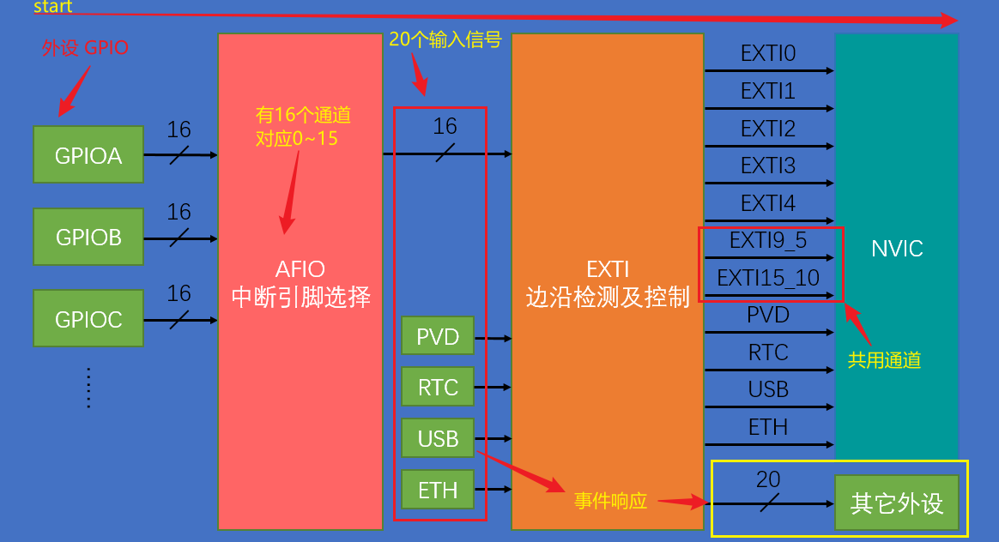

AFIO（Alternate function I/O alternate）—— 备用功能IO口：将IO口连接到EXTI的通道，主要功能是**复用功能引脚**和用于**中断引脚选择**。（相同的Pin的IO口，通过AFIO选择后，只有一个能接到外部中断的通道上，因此相同的Pin的IO口不能同时触发中断）。AFIO 内部结构框图如下：


 EXTI 内部结构框图如下：


1. 20根输入线进入边缘检测电路。（可以选择上升沿触发、下降沿触发）
2. 软件中断事件寄存器——实现软件触发中断。
3. 请求挂起寄存器，相当于一个中断标志位，通过读取这个寄存器判断是哪个通道触发的中断。
4. 中断屏蔽寄存器，用于屏蔽中断，当输出0时就屏蔽调中断信号。
5. 事件屏蔽寄存器，用于屏蔽事件响应。
6. 脉冲发生器，用于触发其它外设的动作。
7. 外设接口和APB总线，可以通过总线访问寄存器。

**3、什么情况下使用外部中断：**

1. 外部触发的突发事件，需要及时读取信号的。（比如旋转编码器、红外遥控接收头的输出信号需要及时读取）
2. 按键也是外部触发的突然事件，但不建议使用外部中断读取按键，在外部中断中不好处理按键抖动、松手检测等问题，而且按键的输出波形也不是转瞬即逝的，因此要求不高时可以主循环读取，不想用主循环读取，那么可以考虑定时器中断读取，这样可以很好地处理按键抖动和松手检测问题也不会阻塞主程序。

旋转编码器：**用来测量位置、速度或旋转方向的装置**，当其旋转轴旋转时，其输出端可以输出与旋转速度和方向对应的方波信号，读取方波信号的频率和相位信息即可得知旋转轴的速度和方向。类型有：机械触点式、霍尔传感器式、光栅式（只能测速度和位置）。

## EXTI使用

外部中断的使用分为两步：一是配置外部中断；二是定义中断程序（中断函数）。

### 一些库函数原型说明

AFIO的库函数和GPIO的库函数在同一个文件里。AFIO的函数原型说明  stm32f10x_gpio.h ：

```c
void GPIO_AFIODeInit(void); // 复位AFIO外设
// 锁定GPIO配置，防止意外更改   （了解）
void GPIO_PinLockConfig(GPIO_TypeDef* GPIOx, uint16_t GPIO_Pin); 
// 配置AFIO的事件输出功能       （了解）
void GPIO_EventOutputConfig(uint8_t GPIO_PortSource, uint8_t GPIO_PinSource);
void GPIO_EventOutputCmd(FunctionalState NewState);
// 引脚重映射  参数为：(重映射方式，新的状态) 
void GPIO_PinRemapConfig(uint32_t GPIO_Remap, FunctionalState NewState);
// 配置AFIO的数据选择器
void GPIO_EXTILineConfig(uint8_t GPIO_PortSource, uint8_t GPIO_PinSource);
// 以太网有关的
void GPIO_ETH_MediaInterfaceConfig(uint32_t GPIO_ETH_MediaInterface);
```

EXTI的函数原型说明  stm32f10x_exti.h ：

```c
// 复位，将EXTI的配置清除，恢复到上电的状态
void EXTI_DeInit(void);
// 根据结构体里面指定的参数初始化EXTI，用法和GPIO_Init类似
void EXTI_Init(EXTI_InitTypeDef* EXTI_InitStruct);
// 结构体初始化，为传入的EXTI_InitTypeDef类型的结构体赋一个默认值
void EXTI_StructInit(EXTI_InitTypeDef* EXTI_InitStruct);
// 软件触发外部中断，调用函数，参数为一个中断线，就能软件触发一次这个外部中断
void EXTI_GenerateSWInterrupt(uint32_t EXTI_Line);


/* 操作状态寄存器的标志位的函数 */
// 程序里使用，查看指定标志位是否置1，
FlagStatus EXTI_GetFlagStatus(uint32_t EXTI_Line);
// 程序里使用，对置1的标志位清零
void EXTI_ClearFlag(uint32_t EXTI_Line);
// 中断函数里使用，查看中断标志位是否被置1
ITStatus EXTI_GetITStatus(uint32_t EXTI_Line);
// 中断函数里使用，清除中断挂起标志位
void EXTI_ClearITPendingBit(uint32_t EXTI_Line);
```

NVIC的库函数原型说明  misc.h ：

```c
// 中断分组，参数为中断分组方式
void NVIC_PriorityGroupConfig(uint32_t NVIC_PriorityGroup);
// 根据结构体里面指定的参数初始化NVIC
void NVIC_Init(NVIC_InitTypeDef* NVIC_InitStruct);
```

```c
// 设置中断向量表    （了解）
void NVIC_SetVectorTable(uint32_t NVIC_VectTab, uint32_t Offset);
// 系统低功耗配置    （了解）
void NVIC_SystemLPConfig(uint8_t LowPowerMode, FunctionalState NewState);
// 系统滴答时钟
void SysTick_CLKSourceConfig(uint32_t SysTick_CLKSource);
```


### 1、外部中断的配置：


外部中断整体结构图如上，简单来说使用外部中断就是配置好资源，将上面的外设GPIO到NVIC的通道打通。具体步骤：

- 第一步：配置RCC，把涉及的外设的时钟都打开。（外设的时钟打开了才能使外设工作，EXTI和NVIC的时钟默认一直开启）
- 第二步：配置GPIO，设置目标端口为输入模式。
- 第三步：配置AFIO，选择使用的GPIO端口以便连接到EXTI。
- 第四步：配置EXTI，选择触发方式——上升沿、下降沿、双边沿，选择触发响应方式——中断响应、事件响应。
- 第五步：配置NVIC，给中断选择合适的优先级。

配置示例，使用GPIOB的14端口：

```c
void GPIOB14_EXTI_Init(void){
    /* 第一步：打开使用的外设的时钟 EXTI、NVIC这两个外设的时钟默认一直开启的不需要再配置*/
    RCC_APB2PeriphClockCmd(RCC_APB2Periph_GPIOB, ENABLE);
    RCC_APB2PeriphClockCmd(RCC_APB2Periph_AFIO, ENABLE);
    /* 第二步：根据结构体里面指定的参数初始化GPIO */
    GPIO_InitTypeDef GPIO_InitStructure;
    GPIO_InitStructure.GPIO_Mode = GPIO_Mode_IPU;
    GPIO_InitStructure.GPIO_Pin = GPIO_Pin_14;
    GPIO_InitStructure.GPIO_Speed = GPIO_Speed_50MHz;
    GPIO_Init(GPIOB, &GPIO_InitStructure);
    /* 第三步：  配置AFIO，接上GPIO */
	GPIO_EXTILineConfig(GPIO_PortSourceGPIOB, GPIO_PinSource14);
    /* 第四步：根据结构体里面指定的参数初始化EXTI */
    EXTI_InitTypeDef EXTI_InitStruct;
    EXTI_InitStruct.EXTI_Line = EXTI_Line14;  //  选择14通道，接上AFIO
    EXTI_InitStruct.EXTI_LineCmd = ENABLE;    //  开启
    EXTI_InitStruct.EXTI_Mode = EXTI_Mode_Interrupt; // 中断响应
    EXTI_InitStruct.EXTI_Trigger = EXTI_Trigger_Falling; // 下降沿触发
    EXTI_Init(&EXTI_InitStruct);
    /* 第五步：NVIC配置 */
    // 1.分组方式整个芯片只能使用一种，因此每一个项目只设置一次就行了
    // 如果将分组放到模块里，那么所有模块的分组都应保持一致；直接放在主函数里设置分组就行了
    NVIC_PriorityGroupConfig(NVIC_PriorityGroup_2);
    // 2.根据结构体里面指定的参数初始化NVIC
    NVIC_InitTypeDef NVIC_InitStruct;
    NVIC_InitStruct.NVIC_IRQChannel = EXTI15_10_IRQn;   //  选择中断通道，接上EXTI
    NVIC_InitStruct.NVIC_IRQChannelCmd = ENABLE;        //  开启所选中断通道
    NVIC_InitStruct.NVIC_IRQChannelPreemptionPriority = 1; // 抢占优先级
    NVIC_InitStruct.NVIC_IRQChannelSubPriority = 1;        // 响应优先级
    NVIC_Init(&NVIC_InitStruct);
}
```


### 2、定义中断程序：

STM32中，中断函数的名字是固定的，每个中断通道都对应一个中断函数，可在 startup_stm32f10x_md.s里查看。


```c
void EXTI15_10_IRQHandler(void)
{
	// 14的中断标志位为1，表示14通道的中断进来了
	if(EXTI_GetITStatus(EXTI_Line14) == SET){
        
        
        
        
		// 只要中断标志位置1了程序就会跳转到中断函数
		// 如果不对中断标志位清0，就会导致一直申请中断
		EXTI_ClearITPendingBit(EXTI_Line14);
	}
}
```

中断函数编写建议：

1. 中断函数里，最好不要执行耗时过长的代码，中断函数要简短快速，不要刚进中断就执行一个Delay多少毫秒的代码。
2. 最好不要在中断函数和主函数调用相同的一个函数或者操作同一个硬件。

# 定时器

TIM（Timer）—— 定时器：对输入的时钟进行计数，并在计数值达到设定值时触发中断。

STM32的定时器包含16位计数器、预分频器、自动重装寄存器的时基单元，**在72MHz计数时钟下可以实现最大59.65s的定时**。（`中断频率=72M/65535/65535`（时钟频率/分频系数/计数值n=计数n次的频率，倒数即可得到计数n次的时间），中断频率的倒数即为59.65）

STM32的定时器功能：不仅具备基本的**定时中断功能**，而且还包含**内外时钟源选择、输入捕获、输出比较、编码器接口、主从触发模式（主模式、从模式、触发模式）**等多种功能。	

STM32的定时器分类：根据复杂度和应用场景分为了高级定时器、通用定时器、基本定时器三种类型。


## 定时器结构

**1、基本定时器的结构框图：**

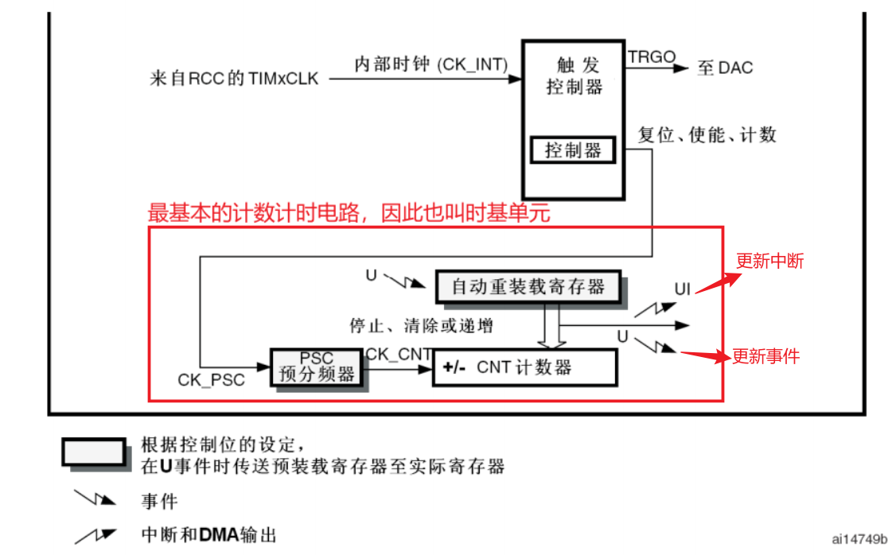

1、来自RCC的TIMxCLK的内部时钟，频率值一般是系统的主频 72MHz，因此通向时基单元的计数基准频率为72MHz。

2、预分频器：对72MHz的计数时钟进行分频，如果预分频器写1那就是2分频，`输出频率=输入频率/实际分频系数=72MHz / 2=36MHZ`（实际分频系数=预分频器的值 + 1）。预分频器是16位，因此最大值为65535，即最大为65536分频。

3、计数器：对预分频器后的时钟进行计数，计数时钟每来一个上升沿计数器就加1；计数器也是16位，因此最大从0加到65535，当自增运行到目标值时就触发中断。

4、因为计数器的值加到最大后会从0开始继续加，不断自增运行，因此需要自动重装载寄存器，它也是16位的，用于存储我们写入计数器的计数目标，自动重装值是固定的目标，当计数值等于自动重装值时，就会触发中断并且清零计数器。（计数值等于自动重装值产生的中断，我们一般称之为更新中断）

5、更新中断通往NVIC，再配置好NVIC的定时器通道，定时器的更新中断就能得到CPU响应。

主模式触发DAC的功能（STM32的一大特色功能）：让内部硬件在不受程序的控制下实现自动运行。（掌握好这项功能的运用，在某些场景下可以极大地减轻CPU的负担）

- 使用DAC输出波形，通常思路是使用定时器中断，每隔一段时间在定时器中断程序中用代码手动触发DAC转换，然后DAC输出。缺点：主程序会频繁处于中断状态，影响主程序的运行和其它中断。
- 主模式：使用主模式，可以将定时器的更新事件映射到触发输出TRGO（Trigger Out）的位置，然后TRGO直接接到DAC的触发转换引脚上，这样只需要在定时器把更新事件通过主模式映射到TRG0，然后TRGO就可直接去触发DAC。

**2、通用定时器结构框图：**

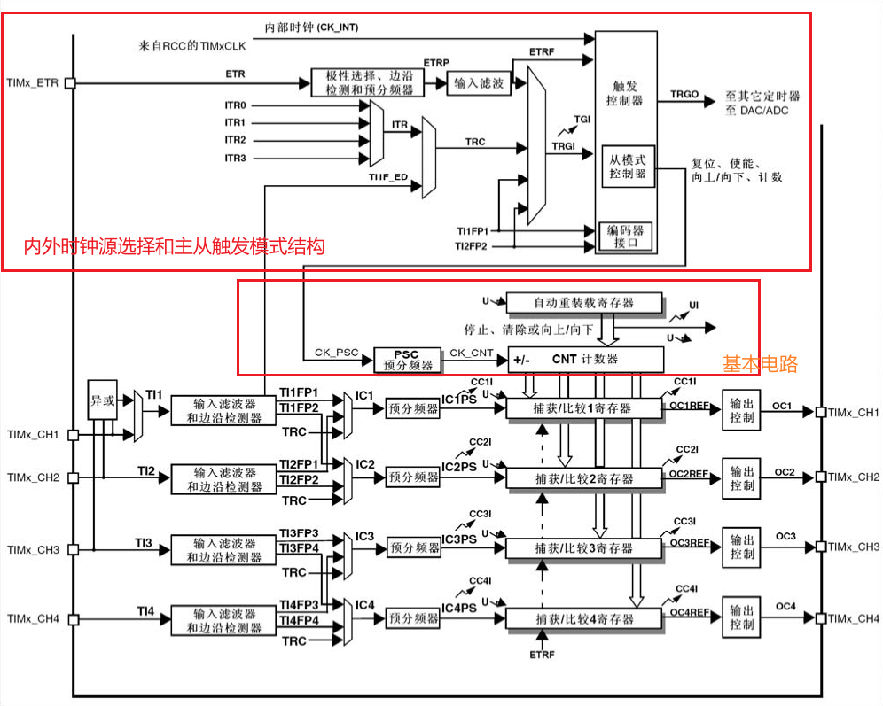

通用定时器和高级定时器支持三种计数模式：向上计算、向下计数、中央对齐。

1、时钟源：可以选择内部的72MHz时钟，也可以选择来自TIMx_ETR引脚（复用了PA0引脚）上的外部时钟。

2、TIMx_ETR引脚（复用了PA0引脚）上接入外部时钟：输入信号经极性选择、边沿检测和预分配器后再滤波，然后接入触发控制器作为定时器的输入时钟。（这一路也叫“外部时钟模式2”）

3、TRGI（Trigger Input）也可以提供时钟：主要用作触发输入，可以触发定时器的从模式。触发输入作为外部时钟时，这一路就叫做“外部时钟1”，这时可以实现定时器的级联。外部时钟1的时钟五个来源，如下：

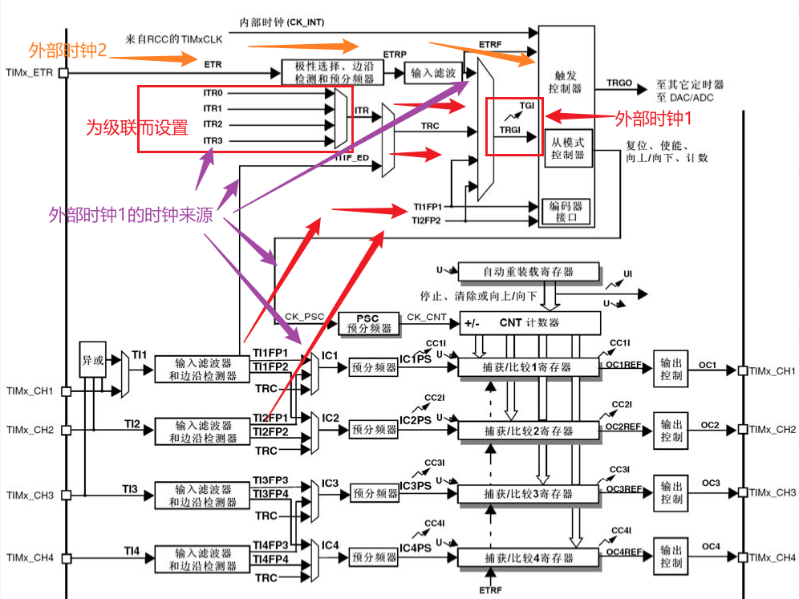

4、最常用的时钟还是内部时钟；如果需要使用外部时钟，首选ETR引脚外部时钟模式2的输入，简单、直接。

5、编码器接口：读取正交编码器的输出波形。

6、主模式触发DAC的功能：也是TRGO那，只需要在定时器把更新事件通过主模式映射到TRG0，然后TRGO就可直接去触发DAC。

**3、输入输出电路：**

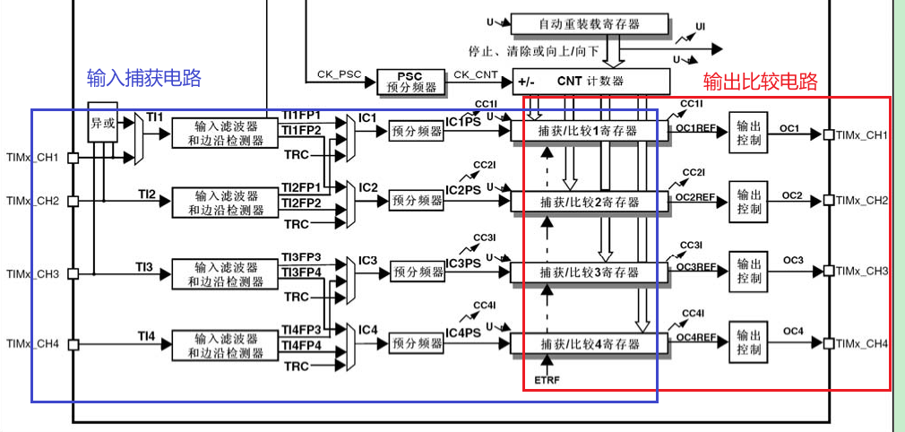

左边是输入捕获电路，可用于测输入方波的频率；右边是输出比较电路，可用于输出PUM波形，驱动电机等；两者共用中间的寄存器。

**4、高级定时器结构框图：**


1、重复次数计数器：用于实现每隔几个计算周期才发生一次更新事件或更新中断。（就相当于对输出的更新信号再进行了一次分频，乘以65535，提升了很多定时时间）

2、DTG（Dead Time Generate）—— 死区生成电路，的输出引脚由一个变为了两个互补的输出，可以输出一对互补的PWM波，这些电路是为了驱动三相无刷电机的（三相无刷电机，常用于四轴飞行器、电动车后轮、电钻等，因为三相无刷电机的驱动电路一般需要三个桥臂，每个桥臂要用2个大功率开关管来控制，总共需要6个大功率开关管来控制，所以这里的输出PWM引脚的前三路就变为了互补的输出，而第四路没什么变化，因为三相电机只需要三路就行了；另外为了防止互补输出的PWM驱动桥臂时在开关切换的瞬间由于器件的不理想造成短暂的直通现象，所以前面加上了死区生成电路，在开关切换的瞬间产生一定时长的死区，让桥臂的上下管全部关断，防止直通现象）。

3、刹车输入功能，为了给电机驱动提供安全保障的，如果外部引脚 TIMx_BKIN（break in）产生了刹车信号或者内部时钟失效产生了故障，那么控制电路就会自动切断电机的输出，防止意外发生。


## 定时中断结构

定时中断基本结构图：

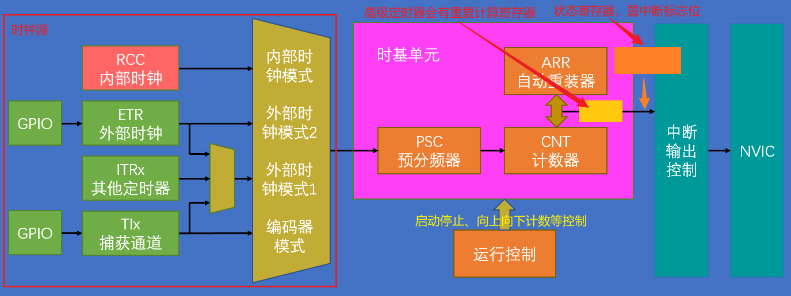

## 定时器时序

看不懂w(ﾟДﾟ)w，学习数电，自己设计一个计数器。


## 定时中断使用

### 1、外部中断配置

1. 第一步：RCC开启定时器时钟，打开后定时器的基准时钟和整个外设的工作时钟都会同时打开。
2. 第二步：选择时钟源。
3. 第三步：配置时基单元，包括预分频器、自动重装器、计数模式等。
4. 第四步：配置输出中断控制，允许更新中断输出到NVIC。
5. 第五步：在NVIC中打开定时器中断的通道，并分配一个优先级。
6. 第六步：运行。

```c
void Timer_Init(void)
{
    /* 第一步：RCC开启时钟 */
	RCC_APB1PeriphClockCmd(RCC_APB1Periph_TIM2,ENABLE);
	/* 第二步：选择时钟源 */
	TIM_InternalClockConfig(TIM2); // 定时器默认使用内部时钟，可以不写
	/* 第三步：配置时基单元 */
	TIM_TimeBaseInitTypeDef TIM_TimeBaseInitStructure;
	TIM_TimeBaseInitStructure.TIM_ClockDivision = TIM_CKD_DIV1;
	TIM_TimeBaseInitStructure.TIM_CounterMode = TIM_CounterMode_Up;
	TIM_TimeBaseInitStructure.TIM_Period = 10000 - 1;
	TIM_TimeBaseInitStructure.TIM_Prescaler = 7200 - 1;
	TIM_TimeBaseInitStructure.TIM_RepetitionCounter = 0;
	TIM_TimeBaseInit(TIM2, &TIM_TimeBaseInitStructure);
	/* 第四步：配置输出中断控制 */
	TIM_ClearFlag(TIM2,TIM_IT_Update); // 避免刚初始化就进中断
	TIM_ITConfig(TIM2,TIM_IT_Update,ENABLE);
	
	/* 第五步：NVIC配置 */
    NVIC_PriorityGroupConfig(NVIC_PriorityGroup_2);
    // 根据结构体里面指定的参数初始化NVIC
    NVIC_InitTypeDef NVIC_InitStructure;
    NVIC_InitStructure.NVIC_IRQChannel = TIM2_IRQn;   //  选择通道
    NVIC_InitStructure.NVIC_IRQChannelCmd = ENABLE;        // 启用
    NVIC_InitStructure.NVIC_IRQChannelPreemptionPriority = 2; // 抢占优先级
    NVIC_InitStructure.NVIC_IRQChannelSubPriority = 1;        // 响应优先级
    NVIC_Init(&NVIC_InitStructure);
	/* 第六步：运行 */
	TIM_Cmd(TIM2,ENABLE);  // 启动定时器
}
```


### 函数原型说明

函数说明   stm32f10x_tim.h ：

```c
// 复位
void TIM_DeInit(TIM_TypeDef* TIMx);
// 1.时基单元初始化，根据结构体里面指定的参数来初始化，参数1为某个定时器
void TIM_TimeBaseInit(TIM_TypeDef* TIMx, TIM_TimeBaseInitTypeDef* TIM_TimeBaseInitStruct);
// 为传入的结构体变量赋默认值
void TIM_TimeBaseStructInit(TIM_TimeBaseInitTypeDef* TIM_TimeBaseInitStruct);
// 2.定时器运行控制，参数1选择定时器，参数2选择启用还是禁用
void TIM_Cmd(TIM_TypeDef* TIMx, FunctionalState NewState);
// 3.中断输出控制，使能中断输出信号，参数1选择定时器，参数2选择配置哪个中断输出，参数3使能还是失能
void TIM_ITConfig(TIM_TypeDef* TIMx, uint16_t TIM_IT, FunctionalState NewState);
```

时基单元的时钟选择函数： 

```c
// 选择内部时钟
void TIM_InternalClockConfig(TIM_TypeDef* TIMx);
// 选择ITRx其它定时器的时钟，参数1-选择要配置的定时器，参数2-选择要接入哪个其它的定时器
void TIM_ITRxExternalClockConfig(TIM_TypeDef* TIMx, uint16_t TIM_InputTriggerSource);
// 选择TIx捕获通道的时钟，参数1-选择要配置的定时器，参数2-选择TIx具体的引脚，参数3-输入的极性，参数4-滤波器
void TIM_TIxExternalClockConfig(TIM_TypeDef* TIMx, uint16_t TIM_TIxExternalCLKSource,
                                uint16_t TIM_ICPolarity, uint16_t ICFilter);
// 选择ETR通过外部时钟模式1输入的时钟，参数1-外部触发预分频器，参数2-极性，参数3-滤波器
void TIM_ETRClockMode1Config(TIM_TypeDef* TIMx, uint16_t TIM_ExtTRGPrescaler, uint16_t TIM_ExtTRGPolarity,
                             uint16_t ExtTRGFilter);
// 选择ETR通过外部时钟模式2输入的时钟
void TIM_ETRClockMode2Config(TIM_TypeDef* TIMx, uint16_t TIM_ExtTRGPrescaler, 
                             uint16_t TIM_ExtTRGPolarity, uint16_t ExtTRGFilter);
// 单独用来配置ETR引脚的预分频器、极性、滤波器这些参数的
void TIM_ETRConfig(TIM_TypeDef* TIMx, uint16_t TIM_ExtTRGPrescaler, uint16_t TIM_ExtTRGPolarity,
                   uint16_t ExtTRGFilter);
```

一些单独的函数，用于更改一些参数：

```c
// 单独写预分频值的，参数1-写入的预分频值，参数2-写入模式
void TIM_PrescalerConfig(TIM_TypeDef* TIMx, uint16_t Prescaler, uint16_t TIM_PSCReloadMode);
// 改变计数器的计数模式，参数2-选择新的计数器模式，
void TIM_CounterModeConfig(TIM_TypeDef* TIMx, uint16_t TIM_CounterMode);
// 自动重装器预装功能配置，
void TIM_ARRPreloadConfig(TIM_TypeDef* TIMx, FunctionalState NewState);
// 给计数器写入一个值
void TIM_SetCounter(TIM_TypeDef* TIMx, uint16_t Counter);
// 给自动重装器写入一个值
void TIM_SetAutoreload(TIM_TypeDef* TIMx, uint16_t Autoreload);
// 获取当前计数器的值
uint16_t TIM_GetCounter(TIM_TypeDef* TIMx);
// 获取当前的预分频器的值
uint16_t TIM_GetPrescaler(TIM_TypeDef* TIMx);
```

操作标志位寄存器的函数：

```c
/* 获取和清除标志位，前两个程序中使用，后两个中断处理程序中使用 */
FlagStatus TIM_GetFlagStatus(TIM_TypeDef* TIMx, uint16_t TIM_FLAG);
void TIM_ClearFlag(TIM_TypeDef* TIMx, uint16_t TIM_FLAG);
ITStatus TIM_GetITStatus(TIM_TypeDef* TIMx, uint16_t TIM_IT);
void TIM_ClearITPendingBit(TIM_TypeDef* TIMx, uint16_t TIM_IT);
```

### 2、中断函数定义

```c
void TIM2_IRQHandler(void)
{
	if(TIM_GetITStatus(TIM2,TIM_IT_Update) == SET){

		TIM_ClearITPendingBit(TIM2,TIM_IT_Update);
	}

}
```

### 3、使用外部时钟

如果使用外部时钟——以外部时钟模式2为例：

```c
// 初始化时钟输入的IO口
GPIO_InitTypeDef GPIO_InitStructure;
GPIO_InitStructure.GPIO_Mode = GPIO_Mode_IPU;
GPIO_InitStructure.GPIO_Pin = GPIO_Pin_0;
GPIO_InitStructure.GPIO_Speed = GPIO_Speed_50MHz;
GPIO_Init(GPIOA,&GPIO_InitStructure);
// 设置外部时钟模式2
TIM_ETRClockMode2Config(TIM2,TIM_ExtTRGPSC_OFF,TIM_ExtTRGPolarity_Inverted,0x00);
```

## 输出比较功能

**OC（Output Compare）输出比较：**输出比较可以通过比较CNT与CCR寄存器值的关系，来对输出电平进行置1、置0或翻转的操作，用于输出一定频率和占空比的PWM波形。（主要用于输出PWM波形的，PWM波形是驱动电机的必要条件，智能车、机器人项目等）

- 每个高级定时器和通用定时器都拥有4个输出比较通道，高级定时器的前3个通道额外拥有死区生成和互补输出的功能。

- STM32F103C8T6只有一个高级定时器——TIM1，三个通用定时器——TIM2、TIM3、TIM4。


**PWM（Pulse Width Modulation）脉冲宽度调制：**

- PWM波形是一个数字输出信号，由高低电平组成。在具有惯性的系统中，可以通过对一系列脉冲的宽度进行调制，来等效地获得所需要的模拟参量，常应用于电机控速等领域。（实现等效模拟信号输出）
- PWM基本思想：例如让LED不断点亮、熄灭、点亮、熄灭，当这个频率足够大时LED就不会闪烁了，而是呈现一个中等亮度，当我们调控点亮、熄灭的时间比例时，就可以让LED呈现出不同的亮度级别。对于电机调速，我们以一个很快的频率给电机通电、断电、通电、断电，那么电机速度就能维持一个中等速度。（应用于惯性系统）

- **PWM参数：**高低电平变换周期 $T_s = T_{ON} + T_{OFF}$ 、频率 = $1 / T_S$   、  占空比 = $T_{ON} / T_s$   、   分辨率 = 占空比变化步距  。

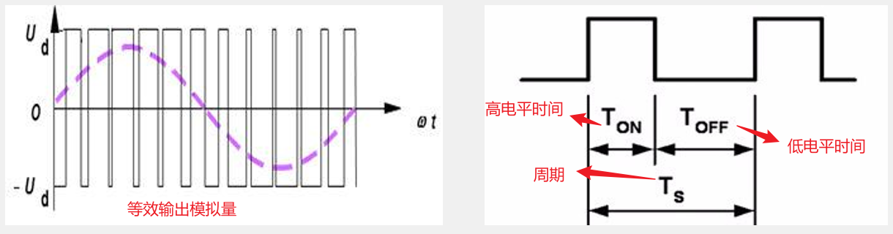

### 输出比较电路

1、通用定时器的输出比较电路：


1. 计数器CNT和CCR1捕获寄存器进行比较后输出一个信号给输出模式控制器，然后这个控制器就会改变输出OC1REF的高低电平。
2. 可以将REF信号映射到主模式的TRGO输出上去。
3. 极性选择寄存器，给这个寄存器写0就是不翻转，写1就是翻转。	
4. 输出使能电路，选择要不要输出。

2、输出比较模式：

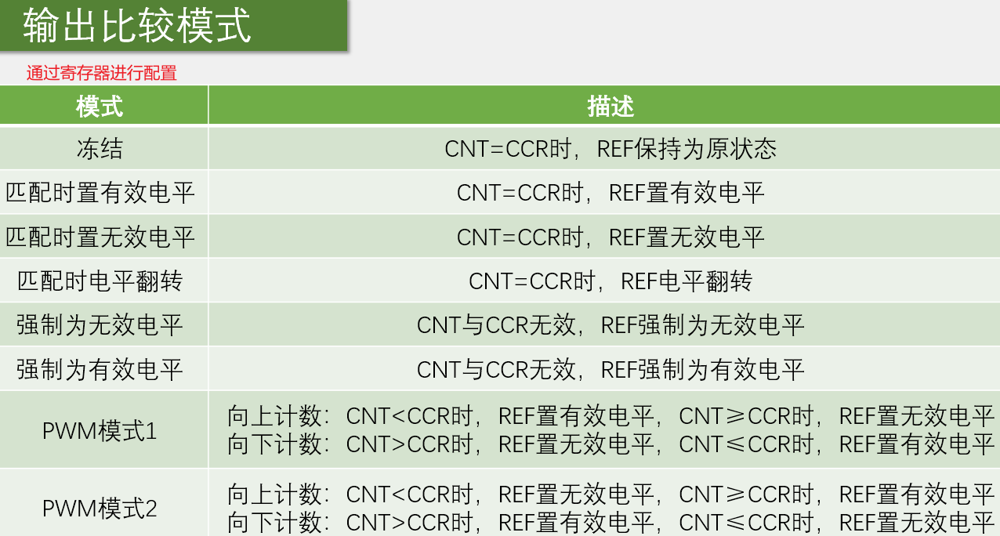

1. 冻结模式，输出维持原状态。
2. 有效电平、无效电平：可以先简单理解为高电平、低电平。
3. PWM模式，主要使用的模式。

3、PWM基本结构：


通过改变CCR的值，就可以改变周期内高低电平的占比。

4、PWM相关参数的计算：


PWM频率为`时钟周期 / (PSC+1) / (ARR+1)`。内部时钟周期为72MHz。

高级定时器的输出比较电路：（了解一下，P15——14min）


### 输出PWM波形


使用定时器输出比较功能输出PWM波形的步骤：

1. 第一步：RCC开启时钟，把要使用的TIM外设、GPIO外设的时钟打开，把输出PWM波形的GPIO口设置为复用推挽输出。
2. 第二步：时钟源选择。
3. 第三步：配置时基单元。
4. 第四步：配置输出比较单元，包括CCR的值、输出比较模式、极性选择、输出使能。
5. 第五步：启动计数器。

```c
void PWM_Init(void)
{
    // 第一步
	RCC_APB1PeriphClockCmd(RCC_APB1Periph_TIM2,ENABLE);
	RCC_APB2PeriphClockCmd(RCC_APB2Periph_GPIOA,ENABLE);
	GPIO_InitTypeDef GPIO_InitStructure;
	GPIO_InitStructure.GPIO_Mode = GPIO_Mode_AF_PP; // 复用推挽输出
	GPIO_InitStructure.GPIO_Pin = GPIO_Pin_0;
	GPIO_InitStructure.GPIO_Speed = GPIO_Speed_50MHz;
	GPIO_Init(GPIOA,&GPIO_InitStructure);
	// 第二步
	TIM_InternalClockConfig(TIM2);
	// 第三步
	TIM_TimeBaseInitTypeDef TIM_TimeBaseInitStructure;
	TIM_TimeBaseInitStructure.TIM_ClockDivision = TIM_CKD_DIV1;
	TIM_TimeBaseInitStructure.TIM_CounterMode = TIM_CounterMode_Up;
	TIM_TimeBaseInitStructure.TIM_Period = 100 - 1;   // ARR
	TIM_TimeBaseInitStructure.TIM_Prescaler = 720 - 1; // PSC
	TIM_TimeBaseInitStructure.TIM_RepetitionCounter = 0;
	TIM_TimeBaseInit(TIM2, &TIM_TimeBaseInitStructure);
	// 第四步
	TIM_OCInitTypeDef TIM_OCInitStructure;
	TIM_OCStructInit(&TIM_OCInitStructure);
	TIM_OCInitStructure.TIM_OCMode = TIM_OCMode_PWM1;
	TIM_OCInitStructure.TIM_OCPolarity = TIM_OCPolarity_High;
	TIM_OCInitStructure.TIM_OutputState = TIM_OutputState_Enable;
	TIM_OCInitStructure.TIM_Pulse = 0;  // CCR
	TIM_OC1Init(TIM2, &TIM_OCInitStructure);
	// 第五步
	TIM_Cmd(TIM2,ENABLE);	
}
```

关于引脚重映射的使用（引脚定义表——TIM2_CH1可以从PA0挪到PA15的引脚上，通过AFIO实现引脚重映射）：

```c
// 1.打开AFIO时钟
RCC_APB2PeriphClockCmd(RCC_APB2Periph_AFIO,ENABLE);
// 2.使用AFIO重映射外设复用的引脚
GPIO_PinRemapConfig(GPIO_PartialRemap1_TIM2,ENABLE);
// 3.如果重映射的引脚正好也是调试端口，解除调试端口
// 可能会关闭了调试通道，会导致ST-Link使用不来了，谨慎使用解除调试端口
GPIO_PinRemapConfig(GPIO_Remap_SWJ_JTAGDisable,ENABLE);
```


### 函数原型说明

```c
/* 配置输出比较单元，四个输出比较单元 */
void TIM_OC1Init(TIM_TypeDef* TIMx, TIM_OCInitTypeDef* TIM_OCInitStruct);
void TIM_OC2Init(TIM_TypeDef* TIMx, TIM_OCInitTypeDef* TIM_OCInitStruct);
void TIM_OC3Init(TIM_TypeDef* TIMx, TIM_OCInitTypeDef* TIM_OCInitStruct);
void TIM_OC4Init(TIM_TypeDef* TIMx, TIM_OCInitTypeDef* TIM_OCInitStruct);
```

```c
/* 给结构体设置默认值 */
void TIM_OCStructInit(TIM_OCInitTypeDef* TIM_OCInitStruct);
```

```c
/* 单独修改CCR寄存器值的函数，重要，需要掌握 */
void TIM_SetCompare1(TIM_TypeDef* TIMx, uint16_t Compare1);
void TIM_SetCompare2(TIM_TypeDef* TIMx, uint16_t Compare2);
void TIM_SetCompare3(TIM_TypeDef* TIMx, uint16_t Compare3);
void TIM_SetCompare4(TIM_TypeDef* TIMx, uint16_t Compare4);
```

了解：

```c
/* 配置强制输出模式  （了解） */
void TIM_ForcedOC1Config(TIM_TypeDef* TIMx, uint16_t TIM_ForcedAction);
void TIM_ForcedOC2Config(TIM_TypeDef* TIMx, uint16_t TIM_ForcedAction);
void TIM_ForcedOC3Config(TIM_TypeDef* TIMx, uint16_t TIM_ForcedAction);
void TIM_ForcedOC4Config(TIM_TypeDef* TIMx, uint16_t TIM_ForcedAction);
```

```c
/* 配置CCR寄存器的预装功能  （了解） */
void TIM_OC1PreloadConfig(TIM_TypeDef* TIMx, uint16_t TIM_OCPreload);
void TIM_OC2PreloadConfig(TIM_TypeDef* TIMx, uint16_t TIM_OCPreload);
void TIM_OC3PreloadConfig(TIM_TypeDef* TIMx, uint16_t TIM_OCPreload);
void TIM_OC4PreloadConfig(TIM_TypeDef* TIMx, uint16_t TIM_OCPreload);
/* 配置快速使能  （了解） */
void TIM_OC1FastConfig(TIM_TypeDef* TIMx, uint16_t TIM_OCFast);
void TIM_OC2FastConfig(TIM_TypeDef* TIMx, uint16_t TIM_OCFast);
void TIM_OC3FastConfig(TIM_TypeDef* TIMx, uint16_t TIM_OCFast);
void TIM_OC4FastConfig(TIM_TypeDef* TIMx, uint16_t TIM_OCFast);
```

```c
/* 清除REF （了解） */
void TIM_ClearOC1Ref(TIM_TypeDef* TIMx, uint16_t TIM_OCClear);
void TIM_ClearOC2Ref(TIM_TypeDef* TIMx, uint16_t TIM_OCClear);
void TIM_ClearOC3Ref(TIM_TypeDef* TIMx, uint16_t TIM_OCClear);
void TIM_ClearOC4Ref(TIM_TypeDef* TIMx, uint16_t TIM_OCClear);
```

```c
/* 输出极性设置，使用单独一个函数来进行设置   */
void TIM_OC1PolarityConfig(TIM_TypeDef* TIMx, uint16_t TIM_OCPolarity);
void TIM_OC1NPolarityConfig(TIM_TypeDef* TIMx, uint16_t TIM_OCNPolarity);
void TIM_OC2PolarityConfig(TIM_TypeDef* TIMx, uint16_t TIM_OCPolarity);
void TIM_OC2NPolarityConfig(TIM_TypeDef* TIMx, uint16_t TIM_OCNPolarity);
void TIM_OC3PolarityConfig(TIM_TypeDef* TIMx, uint16_t TIM_OCPolarity);
void TIM_OC3NPolarityConfig(TIM_TypeDef* TIMx, uint16_t TIM_OCNPolarity);
void TIM_OC4PolarityConfig(TIM_TypeDef* TIMx, uint16_t TIM_OCPolarity);
```

```c
/* 单独修改输出使能的 */
void TIM_CCxCmd(TIM_TypeDef* TIMx, uint16_t TIM_Channel, uint16_t TIM_CCx);
void TIM_CCxNCmd(TIM_TypeDef* TIMx, uint16_t TIM_Channel, uint16_t TIM_CCxN);
```

```c
/* 单独选择输出比较模式 */
void TIM_SelectOCxM(TIM_TypeDef* TIMx, uint16_t TIM_Channel, uint16_t TIM_OCMode);
```

## 输入捕获功能

输入捕获模式下，当通道输入引脚出现指定电平跳变时（上升沿或下降沿），当前CNT的值将被锁存到CCR中（把当前CNT的值读出来写入到CCR中），**可用于测量PWM波形的频率、占空比、脉冲间隔、电平持续时间等参数**。

- 每个高级定时器和通用定时器都拥有4个输入捕获通道。
- 可配置为PWMI模式，同时测量频率和占空比。
- 可配合主从触发模式，实现硬件全自动测量。

频率测量方法：


### 输入捕获电路


1、引脚进入接入三输入的异或门，只要有一个输入有电平翻转时输出引脚就产生一次电平翻转，然后输出信号通过数据选择器到达输入捕获通道1。

2、数据选择器：数据选择器如果选择上面的经异或门的，那输入捕获通道1的输入就是3个引脚的异或值，如果选用下面的一个则是使用自己引脚的。

3、异或门的设置的目的：为无刷电机服务的，无刷电机有三个霍尔传感器检测转子的位置，可以根据转子的位置进行换相，有了这个异或门就可以在前三个通道接上无刷电机的霍尔传感器，然后定时器就可以作为无刷电机的接口定时器去驱动换相电路工作。

4、输入滤波器：对信号进行滤波，避免一些高频的毛刺信号误触发。

5、边沿检测器：高电平触发或低电平触发，当出现指定的电平时边沿检测电路就会触发后续的电路执行动作。

6、两套滤波、边沿检测电路，分别输出TI2FP1、TI2FP2，经极性选择和滤波后输出的TI2FP1进入IC1那个电路，TI2FP2进入IC2那个电路，下面的TI2、TI3、TI4也是同理。为什么要进行信号的交叉连接（TI1的输出可以接到IC2，TI2的输出可以接到IC1）？可能原因：一是可以灵活切换后续捕获电路的输入（比如你一会想通过TI1输入，一会又想通过TI2输入，那么就可以通过输入选择器灵活选择）；而是把一个引脚的输入同时映射到两个捕获单元。

7、TRC信号，定时器的外部时钟信号，也是为了无刷电机的驱动设计的。

8、预分频器：预分频后的触发信号触发捕获电路进行工作，每来一个触发信号CNT的值就向CRR转运一次，转运同时发生捕获事件，这个事件会在状态寄存器置标志位，同时也可以产生中断，如果需要在捕获的时候做一些事就可以开启这个捕获中断。

假设：设置上升沿捕获，每来一个上升沿捕获，那么CNT的值转运一次，CNT计数器由内部标准时钟驱动，所以CNT的数值就可以用来记录两个上升沿之间的时间间隔，也就是一个周期，那么通过这个周期就可计算得到频率。（每次捕获都要把CNT清0，清0可以使用主从触发模式自动完成）（频率测量实现原理）


参考手册 P284-285：

主模式：将定时器内部信号映射到TRGO引脚，用于触发别的外设。

触发源选择：选择从模式的触发信号源。

从模式：接收其它外设信号或者自身外设外的一些信号，用于控制自身定时器的运行。（例如重置定时器）

三个模式对应库函数中的三个函数，配置、调用即可。


### 输入捕获基本结构


注意事项：

1. CNT有上限，最大为65535，如果信号频率太低，CNT计数值可能会溢出。
2. 从模式的触发源只有TF1FP1和TF1FP2。

### PWMI基本结构


PWMI模式（PWM输入模式），使用两个通道同时捕获一个引脚，这样就可以同时测量周期和占空比。TI1FP1通道设置上升沿触发，TI1FP2通道设置下降沿触发，这样CCR1的计数值就是一整个周期的计数值，CCR2就是高电平的计数值，那么占空比 就为`CCR2 / CCR1`。

### 输入捕获—使用

1. 第一步：把GPIO、TIM的时钟打开。
2. 第二步：GPIO初始化，上拉或浮空输入模式。
3. 第三步：配置时基单元。
4. 第四步：配置输入捕获单元。
5. 第五步：选择从模式触发源选择。
6. 第六部：选择从模式触发后执行的操作。
7. 第七步：开启定时器。

示例——使用输入捕获功能测频率：

```c
void IC_Init(void)
{	/* 第一步： */
	RCC_APB1PeriphClockCmd(RCC_APB1Periph_TIM3,ENABLE);
	RCC_APB2PeriphClockCmd(RCC_APB2Periph_GPIOA,ENABLE);
	/* 第二步： */
	GPIO_InitTypeDef GPIO_InitStructure;
	GPIO_InitStructure.GPIO_Mode = GPIO_Mode_IPU;
	GPIO_InitStructure.GPIO_Pin = GPIO_Pin_6;
	GPIO_InitStructure.GPIO_Speed = GPIO_Speed_50MHz;
	GPIO_Init(GPIOA,&GPIO_InitStructure);
	// 配置定时器TIM3的时钟
	TIM_InternalClockConfig(TIM3);
	/* 第三步： */
	TIM_TimeBaseInitTypeDef TIM_TimeBaseInitStructure;
	TIM_TimeBaseInitStructure.TIM_ClockDivision = TIM_CKD_DIV1;
	TIM_TimeBaseInitStructure.TIM_CounterMode = TIM_CounterMode_Up;
	TIM_TimeBaseInitStructure.TIM_Period = 65536 - 1;   // ARR
	TIM_TimeBaseInitStructure.TIM_Prescaler = 72 - 1; // PSC
	TIM_TimeBaseInitStructure.TIM_RepetitionCounter = 0;
	TIM_TimeBaseInit(TIM3, &TIM_TimeBaseInitStructure);
	/* 第四步： */
	TIM_ICInitTypeDef TIM_ICInitStructure;
	TIM_ICInitStructure.TIM_Channel = TIM_Channel_1;
	TIM_ICInitStructure.TIM_ICFilter = 0xF;
	TIM_ICInitStructure.TIM_ICPolarity = TIM_ICPolarity_Rising;
	TIM_ICInitStructure.TIM_ICPrescaler = TIM_ICPSC_DIV1;
	TIM_ICInitStructure.TIM_ICSelection = TIM_ICSelection_DirectTI;
	TIM_ICInit(TIM3, &TIM_ICInitStructure);
	/* 第五步： */
	TIM_SelectInputTrigger(TIM3,TIM_TS_TI1FP1);
	TIM_SelectSlaveMode(TIM3,TIM_SlaveMode_Reset);
	/* 第六步： */
	TIM_Cmd(TIM3,ENABLE);
}
```

示例——使用输入捕获功能测频率、测占空比：使用TIM_PWMIConfig。


### 函数原型说明

```c
// 配置捕获单元，只配置一个捕获通道
void TIM_ICInit(TIM_TypeDef* TIMx, TIM_ICInitTypeDef* TIM_ICInitStruct);
// 初始化捕获单元，可以快速配置两个捕获通道
void TIM_PWMIConfig(TIM_TypeDef* TIMx, TIM_ICInitTypeDef* TIM_ICInitStruct);
// 结构体初始化赋默认值 
void TIM_ICStructInit(TIM_ICInitTypeDef* TIM_ICInitStruct);

```

主模式、从模式、触发模式：

```c
// 选择输入触发源TRGI，从模式触发源选择 
void TIM_SelectInputTrigger(TIM_TypeDef* TIMx, uint16_t TIM_InputTriggerSource);
// 选择输出触发源TRGO，主模式输出的触发源
void TIM_SelectOutputTrigger(TIM_TypeDef* TIMx, uint16_t TIM_TRGOSource);
// 选择从模式
void TIM_SelectSlaveMode(TIM_TypeDef* TIMx, uint16_t TIM_SlaveMode);
```

单独配置通道1、2、3、4的分频器：

```c
void TIM_SetIC1Prescaler(TIM_TypeDef* TIMx, uint16_t TIM_ICPSC);
void TIM_SetIC2Prescaler(TIM_TypeDef* TIMx, uint16_t TIM_ICPSC);
void TIM_SetIC3Prescaler(TIM_TypeDef* TIMx, uint16_t TIM_ICPSC);
void TIM_SetIC4Prescaler(TIM_TypeDef* TIMx, uint16_t TIM_ICPSC);
void TIM_SetClockDivision(TIM_TypeDef* TIMx, uint16_t TIM_CKD);
```

分别读取定时器的四个通道的CCR：

```c
uint16_t TIM_GetCapture1(TIM_TypeDef* TIMx);
uint16_t TIM_GetCapture2(TIM_TypeDef* TIMx);
uint16_t TIM_GetCapture3(TIM_TypeDef* TIMx);
uint16_t TIM_GetCapture4(TIM_TypeDef* TIMx);
```


## TIM编码器接口

Encoder Interface —— 编码器接口：

- 编码器接口可接收增量（正交）编码器的信号，**根据编码器旋转产生的正交信号脉冲，自动控制CNT自增或自减**，从而指示编码器的**位置、旋转方向和旋转速度**。
- **每个高级定时器和通用定时器都拥有1个**编码器接口。（如果一个定时器配置成了编码器，基本上干不了其它活了）
- TIM编码器接口的两个输入引脚借用了输入捕获的通道1和通道2。

编码器：是一种将旋转位移转换成一串数字脉冲信号的旋转式传感器，可把角位移或直线位移转换成电平信号。

正交编码器：

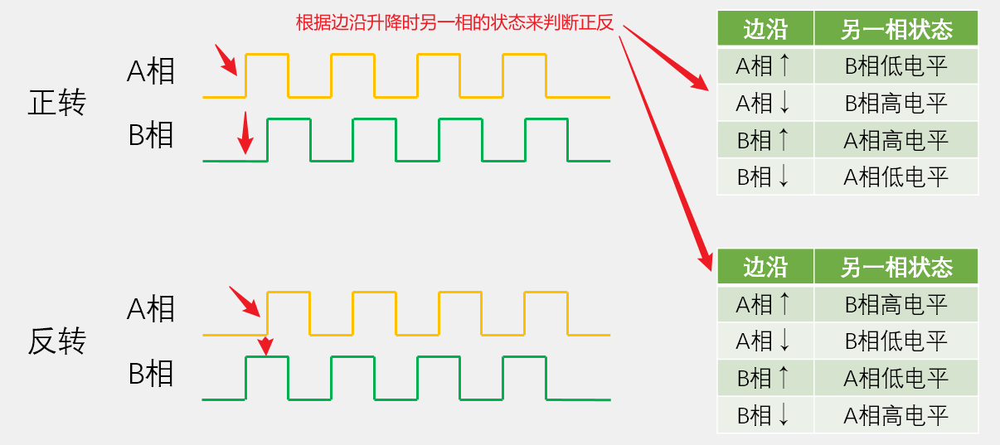

### 编码器接口电路

编码器接口电路的基本结构：

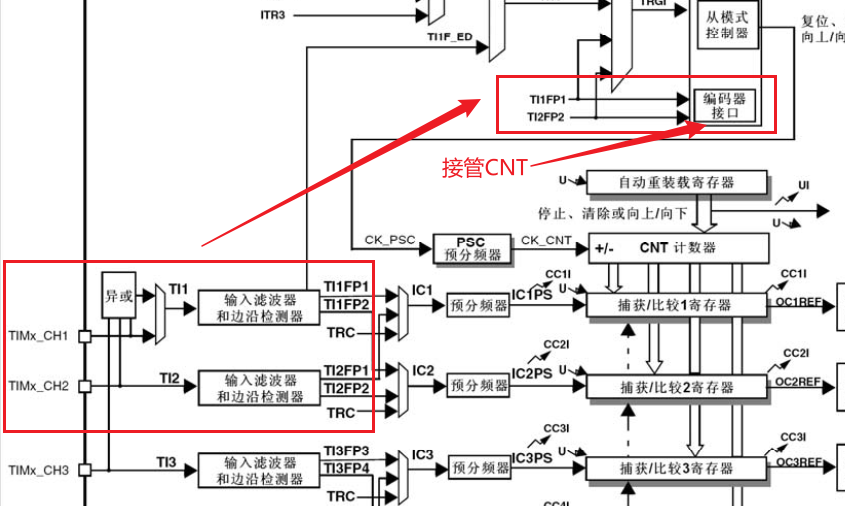

编码器接口托管计数时钟和计数方向，计数器自增自减受编码器接口控制。

### 编码器接口基本结构


编码器接口工作逻辑：

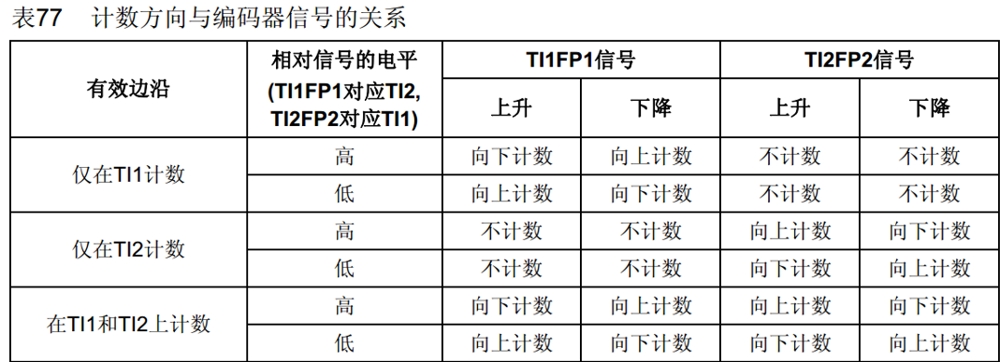

### 编码器接口使用

1. 第一步：开启GPIO和定时器的时钟。
2. 第二步：配置GPIO的输入模式。
3. 第三步：配置时基单元。
4. 第四步：配置输入捕获单元，只配置输入极性和滤波器即可。
5. 第五步：配置编码器接口模式。
6. 第六部：启动定时器。
7. 编码器接口就是一个带方向控制的外部时钟，会托管内部时钟，因此不需要为定时器配置内部时钟。

```c
void Encode_Init(void)
{
    // 第一步
	RCC_APB1PeriphClockCmd(RCC_APB1Periph_TIM3,ENABLE);
	RCC_APB2PeriphClockCmd(RCC_APB2Periph_GPIOA,ENABLE);
	// 第二步
	GPIO_InitTypeDef GPIO_InitStructure;
	GPIO_InitStructure.GPIO_Mode = GPIO_Mode_IPU;
	GPIO_InitStructure.GPIO_Pin = GPIO_Pin_6 | GPIO_Pin_7;
	GPIO_InitStructure.GPIO_Speed = GPIO_Speed_50MHz;
	GPIO_Init(GPIOA,&GPIO_InitStructure);
	
	// 第三步
	TIM_TimeBaseInitTypeDef TIM_TimeBaseInitStructure;
	TIM_TimeBaseInitStructure.TIM_ClockDivision = TIM_CKD_DIV1;
	TIM_TimeBaseInitStructure.TIM_CounterMode = TIM_CounterMode_Up;
	TIM_TimeBaseInitStructure.TIM_Period = 65536 - 1;   // ARR
	TIM_TimeBaseInitStructure.TIM_Prescaler = 1 - 1; // PSC
	TIM_TimeBaseInitStructure.TIM_RepetitionCounter = 0;
	TIM_TimeBaseInit(TIM3, &TIM_TimeBaseInitStructure);
	// 第四步
	TIM_ICInitTypeDef TIM_ICInitStructure;
	TIM_ICStructInit(&TIM_ICInitStructure);
	TIM_ICInitStructure.TIM_Channel = TIM_Channel_1;
	TIM_ICInitStructure.TIM_ICFilter = 0xF;
	TIM_ICInitStructure.TIM_ICPolarity = TIM_ICPolarity_Rising;
	TIM_ICInit(TIM3, &TIM_ICInitStructure);
	TIM_ICInitStructure.TIM_Channel = TIM_Channel_2;
	TIM_ICInitStructure.TIM_ICFilter = 0xF;
	TIM_ICInitStructure.TIM_ICPolarity = TIM_ICPolarity_Rising;
	TIM_ICInit(TIM3, &TIM_ICInitStructure);
	// 第五步
	TIM_EncoderInterfaceConfig(TIM3,TIM_EncoderMode_TI12,TIM_ICPolarity_Rising,TIM_ICPolarity_Rising);
	// 第六步
	TIM_Cmd(TIM3,ENABLE);
}
```


## 函数原型说明

```c
// 定时器编码器接口配置，
// 参数1——定时器，参数2——编码器接口模式，参数3、参数4——通道1、通道2的电平极性
void TIM_EncoderInterfaceConfig(TIM_TypeDef* TIMx, uint16_t TIM_EncoderMode,
                                uint16_t TIM_IC1Polarity, uint16_t TIM_IC2Polarity);
```

# ADC

ADC（Analog-Digital Converter）模拟-数字转换器：

- ADC可以将引脚上连续变化的模拟电压转换为内存中存储的数字变量，建立模拟电路到数字电路的桥梁。（ADC，读取电压，将电压转换为数据并存储到寄存器里）
- 工作模式：12位逐次逼近型ADC，1us转换时间。（分辨率：多少位，12位——`2^12-1`=4095，转换时间（转换频率）——转换开始到产生结果需要1微秒）
- 输入电压范围：0~3.3V，转换结果范围：0~4095。
- ADC有18个输入通道，可测量16个外部和2个内部信号源（内部温度传感器和内部参考电压）。
- STM32 ADC的增强功能：规则组和注入组两个转换单元。（可以列一个组，一次性启动一个组来连续转换多个值。一个是常规使用的规则组，一个是用于突发事件的注入组）
- 模拟看门狗自动监测输入电压范围。
- STM32F103C8T6 ADC资源：ADC1、ADC2，10个外部输入通道。

## ADC原理

逐次逼近型ADC内部结构：（ADC0809芯片）

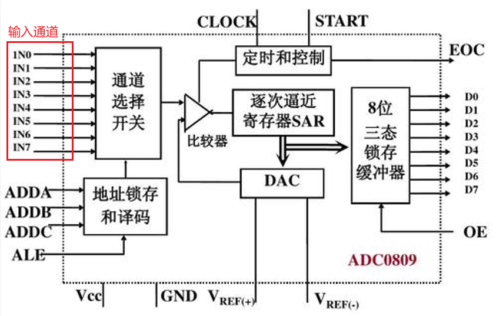

1、通道选择开关：选择一路通道进行处理。

2、地址锁存和译码：用于通道开关选择，将通道号放在ADDA、ADDB、ADDC这三个引脚上，然后给一个锁存信号ALE，就可以使通道开关自动拨好。

3、电压比较器：输入的电压和DAC数模转换器输出的电压进行大小比较判断，如果DAC输出的电压偏大那就调小DAC输出的电压，直到两个比较电压相等。（DAC电压——一般二分法）

STM32  ADC框图：

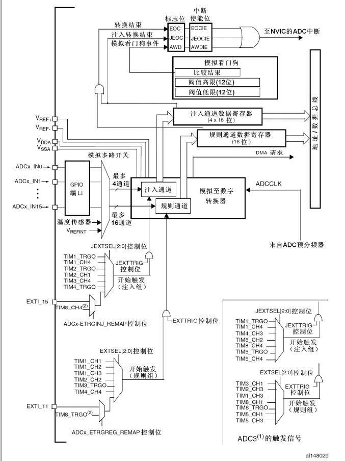

STM32  ADC的主电路框图：

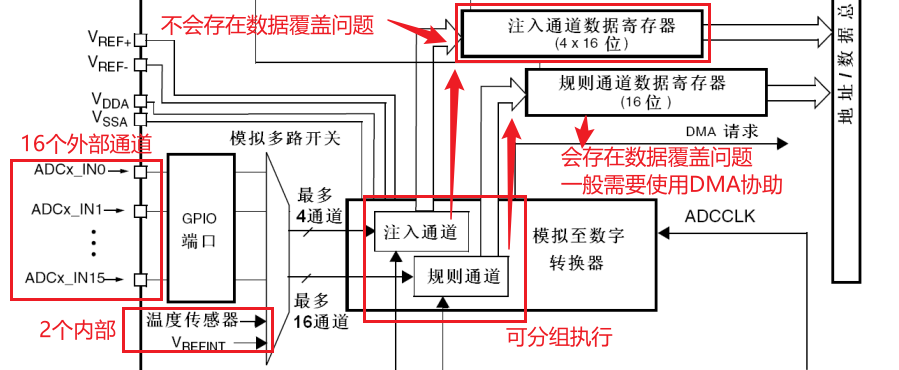

STM32  ADC的外围电路 —— 触发转换部分框图：（触发转换）

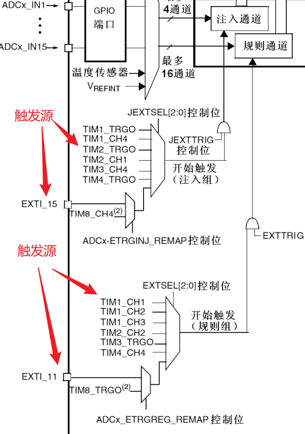

## ADC基本结构

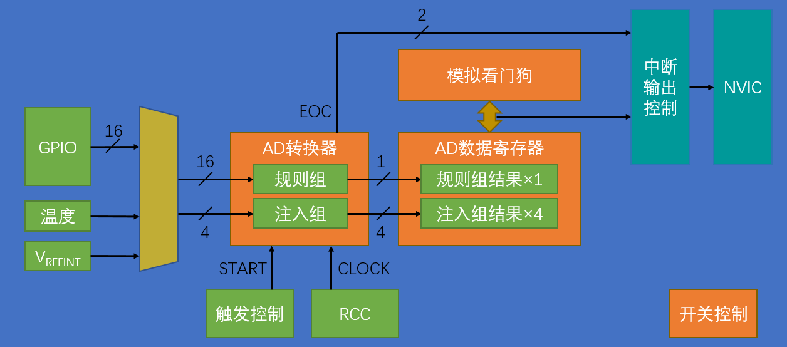

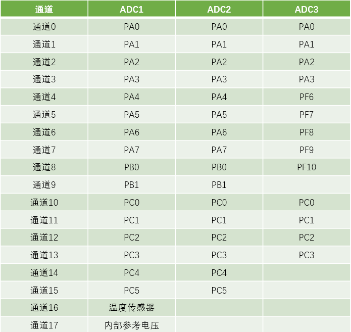

**ADC转换模式：**

1. 单次转换，非扫描模式：只对一个通道进行转换，转换结束后置标志位，如果再想转换需要再次触发。
2. 连续转换，非扫描模式：只对一个通道进行转换，转换结束后置标志位，转发一次转换后会持续转换下去，不需要再次触发。
3. 单次转换，扫描模式：可以对多个通道进行转换，会对通道依次进行转换，而且每个通道转换结束后数据会放到数据寄存器，可能会覆盖前面的数据，因此需要DMA来将数据搬走，全部通道转换结束后置标志位，转换结束，再次转换需要再次触发。
4. 连续转换，扫描模式：不需要再次触发，第一次触发后后续会不断地进行转换。
5. 间断模式：扫描时每隔几个通道转换就暂停一次，需要再次触发才继续。

**ADC触发控制：**（触发源的选择）

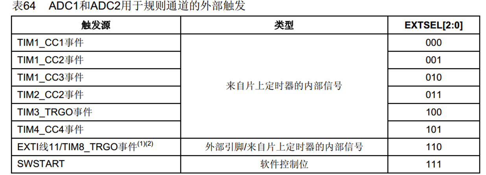

ADC转换时间：

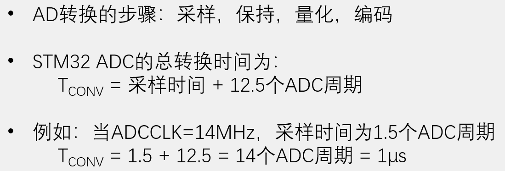

ADC 校准：

- ADC有一个内置自校准模式。校准可大幅减小因内部电容器组的变化而造成的准精度误差。校准期间，在每个电容器上都会计算出一个误差修正码(数字值)，这个码用于消除在随后的转换中每个电容器上产生的误差。
- 建议在每次上电后执行一次校准。
- 启动校准前， ADC必须处于关电状态超过至少两个ADC时钟周期。

## ADC转换模式图解

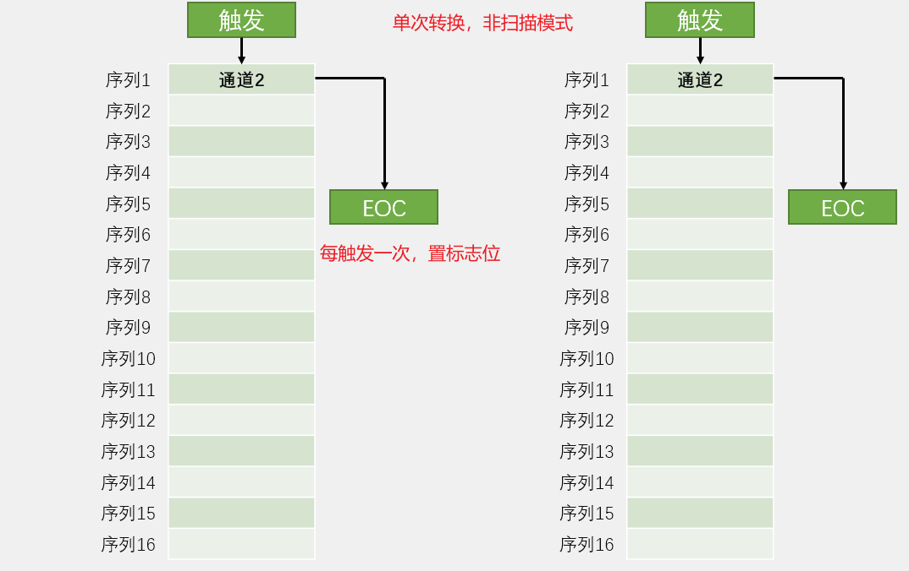

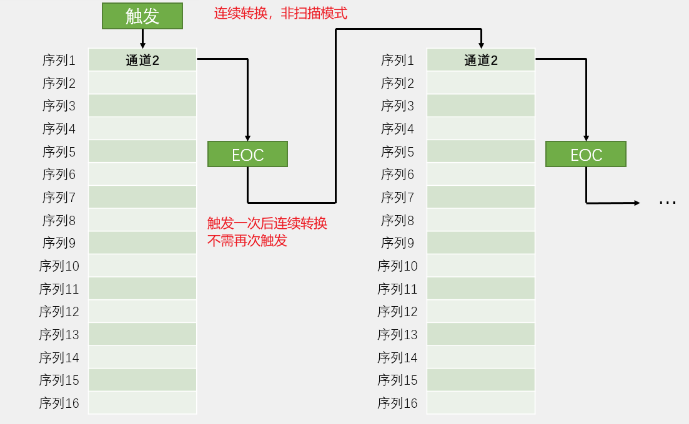

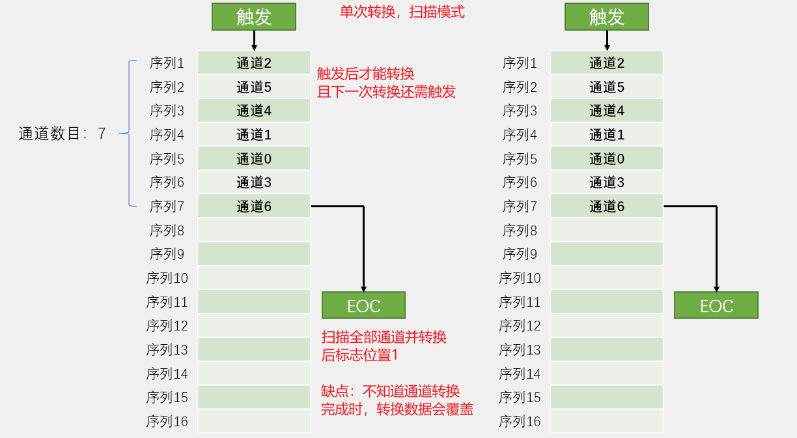

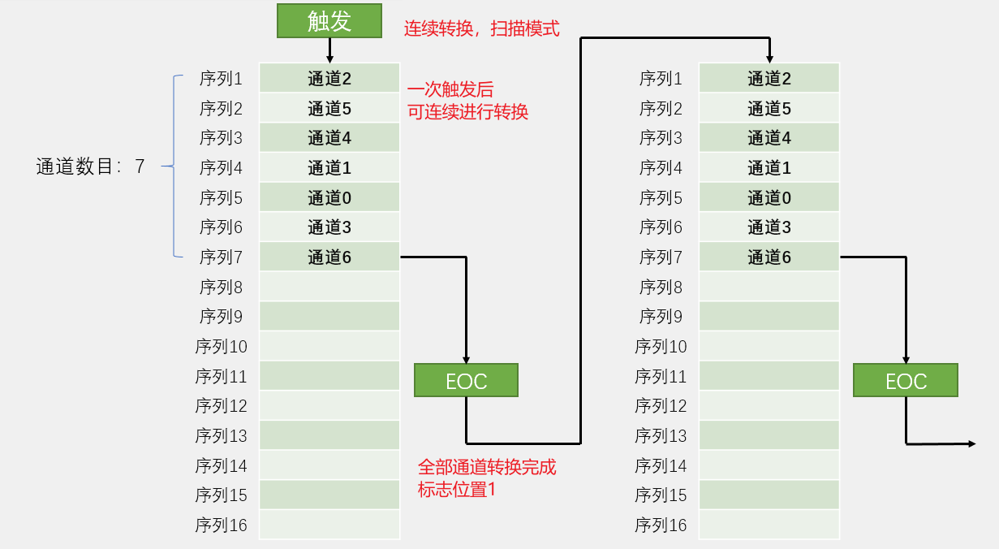


## ADC的使用

1. 第一步：开启ADC和GPIO的时钟，设置ADC的分频器。
2. 第二步：配置GPIO，配置成模拟输出模式。
3. 第三步：配置多路开关，将GPIO口接入到规则组通道列表里。
4. 第四步：配置ADC转换器。
5. 第五步：开启ADC。
6. 第六步：ADC自校准。

```c
void AD_Init(void)
{
    // 第一步
	RCC_APB2PeriphClockCmd(RCC_APB2Periph_ADC1,ENABLE);
	RCC_APB2PeriphClockCmd(RCC_APB2Periph_GPIOA,ENABLE);
	RCC_ADCCLKConfig(RCC_PCLK2_Div6);
	// 第二步
	GPIO_InitTypeDef GPIO_InitStructure;
 	GPIO_InitStructure.GPIO_Mode = GPIO_Mode_AIN;
	GPIO_InitStructure.GPIO_Speed = GPIO_Speed_50MHz;
	GPIO_InitStructure.GPIO_Pin = GPIO_Pin_0;
 	GPIO_Init(GPIOA, &GPIO_InitStructure);
	// 第三步
	ADC_RegularChannelConfig(ADC1,ADC_Channel_0,1,ADC_SampleTime_55Cycles5);
	// 第四步
	ADC_InitTypeDef ADC_InitStructure;
	ADC_InitStructure.ADC_DataAlign = ADC_DataAlign_Right;
	ADC_InitStructure.ADC_ExternalTrigConv = ADC_ExternalTrigConv_None;
	ADC_InitStructure.ADC_Mode = ADC_Mode_Independent;
	ADC_InitStructure.ADC_ContinuousConvMode = DISABLE;
	ADC_InitStructure.ADC_NbrOfChannel = 1;
	ADC_InitStructure.ADC_ScanConvMode = DISABLE;
	ADC_Init(ADC1,&ADC_InitStructure);
    // 第五步
	ADC_Cmd(ADC1,ENABLE);
	// 第六步：校准
	ADC_ResetCalibration(ADC1);
	while(ADC_GetResetCalibrationStatus(ADC1) == SET);
	ADC_StartCalibration(ADC1);
	while(ADC_GetCalibrationStatus(ADC1));
}
uint16_t AD_GetValue(void)
{
    // 读
	ADC_SoftwareStartConvCmd(ADC1,ENABLE);
	while(ADC_GetFlagStatus(ADC1,ADC_FLAG_EOC) == RESET);
	return ADC_GetConversionValue(ADC1);
}
```


## 函数原型说明

stm32f10x_rcc.h：

```c
// 配置ADC的CLK的分频器
void RCC_ADCCLKConfig(uint32_t RCC_PCLK2);
```

stm32f10x_adc.h：

```c
// 初始化
void ADC_DeInit(ADC_TypeDef* ADCx);
void ADC_Init(ADC_TypeDef* ADCx, ADC_InitTypeDef* ADC_InitStruct);
void ADC_StructInit(ADC_InitTypeDef* ADC_InitStruct);
// 开启
void ADC_Cmd(ADC_TypeDef* ADCx, FunctionalState NewState);
void ADC_DMACmd(ADC_TypeDef* ADCx, FunctionalState NewState);
// 中断配置
void ADC_ITConfig(ADC_TypeDef* ADCx, uint16_t ADC_IT, FunctionalState NewState);
```

```c
// 校准
void ADC_ResetCalibration(ADC_TypeDef* ADCx);
FlagStatus ADC_GetResetCalibrationStatus(ADC_TypeDef* ADCx);
void ADC_StartCalibration(ADC_TypeDef* ADCx);
FlagStatus ADC_GetCalibrationStatus(ADC_TypeDef* ADCx);
```

```c
// 软件触发
void ADC_SoftwareStartConvCmd(ADC_TypeDef* ADCx, FunctionalState NewState);
```

```c
// 配置间断模式
// 每隔几个通道间断一次
void ADC_DiscModeChannelCountConfig(ADC_TypeDef* ADCx, uint8_t Number);
// 是否启用
void ADC_DiscModeCmd(ADC_TypeDef* ADCx, FunctionalState NewState);
```

```c
// 规则组通道配置
void ADC_RegularChannelConfig(ADC_TypeDef* ADCx, uint8_t ADC_Channel, uint8_t Rank, uint8_t ADC_SampleTime);
// ADC外部触发转换控制
void ADC_ExternalTrigConvCmd(ADC_TypeDef* ADCx, FunctionalState NewState);
// ADC获取转换值
uint16_t ADC_GetConversionValue(ADC_TypeDef* ADCx);
// ADC获取双模式转换值
uint32_t ADC_GetDualModeConversionValue(void);

```

```c
// 关于注入组的
void ADC_AutoInjectedConvCmd(ADC_TypeDef* ADCx, FunctionalState NewState);
void ADC_InjectedDiscModeCmd(ADC_TypeDef* ADCx, FunctionalState NewState);
void ADC_ExternalTrigInjectedConvConfig(ADC_TypeDef* ADCx, uint32_t ADC_ExternalTrigInjecConv);
void ADC_ExternalTrigInjectedConvCmd(ADC_TypeDef* ADCx, FunctionalState NewState);
void ADC_SoftwareStartInjectedConvCmd(ADC_TypeDef* ADCx, FunctionalState NewState);
FlagStatus ADC_GetSoftwareStartInjectedConvCmdStatus(ADC_TypeDef* ADCx);
void ADC_InjectedChannelConfig(ADC_TypeDef* ADCx, uint8_t ADC_Channel, uint8_t Rank, uint8_t ADC_SampleTime);
void ADC_InjectedSequencerLengthConfig(ADC_TypeDef* ADCx, uint8_t Length);
void ADC_SetInjectedOffset(ADC_TypeDef* ADCx, uint8_t ADC_InjectedChannel, uint16_t Offset);
uint16_t ADC_GetInjectedConversionValue(ADC_TypeDef* ADCx, uint8_t ADC_InjectedChannel);
```

```c
// 对模拟看门狗进行配置的
// 启动
void ADC_AnalogWatchdogCmd(ADC_TypeDef* ADCx, uint32_t ADC_AnalogWatchdog); 
// 配置高低阈值
void ADC_AnalogWatchdogThresholdsConfig(ADC_TypeDef* ADCx, uint16_t HighThreshold, uint16_t LowThreshold);
// 配置看门的通道
void ADC_AnalogWatchdogSingleChannelConfig(ADC_TypeDef* ADCx, uint8_t ADC_Channel);
// 温度传感器、内部参考电压控制，开启内部通道的
void ADC_TempSensorVrefintCmd(FunctionalState NewState);
```

```c
// 关于标志位的，获取、清除，程序内使用、中断中使用
FlagStatus ADC_GetFlagStatus(ADC_TypeDef* ADCx, uint8_t ADC_FLAG);
void ADC_ClearFlag(ADC_TypeDef* ADCx, uint8_t ADC_FLAG);
ITStatus ADC_GetITStatus(ADC_TypeDef* ADCx, uint16_t ADC_IT);
void ADC_ClearITPendingBit(ADC_TypeDef* ADCx, uint16_t ADC_IT);
```

# DMA

DMA（Direct Memory Access）—— 直接存储器存取（直接存储器访问）：

- DMA可以提供外设和存储器或者存储器和存储器之间的高速数据传输，无须CPU干预，节省了CPU的资源。
- 12个独立可配置的通道： DMA1（7个通道）， DMA2（5个通道）。
- 每个通道都支持软件触发和特定的硬件触发（外设到存储器的数据转运一般用硬件触发）。
- **STM32F103C8T6 DMA资源：DMA1（7个通道）。**
- 可以直接访问STM32内部的存储器，包括运行内存SRAM、程序存储器Flash、寄存器等。

STM32中的存储器：

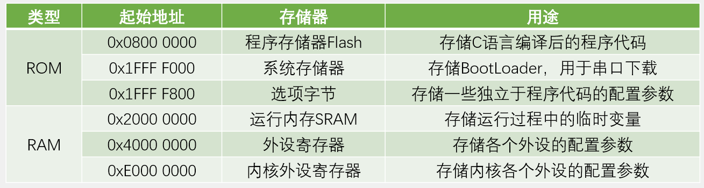

1、ROM：只读存储器，是非易失性、掉电不丢失的存储器。

2、RAM：随机存储器，是易失性、掉电丢失的存储器。

3、程序存储器Flash：主闪存，运行程序一般从主闪存开始运行，除了存储编译后的代码还存储常量。

4、寄存器：特殊的存储器，CPU可以对寄存器进行读写；寄存器的每一位都连着一根导线，这些导线可以用于控制外设电路的状态。（寄存器，连接软件和硬件的桥梁，软件读写寄存器就相当于控制硬件的执行）

## DMA结构

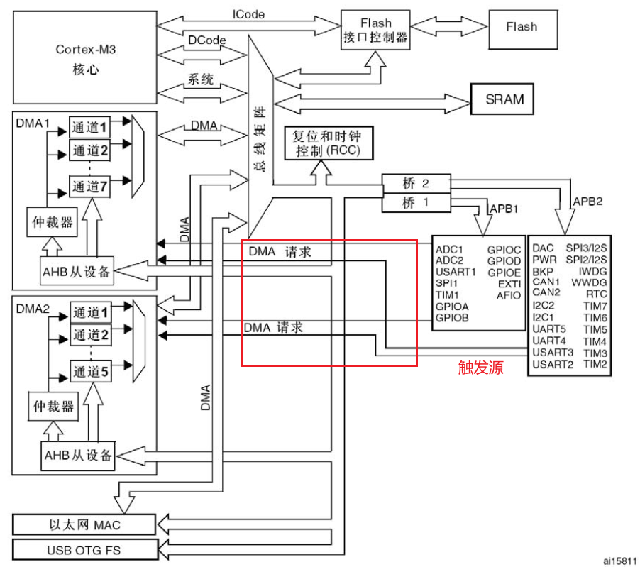

1、总线矩阵：为了更高效有条理地访问存储器。

2、主动单元（总线矩阵左端的）：DCode（专门访问Flash）、系统总线、DMA，拥有存储器的访问权。

3、被动单元（总线矩阵右端的）：它们的存储器只能被左边的主动单元所读取。

4、仲裁器：各DMA对应的DMA总线只有一条，因此所有通道都只能分时复用一条DMA总线，如果产生冲突就会有由仲裁器根据通道优先级来决定谁先谁后。总线矩阵也有仲裁器，如果DMA和CPU都要访问同一目标，那么DMA会先暂停CPU的访问，不过总线仲裁器仍然会保证CPU会得到一半的总线保证CPU的正常工作。

4、AHB从设备：DMA自身的寄存器，DMA作为外设也配有相应的配置寄存器；这些DMA的寄存器连接到了AHB总线上，可以被CPU通过AHB总线配置。

5、DMA请求（触发）：DMA的硬件触发源（比如ADC转换完成、窗口接收数据等）。 

6、总线或CPU直接访问Flash，只读不可写。


## DMA基本结构

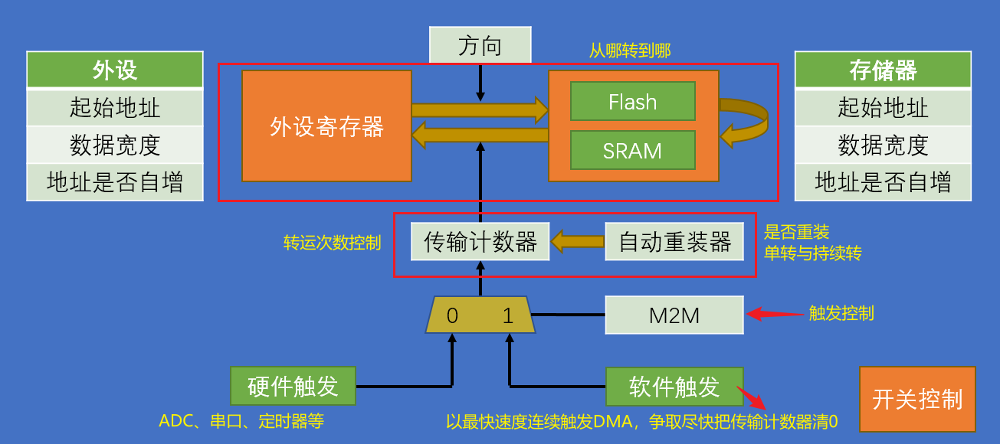

 1、外设寄存器站点、存储器站点（Flash、SRAM）。（STM32手册里的存储器，一般特指Flash和SRAM，不包含外设寄存器；而外设寄存器一般叫外设）

2、外设、存储器的起始地址：决定数据从哪来到哪去（从哪读数据，数据写到哪）。

3、数据宽度：指定一次转运按多大的数据宽度来进行（可选字节(byte)、半字(halfword)、字(word)）。

4、地址是否自增：指定的一次运行完成后，下一次转运是否要将地址移到下一个位置去。

5、传输计数器：需要转运计次，是一个自减计数器，减到0后，自增的地址会恢复到最开始的地址，以便下一轮转运。

6、自动重装器：传输计数器减到0后是否要将其恢复到最初的值，用于控制单次运输、循环运输。

7、M2M（memory to memory）：选择触发模式。

8、软件触发：不能和循环运输模式同时使用，一般适用于存储器到存储器的转运。

9、硬件触发：与外设有关的转运，这些转运需要一定的时机，比如ADC转换完成、串口收到数据、定时时间到等。

10、开关控制：DMA外设的开启（使能），转运开启条件——硬件触发有触发源、传输计数器计数大于0；当传输计数器等于0且没有自动重装时，无论是否触发DMA都不会再进行转运，此时就需要关闭DMA外设，再为传输计算机写大于0的数，再开启DMA，才会再次转运。（规定：写传输计数器时，必须先关闭DMA，再进行）

DMA请求映射：

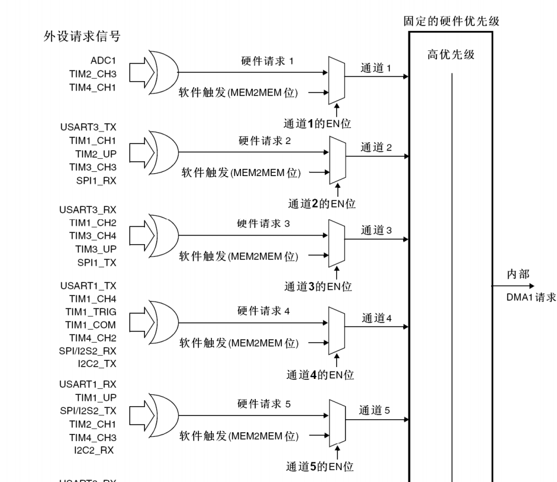

转运数据宽度不一致时：（目标的数据宽度比源端的数据宽度大，那就在目标数据前面多出来的空位补0；目标的数据宽度比源端的数据宽度小，那就会把多出来的高位舍弃掉）

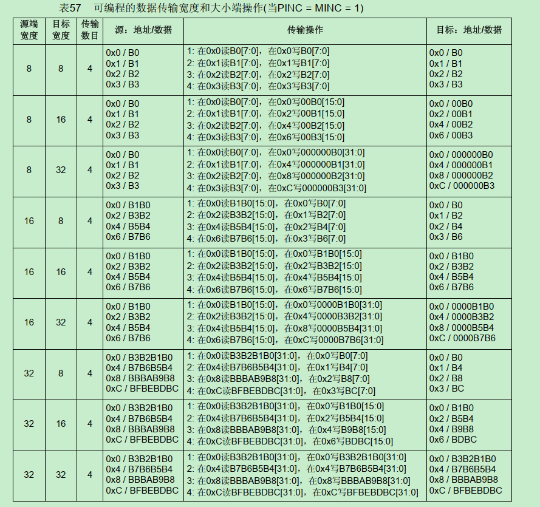

## DMA转运例子

使用DMA的步骤：

1. 第一步：通过RCC开启DMA的时钟。
2. 第二步：调用DMA_Init()初始化。
3. 第三步：DMA_Cmd()开关控制。
4. 如果是硬件触发，需要在对应的外设调用一下XXX_DMACmd()开启触发信号的输出。

### 例一

例子1：将SRAM的数组DataA，转运到另一个数组DataB中。

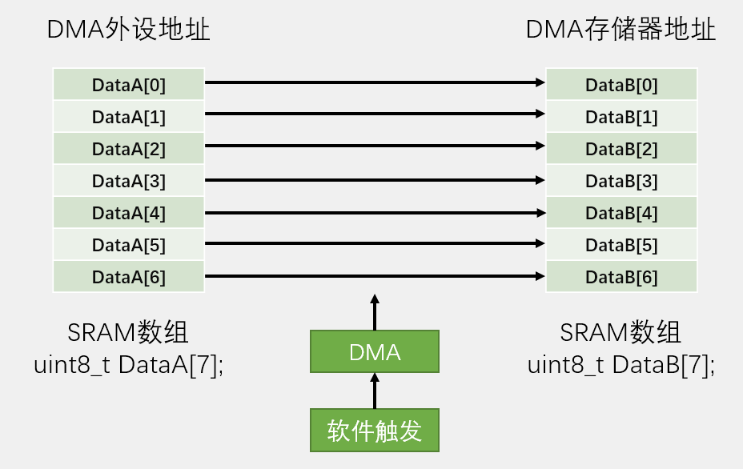

1. 外设地址：给DataA的首地址；存储器地址：给DataB的首地址。
2. 数据宽度：uint8_t的宽度。
3. 地址是否自增：需要自增。
4. 转运方向：外设站点转运到存储器站点。（DataB转到DataA，那就是存储器站点转运到外设站点）
5. 传输计数器：7。
6. 自动重装器：不需要重装。
7. 触发选择：软件触发，因为是存储器到存储器的转运。
8. 开启DMA，数据开始转运。（转运是复制转运，DataA的数据不会丢失）

测试变量、常量存储区域：（变量、常量的地址由编译器决定，外设寄存器地址是确定的）

```c
uint8_t sram = 0xaa;
const uint8_t flash = 0xbb;  // 常量
int main(void){
	OLED_Init();
	OLED_ShowHexNum(1,1,(uint32_t)&sram,8);  // 得到2000开头的，说明在SRAM区
	OLED_ShowHexNum(2,1,(uint32_t)&flash,8); // 得到0800开头的，说明在Flash区
	while(1){}
}
```

寄存器地址：（通过结构体访问寄存器地址）

```c
// ADC1的DR寄存器的地址
// ADC1是结构体指针，指向ADC1外设的起始地址，访问结构体成员相当于加了一个地址偏移量
OLED_ShowHexNum(4,1,(uint32_t)&ADC1->DR,8);     // 400124C
OLED_ShowHexNum(4,1,(uint32_t)&(ADC1->DR),8);   // 400124C
OLED_ShowHexNum(4,1,(uint32_t)&((*ADC1).DR),8); // 400124C
```

**例子1实现：**初始化MDA，把Data_A数据转运到Data_B

```c
/* 初始化后就会立刻进行转运，且只转运一次 */
void MyDMA_Init(uint32_t AddrA,uint32_t AddrB,uint16_t Size) 
{
	RCC_AHBPeriphClockCmd(RCC_AHBPeriph_DMA1,ENABLE);
	DMA_InitTypeDef DMA_InitTypeStructure;
	// 起始地址、宽度、是否地址自增
	DMA_InitTypeStructure.DMA_PeripheralBaseAddr = AddrA;
	DMA_InitTypeStructure.DMA_PeripheralDataSize = DMA_PeripheralDataSize_Byte;
	DMA_InitTypeStructure.DMA_PeripheralInc = DMA_PeripheralInc_Enable;
	// memory 存储
	DMA_InitTypeStructure.DMA_MemoryBaseAddr = AddrB;
	DMA_InitTypeStructure.DMA_MemoryDataSize = DMA_MemoryDataSize_Byte;
	DMA_InitTypeStructure.DMA_MemoryInc = DMA_MemoryInc_Enable;
	// 转运方向
	DMA_InitTypeStructure.DMA_DIR = DMA_DIR_PeripheralSRC;
	// 缓存区大小，传输计数器
	DMA_InitTypeStructure.DMA_BufferSize = Size;
	// 是否使用重装计数器
	DMA_InitTypeStructure.DMA_Mode = DMA_Mode_Normal;
	// 硬件触发函数软件触发，存储器到存储器就是软件触发
	DMA_InitTypeStructure.DMA_M2M = DMA_M2M_Enable;
	// 优先级
	DMA_InitTypeStructure.DMA_Priority = DMA_Priority_Medium;
	DMA_Init(DMA1_Channel1,&DMA_InitTypeStructure);
	
	DMA_Cmd(DMA1_Channel1,ENABLE);
}
```

```c
/* main.c */
uint8_t Data_A[] = {0x01,0x02,0x03,0x04};
uint8_t Data_B[] = {0,0,0,0};
int main(void){
	OLED_Init();
	OLED_ShowHexNum(1,1,Data_A[0],2);
	OLED_ShowHexNum(1,4,Data_A[1],2);
	OLED_ShowHexNum(1,7,Data_A[2],2);
	OLED_ShowHexNum(1,10,Data_A[3],2);
	OLED_ShowHexNum(2,1,Data_B[0],2);
	OLED_ShowHexNum(2,4,Data_B[1],2);
	OLED_ShowHexNum(2,7,Data_B[2],2);
	OLED_ShowHexNum(2,10,Data_B[3],2);
	
    MyDMA_Init((uint32_3)Data_A,(uint32_t)Data_B,4); 

	OLED_ShowHexNum(3,1,Data_A[0],2);
	OLED_ShowHexNum(3,4,Data_A[1],2);
	OLED_ShowHexNum(3,7,Data_A[2],2);
	OLED_ShowHexNum(3,10,Data_A[3],2);
	OLED_ShowHexNum(4,1,Data_B[0],2);
	OLED_ShowHexNum(4,4,Data_B[1],2);
	OLED_ShowHexNum(4,7,Data_B[2],2);
	OLED_ShowHexNum(4,10,Data_B[3],2);
	
	while(1){}
}

```

如果自己设定开始转运的时机：

```c
#include "stm32f10x.h"                  // Device header

uint16_t MyDMA_Size;

void MyDMA_Init(uint32_t AddrA,uint32_t AddrB,uint16_t Size) 
{
	MyDMA_Size = Size;
	
	RCC_AHBPeriphClockCmd(RCC_AHBPeriph_DMA1,ENABLE);
	DMA_InitTypeDef DMA_InitTypeStructure;
	// 起始地址、宽度、是否地址自增
	DMA_InitTypeStructure.DMA_PeripheralBaseAddr = AddrA;
	DMA_InitTypeStructure.DMA_PeripheralDataSize = DMA_PeripheralDataSize_Byte;
	DMA_InitTypeStructure.DMA_PeripheralInc = DMA_PeripheralInc_Enable;
	// memory 存储
	DMA_InitTypeStructure.DMA_MemoryBaseAddr = AddrB;
	DMA_InitTypeStructure.DMA_MemoryDataSize = DMA_MemoryDataSize_Byte;
	DMA_InitTypeStructure.DMA_MemoryInc = DMA_MemoryInc_Enable;
	// 转运方向
	DMA_InitTypeStructure.DMA_DIR = DMA_DIR_PeripheralSRC;
	// 缓存区大小，传输计数器
	DMA_InitTypeStructure.DMA_BufferSize = Size;
	// 是否使用重装计数器
	DMA_InitTypeStructure.DMA_Mode = DMA_Mode_Normal;
	// 硬件触发函数软件触发，存储器到存储器就是软件触发
	DMA_InitTypeStructure.DMA_M2M = DMA_M2M_Enable;
	// 优先级
	DMA_InitTypeStructure.DMA_Priority = DMA_Priority_Medium;
	DMA_Init(DMA1_Channel1,&DMA_InitTypeStructure);
	
	// DMA_Cmd(DMA1_Channel1,ENABLE); // 初始化后立刻进行转运
	DMA_Cmd(DMA1_Channel1,DISABLE); // 初始化后不立刻转运
}

void MyDMA_Transfer(void)
{
	DMA_Cmd(DMA1_Channel1,DISABLE);
	DMA_SetCurrDataCounter(DMA1_Channel1,MyDMA_Size);
	DMA_Cmd(DMA1_Channel1,ENABLE);
	// 等待转运完成
	while(DMA_GetFlagStatus(DMA1_FLAG_TC1) == RESET);
	// 清除标志位
	DMA_ClearFlag(DMA1_FLAG_TC1);
}
```

```c
/* main.c */
uint8_t Data_A[] = {0x01,0x02,0x03,0x04};
uint8_t Data_B[] = {0,0,0,0};
	
int main(void){
	MyDMA_Init((uint32_t)Data_A,(uint32_t)Data_B,4); 
	OLED_Init();
	while(1)
	{
		Data_A[0]++;
		Data_A[1]++; 
		Data_A[2]++; 
		Data_A[3]++; 
		OLED_ShowString(1,1,"DataA");
		OLED_ShowString(3,1,"DataB");
		OLED_ShowHexNum(1,8,(uint32_t)Data_A,8);
		OLED_ShowHexNum(3,8,(uint32_t)Data_B,8);
		
		OLED_ShowHexNum(2,1,Data_A[0],2);
		OLED_ShowHexNum(2,4,Data_A[1],2);
		OLED_ShowHexNum(2,7,Data_A[2],2);
		OLED_ShowHexNum(2,10,Data_A[3],2);
		OLED_ShowHexNum(4,1,Data_B[0],2);
		OLED_ShowHexNum(4,4,Data_B[1],2);
		OLED_ShowHexNum(4,7,Data_B[2],2);
		OLED_ShowHexNum(4,10,Data_B[3],2);
		
		Delay_ms(1000);
		MyDMA_Transfer();
		
		OLED_ShowHexNum(2,1,Data_A[0],2);
		OLED_ShowHexNum(2,4,Data_A[1],2);
		OLED_ShowHexNum(2,7,Data_A[2],2);
		OLED_ShowHexNum(2,10,Data_A[3],2);
		OLED_ShowHexNum(4,1,Data_B[0],2);
		OLED_ShowHexNum(4,4,Data_B[1],2);
		OLED_ShowHexNum(4,7,Data_B[2],2);
		OLED_ShowHexNum(4,10,Data_B[3],2);
		Delay_ms(1000);
	}
}

```


### 例二

例子2：ADC的数据寄存器的数据转运到MDA存储器中。

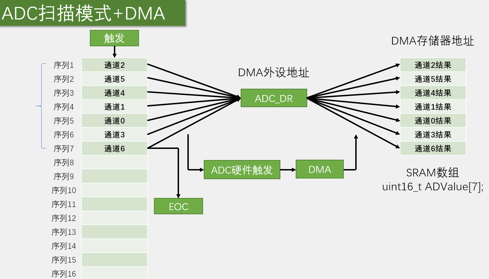

1. 外设地址：给ADC的数据存储寄存器的地址；存储器地址：在SRAM中定义一个数组，给这个数组的首地址。
2. 数据宽度：uint16_t的宽度。
3. 地址是否自增：外设地址不自增，存储器地址需要自增。
4. 转运方向：外设站点转运到存储器站点。
5. 传输计数器：7。
6. 自动重装器：ADC单次扫描，就不需要重装；ADC是连续扫描，可以使用自动重装。
7. 触发选择：选择ADC的硬件触发。（ADC连续扫描，虽然单通道转换完成后不产生任何标志位和中断，但是它会产生DMA请求去触发DMA转运）
8. 开启DMA，数据开始转运。（转运是复制转运，DataA的数据不会丢失）

ADC单次转换模式，通过DMA转运数据：

```c
uint16_t ADValue[4];
void AD_Init(void)
{
	RCC_APB2PeriphClockCmd(RCC_APB2Periph_ADC1,ENABLE);
	RCC_APB2PeriphClockCmd(RCC_APB2Periph_GPIOA,ENABLE);
	RCC_AHBPeriphClockCmd(RCC_AHBPeriph_DMA1,ENABLE);
	
	RCC_ADCCLKConfig(RCC_PCLK2_Div6);
	
	
	GPIO_InitTypeDef GPIO_InitStructure;
 	GPIO_InitStructure.GPIO_Mode = GPIO_Mode_AIN;
	GPIO_InitStructure.GPIO_Speed = GPIO_Speed_50MHz;
	GPIO_InitStructure.GPIO_Pin = GPIO_Pin_0 | GPIO_Pin_1 | GPIO_Pin_2 | GPIO_Pin_3;
 	GPIO_Init(GPIOA, &GPIO_InitStructure);
	
	ADC_RegularChannelConfig(ADC1,ADC_Channel_0,1,ADC_SampleTime_55Cycles5);
	ADC_RegularChannelConfig(ADC1,ADC_Channel_1,2,ADC_SampleTime_55Cycles5);
	ADC_RegularChannelConfig(ADC1,ADC_Channel_2,3,ADC_SampleTime_55Cycles5);
	ADC_RegularChannelConfig(ADC1,ADC_Channel_3,4,ADC_SampleTime_55Cycles5);
	
	ADC_InitTypeDef ADC_InitStructure;
	ADC_InitStructure.ADC_DataAlign = ADC_DataAlign_Right;
	ADC_InitStructure.ADC_ExternalTrigConv = ADC_ExternalTrigConv_None;
	ADC_InitStructure.ADC_Mode = ADC_Mode_Independent;
	// 连续转换模式
	ADC_InitStructure.ADC_ContinuousConvMode = DISABLE;
	ADC_InitStructure.ADC_NbrOfChannel = 4;
	ADC_InitStructure.ADC_ScanConvMode = ENABLE;
	ADC_Init(ADC1,&ADC_InitStructure);
	/* DMA配置 start */
	DMA_InitTypeDef DMA_InitTypeStructure;
	// 起始地址、宽度、是否地址自增
	DMA_InitTypeStructure.DMA_PeripheralBaseAddr = (uint32_t)&ADC1->DR;
	DMA_InitTypeStructure.DMA_PeripheralDataSize = DMA_PeripheralDataSize_HalfWord;
	DMA_InitTypeStructure.DMA_PeripheralInc = DMA_PeripheralInc_Disable;
	// memory 存储
	DMA_InitTypeStructure.DMA_MemoryBaseAddr = (uint32_t)ADValue;
	DMA_InitTypeStructure.DMA_MemoryDataSize = DMA_MemoryDataSize_HalfWord;
	DMA_InitTypeStructure.DMA_MemoryInc = DMA_MemoryInc_Enable;
	// 转运方向
	DMA_InitTypeStructure.DMA_DIR = DMA_DIR_PeripheralSRC;
	// 缓存区大小，传输计数器
	DMA_InitTypeStructure.DMA_BufferSize = 4;
	// 是否使用重装计数器
	DMA_InitTypeStructure.DMA_Mode = DMA_Mode_Normal;
	// 硬件触发函数软件触发，存储器到存储器就是软件触发
	DMA_InitTypeStructure.DMA_M2M = DMA_M2M_Disable;
	// 优先级
	DMA_InitTypeStructure.DMA_Priority = DMA_Priority_Medium;
	DMA_Init(DMA1_Channel1,&DMA_InitTypeStructure);
	DMA_Cmd(DMA1_Channel1,ENABLE); // 初始化后立刻进行转运
    /* DMA配置 end */
    
	ADC_DMACmd(ADC1,ENABLE);
	ADC_Cmd(ADC1,ENABLE);
	// 校准
	ADC_ResetCalibration(ADC1);
	while(ADC_GetResetCalibrationStatus(ADC1) == SET);
	ADC_StartCalibration(ADC1);
	while(ADC_GetCalibrationStatus(ADC1));
}

void AD_GetValue(void)
{
	DMA_Cmd(DMA1_Channel1,DISABLE);
	DMA_SetCurrDataCounter(DMA1_Channel1,4);
	DMA_Cmd(DMA1_Channel1,ENABLE);
	// 软件触发ADC转换
	ADC_SoftwareStartConvCmd(ADC1,ENABLE);
	// 等待转运完成
	while(DMA_GetFlagStatus(DMA1_FLAG_TC1) == RESET);
	// 清除标志位
	DMA_ClearFlag(DMA1_FLAG_TC1);
}
```

```c
/* main.c */
int main()
{
    AD_Init();
    while(){
        AD_GetValue();
    }
}
```


ADC连续转换模式，通过DMA 循环转运数据：

```c
uint16_t ADValue[4];
void AD_Init(void)
{
	RCC_APB2PeriphClockCmd(RCC_APB2Periph_ADC1,ENABLE);
	RCC_APB2PeriphClockCmd(RCC_APB2Periph_GPIOA,ENABLE);
	RCC_AHBPeriphClockCmd(RCC_AHBPeriph_DMA1,ENABLE);
	
	RCC_ADCCLKConfig(RCC_PCLK2_Div6);
	
	
	GPIO_InitTypeDef GPIO_InitStructure;
 	GPIO_InitStructure.GPIO_Mode = GPIO_Mode_AIN;
	GPIO_InitStructure.GPIO_Speed = GPIO_Speed_50MHz;
	GPIO_InitStructure.GPIO_Pin = GPIO_Pin_0 | GPIO_Pin_1 | GPIO_Pin_2 | GPIO_Pin_3;
 	GPIO_Init(GPIOA, &GPIO_InitStructure);
	
	ADC_RegularChannelConfig(ADC1,ADC_Channel_0,1,ADC_SampleTime_55Cycles5);
	ADC_RegularChannelConfig(ADC1,ADC_Channel_1,2,ADC_SampleTime_55Cycles5);
	ADC_RegularChannelConfig(ADC1,ADC_Channel_2,3,ADC_SampleTime_55Cycles5);
	ADC_RegularChannelConfig(ADC1,ADC_Channel_3,4,ADC_SampleTime_55Cycles5);
	
	ADC_InitTypeDef ADC_InitStructure;
	ADC_InitStructure.ADC_DataAlign = ADC_DataAlign_Right;
	ADC_InitStructure.ADC_ExternalTrigConv = ADC_ExternalTrigConv_None;
	ADC_InitStructure.ADC_Mode = ADC_Mode_Independent;
	// 连续转换模式
	ADC_InitStructure.ADC_ContinuousConvMode = ENABLE;
	ADC_InitStructure.ADC_NbrOfChannel = 4;
	ADC_InitStructure.ADC_ScanConvMode = ENABLE;
	ADC_Init(ADC1,&ADC_InitStructure);
	
	DMA_InitTypeDef DMA_InitTypeStructure;
	// 起始地址、宽度、是否地址自增
	DMA_InitTypeStructure.DMA_PeripheralBaseAddr = (uint32_t)&ADC1->DR;
	DMA_InitTypeStructure.DMA_PeripheralDataSize = DMA_PeripheralDataSize_HalfWord;
	DMA_InitTypeStructure.DMA_PeripheralInc = DMA_PeripheralInc_Disable;
	// memory 存储
	DMA_InitTypeStructure.DMA_MemoryBaseAddr = (uint32_t)ADValue;
	DMA_InitTypeStructure.DMA_MemoryDataSize = DMA_MemoryDataSize_HalfWord;
	DMA_InitTypeStructure.DMA_MemoryInc = DMA_MemoryInc_Enable;
	// 转运方向
	DMA_InitTypeStructure.DMA_DIR = DMA_DIR_PeripheralSRC;
	// 缓存区大小，传输计数器
	DMA_InitTypeStructure.DMA_BufferSize = 4;
	// 是否使用重装计数器
	DMA_InitTypeStructure.DMA_Mode = DMA_Mode_Circular;
	// 硬件触发函数软件触发，存储器到存储器就是软件触发
	DMA_InitTypeStructure.DMA_M2M = DMA_M2M_Disable;
	// 优先级
	DMA_InitTypeStructure.DMA_Priority = DMA_Priority_Medium;
	DMA_Init(DMA1_Channel1,&DMA_InitTypeStructure);
	DMA_Cmd(DMA1_Channel1,ENABLE); // 初始化后立刻进行转运
	ADC_DMACmd(ADC1,ENABLE);
	ADC_Cmd(ADC1,ENABLE);
	
	// 校准
	ADC_ResetCalibration(ADC1);
	while(ADC_GetResetCalibrationStatus(ADC1) == SET);
	ADC_StartCalibration(ADC1);
	while(ADC_GetCalibrationStatus(ADC1));
	
	ADC_SoftwareStartConvCmd(ADC1,ENABLE);
}
```


## 函数原型说明

> stm32f10x_dma.h

```c
// 初始化
void DMA_DeInit(DMA_Channel_TypeDef* DMAy_Channelx);
void DMA_Init(DMA_Channel_TypeDef* DMAy_Channelx, DMA_InitTypeDef* DMA_InitStruct);
void DMA_StructInit(DMA_InitTypeDef* DMA_InitStruct);
// 开启DMA
void DMA_Cmd(DMA_Channel_TypeDef* DMAy_Channelx, FunctionalState NewState);
// DMA中断配置
void DMA_ITConfig(DMA_Channel_TypeDef* DMAy_Channelx, uint32_t DMA_IT, FunctionalState NewState);
// 设置DMA的数据计数器
void DMA_SetCurrDataCounter(DMA_Channel_TypeDef* DMAy_Channelx, uint16_t DataNumber); 
// 获取传输计数器的值
uint16_t DMA_GetCurrDataCounter(DMA_Channel_TypeDef* DMAy_Channelx);
// 获取标志位，前面程序里使用，后面中断里使用
FlagStatus DMA_GetFlagStatus(uint32_t DMAy_FLAG);
void DMA_ClearFlag(uint32_t DMAy_FLAG);
ITStatus DMA_GetITStatus(uint32_t DMAy_IT);
void DMA_ClearITPendingBit(uint32_t DMAy_IT);
```

# 通信接口

## 概述

通信的目的：将一个设备的数据传送到另一个设备，扩展硬件系统。

通信协议：制定通信的规则，通信双方按照协议规则进行数据收发。

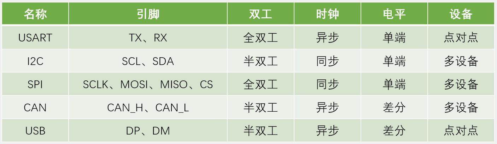


| 简写                                   | 全称                                                         |
| -------------------------------------- | ------------------------------------------------------------ |
| USART                                  | Universal Synchronous/Asynchronous Receiver/Transmitter，<br>通用同步异步收发传输器 |
| TX                                     | Transmit  Exchange，数据发送脚                               |
| RX                                     | Receive Exchange，数据接收脚                                 |
| SCL                                    | Serial Clock，串口时钟                                       |
| SDA                                    | Serial  Data，串口数据                                       |
| SCLK                                   | Serial Clock，时钟。                                         |
| MOSI                                   | Master Output Slave Input，主机输出数据脚                    |
| MISO                                   | Master Input Slave Output， 主机输入数据脚                   |
| CS                                     | Chip Select，片选， 用于指定通信的对象                       |
| DP（Data Positive ）、DM（Data Minus） | 差分数据脚                                                   |
| CAN通信                                | 两个差分数据脚，用两个引脚表示一个差分数据                   |

双工：

1. 全双工：通信双方能够同时进行双向通信。（一般全双工的通信都有两根通信线，一根发送一根接收，发送和接收互不影响）
2. 半双工：允许二台设备之间的双向数据传输，但不能同时进行。
3. 单工：指数据传输只支持数据在一个方向上传输。

同步和异步时钟：（[ 同步时钟、异步时钟----概念解析_一点一点的进步的博客](https://blog.csdn.net/yh13572438258/article/details/123580666#同步时钟)）

- 同步时钟： 当两个时钟间的相位是固定关系的，则可以称这两个时钟为同步时钟(synchronous clock)。（一般同源，如由同一个MMCM or PLL  产生的两个时钟可以称为同步时钟。因此可以将主时钟和与之对应的衍生时钟约束成同一个时钟组。）
- 异步时钟： 无法判定两个时钟间相位时，则可以称这两个时钟为异步时钟(asynchronous clocks)。（**两个来自不同晶振的时钟，一定是异步时钟。**通常情况下设计中不同的主时钟肯定是异步时钟，因此可以将这两个主时钟及其衍生时钟约束成不同的时钟组）


## 串口协议

串口通信：

- 串口是一种应用十分广泛的通讯接口，串口成本低、容易使用、通信线路简单，可实现两个设备的互相通信。
- 单片机的串口可以使单片机与单片机、单片机与电脑、单片机与各式各样的模块互相通信，极大地扩展了单片机的应用范围，增强了单片机系统的硬件实力。

硬件电路：

- 简单双向串口通信有两根通信线（发送端TX和接收端RX）。
- TX与RX要交叉连接。
- 当只需单向的数据传输时，可以只接一根通信线。
- 当电平标准不一致时，需要加电平转换芯片。

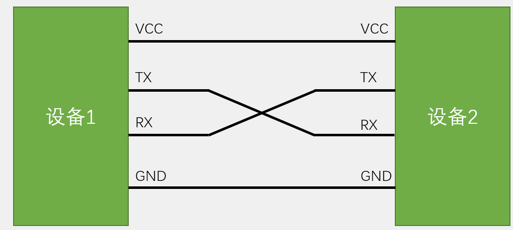

**串口常用电平标准**——电平标准是数据1和数据0的表达方式，是传输线缆中人为规定的电压与数据的对应关系，串口常用的电平标准有如下三种：

- TTL电平：+3.3V或+5V表示1，0V表示0。（单片机最常见的；TTL（transistor transistor logic）即晶体管-晶体管逻辑电平）
- RS232电平：-3~-15V表示1，+3~+15V表示0。
- RS485电平：两线压差+2~+6V表示1，-2~-6V表示0（差分信号）。

**硬件电路协议规定：**一个设备使用TX发送高低电平，另一个设备使用RX接收高低电平，在线路中使用TTL电平。

**串口参数及时序：**如何使用1和0来组成想要发送的一个字节数据？

- 波特率：串口通信的速率。（单位时间内传输符号的个数（ 传符号率 ）即波特率，是码元传输速率单位，它说明单位时间传输了多少个码元）；（波特率，每秒传输的比特个数，bit/s，bps；二进制调制的情况下，一个码元就是1bit，此时波特率对于比特率）
- 起始位：标志一个数据帧的开始，固定为低电平。
- 数据位：数据帧的有效载荷，1为高电平，0为低电平，低位先行。
- 校验位：用于数据验证，根据数据位计算得来。（无校验、奇校验、偶校验）
- 停止位：用于数据帧间隔，固定为高电平。

协议规定串口发送的一个字节的格式如下：（串口中每一个数据都装在一个数据帧里）

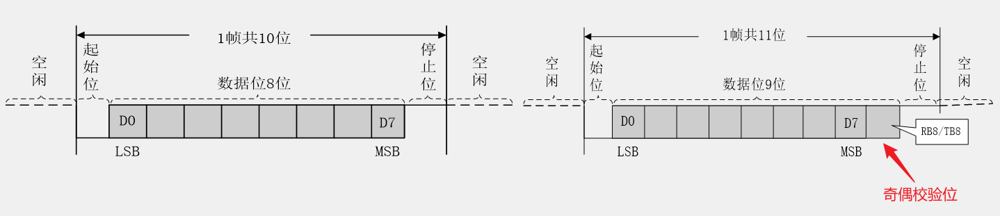

说明：空闲为高电平，也就是没有数据传输时引脚必须置高电平作为空闲状态，需要发送时必须先发送一个起始位且起始位必须是低电平，来打破空闲状态的高电平，产生一个下降沿，这个下降沿用于告诉接收设备，这一帧的数据要开始发送了。停止位固定为1，把引脚恢复成高电平，方便下一次的下降沿。

示例——发送一个数据0F，低位先行：（1111先发送，0000后发送，低位 → 高位 依次发送）

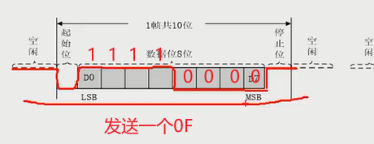

关于奇偶校验：

- 奇校验：原始码流+校验位，总共有奇数个1。
- 偶校验：原始码流+校验位，总共有偶数个1。
- 使用奇校验，数据发送时会通过校验位补0或1来使整个码流中的1是奇数，当接收后发现有效位+校验位的1不是奇数时认为传输出错；使用偶校验也同理，当接收后发现有效位+校验位的1不是偶数时认为出错。（其它更好的校验，CRC校验等）

串口时序：（STM32中根据字节顺序翻转高低电平由外设USART自动完成）

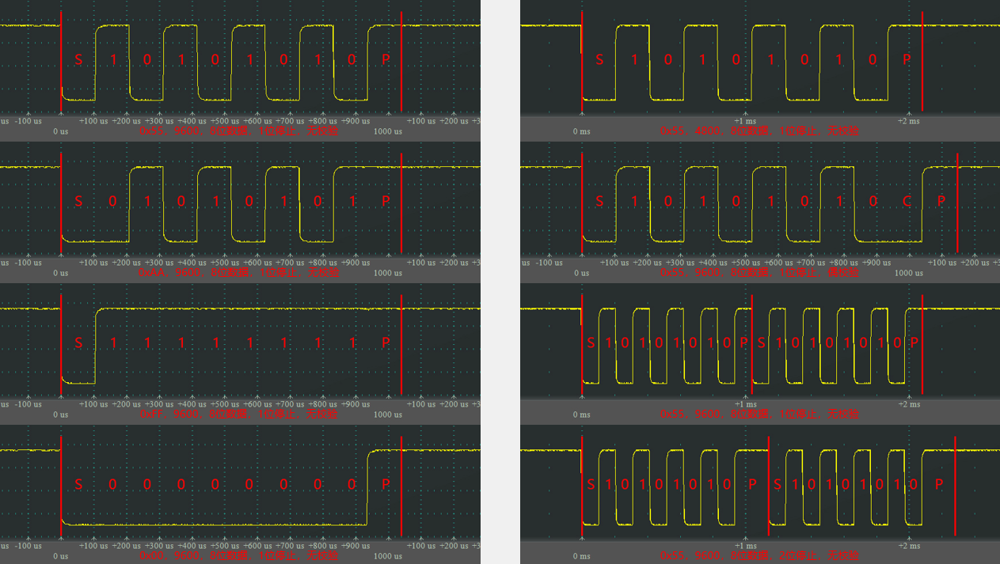

串口主要就是通过收发这些时序来进行通信的。

# USART

UART（Universal Asynchronous Receiver/Transmitter ）—— 异步收发器

USART （Universal Synchronous/Asynchronous Receiver/Transmitter）——   通用同步/异步收发器。（同步模式只支持时钟输出不支持时钟输入，这更多是为了兼容别的协议或者特殊用途而设计的，不支持两个USART之间进行同步通信，因此主要还是学习异步通信）

- USART是STM32内部集成的硬件外设，**可根据数据寄存器的一个字节数据自动生成数据帧时序**，从TX引脚发送出去，也可自动接收RX引脚的数据帧时序，拼接为一个字节数据，存放在数据寄存器里。
- 自带波特率发生器，最高达4.5Mbits/s。（配置波特率）
- **可配置数据位长度（8/9）、停止位长度（0.5/1/1.5/2）。**
- 可选校验位（无校验/奇校验/偶校验）。
- 支持同步模式、硬件流控制、DMA、智能卡、IrDA、LIN。
- STM32F103C8T6 USART资源： USART1（APB2总线的设备）、 USART2（APB1）、 USART3（APB1）。

## USART框图

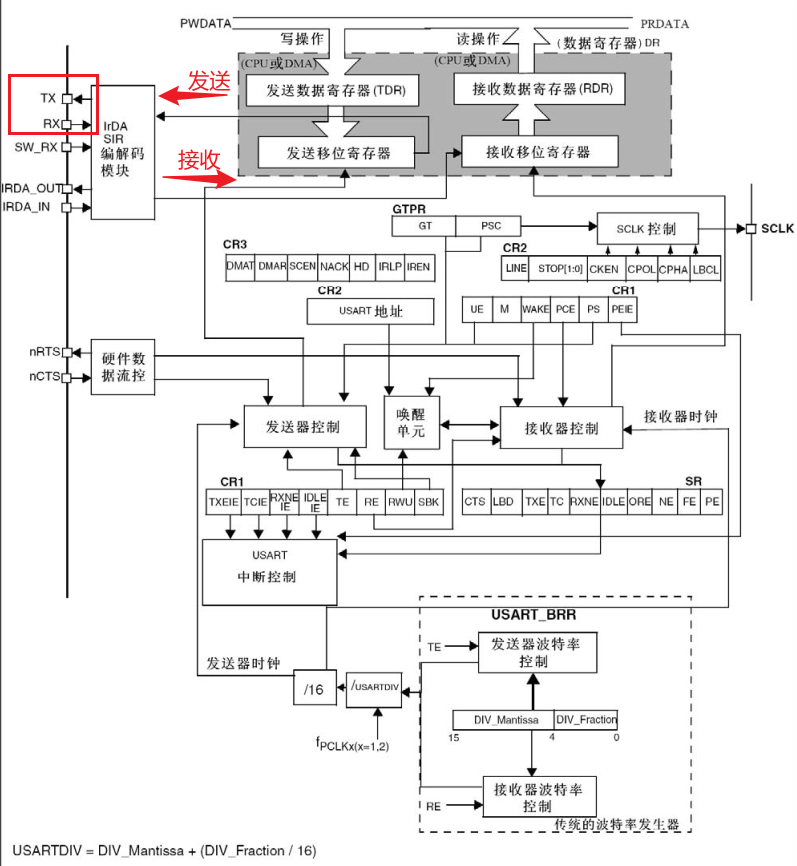


## USART基本结构


## USART细节

### 数据帧：

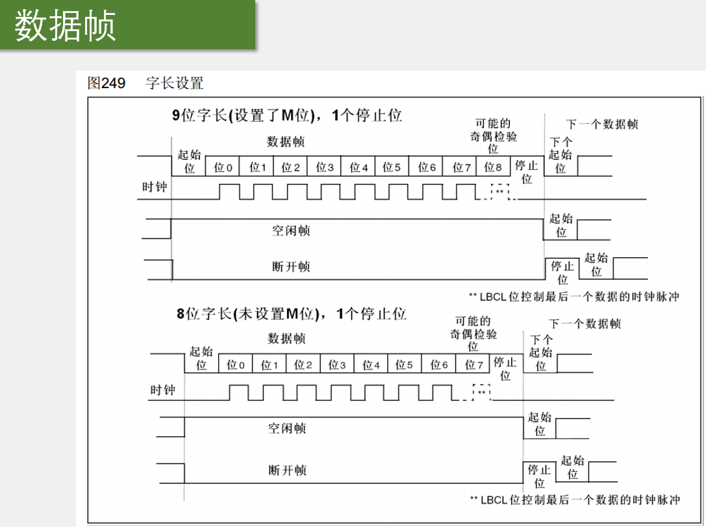


### 起始位检测：

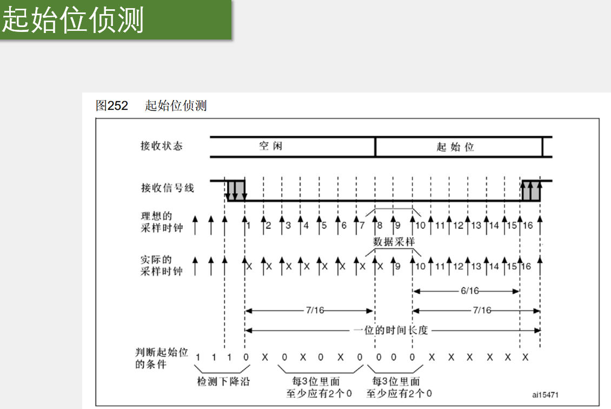

### 数据采样：


### 波特率发生器：

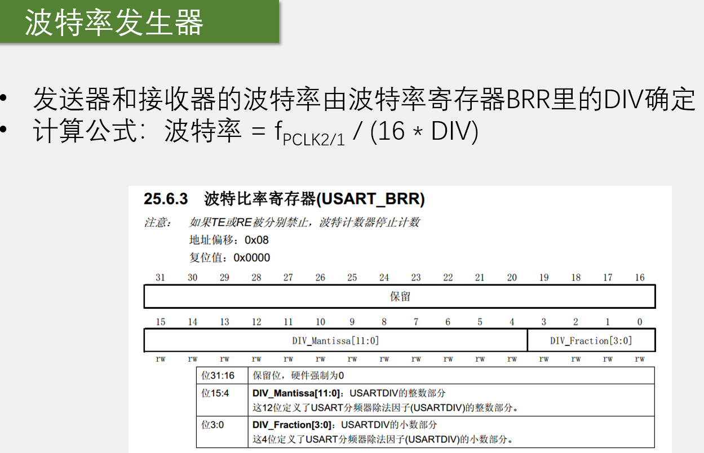

### 数据模式：

HEX模式，以原始数据显示——收到什么数据就把什么数据显示出来。

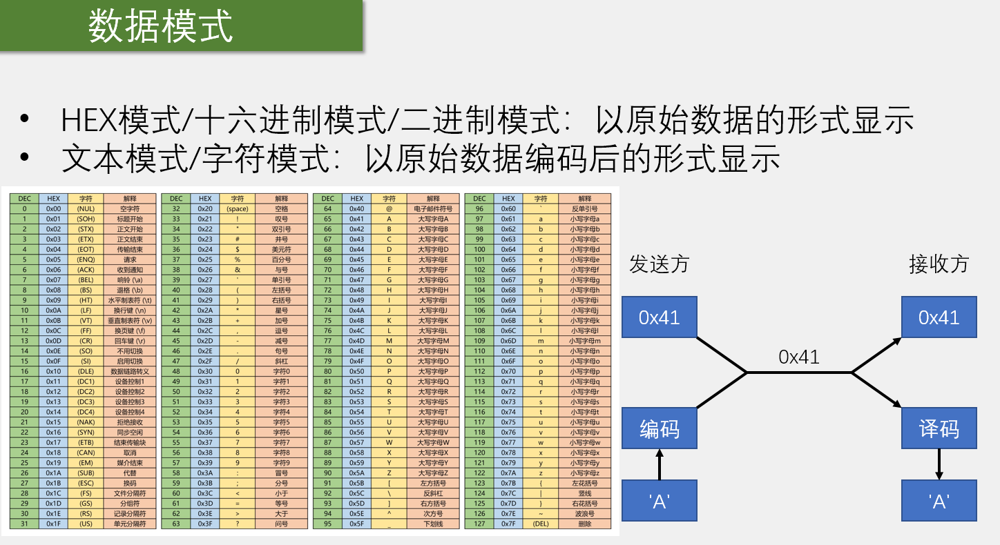


## 函数原型说明

```c
void USART_DeInit(USART_TypeDef* USARTx);
void USART_Init(USART_TypeDef* USARTx, USART_InitTypeDef* USART_InitStruct);
void USART_StructInit(USART_InitTypeDef* USART_InitStruct);
```

```c
/* 配置同步时钟输出 */
void USART_ClockInit(USART_TypeDef* USARTx, USART_ClockInitTypeDef* USART_ClockInitStruct);
void USART_ClockStructInit(USART_ClockInitTypeDef* USART_ClockInitStruct);
```

```c
void USART_Cmd(USART_TypeDef* USARTx, FunctionalState NewState);
void USART_ITConfig(USART_TypeDef* USARTx, uint16_t USART_IT, FunctionalState NewState);
void USART_DMACmd(USART_TypeDef* USARTx, uint16_t USART_DMAReq, FunctionalState NewState);
```

```c
/* 不常用 */
// 设置地址
void USART_SetAddress(USART_TypeDef* USARTx, uint8_t USART_Address);
// 唤醒
void USART_WakeUpConfig(USART_TypeDef* USARTx, uint16_t USART_WakeUp);
void USART_ReceiverWakeUpCmd(USART_TypeDef* USARTx, FunctionalState NewState);
void USART_LINBreakDetectLengthConfig(USART_TypeDef* USARTx, uint16_t USART_LINBreakDetectLength);
void USART_LINCmd(USART_TypeDef* USARTx, FunctionalState NewState);
```

```c
/* 重要 */
void USART_SendData(USART_TypeDef* USARTx, uint16_t Data);
uint16_t USART_ReceiveData(USART_TypeDef* USARTx);
```

```c
/* 不常用 */
void USART_SendBreak(USART_TypeDef* USARTx);
void USART_SetGuardTime(USART_TypeDef* USARTx, uint8_t USART_GuardTime);
void USART_SetPrescaler(USART_TypeDef* USARTx, uint8_t USART_Prescaler);
void USART_SmartCardCmd(USART_TypeDef* USARTx, FunctionalState NewState);
void USART_SmartCardNACKCmd(USART_TypeDef* USARTx, FunctionalState NewState);
void USART_HalfDuplexCmd(USART_TypeDef* USARTx, FunctionalState NewState);
void USART_OverSampling8Cmd(USART_TypeDef* USARTx, FunctionalState NewState);
void USART_OneBitMethodCmd(USART_TypeDef* USARTx, FunctionalState NewState);
void USART_IrDAConfig(USART_TypeDef* USARTx, uint16_t USART_IrDAMode);
void USART_IrDACmd(USART_TypeDef* USARTx, FunctionalState NewState);
```

```c
/* 标志位相关的 */
FlagStatus USART_GetFlagStatus(USART_TypeDef* USARTx, uint16_t USART_FLAG);
void USART_ClearFlag(USART_TypeDef* USARTx, uint16_t USART_FLAG);
ITStatus USART_GetITStatus(USART_TypeDef* USARTx, uint16_t USART_IT);
void USART_ClearITPendingBit(USART_TypeDef* USARTx, uint16_t USART_IT);
```


## 串口通信

### 发送数据

```c
void Serial_Init(void)
{
	RCC_APB2PeriphClockCmd(RCC_APB2Periph_USART1, ENABLE);
	RCC_APB2PeriphClockCmd(RCC_APB2Periph_GPIOA, ENABLE);
	
	GPIO_InitTypeDef GPIO_InitStructure;
	GPIO_InitStructure.GPIO_Mode = GPIO_Mode_AF_PP;
    // 
	GPIO_InitStructure.GPIO_Pin = GPIO_Pin_9;
	GPIO_InitStructure.GPIO_Speed = GPIO_Speed_50MHz;
	GPIO_Init(GPIOA,&GPIO_InitStructure);
	
	USART_InitTypeDef USART_InitStructure;
	USART_InitStructure.USART_BaudRate = 9600;
	USART_InitStructure.USART_HardwareFlowControl = USART_HardwareFlowControl_None;
	USART_InitStructure.USART_Mode = USART_Mode_Tx;
	USART_InitStructure.USART_Parity = USART_Parity_No;
	USART_InitStructure.USART_StopBits = USART_StopBits_1;
	USART_InitStructure.USART_WordLength = USART_WordLength_8b;
	USART_Init(USART1,&USART_InitStructure);
	USART_Cmd(USART1, ENABLE);
}
/* 发送 */
void Serial_SendByte(uint16_t Byte)
{
	USART_SendData(USART1, Byte);
	while(USART_GetFlagStatus(USART1,USART_FLAG_TXE)==RESET);
    // 标志位会自动被清0，不需要手动清0
}
```

函数封装：

```c
#include "stdio.h"
#include "stdarg.h"

/* 发送数组 */
void Serial_SendArray(uint8_t* Array, uint16_t Length)
{
	uint16_t i;
	for(i = 0; i < Length; i++) {
	
		Serial_SendByte(Array[i]);
	
	}
}
/* 发送字符串 */
void Serial_SendString(char* String)
{
	uint16_t i;
	for(i = 0; String[i] != '\0'; i++) {
		Serial_SendByte(String[i]);
	}
}
/* 发送字符形式的数字 */
uint32_t Serial_Pow(uint32_t X, uint8_t Y){
	uint32_t Result = 1;
	while(Y--)	
		Result *= X;
	return Result;
}
void Serial_SendNumber(uint32_t Number, uint8_t Length)
{
	uint16_t i;
	for(i = 0; i < Length; i++) {
	
		Serial_SendByte(Number / Serial_Pow(10,Length - i - 1)%10+'0');
	
	}
}
/* 移植printf，先在设置里选上 "Use MicroLIB"  然后引入<stdio.h>  重写fputc()
	然后就可以使用printf将数据输出到串口了
*/
int fputc(int ch, FILE* f){
	
	Serial_SendByte(ch);
	return ch;
}
/* 对sprintf()进行封装 需要引入#include "stdarg.h"*/
void Serial_Printf(char* format, ...)
{
	char String[100];
	va_list arg;
	va_start(arg,format);
	vsprintf(String,format,arg);
	va_end(arg);
	Serial_SendString(String);
}
```

```c
/** main.c **/
int main(void){
	OLED_Init();
	Serial_Init();
	Serial_SendByte(0x41);             // 发送原函数
	uint8_t arr[6]={0x42,0x43,0x44,0x45};
	Serial_SendArray(arr,4);
	Serial_SendString("\r\nNum1=");
	Serial_SendNumber(1999,4);
	printf("\r\nNum2=%d",666);         // printf
	
	char String[100];
	sprintf(String,"\r\nNum3=%d",666); // sprintf
	Serial_SendString(String);
	Serial_Printf("\r\n");
	Serial_Printf("你好世界",999);      // Serial_Printf
	Serial_Printf("Num=%d\r\n",999);
	while(1){}
}
```

### 接收数据

```c
void Serial_Init(void)
{
	RCC_APB2PeriphClockCmd(RCC_APB2Periph_USART1, ENABLE);
	RCC_APB2PeriphClockCmd(RCC_APB2Periph_GPIOA, ENABLE);
	
	GPIO_InitTypeDef GPIO_InitStructure;
	GPIO_InitStructure.GPIO_Mode = GPIO_Mode_IPU;
    // RX复用GPIOA的10口
	GPIO_InitStructure.GPIO_Pin = GPIO_Pin_10;
	GPIO_InitStructure.GPIO_Speed = GPIO_Speed_50MHz;
	GPIO_Init(GPIOA,&GPIO_InitStructure);
	
	USART_InitTypeDef USART_InitStructure;
	USART_InitStructure.USART_BaudRate = 9600;
	USART_InitStructure.USART_HardwareFlowControl = USART_HardwareFlowControl_None;
    // USART_Mode_Tx | USART_Mode_Rx表示接收和发送都开启
	USART_InitStructure.USART_Mode = USART_Mode_Rx; 
	USART_InitStructure.USART_Parity = USART_Parity_No;
	USART_InitStructure.USART_StopBits = USART_StopBits_1;
	USART_InitStructure.USART_WordLength = USART_WordLength_8b;
	USART_Init(USART1,&USART_InitStructure);
	USART_Cmd(USART1, ENABLE);
}
```

```c
uint8_t RX_data;
int main(void){
    OLED_Init();
    Serial_Init();
    while(1)
    {
        if(USART_GetFlagStatus(USART1,USART_FLAG_RXNE)==SET)
        {
            // 读取操作会自动将标志位清0
            RX_data = USART_ReceiveData(USART1);
            OLED_ShowHexNum(1,1,RX_data,2);
        }
    }
}
```

使用中断接收：

```c
void Serial_Init(void)
{
	RCC_APB2PeriphClockCmd(RCC_APB2Periph_USART1, ENABLE);
	RCC_APB2PeriphClockCmd(RCC_APB2Periph_GPIOA, ENABLE);
	
	GPIO_InitTypeDef GPIO_InitStructure;
	GPIO_InitStructure.GPIO_Mode = GPIO_Mode_IPU;
    // RX复用GPIOA的10口
	GPIO_InitStructure.GPIO_Pin = GPIO_Pin_10;
	GPIO_InitStructure.GPIO_Speed = GPIO_Speed_50MHz;
	GPIO_Init(GPIOA,&GPIO_InitStructure);
	
	USART_InitTypeDef USART_InitStructure;
	USART_InitStructure.USART_BaudRate = 9600;
	USART_InitStructure.USART_HardwareFlowControl = USART_HardwareFlowControl_None;
    // USART_Mode_Tx | USART_Mode_Rx表示接收和发送都开启
	USART_InitStructure.USART_Mode = USART_Mode_Rx; 
	USART_InitStructure.USART_Parity = USART_Parity_No;
	USART_InitStructure.USART_StopBits = USART_StopBits_1;
	USART_InitStructure.USART_WordLength = USART_WordLength_8b;
	USART_Init(USART1,&USART_InitStructure);
    // 中断开启部分
    USART_ITConfig(USART1,USART_IT_RXNE,ENABLE);
	NVIC_PriorityGroupConfig(NVIC_PriorityGroup_2);
	NVIC_InitTypeDef NVIC_InitStructure;
	NVIC_InitStructure.NVIC_IRQChannel = USART1_IRQn;
	NVIC_InitStructure.NVIC_IRQChannelCmd = ENABLE;
	NVIC_InitStructure.NVIC_IRQChannelPreemptionPriority = 1;
	NVIC_InitStructure.NVIC_IRQChannelSubPriority = 1;
	NVIC_Init(&NVIC_InitStructure);
    
	USART_Cmd(USART1, ENABLE);
}
```

```c
/* 中断处理函数及功能封装 */
uint8_t Serial_Data; 
uint8_t Serial_Flag;  // 自定义标志位
uint8_t Serial_GetFlag(void)   // 获取自定义标志位后将自定义标志位清0
{
	if(Serial_Flag == 1) {
		Serial_Flag = 0;
		return 1;
	}
	return 0;
}
uint8_t Serial_GetData(void) // 获取数据
{
	return Serial_Data;
}
void USART1_IRQHandler(void)  // 中断处理函数
{
	if(USART_GetFlagStatus(USART1,USART_FLAG_RXNE)==SET)
		{
			Serial_Data = USART_ReceiveData(USART1);
			Serial_Flag = 1;
			USART_ClearITPendingBit(USART1,USART_IT_RXNE);
		}
}
```

```c
uint8_t RX_data;

int main(void){
	OLED_Init();
	Serial_Init();
	
	while(1)
	{
		if(Serial_GetFlag())
		{
			RX_data = Serial_GetData();
			OLED_ShowHexNum(1,1,RX_data,2);
		}
	}
}

```


## 数据包的发送与接收

### 数据包介绍

HEX数据包打包，添加包头包尾，缺点是灵活性不足，包头包尾容易和载荷重复：

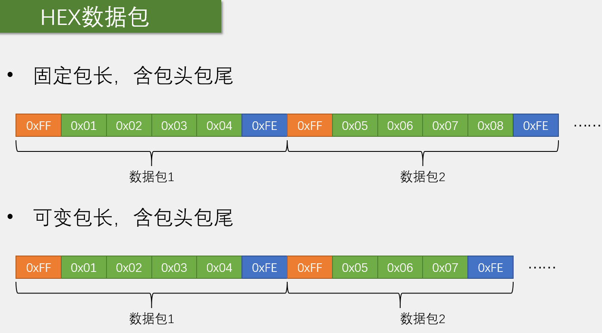

文本数据包：数据直观易理解，比较适合一些输入指令进行人机交互的场合，比如蓝牙模块常用的AT指令、CNC和3D打印常用的G代码都是文本数据包的格式，缺点就是解析效率低，比如发送100，HEX数据包就直接是100，文本数据包就是发送三个字节`1`、`0`、`0`，收到后还要转为数据。

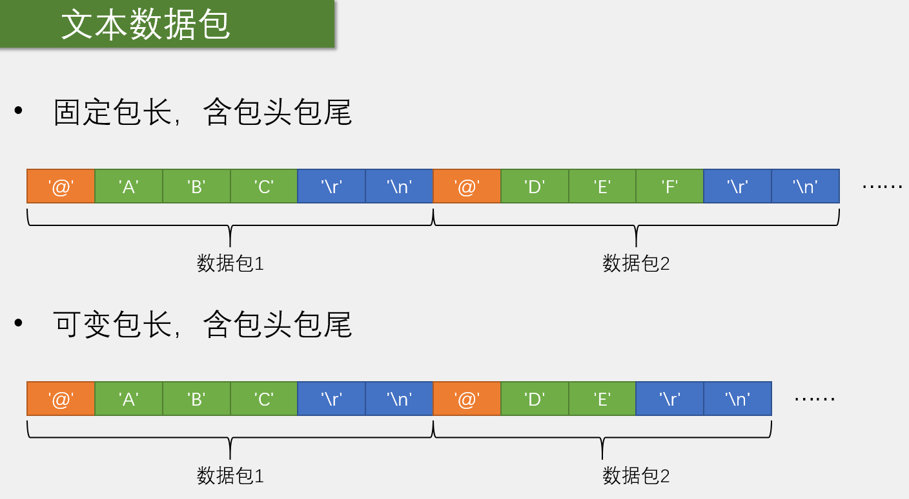

### 数据包的接收

数据包的发送过程很简单，无论是字符或者数字，直接发送即可，发送过程自主可控，想发啥就发啥。

接收固定包长的HEX数据包：数据包有明显的先后关联性，对应数据包中的包头、数据、包尾这3种状态我们需要有不同的处理逻辑，所以我们需要在程序中设计一个能记住不同状态的机制，在不同的状态执行不同的操作，同时还要进行状态的合理转移，这种程序设计思维叫做“状态机”。

使用状态机来接收数据包：状态转移图对于设计状态机程序是必要的。

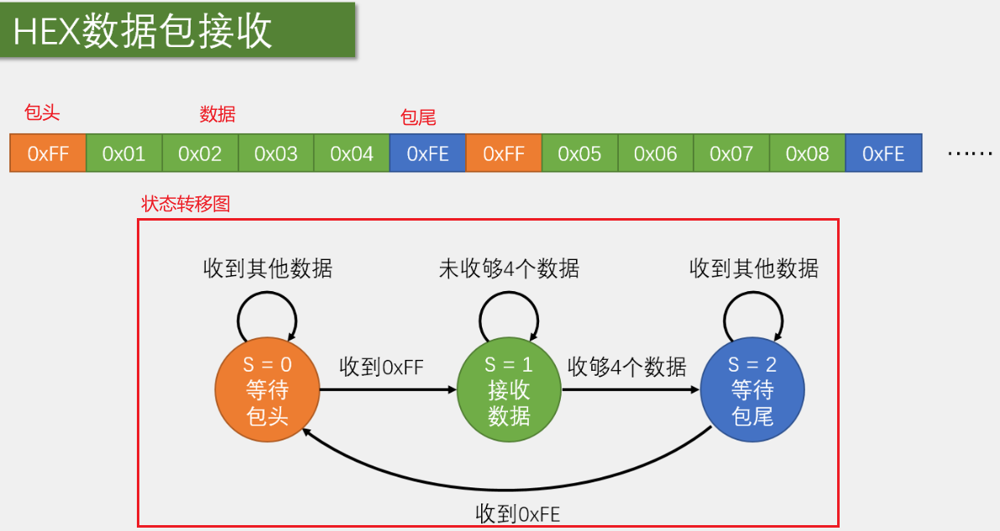

如上，定义三个状态，S的三个值代表三个状态；程序执行流程：

- 如果在第一个状态，收到的不是FF，那就仍然是0，不会进入下一状态，等待数据包包头的出现。
- S=0，进中断，进入第一个状态的程序，判断数据是不是包头FF，如果是代表收到包头，置S=1，退出中断。
- 下次再进中断，根据S=1，就可以进行接收数据的程序了，如果没收够数据就一直是接收状态，收够了就置S=2转向下一状态。
- S=2，等待包尾，置S=0，回到最初状态。

状态机思维，使用基本步骤：

- 先根据项目要求定义状态，画几个圈表示状态。
- 考虑好各个状态在什么情况下会转移，如何转移，画好线和转移条件。
- 根据图来编程。

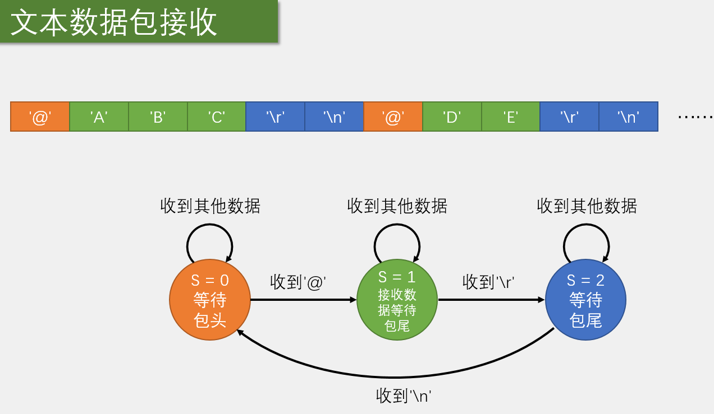

文本数据包的接收，数据包是可变的不是固定长度的，接收数据时需要时刻判断是不是包尾数据。

### HEX数据包发送与接收

```c
/* 初始化 */

uint8_t Serial_TXPacket[4]; // 用于发送数据包
uint8_t Serial_RxPacket[4]; // 用于接收数据包的区域
uint8_t Serial_RxFlag;      // 接收数据包的标志位

void Serial_Init(void)
{
	RCC_APB2PeriphClockCmd(RCC_APB2Periph_USART1, ENABLE);
	RCC_APB2PeriphClockCmd(RCC_APB2Periph_GPIOA, ENABLE);
	
	GPIO_InitTypeDef GPIO_InitStructure;
	GPIO_InitStructure.GPIO_Mode = GPIO_Mode_AF_PP;
	GPIO_InitStructure.GPIO_Pin = GPIO_Pin_9;
	GPIO_InitStructure.GPIO_Speed = GPIO_Speed_50MHz;
	GPIO_Init(GPIOA,&GPIO_InitStructure);
	
	GPIO_InitStructure.GPIO_Mode = GPIO_Mode_IPU;
	GPIO_InitStructure.GPIO_Pin = GPIO_Pin_10;
	GPIO_InitStructure.GPIO_Speed = GPIO_Speed_50MHz;
	GPIO_Init(GPIOA,&GPIO_InitStructure);
	
	USART_InitTypeDef USART_InitStructure;
	USART_InitStructure.USART_BaudRate = 9600;
	USART_InitStructure.USART_HardwareFlowControl = USART_HardwareFlowControl_None;
	USART_InitStructure.USART_Mode = USART_Mode_Tx | USART_Mode_Rx;
	USART_InitStructure.USART_Parity = USART_Parity_No;
	USART_InitStructure.USART_StopBits = USART_StopBits_1;
	USART_InitStructure.USART_WordLength = USART_WordLength_8b;
	USART_Init(USART1,&USART_InitStructure);
	
	USART_ITConfig(USART1,USART_IT_RXNE,ENABLE);
	NVIC_PriorityGroupConfig(NVIC_PriorityGroup_2);
	NVIC_InitTypeDef NVIC_InitStructure;
	NVIC_InitStructure.NVIC_IRQChannel = USART1_IRQn;
	NVIC_InitStructure.NVIC_IRQChannelCmd = ENABLE;
	NVIC_InitStructure.NVIC_IRQChannelPreemptionPriority = 1;
	NVIC_InitStructure.NVIC_IRQChannelSubPriority = 1;
	NVIC_Init(&NVIC_InitStructure);
	
	USART_Cmd(USART1, ENABLE);
}
```

```c
/* 发送HEX数据包 */
void Serial_SendByte(uint16_t Byte)
{
	USART_SendData(USART1, Byte);
	while(USART_GetFlagStatus(USART1,USART_FLAG_TXE)==RESET);
}
void Serial_SendArray(uint8_t* Array, uint16_t Length)
{
	uint16_t i;
	for(i = 0; i < Length; i++) {
		Serial_SendByte(Array[i]);
	}
}
  // 给Serial_TXPacket数组赋值，然后调用该函数发送定长数据包 
void Serial_SendPacket(void)
{
	Serial_SendByte(0xFF);
	Serial_SendArray(Serial_TXPacket, 4);
	Serial_SendByte(0xFE);
}
```

```c
/* 接收HEX数据包：使用中断，使用状态机 */
uint8_t Serial_GetRxFlag(void)
{
	if(Serial_RxFlag == 1) {
		Serial_RxFlag = 0;
		return 1;
	}
	return 0;
}
// 接收到的数据存储到Serial_RxPacket数组
void USART1_IRQHandler(void)
{
	static uint8_t RxState = 0;
	static uint8_t pRxPacket = 0;
	if (USART_GetITStatus(USART1, USART_IT_RXNE) == SET)
	{
		uint8_t RxData = USART_ReceiveData(USART1);
		if (RxState == 0)
		{
			if (RxData == 0xFF)
			{
				RxState = 1;
				pRxPacket = 0;
			}
		}
		else if (RxState == 1)
		{
			Serial_RxPacket[pRxPacket] = RxData;
			pRxPacket ++;
			if (pRxPacket >= 4)
			{
				RxState = 2;
			}
		}
		else if (RxState == 2)
		{
			if (RxData == 0xFE)
			{
				RxState = 0;
				Serial_RxFlag = 1;
			}
		}
		USART_ClearITPendingBit(USART1, USART_IT_RXNE);
	}
}
```

### 文本数据包的接收

USART初始化：

```c
char Serial_RxPacket[100];  // 接收字符
uint8_t Serial_RxFlag;      // 接收完成标志

void Serial_Init(void)
{
	RCC_APB2PeriphClockCmd(RCC_APB2Periph_USART1, ENABLE);
	RCC_APB2PeriphClockCmd(RCC_APB2Periph_GPIOA, ENABLE);
	
	GPIO_InitTypeDef GPIO_InitStructure;
	GPIO_InitStructure.GPIO_Mode = GPIO_Mode_AF_PP;
	GPIO_InitStructure.GPIO_Pin = GPIO_Pin_9;
	GPIO_InitStructure.GPIO_Speed = GPIO_Speed_50MHz;
	GPIO_Init(GPIOA,&GPIO_InitStructure);
	
	GPIO_InitStructure.GPIO_Mode = GPIO_Mode_IPU;
	GPIO_InitStructure.GPIO_Pin = GPIO_Pin_10;
	GPIO_InitStructure.GPIO_Speed = GPIO_Speed_50MHz;
	GPIO_Init(GPIOA,&GPIO_InitStructure);
	
	USART_InitTypeDef USART_InitStructure;
	USART_InitStructure.USART_BaudRate = 9600;
	USART_InitStructure.USART_HardwareFlowControl = USART_HardwareFlowControl_None;
	USART_InitStructure.USART_Mode = USART_Mode_Tx | USART_Mode_Rx;
	USART_InitStructure.USART_Parity = USART_Parity_No;
	USART_InitStructure.USART_StopBits = USART_StopBits_1;
	USART_InitStructure.USART_WordLength = USART_WordLength_8b;
	USART_Init(USART1,&USART_InitStructure);
	
	USART_ITConfig(USART1,USART_IT_RXNE,ENABLE);
	NVIC_PriorityGroupConfig(NVIC_PriorityGroup_2);
	NVIC_InitTypeDef NVIC_InitStructure;
	NVIC_InitStructure.NVIC_IRQChannel = USART1_IRQn;
	NVIC_InitStructure.NVIC_IRQChannelCmd = ENABLE;
	NVIC_InitStructure.NVIC_IRQChannelPreemptionPriority = 1;
	NVIC_InitStructure.NVIC_IRQChannelSubPriority = 1;
	NVIC_Init(&NVIC_InitStructure);
	
	USART_Cmd(USART1, ENABLE);
}
```

发送文本：

```c
void Serial_SendByte(uint16_t Byte)
{
	USART_SendData(USART1, Byte);
	while(USART_GetFlagStatus(USART1,USART_FLAG_TXE)==RESET);
}
/* 发送字符串 */
void Serial_SendString(char* String)
{
	uint16_t i;
	for(i = 0; String[i] != '\0'; i++) {
	
		Serial_SendByte(String[i]);
	
	}
}
```

接收数据包：

```c
/* 中断  状态机 */
void USART1_IRQHandler(void)
{
	static uint8_t RxState = 0;
	static uint8_t pRxPacket = 0;
	if (USART_GetITStatus(USART1, USART_IT_RXNE) == SET)
	{
		uint8_t RxData = USART_ReceiveData(USART1);
		
		if (RxState == 0)
		{
			if (RxData == '@' && Serial_RxFlag == 0)
			{
				RxState = 1;
				pRxPacket = 0;
			}
		}
		else if (RxState == 1)
		{
			if(RxData == '\r'){
				RxState = 2;
			}else{
				Serial_RxPacket[pRxPacket] = RxData;
				pRxPacket ++;
			}
		}
		else if (RxState == 2)
		{
			if (RxData == '\n')
			{
				RxState = 0;
				Serial_RxPacket[pRxPacket] = '\0';
				Serial_RxFlag = 1;
			}
		}
		USART_ClearITPendingBit(USART1, USART_IT_RXNE);
	}
}
```

main.c，测试：

```c
#include "string.h"

void LED1_Init(void)
{
	// 1.使用RCC开启GPIO的时钟
	RCC_APB2PeriphClockCmd(RCC_APB2Periph_GPIOA,ENABLE);
	// 2.1 结构体
	GPIO_InitTypeDef GPIO_InitStructuer;
	GPIO_InitStructuer.GPIO_Mode = GPIO_Mode_Out_PP;
	GPIO_InitStructuer.GPIO_Pin = GPIO_Pin_1;
	GPIO_InitStructuer.GPIO_Speed = GPIO_Speed_50MHz;
	// 2.2 初始化
	GPIO_Init(GPIOA,&GPIO_InitStructuer);
	GPIO_SetBits(GPIOA,GPIO_Pin_1);
		
}
int main(void){
	
	OLED_Init();
	Serial_Init();
	LED1_Init();
	while(1)
	{
		if(Serial_RxFlag == 1)
		{
			OLED_ShowString(1,1,"                ");
			OLED_ShowString(1,1,Serial_RxPacket);
			if(strcmp(Serial_RxPacket,"LED_ON") == 0){
				GPIO_ResetBits(GPIOA,GPIO_Pin_1); // 置0，低电平
				OLED_ShowString(1,1,"                ");
				Serial_SendString("LED_ON_OK\r\n");
			}
			if(strcmp(Serial_RxPacket,"LED_OFF") == 0){
				GPIO_SetBits(GPIOA,GPIO_Pin_1);
				OLED_ShowString(1,1,"                ");
				Serial_SendString("LED_OFF_OK\r\n");
			}
			Serial_RxFlag = 0;
		}
	
	}
}
```

# $I^2C$

$I^2C$通信：1、协议规则，通过软件模拟的形式实现协议来学习$I^2C$；2、STM32的$I^2C$外设，使用硬件来实现协议来学习$I^2C$。

- $I^2C$（Inter IC Bus）是由Philips公司开发的一种**通用数据总线**。
- 两根通信线：SCL（Serial Clock）、SDA（Serial Data）。
- 同步，半双工。
- 带数据应答。
- 支持总线挂载多设备（一主多从、多主多从）。

通信协议，需要在硬件和软件上做出规定：

- 硬件规定内容：电路连接、端口输入输出模式等。
- 软件规定内容：时序定义、字节传输规定、完整时序的组成部分等。

## $I^2C$硬件规定

$I^2C$的电路部分，$I^2C$一主多从的典型电路模型：（主机有总线控制权，从机在主机允许后才有控制权）

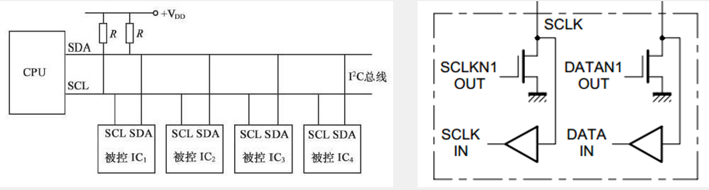

为了避免CPU输出高电平时从机输出低电平造成的电源短路问题，$I^2C$设计禁止所有设备输出强上拉的高电平，采用外置弱上拉电阻加开漏输出的电路结构。

- 所有I2C设备的SCL连在一起，SDA连在一起。
- 设备的SCL和SDA均要配置成开漏输出模式。
- SCL和SDA各添加一个上拉电阻，阻值一般为4.7KΩ左右。

CPU和被控IC的内部结构如右图，输出采用开漏输出——SCLK输出低电平时DATA路下管导通输出低电平，输出高电平时下管断开引脚处于浮空状态，因此只能输出低电平而不能输出高电平；为了避免SCLK输出高电平造成的引脚浮空，通过外接上拉电阻来将引脚电平拉到高电平。（杜绝电源短路，保证电路安全；避免了引脚模式的频繁切换，开漏加弱上拉的模式同时兼具了输入和输出功能——想要输出，就操作引脚高低电平变化；想要输入，就观测引脚高低电平变化。）

开漏模式下，输出高电平相当于断开引脚，所以在输入前直接输出高电平断开引脚，不需要切换成输入模式。（如右边的IC、CPU结构图，如果高电平，那么DATAN1 OUT那就断开了，就会进入了DATA IN，就是输入模式了）

“线与”现象：开漏加上拉模式下，只要有任意一个或多个设备输出了低电平，总线就处于低电平；只有所有的设备都输出高电平，总线才处于高电平。可以利用这个特征执行多主机模式下的时钟同步和总线仲裁，所以即使SCL可以使用推挽输出但仍然使用开漏输出，就是为了利用这个特征。


## $I^2C$软件规定

### $I^2C$的时序设计

**$I^2C$规定的时序基本单元：**

- 起始条件：SCL高电平期间，SDA从高电平切换到低电平。（从机捕获到SCL高电平，SDA下降沿信号时，就会进行自身的复位等待主机的召唤 ，下降沿结束后主机又会把SCL拽下来，一方面是占用这个总线，另一方面也是为了方便基本单元的拼接，也就是保证除了起始和终止条件，每个时序单元的SCL都是以低电平开始低电平结束，这样这些单元拼接起来，SCL才续得上）
- 终止条件：SCL高电平期间，SDA从低电平切换到高电平。
- 起始和终止由主机产生，从机不允许产生。

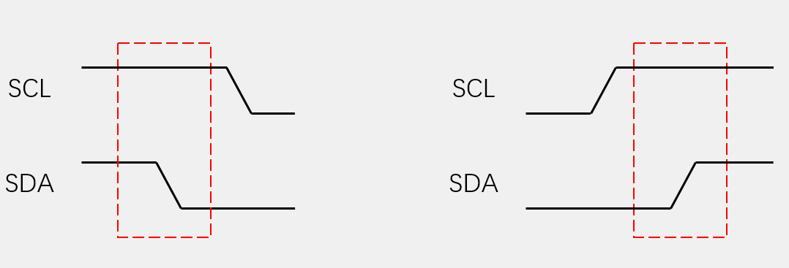

起始条件之后，便可以紧跟着一个发送一个字节的时序单元。

**主机发送一个字节：**

如何发送一个字节：SCL低电平期间，主机将数据位依次放到SDA线上**（高位先行）**，然后释放SCL，从机将在SCL高电平期间读取数据位，所以SCL高电平期间SDA不允许有数据变化，依次循环上述过程8次，即可发送一个字节。。图示如下：**（SCL低电平→主机放数据到SDA，SCL高电平→从机读数据）**

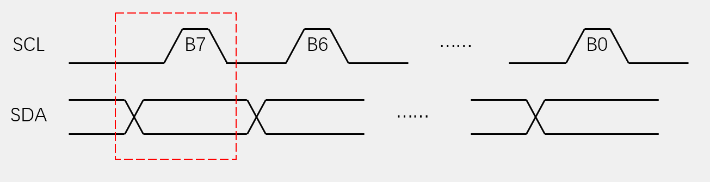

起始条件之后，第一个字节必须是主机发送的，主机如何发送？发送步骤如下：（高位先行）

1. 最开始SCL低电平，主机如果想发送0，那么就拉低SDA到低电平，如果想发送1就放手——SDA回弹到高电平。
2. 当这一位放好好，主机松手时钟线，SCL回弹到高电平（B7那），高电平期间是从机读取SDA的时候，因此高电平期间SDA不允许变化，一般SCL升到高电平前的上升沿的一半从机就已经读好了，然后一段时间后SCL恢复低电平（B7后低电平）就可以传输下一位了，因此主机也需要在SCL下降沿（B7后下降沿）之后尽快把数据放到SDA上（主机有时钟控制器，只需要在低电平的任意一刻将数据放在SDA上就行了）。
3. 主机再次将数据放完后，主机再松手SCL，SCL高电平→从机读数据，依次循环往复进行数据的发送。 

有时钟线进行同步，如果主机一个字节只发一半就进入了中断，那么时序状态会被保留，等中断结束后主机回来继续操作。

以上时序里，SCL、SDA全程由主机掌控，从机只能被动读取。

**主机接收一个字节：**

如何接收一个字节：SCL低电平期间，从机将数据位依次放到SDA线上（高位先行），然后释放SCL，主机将在SCL高电平期间读取数据位，所以SCL高电平期间SDA不允许有数据变化，依次循环上述过程8次，即可接收一个字节（如果是主机接收，那么主机在接收之前，需要释放SDA）。图示如下：**（SCL低电平→从机放数据到SDA，SCL高电平→主机读数据）**

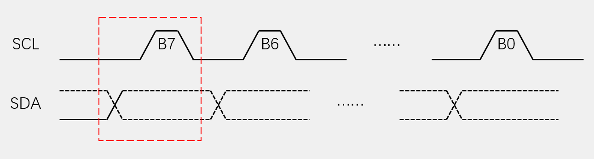

如何理解主机接收前需要释放SDA？所有设备包括主机都始终处于输入模式，当主机需要发送的时候，就可以主动去拉低SDA；而主机在被动接收时就必须先释放SDA，不要动SDA，以免影响到从机发送的数据，因为总线是“线与”的特征，任何一个设备拉低了总线就都是低电平，如果主机接收时还拽着SDA不放手，那从机无论发什么数据总线都一直都是低电平。

主机接收字节时：

1. 主机在接收前释放SDA，将SDA控制器交给从机。
2. 从机发送0，就把SDA拉低，发送1，就把SDA回弹到高电平。
3. SCL低电平，从机放数据；SCL高电平，主机读数据。

SCL时钟由主机控制，所以从机的数据变换都是贴着SCL的下降沿进行的。

**$I^2C$的应答机制：**

- 发送应答：**主机在接收完**一个字节之后，在下一个时钟**发送一位数据**，数据0表示应答，数据1表示非应答。
- 接收应答：**主机在发送完**一个字节之后，在下一个时钟**接收一位数据**，判断从机是否应答，数据0表示应答，数据1表示非应答（主机在接收之前，需要释放SDA）。

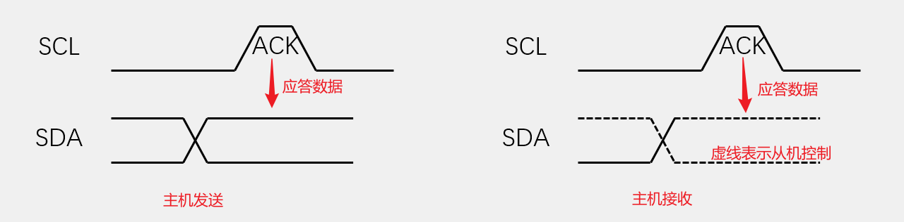

调用发送一个字节后就要紧跟着调用用来接收应答的时序来判断从机有没有收到主机发来的数据，如果从机收到了那么在应答位这里，主机释放SDA的时候，从机立刻把SDA拉下到低电平—0—应答，然后SCL高电平期间主机读取应答位进行判断。

> 何立民《I2C总线应用系统设计》：“应答信号在第9个时钟上出现，接收器输出低电平为应答信号（A），输出高电平则为非应答信号 （/A）”，“由于某种原因，被控器不产生应答时，如被控器正在进行其它处理无法接收总线上的数据时，必须释放总线，将数据线置高电平，然后主控器可通过产生一个停止信号信号来比终止数据传输。”“当主控器接收数据时接收到最后一个数据字节后，必须给被控器发送一个非应答位（/A），使被控器发送器释放数 据线，以便主控制（注：应当是主控器，不是主控制）发送停止信号从而终止数据传输。”

应答的发送由数据接收端发送，应答的接收由数据发送端接收。被应答就是接收端还需要我发送数据，不被应答就是接收端不稀罕我发送的数据，不需要，叫我停止骚扰——不想要你的数据，然后发送端就乖乖滴释放SDA的控制权，不去干扰。

### $I^2C$完整时序

拼接时序单元，组成完整的数据帧。$I^2C$的完整时序，主要有指定地址写、当前地址读、指定地址读三种。

$I^2C$一主多从模型中，主机可以访问总线上的任何一个设备，那如何发送指令来确定访问的是哪一个呢？这就需要把每个从设备都确定一个唯一的设备地址，从机设备地址相当于每个设备的名字，主机在起始条件之后，要先发送一个字节叫一下从机名字，所有从机都会收到这个字节并和自己的名字进行比较，如果不一样的从机就不会参与响应时序，如果一样的则会响应之后主机的读写操作。

同一$I^2C$总线里，挂载的每个设备的地址都必须不一样。

从机设备地址，$I^2C$协议标准里分为7位地址和10位地址，7位地址比较简单且应用范围最广。

每个$I^2C$设备出厂时，厂方都会为这些设备分配好一个7位地址（查看芯片手册可以知道），一般不同型号的地址都不一样；如果$I^2C$设备的地址出现了一样的，可以通过地址的可变部分来改变。

$I^2C$时序——指定地址写：对于指定设备（Slave Address），在指定地址（Reg Address）下，写入指定数据（Data）。

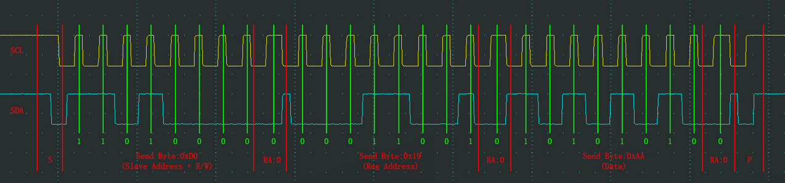


$I^2C$时序——当前地址读：对于指定设备（Slave Address），在当前地址指针指示的地址下，读取从机数据（Data）。

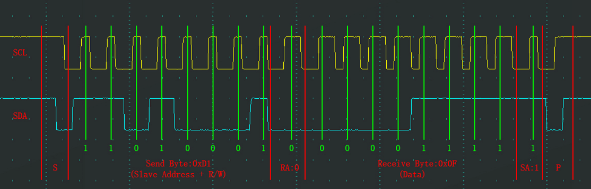


$I^2C$时序——指定地址读：对于指定设备（Slave Address），在指定地址（Reg Address）下，读取从机数据（Data）。（指定地址写，然后立刻当前地址读（指定地址写只指定了地址还来不及写就进入了当前读），就是指定地址读）

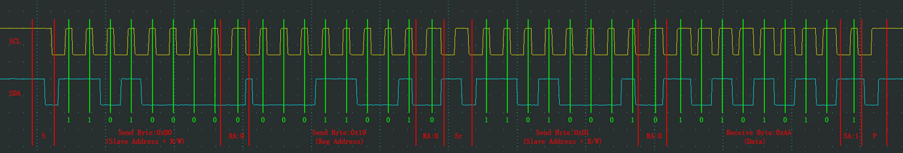

起始条件 → 指定从机地址与读写操作（第一个字节） → 应答 → 指定地址（第二个字节），会写入从机地址指针 → Sr重复起始条件 → 重新寻址并指定读写标志位 → 接收。

**时序与时序的拼接(~_~)**

$I^2C$规定的完整数据帧：一个完整的数据帧是起始条件到终止条件，起始条件和终止条件之间可以重复起始条件。

**指定地址写、指定地址读用得比较多。**


## MPU6050芯片


## $I^2C$软件实现

程序模块：

1. $I^2C$通信层模块：$I^2C$使用的GPIO口的初始化（使用两个IO口充当SDA、SCLK，任何两个IO口都可以）、$I^2C$的六个时序基本模块（起始、终止、发送1字节、接收1字节、发送应答、接收应答）。
2. MPU6050模块：通过$I^2C$通信层模块实现指定地址读、指定地址写，写寄存器对芯片进行配置、读存储器得到传感器数据。
3. 主调用模块：初始化，拿数据，显示数据。

### $I^2C$通信层模块

`MyI2C.c`：

```c
#include "stm32f10x.h"                  // Device header
#include "Delay.h"

void MyI2C_W_SCL(uint8_t BitValue)
{
	GPIO_WriteBit(GPIOB,GPIO_Pin_10,(BitAction)BitValue);
	Delay_us(10);
}
void MyI2C_W_SDA(uint8_t BitValue)
{
	GPIO_WriteBit(GPIOB,GPIO_Pin_11,(BitAction)BitValue);
	Delay_us(10);
}
uint8_t MyI2C_R_SDA(void)
{
	uint8_t BitValue;
	BitValue = GPIO_ReadInputDataBit(GPIOB, GPIO_Pin_11);
	Delay_us(10);
	return BitValue;
}
void MyI2C_Init(void)
{
	RCC_APB2PeriphClockCmd(RCC_APB2Periph_GPIOB,ENABLE);
	
	GPIO_InitTypeDef GPIO_InitStructure;
	GPIO_InitStructure.GPIO_Mode = GPIO_Mode_Out_OD;
	GPIO_InitStructure.GPIO_Pin = GPIO_Pin_10 | GPIO_Pin_11;
	GPIO_InitStructure.GPIO_Speed = GPIO_Speed_50MHz;
	GPIO_Init(GPIOB,&GPIO_InitStructure);
	GPIO_SetBits(GPIOB,GPIO_Pin_10 | GPIO_Pin_11);
}
/* 起始条件：SDA由高置低，SCL高，待SDA置低完成后SCL也置低 */
void MyI2C_Start(void)
{
	MyI2C_W_SDA(1); // 先SDA，为了兼容起始条件和重复起始条件
	MyI2C_W_SCL(1);
	MyI2C_W_SDA(0);
	MyI2C_W_SCL(0);
}
/* 终止条件：SCL置高，SDA在SCL高电平期间由低置高 */
void MyI2C_Stop(void)
{
	MyI2C_W_SDA(0); // 先拉低SDA
	MyI2C_W_SCL(1);
	MyI2C_W_SDA(1);
}
/* 发送一个字节：高位先行，发送1时SDA置1,0时SDA置0 */
void MyI2C_SendByte(uint8_t Byte)
{
	uint8_t i;
	for(i = 0; i < 8; i++)
	{
		MyI2C_W_SDA(Byte & (0x80 >> i));  // 起始条件后SCL为低电平，可放数据到SDA
		MyI2C_W_SCL(1); //  SCL高电平，读取
		MyI2C_W_SCL(0); //  SCL恢复低电平，恢复数据写入
	}
}
/* 接收一个字节： */
uint8_t MyI2C_ReceiveByte(void)
{
	uint8_t Byte = 0x00;
	uint8_t i;
	MyI2C_W_SDA(1);        // 释放SDA
	for(i = 0; i < 8; i++)
	{
		MyI2C_W_SCL(1);    // SCL置高，开始读取
		if(MyI2C_R_SDA() == 1) {Byte |= (0x80>>i);}
		MyI2C_W_SCL(0);     // 读取结束
	}
	return Byte;
}
/* 发送一个应答： */
void MyI2C_SendAck(uint8_t AckBit)
{

	MyI2C_W_SDA(AckBit);  
	MyI2C_W_SCL(1); // 读取应答
	MyI2C_W_SCL(0); // 进入下一个时序单元

}
/* 接收一个应答： */
uint8_t MyI2C_ReceiveAck(void)
{
	uint8_t AckBit;
	MyI2C_W_SDA(1);		// 释放SDA
	MyI2C_W_SCL(1);		// SCL置高，开始读取
	AckBit = MyI2C_R_SDA(); 
	MyI2C_W_SCL(0);     // 读取结束，恢复低电平
	return AckBit;
}
```

测试：

```c
#include "stm32f10x.h"                  // Device header
#include "Delay.h"
#include "OLED.h"
#include "MyI2C.h"

int main(void){
	OLED_Init();
	MyI2C_Init();
	/* 点名时序 */
	MyI2C_Start();
	MyI2C_SendByte(0xD0);   // 0xD0，6050的地址，会应答，ACK为0
	// MyI2C_SendByte(0xA0); // 0xA0，总线上没有挂载这个设备，不会应答，ACK为1
	uint8_t Ack = MyI2C_ReceiveAck();
	MyI2C_Stop();
	OLED_ShowString(1,1,"ACK:");
	OLED_ShowNum(1,5,Ack,3);
	while(1){}
}
```

### MPU6050模块

主要读写功能实现：

```c
#include "stm32f10x.h"                  // Device header
#include "MyI2C.h"
#include "MPU6050_Reg.h"
#define MPU6050_ADDRESS 0xD0

/* 指定地址写一个字节的实现 */
void MPU6050_WriteReg(uint8_t RegAddress, uint8_t Data)
{
	MyI2C_Start();
	MyI2C_SendByte(MPU6050_ADDRESS); 
	MyI2C_ReceiveAck();
	MyI2C_SendByte(RegAddress); // 指定写入寄存器地址
	MyI2C_ReceiveAck();
	// 进阶：指定地址写多个字节，可以使用for循环发送多个字节数据
	MyI2C_SendByte(Data); 
	MyI2C_ReceiveAck();
	MyI2C_Stop();
}
/* 指定地址读一个字节的实现 */
uint8_t MPU6050_ReadReg(uint8_t RegAddress)
{
	uint8_t Data;
	MyI2C_Start();
	MyI2C_SendByte(MPU6050_ADDRESS); 
	MyI2C_ReceiveAck();
	MyI2C_SendByte(RegAddress);
	MyI2C_ReceiveAck();
	
	MyI2C_Start();
	MyI2C_SendByte(MPU6050_ADDRESS | 0x01);  // 最低位决定读写，1-读
	MyI2C_ReceiveAck();
	
	// 如果想指定地址读多个字节，可以使用for循环将这两端包起来重复读取
	Data = MyI2C_ReceiveByte(); 
	MyI2C_SendAck(1);
	MyI2C_Stop();
	
	return Data;
}

void MPU6050_Init(void)
{
	MyI2C_Init();
	// 在电源管理寄存器1写入0x01，解除睡眠模式，选用陀螺仪时钟
	MPU6050_WriteReg(0x6B,0x01);
	MPU6050_WriteReg(0x6C,0x00);
	MPU6050_WriteReg(0x19,0x09);
	MPU6050_WriteReg(0x1A,0x06);
	MPU6050_WriteReg(0x1B,0x18);
	MPU6050_WriteReg(0x1c,0x18);
	
}
```

测试：

```c
int main(void){
	
	OLED_Init();
	MPU6050_Init();
	MPU6050_WriteReg(0x19,0xAA); // 往MPU6050的寄存器写入一个数据
	Mint8_t id = MPU6050_ReadReg(0x75); // 读取0x75寄存器，获取MPU6050型号
    OLED_ShowString(1,1,"ID:");
	MLED_ShowHexNum(1,3,id,2);
	Mint8_t val = MPU6050_ReadReg(0x19); // 读取MPU6050的0x19寄存器的值
	MLED_ShowHexNum(2,1,val,2);
	while(1)
	{}
}
```


利用读写操作读取MPU6050内数据：

```c
/* 读取MPU6050的数据 */
void MPU6050_GetData(int16_t* AccX,int16_t* AccY,int16_t* AccZ,int16_t* GyroX,int16_t* GyroY,int16_t* GyroZ)
{
	uint16_t DataH,DataL;
	DataH = MPU6050_ReadReg(MPU6050_ACCEL_XOUT_H);
	DataL = MPU6050_ReadReg(MPU6050_ACCEL_XOUT_L);
	*AccX = (DataH << 8) | DataL;
	
	DataH = MPU6050_ReadReg(MPU6050_ACCEL_YOUT_H);
	DataL = MPU6050_ReadReg(MPU6050_ACCEL_YOUT_L);
	*AccY = (DataH << 8) | DataL;
	
	DataH = MPU6050_ReadReg(MPU6050_ACCEL_ZOUT_H);
	DataL = MPU6050_ReadReg(MPU6050_ACCEL_ZOUT_L);
	*AccZ = (DataH << 8) | DataL;
	
	DataH = MPU6050_ReadReg(MPU6050_GYRO_XOUT_H);
	DataL = MPU6050_ReadReg(MPU6050_GYRO_XOUT_L);
	*GyroX = (DataH << 8) | DataL;
	
	DataH = MPU6050_ReadReg(MPU6050_GYRO_YOUT_H);
	DataL = MPU6050_ReadReg(MPU6050_GYRO_YOUT_L);
	*GyroY = (DataH << 8) | DataL;
	
	DataH = MPU6050_ReadReg(MPU6050_GYRO_ZOUT_H);
	DataL = MPU6050_ReadReg(MPU6050_GYRO_ZOUT_L);
	*GyroZ = (DataH << 8) | DataL;

}
```

测试：

```c

int16_t AX,AY,AZ,GX,GY,GZ;

int main(void){
	OLED_Init();
	OLED_ShowString(1,1,"ID:");
	MPU6050_Init();
	while(1)
	{
		OLED_ShowHexNum(1,4,MPU6050_ReadReg(0x75),2);
		MPU6050_GetData(&AX,&AY,&AZ,&GX,&GY,&GZ);
		OLED_ShowSignedNum(2,1,AX,5);
		OLED_ShowSignedNum(3,1,AY,5);
		OLED_ShowSignedNum(4,1,AZ,5);
		OLED_ShowSignedNum(2,8,GX,5);
		OLED_ShowSignedNum(3,8,GX,5);
		OLED_ShowSignedNum(4,8,GX,5);
	}
}
```

MPU6050的寄存器地址的宏定义：

```c
#ifndef __MPU6050_REG_H__
#define __MPU6050_REG_H__

#define	MPU6050_SMPLRT_DIV		0x19
#define	MPU6050_CONFIG			0x1A
#define	MPU6050_GYRO_CONFIG		0x1B
#define	MPU6050_ACCEL_CONFIG	0x1C

#define	MPU6050_ACCEL_XOUT_H	0x3B
#define	MPU6050_ACCEL_XOUT_L	0x3C
#define	MPU6050_ACCEL_YOUT_H	0x3D
#define	MPU6050_ACCEL_YOUT_L	0x3E
#define	MPU6050_ACCEL_ZOUT_H	0x3F
#define	MPU6050_ACCEL_ZOUT_L	0x40
#define	MPU6050_TEMP_OUT_H		0x41
#define	MPU6050_TEMP_OUT_L		0x42
#define	MPU6050_GYRO_XOUT_H		0x43
#define	MPU6050_GYRO_XOUT_L		0x44
#define	MPU6050_GYRO_YOUT_H		0x45
#define	MPU6050_GYRO_YOUT_L		0x46
#define	MPU6050_GYRO_ZOUT_H		0x47
#define	MPU6050_GYRO_ZOUT_L		0x48

#define	MPU6050_PWR_MGMT_1		0x6B
#define	MPU6050_PWR_MGMT_2		0x6C
#define	MPU6050_WHO_AM_I		0x75

#endif

```


## $I^2C$硬件实现

STM32内部集成了硬件$I^2C$收发电路，可以**由硬件自动执行时钟生成、起始终止条件生成、应答位收发、数据收发等功能**，减轻CPU的负担。STM32的$I^2C$外设：

- 支持多主机模型。
- 支持7位/10位地址模式。
- 支持不同的通讯速度，标准速度(高达100 kHz)，快速(高达400 kHz)。
- 支持DMA。
- 兼容SMBus协议。
- STM32F103C8T6 硬件$I^2C$资源：I2C1、I2C2。

### 外设框图

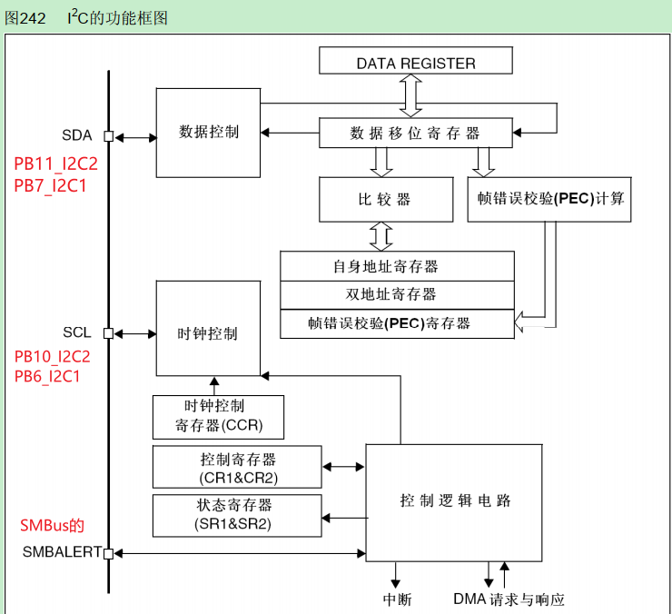

1、发送：把一个字节的数据写到DATA REGISTER，当移位数据寄存器没有数据移位时，DR的值会转到移位寄存器里，移位时可以将要发送的下一个数据放到DR，一旦数据移位寄存器里的数据移位完成，下一个数据无缝衔接到移位寄存器里继续发送。

- DR的值转到数据移位寄存器时会置状态寄存器的TXE位为1，表示DR为空。

2、接收：输入的数据一位一位地从引脚移入到移位寄存器里，当一个数据收集完成之后就会从数据移位寄存器转到DR中，同时置标志位RXNE，表示接收寄存器（即DR）非空。

3、收发控制：有控制寄存器CR。

4、自身地址寄存器：STM32可作为从机，自身地址寄存器就是为这个设计的。

5、帧错误校验：数据校验，当发送多数据帧时在这里硬件可以自动执行CRC校验计算。

基本框图：

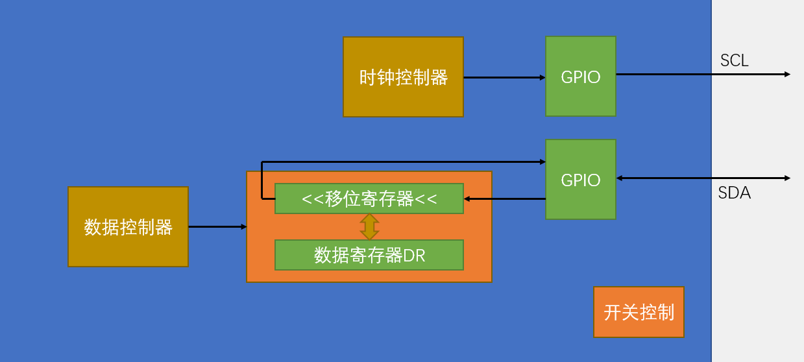

使用复用输出输入模式，接上片上外设。

### 发送接收流程

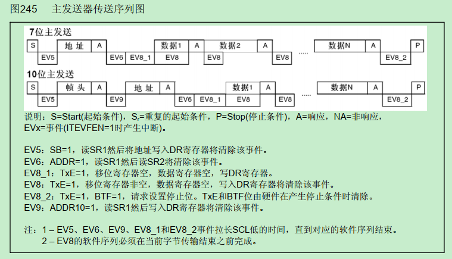

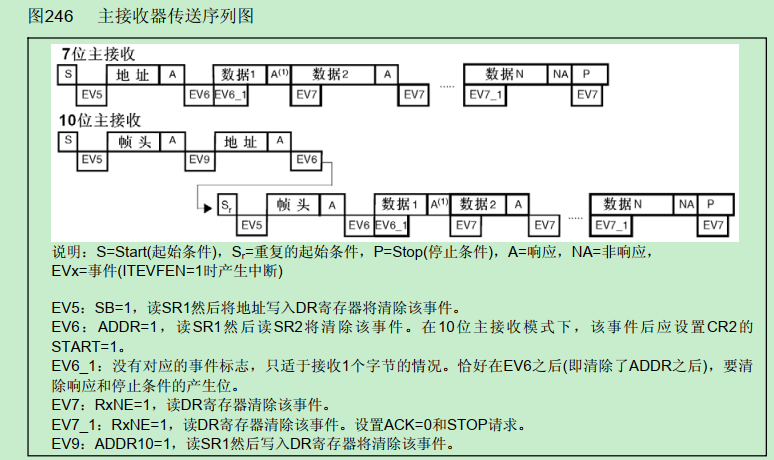

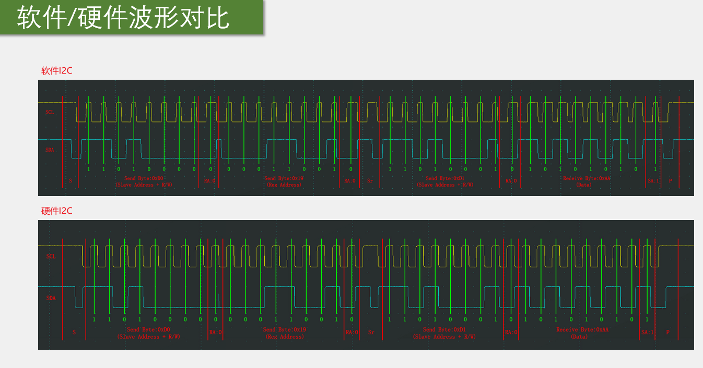

### 函数原型说明

```c
// 生成起始与终止条件
void I2C_GenerateSTART(I2C_TypeDef* I2Cx, FunctionalState NewState);
void I2C_GenerateSTOP(I2C_TypeDef* I2Cx, FunctionalState NewState);
```

```c
// 应答配置
void I2C_AcknowledgeConfig(I2C_TypeDef* I2Cx, FunctionalState NewState);
```

```c
// 发送数据
void I2C_SendData(I2C_TypeDef* I2Cx, uint8_t Data);
// 接收数据
uint8_t I2C_ReceiveData(I2C_TypeDef* I2Cx);
```

```c
// 发送7位地址
void I2C_Send7bitAddress(I2C_TypeDef* I2Cx, uint8_t Address, uint8_t I2C_Direction);
```


### $I^2C$外设的使用

1. 第一步：配置I2C外设，初始化。
2. 第二步：控制电路，实现指定地址写。
3. 第三步：控制电路，实现指定地址读。

初始化I2C2：

```c
void MySTM32I2C_Init(void)
{
	RCC_APB1PeriphClockCmd(RCC_APB1Periph_I2C2,ENABLE);
	RCC_APB2PeriphClockCmd(RCC_APB2Periph_GPIOB,ENABLE);
	
	GPIO_InitTypeDef GPIO_InitStructure;
	GPIO_InitStructure.GPIO_Mode = GPIO_Mode_AF_OD;
	GPIO_InitStructure.GPIO_Pin = GPIO_Pin_10 | GPIO_Pin_11;
	GPIO_InitStructure.GPIO_Speed = GPIO_Speed_50MHz;
	GPIO_Init(GPIOB,&GPIO_InitStructure);
	
	I2C_InitTypeDef I2C_InitStructure;
	I2C_InitStructure.I2C_Mode = I2C_Mode_I2C;
	I2C_InitStructure.I2C_ClockSpeed = 50000;
	// 时钟占空比，时钟频率超过100kHz，进入到快速状态才有用
	I2C_InitStructure.I2C_DutyCycle = I2C_DutyCycle_2;
	I2C_InitStructure.I2C_Ack = I2C_Ack_Enable;
	I2C_InitStructure.I2C_AcknowledgedAddress = I2C_AcknowledgedAddress_7bit;
	I2C_InitStructure.I2C_OwnAddress1 = 0x00;
	I2C_Init(I2C2,&I2C_InitStructure);
	
	I2C_Cmd(I2C2,ENABLE);
}
```

使用硬件I2C指定地址写：（结合主发送器传送序列）

```c
#define MPU6050_ADDRESS 0xD0
/* 指定地址写一个字节的实现 */
void MPU6050_WriteReg(uint8_t RegAddress, uint8_t Data)
{
	
	I2C_GenerateSTART(I2C2, ENABLE);
	while(I2C_CheckEvent(I2C2,I2C_EVENT_MASTER_MODE_SELECT) != SUCCESS);
	
	I2C_Send7bitAddress(I2C2,MPU6050_ADDRESS,I2C_Direction_Transmitter);
	while(I2C_CheckEvent(I2C2,I2C_EVENT_MASTER_TRANSMITTER_MODE_SELECTED) != SUCCESS);
	
	I2C_SendData(I2C2,RegAddress);
	while(I2C_CheckEvent(I2C2,I2C_EVENT_MASTER_BYTE_TRANSMITTING) != SUCCESS);
	
	I2C_SendData(I2C2,Data);
	while(I2C_CheckEvent(I2C2,I2C_EVENT_MASTER_BYTE_TRANSMITTED) != SUCCESS);
	
	I2C_GenerateSTOP(I2C2, ENABLE);
}
```

使用硬件I2C指定地址读：（结合主接收器传送序列）

```c
#define MPU6050_ADDRESS 0xD0

/* 计次记时，超时推出机制——带有超时推出的while循环 */
void MPU6050_WaitEvent(I2C_TypeDef* I2Cx, uint32_t I2C_EVENT)
{
	uint32_t Timeout;
	Timeout = 10000;
	while (I2C_CheckEvent(I2Cx, I2C_EVENT) != SUCCESS)
	{
		Timeout --;
		if (Timeout == 0)
		{
			// 实际项目中，分析评估后这里加上一些错误需要的处理
			break;
		}
	}
}
/* 指定地址读一个字节的实现 */
uint8_t MPU6050_ReadReg(uint8_t RegAddress)
{
	uint8_t Data;

	I2C_GenerateSTART(I2C2, ENABLE);
	MPU6050_WaitEvent(I2C2, I2C_EVENT_MASTER_MODE_SELECT);
	
	I2C_Send7bitAddress(I2C2, MPU6050_ADDRESS, I2C_Direction_Transmitter);
	MPU6050_WaitEvent(I2C2, I2C_EVENT_MASTER_TRANSMITTER_MODE_SELECTED);
	
	I2C_SendData(I2C2, RegAddress);
	MPU6050_WaitEvent(I2C2, I2C_EVENT_MASTER_BYTE_TRANSMITTED);
	
	I2C_GenerateSTART(I2C2, ENABLE);
	MPU6050_WaitEvent(I2C2, I2C_EVENT_MASTER_MODE_SELECT);
	
	I2C_Send7bitAddress(I2C2, MPU6050_ADDRESS, I2C_Direction_Receiver);
	MPU6050_WaitEvent(I2C2, I2C_EVENT_MASTER_RECEIVER_MODE_SELECTED);
	
	I2C_AcknowledgeConfig(I2C2, DISABLE);
	I2C_GenerateSTOP(I2C2, ENABLE);
	
	MPU6050_WaitEvent(I2C2, I2C_EVENT_MASTER_BYTE_RECEIVED);
	Data = I2C_ReceiveData(I2C2);
	
	I2C_AcknowledgeConfig(I2C2, ENABLE);
	return Data;
}
```

MPU6050：

```c
void MPU6050_Init(void)
{
	MySTM32I2C_Init();
	// 在电源管理寄存器1写入0x01，解除睡眠模式，选用陀螺仪时钟
	MPU6050_WriteReg(0x6B,0x01);
	MPU6050_WriteReg(0x6C,0x00);
	MPU6050_WriteReg(0x19,0x09);
	MPU6050_WriteReg(0x1A,0x06);
	MPU6050_WriteReg(0x1B,0x18);
	MPU6050_WriteReg(0x1c,0x18);
	
}
/* 读取MPU6050的数据 */
void MPU6050_GetData(int16_t* AccX,int16_t* AccY,int16_t* AccZ,int16_t* GyroX,int16_t* GyroY,int16_t* GyroZ)
{
	uint16_t DataH,DataL;
	DataH = MPU6050_ReadReg(MPU6050_ACCEL_XOUT_H);
	DataL = MPU6050_ReadReg(MPU6050_ACCEL_XOUT_L);
	*AccX = (DataH << 8) | DataL;
	
	DataH = MPU6050_ReadReg(MPU6050_ACCEL_YOUT_H);
	DataL = MPU6050_ReadReg(MPU6050_ACCEL_YOUT_L);
	*AccY = (DataH << 8) | DataL;
	
	DataH = MPU6050_ReadReg(MPU6050_ACCEL_ZOUT_H);
	DataL = MPU6050_ReadReg(MPU6050_ACCEL_ZOUT_L);
	*AccZ = (DataH << 8) | DataL;
	
	DataH = MPU6050_ReadReg(MPU6050_GYRO_XOUT_H);
	DataL = MPU6050_ReadReg(MPU6050_GYRO_XOUT_L);
	*GyroX = (DataH << 8) | DataL;
	
	DataH = MPU6050_ReadReg(MPU6050_GYRO_YOUT_H);
	DataL = MPU6050_ReadReg(MPU6050_GYRO_YOUT_L);
	*GyroY = (DataH << 8) | DataL;
	
	DataH = MPU6050_ReadReg(MPU6050_GYRO_ZOUT_H);
	DataL = MPU6050_ReadReg(MPU6050_GYRO_ZOUT_L);
	*GyroZ = (DataH << 8) | DataL;

}
```


# SPI

- SPI（Serial Peripheral Interface）是由Motorola公司开发的一种通用数据总线。
- 四根通信线：SCK（Serial Clock）、MOSI（Master Output Slave Input）、MISO（Master Input Slave Output）、SS（Slave Select）。
- 同步，全双工。
- 支持总线挂载多设备（一主多从）。

SPI传输更快，SPI协议没有严格规定最大传输速度，最大传输速度取决于芯片产商的设计需求；SPI硬件开销大，通信线个数比较多，通信工程中经常会出现资源浪费的现象。

## SPI硬件电路

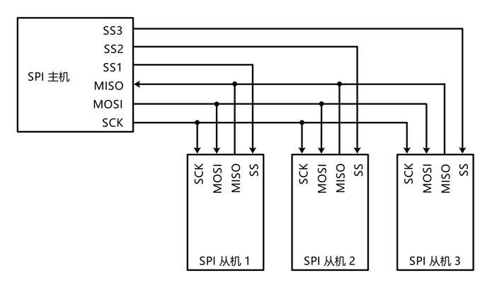

- 所有SPI设备的SCK、MOSI、MISO分别连在一起。
- 主机另外引出多条SS控制线，分别接到各从机的SS引脚。
- 输出引脚配置为推挽输出，输入引脚配置为浮空或上拉输入。
- 从机未被选中时其MISO必须设置为高阻态。


## 移位示意图

移位示意图，SPI设计的核心，SPI的基本收发电路，使用了这样一个移位模型：

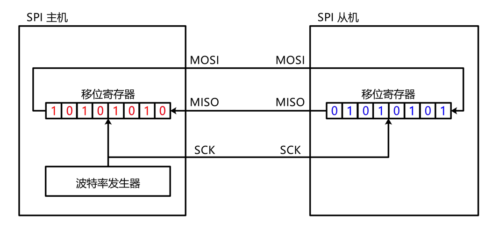

上升沿向左移位，将最高位数据放到通信线上；下降沿，采样输入到主机、从机最低位。循环这个过程，就将从机的数据发到了主机，主机的数据发到了从机。（一般在接收时，会同一发送0x00或0xFF去到从机来置换数据）

## SPI时序

1、时序基本单元——起始、终止条件：

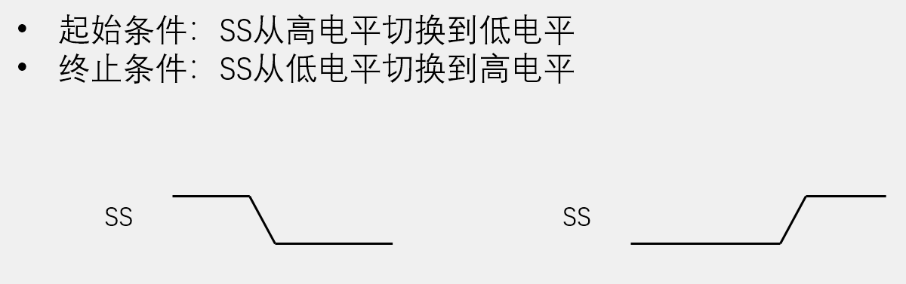

2、时序基本单元——交换一个字节（模式0）：（CPOL——Clock Polarity，时钟极性；CPHA——Clock Phase，时钟相位）

- CPOL=0：表示空闲状态时，SCK为低电平。
- CPHA=0：表示SCK第一个边沿移入数据，第二个边沿移出数据。

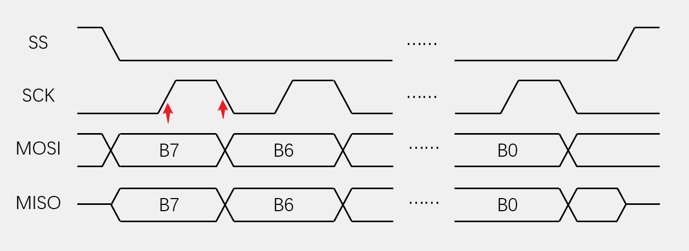


3、时序基本单元——交换一个字节（模式1）：（CPOL——Clock Polarity，时钟极性；CPHA——Clock Phase，时钟相位）

- CPOL=0：表示空闲状态时，SCK为低电平。
- CPHA=1：表示SCK第一个边沿移出数据，第二个边沿移入数据。

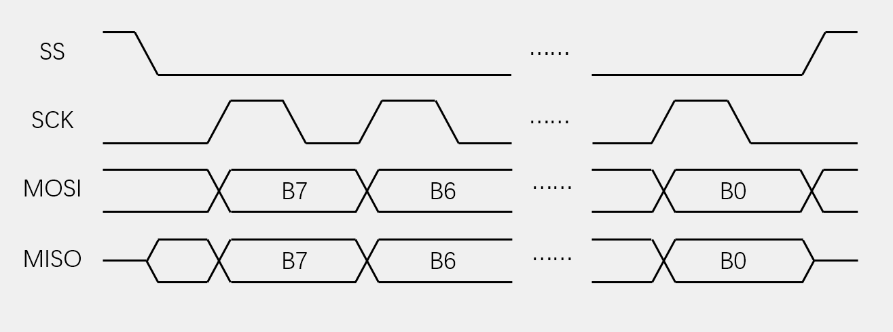


4、时序基本单元——交换一个字节（模式2）：（CPOL——Clock Polarity，时钟极性；CPHA——Clock Phase，时钟相位）

- CPOL=1：表示空闲状态时，SCK为高电平。
- CPHA=0：表示SCK第一个边沿移入数据，第二个边沿移出数据。

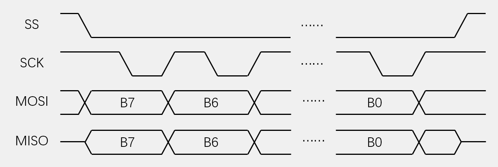


5、时序基本单元——交换一个字节（模式3）：（CPOL——Clock Polarity，时钟极性；CPHA——Clock Phase，时钟相位）

- CPOL=1：表示空闲状态时，SCK为高电平。
- CPHA=1：表示SCK第一个边沿移出数据，第二个边沿移入数据。

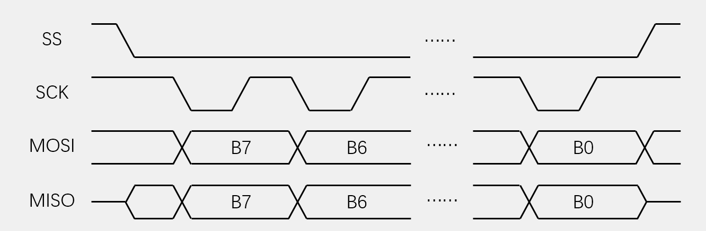


## SPI数据流

SPI数据流采用指令码+读写数据的格式。

$I^2C$数据流采用地址+读写数据的格式，采用的是读写寄存器的模型。


## W25Q64


## SPI软件实现


## SPI硬件实现


# CAN


# USB


# ELSE

## 整理—缩写表

GPIO外设中的：

| 缩写 | 全称                                          |
| ---- | --------------------------------------------- |
| RCC  | reset and clock control，复位和时钟控制       |
| AHB  | Advanced High performance Bus，高级高性能总线 |
| APB  | Advanced  Peripheral Bus，高级外围总线        |
| GPIO | General Purpose Input Output，通用输入输出口  |
|      |                                               |

EXTI外设中的：

| 缩写 | 全称                                                     |
| ---- | -------------------------------------------------------- |
| NVIC | Nested Vectored Interrupt Controller，内嵌向量中断控制器 |
| AFIO | Alternate function I/O alternate，备用功能IO口           |
| EXTI | External Interrupt，外部中断                             |
|      |                                                          |

TIM外设中的：

| 缩写 | 全称                                                         |
| ---- | ------------------------------------------------------------ |
| TIM  | Timer，定时器                                                |
| TRGI | Trigger Input，触发输入                                      |
| TRGO | Trigger Output，触发输出                                     |
| ETR  | External  Trigger Refenrence，外部触发输入，<br>External  Timer Refenrence，外部定时器参考（不懂...） |
| OC   | Output Compare，输出比较                                     |
| PWM  | Pulse Width Modulation，脉冲宽度调制                         |
| CNT  | count，计数器                                                |
| CCR  | capture/compare register，捕获/比较寄存器                    |
| ARR  | auto reload register，自动重装载寄存器                       |
| PSC  | Prescaler，预分频器                                          |
| IC   | Input Capture，输入捕获                                      |
|      |                                                              |
|      |                                                              |


## 器件

### LED

LED（light-emitting diode）——  发光二极管。

正向导通，反向不通电。

长脚为正极；二极管内较小一边为正极。


### 有源蜂鸣器

有源蜂鸣器 —— 内部自带振荡源，将正负极接上直流电压即可持续发声，频率固定。

无源蜂鸣器 —— 内部不带振荡源，需要控制器提供振荡脉冲才可发声，调整提供振荡脉冲的频率，可发出不同频率的声音。


### 传感器

传感器元件（光敏电阻、热敏电阻、红外接收管等）的电阻会随外界模拟量的变化而变化，通过与定值电阻分压即可得到模拟电压输出，再通过电压比较器进行二值化即可得到数字电压输出。

光敏电阻模块：指示灯亮——输出高电平；指示灯灭——输出低电平。

对射式红外传感器模块：红外传感器接收到红外，输出低电平；红外被阻挡时输出高电平。

### 旋转编码器

机械触点式旋转编码器。


### 舵机

舵机是一种根据输入PWM信号占空比来控制输出角度的装置。

输入PWM信号要求：周期为20ms，高电平宽度为0.5ms~2.5ms。


实际应用：机器人、机械臂，可以使用舵机来控制关节，遥控车、遥控船可以使用舵机来控制方向。

### 直流电机

直流电机是一种将电能转换为机械能的装置，有两个电极，当电极正接时，电机正转，当电极反接时，电机反转。

直流电机属于大功率器件，GPIO口无法直接驱动，需要配合电机驱动电路来操作。

TB6612是一款双路H桥型的直流电机驱动芯片，可以驱动两个直流电机并且控制其转速和方向。


## 整理—练习

**GPIO部分：**

- 输出：1、点亮一个LED；2、LED灯闪烁；3、LED流水灯；4、控制有源蜂鸣器的响应。
- 输入：1、按钮控制LED亮灭；2、光敏传感器控制蜂鸣器响应。

结果显示：使用OLED屏幕。

**EXTI外部中断部分：**1、对射式红外传感器计次；2、旋转编码器计次。

**TIM定时器定时中断部分：**1、定时器中断计数，使用内部时钟；2、定时器中断计次，使用外部时钟（用对射式红外传感器的信号充当）。

**TIM定时器输出比较功能部分：**1、使用PWM驱动LED，实现LED呼吸灯；2、使用PWM波形驱动舵机，按键来控制舵机的旋转角度；3、使用PWM波形来驱动直流电机，按键控制直流电机转速、转向。

**TIM输出捕获功能部分：**1、输入捕获模式测频率；2、PWMI模式测频率和占空比。

**TIM输入捕获功能部分：**1、计算频率；2、计算频率和占空比。

**TIM编码器接口部分：**1、编码器测速——直流电机。

**ADC部分：**1、使用单通道转换电位器的模拟量。2、使用单通道模拟多通道转换电位器、温度传感器、光敏传感器、红外传感器的模拟量。

**DMA部分：**1、DMA转换数据；2、使用DMA转换ADC多通道转换后的数据。

**USART部分：**1、数据发送，功能函数封装——发送字符串、发送数组等；2、数据接收；3、HEX数据包的接收；4、HEX数据包的发送。5、文本数据包的接收；6、文本数据包的发送。


