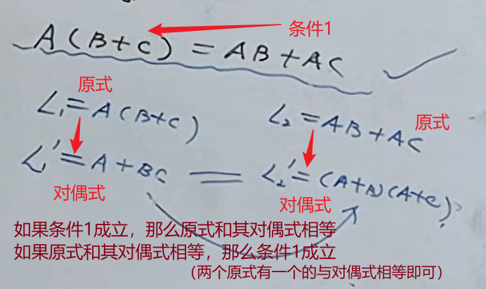

# 数制与码制

数制：十进制、二进制、八进制、十六进制。

**1、原码、反码、补码**

原码：二进制表示，最高位表示符号位，0——正，1——负。

正数的原码、反码、补码都一样。

负数的反码为原码符号位不变，其余位取反；负数的反码为负数的补码加上1。

**2、各种码：**

BCD码：使用四位二进制数分别表示十进制数的0-9

- 8421 BCD码：四位二进制数`xxxx`，最高位是8，依次到最低位是1。
- 2421 BCD码：四位二进制数`xxxx`，最高位是2，依次到最低位是1。
- 5421 BCD码：四位二进制数`xxxx`，最高位是5，依次到最低位是1。
- 余3码：8421BCD码的基础上减去3来表示0-9。
- 循环码：

格雷码：

# 逻辑运算

**与运算：**有0为0，全1为1。表达式形式——`F = A · B · C `，F为输出，A、B、C为输入；逻辑符号：

**真值表表示，罗列出所有情况。波形表示。卡诺图表示。逻辑符号表示。**

**或：**有1为1，全0为0。表达式——`F = A + B + C `。

**非：**

**与非：**与之后再对结果非。

**或非：**或之后再对结果非。（逻辑符号在或的基础上加个空心圆圈，参考与非的逻辑符号）

**与或非：**

**异或：**相同为0，不同为1。

**同或：**相同为1，不同为0。

# 逻辑代数

反演律（摩根定律）：去掉头上的非的几个原则——1、原变量与反变量互换；2、0和1互换；3、与或互换；4、保持原来的运算顺序。

代入规则：

反演规则——摩根定律。

对偶规则：对偶式就是原式中的与或互换后的式子。

# 卡诺图化简法

最小项表达式：

