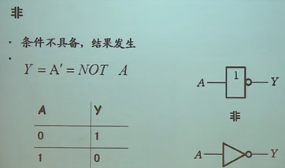
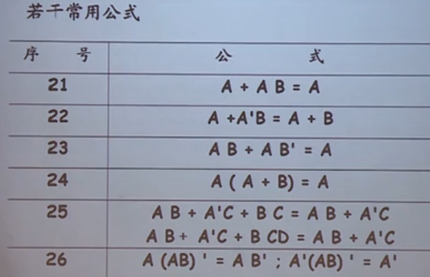

# 数字电路

模拟电路：用连续的模拟电压、电流值来表示信息。

数字电路：用离散的电压序列来表示信息。

# 数制与码制

编码：事物的其它代表形式，特定编码对应着特定事物，**编码的目的就是将现实中的信息或事物转化进二进制世界中**。（编码的目的，就是为了用一种事物代表另一种事物）

数制：表示数量的规则，规定了数量的每一位的构成、低位向高位的进位规则。

码制：表示事物的规则，码制是编码要遵循的规则。

数制有十进制、二进制、八进制、十六进制。数的码制有原码、反码、补码、BCD码等。

**1、原码、反码、补码**

原码：二进制表示，最高位表示符号位，0——正，1——负。

正数的原码、反码、补码都一样。

负数的反码为原码符号位不变，其余位取反；负数的反码为负数的补码加上1。

**2、各种码：**

BCD码：使用四位二进制数分别表示十进制数的0-9

- 8421 BCD码：四位二进制数`xxxx`，最高位是8，依次到最低位是1。
- 2421 BCD码：四位二进制数`xxxx`，最高位是2，依次到最低位是1。
- 5421 BCD码：四位二进制数`xxxx`，最高位是5，依次到最低位是1。
- 余3码：8421BCD码的基础上减去3来表示0-9。
- 循环码。

格雷码。

# 逻辑代数基础

## 逻辑运算

**与运算：**有0为0，全1为1。表达式形式——`F = A · B · C `，F为输出，A、B、C为输入；逻辑符号：

**真值表表示，罗列出所有情况。波形表示。卡诺图表示。逻辑符号表示。**

**或：**有1为1，全0为0。表达式——`F = A + B + C `。

**非：$\overline{A}$**

**与非：**与之后再对结果非。

**或非：**或之后再对结果非。（逻辑符号在或的基础上加个空心圆圈，参考与非的逻辑符号）

**与或非：**与后的结果再进行或运算，再对最后结果非。

**异或：**相同为0，不同为1。

**同或：**相同为1，不同为0。$F=AB+\overline{A}\overline{B}$

## 逻辑代数公式

反演律（摩根定律）：去掉头上的非的几个原则——1、原变量与反变量互换；2、0和1互换；3、与或互换；4、保持原来的运算顺序。

代入规则：任何一个包含A的等式中，若以另外一个逻辑式代入A的位置，等式依然成立。

反演规则——摩根定律。

对偶规则：对偶式就是原式中的与或互换后的式子。

逻辑函数的表示方法：真值表、逻辑式、逻辑图、波形图、卡诺图、EDA中的硬件描述语言。

真值表转为逻辑式：

1. 找出真值表中使输出为1的输入变量取值的组合。
2. 每组输入变量取值对应一个乘积项，取值为1的写原变量，为0的写反变量。
3. 将这些变量相加。

## 卡诺图化简法

**最小项：**最小项是与项——由n个变量构成的与项，与项当中出现的每一个因子要么是原变量出现、要么是反变量出现，并且只能出现一次。（n个变量，最多有$2^n$个最小项）(例如2个变量A、B，最小项有4种情况：$AB$、$\overline{AB}$、$\overline{A}B$、$A\overline{B}$。)

最大项：与最小项类似，只不过最大型的每一项都是或项，例如2个变量A、B，最大项有4种情况：$A+B$、$\overline{A}+\overline{B}$、$\overline{A}+B$、$A+\overline{B}$。

**编码**——将最小项用一些符号来表示：用m来指代最小项，m的数字下标来表示哪一项。（例如两个变量A、B的最小项编码：$AB$ — 11 — $m_3$、$\overline{AB}$ — 00 — $m_0$、$\overline{A}B$ — 01 — $m_1$、$A\overline{B}$ — 10 — $m_2$，也就是用1表示原变量、0表示反变量，按二进制数计算得到的值作为m的数字下标，要注意的是要设定好A是高位还是B是高位，一般以ABCDEF....的顺序来定高位）

**最小项的性质：**

1. 输入变量任一取值下，有且只有一个最小项值为1。
2. 所有最小项的值的和恒等于1。
3. 任何两个最小项之积为0。 $m_i*m_j=0$（`i != j`），$m_i*mi=m_i$。
4. 两个相邻的最小项之和可以合并，消去一对因子，留下公共因子。（相邻：两个最小项之中仅有一个变量不同）

**最小项表达式：**每一项都是最小项的表达式，任何表达式都可以化成最小项表达式且唯一。（例如：$L=A\overline{B}+A\overline{C}$ ===>  $L=A\overline{B}(C+\overline{C})+A\overline{C}(B+\overline{B})=A\overline{B}C+A\overline{B}\overline{C}+AB\overline{C}+A\overline{B}\overline{C}=A\overline{B}C+A\overline{B}\overline{C}+AB\overline{C}$，配项然后解开括号即可，编码后为$L_{ABC}=m_5+m_4+m_6=\sum m(4,5,6)$）	

**卡诺图：**

二变量卡诺图：

三变量卡诺图：

四变量卡诺图：

卡诺图表示逻辑函数：

