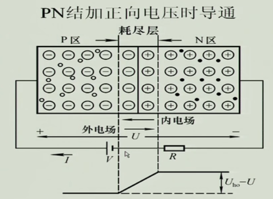

# 概述

电子器件发展为脉络......

模拟电子技术，从发展上来说是数电的一个基础。是一门很令人兴奋的技术。

1、熟悉一些电子元器件（二极管、三极管、场效应管）的基本特性、基本使用方式、工作方式。

2、电子元器件的应用：放大作用、开关作用的应用等，利用半导体器件的特性去搭建电路。

3、基于一个个半导体元器件构建的分立元件放大电路。

4、集成运放放大器。

# 半导体元器件

## 半导体基础

半导体：常温下导电能力基于导体与绝缘体之间的材料。

本征半导体：纯净的半导体，具有晶体结构的半导体。

**本征激发：**使得本征半导体里受共价键束缚的电子发生逃逸变为自由电子的过程。电子逃逸后留下的空位称为空穴（带正电）。

**载流子：**承载电流的粒子。本征半导体的载流子有自由电子和空穴两种。

如果给本征半导体施加电场，那么在电场力的作用下，价电子会移动去填补空穴，也就是产生了电子的相对移动。因此如果本征激发越多，那么空穴、自由电子数就越多，导电能力就越好。

**复合：**本征激发的自由电子进入空穴重新组成共价键的过程，复合后自由电子湮灭，剩下共价键。（本征激发的逆过程）

温度和本征激发、复合的速度，决定了载流子的浓度。

怎么提高半导体的导电性？提高温度来提高导电性有点不现实，那就只剩下半导体材料这一方向了，可以利用半导体材料的可掺杂性来提高导电性。

**杂质半导体：**掺入少量（这样不会改变半导体晶格结构）的杂质元素的半导体。杂质半导体又分为N型、P型。N型半导体，掺入磷元素，

；P型半导体，掺入硼元素。（多子——多数载流子；少子——少数载流子。）

N（negative ）型，磷原子最外层有5个电子，与Si结合成共价键形成晶格结构后还剩余一个自由电子。N型中多子为自由电子，少子为空穴，多子是少子的好多倍，可以将少子对多子的影响忽略，也就是温度对N型半导体导电能力的影响几乎可以忽略（温度影响本征激发，但由于自由电子数量太多了，本征激发后产生的空穴则相对自由电子来说就太少了，即对导电能力的影响不大，使得不同温度下N型半导体导电能力仍然稳定）。

P（positive）型，硼原子最外层有3个电子，与Si结合成共价键形成晶格结构后就会剩下一个空穴。这样的话多子就为空穴，少子就为自由电子。

**PN结形成：**

当把P型半导体、N型半导体放在一起时，由于粒子的扩散运动（浓度高的一边的粒子会向浓度低的一边运动），就会产生一个空间电荷区（空穴消耗形成负端，自由电子消耗形成正端）——即PN结（也称为耗尽层、阻挡层），阻挡空穴、自由电子的相对移动。

PN结相当于一个势垒，阻挡空穴、自由电子的移动，不过对于两边的少子，这个势垒反而是助推手，会导致一个漂移运动——N区的空穴将会飘到P区，P区的自由电子将会飘到N区，当N、P两区产生浓度差时又会产生扩散运动。

所以，一定条件下多子的扩散运动与少子的漂移运动将会达到一个动态平衡。

P型、N型的掺杂浓度一样，那么形成的空间电荷区，N、P形成的电荷区域一样，因此这样的PN结也称为对称结。当掺杂浓度不一样时，空间电荷区的宽窄将不一样，浓度高的一边就会窄，浓度低的一边就会宽一些，这种结也叫做不对称结。

PN结形成，从导电又到不导电了。

**PN结的单向导电性：**

加上一个正向电压（PN结，从P到N），这个外部电场的方向与内部电场方向相反，当外部电压达到一定值时，耗尽层的电场将会被抵消，N区电子就可以冲过耗尽层了。（外电场削弱了内电场，使得扩散运动得以恢复，然后电流迅速增大，因此加上一个限流电阻R限制电路中最大电流，防止PN结烧坏）

加上一个反向电压时 ，外部电场与内部电场一致，使得PN结更厚，阻挡作用更加强，几乎不导电，从N到P的电流截止。

$I_S$是反向饱和电流；$U_T$是一个温度当量，室温下等于26mv；U是PN结所加电压——导通电压，Ge管时则是0.2~0.3V，Si管时则是0.2~0.7。

**反向电压击穿：**

- 雪崩击穿（掺杂浓度低的时候）：当反向电压到达一定量时，PN结将被反向击穿而导通（此时内部外部电场方向一致，电子在叠加电场中被加速，从而导致共价键被击溃而出现更多的自由电子，雪崩击穿需要PN结有一定的厚度，不然不能将电子加速到可以击穿的那个程度）。（温度越高，雪崩击穿所需电压越高）
- 齐纳击穿（掺杂浓度高的时候）：掺杂浓度高 → PN结薄，加反向电压时PN结电场场强将很大，从而导致价电子挣脱共价键束缚。（温度越高，齐纳击穿所需电压越低）

反向击穿会引起PN结温度升高从而导致PN结烧毁。只要控制好温度，不使PN结热击穿，就还是能正常工作的。利用反应击穿特性可以制作稳压二极管。

通过不同的掺杂工艺，**利用掺杂浓度来控制反向击穿电压**，得到不同规格的稳压二极管。

**PN结的电容效应：**

- 势垒电容：耗尽层的电荷量随外加电压而增多或减少，这种现象与电容器的充、放电过程相同；耗尽层宽窄变化所等效的电容称为势垒电容。利用电容效应可做出可变电容。

- 扩散电容：非平衡少子和电压之间的关系造成的。（在正向偏置时，P区中的少子(电子)，N区中的少子(空穴)，会伴着远离势垒区，数量逐渐减少。即，离结越近少子数量越多，离结越远少子的数量越少，呈现一定的浓度梯度。

  当正向电压增加时，N区将有更多的电子扩散到P区，也就是P区中的少子----电子浓度、浓度梯度增加。同理正向电压增加时，N区中的少子---空穴的浓度、浓度梯度也要增加。相反，正向电压降低时，少子浓度就要减少。

  PN结少子由于扩散引起的浓度/浓度梯度变化也就相当于电容充放电过程，也就是PN结的扩散电容效应。）

## 半导体二极管

### 二极管特性

将PN结包装起来并引出两个极，即二极管。

二极管伏安特性：

与PN结相比：

- 由于体电阻存在，使得相同电压下，二极管电流比PN结小。
- 二极管反向电流大一些。

温度的影响：

- 温度上升，正向导通电压降低，反向电流变大。
- 室温每上升1℃，正向压降2~2.5mv；每升高10℃，反向电流增大一倍。

二极管的单向导通性，限定电流流向，可以将交流电变为直流电 ——整流。

二极管反向电压的伏安特性，每升高10℃，反向电流增大一倍，可以利用这个制作温度传感器。

正向特性、反向特性，都可以利用来制作稳压二极管，不过一般利用反向特性，因为可以通过掺杂浓度来将反向击穿电压做成不同规格，而正向就不行了。

### 二极管的使用

## 晶体管

## MOS管

