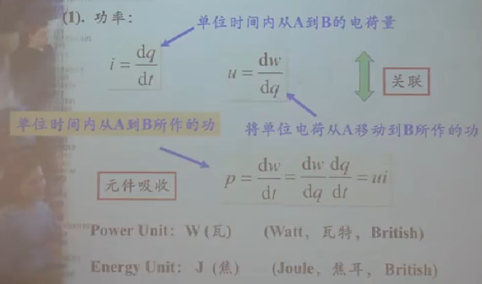

# 概述

电路：电气元件相互连接构成的电流的通路。

电路的目的：处理能量（电能的产生、传输、分配）、处理信号（电信号的获得、变换、放大）、同时处理信号和能量（天线、CPU、供电系统、智能电网等）。

电路分类——根据负荷性质分：

- 电阻电路（线性、非线性）。
- 动态电路（线性动态电路的时域分析、非线性动态电路的稳态分析（正弦激励、周期性非正弦激励））。

电路分类——根据电源性质分：

- 直流电路。
- 交流电路（正弦激励电路、周期性非正弦激励电路）。

电流：电荷的时间变化量。（单位：安——A）

电压：电场力移动单位电荷的功。电压的方向为正电位指向负电位的，即电位降的方向。

电位：某点到某参考节点的电压。（参考点的电压为0）。两点的电压等于两点间的电位差—— $U_{ab}=\varphi_a-\varphi_b$ 。（因此电压经常被称为电压降）

电动势：是电源的本质参数。电路分析中不需要这个概念。

电路功率：单位时间从a到b的电荷量。电压、电流有关联、非关联两种，因此功率也有两种计算方法。

电压与电流的关联、非关联：电压参考方向与电流参考方向一致即关联，不一致即非关联。（电路分析的参考方向都为假定的方向，即复杂电路分析中不知道实际的电压、电流的方向，于是假定电压、电流方向是这样的——即定义参考方向。关联、非关联要根据给出的参考方向来分析，或者你自己假定的参考方向去分析。）

吸收功率，发出功率：功率计算的两种方式

假定元器件两端的电压和电流的参考方向为关联的（即方向一致），那么元器件的功率就得假定是吸收功率，最后算出结果是正的那就是真实的吸收功率，即说明假定的方向和实际的是一样的；如果假定元器件两端的电压和电流方式相反，那电压和电流就是非关联，那么元器件的功率就得假定是发出功率，最后计算得出结果是负的就说明是真实的发出功率。（元器件——电路中的器件，包括电流源、电压源）。

总结：“关吸非发”，假定的电压、电流方向是关联的，那就得假定计算的功率就是吸收功率，反之就是发出功率。电路分析就是这样，对于复杂的电路不知道方向就假定方向再结合一些定律去计算。

例子：根据电流参考方向、电阻的电压参考方向——关联的，那么就得假定电阻功率为吸收功率，再由提供的信息算出电流I，可计算到假定的电阻的功率就是吸收功率。

