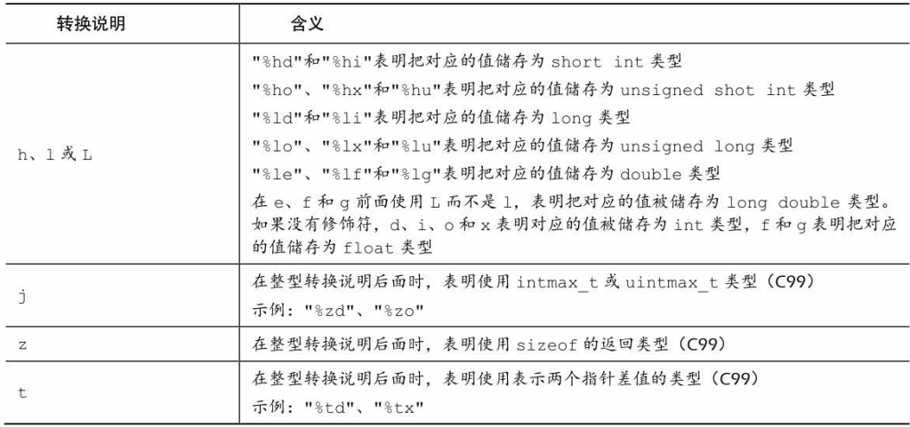

# C语言概述

C设计理念：让用户轻松自顶向下的规划、结构化编程、模块化设计。

C程序思想：“针对目标计算机来定义最合适的某种操作”。

C标准：（从“不要妨碍程序员做需要做的事  ”到“不那么信任程序员”）

1. 1994年——C99
2. 2011年 ——C11

C编程七步骤：

1. 第一步——定义程序目标：描述问题，为解决问题做准备——明确自己想做什么， 思考你的程序需要哪些信息， 要进行哪些计算和控制， 以及程序应该要报告什么信息。
2. 第二步——设计程序：设计程序处理模块，为编码做准备；用户界面、程序结构、目标用户、时间限制、如何表示数据、处理数据等。
3. 第三步——编写代码。
4. 第四步——编译。
5. 第五步——运行。
6. 第六步——测试和调试。
7. 第七步——维护和修改。

C程序执行：源代码文件——通常为.c文件，需要通过程序将其转换为可执行文件才能执行，而实现这一过程需要通过编译和链接这两步来实现。

编译器把源代码转换成中间代码（机器码）， 链接器把中间代码和其他代码合并， 生成可执行文件。  

- 编译器的作用：编译为机器可识别的代码——机器码。
- 链接器的作用：把你**编写的目标代码、 系统的标准启动代码和库代码**这 3 部分合并成一个文件， 即可执行文件。 对于库代码， 链接器只会把程序中要用到的库函数代码提取出来。


# C编译器安装

## 主流编译器

参考文章：[C++主流编译器总结 - 张小凯的博客 (jasonkayzk.github.io)](https://jasonkayzk.github.io/2022/05/28/C++主流编译器总结/)

主流的C/C++编译器：GCC/G++、Clang（苹果公司开源的，是在 LLVM 项目中一个很重要的前端工具）、MSVC（微软的）。

Windows平台：

1. **MSVC**：微软自家的编译器，Microsoft Visual C++ Compiler。
2. **MinGW**：Minimalist GNU for Windows，GNU在Linux下的gcc/g++编译器向Windows平台拓展的产物。

Linux平台：GCC/G++。（GCC/G++只是负责Driver，调用真正的编译器来将源码编译成汇编代码）

GCC/G++的区别：

- **G++** 会把 `.c` 文件当做是 C++ 语言 (在 `.c` 文件前后分别加上 `-xc++` 和 `-xnone`, 强行变成 C++)，从而调用 `cc1plus` 进行编译；
- **G++** 遇到 `.cpp` 文件也会当做是 C++，调用 `cc1plus` 进行编译；
- **G++** 还会默认告诉链接器，让它链接上 C++ 标准库；
- **GCC** 会把 `.c` 文件当做是 C 语言，从而调用 `cc1` 进行编译；
- **GCC** 遇到 `.cpp` 文件，会处理成 C++ 语言，调用 `cc1plus` 进行编译；
- **GCC** 默认不会链接上 C++ 标准库；
- **GCC** 不会定义 **__cplusplus** 宏，而 **G++** 会；

## 编译器安装

Windows下安装MinGW：

- [MinGW-w64 - for 32 and 64 bit Windows - Browse /mingw-w64/mingw-w64-release at SourceForge.net](https://sourceforge.net/projects/mingw-w64/files/mingw-w64/mingw-w64-release/)，滑到后面找到MinGW-W64-install.exe，或者下载免安装压缩包x86_64-posix-sjlj或x86_64-posix-seh。
- 或者去Github上下载更新的版本：[Releases · niXman/mingw-builds-binaries (github.com)](https://github.com/niXman/mingw-builds-binaries/releases)，x86_64-12.2.0-release-win32-seh-ucrt-rt_v10-rev2.7z，解压配环境变量即可。
- 下载免安装压缩包解压后将里面的bin目录添加到Path环境变量里，然后打开cmd执行`gcc -v`，出现gcc版本信息即可。

Linux下安装：

1、CentOS：安装gcc、g++及vum，安装完执行`gcc -v`查看安装版本。

```
yum -y install gcc gcc-c++ autoconf pcre pcre-devel make automake
yum -y install wget httpd-tools vim
```

2、Ubuntu：`sudo apt install gcc`。（安装完执行`gcc --version`查看版本）

## 编译过程

摘自[C++主流编译器总结 - 张小凯的博客 (jasonkayzk.github.io)](https://jasonkayzk.github.io/2022/05/28/C++主流编译器总结/)。

**GCC/G++ 在执行编译工作的时候，总共需要4步：**

1. **预处理，生成 `.i` 的文件（预处理器cpp），此时对应的参数是 `-E`；**
2. **将预处理后的文件转换成汇编语言，生成文件`.s`（编译器egcs），对应的参数是 `-S`；**
3. **由汇编代码变为目标代码（机器代码）生成 `.o` 的文件（汇编器as），对应的参数是 `-c`；**
4. **连接目标代码，分配实际的内存地址并生成可执行程序（链接器ld），无参数；**

即：一个C/C++文件要经过预处理(preprocessing)、编译(compilation)、汇编(assembly)、和连接(linking)才能变成可执行文件。

1、预处理：`gcc -E main.c -o main.i `。

`-E` 的作用是让 GCC 在预处理结束后停止编译；预处理阶段**主要处理 `include和define`** 等；它把 `#include` 包含进来的 `.h文件` 插入到 `#include` 所在的位置，把源程序中使用到的用 `#define` 定义的宏用实际的字符串代替。

2、编译：`gcc -S main.i -o main.s`。

`-S` 的作用是编译后结束，编译生成了汇编文件；在这个阶段中，GCC 首先要检查代码的规范性、是否有语法错误等；以确定代码的实际要做的工作，在检查无误后，GCC 把代码翻译成汇编语言。

3、汇编：`gcc -c main.s -o main.o`。

汇编阶段把 `.s`文件翻译成二进制机器指令文件`.o`，这个阶段接收 `.c` 、`.i`、`.s` 的文件都没有问题。

4、链接：`gcc -o main main.s`。

链接阶段，链接的是函数库；在 `main.c` 中并没有定义 `printf` 的函数实现，且在预编译中包含进的 `stdio.h` 中也只有该函数的声明；而系统把这些函数实现都被做到名为`libc.so`的动态库。

**函数库一般分为静态库和动态库两种：**（GCC 在编译时默认使用动态库）

- **静态库是指编译链接时，把库文件的代码全部加入到可执行文件中，因此生成的文件比较大，但在运行时也就不再需要库文件了；Linux中后缀名为 `.a`**。
- **动态库与之相反，在编译链接时并没有把库文件的代码加入到可执行文件中，而是在程序执行时由运行时链接文件加载库；Linux中后缀名为 `.so`，如 `libc.so` 就是动态库。**

动态与静态库：

- **静态库节省时间：不需要再进行动态链接，需要调用的代码直接就在代码内部。**
- **动态库节省空间：如果一个动态库被两个程序调用，那么这个动态库只需要一份在内存中。**

# 基础

## Start C

单文件程序：

```c
#include <stdio.h>
int main(){
   
    return 0;
}
```


## 变量&常量

**1、变量声明与赋值：**以int类型变量为例（建议变量都显式初始化）

```c
#include <stdio.h>
int main(){
	/* 数据类型  变量名  =  值; */
	int num;  // 变量声明
	num = 0;  // 变量赋值
	int n1 = 1, n2 = 2, n3 = 3; // 声明并初始化
	int n4 = n5 = n6 = 3;  // 不能这样声明
}
```

**2、常量：**（最好用`#define`定义常量，用const定义只读变量）

使用`#define`定义常量：

```c
#include <stdio.h>
#define VALUE 12
#define BEEP '\a'
#define STR "我是一个常量字符串"
#define INT_MAX +32767
int main(){
	// 编译程序时， 程序中所有的TAXRATE都会被替换成0.015。 这一过程被  
    // 称为编译时替换（compile-time substitution）
	printf("%d",VALUE); 
	printf("%c",BEEP); 
	printf("%s",STR); 
}
```

使用const限定符：

```c
#include <stdio.h>
// 声明为只读
const int NUM2 = 99;
int main(){
	const int NUM = 99;
}
```

一些头文件定义了关于类型信息的一些常量：如`#include <limits.h>` ——整型限制  ，`#include <float.h>`—— 浮点型限制。

## 数据类型

C中的基本数据类型：整型、浮点型、字符型、布尔型、可移植型、复数虚数类型。

### 整型

1、int类型取值范围：取值范围具体由计算机系统决定，但通常int类型都是32位存储。**C规定int的取值范围最小为-32768～32767（即16位存储）。**

```c
// 打印int值：
#include <stdio.h>
int main(){
	int num = 9;
	int val = 99；
	// %d是转换说明，代表值顺序和后面的num、val一致
	printf("num是%d；val是%d",num,val);  
}
```

2、数值的表示方式，科学技术法或进制表示法：

```c
#include <stdio.h>
int main(){
	int num = 011;  // 十进制数9
	int val = 0b11; // 十进制3
	int temp = 0x12;// 十进制18
	// %d是转换说明，代表值顺序和后面的num、val一致
	printf("num是%d；val是%d；temp是%d",num,val,temp);  
}
```

3、C中的整型以有无符号分类：

- 有符号整型：short、short int、int、long、long long、long long int。（也可以使用signed来强度这是有符号类型）
- 无符号整型：加上unsigned关键字即可。

常见的存储：short——16位，int——32位，long——32位，long long——64位。

通常的整数数值都看作是int型，如果数值超了int的范围，编译器会尝试使用unsigned int，如果还不够大， 编译器会依次使用long、 unsigned long、 long  long、和unsigned long long类型。

4、数值后缀：

```c
#include <stdio.h>
int main(){
    long n1 = 12L;
    long long n1 = 12LL;
    unsigned long long n3 = 12LLU;
}
```

5、整数溢出：当数值大小超过相应类型的取值范围，那么就会从类型最小值开始重新计数。

6、整数选择：考虑内存节省、移植等。

7、使用printf打印的转换符说明：

| 转换符 | 类型                     |
| ------ | ------------------------ |
| %u     | unsigned int             |
| %ld    | long                     |
| %lx    | 以十六进制数打印long类型 |
| %lo    | 以八进制数打印long类型   |
| %hd    | short                    |
| %lu    | unsigned long            |
| %lld   | long long                |
| %llu   | unsigned long long       |
|        |                          |


### 浮点型

1、**float类型**取值范围：C标准规定， float类型必须至少能表示**6位有效数字**， 且取值范围至少是10-37～10+37（至少为32位）。  

> 浮点数存储：通常，系统储存一个浮点数要占用32位。 其中8位用于表示指数的值和符号， 剩下24位用于表示非指数部分（也叫作尾数或有效数） 及其符号。（有效数乘以以十为低的指数即浮点数，指数越大，小数点就移动越大）

2、**double类型**：double类型和float类型的最小取值范围相同， 但至少必须能表示**10位有效数字**。

> 一般情况下， double占用64位，多的32位有的系统用来表示非指数部分，也有的分配给指数。不过无论哪种，都至少有13位有效数。

3、**long double类型**：C只保证long double类型至少与double类型的精度相同。  

**默认情况下， 编译器假定浮点型常量是double类型的精度。**  

4、使用进制表示：C99 标准——用16进制表示浮点型常量：即在十六进制数前加上十六进制前缀（0x或0X） ， 用p和P分别代替e和
E， 用2的幂代替10的幂（即， p计数法）  

```c
#include <stdio.h>
int main(){
    // a=十进制10，1f = 1/16 + 15/256，p10 = 2^10
    // (10 + 1/16 +15/256) × 1024（即， 十进制10364.0）
    float num1 = 0xa.1fp10;
    printf("%f",num1);
}
```

5、使用科学计数法表示浮点数：

```c
#include <stdio.h>
int main(){
	float num1 = 1.013e-5; // 1.013 * 10^5
	float num2 = 3e8;      // 3 * 10^8
	printf("%f",num1);
}
```

6、使用printf()函数打印浮点数：

```c
#include <stdio.h>
int main(){
    float num1 = 0xa.1fp10;
    printf("%f",num1);  
}
```

1. %f：转换说明打印十进制记数法的float和double类型浮点数。
2. %e：打印指数记数法的浮点数。
3. 如果系统支持十六进制格式的浮点数， 可用a和A分别代替e和E。
4. 打印long double类型要使用%Lf、 %Le或%La转换说明。

### sizeof()

```c
#include <stdio.h>
int main(){
    /* C99为类型大小提供%zd转换说明  些不支持C99和C11的编译器可用%u或%lu代替%zd */
    // 查看各类型所占字节数
    printf("Type int has a size of %zd bytes.\n", sizeof(int));
    printf("Type char has a size of %zd bytes.\n", sizeof(char));
    printf("Type long has a size of %zd bytes.\n", sizeof(long));
    printf("Type long long has a size of %zd bytes.\n",
           sizeof(long long));
    printf("Type double has a size of %zd bytes.\n",
           sizeof(double));
    printf("Type long double has a size of %zd bytes.\n",
           sizeof(long double));
    return 0;
}
```


### 字符

char类型，表示单个字符，实际上存放的不是字符而是一个整数值，通过该整数值编码显示一个字符。

```c
#include <stdio.h>
int main(){
    char a = 'A';
    char b = 'ABCD';  // int为32位char为8位的系统下可行，这样的话只有最后一个有效
    char c = 77; // M，使用ASCII值表示
    char f = '\a'; // 蜂鸣字符
    char beep = '\007'; // 有没有0，这种写法下都解释为八进制
    printf('%c',beep);
}
```

打印不出来的一些字符，比如蜂鸣等符合，可以用以下方式表示：

1. 使用字符的ASCII值 。
2. 使用转义序列。
3. 用十六进制形式表示字符常量 。（例如&，`char a = '\x026';`）

无符号与有符号，unsigned char、signed char。（8位，-128~127,0~255）

### 布尔值

布尔值：`_Bool`，存储1或0。


### 可移植类型

C99 新增了两个头文件stdint.h和inttypes.h， 以确保C语言的类型在各系统中的功能相同。

```c
#include <stdio.h>
#include <stdint.h>
int main(){
    int32_t n = 99;
}
```

## 输入输出

### 字符串

C中用char型数组来存储字符串，存储的字符串会在末尾自动加上一个`\0`，表示字符串结束，char类型一般占用一个字节。

数组末尾的`\0`表示空字符（null character），是非打印字符，其ASCII码为0。

```c
#include <stdio.h>
int main(){
    char s[10] = "一九九八";  // 一个中文占用两个字节
    printf("%s",s);
    return 0;
}
```

strlen(str)函数：返回数组的有效存储个数，不包括空字符，该函数的原型在string.h头文件中声明，返回值为size_t（即unsigned int）。

```c
#include <stdio.h>
#include <string.h>
int main(){
	char str[10] = "ABCDEFGHI";
	int n1 = strlen(str);
    int n2 = sizeof(str);
	printf("有效存储单元：%d",n1);  // 9
	printf("总存储单元：%d",n2);    // 10
}
```


### printf()

1、用于打印字符到控制台。使用格式：`printf("要打印的字符、变量值、表达式结果等",变量或表达式列表);`
如果要打印变量、表达式结果，需要使用转换说明，基本的转换说明如下：

| 转换说明 | 输出                                    |
| -------- | --------------------------------------- |
| %a   %A  | 浮点数、十六进制数和p计数法 （C99/C11） |
| %c       | 单个char字符                            |
| %d  %i   | 有符号十进制整数                        |
| %e  %E   | 浮点数，使用e计数法                     |
| %f       | 浮点数，使用十进制计数法                |
| %g   %G  | 根据值不同自动选择%f或%e                |
| %o       | 无符号八进制数                          |
| %u       | 无符号十进制数                          |
| %x  %X   | 无符号十六进制数                        |
| %%       | 打印一个百分号                          |
| %p       | 指针                                    |
| %s       | 字符串                                  |

```c
#include <stdio.h>
int main(){
    int age = 199;
    printf("我的年龄：%d", age);
    return 0;
}
```


2、转换说明的修饰符：

| 修饰符 | 含义                                                         |
| ------ | ------------------------------------------------------------ |
| 标记   | 可在%后使用一个或多个标记，也可不使用。<br>有五种标记：-、+、空格、#和0 |
| 数字   | 标记后、说明符前使用，用于表示最小字段宽度，<br>但是如果设置的宽度不能容纳打印的数字或字符串，系统会使用更宽的字段 |
| .数字  | 用于表示精度，标记后、说明符前使用<br>%e、%E、%f  ===>  表示小数点右边数字的位数<br>%g、%G ===>   表示有效数字的最大位数<br>%s   ===>   表示待打印字符的最大数量<br>整型  ===>  表示待打印数字的最小位数<br>实例：`%5.2f`  打印浮点数，字段宽度为5字符，小数点后保留两位数字 |
| h      | 和整型转换说明一起使用，表示short int 或 unsigned int类型的值，实例：`%hu`、`%hx`、`%6.5hd` |
| hh     | 和整型转换说明一起使用，表示signed char 或 unsigned char类型的值，实例：`%hhu`、`%hhx`、`%6.4hhd` |
| j      | 和整型转换说明一起使用，表示intmax_t 或 uintmax_t类型的值（类型定义在stdint.h），实例：`%jd` |
| l      | 和整型转换说明一起使用，表示long int 或 unsigned long int类型的值，实例：`%ld`、`%8lu` |
| ll     | 和整型转换说明一起使用，表示long long int 或 unsigned long long int类型的值，实例：`%lld` |
| L      | 和整型转换说明一起使用，表示long double类型的值，实例：`%Ld` |
| t      | 和整型转换说明一起使用，表示ptrdiff_t类型（两个指针差值的类型）的值，实例：`%td` |
| z      | 和整型转换说明一起使用，表示size_t类型的值，实例：`%zd`      |

在K&R C中， **表达式或参数中的float类型值会被自动转换成double类型**。 一般而言， ANSI C不会把float自动转换成double。 然而， 为保护大量假设float类型的参数被自动转换成double的现有程序，  **printf()函数中所有float类型的参数（对未使用显式原型的所有C函数都有效）仍自动转换成double类型。**

修饰符——标记：

| 标记 | 含义                                                         |
| ---- | ------------------------------------------------------------ |
| -    | 打印左对齐（`%-20s`）                                        |
| +    | 用于显示正负号，有符号正值前显示+，负值前显示-   （`%+6.2f`） |
| 空格 | 正数的正号用空格显示，负数的负号则用-显示   （`%6.2f`即为空格标记） |
| #    | 把结果转换为另一种形式                                       |
| 0    | 对于数值，用前导0代替空格填充字段宽度（`%08.0f`，数值占不满8字段宽度就前面填充0）<br>对于整数如果出现-标记或者指示精度，则忽略该标记 |

3、传入参数与返回值：

- 传入参数要与转换说明一一对应，不能多不能少，否则打印将不符合预期，可使用变量、常量、表达式。
- 返回值为打印的字符的个数，如果打印失败则返回一个负值。


### scanf()

1、scanf()使用指向变量的指针，用于读取输入的不同格式的数据。读取基本数据类型数据需要使用&——取地址符，读取字符串则不需要。

```c
#include <stdio.h>
int main(){
    int age; // 变量
    float assets; // 变量
    char pet[30]; // 字符数组， 用于储存字符串
    
    printf("Enter your age, assets, and favorite pet.\n");
    scanf("%d %f", &age, &assets); // 这里要使用&，读取
    scanf("%s", pet); // 字符数组不使用&
    printf("%d $%.2f %s\n", age, assets, pet);
    return 0;
}
```

2、scanf的读取过程：

- 读取数值：第一个非数值，不会把值赋给变量，会把非数值放回输入中。第一个是正号或符合，则保护符号后继续往后读取数据直到不能读取（空格或非数字），然后计算数值赋值给变量；使用字段宽度，则最多只读取宽度范围内的数。
- 读取字符：会读取除空白以外的所有字符，直到再次遇到空白就读取结束。scanf读取字符会把字符放进数组中，数组中末尾是`\0`。

其它的读取输入的函数：getchar()、fgets()。

3、参数和返回值：

```c
#include <stdio.h>
int main(){
    int age;
    char name[10];
    scanf("%d %s",&age,name);
    printf("age:%d\n",age);
    printf("name:%s\n",name);
    return 0;
}
```

- 读取成功：scanf()函数返回成功读取的项数。 
- 读取失败：如果没有读取任何项， 且需要读取一个数字而用户却输入一个非数值字符串，scanf()便返回0。 
- 读取结束：当scanf()检测到“文件结尾”时， 会返回EOF（EOF是stdio.h中定义的特殊值，通常用\#define指令把EOF定义为-1）。  

4、补充——转换说明修饰符：




### *修饰符

对于printf，修饰符*可以充当标识变量：

```c
#include <stdio.h>
int main(){
    unsigned width, precision;  //  字符宽度，精度
    int number = 256;
    double weight = 242.5;
    printf("Enter a field width:\n");
    scanf("%d", &width);
    printf("The number is :%*d:\n", width, number); // *就是width的值
    printf("Now enter a width and a precision:\n");
    scanf("%d %d", &width, &precision);
    printf("Weight = %*.*f\n", width, precision, weight); // *.*相当于width.precision
    printf("Done!\n");
    return 0;
}
```

对于scanf：把*放在%和转换字符之间时， 会使得scanf()跳过相应的输出项 。

```c
int main(){
    int n;
    printf("Please enter three integers:\n"); 
    // 输入：12 34 56，最后将输出56，前两项被跳过
    scanf("%*d %*d %d", &n); 
    printf("The last integer was %d\n", n);
    return 0;
}
```

## 类型转换

类型转换规则——自动转换：

1. 表达式中：无论是unsigned还是signed的char和short都会被自动转换成int， 如有必要会被转换成unsigned int（如果short与int的大小相同， unsigned short就比int大， 这种情况下， unsigned short会被转换成unsigned int） 。 在K&R那时的C中， float会被自动转换成double（目前的C不是这样） 。 （从较小类型转换为较大类型）
2. 两种类型运算：两个值会被分别转换成两种类型的更高级别。
3. 类型级别（高 ===> 低 ）：long double、 double、 float、 unsignedlong、long、 long long、 unsigned long、 long、 unsigned int、 int。  （例外：当 long 和 int 的大小相同时， unsigned int比long的级别高  ）
4. 赋值表达式中：计算的最终结果会被转换成被赋值变量的类型。   
5. 函数传参时：char和short被转换成int， float被转换成double。  

强制类型转换：使用`(type)`。

## 运算符

`&`：取地址运算符。

`*`：解引用运算符，后跟指针或地址，会给出存储在指针指向地址上的值。（指针的值是一个地址，大部分系统中这个地址值用无符号整数表示）

# 数组

## 一维数组

1、数组声明和初始化：

```c
#include <stdio.h>
int main(){
    // 只声明，数组里的值由内存中的值决定，并没有所谓的未声明默认值
    int arr0[6];
    // 声明并初始化
    int arr1[3]={0,1,2};
    // 只要声明并初始化一些元素，其它的才会默认初始化为0
    int arr2[3]={3};
    // arr3的大小将会是10
    int arr3[]={1,2,3,[9]=9};
    return 0;
}
```

```c
/* 指定初始化器 */
int arr[6] = {[5]=12};  // 只将最后一个初始化为12，其它的将默认初始化为0
```

2、编译器不会检查数组越界访问。

3、声明大小时，`[]`内可以是表达式，但值必须大于0。

4、一维数组，数组名表示指向首元素的一个地址，可以使用解引用操作  `*{arr+index}`  取出数组中的值。

## 二维数组

二维数组，即数组中存储数组。

``` c
// 两个二维数组内的值一致
int arr1[2][3] = {1,2,3,4,5,6};
int arr2[2][3] = {{1,2,3},{4,5,6}};
```

二维数组中，数组名表示的是指向首元素的地址，而`arr[0]`表示指向第一行的数组的首元素的地址。

# 函数

**1、函数使用三步骤：**1、函数原型声明；2、函数体编写；3、函数调用。

```c
#include <stdio.h>
// 指定函数返回值、函数名、函数形参；void表示没有，没有返回值、没有形参
void show(void); 
int main(){
	// 函数声明也可以放在main函数内：void show(void);
    show();
    show();
	return 0;
}
void show(void){
    int count;
    for(count=1;count <= 10;count++) putchar('*');
    putchar('\n');
}
```

**2、有参数的函数：**

```c
#include <stdio.h>
void show(char c, int num);  // 形参名是假名，定义时可与其不一样
// 有参函数声明也可以不声明形参名，到定义的时候再指定形参名
// void show(char, int);
int main(){
    show('&',12);
	return 0;
}
void show(char c, int num) {
    int count;
    for(count=1;count <= num;count++) putchar(c);
    putchar('\n');

}
```

**3、已经废弃的但需要了解一下的：**

```c
#include <stdio.h>
void old(n1,n2);
// 形参可以在声明后再声明
int n1,n2;
int main(){
    old(12,12);
	return 0;
}
}
void old(n1,n2){
    printf("%d",n1 * n2);
}

```

**4、对于较小的函数，常不单独声明，而是直接将定义放在第一次调用函数前。**

```c
#include <stdio.h>
void show(char c, int num) {
    int count;
    for(count=1;count <= num;count++) putchar(c);
    putchar('\n');
}
int main(){
    show('&',12);
    return 0;
}
```

**5、使用指针形参：**

使用指针形参，传进去的将是地址值。

# 指针

1、指针声明：

```c
int* ptr;   //  声明指向int型的指针
int arr[]={};
ptr = arr;  // 指向arr数组的首元素
```

2、函数与指针


3、数组与指针


4、指针操作：赋值（地址、指针可以赋值给指针）、解引用（将指针里存储的地址的值取出来）、递增递减（地址值的移动）、与整数相加（）、取地址（使用&取指针的地址）。

不要解引用未初始化的指针。

常量指针不能转为非常量指针，但非常量指针可以转为常量指针。（即常量指针不能赋给非常量指针，反之则可以）

# 字符串

## 字符串初始化

字符串字面量（字符串常量）：双引号包住的就是，也是指针，可以使用转义字符，末尾自动加上`\0`。

**1、字符串初始化：**

```c
#define ISSTRING "我是一个字符串"
/* 字符串数组的数组名是数组首元素的地址 */
char str[] = {'a','\0'}; // 最后不加\0则是一个字符数组
char str[] = "我是一个字符串"; 
/* 指针表示法创建字符串 */
const char * pt1 = "Something is pointing at me.";
const char ar1[] = "Something is pointing at me.";

printf("%s",ar1);
printf("%s",pt1);  //  读取到整个字符
printf("%c",*ar1);
printf("%c",*pt1); // 读取到首字符
```

**2、两种字符串形式：**

数组形式的字符串：

- 字符串存储在静态存储区，程序运行时将字符串拷贝到数组中，**然后将数组的别名识别为数组首元素地址的别名**，**这个地址是一个地址常量**，只能对这个别名进行读操作，不能进行赋值操作。
- 程序运行后为数组分配内存空间，然后每个元素被初始化为字符串字面量对应的字符，数组末尾自动加上`\0`。

指针形式的字符串：

- 字符串也是在静态存储区，只不过指针存储了这个字符串在静态存储区的地址，**最开始存储的是首元素的地址**，并且这个指针变量可以改变（因为改变的是指针变量存储的地址值，并没有改变所指向的那部分内存的地址）。
- 因为字符串字面量被看作是const数据，其值应该是不可变的，如果使用指针指向字符串字面量，那么这个指针也应该声明为指向const数据的指针，以确保不能通过指针修改字符串数据。（如果不声明为const指针，那么能通过指针修改字符串内数据）

数组形式的字符串和指针形式的字符串的区别：数组的数组名是常量，指针的指针名是变量（一个只读，一个可读可写）。实际使用上数组读取单个字符的方式，指针也可以使用，并且指针可以自增自减。

```c
char s1[] = "is string";
const char* s2 = "string";
printf("%c",s2[3]);  // 相当于`*(s2+3)`，不会改变指向的地址
// 使用自增自减会改变指针存储的地址
while((*s2)!='\0') printf("%c\n",*(s2++));
```

**3、字符串数组：**

```c
int main() {
    // const，不能再修改存储的字符串中的元素
    const char* s1[3] = {"ptr-string 1","ptr-string 1","ptr-string 1"};
    // 可以修改存储的字符串中的元素
    char s2[3][40]={"array---string 1","array---string 2","array---string 3"};
    puts(s1[0]);
    puts(s2[0]);
    return 0;
}
```

指针数组，存储指针的数组，存储的指针指向的是静态内存中的字符串的地址。

存储字符串的数组，存储的是字符串字面量的一份副本。

## 字符串I/O

**1、字符串的输入：**

读取键盘输入的字符串，第一步是初始化内存，第二步是使用函数来获取到输入的字符。

```c
char *name;
// 指针未初始化，因此指针指向的地址可能是程序中存放了数据的地址，
// 再赋值会导致原来的数据丢失，从而导致程序异常
scanf("%s",name);
char str[99];
scanf("%s",str);
char address[20];
gets(address);
```

`scanf()`只能读取一个单词，遇到空格会停止读取；而`gets()`函数则可以读取一行字符，当遇到换行符时会停止读取。`gets()`存在安全隐患，已经不再推荐使用。读取字符过长时，`scanf()`和`gets()`都会导致数据溢出。

A、`fgets(参数1, 参数2, 参数3)`函数：参数1为字符数组，参数2为读取个数，参数3为读入的文件当读取的字符及加上'\0'后，如果长度不超过参数2，其会在前面加上换行符。

```c
int main() {
    char str[10];
    // (存储到的数组, 读取最大数, 读入的文件); stdin ===> 标准输入
    // 最多读取 12-1个字符存储到str，留一位放'\0'，如果仍然有多余的就会加上换行符'\n'有效字符末尾
    fgets(str,12,stdin);
    // stdout ===> 标准输出
    printf("%s",str);
    // puts()打印时会在末尾加上换行符，fputs()则不会
    fputs(str,stdout);
    return 0;
}
```

空字符是'\0'，是一个整数类型，空指针是指针类型并占四个字节，两者都可以用0表示。

B、`gets_s(参数1, 参数2)`：参数1为字符数组，参数2为读取个数。只从标准输入中读取，不会存储换行符。

```c
char str[10];
gets_s(str,12);
printf("%s",str);
```


**2、字符串的输出：**

`puts()`、`fputs()`、`printf()`。

```c
char address[20];
gets(address);
puts(address);          // 打印字符串并换行
fputs(address,stdout);  // 打印但不换行
printf("%s",address);   // 打印
```


## C库-字符串函数

`#include <string.h>`，sprintf()的原型在`#include <stdio.h>`。

| 函数                     | 作用                                                         |
| ------------------------ | ------------------------------------------------------------ |
| strlen(str)              | 返回字符串str的长度（不包括'\0'）                            |
| stract(参数1，参数2)     | 将参数2拼接到参数1的末尾，返回拼接后参数1的地址              |
| strncat(参数1，参数2，n) | 将参数2的前n个字符拼接到参数1的末尾，返回拼接后参数1的地址   |
| strcmp(s1，s2)           | 比较字符串大小，s1=s2，返回0；s1<s2，返回负值                |
| strcpy(s1，s2)           | 复制s2到s1，s1原先的字符串将丢失                             |
| strncpy(s1，s2，n)       | 复制s2中的n个字符到s1，如果复制有'\0'那么s1中后续的数据将会丢失<br>如果只复制s2中的n个字符但没有复制'\0'，那么s1中会保留有一些原始数据 |
| sprintf()                |                                                              |
| strchr(s1, ch)           | 返回一个指针，指向字符串 s1 中字符 ch 的第一次出现的位置。   |
| strstr(s1, s2)           | 返回一个指针，指向字符串 s1 中字符串 s2 的第一次出现的位置。 |

```c
int main() {
    char s[60]="it is a ";
    printf("%d\n", strlen(s));
    char* s2 = strcat(s,MESSAGE);
    puts(s2);
    // 将MESSAGE的前3个字符添加到s的末尾
    strncat(s,MESSAGE,3);
    puts(s2);
    return 0;
}
```

```c
#define M_PI 3.1415926
int main() {
    char str[80];
    sprintf(str, "Pi 的值 = %f", M_PI);
    puts(str);
    return 0;
}
```

## 字符串排序

对指针进行排序。

## ctype.h字符函数


# 存储、链接、内存

C中的对象：物理内存。

## 存储类别

一些术语和概念：

- 存储期（storage duration） 描述对象， 所谓存储期是指对象在内存中保留了多长时间。  
- 标识符用于访问对象， 可以用作用域（scope） 和链接（linkage） 描述标识符， 标识符的作用域和链接表明了程序的哪些部分可
  以使用它。   

### 1、作用域和链接：

C中的作用域：块作用域（{}）、 函数作用域（函数内）、 函数原型作用域（函数原型声明内）、文件作用域（或称作全局作用域，文件中函数外所声明的变量有文件作用域）。

C变量的三种链接属性：

- 外部链接：外部链接变量可以在多文件程序中使用。
- 内部链接：内部链接变量只能在一个翻译单元中使用。

- 无链接：具有块作用域、 函数作用域或函数原型作用域的变量都是无链接变量，这些变量属于定义它们的块、 函数或原型私有。

C 标准用“内部链接的文件作用域”描述仅限于一个翻译单元（即一个源代码文件和它所包含的头文件） 的作用域， 用“外部链接的文件作用域”描述可延伸至其他翻译单元的作用域。（文件作用域里使用static声明的变量，就是内部链接的文件作用域）

---


### 2、存储期：

作用域和链接——描述标识符的可见性。

存储期——描述通过标识符访问的这些对象的生存期。存储期分为四种：静态存储期、 线程存储期、 自动存储期、 动态分配存储期。  

- 静态存储期：程序执行期间一直存在，所有的文件作用域都具有静态存储期。（和static无关，static是表明链接属性的）

- 线性存储期：多线程，表示线程的，具有线性存储期的对象，声明到线程结束前一直存在。（_Thread_local声
  明一个对象时， 每个线程都获得该变量的私有备份  ）
- 自动存储期：块作用域的变量通常都是具有自动存储期。（例如函数中的变量在调用时才初始化，函数结束时便销毁；局部变量都是自动类别；块级作用域内的使用static，就能具有静态存储期）

---


### 3、五种存储类别及变量：


自动存储类别的变量——自动变量，依此类推。

- **自动变量：**块或函数头声明的变量，没有默认初始化，可以使用`auto`存储类型说明符强调这是个自动存储类别变量。
- **寄存器变量：**和自动变量一样都是块作用域、 无链接和自动存储期。使用存储类别说明符`register`便可声明寄存器变量，需要注意的是只是申请，如果被CPU忽略了就只是自动变量。（可在函数形参中使用）
- **块作用域的静态变量：**这种变量具有块作用域、 无链接， 但是具有静态存储期，也就是说程序运行期该变量会一直存在、只能在声明其的编译单元内的块内被使用，是一个静态的局部变量。这种变量使用存储类别说明符`static`来声明，有默认初始化。不能在函数形参中使用。
- **外部链接的静态变量：**这种变量具有文件作用域、 外部链接和静态存储期。  这些变量是在源代码文件（注意不是头文件）的函数外部定义的（也就是全局变量），可以被其它的源代码文件所使用，不过呢其它的源代码文件使用这些变量时需要使用`extern`关键字再次进行声明（可以在函数外后函数内使用extern声明）。（存储类别说明符 extern  可以在函数中重复声明任何具有文件作用域的变量）
- **内部链接的静态变量：**这种变量具有文件作用域、内部链接和静态存储期。即使用 `static`关键字的全局变量，这种变量只能在编译单元内使用，不能在其它的源代码文件使用。 

```c
/* main.c文件 */
#include <stdio.h>
extern int num;    //  引用式声明，关键字extern表明该声明不是定义， 因为它指示编译器去别处查询其定义
void main(){
    register unsigned char i = 11;  // 请求寄存器变量
    if(){
        int n1 = 11; // 自动变量
    }
}
void test(){
    static int n2 = 10; // 块作用域静态变量
}
```

```c
/** test.c文件 **/
int num = 12;  // 定义式声明，声明并定义一个外部变量、全局变量，也是外部链接的静态变量
```

注意：全局作用域的变量声明，右值必须是常量或常量表达式，不能包含变量。

---

### 4、存储类别说明符：

| 存储类别说明符 | 说明                                                         |
| :------------- | ------------------------------------------------------------ |
| auto           | 表明变量是自动存储期， 只能用于块作用域的变量声明中  <br>由于在块中声明的变量本身就具有自动存储期， 所以使用auto主要是为了明<br/>确表达要使用与外部变量同名的局部变量的意图 |
| register       | 只用于块作用域的变量， 它把变量归为寄存器存储类<br/>别， 请求最快速度访问该变量。 同时， 还保护了该变量的地址不被获取。 |
| static         | static 用于文件作用域声明， 作用域受限于该文件。 如果 static 用于块作用域声明， 作用域则受限于该块。<br> 块作用域的静态变量无链接。 文件作用域的静态变量具有内部链接。 |
| extern         | 如果包含 extern 的声明具有文件作用域， 则引用的变量必须具有外部链接。 <br>如果包含 extern 的声明具有块作用域， 则引用的变量可能具有外部链接或内部链接 |
| Thread_local   | 可以和static或extern一起使用                                 |
| typedef        | typedef关键字与任何内存存储无关， 把它归于此类<br/>有一些语法上的原因 |

---

**5、函数的存储类别：**

```c
double gamma(double);             // 外部函数，其实也是默认为 extern
extern double delta(double, int); 
static double beta(int, int);     // 内部函数
```


## 伪随机数


## 分配内存

### 内存分配函数

exit()、malloc()和free()的原型都在 stdlib.h 头文件中。  

**1、malloc()函数：**

- 参数：该函数接受一个参数—— 所需的内存字节数，malloc()函数会找到合适的空闲内存块，但不会赋名。

- 返回值：因为char表示1字节，malloc()的返回类型通常被定义为指向char的指针。 然而，从ANSI C标准开始， C使用一个新的类型—— 指向void的指针，该类型相当于一个“通用指针”。 malloc()函数可用于返回指向数组的指针、 指向结构的指针等， 所以通常该函数的返回值会被强制转换为匹配的类型。  

**2、free()函数：**free()函数的参数是之前malloc()返回的地址， 该函数释放之前malloc()分配的内存。  

```c
#include <stdio.h>
#include <stdlib.h>
int main() {
    double * ptd;
    ptd = (double *) malloc(30 * sizeof(double));
    if (ptd == NULL)
    {
        puts("Memory allocation failed. Goodbye.");
        exit(EXIT_FAILURE);
    }
    printf("%zd",sizeof(double));
    // 释放malloc()分配的内存
    free(ptd);
    // EXIT_SUCCESS（或者， 相当于0） 表示普通的程序结束， EXIT_FAILURE 表示程序异常中止。
    exit(EXIT_FAILURE);
    return 0;
}
```

**内存池泄漏问题——示例：**

```c
#include <stdio.h>
#include <stdlib.h>
void gobble(double ar[], int n);
int main() {
    double glad[2000];
    /* 每调用一次gobble()，即使temp指针被销毁，但malloc()分配的内存仍然存在，
    正由于temp指针被销毁导致无法再访问这块内存 */
    /* 如果循环结束之前，内存被消耗完，这种问题就是内存泄漏问题 */
    for (int i = 0; i < 1000; i++)
        gobble(glad, 2000);
    return 0;
}
void gobble(double ar[], int n)
{
    double * temp = (double *) malloc( n * sizeof(double));
    /* free(temp); // 假设忘记使用free() */
}
```

**3、分配内存还可以使用calloc()  ：**

```c
long * newmem;
// 返回值类型：void*，参数1：存储单元数量，参数2：存储单元大小
// 创建 100个4字节的存储单元
newmem = (long *)calloc(100, sizeof (long));
free(newmem);
```

calloc()的特性：会把块中所有位都设置为0。

### 动态分配内存与数组


## ANSI C 类型限定符

### const

用const修饰普通变量、数组，表示**只读不能写**，const修饰的变量必须声明并初始化。

用const修饰指针：

```c
// 这两个限定指针变量指向的对象的值——不能通过指针修改指向对象值
const int* n1;
int const *n1;
// 限定指针变量本身，指针变量初始化后不能再指向别的对象
int* const n1;
// 限定指针本身，并且限定指向的对象的值
const int* const n1;
```

### volatile


### restrict

restrict 关键字允许编译器优化某部分代码以更好地支持计算。 它只能用于指针， 表明该指针是访问数据对象的唯一且初始的方式。  

### _Atomic  


### 新位置

C99允许把类型限定符和存储类别说明符static放在函数原型和函数头的形式参数的初始方括号中。 

```c
void ofmouth(int * const a1, int * restrict a2, int n); // 以前的风格
void ofmouth(int a1[const], int a2[restrict], int n); // C99允许
// 函数调用中的实际参数应该是一个指向数组首
元素的指针， 且该数组至少有20个元素
double stick(double ar[static 20]);
```


# 文件IO


# 结构体


# 位操作


# C预处理器


# 数据结构
