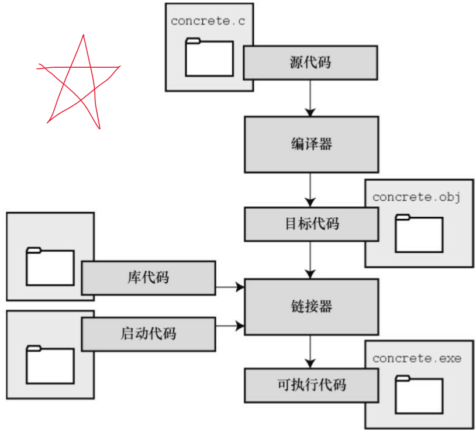
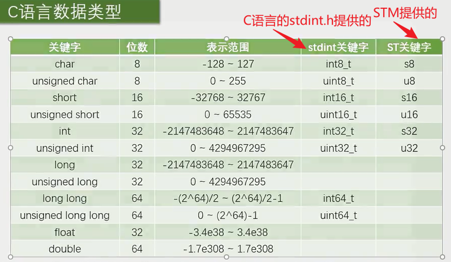
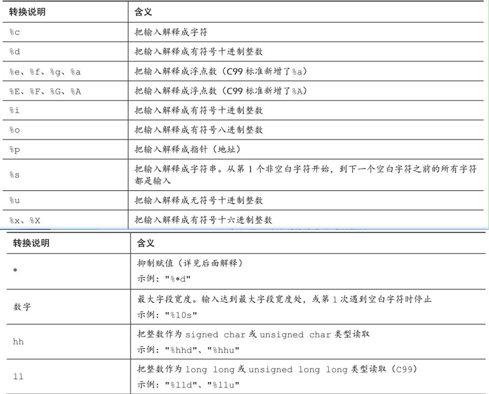
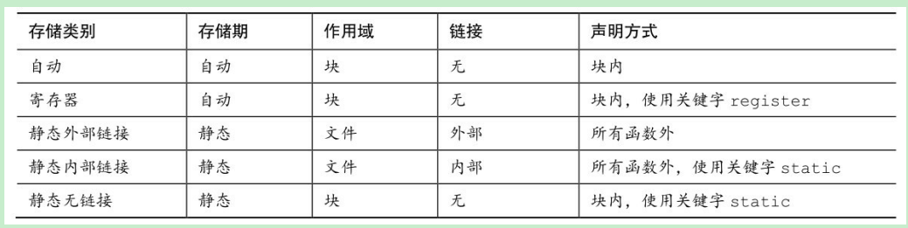
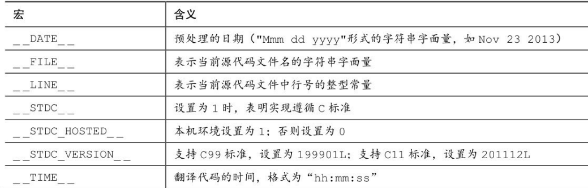

# C语言概述

C设计理念：让用户轻松自顶向下的规划、结构化编程、模块化设计。

C程序思想：“针对目标计算机来定义最合适的某种操作”。

C标准：（从“不要妨碍程序员做需要做的事  ”到“不那么信任程序员”）

1. 1994年——C99
2. 2011年 ——C11

C编程七步骤：

1. 第一步——定义程序目标：描述问题，为解决问题做准备——明确自己想做什么， 思考你的程序需要哪些信息， 要进行哪些计算和控制， 以及程序应该要报告什么信息。
2. 第二步——设计程序：设计程序处理模块，为编码做准备；用户界面、程序结构、目标用户、时间限制、如何表示数据、处理数据等。
3. 第三步——编写代码。
4. 第四步——编译。
5. 第五步——运行。
6. 第六步——测试和调试。
7. 第七步——维护和修改。

C程序执行：源代码文件——通常为.c文件，需要通过程序将其转换为可执行文件才能执行，而实现这一过程需要通过编译和链接这两步来实现。

编译器把源代码转换成中间代码（机器码）， 链接器把中间代码和其他代码合并， 生成可执行文件。  

- 编译器的作用：编译为机器可识别的代码——机器码。
- 链接器的作用：把你**编写的目标代码、 系统的标准启动代码和库代码**这 3 部分合并成一个文件， 即可执行文件。 对于库代码， 链接器只会把程序中要用到的库函数代码提取出来。



# C编译器安装

## 主流编译器

参考文章：[C++主流编译器总结 - 张小凯的博客 (jasonkayzk.github.io)](https://jasonkayzk.github.io/2022/05/28/C++主流编译器总结/)

主流的C/C++编译器：GCC/G++、Clang（苹果公司开源的，是在 LLVM 项目中一个很重要的前端工具）、MSVC（微软的）。

Windows平台：

1. **MSVC**：微软自家的编译器，Microsoft Visual C++ Compiler。
2. **MinGW**：Minimalist GNU for Windows，GNU在Linux下的gcc/g++编译器向Windows平台拓展的产物。

Linux平台：GCC/G++。（GCC/G++只是负责Driver，调用真正的编译器来将源码编译成汇编代码）

GCC/G++的区别：

- **G++** 会把 `.c` 文件当做是 C++ 语言 (在 `.c` 文件前后分别加上 `-xc++` 和 `-xnone`, 强行变成 C++)，从而调用 `cc1plus` 进行编译；
- **G++** 遇到 `.cpp` 文件也会当做是 C++，调用 `cc1plus` 进行编译；
- **G++** 还会默认告诉链接器，让它链接上 C++ 标准库；
- **GCC** 会把 `.c` 文件当做是 C 语言，从而调用 `cc1` 进行编译；
- **GCC** 遇到 `.cpp` 文件，会处理成 C++ 语言，调用 `cc1plus` 进行编译；
- **GCC** 默认不会链接上 C++ 标准库；
- **GCC** 不会定义 **__cplusplus** 宏，而 **G++** 会；

## 编译器安装

Windows下安装MinGW：

- [MinGW-w64 - for 32 and 64 bit Windows - Browse /mingw-w64/mingw-w64-release at SourceForge.net](https://sourceforge.net/projects/mingw-w64/files/mingw-w64/mingw-w64-release/)，滑到后面找到MinGW-W64-install.exe，或者下载免安装压缩包x86_64-posix-sjlj或x86_64-posix-seh。
- 或者去Github上下载更新的版本：[Releases · niXman/mingw-builds-binaries (github.com)](https://github.com/niXman/mingw-builds-binaries/releases)，x86_64-12.2.0-release-win32-seh-ucrt-rt_v10-rev2.7z，解压配环境变量即可。
- 下载免安装压缩包解压后将里面的bin目录添加到Path环境变量里，然后打开cmd执行`gcc -v`，出现gcc版本信息即可。

Linux下安装：

1、CentOS：安装gcc、g++及vum，安装完执行`gcc -v`查看安装版本。

```
yum -y install gcc gcc-c++ autoconf pcre pcre-devel make automake
yum -y install wget httpd-tools vim
```

2、Ubuntu：`sudo apt install gcc`。（安装完执行`gcc --version`查看版本）

## 编译过程

摘自[C++主流编译器总结 - 张小凯的博客 (jasonkayzk.github.io)](https://jasonkayzk.github.io/2022/05/28/C++主流编译器总结/)。

**GCC/G++ 在执行编译工作的时候，总共需要4步：**

1. **预处理，生成 `.i` 的文件（预处理器cpp），此时对应的参数是 `-E`；**
2. **将预处理后的文件转换成汇编语言，生成文件`.s`（编译器egcs），对应的参数是 `-S`；**
3. **由汇编代码变为目标代码（机器代码）生成 `.o` 的文件（汇编器as），对应的参数是 `-c`；**
4. **连接目标代码，分配实际的内存地址并生成可执行程序（链接器ld），无参数；**

即：一个C/C++文件要经过预处理(preprocessing)、编译(compilation)、汇编(assembly)、和连接(linking)才能变成可执行文件。

1、预处理：`gcc -E main.c -o main.i `。

`-E` 的作用是让 GCC 在预处理结束后停止编译；预处理阶段**主要处理 `include和define`** 等；它把 `#include` 包含进来的 `.h文件` 插入到 `#include` 所在的位置，把源程序中使用到的用 `#define` 定义的宏用实际的字符串代替。

2、编译：`gcc -S main.i -o main.s`。

`-S` 的作用是编译后结束，编译生成了汇编文件；在这个阶段中，GCC 首先要检查代码的规范性、是否有语法错误等；以确定代码的实际要做的工作，在检查无误后，GCC 把代码翻译成汇编语言。

3、汇编：`gcc -c main.s -o main.o`。

汇编阶段把 `.s`文件翻译成二进制机器指令文件`.o`，这个阶段接收 `.c` 、`.i`、`.s` 的文件都没有问题。

4、链接：`gcc -o main main.s`。

链接阶段，链接的是函数库；在 `main.c` 中并没有定义 `printf` 的函数实现，且在预编译中包含进的 `stdio.h` 中也只有该函数的声明；而系统把这些函数实现都被做到名为`libc.so`的动态库。

**函数库一般分为静态库和动态库两种：**（GCC 在编译时默认使用动态库）

- **静态库是指编译链接时，把库文件的代码全部加入到可执行文件中，因此生成的文件比较大，但在运行时也就不再需要库文件了；Linux中后缀名为 `.a`**。
- **动态库与之相反，在编译链接时并没有把库文件的代码加入到可执行文件中，而是在程序执行时由运行时链接文件加载库；Linux中后缀名为 `.so`，如 `libc.so` 就是动态库。**

动态与静态库：

- **静态库节省时间：不需要再进行动态链接，需要调用的代码直接就在代码内部。**
- **动态库节省空间：如果一个动态库被两个程序调用，那么这个动态库只需要一份在内存中。**

# 基础

## Start C

单文件程序：

```c
#include <stdio.h>
int main(){
   
    return 0;
}
```


## 变量&常量

**1、变量声明与赋值：**以int类型变量为例（建议变量都显式初始化）

```c
#include <stdio.h>
int main(){
	/* 数据类型  变量名  =  值; */
	int num;  // 变量声明
	num = 0;  // 变量赋值
	int n1 = 1, n2 = 2, n3 = 3; // 声明并初始化
	int n4 = n5 = n6 = 3;  // 不能这样声明
}
```

**2、常量：**（最好用`#define`定义常量，用const定义只读变量）

使用`#define`定义常量：

```c
#include <stdio.h>
#define VALUE 12
#define BEEP '\a'
#define STR "我是一个常量字符串"
#define INT_MAX +32767
int main(){
	// 编译程序时， 程序中所有的TAXRATE都会被替换成0.015。 这一过程被  
    // 称为编译时替换（compile-time substitution）
	printf("%d",VALUE); 
	printf("%c",BEEP); 
	printf("%s",STR); 
}
```

使用const限定符：

```c
#include <stdio.h>
// 声明为只读
const int NUM2 = 99;
int main(){
	const int NUM = 99;
}
```

一些头文件定义了关于类型信息的一些常量：如`#include <limits.h>` ——整型限制  ，`#include <float.h>`—— 浮点型限制。

## 数据类型

C中的基本数据类型：整型、浮点型、字符型、布尔型、可移植型、复数虚数类型。

### 整型

1、int类型取值范围：取值范围具体由计算机系统决定，但通常int类型都是32位存储。**C规定int的取值范围最小为-32768～32767（即16位存储）。**

```c
// 打印int值：
#include <stdio.h>
int main(){
	int num = 9;
	int val = 99；
	// %d是转换说明，代表值顺序和后面的num、val一致
	printf("num是%d；val是%d",num,val);  
}
```

2、数值的表示方式，科学计数法或进制表示法：

```c
#include <stdio.h>
int main(){
	int num = 011;  // 八进制，表示十进制数9
	int val = 0b11; // 二进制，表示十进制3
	int temp = 0x12;// 十六进制，表示十进制18
	// %d是转换说明，代表值顺序和后面的num、val一致
	printf("num是%d；val是%d；temp是%d",num,val,temp);  
}
```

3、C中的整型以有无符号分类：

- 有符号整型：short、short int、int、long、long long、long long int。（也可以使用signed来强度这是有符号类型）
- 无符号整型：加上unsigned关键字即可。

常见的存储：short——16位，int——32位，long——32位，long long——64位。

通常的整数数值都看作是int型，如果数值超了int的范围，编译器会尝试使用unsigned int，如果还不够大， 编译器会依次使用long、 unsigned long、 long  long、和unsigned long long类型。

4、数值后缀：

```c
#include <stdio.h>
int main(){
    long n1 = 12L;
    long long n1 = 12LL;
    unsigned long long n3 = 12LLU;
}
```

5、整数溢出：当数值大小超过相应类型的取值范围，那么就会从类型最小值开始重新计数。

6、整数选择：考虑内存节省、移植等。

7、使用printf打印的转换符说明：

| 转换符 | 类型                     |
| ------ | ------------------------ |
| %u     | unsigned int             |
| %ld    | long                     |
| %lx    | 以十六进制数打印long类型 |
| %lo    | 以八进制数打印long类型   |
| %hd    | short                    |
| %lu    | unsigned long            |
| %lld   | long long                |
| %llu   | unsigned long long       |


### 浮点型

1、**float类型**取值范围：C标准规定， float类型必须至少能表示**6位有效数字**， 且取值范围至少是10-37～10+37（至少为32位）。  

> 浮点数存储：通常，系统储存一个浮点数要占用32位。 其中8位用于表示指数的值和符号， 剩下24位用于表示非指数部分（也叫作尾数或有效数） 及其符号。（有效数乘以以十为低的指数即浮点数，指数越大，小数点就移动越大）

2、**double类型**：double类型和float类型的最小取值范围相同， 但至少必须能表示**10位有效数字**。

> 一般情况下， double占用64位，多的32位有的系统用来表示非指数部分，也有的分配给指数。不过无论哪种，都至少有13位有效数。

3、**long double类型**：C只保证long double类型至少与double类型的精度相同。  

**默认情况下， 编译器假定浮点型常量是double类型的精度。**  

4、使用进制表示：C99 标准——用16进制表示浮点型常量：即在十六进制数前加上十六进制前缀（0x或0X） ， 用p和P分别代替e和
E， 用2的幂代替10的幂（即， p计数法）  

```c
#include <stdio.h>
int main(){
    // a=十进制10，1f = 1/16 + 15/256，p10 = 2^10
    // (10 + 1/16 +15/256) × 1024（即， 十进制10364.0）
    float num1 = 0xa.1fp10;
    printf("%f",num1);
}
```

5、使用科学计数法表示浮点数：

```c
#include <stdio.h>
int main(){
	float num1 = 1.013e-5; // 1.013 * 10^5
	float num2 = 3e8;      // 3 * 10^8
	printf("%f",num1);
}
```

6、使用printf()函数打印浮点数：

```c
#include <stdio.h>
int main(){
    float num1 = 0xa.1fp10;
    printf("%f",num1);  
}
```

1. %f：转换说明打印十进制记数法的float和double类型浮点数。
2. %e：打印指数记数法的浮点数。
3. 如果系统支持十六进制格式的浮点数， 可用a和A分别代替e和E。
4. 打印long double类型要使用%Lf、 %Le或%La转换说明。

### sizeof()

```c
#include <stdio.h>
int main(){
    /* C99为类型大小提供%zd转换说明  些不支持C99和C11的编译器可用%u或%lu代替%zd */
    // 查看各类型所占字节数
    printf("Type int has a size of %zd bytes.\n", sizeof(int));
    printf("Type char has a size of %zd bytes.\n", sizeof(char));
    printf("Type long has a size of %zd bytes.\n", sizeof(long));
    printf("Type long long has a size of %zd bytes.\n",
           sizeof(long long));
    printf("Type double has a size of %zd bytes.\n",
           sizeof(double));
    printf("Type long double has a size of %zd bytes.\n",
           sizeof(long double));
    return 0;
}
```


### 字符

char类型，表示单个字符，实际上存放的不是字符而是一个整数值，通过该整数值编码显示一个字符。

```c
#include <stdio.h>
int main(){
    char a = 'A';
    char b = 'ABCD';  // int为32位char为8位的系统下可行，这样的话只有最后一个有效
    char c = 77; // M，使用ASCII值表示
    char f = '\a'; // 蜂鸣字符
    char beep = '\007'; // 有没有0，这种写法下都解释为八进制
    printf('%c',beep);
}
```

打印不出来的一些字符，比如蜂鸣等符合，可以用以下方式表示：

1. 使用字符的ASCII值 。
2. 使用转义序列。
3. 用十六进制形式表示字符常量 。（例如&，`char a = '\x026';`）

无符号与有符号，unsigned char、signed char。（8位，-128~127,0~255）

### 布尔值

布尔值：`_Bool`，存储1或0。


### 可移植类型

C99 新增了两个头文件 stdint.h 和 inttypes.h， 以确保C语言的类型在各系统中的功能相同。

```c
#include <stdio.h>
#include <stdint.h>
int main(){
    int32_t n = 99;
}
```




## 字符串和格式化输入输出

### 字符串

C中用char型数组来存储字符串，存储的字符串会在末尾自动加上一个`\0`，表示字符串结束，char类型一般占用一个字节。

数组末尾的`\0`表示空字符（null character），是非打印字符，其ASCII码为0。

```c
#include <stdio.h>
int main(){
    char s[10] = "一九九八";  // 一个中文占用两个字节
    printf("%s",s);
    return 0;
}
```

strlen(str)函数：返回数组的有效存储个数，不包括空字符，该函数的原型在string.h头文件中声明，返回值为size_t（即unsigned int）。

```c
#include <stdio.h>
#include <string.h>
int main(){
	char str[10] = "ABCDEFGHI";
	int n1 = strlen(str);
    int n2 = sizeof(str);
	printf("有效存储单元：%d",n1);  // 9
	printf("总存储单元：%d",n2);    // 10
}
```


### printf()

1、用于打印字符到控制台。使用格式：`printf("要打印的字符、变量值、表达式结果等",变量或表达式列表);`
如果要打印变量、表达式结果，需要使用转换说明，基本的转换说明如下：

| 转换说明 | 输出                                    |
| -------- | --------------------------------------- |
| %a   %A  | 浮点数、十六进制数和p计数法 （C99/C11） |
| %c       | 单个char字符                            |
| %d  %i   | 有符号十进制整数                        |
| %e  %E   | 浮点数，使用e计数法                     |
| %f       | 浮点数，使用十进制计数法                |
| %g   %G  | 根据值不同自动选择%f或%e                |
| %o       | 无符号八进制数                          |
| %u       | 无符号十进制数                          |
| %x  %X   | 无符号十六进制数                        |
| %%       | 打印一个百分号                          |
| %p       | 指针                                    |
| %s       | 字符串                                  |

```c
#include <stdio.h>
int main(){
    int age = 199;
    printf("我的年龄：%d", age);
    return 0;
}
```


2、转换说明的修饰符：

| 修饰符 | 含义                                                         |
| ------ | ------------------------------------------------------------ |
| 标记   | 可在%后使用一个或多个标记，也可不使用。<br>有五种标记：-、+、空格、#和0 |
| 数字   | 标记后、说明符前使用，用于表示最小字段宽度，<br>但是如果设置的宽度不能容纳打印的数字或字符串，系统会使用更宽的字段 |
| .数字  | 用于表示精度，标记后、说明符前使用<br>%e、%E、%f  ===>  表示小数点右边数字的位数<br>%g、%G ===>   表示有效数字的最大位数<br>%s   ===>   表示待打印字符的最大数量<br>整型  ===>  表示待打印数字的最小位数<br>实例：`%5.2f`  打印浮点数，字段宽度为5字符，小数点后保留两位数字 |
| h      | 和整型转换说明一起使用，表示short int 或 unsigned int类型的值，实例：`%hu`、`%hx`、`%6.5hd` |
| hh     | 和整型转换说明一起使用，表示signed char 或 unsigned char类型的值，实例：`%hhu`、`%hhx`、`%6.4hhd` |
| j      | 和整型转换说明一起使用，表示intmax_t 或 uintmax_t类型的值（类型定义在stdint.h），实例：`%jd` |
| l      | 和整型转换说明一起使用，表示long int 或 unsigned long int类型的值，实例：`%ld`、`%8lu` |
| ll     | 和整型转换说明一起使用，表示long long int 或 unsigned long long int类型的值，实例：`%lld` |
| L      | 和整型转换说明一起使用，表示long double类型的值，实例：`%Ld` |
| t      | 和整型转换说明一起使用，表示ptrdiff_t类型（两个指针差值的类型）的值，实例：`%td` |
| z      | 和整型转换说明一起使用，表示size_t类型的值，实例：`%zd`      |

在K&R C中， **表达式或参数中的float类型值会被自动转换成double类型**。 一般而言， ANSI C不会把float自动转换成double。 然而， 为保护大量假设float类型的参数被自动转换成double的现有程序，  **printf()函数中所有float类型的参数（对未使用显式原型的所有C函数都有效）仍自动转换成double类型。**

修饰符——标记：

| 标记 | 含义                                                         |
| ---- | ------------------------------------------------------------ |
| -    | 打印左对齐（`%-20s`）                                        |
| +    | 用于显示正负号，有符号正值前显示+，负值前显示-   （`%+6.2f`） |
| 空格 | 正数的正号用空格显示，负数的负号则用-显示   （`%6.2f`即为空格标记） |
| #    | 把结果转换为另一种形式                                       |
| 0    | 对于数值，用前导0代替空格填充字段宽度（`%08.0f`，数值占不满8字段宽度就前面填充0）<br>对于整数如果出现-标记或者指示精度，则忽略该标记 |

3、传入参数与返回值：

- 传入参数要与转换说明一一对应，不能多不能少，否则打印将不符合预期，可使用变量、常量、表达式。
- 返回值为打印的字符的个数，如果打印失败则返回一个负值。


### scanf()

1、scanf()使用指向变量的指针，用于读取输入的不同格式的数据。读取基本数据类型数据需要使用&——取地址符，读取字符串则不需要。

```c
#include <stdio.h>
int main(){
    int age; // 变量
    float assets; // 变量
    char pet[30]; // 字符数组， 用于储存字符串
    
    printf("Enter your age, assets, and favorite pet.\n");
    scanf("%d %f", &age, &assets); // 这里要使用&，读取
    scanf("%s", pet); // 字符数组不使用&
    printf("%d $%.2f %s\n", age, assets, pet);
    return 0;
}
```

2、scanf的读取过程：

- 读取数值：第一个非数值，不会把值赋给变量，会把非数值放回输入中。第一个是正号或符合，则保护符号后继续往后读取数据直到不能读取（空格或非数字），然后计算数值赋值给变量；使用字段宽度，则最多只读取宽度范围内的数。
- 读取字符：会读取除空白以外的所有字符，直到再次遇到空白就读取结束。scanf读取字符会把字符放进数组中，数组中末尾是`\0`。

其它的读取输入的函数：getchar()、fgets()。

3、参数和返回值：

```c
#include <stdio.h>
int main(){
    int age;
    char name[10];
    scanf("%d %s",&age,name);
    printf("age:%d\n",age);
    printf("name:%s\n",name);
    return 0;
}
```

- 读取成功：scanf()函数返回成功读取的项数。 
- 读取失败：如果没有读取任何项， 且需要读取一个数字而用户却输入一个非数值字符串，scanf()便返回0。 
- 读取结束：当scanf()检测到“文件结尾”时， 会返回EOF（EOF是stdio.h中定义的特殊值，通常用\#define指令把EOF定义为-1）。  

4、补充——转换说明修饰符：




### *修饰符

对于printf，修饰符*可以充当标识变量：

```c
#include <stdio.h>
int main(){
    unsigned width, precision;  //  字符宽度，精度
    int number = 256;
    double weight = 242.5;
    printf("Enter a field width:\n");
    scanf("%d", &width);
    printf("The number is :%*d:\n", width, number); // *就是width的值
    printf("Now enter a width and a precision:\n");
    scanf("%d %d", &width, &precision);
    printf("Weight = %*.*f\n", width, precision, weight); // *.*相当于width.precision
    printf("Done!\n");
    return 0;
}
```

对于scanf：把*放在%和转换字符之间时， 会使得scanf()跳过相应的输出项 。

```c
int main(){
    int n;
    printf("Please enter three integers:\n"); 
    // 输入：12 34 56，最后将输出56，前两项被跳过
    scanf("%*d %*d %d", &n); 
    printf("The last integer was %d\n", n);
    return 0;
}
```

## 类型转换

类型转换规则——自动转换：

1. 表达式中：无论是unsigned还是signed的char和short都会被自动转换成int， 如有必要会被转换成unsigned int（如果short与int的大小相同， unsigned short就比int大， 这种情况下， unsigned short会被转换成unsigned int） 。 在K&R那时的C中， float会被自动转换成double（目前的C不是这样） 。 （从较小类型转换为较大类型）
2. 两种类型运算：两个值会被分别转换成两种类型的更高级别。
3. 类型级别（高 ===> 低 ）：long double、 double、 float、 unsignedlong、long、 long long、 unsigned long、 long、 unsigned int、 int。  （例外：当 long 和 int 的大小相同时， unsigned int比long的级别高  ）
4. 赋值表达式中：计算的最终结果会被转换成被赋值变量的类型。   
5. 函数传参时：char和short被转换成int， float被转换成double。  

强制类型转换：使用`(type)`。

## 运算符

`&`：取地址运算符。

`*`：解引用运算符，后跟指针或地址，会给出存储在指针指向地址上的值。（指针的值是一个地址，大部分系统中这个地址值用无符号整数表示）

# 数组

## 一维数组

1、数组声明和初始化：

```c
#include <stdio.h>
int main(){
    // 只声明，数组里的值由内存中的值决定，并没有所谓的未声明默认值
    int arr0[6];
    // 声明并初始化
    int arr1[3]={0,1,2};
    // 只要声明并初始化一些元素，其它的才会默认初始化为0
    int arr2[3]={3};
    // arr3的大小将会是10
    int arr3[]={1,2,3,[9]=9};
    return 0;
}
```

```c
/* 指定初始化器 */
int arr[6] = {[5]=12};  // 只将最后一个初始化为12，其它的将默认初始化为0
```

2、编译器不会检查数组越界访问。

3、声明大小时，`[]`内可以是表达式，但值必须大于0。

4、一维数组，数组名表示指向首元素的一个地址，可以使用解引用操作  `*{arr+index}`  取出数组中的值。

## 二维数组

二维数组，即数组中存储数组。

``` c
// 两个二维数组内的值一致
int arr1[2][3] = {1,2,3,4,5,6};
int arr2[2][3] = {{1,2,3},{4,5,6}};
```

二维数组中，数组名表示的是指向首元素的地址，而`arr[0]`表示指向第一行的数组的首元素的地址。

# 函数

**1、函数使用三步骤：**1、函数原型声明；2、函数体编写；3、函数调用。

```c
#include <stdio.h>
// 指定函数返回值、函数名、函数形参；void表示没有，没有返回值、没有形参
void show(void); 
int main(){
	// 函数声明也可以放在main函数内：void show(void);
    show();
    show();
	return 0;
}
void show(void){
    int count;
    for(count=1;count <= 10;count++) putchar('*');
    putchar('\n');
}
```

**2、有参数的函数：**

```c
#include <stdio.h>
void show(char c, int num);  // 形参名是假名，定义时可与其不一样
// 有参函数声明也可以不声明形参名，到定义的时候再指定形参名
// void show(char, int);
int main(){
    show('&',12);
	return 0;
}
void show(char c, int num) {
    int count;
    for(count=1;count <= num;count++) putchar(c);
    putchar('\n');

}
```

**3、已经废弃的但需要了解一下的：**

```c
#include <stdio.h>
void old(n1,n2);
// 形参可以在声明后再声明
int n1,n2;
int main(){
    old(12,12);
	return 0;
}
}
void old(n1,n2){
    printf("%d",n1 * n2);
}

```

**4、对于较小的函数，常不单独声明，而是直接将定义放在第一次调用函数前。**

```c
#include <stdio.h>
void show(char c, int num) {
    int count;
    for(count=1;count <= num;count++) putchar(c);
    putchar('\n');
}
int main(){
    show('&',12);
    return 0;
}
```

**5、使用指针形参：**使用指针形参，传进去的将是地址值。

# 指针

指针变量，存储地址编号的变量。在32位平台下，任何类型的指针变量占用内存空间都是4字节大小；64位平台下则是8字节大小。对应类型的指针，只能存放对应类型的变量的地址。

## 声明&定义

1、简单的指针的声明与定义：`数据类型*  指针变量名;`

```c
/* 示例 */
int* ptr;   //  声明指向int型的指针
int *p1,*p2; // 声明多个
int arr[]={};
ptr = arr;  // 指向arr数组的首元素
```

2、关于指针的操作符：

- `*`：是一个指针修饰符，用于指针声明；也可以作为解引用符，用于获取指针存储的地址所指向的内存中的值。
- `&`：取地址符，用于取出地址。

```c
int* ptr;
int val = 12;
ptr = &val;
printf("%d",*ptr);
```

3、指针声明规范：

```c
int* ptr1;
int* ptr2;
```

4、指针分类：

- 指向基本数据类型的指针。
- 函数指针。
- 结构体指针。
- 数组指针。
- 通用指针，`void*`。

## 指针操作

指针操作：赋值（地址、指针可以赋值给指针，不同类型的指针间赋值可以使用强制转换）、解引用（使用  `*` 将指针里存储的地址的值取出来）、递增递减（指向地址的移动）、与整数相加相减（指向地址的移动）、取地址（使用 `&` 取指针的地址）。

```c
#include <stdio.h>
int main() {
    int arr[] = {3,6,9};
    int* ptr;
    ptr = arr;
    printf("%d\n",*ptr);  // 3
    printf("%d\n",*(ptr+2)); // 9
    printf("%d\n",*(++ptr)); // 6
    printf("%d\n",*ptr);     // 6
    return 0;
}
```

指针大小比较：两个相同类型的指针可以比较大小，只不过只有两个相同类型的指针指向同一个数组的元素的时候，比较大小才有意义，指向前面的指针的大小将小于指向后面的。

```c
int arr[] = {3,6,9};
int* p1 = &arr[2];
int* p2 = &arr[0];
if(p1 > p2){
    printf("p1大于p2，也就是后面的大于前面的");
}
```

不要解引用未初始化的指针。

```c
int* ptr;
printf("%d",*ptr);  // 不要对未初始化的指针使用 * 来解引用
```

## 指针数组

指针数组，存放指针的数组。

```c
int* arr[10];  // 存储指向int类型的指针
arr[2] 与 *(arr + 2)等价
```

## 指针的指针

指针的指针，就是指向指针的指针。

```c
/* 存放指针的指针及它们的取值 */
int val = 999;
int* p1 = &val;
int** p2 = &p1;
int*** p3 = &p2;
/* 一个*表示解引用一个地址，解引用后再解引用，解到最后的一个指向实际值的指针就可以取得值了 */
printf("%d\n",*p1);
printf("%d\n",**p2);
printf("%d\n",**p3);
```

## 数组指针

数组指针，就是指向数组类型的指针。

1、数组指针定义：`指向的数组的类型 (*指针变量名)[数组元素个数]; `，意为该指针变量指向有n个数组元素的数组，指针存储的是数组首元素的地址值。

```c
/* 一维数组指针，配合二维数组使用 */
int arr[2][3] = {{1,2,3},{4,5,6}};
int (*p)[3] = arr;  //  数组指针指向 {1,2,3}
int (*p1)[3] = arr + 1; // 数组指针指向{4,5,6}
/* 数组指针存储的是数组的地址，*p1就可以解引用得到二维数组首元素的地址（二维数组的元素为数组）
	*(*p1)就可以解引用出数组里的值
*/
printf("%d",*(*(p1)+2));
```

```c
int arr1[]={7,8,9};
int (*p1)[] = arr1;
int (*p2)[6] = arr1;
printf("%d\n",*(*(p1)+2));
printf("%d",*(*p2+1));
```

二维数组指针，配合三维数组使用。

如果对数组名取地址，那么就会得到一个数组指针。

```c
int arr[] = {1,2,3};
printf("&arr=%p",&arr);
printf("&arr+1=%p",&arr+1);
```

## 函数与指针

1、指针形参：

```c
/* 使用指针形参，把地址传过去，传入的地址值是不会被改变的（因为是值传递） */
/* 通过解引用后赋值会改变传入的地址所对应的内存中的值，地址本身不会被改变，但存储的值可以被改变 */
void swap(int* a,int* b){
    int temp = *b;
    *b = *a;
    *a = temp;
}
void main(){
    int a = 10, b = 20;
    swap(&a,&b);
    printf("a=%d\n",a);
    printf("b=%d",b)
}
```

2、数组形参：

```c
/* 传一维数组，传的是数组首元素地址 */
void test1(int[] arr){
    
}
void test2(int* ptr){
    
}
/* 传二维数组 */
void test3(int (*ptr)[9]){
    
}
```

3、函数返回指针：

```c
char* test(void){
    char* str = "string";
    // 返回局部数组地址，函数执行完毕就会被释放，返回的地址指向的内存内的内容可能不再是预期的
    return str;  
}
/* 使用动态内存分配，free()后或程序结束后内存才释放 */
#include <string.h>
char* test(void){
    char* str;
    str = (char*)malloc(100*sizeof(char));
    strcpy_s(str,100,"string");
    return str;  
}
void main(){
    char* p = test();
    printf("%s",p);
    free(p);
}
```

4、函数指针：程序运行时也会将函数加载到内存中，函数的名字就是函数的首地址，即函数入口地址，函数指针就是存放函数地址的指针。

```c
/* 函数指针变量定义：`函数返回值类型 (*函数指针变量名)(形参列表)` */
int (*fun)(int,int);  // 定义了一个函数指针，指向的函数必须有两个整型形参、一个整型返回值
```

```c
int test(int a,int b);
void main(){
    // 函数指针
    int (*fun)(int,int);
    fun = test;
    printf("%d",fun(12,12));
}
int test(int n1, int n2){
    return n1*n2;
}
```

5、函数指针数组：存放函数指针变量的数组。

```c
/* 定义：`类型名 (*数组名[数组个数])(形参列表)` */
int f1(int a,int b);
int f2(int a,int b);
void main(){
	// 定义函数指针数组
    int (*pFun[2])(int,int) = {f1,f2};
    printf("乘积:%d\n",pFun[0](12,12));
    printf("max:%d",pFun[1](9,6));
}
int f1(int n1, int n2){
    return n1*n2;
}
int f2(int a,int b){
    return a>b?a:b;
}
```

6、函数指针作函数形参：

```c
int max(int a,int b);
int min(int a,int b);
int process(int (*p)(int,int),int x, int y);
void main(){
    printf("min:%d\n",process(min,9,6));
    printf("max:%d",process(max,9,6));
}
int max(int a,int b){
    return a>b?a:b;
}
int min(int a,int b){
    return a<b?a:b;
}
int process(int (*p)(int,int),int x, int y){
    return (*p)(x,y);
}
```

## void*与NULL

`void*`，是一个通用指针，如何类型的指针都可以给 `void*` 类型的指针赋值。

NULL，空指针，内存编号`0x00000000`（32位平台）、`0x0000000000000000`（64位平台），常用于指针初始化（用0也是一样的）。

# 字符串

## 字符串初始化

字符串字面量（字符串常量）：双引号包住的就是，也是指针，可以使用转义字符，末尾自动加上`\0`。

**1、字符串初始化：**

```c
#define ISSTRING "我是一个字符串"
/* 字符串数组的数组名是数组首元素的地址 */
char str[] = {'a','\0'}; // 最后不加\0则是一个字符数组
char str[] = "我是一个字符串"; 
/* 指针表示法创建字符串 */
const char * pt1 = "Something is pointing at me.";
const char ar1[] = "Something is pointing at me.";

printf("%s",ar1);
printf("%s",pt1);  
printf("%c",*ar1);
printf("%c",*pt1); 
```

**2、两种字符串形式：**

数组形式的字符串：

- 字符串存储在静态存储区，程序运行时将字符串拷贝到数组中，**然后将数组的别名识别为数组首元素地址的别名**，**这个地址是一个地址常量**，只能对这个别名进行读操作，不能进行赋值操作。
- 程序运行后为数组分配内存空间，然后每个元素被初始化为字符串字面量对应的字符，数组末尾自动加上`\0`。

指针形式的字符串：（如果使用malloc()函数来分配内存的就是在动态存储区）

- 字符串也是在静态存储区，只不过指针存储了这个字符串在静态存储区的地址，**最开始存储的是首元素的地址**，并且这个指针变量可以改变（因为改变的是指针变量存储的地址值，并没有改变所指向的那部分内存的地址）。
- 因为字符串字面量被看作是const数据，其值应该是不可变的，如果使用指针指向字符串字面量，那么这个指针也应该声明为指向const数据的指针，以确保不能通过指针修改字符串数据。（如果不声明为const指针，那么能通过指针修改字符串内数据）

数组形式的字符串和指针形式的字符串的区别：数组的数组名是常量，指针的指针名是变量（一个只读，一个可读可写）。实际使用上数组读取单个字符的方式，指针也可以使用，并且指针可以自增自减。

```c
char s1[] = "is string";
const char* s2 = "string";
printf("%c",s2[3]);  // 相当于`*(s2+3)`，不会改变指向的地址
// 使用自增自减会改变指针存储的地址
while((*s2)!='\0') printf("%c\n",*(s2++));
```

**3、字符串数组：**

```c
int main() {
    // const，不能再修改存储的字符串中的元素
    const char* s1[3] = {"ptr-string 1","ptr-string 1","ptr-string 1"};
    // 可以修改存储的字符串中的元素
    char s2[3][40]={"array---string 1","array---string 2","array---string 3"};
    puts(s1[0]);
    puts(s2[0]);
    return 0;
}
```

指针数组，存储指针的数组，存储的指针指向的是静态内存中的字符串的地址。

存储字符串的数组，存储的是字符串字面量的一份副本。

## 字符串I/O

**1、字符串的输入：**

读取键盘输入的字符串，第一步是初始化内存，第二步是使用函数来获取到输入的字符。

```c
char *name;
// 指针未初始化，因此指针指向的地址可能是程序中存放了数据的地址，
// 再赋值会导致原来的数据丢失，从而导致程序异常
scanf("%s",name);
char str[99];
scanf("%s",str);
char address[20];
gets(address);
```

`scanf()`只能读取一个单词，遇到空格会停止读取；而`gets()`函数则可以读取一行字符，当遇到换行符时会停止读取。`gets()`存在安全隐患，已经不再推荐使用。读取字符过长时，`scanf()`和`gets()`都会导致数据溢出。

A、`fgets(参数1, 参数2, 参数3)`函数：参数1为字符数组，参数2为读取个数，参数3为读入的文件当读取的字符及加上'\0'后，如果长度不超过参数2，其会在前面加上换行符。

```c
int main() {
    char str[10];
    // (存储到的数组, 读取最大数, 读入的文件); stdin ===> 标准输入
    // 最多读取 12-1个字符存储到str，留一位放'\0'，如果仍然有多余的就会加上换行符'\n'有效字符末尾
    fgets(str,12,stdin);
    // stdout ===> 标准输出
    printf("%s",str);
    // puts()打印时会在末尾加上换行符，fputs()则不会
    fputs(str,stdout);
    return 0;
}
```

空字符是'\0'，是一个整数类型，空指针是指针类型并占四个字节，两者都可以用0表示。

B、`gets_s(参数1, 参数2)`：参数1为字符数组，参数2为读取个数。只从标准输入中读取，不会存储换行符。

```c
char str[10];
gets_s(str,12);
printf("%s",str);
```


**2、字符串的输出：**

`puts()`、`fputs()`、`printf()`。

```c
char address[20];
gets(address);
puts(address);          // 打印字符串并换行
fputs(address,stdout);  // 打印但不换行
printf("%s",address);   // 打印
```


## C库-字符串函数

`#include <string.h>`，sprintf()的原型在`#include <stdio.h>`。

| 函数                     | 作用                                                         |
| ------------------------ | ------------------------------------------------------------ |
| strlen(str)              | 返回字符串str的长度（不包括'\0'）                            |
| stract(参数1，参数2)     | 将参数2拼接到参数1的末尾，返回拼接后参数1的地址              |
| strncat(参数1，参数2，n) | 将参数2的前n个字符拼接到参数1的末尾，返回拼接后参数1的地址   |
| strcmp(s1，s2)           | 比较字符串大小，s1=s2，返回0；s1<s2，返回负值                |
| strcpy(s1，s2)           | 复制s2到s1，s1原先的字符串将丢失                             |
| strncpy(s1，s2，n)       | 复制s2中的n个字符到s1，如果复制有'\0'那么s1中后续的数据将会丢失<br>如果只复制s2中的n个字符但没有复制'\0'，那么s1中会保留有一些原始数据 |
| sprintf()                |                                                              |
| strchr(s1, ch)           | 返回一个指针，指向字符串 s1 中字符 ch 的第一次出现的位置。   |
| strstr(s1, s2)           | 返回一个指针，指向字符串 s1 中字符串 s2 的第一次出现的位置。 |

```c
int main() {
    char s[60]="it is a ";
    printf("%d\n", strlen(s));
    char* s2 = strcat(s,MESSAGE);
    puts(s2);
    // 将MESSAGE的前3个字符添加到s的末尾
    strncat(s,MESSAGE,3);
    puts(s2);
    return 0;
}
```

```c
#define M_PI 3.1415926
int main() {
    char str[80];
    sprintf(str, "Pi 的值 = %f", M_PI);
    puts(str);
    return 0;
}
```

## 字符串排序

对指针数组存储的指针进行排序。

## ctype.h字符函数


# 存储、链接、内存

C中的对象：物理内存。

## 存储类别

一些术语和概念：

- 存储期（storage duration） 描述对象， 所谓存储期是指对象在内存中保留了多长时间。  
- 标识符用于访问对象， 可以用作用域（scope） 和链接（linkage） 描述标识符， 标识符的作用域和链接表明了程序的哪些部分可
  以使用它。   

### 1、作用域和链接：

C中的作用域：块作用域（{}）、 函数作用域（函数内）、 函数原型作用域（函数原型声明内）、文件作用域（或称作全局作用域，文件中函数外所声明的变量有文件作用域）。

C变量的三种链接属性：

- 外部链接：外部链接变量可以在多文件程序中使用。
- 内部链接：内部链接变量只能在一个翻译单元中使用。

- 无链接：具有块作用域、 函数作用域或函数原型作用域的变量都是无链接变量，这些变量属于定义它们的块、 函数或原型私有。

C 标准用“内部链接的文件作用域”描述仅限于一个翻译单元（即一个源代码文件和它所包含的头文件） 的作用域， 用“外部链接的文件作用域”描述可延伸至其他翻译单元的作用域。（文件作用域里使用static声明的变量，就是内部链接的文件作用域）

---


### 2、存储期：

作用域和链接——描述标识符的可见性。

存储期——描述通过标识符访问的这些对象的生存期。存储期分为四种：静态存储期、 线程存储期、 自动存储期、 动态分配存储期。  

- 静态存储期：程序执行期间一直存在，所有的文件作用域都具有静态存储期。（和static无关，static是表明链接属性的）

- 线性存储期：多线程，表示线程的，具有线性存储期的对象，声明到线程结束前一直存在。（_Thread_local声
  明一个对象时， 每个线程都获得该变量的私有备份  ）
- 自动存储期：块作用域的变量通常都是具有自动存储期。（例如函数中的变量在调用时才初始化，函数结束时便销毁；局部变量都是自动类别；块级作用域内的使用static，就能具有静态存储期）

---


### 3、五种存储类别及变量：



自动存储类别的变量——自动变量，依此类推。

- **自动变量：**块或函数头声明的变量，没有默认初始化，可以使用`auto`存储类型说明符强调这是个自动存储类别变量。
- **寄存器变量：**和自动变量一样都是块作用域、 无链接和自动存储期。使用存储类别说明符`register`便可声明寄存器变量，需要注意的是只是申请，如果被CPU忽略了就只是自动变量。（可在函数形参中使用）
- **块作用域的静态变量：**这种变量具有块作用域、 无链接， 但是具有静态存储期，也就是说程序运行期该变量会一直存在、只能在声明其的编译单元内的块内被使用，是一个静态的局部变量。这种变量使用存储类别说明符`static`来声明，有默认初始化。不能在函数形参中使用。
- **外部链接的静态变量：**这种变量具有文件作用域、 外部链接和静态存储期。  这些变量是在源代码文件（注意不是头文件）的函数外部定义的（也就是全局变量），可以被其它的源代码文件所使用，不过呢其它的源代码文件使用这些变量时需要使用`extern`关键字再次进行声明（可以在函数外后函数内使用extern声明）。（存储类别说明符 extern  可以在函数中重复声明任何具有文件作用域的变量）
- **内部链接的静态变量：**这种变量具有文件作用域、内部链接和静态存储期。即使用 `static`关键字的全局变量，这种变量只能在编译单元内使用，不能在其它的源代码文件使用。 

```c
/* main.c文件 */
#include <stdio.h>
extern int num;    //  引用式声明，关键字extern表明该声明不是定义， 因为它指示编译器去别处查询其定义
void main(){
    register unsigned char i = 11;  // 请求寄存器变量
    if(){
        int n1 = 11; // 自动变量
    }
}
void test(){
    static int n2 = 10; // 块作用域静态变量
}
```

```c
/** test.c文件 **/
int num = 12;  // 定义式声明，声明并定义一个外部变量、全局变量，也是外部链接的静态变量
```

注意：全局作用域的变量声明，右值必须是常量或常量表达式，不能包含变量。

---

### 4、存储类别说明符：

| 存储类别说明符 | 说明                                                         |
| :------------- | ------------------------------------------------------------ |
| auto           | 表明变量是自动存储期， 只能用于块作用域的变量声明中  <br>由于在块中声明的变量本身就具有自动存储期， 所以使用auto主要是为了明<br/>确表达要使用与外部变量同名的局部变量的意图 |
| register       | 只用于块作用域的变量， 它把变量归为寄存器存储类<br/>别， 请求最快速度访问该变量。 同时， 还保护了该变量的地址不被获取。 |
| static         | static 用于文件作用域声明， 作用域受限于该文件。 如果 static 用于块作用域声明， 作用域则受限于该块。<br> 块作用域的静态变量无链接。 文件作用域的静态变量具有内部链接。 |
| extern         | 如果包含 extern 的声明具有文件作用域， 则引用的变量必须具有外部链接。 <br>如果包含 extern 的声明具有块作用域， 则引用的变量可能具有外部链接或内部链接 |
| Thread_local   | 可以和static或extern一起使用                                 |
| typedef        | typedef关键字与任何内存存储无关， 把它归于此类<br/>有一些语法上的原因 |

---

**5、函数的存储类别：**

```c
double gamma(double);             // 外部函数，其实也是默认为 extern
extern double delta(double, int); 
static double beta(int, int);     // 内部函数
```


## 分配内存

### 内存分配函数

exit()、malloc()和free()的原型都在 stdlib.h 头文件中。  

**1、malloc()函数：**

- 参数：该函数接受一个参数—— 所需的内存字节数，malloc()函数会找到合适的空闲内存块，但不会赋名。

- 返回值：因为char表示1字节，malloc()的返回类型通常被定义为指向char的指针。 然而，从ANSI C标准开始， C使用一个新的类型—— 指向void的指针，该类型相当于一个“通用指针”。 malloc()函数可用于返回指向数组的指针、 指向结构的指针等， 所以通常该函数的返回值会被强制转换为匹配的类型。  

**2、free()函数：**free()函数的参数是之前malloc()返回的地址， 该函数释放之前malloc()分配的内存。  

```c
#include <stdio.h>
#include <stdlib.h>
int main() {
    double * ptd;
    ptd = (double *) malloc(30 * sizeof(double));
    if (ptd == NULL)
    {
        puts("Memory allocation failed. Goodbye.");
        exit(EXIT_FAILURE);
    }
    printf("%zd",sizeof(double));
    // 释放malloc()分配的内存
    free(ptd);
    // EXIT_SUCCESS（或者， 相当于0） 表示普通的程序结束， EXIT_FAILURE 表示程序异常中止。
    exit(EXIT_FAILURE);
    return 0;
}
```

**内存池泄漏问题——示例：**

```c
#include <stdio.h>
#include <stdlib.h>
void gobble(double ar[], int n);
int main() {
    double glad[2000];
    /* 每调用一次gobble()，即使temp指针被销毁，但malloc()分配的内存仍然存在，
    正由于temp指针被销毁导致无法再访问这块内存 */
    /* 如果循环结束之前，内存被消耗完，这种问题就是内存泄漏问题 */
    for (int i = 0; i < 1000; i++)
        gobble(glad, 2000);
    return 0;
}
void gobble(double ar[], int n)
{
    double * temp = (double *) malloc( n * sizeof(double));
    /* free(temp); // 假设忘记使用free() */
}
```

**3、分配内存还可以使用calloc()  ：**

```c
long * newmem;
// 返回值类型：void*，参数1：存储单元数量，参数2：存储单元大小
// 创建 100个4字节的存储单元
newmem = (long *)calloc(100, sizeof (long));
free(newmem);
```

calloc()的特性：会把块中所有位都设置为0。

### 动态分配内存与数组


## ANSI C 类型限定符

### const

用const修饰普通变量、数组，表示**只读不能写**，const修饰的变量必须声明并初始化。

用const修饰指针：

```c
// 这两个限定指针变量指向的对象的值——不能通过指针修改指向对象值
const int* n1;
int const *n1;
// 限定指针变量本身，指针变量初始化后不能再指向别的对象
int* const n1;
// 限定指针本身，并且限定指向的对象的值
const int* const n1;
```

### volatile


### restrict

restrict 关键字允许编译器优化某部分代码以更好地支持计算。 它只能用于指针， 表明该指针是访问数据对象的唯一且初始的方式。  

### _Atomic  


### 新位置

C99允许把类型限定符和存储类别说明符static放在函数原型和函数头的形式参数的初始方括号中。 

```c
void ofmouth(int * const a1, int * restrict a2, int n); // 以前的风格
void ofmouth(int a1[const], int a2[restrict], int n); // C99允许
// 函数调用中的实际参数应该是一个指向数组首
元素的指针， 且该数组至少有20个元素
double stick(double ar[static 20]);
```


# 结构和其它数据类型

## 结构体

结构体——不同类型变量的集合，区别于数组（同一类型的值的集合）。

1、声明、定义与初始化、成员使用：

```c
/* 全局结构体声明 */
#define MAXTITL 20
#define MAXAUTH 10
// 结构的全局声明
struct book {
    char title[MAXTITL];
    char author[MAXAUTH];
    float value;
};
```

```c
/* 全局结构体的使用 */
void main(){
    // 定义并初始化结构体
    struct book surprise = {"《C++ primer》","外国人",80};
    struct book gift = {.title="《QT 开发指南》",.value=12};
    // 使用已定义的来初始化，是整体拷贝
    struct book g = gift;
    struct book power;
    /* 这样必须强制转换，因为{}也可以用来初始化数组 */
    power =  (struct book){"知识就是力量","培根",999};
    strcpy_s(s.name,20,"你的名字");
    printf("%s\n",surprise.title);
    printf("%s\n",gift.title);
    printf("%s\n",power.title);
}
```

```c
/* 局部结构体的使用 */
void main(){
    // 局部声明并定义结构体
    struct student {
        char name[20];
        int age;
    }s;
    // 初始化局部结构体
    s.age = 12;
    // 数组名是常量，不能直接s.name=来进行赋值
    strcpy_s(s.name,20,"你的名字");
    printf("%s\n",s.name);
}
```

2、伸缩性数组成员：C99新增了一个特性- 伸缩型数组成员（flexible array member） ，该数组不会立即存在。  

带伸缩型数组成员的结构确实有一些特殊的处理要求。 第一， 不能用结构进行赋值或拷贝；第二， 不要以按值方式把这种结构传递给结构；第三， 不要使用带伸缩型数组成员的结构作为数组成员或另一个结构的成员  。  

```c
struct flex
{ 
    double scores[]; // 伸缩型数组成员
}
```

3、C11增加的匿名结构体：匿名结构，一个没有名称的结构成员

```c
struct Student {
    char name[99];
    int age;
    // 匿名结构体
    struct{
        int year;
        int month;
        int day;
    };
};
void main(){
    struct Student s = {"王霸天",33,{1990,9,9}};
    printf("%d",s.year);
}
```


## 结构数组

```c
struct book {
    char title[20];
    char author[30];
    float value;
};
void main(){
    // 结构数组，数组的元素是book类型的
    struct book library[99];
    library[0] = (struct book){"L给你的惊喜╰(*°▽°*)╯","可爱的人",99};
    printf("%s\n",library[0].title);
    printf("%c\n",library[0].title[4]);
    printf("%c\n",library[0].title[0]);
}
```

## 嵌套结构

```c
struct Birthday {
    int year;
    int month;
    int day;
};
struct Student {
    char name[30];
    int age;
    struct Birthday birthday;
};
void main(){
    struct Student std = {"L Sir",133,{1949,1,1}};
    printf("%d",std.birthday.year);
}
```

## 指向结构体的指针

```c
struct Birthday {
    int year;
    int month;
    int day;
};
struct Student {
    char name[30];
    int age;
    struct Birthday birthday;
};
void main(){
    struct Student std = {"L Sir",133,{1949,1,1}};
    // 声明结构指针
    struct Student* s;
    // 指向结构体 std
    s = &std;
    // 运算符`->`，s->name即为std.name
    printf("%s\n",s->name);  //
    printf("%d\n",s->age);
    printf("%d\n",(*s).birthday.year);
    printf("%d\n",s->birthday.month);
}
```

## 结构体与函数

1、向函数中传递结构信息的三种方式：传递结构、传递结构地址、传递结构成员

```c
struct Student {
    char name[30];
    int age;
};
void showInfo1(char name[],int age);
void showInfo2(struct Student s);
void showInfo3(struct Student* p);
void main(){
    struct Student std = {"王秋",33};
    // 三种信息传递方式：
    showInfo1(std.name,std.age);
    showInfo2(std);
    showInfo3(&std);
}
void showInfo1(char name[], int age){
    printf("姓名：%s，年龄：%d\n",name,age);
}
void showInfo2(struct Student s){
    printf("姓名：%s，年龄：%d\n",s.name,s.age);
}
void showInfo3(struct Student* p){
    printf("姓名：%s，年龄：%d\n",p->name,p->age);
}
```

2、结构体变量与结构体变量之间可以赋值，结构体可以使用其它同类结构体初始化。

3、往函数传递结构体信息，之间传递结构体可能会消耗较大内存，使用指针可能会修改结构体信息（可以使用const限定不能修改）。

4、结构体中的字符可以使用char数组也可以使用char型指针。使用char指针表示时因为未初始化指针，当为其添加字符值时地址可能会是如何一个地方，会有可能出现问题导致程序崩溃，所以使用char指针时需要慎重，不过也可以使用malloc()来为char指针动态分配内存：

```c
#include <stdio.h>
#include <stdlib.h>
#include <string.h>
struct Student {
    char* name;
    int age;
};
void name_init(struct Student*,const char[]);
void name_clear(struct Student*);
void main(){
    struct Student std;
    name_init(&std,"王良秋");
    std.age = 33;
    printf("名字：%s，年龄：%d\n", std.name,std.age);
    name_clear(&std);
}
void name_init(struct Student* stu,const char temp[]){
    int n = strlen(temp);
    stu->name = (char*) malloc(n*sizeof (temp));
    strcpy_s(stu->name, n*2,temp);
}
void name_clear(struct Student* stu){
    free(stu->name);
}
```

5、使用结构数组的函数：

```c
struct Student {
    char name[99];
    int age;
};
void show(const struct Student[],int);
void main(){
    struct Student std[3]={{"牛牛",1},{"兔兔",2},{"狗狗",3}};
    show(std,3);
}
void show(const struct Student s[],int n){
    for (int i = 0; i < n; ++i) {
        printf("名字：%s，年龄：%d\n",s[i].name,s[i].age);
    }
}
```

## 联合类型

union（联合）是一种数据类型，它能在同一个内存空间中储存不同的数据类型（不是同时储存，一个联合只能存储一个数据类型的值）。

1、模板声明与初始化：

```c
// 联合模板
union hold {
    int n;
    double m;
    char letter;
};
void main(){
    union hold h;
    h.letter = 'L';
    // 一个联合只能存储一个类型的数据，因此h.letter的数据将会被覆盖掉
    h.m = 20;     
    printf("%c\n",h.letter);
    union hold save[10];
    union hold* pu;
	// 联合初始化
    union hold valB = h; // 用另一个联合来初始化
	union hold valC = {88}; // 初始化联合的n成员
	union hold valD = {.m = 118.2}; // 指定初始化器
}
```

2、联合的使用：

```c
union hold {
    int n;
    double m;
    char letter;
};
void main(){
    union hold h={.letter='L'};
    union hold* ph = &h;
    printf("%c\n",ph->letter);
    printf("%c\n",(*ph)->letter);
}
```

3、匿名联合

## 枚举类型

枚举类型用来表示整型常量，常用来表示取值受限制的常量，是宏定义的集合。**在C 语言中，枚举类型是被当做 int 或者 unsigned int 类型来处理的。**

1、声明枚举类型：

```c
// 声明枚举类型，里面的常量的值依次为0~5（默认情况下从0开始）
enum spectrum {red, orange, yellow, green, blue, violet};
void main{
    enum spectrum color;
    printf("%d\n",color);  // 0
    color = blue; 
    printf("%d\n",color);  // 4
    // 可用任意整数类型表示枚举变量，前提是这个类型可以存储下枚举常量
    unsigned char c = violet;
    printf("%d\n",c);      // 5
}
```

2、赋值：

```c
// 默认情况下，每个枚举常量的值从0开始依次递增
enum spectrum {red, orange, yellow, green, blue, violet};
```

```c
// 常量yellow前面的为0、1，后面的则为12、13、14
enum spectrum {red, orange, yellow=11, green, blue, violet};
```

3、使用：

```c
enum spectrum color; // 枚举类型的变量的值只能是枚举定义中的某一个
for (color = red; color <= violet; color++){ 
   
}
```

## typedef

typedef——为某一类型自定义名称（也就是定义类型别名）。  与 `#define`的区别：

1. typedef只能为类型定义名称。
2. typedef由编译器解释，不是预处理器。    
3. 在其受限范围内，typedef比#define更灵活。  

```c
typedef unsigned char BYTE;
typedef unsigned char byte;
typedef char * STRING;
typedef char * String;

String s1,s2;   // char *s1,*s2;
```

使用 typedef 为结构体类型定义类型别名：

```c
typedef struct complex {
    float real;
    float imag;
} COMPLEX;
COMPLEX c;   //  相当于 struct complex c;
/* 可以省略结构体名称 */
typedef struct {double x; double y;} rect;
rect r1={3.0,6.0};   //  将被翻译为 struct {double x; double y;} r1= {3.0, 6.0}; 
```

使用 typedef 为枚举类型定义类型别名：

```c
typedef enum spectrum {
    red, orange, yellow, green, blue, violet
}COLOR;
void main(){
    COLOR c = red;
}
```

# 位操作

| 位运算符    |                                                              |
| ----------- | ------------------------------------------------------------ |
| `&`    与   | 全1则1，有0则0                                               |
| `|`    或   | 有1则1，全0则0                                               |
| `~`    非   | 取反操作                                                     |
| `^`    异或 | 相同为0，不同为1（同假异真）                                 |
| `<<`   左移 | 符号位不变，低位都填充0                                      |
| `>>`   右移 | 符号位不变，移出去的丢失，符号位是啥高位就填充啥<br>（无符号的则是填充0） |

`&`、`|`的运用：掩码、打开位、关闭位、切换位、检查位

1、掩码：`&`，只有有0就是0，那么可以通过与上1来决定哪一位可见。

```c
// 如下，将低四位清0，高四位不变
unsigned char n = 0x11 & 0xF0;
```

2、打开位（设置位）：`|`，使用或运算符，任何位与0都将是本身，与1都将为1，就可以决定将哪一位打开。（将指定位置为1）

```c
// 置最低位为1
unsigned char n = 0xF0 | 0x01;
```

3、关闭位（清空位）：关闭所想要关闭的位。（将指定为置为0）

```c
// flags中与MASK为0的位相应的位在结果中都未改变。
unsigned char flags=0x0F, MASK=0xB6;
unsigned char n = flags &~ MASK;  // 即 flags & (~MASK)
unsigned char flags &= ~MASK;  // 简化
// 通过&实现，将0x0F的除低一位、低四位外的都置为0
unsigned char y = 0x0F & 0x09;
```

4、切换位：打开已关闭的，或者关闭已打开的，使用异或实现。

```c
// flags中与MASK为1的位相对应的位都被切换了	
unsigned flags=0b00001111, MASK = 0b10110110;
flags = flags ^ MASK;  // 0b10111001
```

5、检查位：检查某些位是不是置1了。

```c
// 取出那些位，然后再比较
// 检测最低位是否置1：
unsigned flags=0b00001111, MASK = 0b00000001;
if((flags & MASK) == MASK)
```

6、位字段：1位的字段，只能表示0或1。

```c
// 为字段变量声明4个位字段，字段变量prnt占用一个int的内存大小
// （也就是说一个字段变量最多可以声明 sizeof(int)*8 个字段变量 ）
struct {
    // 字段标签 : 字段宽度
    unsigned int autfd : 1;
    unsigned int bldfc : 1;
    unsigned int undln : 1;
    unsigned int itals : 1;
} prnt;
void main(){
    // 字段赋值
    prnt.itals = 0;
    prnt.undln = 1;
}
```

字段的详细用法见《C primer plus》P1167

# C预处理器

预处理器：程序执行前查看程序，将符号缩写替换成其表示的内容，基本上它的工作是把一些文本转换成另外一些文本。

预处理前编译器会对程序进行翻译处理：

1. 首先编译器把源代码中出现的字符映射到源字符集。  
2. 其次编译器定位每个反斜杠后面跟着换行符的实例，并删除它们。  
3. 最后编译器把文本划分成预处理记号序列、 空白序列和注释序列。

## #define

宏与参数宏：

```c
//  Num 称之为宏，后面的称之为替换体，宏只做替换不会进行运算
#define Num 12
// 参数宏
#define SUM(X,Y) X+Y
void main()
{
    int x=12, y=12;
    int sum = SUM(x,y);  // SUM(x,y) 会被替换成 x+y
    printf("%d",sum);
}
```

字符串中的宏参数：

```c
#define PRI(x) printf("The square of "#x" is %d\n",(x)*(x)) 
void main()
{
    PRI(2);  // The square of 2 is 4
}
```

`##`——记号黏合：

```c
#define NAME(n) x##n
#define PRINT(n) printf("x" #n " = %d\n", x##n);
void main()
{
    int NAME(1) = 12;   // int x1 = 12;
    PRINT(1);  // x1 = 12
}
```

变参宏：`...`和`__VA_ARGS__`

```c
#define PR(X, ...) printf("Message " #X ": " __VA_ARGS__)
void main()
{
    int num = 12;
    // printf("Message " #X ": ""%d\n",num)
    PR(num,"%d\n",num);  // Message num: 12
}
```

使用宏表示简单函数：

```c
#define MAX(X,Y) ((X) > (Y) ? (X) : (Y))
#define ABS(X) ((X) < 0 ? -(X) : (X))
#define ISSIGN(X) ((X) == '+' || (X) == '-' ? 1 : 0)
```

## #include

当预处理器发现#include 指令时， 会查看后面的文件名并把文件的内容包含到当前文件中， 即替换源文件中的#include指令。 这相当于把被包含文件的全部内容输入到源文件`#include`指令所在的位置。  

`include`指令的两种形式：

1. `#include <stdio.h>`：在 UNIX 系统中， 尖括号告诉预处理器在标准系统目录中查找该文件。
2. `#include "myh.h"`：双引号告诉预处理器首先在当前目录中（或文件名中指定的其他目录） 查找该文件， 如果未找到再查找标准系统目录。

头文件中常见的内容： #define指令、 结构声明、typedef和函数原型。  

## #undef

“取消”已定义的#define指令。  如果想使用一个名称， 又不确定之前是否已经用过， 为安全起见， 可以用#undef 指令取消该名字的定
义。  

```c
#define LIMIT 400

#undef LIMIT   // 移除宏 LIMIT
```

## else

### 条件编译

#ifdef、 #else和#endif指令。

```c
#ifdef 宏
// 如果定义了这个宏，就执行这里的指令
#else
// 如果没有定义这个宏，就执行这里的指令
#endif
```

`#ifndef`，如果未定义：

```c
#ifndef __DELAY_H  // 如果未定义__DELAY_H，就执行其后面的指令
#define __DELAY_H

void Delay_us(uint32_t us);
void Delay_ms(uint32_t ms);
void Delay_s(uint32_t s);

#endif
```

`#if` 和 `#elif`指令  ：\#if后面跟整型常量表达式， 如果表达式为非零， 则表达式为真，类似if-else

```c
#if SYS == 1
#include "ibmpc.h"
#elif SYS == 2
#include "vax.h"
#elif SYS == 3
#include "mac.h"
#else
#include "general.h"
#endif
```

### 预定义宏



### #line和#error

### \#pragma   

### 泛型

## 内联函数

函数调用都有一定的开销， 因为函数的调用过程包括建立调用、传递参数、 跳转到函数代码并返回。  

使用宏使代码内联， 可以避免这样的开销。

C99还提供另一种方法： 内联函数（inline function）。（类似宏定义，使用内联代码代替函数调用）    

其实C99和C11标准中叙述的是： “把函数变成内联函数建议尽可能快地调用该函数， 其具体效果由实现定义”。 因此， 把函数变成内联函数， 编译器可能会用内联代码替换函数调用， 并（或） 执行一些其他的优化， 但是也可能不起作用。  （**内联只是建议，编译器可能会将内联代码来替代函数调用，也可能不会）**

**内联函数定义：**

1. 规定具有内部链接的函数可以成为内联函数。
2. 规定内联函数的定义与调用该函数的代码必须在同一个文件中。

```c
inline static void eatline() // 内联函数定义/原型
{ 
	while (getchar() != '\n')
	continue;
}
void main(){
    eatline();
}
// 相当于
void main(){
    while (getchar() != '\n')
	continue;
}
```

如果多个文件需要使用内联函数，那么可以将内联函数放进头文件中。一般都不在头文件中放置可执行代码， 内联函数是个特例。 因为内联函数具有内部链接， 所以在多个文件中定义同一个内联函数不会产生什么问题。  

C还允许混合使用内联函数定义和外部函数定义：


## _Noreturn函数

函数说明符`_Noreturn`， 表明调用完成后函数不返回主调函数。  


# C库


# 文件IO

文件（file） 通常是在磁盘或固态硬盘上的一段已命名的存储区。   

C中的文件：把文件看作是一系列连续的字节， 每个字节都能被单独读取。  

C中的两种文件格式：文本模式和二进制模式。
