# Windows下Linux子系统

1. 打开子系统支持
   - 设置-应用-应用和功能界面里，打开相关设置的“程序和功能”；
   - 然后选择启用或关闭Windows功能，找到并勾上“适用于Linux的Windows子系统”；
   - 重启电脑。
2. 在微软商店下载Ubuntu并安装，安装完成后重启；
3. 打开Ubuntu，安装完根据提示输入用户名和密码，我的密码`333...`。

```
Installing, this may take a few minutes...
Please create a default UNIX user account. The username does not need to match your Windows username.
For more information visit: https://aka.ms/wslusers
Enter new UNIX username: scholarkk
New password:
Retype new password:
passwd: password updated successfully
Installation successful!
To run a command as administrator (user "root"), use "sudo <command>".
See "man sudo_root" for details.

Welcome to Ubuntu 20.04.2 LTS (GNU/Linux 4.4.0-19041-Microsoft x86_64)

 * Documentation:  https://help.ubuntu.com
 * Management:     https://landscape.canonical.com
 * Support:        https://ubuntu.com/advantage

  System information as of Wed Aug 25 17:56:14 CST 2021

  System load:    0.52      Processes:              7
  Usage of /home: unknown   Users logged in:        0
  Memory usage:   45%       IPv4 address for wifi0: 192.168.0.101
  Swap usage:     0%

1 update can be applied immediately.
To see these additional updates run: apt list --upgradable


The list of available updates is more than a week old.
To check for new updates run: sudo apt update


This message is shown once a day. To disable it please create the
/home/scholarkk/.hushlogin file.
```

安装后可能在以下目录：`C:\Users\Scholar\AppData\Local\Packages\CanonicalGroupLimited.Ubuntu20.04onWindows_79rhkp1fndgsc`。

如果要安装到D盘，卸载后通过以下命令创建软链接：（ D:\Ubuntu要有完全控制权限）

`mklink /j C:\Users\Scholar\AppData\Local\Packages\CanonicalGroupLimited.Ubuntu20.04onWindows_79rhkp1fndgsc  D:\Ubuntu`。

使用：

- 打开cmd或ps后，输入bash然后回车就可。
- 在某一个文件夹目录打开子系统：在该文件夹空白处，按住`shift + 鼠标右键`，然后选择“在此处打开Linux shell”即可。

# Linux主要发行版：Ubuntu（乌班图）、RedHat（红帽）、CentOS 

# VMware安装Linux

## 安装

安装虚拟机软件：VMware Workstation 16.1.0 Pro，激活码如下；

```
ZF3R0-FHED2-M80TY-8QYGC-NPKYF
YF390-0HF8P-M81RQ-2DXQE-M2UT6
ZF71R-DMX85-08DQY-8YMNC-PPHV8
```

下载Linux系统iso文件：

CentOS7.6安装（目前主流环境）：[Index of /7.6.1810/isos/x86_64 (centos.org)](https://vault.centos.org/7.6.1810/isos/x86_64/)

CentOS8.1（未来主流？？21年过就停止维护了）：[CentOS Mirrors List](http://isoredirect.centos.org/centos/8/isos/x86_64/)

CentOS8.4：[Index of /centos/8/isos/x86_64/ (aliyun.com)](https://mirrors.aliyun.com/centos/8/isos/x86_64/)

打开虚拟机软件（VM ware）创建虚拟机：

1. 新建虚拟机：
  2. 新建虚拟机，选择典型；
  3. 下一步，选择稍后安装操作系统；
  4. 下一步，选Linux，选择红帽的7的版本；
  5. 下一步，为虚拟机取名字，选择虚拟机存放位置（尽量放在内存较大的盘里）；
  6. 下一步，20GB，磁盘拆分成多个文件；
  7. 下一步，自定义硬件：（内存2GB、处理器2个、每个处理器内核选2个、网络连接选NAT、其它默认）；
  8. 完成。
9. 引入ISO文件：选中虚拟机右键选择设置，然后选中CD/DVD中的使用ISO映像文件，找到下载的ISO文件；
10. 启动此虚拟机，然后双击出现的黑屏，选择安装install，进入安装界面再按提示按回车；
11. 然后出现选择语言的，找到中文，选择中文，继续；
12. 进入安全信息摘要界面，要等待不要点鼠标，否则容易卡死；

      - （上海时区、汉语、简体中文、本地介质）默认的不用动；
      - 软件选择要动（最小安装是不带界面的，不利于我们学习，实际生产环境（工作中）建议选这个），选择GNOME桌面，然后再在右栏把兼容性程序库、传统的X Windows系统的兼容性、开发工具（gcc、jdk、mysql会默认帮安装）这三个选中；
13. 点击完成，然后再继续等待检查软件依赖关系（等待几分钟左右不要动鼠标，否则卡死哦）；
14. 然后再选择安装位置：进入后选择我要配置分区，点击完成后，就进入了手动分区界面，然后开始按如下要求配置分区

    - 一般分为三个区：boot（引导分区，1G）、swap（交换分区，2G）、root（根分区，17G）；
    - 点击+按钮，添加`/boot`挂载点、1G，然后是标准分区、文件系统是ext4；
    - 添加`swap`挂载点、2G，标准分区、文件系统是swap；
    - 添加`/`挂载点、17G，标准分区、文件系统ext4；
    - 点击完成，接受修改。
15. KDUMP在实际工作中开启，学习时可不开启；
16. 然后是网络和主机，打开以太网，可以改一下主机名（不能有空格）；
17. 最后一个是安全策略，一般可以关闭；
18. 安装，root用户和设置密码（实际工作中密码设置建议复杂一点），再建一个普通用户；
19. 等待安装完成，会出现重启，点击重启，然后进入系统，中间要接受一个协议，然后完成配置，进入系统；
20. 用户名和密码登录，安装成功。
21. 进入后配置：语言选汉语、输入选拼音、隐私关闭、跳过、开始使用。
22. 右上角关机。
23. 释放鼠标（Ctrl + Alt）。

关于三种网络连接模式的理解：（暂时不去学习）

虚拟机克隆：克隆后是另一个和原虚拟机一样的虚拟机

- 方式一：直接拷贝一份安装好的虚拟机文件，拷贝后用vmware打开.vmx文件；
- 方式二：利用vmware的克隆操作（管理---克隆）（克隆时先关闭Linux系统）。

虚拟机快照：系统状态回退，回退到拍下快照的那一刻

- 虚拟机上点击右键，弹出菜单有快照。快照管理里回退。

虚拟机迁移和删除：直接移动文件夹或删除文件夹。

## vmtools

安装vmtools：（在Windows下更好的管理vm虚拟机，可以设置Windows和CentOS的共享文件夹）

1. 进入centOS；
2. 点击vm菜单的`install vmware tools`；
   - 如果出现“客户机操作系统已将 CD-ROM 门锁定,并且可能正在使用 CD-ROM,这可能会导致客户机...”问题，建议先关机查看CD/DVD有没有选中ISO文件，如果选中了，那就进入系统再安装tools，出现这个问题点击是即可；
3. centos会出现一个vm的安装包 xx.tar.gz，会在界面弹出提示，如果没看见，可点击取消安装，然后再次重装；
4. 拷贝后进入主文件夹，点击其他位置，找到`/opt`目录并粘贴进去；
5. 桌面右键打开终端，然后`cd /opt/`进入`/opt`目录，使用`tar -zxvf xx.tar.gz`解压得到tools的安装文件；
   - 输入`tar -zxvf VM`然后按一下Tab键整个文件名就会出来了，然后回车，解压完毕；
   - `ls`命令可以显示目录下的压缩包、文件夹等；
6. 进入该vm解压的目录`vmware-tools-distrib`（在`/opt`目录下；）
7. 然后执行`./vmware-install.pl`命令安装，一直回车默认，安装完成；
8. 注意：安装vmtools需要有gcc（终端执行`gcc -v`就可验证）。

共享文件夹的创建：

- 先创建好文件夹；
- 虚拟机的设置里找到选项下的共享文件夹，选择总是启用，然后添加；
- 添加完成后在`/mnt/hgfs/`目录下可看到共享文件夹。（实际开发中，Linux系统并不是与自己用于开发的电脑在一起的，这时是通过远程方式上传或下载文件，远程方式登录-在后面）。

# VirtualBox安装Linux

## 使用.box文件安装centos

1. 安装VirtualBox、Vagrant（安装完成重启后，任意目录的cmd窗口执行`vagrant` 检测是否安装成功）。
2. 创建VB_Linuxs文件夹，并在该目录下打开cmd窗口。
3. 镜像准备与安装：（可VB_Linuxs目录的cmd窗口中执行`Vagrant init centos/7`，然后执行`vagrant up`启动环境、安装，这样太慢，不建议。）
   1. 进[Vagrant box centos/7 - Vagrant Cloud (vagrantup.com)](https://app.vagrantup.com/centos/boxes/7)点击找到`virtualbox`字样右侧下载按钮下载box文件（可获取下载链接然后通过IDM下载，这样快一些），下载完成后把该文件放进VB_Linuxs文件夹。
   2. 进入VB_Linuxs目录的cmd窗口，执行以下命令：
      1. 添加安装镜像：`vagrant box add MyVBcentos7  ./CentOS-7-x86_64-Vagrant-2004_01.VirtualBox.box`。（`vagrant box add box配置名称 .box文件`）
      2. 执行初始化命令：`vagrant init MyVBcentos7`，然后就会得到一个Vagrantfile核心配置文件，网络等配置都在里面。
      3. 启动虚拟机：`vagrant up`。
4. 安装完成后在cmd执行`vagrant ssh`进入虚拟机，默认的用户名是vagrant，root用户的密码是`vagrant`；`sudo -i`切换到root用户。

**设置虚拟机固定IP：**

1. 先在cmd窗口执行`ipconfig`，查看IP：如图是`192.168.56.1`，因此设置私有IP时也要以前三个开始。

   

2. 打开Vagrantfile文件找到`config.vm.network "private_network", ip: "192.168.33.10"`，然后将后面的ip设置为`192.168.56.10`。

**远程登录设置：**每次都要进入VB_Linuxs目录来使用`vagrant up`启动虚拟机（关机也是进入这个目录然后执行`vagrant  halt`），如果需要使用账号密码连接xshell，则要先开启支持账号密码登录（若只使用vs Box连接则可以忽略）：

1. 打开Vagrantfile文件，修改：

   - 将`config.vm.network "public_network"`此处注释放开。

   - config.vm.provider处修改为以下：

     ```file
         config.vm.provider "virtualbox" do |vb|
             vb.memory = "1024"
             vb.name= "MyVBcentos7"
             vb.cpus= 2
         end
     ```

   - 保存。

2. `vagrant up`、`vagrant ssh`、`sudo -i`，然后查看IP：`ip a`，第3个eth1下的即是，然后可在其他cmd窗口ping一下用于测试是否可连通。

3. `vi /etc/ssh/sshd_config`，将`PasswordAuthentication  no`的no改为yes，输入passwd可修改root用户密码。

4. `systemctl restart sshd`，重启即可。

## 使用.iso文件安装ubuntu

### 安装

Linux的ISO文件——国内镜像源下载：https://mirrors.tuna.tsinghua.edu.cn/ubuntu-releases/20.04/

1、安装VirtualBox，默认安装，修改一下安装路径即可。

2、打开VirtualBox，找到新建：（名称为虚拟电脑的名称，文件夹为虚拟系统存放位置）

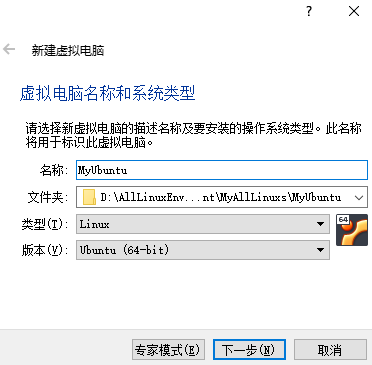

3、点击下一步设置运行内存，给2048MB吧。

4、点击下一步，然后选择现在创建虚拟硬盘：

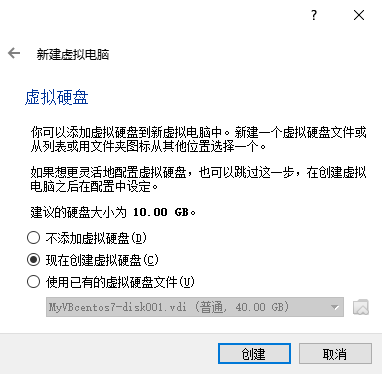

点击创建，然后选择虚拟硬盘文件类型为VDI：

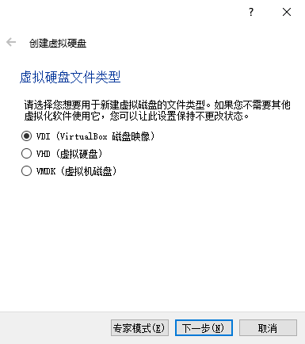

点击下一步，然后选择动态分配：

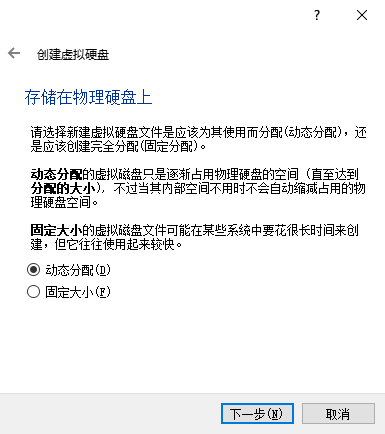

点击下一步，设置虚拟硬盘大小，建议给个20G、30G：

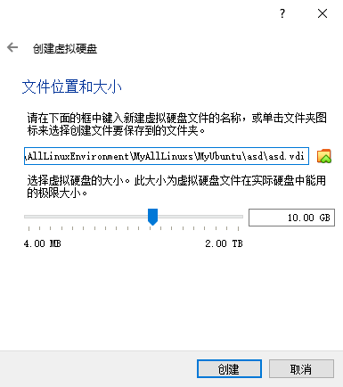

5、设置好以上1、2、3、4步，就创建好了虚拟电脑：

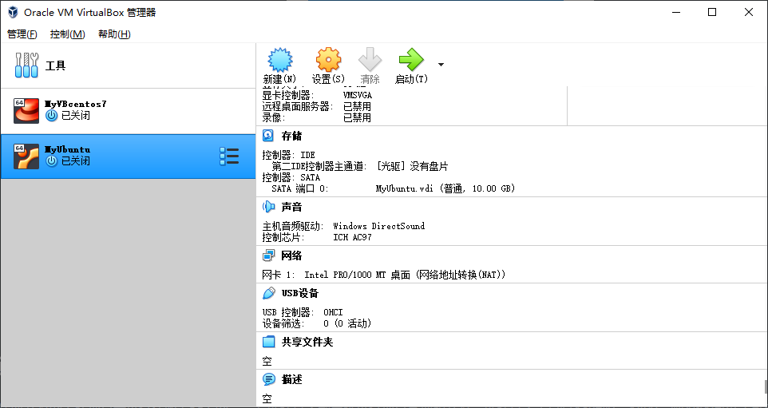

点击图中的设置开始配置虚拟机的内存、CPU数量、显存，参数可依据使用目的自行设置，这里设置处理器为2，显示中的显存大小为128MB，网络里的连接方式设为桥接网络：

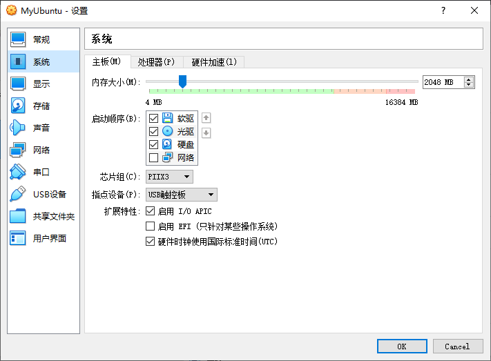

6、然后为虚拟电脑MyUbuntu添加Linux操作系统镜像文件，**安装虚拟盘，选择之前在国内镜像源下载Ubuntu安装文件，可将下载的镜像文件复制到自己熟悉路径下**：（如下操作，选中下载的iso文件后，点击OK就好）

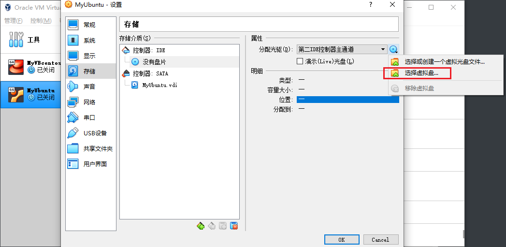

7、然后启动虚拟——MyUbuntu，选中*Try and install，按回车：

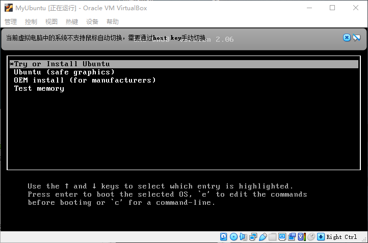

8、然后**耐心耐心耐心**等待一段时间，直到出现以下界面，再在welcome下的选项中选中简体中文后，点击右边的 Install Ubuntu，安装Ubuntu。

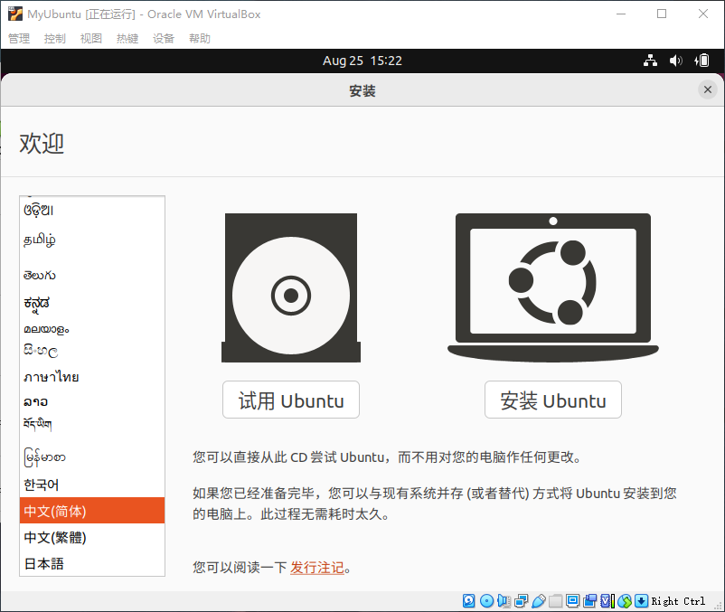

9、点击安装后一会就会出现以下界面，如果显示不全的话，按住**win键+鼠标左键**，就可以拖动界面，点击继续：

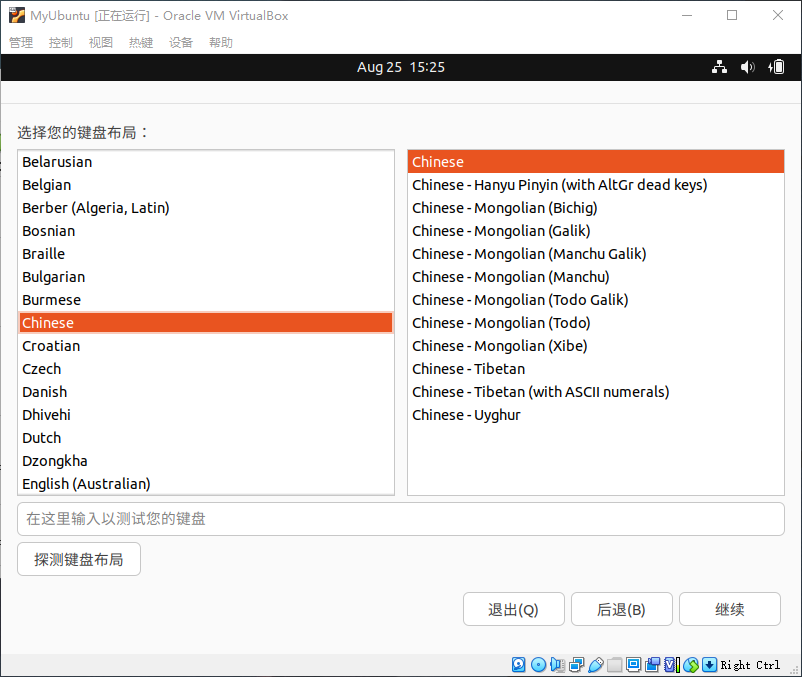

10、然后出现以下界面，选中最小安装，点击继续：

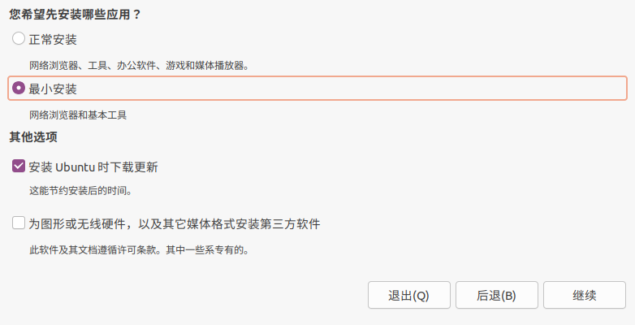

11、然后点击安装，再点击继续：

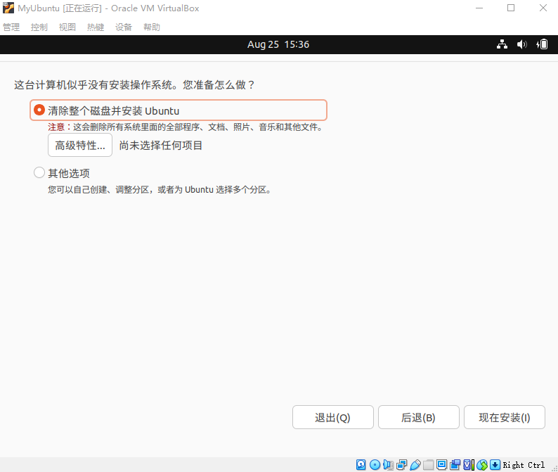

12、选中时区，鼠标网地图上点一下中国就行了，点击继续：


13、设置用户和密码，自定义，一定要记住用户名和密码（不能设置为root用户，已经保留有root用户），点击继续就开始安装系统：

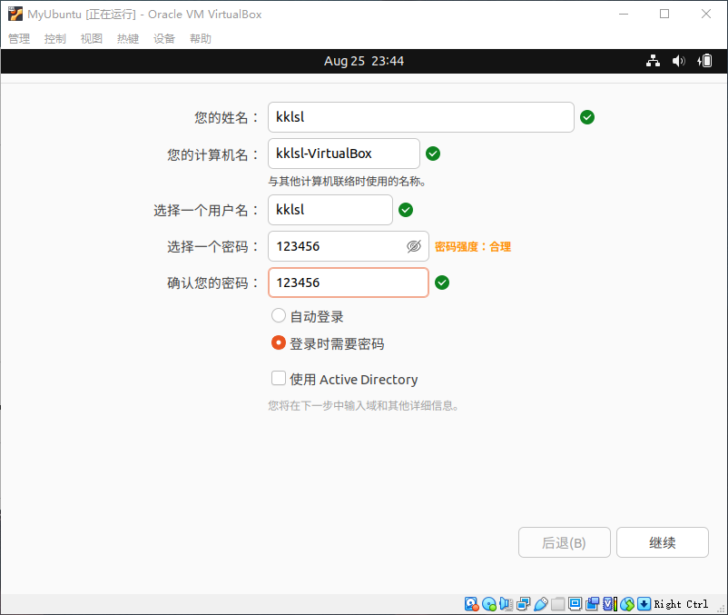

如果下载文件、语言包、软件包等太慢，可点击skip，先跳过下载：

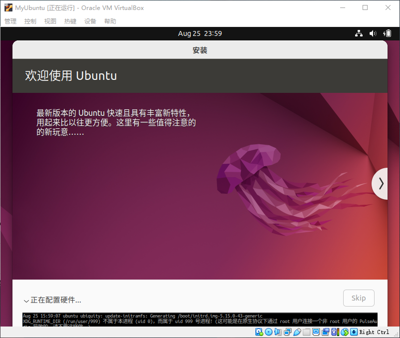

14、a long time later，安装完成提示要重启虚拟电脑，第一次重启后看提示，得再输入一次回车。

15、安装完成，设置软件下载源：

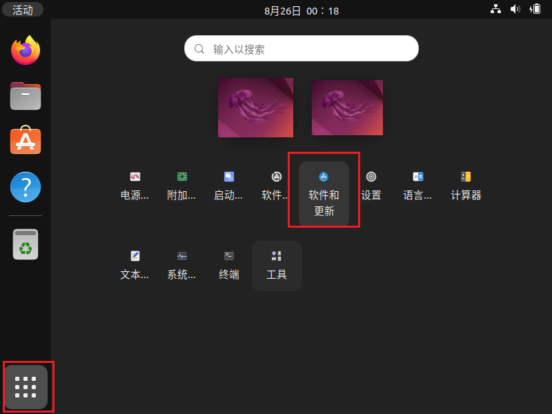

点击“位于中国的服务器”这一栏，然后选择其他，找到阿里云的。

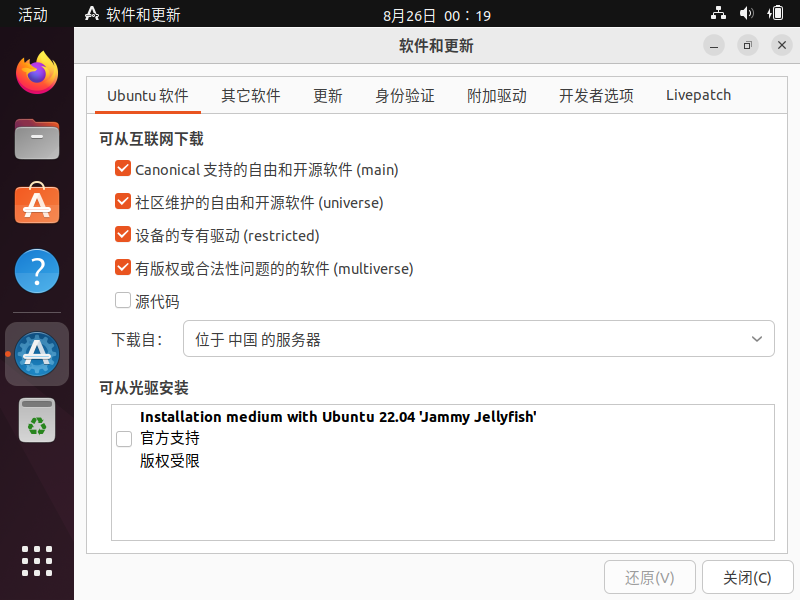

finish。

16、设置root用户密码：

1. 在终端输入命令 `sudo passwd`并按回车，然后输入当前用户的密码，enter，终端会提示我们输入新的密码并确认（密码至少8位，要有小写字母、数字、小数点等，并且不能包含用户名），此时设置的密码就是root用户的新密码。

   设置root密码为：`rar123..`、`linux123..`等都可以。此处设置为前者。

2. 修改成功后，输入命令 `su root`，再输入密码即可登录root用户——最高权限用户，相当于Windows的管理员账户。

17、设置root用户远程登录：

1. `su root` 命令切换到root用户。

2. 安装vim：`sudo apt install vim`。如果显示例如这样的`无法获得锁 /var/lib/dpkg/lock-frontend`，那就执行以下：

   ```java
   sudo rm /var/cache/apt/archives/lock
   sudo rm /var/lib/dpkg/lock-frontend  //注意自己无法获得锁的路径
   sudo apt install vim
   ```

   执行最后一步提示` 您在 /var/cache/apt/archives/ 上没有足够的可用空间`，那就是硬盘内存不够用了，执行`df -lh`发现根目录`/`占用100%。

   `sudo apt-get clean`：清理缓存。

   `sudo apt remove linux-image-*`：清理旧版本内核。

   `apt --fix-broken install`

   再重新安装vim：`sudo apt install vim`。

3. 修改配置文件：`vim /etc/ssh/sshd_config `，如下图

   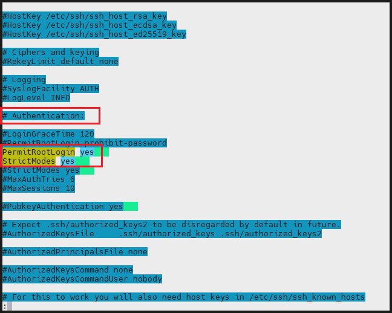

4. 重启ssh服务：`service ssh restart`。

### 安装软件包

**安装net-tools：**`sudo apt install net-tools `。

**安装ssh-server服务：**`sudo apt-get install openssh-server`，设置ssh服务开机启动——`sudo systemctl enable ssh`。

**安装语言包并启用输入法：**

1、进入设置：

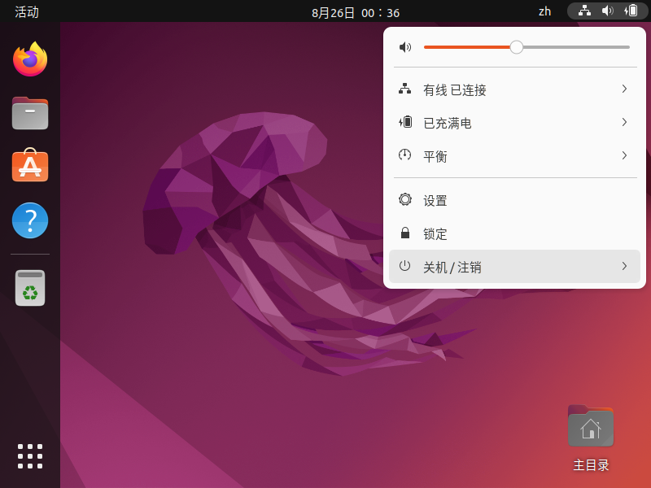

2、点击管理已安装的语言，因为前面跳过了语言框架的下载与安装，此时就会提示安装，耐心下载安装即可，需要重启系统。

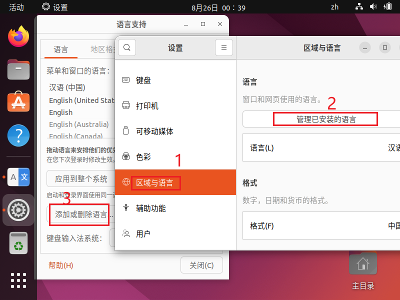

3、打开终端执行以下命令：

1. `sudo apt-get update `。

2. `sudo apt install ibus ibus-gtk ibus-gtk3 ibus-clutter ibus-pinyin ibus-libpinyin`。

3. `ibus-setup`，然后在弹出的出口添加输入法：

   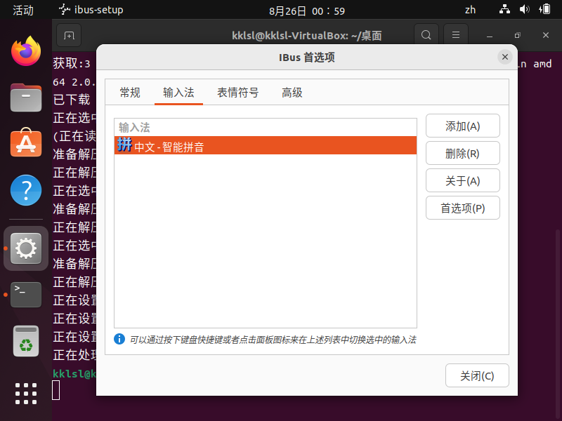


# 远程登录到Linux

工作时开发的上线项目是运行在服务器上的，需要远程登录到系统进行项目管理和开发；远程登录工具有Xshell6、Xftp6、MobaXterm_Personal等。

Xshell：目前最好的远程登录到Linux系统的软件，流畅的速度并且完美解决了中文乱码问题，是一个强大的安全终端模拟软件，支持SS1、SS2，以及Windows平台的TELLNET协议；可在Windows界面下用来访问远程不同系统的服务器。

登录要知道远程Linux系统的公网IP：Linux系统里执行`ifconfig`就可看到（我的是192.168.137.128）；还要测试网络是否通畅，Windows下的ping命令：测试两台机器（IP）是不是网络通畅的，`ping 另一台机器的IP`，如果出现回复则是通畅的。

安装好后使用Xshell：

1. 新建会话：名称可随意，主机是要登录的远程系统的IP，协议SSH，端口22；然后点击确定。
2. 双击会话，学习中可选择一次性接收，工作中建议选择接受并保存，然后输入用户名、密码。

Xftp：Windows平台的功能强大的SFTP、FTP文件传输软件，使Windows用户可以在UNIX/Linux和Windows之间安全地传输文件。

安装完成好使用Xftp：

1. 新建会话：称可随意，主机是要登录的远程系统的IP（192.168.137.128），协议SFTP，端口22；然后点击确定。
2. 双击会话，学习中可选择一次性接收，工作中建议选择接受并保存，然后输入用户名、密码。