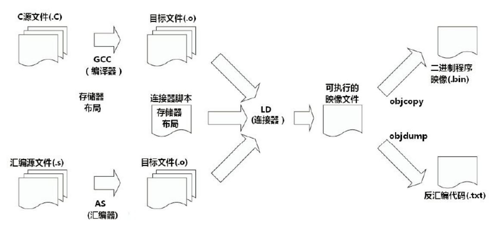

# 第 1 章 交叉编译简介

## 1.1 什么是交叉编译

对于没有做过嵌入式编程的人，可能不太理解交叉编译的概念，那么什么是交叉编译？它有什么作用？

在解释什么是交叉编译之前，先要明白什么是本地编译。

**本地编译**

本地编译可以理解为，在当前编译平台下，编译出来的程序只能放到当前平台下运行。平时我们常见的软件开发，都是属于本地编译：

比如，我们在 x86 平台上，编写程序并编译成可执行程序。这种方式下，我们使用 x86 平台上的工具，开发针对 x86 平台本身的可执行程序，这个编译过程称为本地编译。

**交叉编译**

交叉编译可以理解为，在当前编译平台下，编译出来的程序能运行在体系结构不同的另一种目标平台上，但是编译平台本身却不能运行该程序：

比如，我们在 x86 平台上，编写程序并编译成能运行在 ARM 平台的程序，编译得到的程序在 x86 平台上是不能运行的，必须放到 ARM 平台上才能运行。

## 1.2 为什么会有交叉编译

之所以要有交叉编译，主要原因是：

- Speed： 目标平台的运行速度往往比主机慢得多，许多专用的嵌入式硬件被设计为低成本和低功耗，没有太高的性能
- Capability： 整个编译过程是非常消耗资源的，嵌入式系统往往没有足够的内存或磁盘空间
- Availability： 即使目标平台资源很充足，可以本地编译，但是第一个在目标平台上运行的本地编译器总需要通过交叉编译获得
- Flexibility： 一个完整的Linux编译环境需要很多支持包，交叉编译使我们不需要花时间将各种支持包移植到目标板上

## 1.3 为什么交叉编译比较困难

交叉编译的困难点在于两个方面：

1、不同的体系架构拥有不同的机器特性：

- Word size： 是64位还是32位系统
- Endianness： 是大端还是小端系统
- Alignment： 是否必修按照4字节对齐方式进行访问
- Default signedness： 默认数据类型是有符号还是无符号
- NOMMU： 是否支持MMU

2、交叉编译时的主机环境与目标环境不同：

- Configuration issues：
- HOSTCC vs TARGETCC：
- Toolchain Leaks：
- Libraries：
- Testing：

详细的对比可以参看这篇文章，已经写的很详细了，在这就不细说了：[Introduction to cross-compiling for Linux](http://landley.net/writing/docs/cross-compiling.html)

# Introduction to cross-compiling for Linux

**Or: Host, Target, Cross-Compilers, and All That**

## **Host vs Target**

A compiler is a program that turns source code into executable code. Like all programs, a compiler runs on a specific type of computer, and the new programs it outputs also run on a specific type of computer.[[1\]](http://landley.net/writing/docs/cross-compiling.html#footnote1)

The computer the compiler runs on is called the **host**, and the computer the new programs run on is called the **target**. When the host and target are the same type of machine, the compiler is a **native compiler**. When the host and target are different, the compiler is a **cross compiler**.[[2\]](http://landley.net/writing/docs/cross-compiling.html#footnote2)

## **Why cross-compile?**

In theory, a PC user who wanted to build programs for some device could get the appropriate target hardware (or emulator), boot a Linux distro on that, and compile natively within that environment. While this is a valid approach (and possibly even a good idea when dealing with something like a Mac Mini), it has a few prominent downsides for things like a linksys router or iPod:

- **Speed** - Target platforms are usually much slower than hosts, by an order of magnitude or more. Most special-purpose embedded hardware is designed for low cost and low power consumption, not high performance. Modern emulators (like qemu) are actually faster than a lot of the real world hardware they emulate, by virtue of running on high-powered desktop hardware.[[3\]](http://landley.net/writing/docs/cross-compiling.html#footnote3)
- **Capability** - Compiling is very resource-intensive. The target platform usually doesn't have gigabytes of memory and hundreds of gigabytes of disk space the way a desktop does; it may not even have the resources to build "hello world", let alone large and complicated packages.
- **Availability** - Bringing Linux up on a hardware platform it's never run on before requires a cross-compiler. Even on long-established platforms like Arm or Mips, finding an up-to-date full-featured prebuilt native environment for a given target can be hard. If the platform in question isn't normally used as a development workstation, there may not be a recent prebuilt distro readily available for it, and if there is it's probably out of date. If you have to build your own distro for the target before you can build on the target, you're back to cross-compiling anyway.
- **Flexibility** - A fully capable Linux distribution consists of hundreds of packages, but a cross-compile environment can depend on the host's existing distro from most things. Cross compiling focuses on building the target packages to be deployed, not spending time getting build-only prerequisites working on the target system.
- **Convenience** - The user interface of headless boxes tends to be a bit crampled. Diagnosing build breaks is frustrating enough as it is. Installing from CD onto a machine that hasn't got a CD-ROM drive is a pain. Rebooting back and forth between your test environment and your development environment gets old fast, and it's nice to be able to recover from accidentally lobotomizing your test system.

## **Why is cross-compiling hard?**

### **Portable native compiling is hard.**

Most programs are developed on x86 hardware, where they are compiled natively. This means cross-compiling runs into two types of problems: problems with the programs themselves and problems with the build system.

The first type of problem affects all non-x86 targets, both for native and for cross-builds. Most programs make assumptions about the type of machine they run on, which must match the platform in question or the program won't work. Common assumptions include:

- **Word size** - Copying a pointer into an int may lose data on a 64 bit platform, and determining the size of a malloc by multiplying by 4 instead of sizeof(long) isn't good either. Subtle security flaws due to integer overflows are also possible, ala "if (x+y < size) memset(src+x,0,y);", which results in a 4 gigabyte memset on 32-bit hardware when x=1000 and y=0xFFFFFFF0...
- **Endianness** - Different systems store binary data iternally in different ways, which means that block-reading int or float data from disk or the network may need translation. Type "man byteorder" for details.
- **Alignment** - Some platforms (such as arm) can only read or write ints from addresses that are an even multiple of 4 bytes, otherwise they segfault. Even the ones that can handle arbitrary alignments are slower dealing with unaligned data (they have to fetch twice to get both halves), so the compiler will often pad structures to align variables. Treating structures as a lump of data that can be sent to disk or across the network thus requires extra work to ensure a consistent representation.
- **Default signedness** - Whether the "char" data type defaults to signed or unsigned varies from platform to platform (and in some cases from compiler to compiler), which can cause some really surprising bugs. The easy workaround for this is to provide a compiler argument like "-funsigned-char" to force the default to a known value.
- **NOMMU** - If your target platform doesn't have a memory management unit, several things need to change. You need vfork() instead of fork(), only certain types of mmap() work (shared or read only, but not copy on write), and the stack doesn't grow dynamically.

Most packages aim to be portable when compiled natively, and will at least accept patches to fix any of the above problems (with the possible exception of NOMMU issues) submitted to the appropriate development mailing list.

### **And then there's cross-compiling.**

In addition to the problems of native compiling, cross-compiling has its own set of issues:

- **Configuration issues** - Packages with a separate configuration step (the "./configure" part of the standard configure/make/make install) often test for things like endianness or page size, to be portable when natively compiled. When cross-compiling, these values differ between the host system and the target system, so running tests on the host system gives the wrong answers. Configuration can also detect the presence of a package on the host and include support for it, when the target doesn't have that package or has an incompatible version.
- **HOSTCC vs TARGETCC** - Many build processes require compiling things to run on the host system, such as the above configuration tests, or programs that generate code (such as a C program that creates a .h file which is then #included during the main build). Simply replacing the host compiler with a target compiler breaks packages that need to build things that run during the build itself. Such packages need access to both a host and a target compiler, and need to be taught when to use each one. [[4\]](http://landley.net/writing/docs/cross-compiling.html#footnote4)
- **Toolchain Leaks** - An improperly configured cross-compile toolchain may leak bits of the host system into the compiled programs, resulting in failures that are usually easy to detect but which can be difficult to diagnose and correct. The toolchain may #include the wrong header files, or search the wrong library paths at link time. Shared libraries often depend on other shared libraries which can also sneak in unexpected link-time references to the host system.
- **Libraries** - Dynamically linked programs must access the appropriate shared libraries at compile time. Shared libraries to the target system need to be added to the cross-compile toolchain so programs can link against them.
- **Testing** - On native builds, the development system provides a convenient testing environment. When cross-compiling, confirming that "hello world" built successfully can require configuring (at least) a bootloader, kernel, root file system, and shared libraries.

------

**Footnote 1:** The most prominent difference between types of computers is what processor is executing the programs, but other differences include library ABIs (such as glibc vs uClibc), machines with configurable endianness (arm vs armeb), or different modes of machines that can run both 32 bit and 64 bit code (such as x86 on x86-64).

**Footnote 2:** When building compilers, there's a third type called a "canadian cross", which is a cross compiler that doesn't run on your host system. A canadian cross builds a compiler that runs on one target platform and produces code for another target machine. Such a foreign compiler can be built by first creating a temporary cross compiler from the host to the first target, and then using that to build another cross-compiler for the second target. The first cross-compiler's target becomes the host the new compiler runs on, and the second target is the platform the new compiler generates output for. This technique is often used to cross-compile a new native compiler for a target platform.

**Footnote 3:** Modern desktop systems are sufficiently fast that emulating a target and natively compiling under the emulator is actually a viable strategy. It's significantly slower than cross compiling, requires finding or generating a native build environment for the target (often meaning you have to set up a cross-compiler anyway), and can be tripped up by differences between the emulator and the real hardware to deploy on. But it's an option.

**Footnote 4:** This is why cross-compile toolchains tend to prefix the names of their utilities, ala "armv5l-linux-gcc". If that was simply called "gcc" then the host and native compiler couldn't be in the $PATH at the same time.

# 第 2 章 交叉编译链

## 2.1 什么是交叉编译链

明白了什么是交叉编译，那我们来看看什么是交叉编译链。

首先编译过程是按照不同的子功能，依照先后顺序组成的一个复杂的流程，如下图：



那么编译过程包括了预处理、编译、汇编、链接等功能。既然有不同的子功能，那每个子功能都是一个单独的工具来实现，它们合在一起形成了一个完整的工具集。

同时编译过程又是一个有先后顺序的流程，它必然牵涉到工具的使用顺序，每个工具按照先后关系串联在一起，这就形成了一个链式结构。

因此，交叉编译链就是为了编译跨平台体系结构的程序代码而形成的由多个子工具构成的一套完整的工具集。同时，它隐藏了预处理、编译、汇编、链接等细节，当我们指定了源文件(.c)时，它会自动按照编译流程调用不同的子工具，自动生成最终的二进制程序映像(.bin)。

*注意：严格意义上来说，交叉编译器，只是指交叉编译的gcc，但是实际上为了方便，我们常说的交叉编译器就是交叉工具链。本文对这两个概念不加以区分，都是指编译链*

## 2.2 交叉编译链的命名规则

我们使用交叉编译链时，常常会看到这样的名字：

```
arm-none-linux-gnueabi-gcc
arm-cortex_a8-linux-gnueabi-gcc
mips-malta-linux-gnu-gcc
```

其中，对应的前缀为：

```
arm-none-linux-gnueabi-
arm-cortex_a8-linux-gnueabi-
mips-malta-linux-gnu-
```

这些交叉编译链的命名规则似乎是通用的，有一定的规则，以`arch-core-kernel-system`为例：
`arch`： 用于哪个目标平台。
`core`： 使用的是哪个CPU Core，如Cortex A8，但是这一组命名好像比较灵活，在其它厂家提供的交叉编译链中，有以厂家名称命名的，也有以开发板命名的，或者直接是none或cross的。
`kernel`： 所运行的OS，见过的有Linux，uclinux，bare（无OS）。
`system`：交叉编译链所选择的库函数和目标映像的规范，如gnu，gnueabi等。其中gnu等价于glibc+oabi；gnueabi等价于glibc+eabi。

*注意：这个规则是一个猜测，并没有在哪份官方资料上看到过。而且有些编译链的命名确实没有按照这个规则，也不清楚这是不是历史原因造成的。如果有谁在资料上见到过此规则的详细描述，欢迎指出错误。*

# 第 3 章 包含的工具

## 3.1 Binutils

Binutils是GNU工具之一，它包括链接器、汇编器和其他用于目标文件和档案的工具，它是二进制代码的处理维护工具。

Binutils工具包含的子程序如下：

- ld：GNU连接器the GNU linker。
- as：GNU汇编器the GNU assembler。
- addr2line：把地址转换成文件名和所在的行数。
- ar：A utility for creating, modifying and extracting from archives。
- c++filt：Filter to demangle encoded C++ symbols。
- dlltool：Creates files for building and using DLLs。
- gold：A new, faster, ELF only linker, still in beta test。
- gprof：Displays profiling information。
- nlmconv：Converts object code into an NLM。
- nm：Lists symbols from object files。
- objcopy：Copys and translates object files。
- objdump：Displays information from object files。
- ranlib：Generates an index to the contents of an archive。
- readelf：Displays information from any ELF format object file。
- size：Lists the section sizes of an object or archive file。
- strings：Lists printable strings from files。
- strip：Discards symbols。

[binutils介绍](https://sourceware.org/binutils/)：


## 3.2 GCC

GNU编译器套件，支持C, C++, Java, Ada, Fortran, Objective-C等众多语言。

## 3.3 GLibc

Linux上通常使用的C函数库为glibc。glibc是linux系统中最底层的api，几乎其它任何运行库都会依赖于glibc。glibc除了封装linux操作系统所提供的系统服务外，它本身也提供了许多其它一些必要功能服务的实现。

[glibc 各个库作用介绍](http://www.cnblogs.com/cute/archive/2011/05/03/2035645.html)

因为嵌入式环境的资源及其紧张，所以现在除了glibc外，还有uClibc和eglibc可以选择，三者的关系可以参见这两篇文章：

[uclibc eglibc glibc之间的区别和联系](http://www.crifan.com/relation_between_uclibc_glibc_eglibc/)

[Glibc vs uClibc Differences](https://www.uclibc.org/downloads/Glibc_vs_uClibc_Differences.txt)

## 3.4 GDB

GDB用于调试程序。

# 第 4 章 如何得到交叉编译链

既然明白了交叉编译链的功能，那么在针对嵌入式系统开发时，我们需要的交叉编译链从哪儿得到？

主要有三个方式可以获取：1、下载已经做好的；2、使用工具定制一个；3、从零构建一个交叉编译工具链。

## 4.1 下载已经做好的交叉编译链

使用其他人针对某些CPU平台已经编译好的交叉编译链。我们只需要找到合适的，下载下来使用即可。

常见的交叉编译链下载地址：

1. 在 http://ftp.arm.linux.org.uk/pub/armlinux/toolchain/ 下载已经编译好的交叉编译链
2. 在 http://www.denx.de/en/Software/WebHome 下载已经编译好的交叉编译链
3. 在https://launchpad.net/gcc-arm-embedded下载已经编译好的交叉编译链
4. 一些制作交叉编译链的工具中，包含了已经制作好的交叉编译链，可以直接拿来使用。如crosstool-NG
5. 如果购买了某个芯片或开发板，一般厂商会提供对应的整套开发软件，其中就包含了交叉编译链。

**厂家提供的工具一般是经过了严格的测试，并打入了一些必要的补丁，所以这种方式往往是最可靠的工具来源。**

## 4.2 使用工具定制交叉编译链

使用现存的制作工具，以简化制作交叉编译链这个事情的复杂度。我们只需要了解有哪些工具可以实现，并选个合适的工具，搞懂它的操作步骤即可。

1. crosstool-NG
2. Buildroot
3. Embedded Linux Development Kit (ELDK)

工具还有很多，各有各的优势和劣势，大家可以慢慢研究，在这就不细说了。

## 4.3 从零开始构建交叉编译链

这个是最困难也最耗时间的，毕竟制作交叉编译链这样的事情，需要对嵌入式的编译原理了解的比较透彻，至少要知道出了问题要往哪个方面去翻阅资料。而且，也是最考耐心和细心的地方，配错一个选项或是一个步骤，都可能出现以前从来没见过的问题，而且这些问题往往还无法和这个选项或步骤直接联系起来。

当然如果搭建出来，肯定也是收获最大的，至少对于编译的流程和依赖都比较清楚了，细节上的东西可能还需要去翻看相应的协议或标准，但至少骨架会比较清楚。

详细的搭建过程可以参看后续的文章，这里面有详细的参数和步骤：
[交叉编译详解 二 从零制作交叉编译链](http://blog.csdn.net/pengfei240/article/details/52917018)

为了方便大家搭建交叉编译链，我写了一个一键生成的脚本（包括源码下载和自动编译）。如果大家自己一直搭建不成功，不妨试试这个脚本，然后对比下自己的流程是否一致，参数是否有差异，也许能帮大家迈过这个障碍：
[交叉编译详解 三 使用脚本自动生成交叉编译链](http://blog.csdn.net/pengfei240/article/details/53968167)

## 4.4 对比三种构建方式

| 项目       | 使用已有交叉编译链                                | 自己制作交叉编译链                                           |
| ---------- | ------------------------------------------------- | ------------------------------------------------------------ |
| 安装       | 一般提供压缩包                                    | 需要自己打包                                                 |
| 源码版本   | 一般使用较老的稳定版本，对于一些新的GCC特性不支持 | 可以使用自己需要的GCC特性的版本                              |
| 补丁       | 一般都会打上修复补丁                              | 普通开发者很难辨别需要打上哪些补丁，资深开发者可以针对自己的需求合入补丁 |
| 源码溯源   | 可能不清楚源码版本和补丁情况                      | 一切都可以定制                                               |
| 升级       | 一般不会升级                                      | 可以随时升级                                                 |
| 优化       | 一般已经针对特定CPU特性和性能进行优化             | 一般无法做到比厂家优化的更好，除非自己设计的CPU              |
| 技术支持   | 可以通过FAE进行支持，可能需要收费                 | 只能通过社区支持，免费                                       |
| 可靠性验证 | 已经通过了完善的验证                              | 自己验证，肯定没有专业人士验证的齐全                         |


>**参考资料:**
>	[1] Introduction to cross-compiling for Linux
>
>​	[2] binutils介绍
>
>​	[3] glibc 各个库作用介绍
>
>​	[4] uclibc eglibc glibc之间的区别和联系
>
>​	[5] Glibc vs uClibc Differences
>
>​	[6] 交叉编译链下载地址：
>
>- http://ftp.arm.linux.org.uk/pub/armlinux/toolchain/	
>- http://www.denx.de/en/Software/WebHome
>- https://launchpad.net/gcc-arm-embedded

> ————————————————
> 版权声明：本文为CSDN博主「p_fly」的原创文章，遵循CC 4.0 BY-SA版权协议，转载请附上原文出处链接及本声明。
> 原文链接：https://blog.csdn.net/pengfei240/article/details/52912833


# 从零制作交叉编译链

## 1.编译环境

主机硬件环境：

    $ uname -a
    Linux PC 4.4.0-42-generic #62-Ubuntu SMP Fri Oct 7 23:11:45 UTC 2016 x86_64 x86_64 x86_64 GNU/Linux
主机软件环境：

    $ cat /etc/issue
    Ubuntu 16.04.1 LTS
需要安装的工具：

```
sudo apt-get install libncurses5-dev
sudo apt-get install gperf
sudo apt-get install bison
sudo apt-get install flex
sudo apt-get install texinfo
sudo apt-get install help2man
sudo apt-get install gawk
sudo apt-get install libtool
sudo apt-get install libtool-bin
sudo apt-get install automake
```

- libncurses5-dev： developer’s libraries for ncurses（执行 make menuconfig 时需要）

- gperf： 一个完美的hash函数生成器。例子可以看这个帖子：[gperf 使用实例](http://bbs.chinaunix.net/thread-787506-1-1.html)。

- bison： 一个语法分析器生成器。Bison 把一个关于“向前查看 从左到右 最右”(LALR) 上下文无关文法的描述转化成可以分析该文法的 C 或 C++ 程序。它也可以为二义文法生成 “通用的 从左到右 最右” (GLR)语法分析器。

- flex： 词法分析器。

- texinfo： 是Linux系统提供的另外一种格式的帮助信息。和man相比，textinfo具有更好交互功能。它支持链接跳转功能，通常使用info和pinfo命令来阅读textinfo文档。

- help2man： 一个可以自动为我们的程序生成man手册的工具。

- gawk： linux下用于查找替换的文本工具。

- libtool / libtool-bin： Generic library support script。

- automake: Tool for generating GNU Standards-compliant Makefiles。

备注：

- 不同的环境需要安装的工具不完全一致，出错时可以根据错误提示来排查。
- 各种工具的描述可以使用 **`apt-cache search XXX`** 命令去查询。

## 2.配置全局变量

```
export PRJROOT=/home/user/tool_prj1         # 修改为自己的工程所在的目录
export TARGET=arm-none-linux-gnueabi
export PREFIX=${PRJROOT}/tool-chain
export TARGET_PREFIX=${PREFIX}/${TARGET}
export PATH=${PREFIX}/bin:${PATH}
export ARCH=arm
export BINUTILS_VERSION=binutils-2.27
export GCC_VERSION=gcc-5.4.0
export GLIBC_VERSION=glibc-2.23
export KERNEL_VERSION=linux-4.4.25
```

## 3.目录结构

```
$ tree -L 2
tool_prj1
├── build                         # src的编译目录
├── script                        # 脚本工具目录
│   ├── toolchain_build.sh        # 自己写的自动化编译脚本，后续的命令都集成在了这个脚本中
│   └── toolchain_config.lst      # 用于配置全局变量
├── setup                         # 保存下载的源码包
│   ├── binutils-2.27.tar.bz2
│   ├── gcc-5.4.0.tar.bz2
│   ├── glibc-2.23.tar.bz2
│   └── linux-4.4.25.tar.xz
├── src                           # 解压后的源码文件
└── tool-chain                    # 工具链安装位置
```

## 4.源码包下载

```
cd setup
wget http://ftp.gnu.org/gnu/binutils/$BINUTILS_VERSION.tar.bz2
wget http://ftp.gnu.org/gnu/gcc/$GCC_VERSION/$GCC_VERSION.tar.bz2
wget ftp://ftp.gnu.org/gnu/glibc/$GLIBC_VERSION.tar.bz2
wget https://www.kernel.org/pub/linux/kernel/v4.x/$KERNEL_VERSION.tar.xz
```

## 5.binutils

**编译流程：**

```
cd src/
tar -jxf ../setup/$BINUTILS_VERSION.tar.bz2
mkdir ../build/$BINUTILS_VERSION
cd ../build/$BINUTILS_VERSION
sh ../../src/$BINUTILS_VERSION/configure --target=$TARGET --prefix=$PREFIX --disable-nls --enable-shared
make
make install
```

**选项详解：**

`–target=${TARGET}`：编译好的程序能够处理的平台。

- 注：build/host/target是一组相关参数，各项描述如下：
  - build ——当前编译使用的机器
  - host ——编译好的程序能够运行的平台
  - target ——编译好的程序能够处理的平台
- 比如我们需要在i386机器上为arm开发板编译一个可以处理mips程序的gcc，那么相关参数如下：
  - build=i386-linux
  - host=arm-linux
  - target=mips-linux

`–prefix=${RESULT_DIR}`：告诉配置脚本当运行 make install 时，把编译好的东西安装在RESULT_DIR目录。

`–disable-nls`：这里nls的意思是本地语言支持（Native Language Support）。

`–enable-shared`：编译出共享链接库。

**检查编译结果：**

```
$ ls ../../tool-chain/bin/
arm-none-linux-gnueabi-addr2line  arm-none-linux-gnueabi-c++filt  arm-none-linux-gnueabi-ld      arm-none-linux-gnueabi-objcopy  arm-none-linux-gnueabi-readelf  arm-none-linux-gnueabi-strip
arm-none-linux-gnueabi-ar         arm-none-linux-gnueabi-elfedit  arm-none-linux-gnueabi-ld.bfd  arm-none-linux-gnueabi-objdump  arm-none-linux-gnueabi-size
arm-none-linux-gnueabi-as         arm-none-linux-gnueabi-gprof    arm-none-linux-gnueabi-nm      arm-none-linux-gnueabi-ranlib   arm-none-linux-gnueabi-strings
```

## 6.制作Linux内核头文件

**编译流程：**

```
cd src
tar -xf ../setup/$KERNEL_VERSION.tar.xz
cd $KERNEL_VERSION
make ARCH=$ARCH CROSS_COMPILE=$TARGET- INSTALL_HDR_PATH=$PREFIX/$TARGET headers_install
```

这一步是为了导出内核的头文件，后面编译GLIBC时需要。

**选项详解：**

- ARCH：目标处理器的架构是arm处理器。

- CROSS_COMPILE：编译程序所用的交叉工具链的名称。

- INSTALL_HDR_PATH：头文件需要安装的位置。

- headers_install：make的执行动作为安装头文件。


**检查结果：**

    $ ls $PREFIX/$TARGET
    bin  include  lib
可以看见 include 文件夹。

## 7.建立初始化GCC编辑器

**功能介绍：**这一步主要是建立arm-linux-gcc工具，注意这个gcc没有glibc库的支持，所以只能用于编译内核、BootLoader等不需要C库支持的程序，后面创建C库也要用到这个编译器。如果只想编译内核和BootLoader，那么安装完这个就可以到此结束。

**编译流程：**

```
cd src
tar -jxf ../setup/$GCC_VERSION.tar.bz2
cd $GCC_VERSION
./contrib/download_prerequisites    # 下载mpfr/gmp/mpc/isl
mkdir ../../build/$GCC_VERSION
cd ../../build/$GCC_VERSION
sh ../../src/$GCC_VERSION/configure --target=$TARGET --prefix=$PREFIX --disable-shared --disable-threads --without-headers --disable-libmudflap --enable-languages=c,c++ --disable-nls
make all-gcc
make install-gcc
make all-target-libgcc
make install-target-libgcc
```

注意：GCC需要四个库 **mpfr/gmp/mpc/isl**，当前的GCC可以使用**./contrib/download_prerequisites**脚本直接下载。

**选项详解：**

- `–disable-shared`：不使用共享库。
- `–disable-threads`：不使用线程功能。
- `–without-headers`：不使用目标对象的头文件。
- `–disable-libmudflap`：暂时不清楚这个配置是什么意思。
- `–enable-languages=c,c++`：支持C/C++语言。

其它详细的参数介绍可以参考文档：gcc/doc/gccinstall.info。

**检查结果：**

```
$ ls tool-chain/bin/arm-none-linux-gnueabi-gcc*
tool-chain/bin/arm-none-linux-gnueabi-gcc        tool-chain/bin/arm-none-linux-gnueabi-gcc-ar  tool-chain/bin/arm-none-linux-gnueabi-gcc-ranlib
tool-chain/bin/arm-none-linux-gnueabi-gcc-5.4.0  tool-chain/bin/arm-none-linux-gnueabi-gcc-nm 
```

可以看见GCC已经存在。

## 8.GLibc

**编译流程：**

```
cd src
tar -jxf ../setup/$GLIBC_VERSION.tar.bz2
mkdir ../build/$GLIBC_VERSION
cd ../build/$GLIBC_VERSION
sh ../../src/$GLIBC_VERSION/configure --host=$TARGET --prefix=$PREFIX/$TARGET --with-tls --disable-profile --enable-add-ons --with-headers=$PREFIX/$TARGET/include libc_cv_forced_unwind=yes libc_cv_c_cleanup=yes libc_cv_arm_tls=yes --disable-nls
make CC=$TARGET-gcc AR=$TARGET-ar RANLIB=$TARGET-ranlib
make install
```

**选项详解：**

- `–with-headers=@var{directory}`：Look for kernel header files in @var{directory}。
- `–with-tls`：This tells Glibc to use Thread Local Storage。
- `–disable-profile`：Don’t build libraries with profiling information。
- `–enable-add-ons`：Specify add-on packages to include in the build。
- libc_cv_forced_unwind=yes

- libc_cv_c_cleanup=yes

- libc_cv_arm_tls=yes


不清楚后面三个参数的配置意义。

其它详细的参数介绍可以参考文档：**manual/install.texi**。

**检查结果：**

```
$ ls tool-chain/arm-none-linux-gnueabi/lib
audit          libanl-2.23.so           libc.a            libc.so        libm.a          libnss_compat-2.23.so  libnss_files-2.23.so    libnss_nisplus.so.2     libresolv-2.23.so  libSegFault.so       Scrt1.o
crt1.o         libanl.a                 libcidn-2.23.so   libc.so.6      libmcheck.a     libnss_compat.so       libnss_files.so         libnss_nis.so           libresolv.a        libthread_db-1.0.so
crti.o         libanl.so                libcidn.so        libdl-2.23.so  libmemusage.so  libnss_compat.so.2     libnss_files.so.2       libnss_nis.so.2         libresolv.so       libthread_db.so
crtn.o         libanl.so.1              libcidn.so.1      libdl.a        libm.so         libnss_db-2.23.so      libnss_hesiod-2.23.so   libpcprofile.so         libresolv.so.2     libthread_db.so.1
gconv          libBrokenLocale-2.23.so  libc_nonshared.a  libdl.so       libm.so.6       libnss_db.so           libnss_hesiod.so        libpthread-2.23.so      librpcsvc.a        libutil-2.23.so
gcrt1.o        libBrokenLocale.a        libcrypt-2.23.so  libdl.so.2     libnsl-2.23.so  libnss_db.so.2         libnss_hesiod.so.2      libpthread.a            librt-2.23.so      libutil.a
ld-2.23.so     libBrokenLocale.so       libcrypt.a        libg.a         libnsl.a        libnss_dns-2.23.so     libnss_nis-2.23.so      libpthread_nonshared.a  librt.a            libutil.so
ld-linux.so.3  libBrokenLocale.so.1     libcrypt.so       libieee.a      libnsl.so       libnss_dns.so          libnss_nisplus-2.23.so  libpthread.so           librt.so           libutil.so.1
ldscripts      libc-2.23.so             libcrypt.so.1     libm-2.23.so   libnsl.so.1     libnss_dns.so.2        libnss_nisplus.so       libpthread.so.0         librt.so.1         Mcrt1.o                        
```

## 9.建立完整GCC编译器

**编译流程：**

```
cd build/$GCC_VERSION
rm -rf *                        # 删除以前的配置
sh ../../src/$GCC_VERSION/configure --target=$TARGET --prefix=$PREFIX --enable-languages=c,c++ --enable-shared --disable-nls
make
make install
```

## 10.验证完整编译链

**动态编译：**

```
$ arm-none-linux-gnueabi-gcc -o hello hello.c
$ arm-none-linux-gnueabi-strip hello
$ file hello
hello: ELF 32-bit LSB executable, ARM, EABI5 version 1 (SYSV), dynamically linked, interpreter /lib/ld-linux.so.3, for GNU/Linux 2.6.32, stripped
```

**静态编译：**

```
$ arm-none-linux-gnueabi-gcc -o hello hello.c -static
$ arm-none-linux-gnueabi-strip hello
$ file hello
hello: ELF 32-bit LSB executable, ARM, EABI5 version 1 (SYSV), statically linked, for GNU/Linux 2.6.32, stripped
```


————————————————
版权声明：本文为CSDN博主「p_fly」的原创文章，遵循CC 4.0 BY-SA版权协议，转载请附上原文出处链接及本声明。
原文链接：https://blog.csdn.net/pengfei240/article/details/52917018


