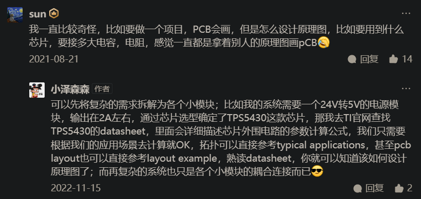

# Altium Designer

PCB设计、AD使用：熟练使用软件，不过更重要的是如何去设计一个电路，目标是成为PCB设计者，工程设计者。

AD软件学习目标：会画原理图、会画原理图元件；画PCB封装；PCB布线。

# 0.工程创建

PCB工程创建。

为工程添加：

- 原理图。（原理图只注重原理上的一个解释，注重各元件的连接）
- 原理图库（元件不需要和实物尺寸有什么关系，引脚什么的标好就行）。
- PCB。
- PCB库（关注元件实际的尺寸和引脚位置）。

# 1.画原理图库

元件库制作：

1. 元件形状，一般矩形、圆角矩形。
2. 放置元件引脚（管脚）。（鼠标所在那一侧是连接导线的那一头（鼠标所在的一端引脚朝外），另一侧是连接元件的，可用空格进行管脚旋转。）

# 2.画原理图

画原理图：

1. 新建工程和原理图
2. 放置元器件并设置好序号。
3. 摆放元器件，尽量美观，以对齐为原则。
4. 连线，适当微调保持美观。
5. 检查连线、检查元器件，最后再放大再看一遍。
6. finish。

错误：

总结：原理图库、原理图、封装管理器、错误处理。

# 3.画PCB封装库

完整的PCB封装包含：PCB焊盘、管脚序号、丝印、阻焊、标识。

快捷键的使用：

- `M`：精确移动或翻转界面的调出。
- `Ctrl + M `：测量距离。
- `Shift + C `：清除测量线。

封装方式：普通封装、使用IPC封装向导封装。画封装、画3D元件体。

封装库的调用。

# 4.画PCB

集成库：使用集成库的元件画原理图时，元器件的PCB和原理图已经绑定好了。

画PCB：

1. 原理图已经画好后，为工程添加一个PCB（也可以添加多个）。
2. 回到原理图，选择`工具 → 封装管理器`，可以看到元件PCB封装列表。选择`设计 → update xxx`，在出现的目标依次点击`验证变更`、`执行变更`就可以将PCB元器件以及元器件之间的连线导入到PCB中，就可以排线了。

